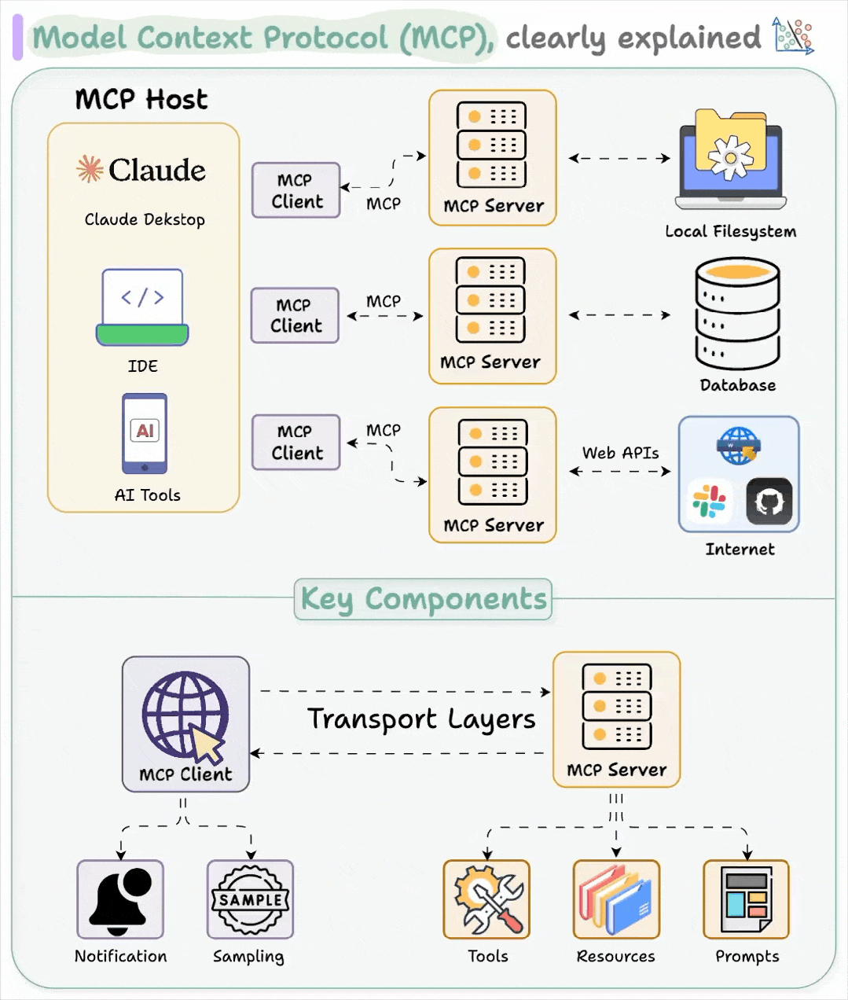
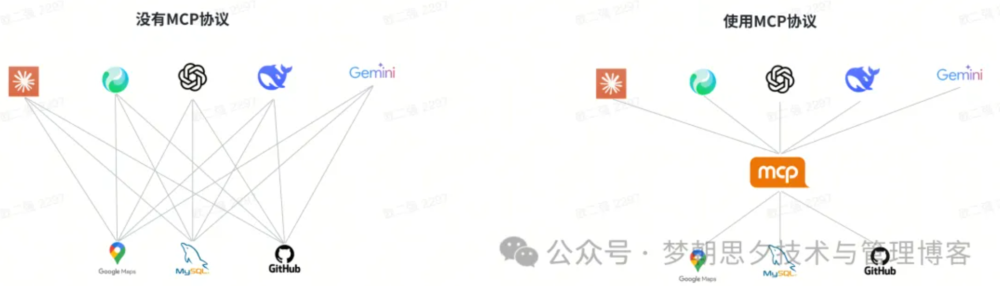
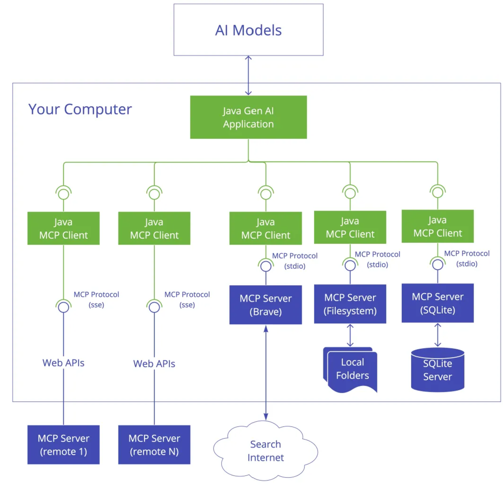
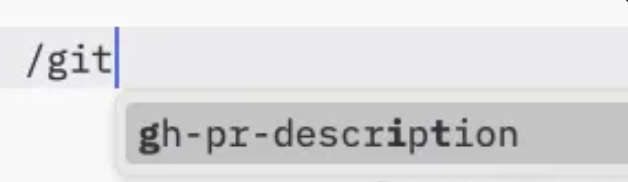
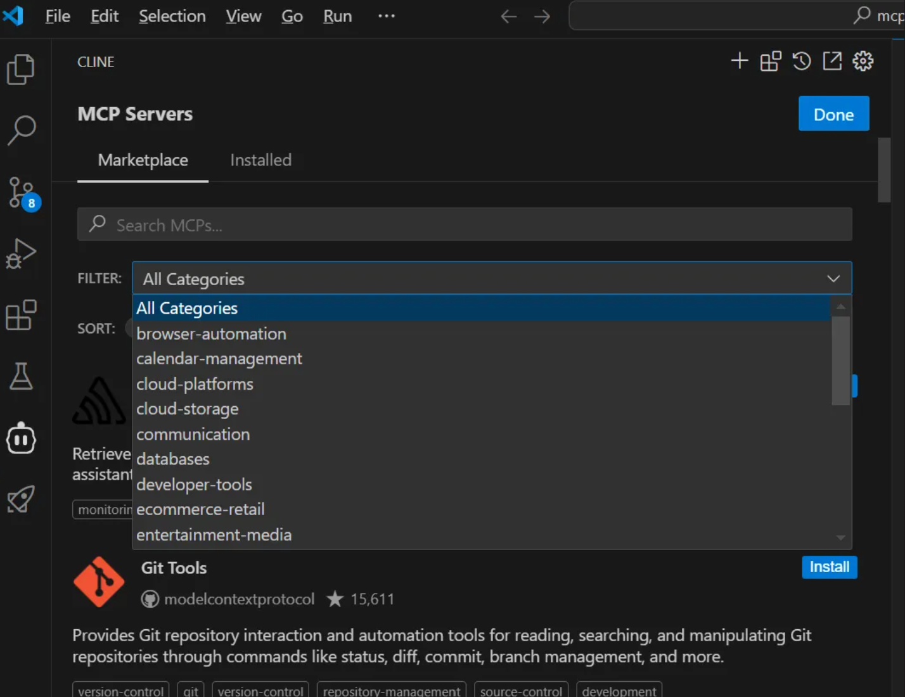
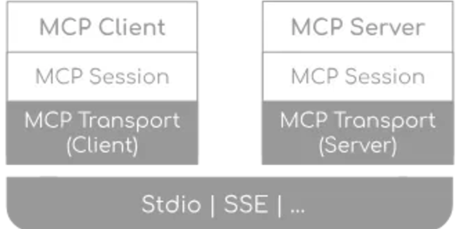

# MCP的背景、原理和开发

> - [一文读懂：模型上下文协议（MCP）](https://mp.weixin.qq.com/s/baBtZGVpMHNU7yoAwYbutg)
> - [AI助手要觉醒？揭秘RAG、Agent、MCP三大超能力如何让它无所不能！](https://mp.weixin.qq.com/s/-TnA9A2TgUUcG7hYWqbBnQ)
> - [万字长文，带你0到1理解Anthropic MCP](https://mp.weixin.qq.com/s/UyMH7gh-BC9ZJp9Z5kq8Uw)
> - [MCP不是 API](https://mp.weixin.qq.com/s/axNzt0jTd2xQKmCu6R444w)
> - [MCP 文档](https://modelcontextprotocol.io/introduction)
> - [给MCP祛魅](https://mp.weixin.qq.com/s/qtsxTC8_LioHUuZHQo5CoA)
> - [一文说清楚让LangChain大佬“开战”的MCP是什么](https://mp.weixin.qq.com/s/pqqvcVy6AshUUoxhyI_s1Q)
> - [快速上手：开发第一个MCP Server](https://mp.weixin.qq.com/s/7TaBJykV6gTxl2g5vEZGWA)

当代 AI 的组成部分

1. RAG：知识检索
2. Agent：思考决策
3. MCP：使用工具

> - 早上8点自动抓取新闻+行业数据生成简报（RAG发力）上午10点
> - 分析你的日程，把会议改到不堵车的时间段（Agent决策）下午3点
> - 登录公司系统导出报表，做成可视化图表（MCP连接）



## 背景

如何让大语言模型与外部系统交互，已经成为AI系统急需解决的问题。从2023年到现在，业界也有过多种尝试

1. 原始时代——**prompt转json**。优点就是可以很快的事项让大模型给出符合格式的结果。缺陷也是很大，就是不可靠。常遇到的比如json的key错误，json格式不对，时间格式不匹配。
2. 农耕时代——**Plugins**。2023年3月份，OpenAI 官方发布了重磅的「ChatGPT plugins」。也是大模型首次允许通过插件与外部应用交互的能力，也给了AI应用很大的想象。比如当前大模型都具备的实时信息检索，也是这个时候引入的
3. 铁器时代——**Function Calling**。2023年6月，OpenAI在GPT-3.5和GPT-4模型中首次引入Function Calling机制，赋予模型调用外部函数的能力，使其能够结合真实的数据或计算结果，而非单纯依赖模型自身的推理能力，这样不仅可以提高模型的可控性和准确性，还能让其更适应实际业务需求。Function Calling的意义在于让大模型结果闭环且可控，在大模型流程中加入函数能力，让其获取到外部数据，不必再自行幻想出来结果，并且结构化的输入给到大模型，输出的结果更加稳定。

> 但是，Function call，或者 Tools 使用，对很多开发者，就不用说一般用户了，尽管能用大模型来copilot，还是很不方便，网络访问，权限控制，流程控制，错误处理，可靠性，版本维护，升级改动，等等，一大堆事情都要去编程处理。而且，对不同的应用场景，可能还需要定制化

4. 蒸汽时代——**GPTs**。GPTs就类似于微信的小程序，它的底层实现，依然是基于Function call，做好的一个一个GPTs，用户可以选择使用哪一个。这儿的问题是，GPTs相当于是已经包装好的闭源应用，只能在OpenAI平台上使用，不开放，不是生态玩法（可能只是OpenAI生态）。你给OpenAI做了个GPT，对别的平台，你还得做一个，这样，对服务商，开发者，依然不方便，不利于市场拓展。
5. 电气时代——**MCP**。MCP 看到了Function call的开发和使用的复杂性，而且看到了GPTs的封闭和不开放性。此外，一个企业或者应用面对不同的大模型不同的系统如何快速集成到一起，一个个是开发Tools？这是一个重复且繁琐的工作。为此本文的主角——MCP协议诞生了。

业界开始关注如何让模型从“被动回答”转向“主动执行”。这一转变催生了对标准化协议的需求，类似软件工程中的 HTTP 或语言服务器协议（LSP）。LSP 的成功为开发工具提供了一个范例：通过统一的协议，编辑器与编程语言支持之间的集成从 NxM 问题简化为 M+N 问题，极大地提升了生态系统的协同效率。AI 领域同样需要类似的解决方案，以打破数据孤岛、简化集成流程。



与此同时，开源社区和企业对 AI 生态的互操作性提出了更高要求。Hugging Face 等平台推动了模型共享，而 LangChain 等框架尝试通过工具调用（Tool Calling）增强模型能力。然而，这些方案仍未解决根本问题：缺乏一个通用的、标准化的上下文传递机制。行业开始意识到，若没有统一的协议，AI 智能体（Agent）的潜力将难以全面释放。

模型上下文协议（MCP）正是在这一背景下由 Anthropic 于 2024 年 11 月正式推出并开源。设计初衷是创建一个开放协议，标准化 AI 模型与外部数据源及工具的交互方式，从而解决传统集成的碎片化问题。

MCP的好处是用这种形式开发的产品或应用，可以通过MCP Client的方式，嵌入到别的AI应用中，它们类似于开发中的组件，或库，或微服务，水都可以尽情的调用。这些MCP应用更新，升级，对这些新开发的AI应用都是无感的，这样，更利于Agent生态的开发。

针对MCP有几点需要注意：

1. Function Calling是大模型与外部数字世界的交互方式。MCP是MCP host(chatbot或者AI工具)与外部工具/资源之间的交互方式。
2. MCP比Plugins规范性更好，定义了清晰的数据格式、传输协议、身份验证方法等，能力也更强。
3. GPTs是OpenAI的应用市场，主要是给人使用的。MCP server主要是给AI使用的，不直接给人用
4. MCP不绑定任何厂商。Anthropic开源了MCP规范，并由社区驱动。当前与AI模型是一致的，开放性才是不断增长的系统，大家一起努力才可以把生态构建出来

## 基础

MCP 的灵感部分来源于 USB-C 的类比：如同 USB-C 通过统一接口连接多种设备，MCP 旨在为 AI 应用提供一个“即插即用”的上下文管理框架

更为准确而言，模型上下文协议（Model Context Protocol, MCP）的核心设计遵循客户端-服务器架构，这一架构允许一个宿主应用程序与多个服务器建立连接，通过标准化的接口（如基于 JSON-RPC 的通信）实现灵活的上下文传递与工具的灵活调用

> MCP本质还是一种C/S架构

Anthropic 在发布时提供了初步的规范和 SDK（如 Python 和 TypeScript），并开源了多个预构建的 MCP 服务器（如 Google Drive、GitHub 集成），以加速社区采纳。

MCP 的技术框架围绕三个关键组件构建：主机（Host）、客户端（Client）和服务器（Server）



- 主机（Host）指的是任何能够承载 AI 交互环境的应用程序，例如 Claude Desktop、Cursor 等主流 AI 工具。负责接收用户提问并与 AI 模型交互，充当容器和协调者：

- 1. 创建和管理多个客户端实例
  2. 控制客户端连接权限和生命周期
  3. 协调 AI/LLM 集成和采样
  4. 管理Clients之间的上下文聚合

- MCP 客户端（MCP Client）与服务器保持 1:1 连接的协议客户端。
  
  - 和每个 server 建立一个有状态的会话
  - 处理协议协商和能力交换
  - 双向路由协议消息
  - 管理订阅和通知
  - 维护 servers 之间的安全边界

- MCP 服务器（MCP Server）通过暴露特定的功能接口和数据访问能力，轻量级程序，每个程序都通过标准化模型上下文协议公开特定功能：
  
  - 通过 MCP 原语暴露resources、tools 和prompts
    - 工具（Tools）提供执行具体操作的能力，每个工具都有一个唯一的名称，并包括描述其架构的元数据。
    - 资源（Resources）向 LLMs 暴露来自不同数据源的内容和信息，例如企业内部数据库、云存储文件或实时 API 数据。每个资源都通过 URI 唯一标识，如：`file:///home/user/documents/report.pdf`。
    - 提示（Prompts），客户端可以发现可用的prompts，并提供参数自定义它们。通常，Prompts会通过用户在用户界面中发起的命令触发，这使得用户能够自然地发现和调用可用的提示。例如，通过斜杠命令：
    
  - 通过client 提供的接口请求sampling
  - 可以是本地进程或远程服务

## 应用场景

MCP 服务器可以支持不同的访问策略并且可以实现访问时进行身份验证，有效地充当AI模型和企业之间的门神。内部数据的获取和响应都是通过MCP服务器，类似数据网关，实时监控模型行为，发现异常（如数据泄露风险）时自动触发防护机制（如阻断敏感API调用）

> 军政、金融、医疗等强监管行业需对AI访问权限进行细粒度控制，例如限制模型仅读取脱敏数据或禁止写入关键系统。通过MCP的数据沙箱机制和权限审批流程，实现动态策略调整与操作审计，满足GDPR、HIPAA等法规要求。

AI模型对过去交互的记忆有限，因此在推理时提供相关的、实时的上下文至关重要。MCP服务器连接实时数据源（如OS Drive、Slack、数据库），确保AI响应基于最新信息（如客户最新订单、库存状态）。通过MCP资源功能加载专业文档（如法律条款、产品手册），提升AI在垂直领域的专业性（如法律咨询、技术支持）

> 在客服场景中，可以关联用户的信息（订单、兴趣、）和之前与客服的沟通内容，结合企业内的SOP，为用户解决问题。
>
> 在AI编码的场景中，AI模型可以通过MCP服务器获取git仓库的代码和接口文档、产品设计、方案设计甚至是编码规范，可以为程序员提供更好的编码提示和建议。

使用结构化格式传递信息避免歧义，可以更有效地指导AI模型推理。更可靠的知识源，结合结构化的数据上下文，AI模型就可以应用在要求可靠性更高的场景，比如医疗诊断。

MCP协议将会是AI模型和各个工具之间互联互动的桥梁。MCP如果成为了标准协议，将各个AI模型和丰富的工具和平台链接起来，打破信息孤岛，让AI的自动化升级为AI智能化。

> 用户反馈APP的一个bug上来后，AI模型自动根据Git 的MCP服务器，结合产品文档需求和用户描述，自动化实现bug修复并通过CI/CD MCP服务器实现服务上线。

MCP作为企业内部AI Agent的“数据总线”，整合CRM、MES等多系统数据，例如制造业AI Agent通过MCP协调IoT传感器与生产调度系统。

> 企业部署MCP驱动的虚拟助手，可统一响应员工IT支持、审批进度查询等需求，响应时效缩短至秒级。在医院，可通过MCP构建AI助手，实时分析患者病史并提醒医生药物相互作用风险。

在代码开发方面，开发人员可以利用大语言模型自动化编程，IDEs 通过 MCP 协议可以直接接入很多工具，如接入连接版本库的 MCP Server，就可以让 AI 自己写代码、创建仓库、Push 代码、创建 Issue、创建分支、创建 PR 等操作，全程无需离开聊天界面，开发人员仅需提出需求即可 。



## 协议

协议层处理消息框架、请求/响应链接和高级通信模式。具备有状态的连接和能力协商。



传输层处理客户端和服务器之间的实际通信，MCP所有传输均使用JSON-RPC 2.0 来交换消息。MCP 目前定义了两种标准的 client-server通信传输机制：stdio（标准输入输出）和基于 SSE 的 HTTP。此外，客户端和服务器也可以以可插拔的方式实现自定义传输机制

| 通信传输机制                                  | 部署方式       | 网络要求     | 场景                                                         | 应用       |
| --------------------------------------------- | -------------- | ------------ | ------------------------------------------------------------ | ---------- |
| Stdio transport  标准传输                     | 本地子进程     | 无需网络     | 本地开发高效实现同机通讯简单的流程管理                       | filesystem |
| HTTP with SSE transport  带有 SSE 传输的 HTTP | 独立服务器进程 | 需要网络连接 | 分布式部署、多客户端对于需要 HTTP 兼容性的场景使用 SSE考虑安全影响，包括身份验证和授权 | search     |

消息类型。所有在 MCP clients 和 servers 之间的消息必须遵循 JSON-RPC 2.0 规范，基于 **JSON-RPC 2.0**，确保消息格式结构统一。该协议定义了三种基本类型的消息：

| 消息类型      | 描述                 | 约束                                                         |
| ------------- | -------------------- | ------------------------------------------------------------ |
| Requests      | 用于具体操作的消息   | 必须包含唯一的 ID 和方法名称ID 不能为 null请求 ID 在同一会话中不得被请求者之前使用过 |
| Responses     | 请求的响应           | 必须包含与请求相同的 ID必须设置 result 或 error 之一。不得同时出现错误代码必须是整数 |
| Notifications | 单向消息，不需要回复 | 不得包含 ID                                                  |

### Request 

Requests可以从Client端或者Server端发起，其格式为：

```
{
  jsonrpc: "2.0";
  id: string | number;
  method: string;
  params?: {
    [key: string]: unknown;
  };
}
```

MCP Server中对请求需要做到：

1. 彻底验证输入，验证 JSON-RPC 格式
2. 使用类型安全架构
3. 妥善处理错误
4. 实施超时处置

Request 类型包括

| Request Method      | 发起方 | 响应方 | 描述                                                       |
| ------------------- | ------ | ------ | ---------------------------------------------------------- |
| initialized         | Client | Server | 初始化会话                                                 |
| tools-list          | Client | Server | 发现可用的工具                                             |
| tools/call          | Client | Server | 调用工具                                                   |
| resources/list      | Client | Server | 发现可用的资源                                             |
| resources/read      | Client | Server | 获取资源内容                                               |
| resources/templates | Client | Server | 发现可用的参数化资源                                       |
| resources/subscribe | Client | Server | 订阅特定资源，监听其变化事件                               |
| prompts/list        | Client | Server | 发现可用的提示词                                           |
| prompts/get         | Client | Server | 获取特定提示词                                             |
| roots/list          | Server | Client | 列出服务器有权访问的客户端文件系统根节点（暴露目录和文件） |
| sampling/create     | Server | Client | 启用服务器的AI生成能力（ sampling creation ）              |

initialized是非常重要的阶段，是MCP Client和MCPServer之间的第一次交互。类似HTTPS一样需要确认彼此协议版本的兼容性、交换和协商各自能力。Client 必须发送其支持的协议版本，如果server支持请求的协议版本，则必须以相同的版本进行响应。否则，server必须以其支持的其他协议版本进行响应。这应该是server支持的最新版本。

| 端     | 能力         | 描述                       |
| ------ | ------------ | -------------------------- |
| Client | roots        | 提供文件系统根目录的能力   |
| Client | sampling     | 支持LLM采样请求            |
| Client | experimental | 描述对非标准实验特性的支持 |
| Server | prompts      | 提供提示模板               |
| Server | resources    | 提供可读的资源             |
| Server | tools        | 公开可调用的工具           |
| Server | logging      | 发出结构化日志消息         |
| Server | experimental | 描述对非标准实验特性的支持 |

MCP还提供Prompt能力，可将重复使用的提示模板和工作流程放在Server以便Client使用。Prompts的主要价值是对Resource的内容进行解释，让LLMs能够更好的理解返回的数据，从而更好的完成任务。

### Response

Responses是对requests的回复，其格式为：

```
{
  jsonrpc: "2.0";
  id: string | number;
  result?: {
    [key: string]: unknown;
  }
  error?: {
    code: number;
    message: string;
    data?: unknown;
  }
}
```

MCP的核心就是将资源暴露给到AI模型，Response的类型是多种多样的，有文本、二进制文件、API等等。Server拥有的Responses如何让AI模型知道呢？这就需要Direct resources直连资源，MCP Server 通过esources/list 端点公开固定的资源列表，每个资源的属性包含：

```
{  
    uri: string;           // Unique identifier for the resource  
    name: string;          // Human-readable name  
    description?: string;  // Optional description  
    mimeType?: string;     // Optional MIME type
}
```

如果Server端的Responses的生成是动态资源，那么还可以通过Resource templates来支持。在实际中，Server的Resource并不会固定不变，而是时常变化，MCP提供了资源更新（Resource updates）机制：

| 机制类型            | 机制描述                                                     | 应用场景                                          | 核心特点                                                     |
| ------------------- | ------------------------------------------------------------ | ------------------------------------------------- | ------------------------------------------------------------ |
| 资源列表变更通知    | 服务器通过notifications/resources/list_changed通知客户端资源列表结构性变化 | 目录结构变动、新增资源类型等全局性更新            | 结构化变更推送客户端需主动拉取更新                           |
| 资源内容实时订阅    | 客户端通过resources/subscribe订阅资源，服务器通过notifications/resources/updated推送变更 | 日志文件追加、API数据刷新等动态内容更新           | 支持实时推送可随时取消订阅客户端主动拉取最新内容             |
| Streamable HTTP传输 | 新增流式传输协议，支持断点续传、无状态服务器及动态SSE升级    | 高并发场景、云平台部署、需要兼容CDN/API网关的场景 | 断点续传解决掉线问题无状态服务器降低部署成本兼容标准HTTP生态 |

现在AI模型已经知道Server有哪些资源了，还需要可以读取到这么Resource，就需要使用resources/read请求。

在MCP Server中对响应需要做到：

1. 对长时间操作使用进度标记，可逐步报告进度
2. 使用适当的错误代码，包含有用的错误消息和发生错误时清理资源
3. 不要泄露敏感信息并记录与安全相关的错误

### Notification

Notifications是从client 发送到server 或反向发送的，不需要回复。其格式为：

```
{
  jsonrpc: "2.0";
  method: string;
  params?: {
    [key: string]: unknown;
  };
}
```

## 例子：mcp-filesystem-server

本小节以github.com/mark3labs/mcp-filesystem-server 为例介绍MCP相关的消息类型。

初始化会话：initialized Request

```json
{
    "jsonrpc": "2.0",
    "id": 12,
    "method": "initialize",
    "params": {
        "protocolVersion": "1.0",
        "capabilities": {
            "roots": {
                "listChanged": true
            }
        },
        "clientInfo": {
            "name": "test-client",
            "version": "1.0.0"
        }
    }
}
```

Responses

```json
{
    "jsonrpc": "2.0",
    "id": 12,
    "result": {
        "protocolVersion": "2024-11-05",
        "capabilities": {
            "resources": {
                "subscribe": true,
                "listChanged": true
            },
            "tools": {
            }
        },
        "serverInfo": {
            "name": "secure-filesystem-server",
            "version": "0.4.1"
        }
    }
}
```

MCP Client从MCP Server得到所有工具（tools或function calls）的列表和描述，包括参数描述：tools/list  Request

```python
response = await self.session.list_tools()
available_tools = [
    {
        "name": tool.name,
        "description": tool.description,
        "input_schema": tool.inputSchema
    } for tool in response.tools
]
```

```json
{
    "jsonrpc": "2.0",
    "id": 12,
    "method": "tools/list",
    "params": {
        "cursor": "optional-cursor-value"
    }
}
```

Responses

```json
{
    "jsonrpc": "2.0",
    "id": 12,
    "result": {
        "tools": [
            {
                "description": "Create a new directory or ensure a directory exists.",
                "inputSchema": {
                    "type": "object",
                    "properties": {
                        "path": {
                            "description": "Path of the directory to create",
                            "type": "string"
                        }
                    },
                    "required": [
                        "path"
                    ]
                },
                "name": "create_directory"
            },
            {......}
        ]
    }
}
```

使用工具:tools/call Request

```python
# Execute tool call
result = await self.session.call_tool(tool_name, tool_args)
final_text.append(f"[Calling tool {tool_name} with args {tool_args}")
```

```json
{
    "jsonrpc": "2.0",
    "id": 12,
    "method": "tools/call",
    "params": {
        "name": "list_allowed_directories",
        "arguments": {
            "path": "/Users/ouerqiang/Downloads/1.txt"
        }
    }
}
```

Responses

```json
{
    "jsonrpc": "2.0",
    "id": 12,
    "result": {
        "content": [
            {
                "type": "text",
                "text": "Allowed directories:\n\n/Users/ouerqiang/project/gopath/src/github.com/mark3labs/mcp-filesystem-server (file:///Users/ouerqiang/project/gopath/src/github.com/mark3labs/mcp-filesystem-server)\n/Users/ouerqiang/Downloads (file:///Users/ouerqiang/Downloads)\n"
            }
        ]
    }
}
```

发现可用的资源：resources/list Request

```json
{
    "jsonrpc": "2.0",
    "id": 12,
    "method": "resources/list",
    "params": {
        "cursor": "optional-cursor-value"
    }
}
```

Responses

```json
{
    "jsonrpc": "2.0",
    "id": 12,
    "resources": [
        {
            "uri": "file://",
            "name": "File System",
            "description": "Access to files and directories on the local file system"
        }
    ]
}
```

此外，在MCP Server中，是通过类似Java的文档规范来定义和说明工具的，这样，MCP SDK可以通过这种方式来自动输出工具和描述列表的。

```python
@mcp.tool()
async def get_forecast(latitude: float, longitude: float) -> str:
    """Get weather forecast for a location.

    Args:
        latitude: Latitude of the location
        longitude: Longitude of the location
    """
```


## 资源站点

Model Context Protocol servers：https://github.com/modelcontextprotocol/servers

