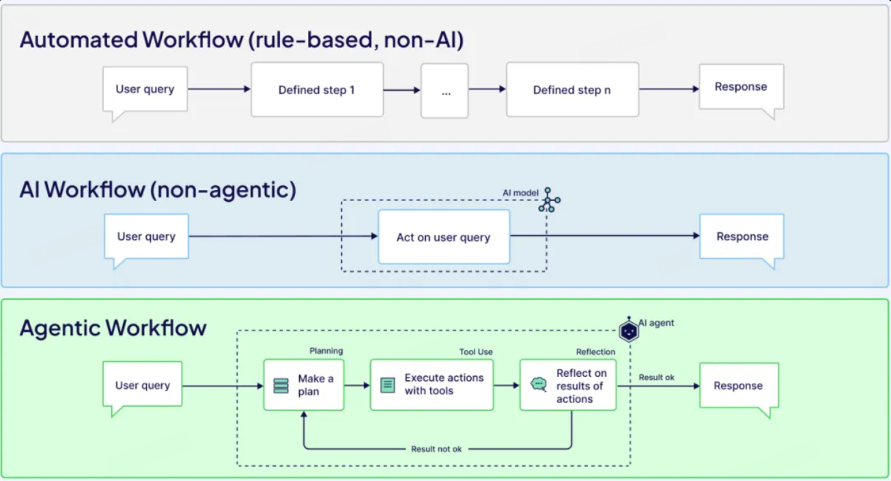
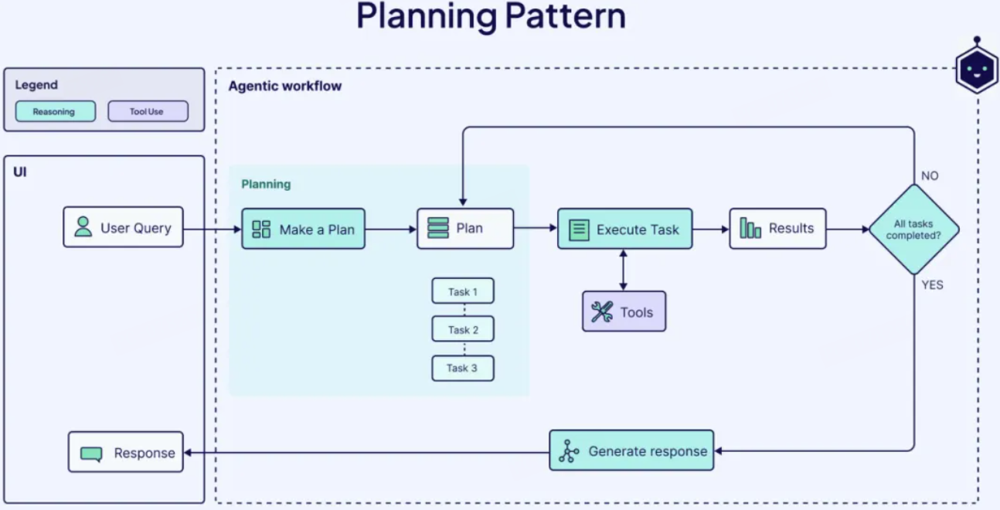
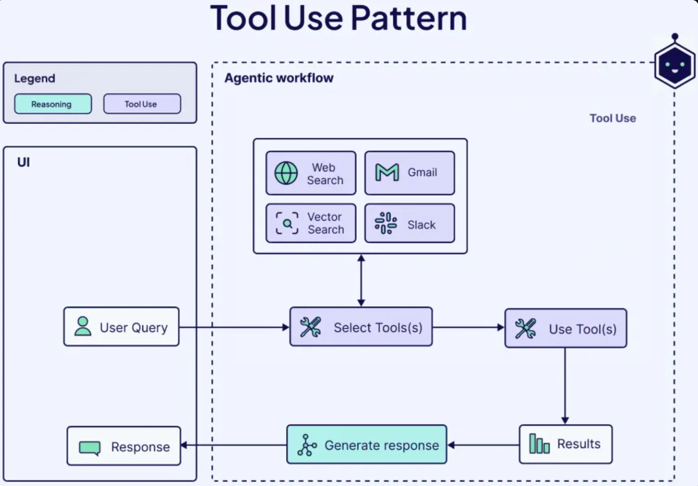
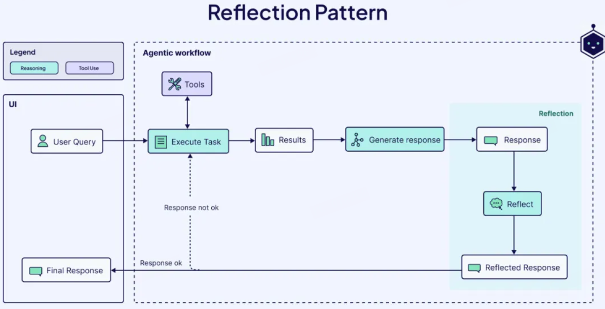
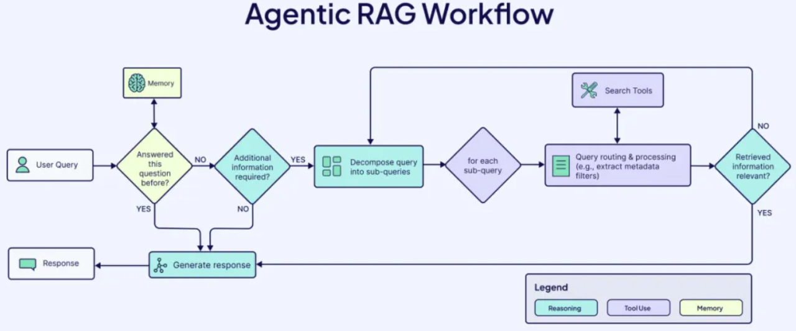

# Agentic Workflows

AI代理本身并无太多实际用途，只有通过赋予其角色、目标和结构，只有通过工作流，才能真正发挥作用。

## Agent

AI 代理是一种结合了大型语言模型（LLMs）的推理与决策能力，以及现实世界交互工具的系统，使其能够在有限的人类干预下完成复杂任务。代理被赋予特定的角色，并拥有不同程度的自主性来实现最终目标。它们还具备记忆能力，能够从过去的经验中学习，并随着时间的推移提升性能。

组件包括：

AI 代理的强大之处在于其迭代推理能力，即在整个问题解决过程中持续“思考”。推理能力主要来自底层 LLM，并发挥两个核心作用：规划（Planning）和反思（Reflecting）。

- **规划（Planning）**：代理会分解任务（Task Decomposition），将复杂的问题拆解为更小、更可执行的步骤。这样可以让代理系统地执行任务，并根据不同需求选择不同的工具。此外，代理还能进行**查询分解**（Query Decomposition），即将复杂查询拆解成更简单的子查询，以提高 LLM 响应的准确性和可靠性。

- **反思（Reflecting）**：代理会回顾自身的行动结果，并基于结果与外部数据进行调整，以优化后续决策。

由于 LLM 仅限于其训练时获得的知识（**静态的参数化知识**），为了扩展其能力，AI 代理可以借助外部工具，如：

| 工具类型      | 作用            |
| --------- | ------------- |
| **互联网搜索** | 获取和总结实时信息     |
| **向量搜索**  | 检索和总结外部数据     |
| **代码解释器** | 运行 AI 代理生成的代码 |
| **API**   | 访问外部服务、执行特定任务 |

当 LLM 选择合适的工具来完成任务时，它会执行**函数调用（Function Calling）**，从而扩展自身能力，超越单纯的文本生成，实现对现实世界的交互。

工具的选择可以由**用户预先定义**，也可以由代理**动态决定**。动态选择工具有助于解决复杂任务，但对于简单工作流，预定义工具可能更高效。

AI 代理的**记忆能力**是代理工作流区别于纯 LLM 工作流的重要特征之一。记忆允许代理在多个用户交互和会话中存储**上下文和反馈**，从而实现更**个性化**的体验，并**优化长期表现**。

AI 代理的记忆可分为两种：

- **短期记忆（Short-term Memory）**：存储最近的交互信息，如对话历史，帮助代理决定下一步行动。

- **长期记忆（Long-term Memory）**：存储长时间累积的信息，跨会话学习，以实现个性化和持续优化。

## 工作流

**工作流（Workflow）** 指的是一系列**相互关联的步骤**，旨在完成特定任务或目标。最简单的工作流是**确定性的（Deterministic）**，即它们遵循预定义的步骤序列，无法适应新信息或变化的环境。

> 例如，一个自动化的报销审批工作流可能如下所示：如果费用标签为“餐饮”，且金额小于$30，则自动批准。

一些工作流利用大型语言模型（LLMs）或其他机器学习模型来增强其能力。这些通常被称为 AI 工作流，可分为代理型（Agentic）和非代理型（Non-Agentic）两种：

- **非代理型 AI 工作流**：LLM 根据输入的指令生成输出。例如，**文本摘要**工作流的流程可能是：接收长文本 → 让 LLM 进行总结 → 输出摘要。这种流程仅仅依赖 LLM 的文本处理能力，并不具备自主决策或任务执行能力，因此不属于代理型工作流。

- **代理型 AI 工作流**：由一个或多个**AI 代理（Agents）动态执行**一系列步骤，以完成特定任务。代理在用户授予的权限范围内，具备一定程度的**自主性**，可以收集数据、执行任务，并做出实际决策。此外，代理型工作流利用 AI 代理的**推理能力、工具使用能力和持久记忆能力**，使传统工作流**更具响应性、适应性和自我进化能力**

> 区别主要体现在：
> 
> - **AI 工作流 vs. 传统工作流**：AI 工作流依赖 AI 模型，而传统工作流依赖预定义步骤。
> 
> - **代理型 vs. 非代理型 AI 工作流**：代理型 AI 工作流使用**动态 AI 代理**，而非代理型 AI 工作流只是使用静态 AI 模型处理任务。

一个 AI 工作流要成为**代理型工作流**，至少需要具备以下三个核心特点：

1. **制定计划（Make a plan）** 代理型工作流从**规划**开始。LLM 负责**任务分解（Task Decomposition）**，将复杂任务拆解为更小的子任务，并确定最佳执行路径。

2. **使用工具执行任务（Execute actions with tools）** 代理型工作流使用一系列**预定义工具**（如 API、数据库、搜索引擎等），并配合相应的**权限管理**，以执行任务并实施规划方案。

3. **反思和迭代（Reflect and iterate）**  代理可以在每个步骤评估结果，如有必要调整计划，并反复执行，直到得到满意的结果。

我们可以区分三种不同类型的工作流：

| **类型**          | **特点**                     |
| --------------- | -------------------------- |
| **传统非 AI 工作流**  | 依赖固定规则，按照预设步骤执行，无法适应变化。    |
| **非代理型 AI 工作流** | 使用 LLM 执行任务，但不具备动态决策或自主性。  |
| **代理型 AI 工作流**  | 通过 AI 代理动态执行任务，具备适应性和决策能力。 |

> 随着新技术的发展，相关术语也在不断增加。尽管有些人会混用“代理架构（Agentic Architectures）”和“代理工作流（Agentic Workflows）”，但二者实际上有明显区别。
> 
> - **代理工作流** 关注**任务执行的流程**，即代理如何分解任务、使用工具、调整策略等。
> 
> - **代理架构** 关注**系统设计**，即如何构建一个包含代理、工具和记忆系统的整体框架。

## Agent工作流模式

### 规划模式（Planning Pattern）

使代理能够自主地将复杂任务拆解为一系列更小、更简单的子任务，这一过程称为任务分解。**任务分解能够提高工作流的质量**，具体来说它可以：降低 LLM 的认知负荷，减少其计算压力；提升推理能力，增强问题解决能力；减少幻觉（Hallucination）和其他不准确性，提高输出的可靠性。

规划模式在**目标达成路径不明确**且**需要灵活适应问题解决过程**的情况下尤其有效。

> 例如：当 AI 代理被指示**修复软件 bug** 时，它可能会按照如下方式**分解任务**：阅读 bug 报告、识别相关代码片段、生成可能的错误原因列表、选择合适的调试策略、运行修复代码并观察错误信息，若失败则调整方案。

虽然规划模式有助于代理更好地解决复杂任务，但它可能导致比确定性工作流更不可预测的结果。因此，**规划模式适用于需要深入推理和多步推理的任务**。

### 工具使用模式（Tool Use Pattern）

生成式 LLM 具有一个显著的局限性：它们只能基于**已有的训练数据**进行回答，无法**实时检索信息**或**验证事实**。因此，LLM 可能会：生成错误信息（“幻觉”）并且在遇到不确定问题时“猜测”答案。

针对这个问题，可以通过RAG来解决，即通过提供相关的、实时的外部数据来增强 LLM 的响应准确性，但它仅限于数据检索，而非与外部环境的动态交互。

**工具使用模式** 则进一步拓展了代理的能力，使其能够与外部系统动态交互，而不仅仅是被动地检索数据。**工具使用模式适用于需要实时数据支持或依赖外部资源的任务**，例如：在网页上搜索最新新闻；从数据库中获取用户历史记录；自动发送电子邮件。以下列举一些常用的工具及用途。

| **工具**      | **用途**          |
| ----------- | --------------- |
| API         | 访问外部服务，执行任务     |
| 信息检索（如向量搜索） | 获取外部数据库中的相关信息   |
| Web 浏览器     | 进行网络搜索，获取最新信息   |
| 机器学习模型      | 调用外部 AI 模型，增强能力 |
| 代码解释器       | 运行代码，实现自动化计算    |

### 反思模式（Reflection Pattern）

**反思模式** 是一种自我反馈机制，代理在采取最终行动前，会**迭代评估自己的输出质量或决策**，并据此优化自身的推理过程。这个过程可以帮助代理：**纠正错误**，减少不准确性；**持续改进**，提高决策质量；**增强适应性**，更好地满足用户需求。

反思模式对于那些**一次执行难以成功**的任务特别有用，例如**代码生成**：

1. 代理**生成代码片段**；

2. 在**沙盒或执行环境中运行代码**；

3. **获取错误信息**，并将其反馈给 LLM；

4. 让 LLM **迭代优化代码**，直到成功执行。

反思的力量在于代理能够批评自己的输出并将这些见解动态地整合到工作流程中，从而实现持续改进而无需直接人工反馈。这些反思可以编码在代理的内存中，从而允许在当前用户会话期间更有效地解决问题，并通过适应用户偏好实现个性化并改善未来的交互。

## Agent工作流应用

Agentic RAG：代理RAG 在 RAG 流程中引入一个或多个 AI 代理，使其更加智能和动态。具体来说：

- 在**规划阶段（Planning Phase）**：代理可以**将复杂查询拆解为更小的子查询**（查询分解，Query Decomposition）并**判断是否需要向用户请求额外信息**以更精准地完成任务。

- 在**数据检索和评估阶段**：代理可以**评估检索到的数据的相关性和准确性**，避免提供无用或错误的信息。当查询结果不满意，代理可以**重新调整查询**，回到查询分解阶段，甚至**制定新的查询方案**。

------

**代理研究助手（Agentic Research Assistants）**，有时也被 AI 公司称为“深度研究（Deep Research）”，用于生成深入的报告和复杂主题的详细见解。它们基于**代理 RAG**，但不仅仅是检索信息，还能**分析和综合数据**，提供更有深度的结果。

| **特点** | **传统 RAG**  | **代理研究助手**     |
| ------ | ----------- | -------------- |
| 信息获取   | 仅从外部数据源检索信息 | 检索 + 分析 + 综合信息 |
| 查询适应性  | 查询固定，不会动态调整 | 能根据任务调整查询方案    |
| 用户交互   | 只返回查询结果     | 可主动请求用户澄清需求    |
| 计划调整   | 无适应能力       | 可改变检索方向，挖掘新信息  |
| 数据整合   | 仅提供单一查询结果   | 合并多源数据，发现趋势    |

具体来说：代理研究助手通常使用**专门针对网页浏览、任务分解和动态规划**微调过的 LLM；并能够**主动请求用户提供额外信息**，以更清晰地理解任务目标；结合**根据检索到的信息调整研究方向**，探索新的角度，确保获取完整的数据。

代理研究助手不仅检索信息，还能识别趋势，形成系统化见解；除此之外，它还能够跨时间段分析数据，编写详细的研究报告；提高研究人员的效率，减少人工查找和分析的时间。当前，**OpenAI、Perplexity 和 Google** 都已推出各自的**深度研究**产品。

------

**代理编码助手（Agentic Coding Assistants）** 可以在**最少的人为干预**下完成**代码生成、重构、优化和调试**，支持创建 PR 和提交代码，提升团队协作效率。相比之下，非代理型编码助手（如 GitHub Copilot 的早期版本）仅限于**代码生成**，缺乏环境交互和自适应能力。

代理编码助手的核心特性具备以下几点：

1. **执行与自我改进**：不仅能**生成代码**，还可以**执行代码**并基于错误信息迭代优化。

2. **代码库管理权限**：代理可以**创建提交（Commits）和 PR（Pull Requests）**，自动化软件开发流程。（如**Anthropic Claude Code**）。代理可**在执行前征求用户确认**，确保**人类掌控**关键决策。（如**Cursor 的 Agent**）。

3. **长期记忆（Long-term Memory）**：代理能够**记住错误并自我改进**，在未来的任务中表现得更加智能。

