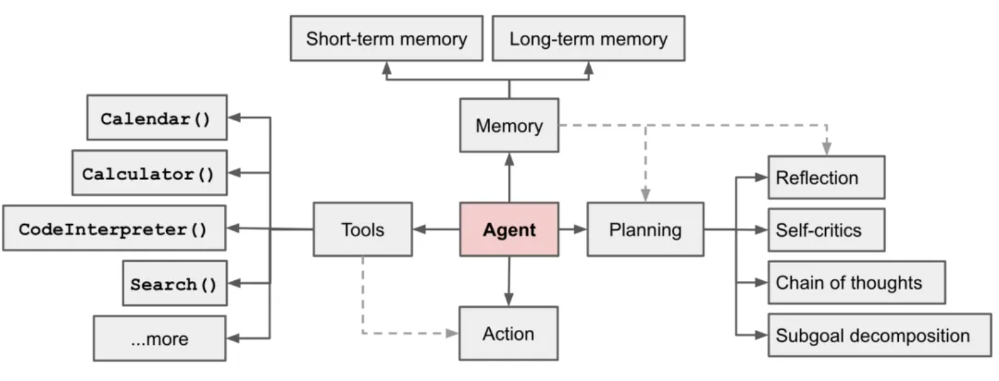
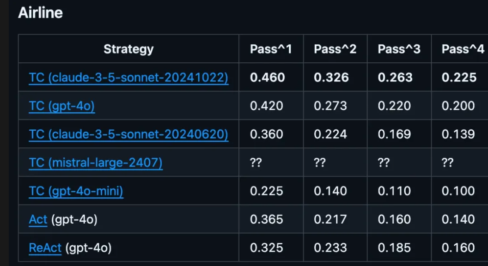

# Agent 历史与背景

## Agent发展的五重境界

**第一阶段：工具型agent框架 (Tool-based Agent Frameworks)**

工具型agent框架是在ChatGPT横空出世后同时期出现的，当时LLM刚刚展现出强大的文本生成能力，但其应用仍局限于纯文本环境，prompt engineering初步发展。为了实现语言模型与外部工具的基础连接机制，开发者们采用了预定义工具集、简单决策树、基本记忆管理实现了有限的自主性，代表性工作有**LangChain、BabyAGI、AutoGPT早期版本等。**

局限：LLM被限制在“笼子”里，严重依赖人工定义的工具和流程，灵活性低。

------

**第二阶段：认知型agent (Cognitive Agents)**

认知型agent的发展伴随着更强大语言模型如GPT-4的出现。这一阶段的关键驱动因素包括：新一代LLM的推理、规划和反思能力初见端倪，**思维链(Chain-of-Thought)技术取得初步突破，**使模型能够展示详细推理过程。开发者们通过适当设计的prompt和反馈循环，让LLM展现出初步的语言模型可以展现出初步的规划能力、反思机制、内部思维过程和自我修正。这个时期的典型代表工作有**ReAct框架、Reflexion系统、Inner Monologue代理。**

局限：环境交互能力有限，主要在思维层面运作，**推理深度受限，**复杂推理链中仍然存在"走神"和逻辑断裂问题，**自我修正能力不稳定难以维持长期目标，**在延伸任务中容易偏离原始目标。

------

**第三阶段：环境交互agent (Environment-Interacting Agents)**

环境交互agent的发展始于2023年中，这一时期的关键技术驱动包括**多模态模型的突破，**GPT-4V让agent能够"看见"环境了，**浏览器自动化技术**提供了与网络环境交互的标准化接口，开发者们开始尝试让agent去做一些界面理解、环境导航、执行复杂操作序列等任务。这个时期的代表工作有**AutoGPT高级版、BrowserGPT、Adept ACT-1、Open Interpreter等。**

**局限**：通常专注于特定领域，缺乏跨域集成能力。

------

**第四阶段：自主agent (Autonomous Multimodal Agents)**

自主agent的发展始于2024年初，这一阶段的关键驱动因素包括**多模态大模型的普及，长上下文窗口的突破，**支持数十万甚至数百万token的上下文窗口长度，agent开发工具和平台趋于成熟。开发者们开始探索真正具有自主性的agent系统，能够实现高级规划架构、动态环境适应、长期目标维持和自适应学习。这个时期的代表工作有**Devin、OpenHands等。**

局限：资源消耗大，稳定性和一致性挑战。

------

**第五阶段：端到端通用agent (End-to-End General Agents)**

在发布Deep Research后OpenAI团队在接受采访时提到Deep Research是o3模型的强化微调版本，它是一个端到端agent。o1之后大模型行业全面步入reasoning model时代，**基础模型能力持续提升，**越来越强大的基础模型内化了更多能力，agent可以无需专门框架支持，完全自主地规划和执行，能持续学习和自我改进能力，能够自主设定和调整目标，它最终将成为AGI的实际应用形式。

## Agent 四要素

**Planning**

Planning目前是四要素中发展最快的能力，**o1、R1的突破让**大语言模型展现出内生的思维链（Chain-of-Thought）能力，可以针对复杂任务生成多步流程，不依赖于提示工程和模板，以及手工编写规则或有限的决策树。

- **规划（Planning）**：代理会分解任务（Task Decomposition），将复杂的问题拆解为更小、更可执行的步骤。这样可以让代理系统地执行任务，并根据不同需求选择不同的工具。此外，代理还能进行**查询分解**（Query Decomposition），即将复杂查询拆解成更简单的子查询，以提高 LLM 响应的准确性和可靠性。

- **反思（Reflecting）**：代理会回顾自身的行动结果，并基于结果与外部数据进行调整，以优化后续决策。

未来的技术演进方向：

1. 自适应与动态规划：未来 agent 将朝着能根据环境和任务变化自动进行实时重规划的方向演进，具备自我纠错和动态调整策略的能力。
2. 层次化Planning：构建多层次规划结构，整合微观决策和宏观规划，实现全局与局部的协同优化。

------

**Memory**

AI 代理的**记忆能力**是代理工作流区别于纯 LLM 工作流的重要特征之一。记忆允许代理在多个用户交互和会话中存储**上下文和反馈**，从而实现更**个性化**的体验，并**优化长期表现**。

AI 代理的记忆可分为两种：

- **短期记忆（Short-term Memory）**：存储最近的交互信息，如对话历史，帮助代理决定下一步行动。

- **长期记忆（Long-term Memory）**：存储长时间累积的信息，跨会话学习，以实现个性化和持续优化。

对大模型在 Memory 方面的研究主要聚焦于RAG和长上下文窗口技术，长上下文在过去两三年里已经取得了显著的进展，不过相对于多模态、agent以及reasoning等高阶能力的迫切需求，目前的窗口长度还是远远不够，不然就不会出现大模型在解决长逻辑链深度推理和视频生成一致性上的捉襟见肘，肉眼可见各大模型厂商在 Memory 领域的投入势必会持续加码。

同时，市场上也出现了一些专注于 Memory 中间件的创业公司，如 Mem0、Letta 等，试图为解决长期记忆提供一些解决方案。未来我们仍需解决长期记忆内嵌与持久化、动态记忆管理与智能检索，以及多模态记忆整合等问题，最佳路径仍是通过模型内化来解决。

------

**Tool use & Action**

由于 LLM 仅限于其训练时获得的知识（**静态的参数化知识**），为了扩展其能力，AI 代理可以借助外部工具，如：

| 工具类型       | 作用                       |
| -------------- | -------------------------- |
| **互联网搜索** | 获取和总结实时信息         |
| **向量搜索**   | 检索和总结外部数据         |
| **代码解释器** | 运行 AI 代理生成的代码     |
| **API**        | 访问外部服务、执行特定任务 |

当 LLM 选择合适的工具来完成任务时，它会执行**函数调用（Function Calling）**，从而扩展自身能力，超越单纯的文本生成，实现对现实世界的交互。

工具的选择可以由**用户预先定义**，也可以由代理**动态决定**。当前的agent系统通常预先集成了一组工具或 API，能根据任务需求调用特定外部服务来完成搜索、数据查询、翻译等任务，还不能够根据任务需求动态选择和灵活组合工具。动态选择工具有助于解决复杂任务，但对于简单工作流，预定义工具可能更高效。

衡量模型理解用户意图调用工具执行命令能力的测试集叫**TAU-bench**，用于评估 AI Agent 在现实世界场景中性能和可靠性的基准测试。TAU-bench 设计了两个领域场景TAU-bench(Airline)，模拟用户在航空业务场景下进行航班查询、预订、改签、退票、机场服务等操作，和TAU-bench(Retail)，模拟在零售场景中进行购物咨询、商品推荐、订单修改、退货换货等操作。

目前agentic能力最强的Claude 3.7 在零售领域问题解决率为81%，航空领域只有58%，航空领域一些 case 涉及非常多的查询、匹配航班信息、金额计算、行李/支付/退换多步操作，难度还是很大的。另外这个测试集还定义了一个pass^k 的指标，即多次稳定通过的概率，可以看到每个模型的稳定性都不是很好，所以并不能期望它在复杂的场景、多轮交互中很稳定地理解意图做出正确的行动，这是现状。

在agent四要素中，tool use和take action能力发展确实滞后其他两个要素，让模型发展脑子更容易，让模型长出手和脚更难。大模型的能力发展次序与我们人类是相反的，我们出生后先发展自己的身体，学会走路，学会用手操作，再识字学知识，再发展高层逻辑思维能力。模型是先学知识，然后发展思维能力，然后再学会computer use，最后才是物理世界的具身。

未来的技术演进方向：从目前看模型的tool use和take action能力都是离散和独立的调用，也就是说任务决策和具体执行往往是分开的过程，只有OpenAI Deep Research是连续动态决策，它会根据每一次搜索结果实时调整下一次搜索方向，它是边搜边想、边想边搜，不断接近目标，直至问题解决，这是端到端RL带来的好处。更进一步地，我们希望模型未来能够根据环境反馈实时调整行动策略，能够自主学习和迭代工具调用，甚至能发现并整合新的外部工具接口。

## 展望

我们希望模型不只是“缸中之脑”，而能成为一个完全自主的系统，在较长时间内独立运行，并能完成复杂任务。**在agent的五个发展阶段中，agent的每一次重要进展都是由模型能力迭代带来的。**

> o1发布后OpenAI研究科学家Noam Brown的演讲视频流出，他谈到workflow是all structure-based things，它只有短期价值没有长期价值，最终会被模型inherent capabilities取代，我们要做的就是让模型像人一样思考，to think freely！
>
> Anthropic也发布了一篇关于如何建立有效Agent的博客，提到workflow和agent是两种不同的架构，workflow是通过预定义的代码路径编排LLM和工具的系统，而agent是LLM动态指导自己的过程和工具使用的系统，保持对它们如何完成任务的控制。

我们不需要构建agent系统，因为这些抽象层可能会掩盖底层的提示和响应，建议开发人员从直接使用LLM API开始。这些都告诉我们，模型能力已经发展到我们可以通过激发它的内在能力去解决实际问题的时候了。

> OpenAI Deep Research就是o3做reinforcement fine-tuning得到的模型，它也是agent，它也是产品。

今天reasoning model的正确使用方式已经不再是借助哪些prompt模板了，你不必再step by step地教它了，你应该描述清楚任务和目标，让模型自己去thinking去输出CoT，也就是说你定义好任务的起点和终点，中间的trajectory让模型自己去搜索。

你可以给它一些引导，或者在中间节点给一些reward，或者在关键步骤增加verifier，最终它会既达成你给的objective（目标），又保持相当的generalization（泛化性）。

当然有人会说那这样的话，能力都是模型的，应用层就没有壁垒了呀。但是把模型的能力adapt到你的场景里本身就是壁垒。丝滑地整合应用就是优秀的 agent

> 如果未来有一天具备博士能力的模型API唾手可得且价格便宜，你觉得你就有能力用好它了吗？如果你招了个博士进来，你也要花很长时间跟他磨合，跟他align你的目标、愿景、价值观，才能把他的能力为我所用。毕竟我们的工作场景不是数学题，没有标准答案，你的guideline怎么给，你的reward怎么给都是技术活，你还得经常跟它对齐，防止它投机取巧或者跟你目标不一致。你觉得培养一个听话出活的骨干员工容易吗？那你凭什么认为驾驭一个模型就容易呢？
>
> 最近引发大家热烈关注的Manus，他们的团队一直在提这个理念：Less structure, more intelligence，这是一种非常美的技术哲学。Monica团队最开始先从chrome浏览器插件开始，在ChatGPT爆火后在web端获得了流量，之后发展成产品矩阵，做了一系列套壳工具，在这个过程中积累了宝贵的数据，之后又尝试了AI浏览器，但因觉得不是AI原生的交互方式而放弃，最终成功转型agent产品。他们用Qwen post-train了一些小模型，恰好弥补了大模型的一部分能力不足，使得agent在执行端效果上了一个台阶。
>
> Jina AI写了一篇文章，里面提到“如果你是OpenAI，你当然可以花钱请专家给你标注数据，然后端到端做微调，如果你没有那么多钱，你也可以手搓产品，把它当成数据标注器。如果未来模型再进步，那这些positive practice和failure case数据就是reward”

也许有人会说如果我不是deepseek团队，训不了前沿模型，我也不是Monica、Jina团队，做不出好产品，那我该怎么办呢？那你就尽可能地把你的业务数字化、在线化，收集experience data存下来，如果你相信技术的力量，相信模型迭代的速度，那你应该相信迟早有一天它们会有用，那时你只管给reward，剩下的交给模型。
