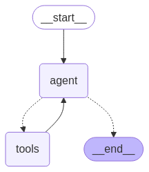
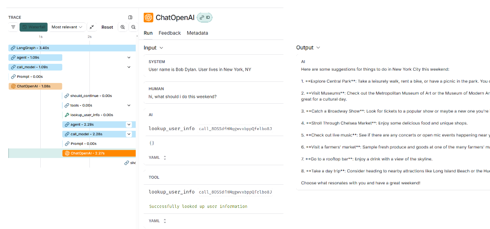

# 工具与运行时的值

有时，您希望让工具调用LLM填充工具函数参数的子集 ，并在运行时为其他参数提供其他值。核心技术是将参数注释为 “injected”，这意味着它将由您的程序注入，并且不应由 LLM 提供

## 工具访问图形状态

我们希望我们的工具将图形状态作为输入，但我们不希望模型在调用工具时尝试生成此输入。我们可以使用 InjectedState 注解将参数标记为必需的图形状态（或图形状态的某个字段）。这些参数不会由模型生成。使用 ToolNode 时，图形状态将自动传递给相关工具和参数。

在此示例中，我们将创建一个返回 Documents 的工具，然后创建另一个实际引用证明声明合理的 Documents 的工具。

```python
from typing import List, Tuple
from typing_extensions import Annotated

from langchain_core.messages import ToolMessage
from langchain_core.tools import tool
from langgraph.prebuilt import InjectedState


@tool
def get_context(question: str, state: Annotated[dict, InjectedState]):
    """Get relevant context for answering the question."""
    return "\n\n".join(doc for doc in state["docs"])
```

如果我们查看这些工具的输入架构，我们将看到 state 仍然列出：

```python
from pprint import pprint

pprint(get_context.get_input_schema().model_json_schema())
```

    {'description': 'Get relevant context for answering the question.',
     'properties': {'question': {'title': 'Question', 'type': 'string'},
                    'state': {'additionalProperties': True,
                              'title': 'State',
                              'type': 'object'}},
     'required': ['question', 'state'],
     'title': 'get_context',
     'type': 'object'}

但是，如果我们查看工具调用架构，即传递给模型进行工具调用的内容， 则 state 已被删除：

```python
pprint(get_context.tool_call_schema.model_json_schema())
```

    {'description': 'Get relevant context for answering the question.',
     'properties': {'question': {'title': 'Question', 'type': 'string'}},
     'required': ['question'],
     'title': 'get_context',
     'type': 'object'}

## 完整示例

```python
from typing import List

# this is the state schema used by the prebuilt create_react_agent we'll be using below
from langgraph.prebuilt.chat_agent_executor import AgentState
from langchain_core.documents import Document
from langchain_openai import ChatOpenAI
from langgraph.prebuilt import ToolNode, create_react_agent
from langgraph.checkpoint.memory import MemorySaver

class State(AgentState):
    docs: List[str]

model = ChatOpenAI(
    model="gpt-4o-mini",
)
tools = [get_context]

# ToolNode will automatically take care of injecting state into tools
tool_node = ToolNode(tools)

checkpointer = MemorySaver()
graph = create_react_agent(model, tools, state_schema=State, checkpointer=checkpointer)
```

```python
from IPython.display import Image, display

try:
    display(Image(graph.get_graph().draw_mermaid_png()))
except Exception:
    # This requires some extra dependencies and is optional
    pass
```



```python
docs = [
    "FooBar company just raised 1 Billion dollars!",
    "FooBar company was founded in 2019",
]

inputs = {
    "messages": [{"type": "user", "content": "what's the latest news about FooBar. Before you call a tool, explain why you will call it."}],
    "docs": docs,
}
config = {"configurable": {"thread_id": "1"}}
for chunk in graph.stream(inputs, config, stream_mode="values"):
    chunk["messages"][-1].pretty_print()
```

    ================================ Human Message =================================
    
    what's the latest news about FooBar. Before you call a tool, explain why you will call it.
    ================================== Ai Message ==================================
    
    To find the latest news about FooBar, I will call the tool that retrieves relevant context. This will help me access up-to-date information or recent developments related to FooBar. It's essential to use this tool to ensure that the information is accurate and current, especially if there have been recent events or announcements. 
    
    Now, I will proceed with the tool call.
    Tool Calls:
      get_context (call_o0F97me0n5oeOpO3NScnk3d5)
     Call ID: call_o0F97me0n5oeOpO3NScnk3d5
      Args:
        question: latest news about FooBar
    ================================= Tool Message =================================
    Name: get_context
    
    FooBar company just raised 1 Billion dollars!
    
    FooBar company was founded in 2019
    ================================== Ai Message ==================================
    
    The latest news about FooBar is that the company has just raised 1 billion dollars. It was founded in 2019.

## 更新状态

一个常见的用例是从工具内部更新图形状态。例如，在客户支持应用程序中，您可能希望在对话开始时查找客户账号或 ID。

```python
USER_INFO = [
    {"user_id": "1", "name": "Bob Dylan", "location": "New York, NY"},
    {"user_id": "2", "name": "Taylor Swift", "location": "Beverly Hills, CA"},
]

USER_ID_TO_USER_INFO = {info["user_id"]: info for info in USER_INFO}
```

```python
from langgraph.prebuilt.chat_agent_executor import AgentState
from langgraph.types import Command
from langchain_core.tools import tool
from langchain_core.tools.base import InjectedToolCallId
from langchain_core.messages import ToolMessage
from langchain_core.runnables import RunnableConfig

from typing_extensions import Any, Annotated


class State(AgentState):
    # updated by the tool
    user_info: dict[str, Any]


@tool
def lookup_user_info(
    tool_call_id: Annotated[str, InjectedToolCallId], config: RunnableConfig
):
    """Use this to look up user information to better assist them with their questions."""
    user_id = config.get("configura ble", {}).get("user_id")
    if user_id is None:
        raise ValueError("Please provide user ID")

    if user_id not in USER_ID_TO_USER_INFO:
        raise ValueError(f"User '{user_id}' not found")

    user_info = USER_ID_TO_USER_INFO[user_id]
    return Command(
        update={
            # update the state keys
            "user_info": user_info,
            # update the message history
            "messages": [
                ToolMessage(
                    "Successfully looked up user information", tool_call_id=tool_call_id
                )
            ],
        }
    )
```

在从工具更新状态后，我们将根据状态值对用户做出不同的响应。为了实现这一点，我们定义一个函数，该函数将根据图形状态动态构造系统提示符。每次调用 时都会调用它 LLM，并且函数输出将传递给 LLM：

```python
def prompt(state: State):
    user_info = state.get("user_info")
    if user_info is None:
        return state["messages"]

    system_msg = (
        f"User name is {user_info['name']}. User lives in {user_info['location']}"
    )
    return [{"role": "system", "content": system_msg}] + state["messages"]
```

```python
from langgraph.prebuilt import create_react_agent
from langchain_openai import ChatOpenAI

model = ChatOpenAI(
    model="gpt-4o-mini",
)

agent = create_react_agent(
    model,
    # pass the tool that can update state
    [lookup_user_info],
    state_schema=State,
    # pass dynamic prompt function
    prompt=prompt,
)
```

```python
from pprint import pprint

for chunk in agent.stream(
    {"messages": [("user", "hi, what should i do this weekend?")]},
    # provide user ID in the config
    {"configurable": {"user_id": "1"}},
):
    pprint(chunk)
```

```
{'agent': {'messages': [AIMessage(content='', additional_kwargs={'tool_calls': [{'id': 'call_8OSSdfHMqgwvxbppQfelbo8J', 'function': {'arguments': '{}', 'name': 'lookup_user_info'}, 'type': 'function'}], 'refusal': None}, response_metadata={'token_usage': {'completion_tokens': 12, 'prompt_tokens': 56, 'total_tokens': 68, 'completion_tokens_details': None, 'prompt_tokens_details': None}, 'model_name': 'gpt-4o-mini-2024-07-18', 'system_fingerprint': 'fp_b705f0c291', 'id': 'chatcmpl-BLRAIMhjr0SbrjcrycVhc3X9g7uwv', 'finish_reason': 'tool_calls', 'logprobs': None}, id='run-54bb8c8a-b9b1-4420-8875-48c7b88782d0-0', tool_calls=[{'name': 'lookup_user_info', 'args': {}, 'id': 'call_8OSSdfHMqgwvxbppQfelbo8J', 'type': 'tool_call'}], usage_metadata={'input_tokens': 56, 'output_tokens': 12, 'total_tokens': 68, 'input_token_details': {}, 'output_token_details': {}})]}}
{'tools': {'messages': [ToolMessage(content='Successfully looked up user information', name='lookup_user_info', id='8d8ec5b6-3feb-46bc-95b2-772a432a4453', tool_call_id='call_8OSSdfHMqgwvxbppQfelbo8J')],
           'user_info': {'location': 'New York, NY',
                         'name': 'Bob Dylan',
                         'user_id': '1'}}}
{'agent': {'messages': [AIMessage(content="Here are some suggestions for things to do in New York City this weekend:\n\n1. **Explore Central Park**: Take a leisurely walk, rent a bike, or have a picnic in the park. You can also visit the Central Park Zoo.\n\n2. **Visit Museums**: Check out the Metropolitan Museum of Art or the Museum of Modern Art (MoMA). Both have incredible exhibits and are great for a cultural day.\n\n3. **Catch a Broadway Show**: Look for tickets to a popular show or maybe a new one you're interested in.\n\n4. **Stroll Through Chelsea Market**: Enjoy some delicious food and unique shops.\n\n5. **Check out live music**: See if there are any concerts or open mic events happening near you.\n\n6. **Visit a farmers' market**: Sample fresh produce and goods at one of the many farmers' markets around the city.\n\n7. **Go to a rooftop bar**: Enjoy a drink with a view of the skyline.\n\n8. **Take a day trip**: Consider heading to nearby attractions like Long Island Beach or the Hudson Valley.\n\nChoose what resonates with you and have a great weekend!", additional_kwargs={'refusal': None}, response_metadata={'token_usage': {'completion_tokens': 234, 'prompt_tokens': 95, 'total_tokens': 329, 'completion_tokens_details': None, 'prompt_tokens_details': None}, 'model_name': 'gpt-4o-mini-2024-07-18', 'system_fingerprint': 'fp_ded0d14823', 'id': 'chatcmpl-BLRAJZvPOjYE3T08nvpHXXvGXe14B', 'finish_reason': 'stop', 'logprobs': None}, id='run-0e274fe3-dfdf-4304-a028-b5ba1bf4ee55-0', usage_metadata={'input_tokens': 95, 'output_tokens': 234, 'total_tokens': 329, 'input_token_details': {}, 'output_token_details': {}})]}}
```


