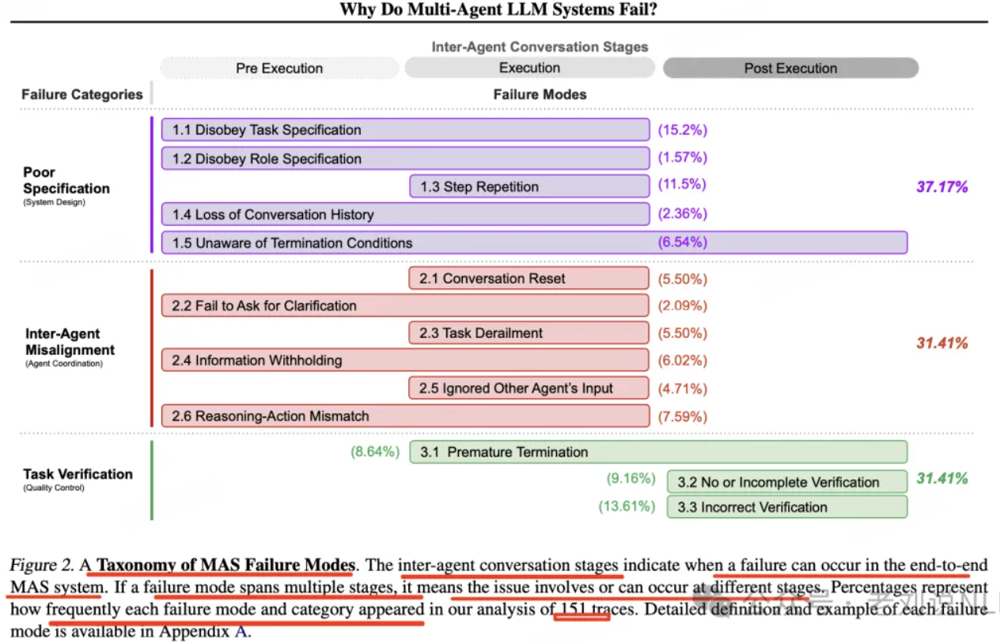

## ## 多Agent 常见失败方式

《Why Do Multi-Agent LLM Systems Fail?》（https://arxiv.org/pdf/2503.13657），通过对对5种流行MAS框架、150多个对话轨迹的分析，经过6位专业标注，确定3类共14种故障模式。

**规范与系统设计故障**：系统架构设计缺陷、对话管理不佳、任务规范不明确或违反约束条件，以及代理角色和职责定义不充分或不遵守而引起的故障。有五种故障模式：

1. **不遵守任务规范**。未能遵循给定任务的指定约束或要求，导致次优或不正确结果。

2. **不遵守角色规范**。未能遵守分配角色的定义职责和约束，可能导致一个代理表现得像另一个代理。

3. **步骤重复**。在流程中对已完成步骤的不必要重复，可能导致任务完成过程中的延误或错误。

4. **丢失对话历史**。意外的上下文截断，忽略最近的互动历史，并回到之前的对话状态。

5. **不了解终止条件**。缺乏对应当触发代理互动终止的标准认可或理解，可能导致不必要的继续。

**代理间不一致**：包括由于沟通无效、协作不佳、代理间的冲突行为以及逐渐偏离初始任务而产生的故障，有六种故障模式：

1. **对话重置**。意外或无正当理由的对话重新开始，可能丢失上下文和互动中取得的进展。

2. **未能请求澄清**。在遇到不清晰或不完整数据时无法请求额外信息，可能导致错误行动。

3. **任务脱轨**。偏离既定任务的预期目标或焦点，可能导致无关或无效的行动。

4. **信息隐瞒**。未能共享或传达代理拥有的重要数据或见解，如果共享可能会影响其他代理的决策。

5. **忽略其他代理的输入**。忽视或未能充分考虑系统中其他代理提供的输入或建议，可能导致次优决策或错失合作机会。

6. **推理与行动不匹配**。逻辑推理过程与代理实际采取的行动之间的差异，可能导致意外或不期望的行为。

**任务验证与终止**：包括由于过早执行终止导致的失败，以及缺乏足够的机制来保证互动、决策和结果的准确性、完整性和可靠性，有三种故障模式：

1. **过早终止**。在所有必要信息尚未交换或目标尚未达成之前结束对话、互动或任务，可能导致不完整或不正确的结果。

2. **未进行或未充分验证**。（部分）省略对任务结果或系统输出的适当检查或确认，可能使错误或不一致未被检测到而传播。

3. **错误验证**。在迭代过程中未能充分验证或交叉核对关键信息或决策，可能导致系统中的错误或漏洞。

## 意图识别的问题

要想实现智能体不仅仅需要大模型具备“思考”的能力，同时还需要大模型能够使用外部工具，简单来说就是第三方接口。关于大模型调用外部工具接口的技术，就叫做function call 也就是函数调用；是通过给大模型提供一个函数列表，这个函数列表中描述了每个函数的功能，参数等

> 简单来说，你想实现一个Agent智能体，然后根据功能定义了一堆函数列表；然后告诉大模型根据用户输入的问题，去自主判断调用那个函数。
> 
> 也就是说，你要查天气就去调用天气接口，你要查地址就去调用地图接口；而不是在查天气的时候调用地址接口或者在查地址的时候调用天气接口，这就是意图识别。

如果说你的智能体涉及的功能比较少，需要调用的接口也比较少；可能还不会出现这个问题，但如果当你智能体的功能比较复杂时，需要调用多个不同的接口；这时大模型可能就会偶尔抽风，出现不知道或者调用错误的接口。

> 当然，这种现象并不仅仅只是大模型的问题，我们人类同样也有可能出现这种问题。举例来说，有一辆三轮车和一辆小货车，然后我说要拉东西你去把车开过来一下；这时你应该开三轮车还是小货车？

说实话这种问题目前还没有一个完美的解决方案，即使放到我们人类身上偶尔也会因为沟通或理解的问题导致出错，在大模型上这种错误概率更是会被无限放大。而我们只能尽可能的去避免这种问题的出现，而具体的解决办法大概有以下几种：

- 使用准确清晰的描述：那个函数到底的干啥的，有什么具体的功能，最好使用最细致的描述，使歧义尽可能的降低

- 使用多轮对话：通过多次交流，使得能够更准确的理解需求；而这也是我们平常沟通过程中经常用的的方法。

- 使用分类模型：说白了意图识别问题，本质上就是一个分类问题；你的描述越模糊分类越困难，因此可以使用专业的分类模型，来让大模型确定自己的需求。

- 使用规则引擎：帮助大模型设计一套规则引擎，简单来说就是当大模型出现模糊判断的时候，应该怎么进行兜底；比如说增加人工判断或者重新选择的机会等。或者使用某种规则，不管意图什么样，只要满足规则需求就去执行。
