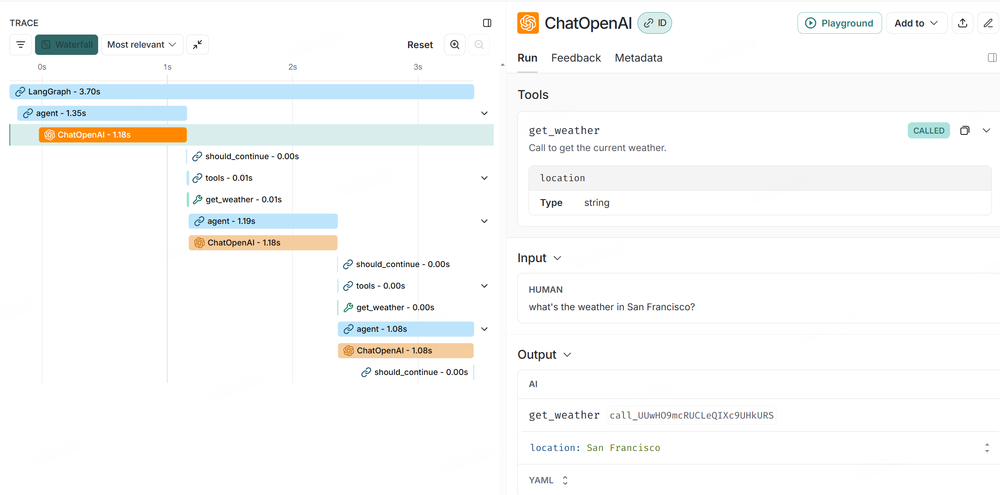
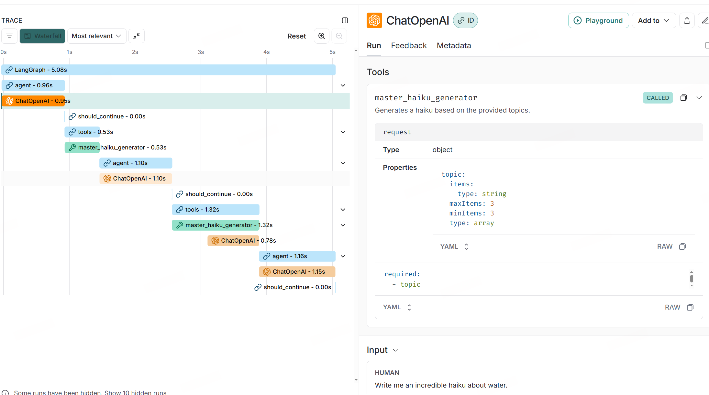

# 处理 Tool Call error

## 准备

```python
import os

# os.environ['HTTP_PROXY'] = 'http://127.0.0.1:10809'
# os.environ['HTTPS_PROXY'] = 'http://127.0.0.1:10809'
os.environ['LANGSMITH_TRACING'] = 'true'
os.environ['LANGSMITH_ENDPOINT'] = 'https://api.smith.langchain.com'
os.environ['LANGSMITH_API_KEY'] = 'xxxxxxxxxxxxxxxxxxxxxxxxxxxxxxx'
os.environ['LANGSMITH_PROJECT'] = 'xxxxxxxxxxxxxxxxxxxxxxxxxxxxxxxx'
```

## 例子1

首先，定义一个模拟天气工具，该工具对输入查询有一些隐藏的限制。此处的目的是模拟模型无法正确调用工具的真实情况：

```python
from langchain_core.tools import tool


@tool
def get_weather(location: str):
    """Call to get the current weather."""
    if location == "san francisco":
        return "It's 60 degrees and foggy."
    elif location == "San Francisco":
        raise ValueError("Please lowercase the first letter of the place name")
    else:
        raise ValueError("Invalid input.")
```

接下来，设置 ReAct 代理的图形实现。此代理将一些查询作为输入，然后重复调用 tools，直到它有足够的信息来解析查询。我们将使用预构建的 ToolNode 来执行 called tools

```python
from typing import Literal

from langchain_openai import ChatOpenAI
from langgraph.graph import StateGraph, MessagesState, START, END
from langgraph.prebuilt import ToolNode

tool_node = ToolNode([get_weather])

llm = ChatOpenAI(
    model="gpt-4o-mini"
)
model_with_tools = llm.bind_tools([get_weather])


def should_continue(state: MessagesState):
    messages = state["messages"]
    last_message = messages[-1]
    if last_message.tool_calls:
        return "tools"
    return END


def call_model(state: MessagesState):
    messages = state["messages"]
    response = model_with_tools.invoke(messages)
    return {"messages": [response]}


workflow = StateGraph(MessagesState)

# Define the two nodes we will cycle between
workflow.add_node("agent", call_model)
workflow.add_node("tools", tool_node)

workflow.add_edge(START, "agent")
workflow.add_conditional_edges("agent", should_continue, ["tools", END])
workflow.add_edge("tools", "agent")

app = workflow.compile()
```

```python
from IPython.display import Image, display

try:
    display(Image(app.get_graph().draw_mermaid_png()))
except Exception:
    # This requires some extra dependencies and is optional
    pass
```


当您尝试调用该工具时，您可以看到模型使用错误的输入调用该工具，从而导致工具引发错误。执行该工具的预构建 ToolNode 具有一些内置的错误处理功能，可以捕获错误并将其传递回模型，以便它可以重试：

```python
for chunk in app.stream(
    {"messages": [("human", "what's the weather in San Francisco?")]}, stream_mode="values"
):
    chunk["messages"][-1].pretty_print()
```

    ================================ Human Message =================================
    
    what's the weather in San Francisco?
    ================================== Ai Message ==================================
    Tool Calls:
      get_weather (call_UUwHO9mcRUCLeQIXc9UHkURS)
     Call ID: call_UUwHO9mcRUCLeQIXc9UHkURS
      Args:
        location: San Francisco
    ================================= Tool Message =================================
    Name: get_weather
    
    Error: ValueError('Please lowercase the first letter of the place name')
     Please fix your mistakes.
    ================================== Ai Message ==================================
    Tool Calls:
      get_weather (call_WSv60RptgWNgvkAt6WVGkGdV)
     Call ID: call_WSv60RptgWNgvkAt6WVGkGdV
      Args:
        location: san francisco
    ================================= Tool Message =================================
    Name: get_weather
    
    It's 60 degrees and foggy.
    ================================== Ai Message ==================================
    
    The weather in San Francisco is 60 degrees and foggy.

在这个例子中，

1. LLM 使用 San Francisco 作为参数查询天气

2. 我们手动设置了一个陷阱，如果是首字母大写了，返回错误：Please lowercase the first letter of the place name

3. LLM 能够理解错误并改正



## 例子2

在这个例子中，

1. LLM 能够准确理解参数限制
   
   1. 如果第一次理解不了，pydantic 输出的 error 也能帮助 LLM 修改参数

2. 我们手动设置了一个陷阱，topic 不能直接包含 "water"

3. LLM 能够理解错误并改正

```python
from langchain_core.output_parsers import StrOutputParser
from pydantic import BaseModel, Field


class HaikuRequest(BaseModel):
    topic: list[str] = Field(
        max_length=3,
        min_length=3,
    )


@tool
def master_haiku_generator(request: HaikuRequest):
    """Generates a haiku based on the provided topics."""
    model = ChatOpenAI(
        model="gpt-4o-mini",
    )
    chain = model | StrOutputParser()
    topics = ", ".join(request.topic)
    if "water" in topics:
        raise ValueError("topics should not appear 'water' directly")
    haiku = chain.invoke(f"Write a haiku about {topics}")
    return haiku


tool_node = ToolNode([master_haiku_generator])

model = ChatOpenAI(
    model="gpt-4o-mini",
)
model_with_tools = model.bind_tools([master_haiku_generator])


def should_continue(state: MessagesState):
    messages = state["messages"]
    last_message = messages[-1]
    if last_message.tool_calls:
        return "tools"
    return END


def call_model(state: MessagesState):
    messages = state["messages"]
    response = model_with_tools.invoke(messages)
    return {"messages": [response]}


workflow = StateGraph(MessagesState)

# Define the two nodes we will cycle between
workflow.add_node("agent", call_model)
workflow.add_node("tools", tool_node)

workflow.add_edge(START, "agent")
workflow.add_conditional_edges("agent", should_continue, ["tools", END])
workflow.add_edge("tools", "agent")

app = workflow.compile()
```

```python
# example with a single tool call
for chunk in app.stream(
    {"messages": [("Write me an incredible haiku about water.")]}, {"recursion_limit": 10}, stream_mode="values"
):
    chunk["messages"][-1].pretty_print()
```

    ================================ Human Message =================================
    
    Write me an incredible haiku about water.
    ================================== Ai Message ==================================
    Tool Calls:
      master_haiku_generator (call_RAwVONZkaBV1kcg6S0EvVacq)
     Call ID: call_RAwVONZkaBV1kcg6S0EvVacq
      Args:
        request: {'topic': ['water', 'nature', 'tranquility']}
    ================================= Tool Message =================================
    Name: master_haiku_generator
    
    Error: ValueError("topics should not appear 'water' directly")
     Please fix your mistakes.
    ================================== Ai Message ==================================
    Tool Calls:
      master_haiku_generator (call_rZRGP2DB9QJMtpdJBExYs8Ze)
     Call ID: call_rZRGP2DB9QJMtpdJBExYs8Ze
      Args:
        request: {'topic': ['flow', 'nature', 'tranquility']}
    ================================= Tool Message =================================
    Name: master_haiku_generator
    
    Gentle river bends,  
    Whispers through the silent trees,  
    Nature’s breath, pure peace.
    ================================== Ai Message ==================================
    
    Here’s an incredible haiku about water:
    
    Gentle river bends,  
    Whispers through the silent trees,  
    Nature’s breath, pure peace.



我们使用 pydantic 设置的参数限制，LLM 能看到
