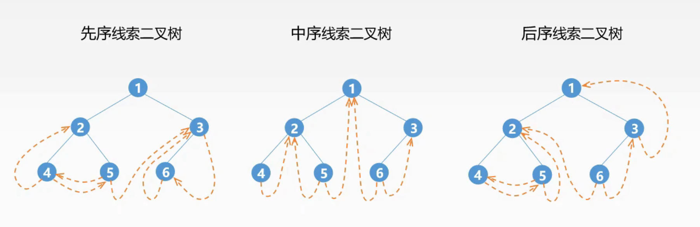
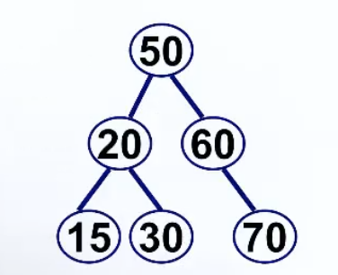

# 二叉树

## 基本性质

1.   对于所有树，结点数 == 度数和 + 1。（度只考虑出度，或者说孩子数）
2.   定义结点层数从0开始，树深度从0开始，树高从1开始。
3.   给定 $n$ 个结点，能构成 $h(n)$ 种不同的二叉树，结论和递推式为：

$$
h(n)=\frac{C^{n}_{2n}}{n+1}
$$

$$
h(0)=h(1)=1\\
h(n)=\sum_{i=0}^{n-1}h(i)*h(n-1-i)
$$

4.   对于**二叉树**，度为0的结点比度为2的结点多一个
5.   对于$n$个结点的**完全二叉树**，树高为$\lceil log_2(n+1) \rceil$

## 遍历

### 递归遍历

前序遍历

```cpp
template<class T>
void preOrder(Node<T>* pointer) {
	if (!pointer)return;
	visit(pointer);
	preOrder(pointer->left);
	preOrder(pointer->right);
}
```

中序遍历

```cpp
template<class T>
void inOrder(Node<T>* pointer) {
	if (!pointer)return;
	inOrder(pointer->left);
	visit(pointer);
	inOrder(pointer->right);
}
```

后序遍历

```cpp
template<class T>
void postOrder(Node<T>* pointer) {
	if (!pointer)return;
	postOrder(pointer->left);
	postOrder(pointer->right);
	visit(pointer);
}
```

### 非递归前序遍历

**思想：**

使用一个栈，栈空则结束循环

每次循环，先从栈中拿出一个结点，访问它

然后把它右左结点入栈（因为栈后入先出，后放左结点，之后先出左结点）

**代码：**

```cpp
template<class T>
void preOrderNoR(Node<T>* root) {
	stack < Node<T>*> s;
	s.push(root);
	while (!s.empty()) {
		Node<T>* pointer = s.top();
		s.pop();
		visit(pointer);
		if (pointer->right)s.push(pointer->right);
		if (pointer->left)s.push(pointer->left);
	}
}
```

### 非递归中序遍历

**思想：**

-   前序只有一种状态
-   中序需要用到两种状态（左子树没访问完，左子树已经访问完），分别用 bool 的 0 和 1 表示
-   之后的后序需要用到三种状态

每次循环，先从栈中拿出一个结点

-   如果左子树没访问完，则先给自己更新标志，然后左结点入栈
-   如果左子树已经访问完，则访问自己，然后右结点入栈

**代码：**

```cpp
template<class T>
void inOrderNoR(Node<T>* root) {
	stack < pair<Node<T>*, bool>> s;// 使用一个带标志位的栈
	s.push(make_pair(root, 0));
	while (!s.empty()) {
		Node<T>* pointer = s.top().first;
		bool flag = s.top().second;
		s.pop();
		if (!flag) {// 左子树没访问完
			s.push(make_pair(pointer, 1));// 先给自己更新标志
			if (pointer->left)s.push(make_pair(pointer->left,0));// 左结点入栈
		}
		else {// 左子树已经访问完
			visit(pointer);// 访问自己
			if(pointer->right)s.push(make_pair(pointer->right, 0));// 右结点入栈
		}
	}
}
```

### 非递归后序遍历

**思想：**

后序需要用到三种状态（左子树没访问完，左子树已经访问完但右子树没访问完，右子树已经访问完），分别用 char 的 'n','l','r' 表示

每次循环，先从栈中拿出一个结点

-   如果左子树没访问完，则先给自己更新标志，然后左结点入栈
-   如果左子树已经访问完但右子树没访问完，则先给自己更新标志，然后右结点入栈
-   如果右子树已经访问完，则访问自己

**代码：**

```cpp
template<class T>
void postOrderNoR(Node<T>* root) {
	stack < pair<Node<T>*, char>> s;
	s.push(make_pair(root, 'n'));
	while (!s.empty()) {
		Node<T>* pointer = s.top().first;
		char flag = s.top().second;
		s.pop();
		if (flag == 'n') {// 左子树没访问完
			s.push(make_pair(pointer, 'l'));
			if (pointer->left)s.push(make_pair(pointer->left, 'n'));
		}
		else if (flag == 'l') {// 左子树已经访问完但右子树没访问完
			s.push(make_pair(pointer, 'r'));
			if (pointer->right)s.push(make_pair(pointer->right, 'n'));
		}
		else visit(pointer);// 右子树已经访问完
	}
}
```

>   另外一种方法
>
>   思想是利用两个指针，p 是当前正在处理的指针，q 记录上一个 p，以此判断右子树是否已经访问完
>
>   ```cpp
>   template<class T>
>   void postOrderTwoPointer(Node<T>* root) {
>   	stack <Node<T>*> s;
>   	Node<T>* p = root, * q = root;
>   	while (p) {
>   		for (; p->left; p = p->left)s.push(p);// 一直到最左下
>   		while (!p->right || p->right == q) {// 右子树已经访问完
>   			visit(p);
>   			q = p;// q 记录上一个 p
>   			if (s.empty())return;
>   			p = s.top();
>   			s.pop();
>   		}
>   		s.push(p);
>   		p = p->right;
>   	}
>   }
>   ```

## 从前序和中序序列构建二叉树

**思想：**

使用递归的思想：每次先找到前序序列和后序序列中根的位置，构建左子树和右子树。构建左子树和右子树的方法如前一句话。

**代码：**给出二叉树的中序和后序遍历序列，输出层序遍历序列

```cpp
#include<iostream>
#include<queue>
using namespace std;

struct Btree{
    int data;
    Btree *left,*right;
    Btree(int d):data(d),left(NULL),right(NULL){}
};
int N, postord[30], midord[30];

Btree* build(int post_head, int post_tail, int mid_head, int mid_tail){
    if(post_head > post_tail)return NULL;
    Btree *root = new Btree(postord[post_tail]);
    int mid_root = mid_head;
    while(midord[mid_root] != postord[post_tail]){
        mid_root++;
    }
    int left_size = mid_root - mid_head;
    root->left = build(post_head, post_head + left_size - 1, mid_head, mid_root - 1);
    root->right = build(post_head + left_size, post_tail - 1, mid_root + 1, mid_tail);
    return root;
}

void levelOrder(Btree *root){
    queue<Btree*> q;
    q.push(root);
    while(!q.empty()){
        Btree *node = q.front();
        q.pop();
        cout << node->data;
        if(node->left != NULL)q.push(node->left);
        if(node->right != NULL)q.push(node->right);
    }
}

int main(){
    cin >> N;
    for(int i = 0; i < N; i++)cin >> postord[i];
    for(int i = 0; i < N; i++)cin >> midord[i];
    Btree *root = build(0, N - 1, 0, N - 1);
    levelOrder(root);
    return 0;
}
```

>   另外一个例子：
>
>   ```
>   前序：ABECDFGHIJ
>   中序：EBCDAFHIGJ
>   后序：EDCBIHJGFA
>   ```

## 线索二叉树

线索化二叉树是一种在二叉树上建立线索（thread）的方法，目的是在不增加额外空间的情况下，提高对二叉树的遍历效率。线索化的目的是使得在任意节点可以方便地找到其前驱节点（predecessor）和后继节点（successor），从而实现对二叉树的快速遍历。

假定二叉树的节点个数为n，则二叉树的空链域为n+1。想借用多余的空链域来记录某种遍历(先序遍历、中序遍历、后序遍历)的**前驱与后继**。根据线索的建立方式，可以分为前序线索树、中序线索树和后序线索树。

通过线索化，可以在不使用递归或栈的情况下，直接找到节点的前驱和后继节点，从而实现了对二叉树的便捷遍历。



## 二叉搜索树

```cpp
class Node{
public:
    int data;
    Node* left, *right;
    Node(int data){
        this->data = data;
        left = right = NULL;
    }
};
Node *tree = NULL;

Node *build(Node *root, int data){
    if(root == NULL) return new Node(data);
    if(data < root->data) root->left = build(root->left, data);
    else root->right = build(root->right, data);
    return root;
}
```

> 练练手：**1043 Is It a Binary Search Tree**

如果全按顺序插入呢？那就变成全左子树或者全右子树的一串了，查询效率退化为 O(n)

## 平衡二叉树

> [AVL动画](https://www.cs.usfca.edu/~galles/visualization/AVLtree.html)

平衡二叉树（AVL树）就是在二叉搜索树的基础上引入了平衡因子来控制树的相对平衡，不让出现全左子树或者全右子树的样子。

*TODO：平衡二叉树插入，删除，ASLsucc，ASLunsucc*

删除结点时，同号做单旋，异号做双旋。



如图，平均成功查找次数$$ASL_{succ}$$和平均失败查找次数$$ASL_{unsucc}$$为：
$$
ASL_{succ}=\frac{1+2+2+3+3+3}6=\frac{14}6
$$

$$
ASL_{unsucc}=\frac{2+3+3+3+3+3+3}7=\frac{20}7
$$

然而，AVL树在旋转中需要耗费时间，更适合更改少，查询多的场景。

## 红黑树

最长子树不超过最短子树高度的二倍即可。就是为了不让它大量的去做旋转

红黑树口诀：左根右，根叶黑，不红红，黑路同！

它通过颜色的约束来维持二叉树的平衡，它要求任意一条路径上的黑色节点数目相同，同时还需要满足一些其他特定的条件，如红色节点的父节点必须为黑色节点等。

- 每个节点都只能是红色或者黑色
- 根节点是黑色
- 每个叶节点（NIL 节点，空节点）是黑色的。
- 如果一个节点是红色的，则它两个子节点都是黑色的。也就是说在一条路径上不能出现相邻的两个红色节点。
- 从任一节点到其每个叶子的所有路径都包含相同数目的黑色节点。

由于红黑树的平衡度比AVL树稍低，因此在进行插入和删除操作时需要进行的旋转操作较少，但是在查找操作时效率仍然较高。红黑树适用于**读写操作比较均衡**的场景。

## B树

> [动画](https://www.cs.usfca.edu/~galles/visualization/BTree.html)

在数据库查询中，以树存储数据。树有多少层，就意味着要读多少次磁盘IO。所以树的高度越矮，就意味着查询数据时，需要读 IO 的次数就越少。（众所周知，读IO 是一件费事的操作）

当数据量大的时候，用 红黑树存的话，就算是平衡树，但是也扛不住数据量大，数据量大，红黑树的树高肯定很高，那么读取数据的 IO 次数也会多。B 树的一个结点可以装多个值，读取时，是把整个结点读到内存，然后在内存中，对结点的值进行处理，在内存中处理速度肯定比磁盘快。

**B树的本质是有序的多路查询树**。

所以只要树的高度低，IO 少，就能够提升查询效率，这是 B 树的好处之一。B 树的缺点是：不利于范围查找(区间查找)，如果要找 0~100 的索引值，那么B树需要多次从根结点开始逐个查找。 

## B+树

B+树和 B 树最大的不同是：B+树内部有两种结点，一种是索引结点，一种是叶子结点。B+树的索引结点并不会保存记录，只用于索引，所有的数据都保存在 B+树的叶子结点中。而B树则是所有结点都会保存数据。 B+树的叶子结点都会被连成一条链表。叶子本身按索引值的大小从小到大进行排序。即这条链表是从小到大的。因此可以直接通过遍历链表实现范围查找。

## 最大堆

堆是具有以下性质的`完全二叉树`：

- 每个节点的值都大于或者等于其左右孩子节点的值称为`大顶堆`
- 每个节点的值都小于或者等于其左右孩子节点的值称为`小顶堆`

```cpp
#include<iostream>
using namespace std;

template<class T>
class MaxHeap {
private:
	T* heapArray;
	int currentSize;
	int maxSize;
public:
	MaxHeap(int maxSize);
	void insert(T val);
	void pop();
	T top();
	bool empty();
	void buildHeap(T* vals, int size);
	void siftUp(int pos);
	int parent(int pos) const;
	int leftChild(int pos) const;
	int rightChild(int pos) const;
	void swap(int pos1, int pos2);
	void siftDown(int pos);
};

template<class T>
bool MaxHeap<T>::empty()
{
	return currentSize == 0;
}

template<class T>
int MaxHeap<T>::leftChild(int pos) const
{
	return 2 * pos + 1;//结点从0开始
}

template<class T>
int MaxHeap<T>::rightChild(int pos) const
{
	return 2 * pos + 2;
}

template<class T>
int MaxHeap<T>::parent(int pos) const
{
	return (pos - 1) / 2;
}

template<class T>
void MaxHeap<T>::swap(int pos1, int pos2)
{
	T temp = heapArray[pos1];
	heapArray[pos1] = heapArray[pos2];
	heapArray[pos2] = temp;
}

template<class T>
void MaxHeap<T>::siftUp(int pos)
{//若自己比父亲大，则调换
	while ((pos > 0) && (heapArray[parent(pos)] < heapArray[pos])) {
		swap(pos, parent(pos));
		pos = parent(pos);
	}
}

template<class T>
void MaxHeap<T>::siftDown(int pos)
{//若自己比孩子小，则调换。（可能只有左孩子没有右孩子，多加点判断）
	while (leftChild(pos) < currentSize) {
		int maxChild = leftChild(pos);
		if (rightChild(pos) < currentSize && heapArray[rightChild(pos)] > heapArray[leftChild(pos)]) maxChild = rightChild(pos);
		if (heapArray[maxChild] > heapArray[pos]) {
			swap(pos, maxChild);
			pos = maxChild;
		}
		else return;
	}
}

template<class T>
void MaxHeap<T>::insert(T val)
{//插入时直接放最后一个位置再上筛
	if (currentSize == maxSize) return;
	heapArray[currentSize] = val;
	siftUp(currentSize);
	currentSize++;
}

template<class T>
T MaxHeap<T>::top()
{
	return heapArray[0];
}

template<class T>
void MaxHeap<T>::pop()
{//删除时调换最前最后的位置，容量减一，最前的做下筛
	if (currentSize == 0) return;
	swap(0, --currentSize);
	siftDown(0);
}

template<class T>
void MaxHeap<T>::buildHeap(T* vals, int size)
{//从后往前下筛
	for (int i = 0; i < size; ++i)heapArray[i] = vals[i];
	currentSize = size;
	for (int i = currentSize - 1; i >= 0; i--) siftDown(i);
}

template<class T>
MaxHeap<T>::MaxHeap(int maxSize)
{
	this->maxSize = maxSize;
	heapArray = new T[maxSize];
	currentSize = 0;
}

int main() {
	MaxHeap<int> heap(50);
	int vals[20] = { 0,1,2,3,4,5,6,7,8,9,10,34,23,43,54,213,11 };
	heap.buildHeap(vals, 17);
	while (!heap.empty()) {
		cout << heap.top() << " ";
		heap.pop();
	}
	return 0;
}
```

## 哈夫曼编码

给定N个权值作为N个叶子结点，构造一棵二叉树，若该树的带权路径长度达到最小，称这样的二叉树为最优二叉树，也称为*哈夫曼树*(Huffman Tree)。*哈夫曼树*是带权路径长度最短的树，权值较大的结点离根较近。

## 树与森林的转换

森林的遍历分为先根遍历和后根遍历。

先根遍历与先转为二叉树再前序遍历相同。

后根遍历与先转为二叉树再中序遍历相同。

## 树的直径

> 来自PAT 甲级 1021 Deepest Root

**任务：**

给出N个结点与N-1条边，问：它们能否形成一棵N个结点的树？如果能，则从中选出结点作为树根，使得整棵树的高度最大。输出所有满足要求的可以作为树根的结点。

**分析：**

判断图是否连接用并查集解决。

当图连通时，由于题目保证只有N-1条边，因此一定能确定是一棵树，下面的任务就是选择合适的根结点，使得树的高度最大。具体做法为：

1. 先任意选择一个结点，从该结点开始遍历整棵树，获取能达到的最深的顶点(记为结点集合A)；
2. 然后从集合A中任意一个结点出发遍历整棵树，获取能达到的最深的顶点(记为结点集合B)。
3. 这样集合A与集合B的并集即为所求的使树高最大的根结点。

因此，这道题最快只用两次DFS就够了，比较笨的方法是找到每个叶节点然后dfs求最长路并记录，最后将所有最长路为最大值的节点输出，在PAT上也能过，但是在牛客网上是过不了的（牛客网数据略强）。

证明过程见[链接](https://www.cnblogs.com/fxh0707/p/14327987.html)

## Trie前缀树

Trie（发音类似 "try"）或者说 **前缀树** 是一种树形数据结构，用于高效地存储和检索字符串数据集中的键。这一数据结构有相当多的应用情景，例如自动补完和拼写检查。z

```cpp
#include<iostream>
#include<vector>
#include<string>
using namespace std;

class Trie {

private:
    bool isEnd;
    vector<Trie*> children;

    Trie* searchPrefix(string prefix) {
        Trie* node = this;  // 从字典树的根开始，搜索前缀。
        for (char c : prefix) {
            c -= 'a';
            if (node->children[c] == nullptr) {
                // 如果没有找到前缀中的任何字符，就立即返回。
                return nullptr;
            }
            // 如果找到前缀中的字符，则继续向下搜索。
            node = node->children[c];
        }
        // 返回前缀中的最后一个节点。
        return node;
    }

public:
    Trie() {
        isEnd = false;
        children = vector<Trie*>(26, nullptr);
    }
    
    void insert(string word) {
        Trie* node = this;  // 从字典树的根开始，插入字符串。
        for (char c : word) {
            if (node->children[c - 'a'] == nullptr) {
                // 子节点不存在。创建一个新的子节点，
                // 然后沿着指针移动到子节点，继续搜索下一个字符。
                node->children[c - 'a'] = new Trie();
            }
            // 子节点存在。沿着指针移动到子节点，继续处理下一个字符。
            node = node->children[c - 'a'];
        }
        // 字符串的最后一个字符，然后将当前节点标记为字符串的结尾。
        node->isEnd = true;
    }
    
    bool search(string word) {
        Trie* node = this->searchPrefix(word);
        return node != nullptr && node->isEnd;
    }
    
    bool startsWith(string prefix) {
        return this->searchPrefix(prefix) != nullptr;
    }
};

int main(){
    Trie* trie = new Trie();
    trie->insert("apple");
    cout << trie->search("apple") << endl;   // 返回 true
    cout << trie->search("app") << endl;     // 返回 false
    cout << trie->startsWith("app") << endl; // 返回 true
    trie->insert("app");
    cout << trie->search("app") << endl;     // 返回 true
    return 0;
}
```

## 杂题思想

[二叉树的最近公共祖先](https://leetcode.cn/problems/lowest-common-ancestor-of-a-binary-tree/solutions/238552/er-cha-shu-de-zui-jin-gong-gong-zu-xian-by-leetc-2/)：递归遍历整棵二叉树，定义 $$f_x$$  表示 x 节点的子树中是否包含 p 节点或 q 节点，如果包含为 true，否则为 false。那么符合条件的最近公共祖先 x 一定满足如下条件： 
$$
(f_{lson}  \&\& f_{rson}  ) ∣∣ ((x = p ∣∣ x = q) \&\& (f_{lson}  ∣∣ f_{rson}  ))
$$
完全二叉树的最后一个节点：递归，求子树的高度：如果左子树高度>右子树高度，则在左子树继续递归过程；否则在右子树继续递归。高度怎么求？由于是完全二叉树，求高度时只需一直往左遍历即可。每次递归都下降一层，每次都求树的高度。时间复杂度为O(lgN * lgN)。

[完全二叉树的节点个数](https://leetcode.cn/problems/count-complete-tree-nodes/solutions/495655/wan-quan-er-cha-shu-de-jie-dian-ge-shu-by-leetco-2/)：先找到最大层数，找到节点个数最大和最小范围，再二分答案。
