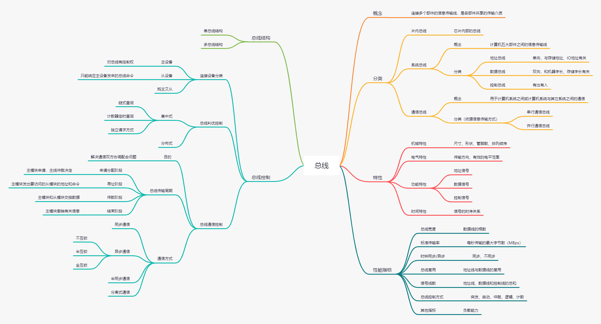
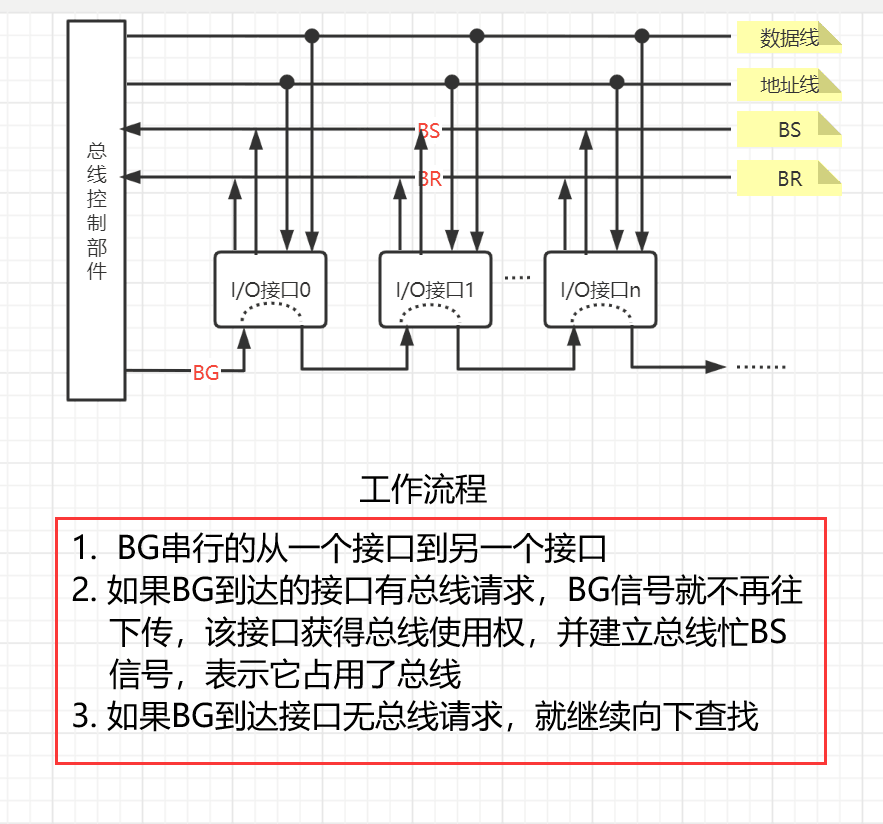
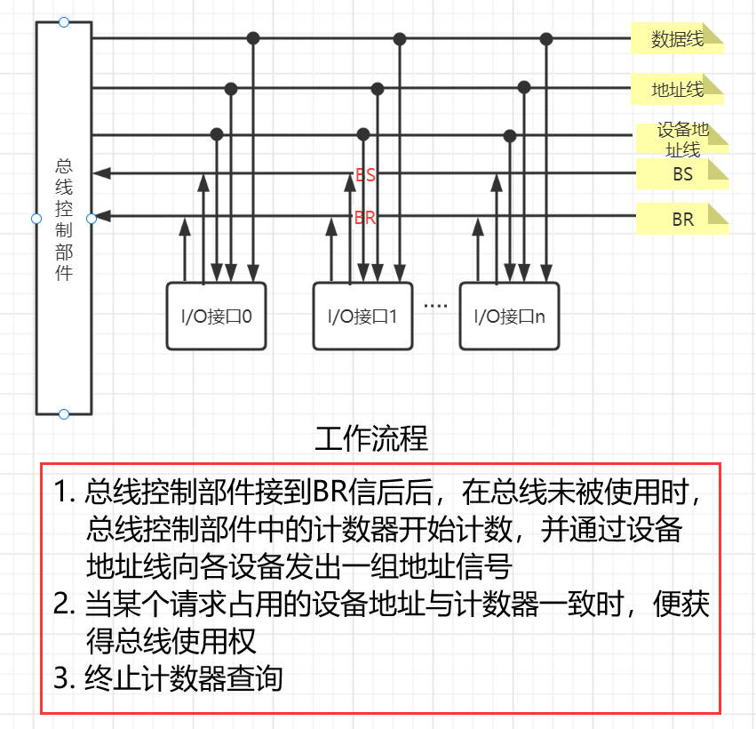
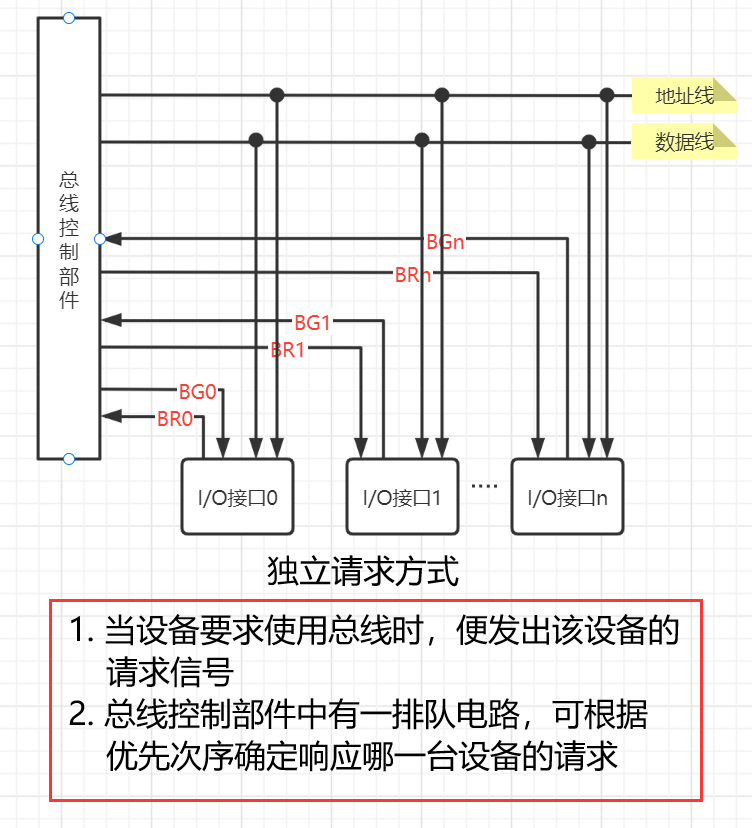
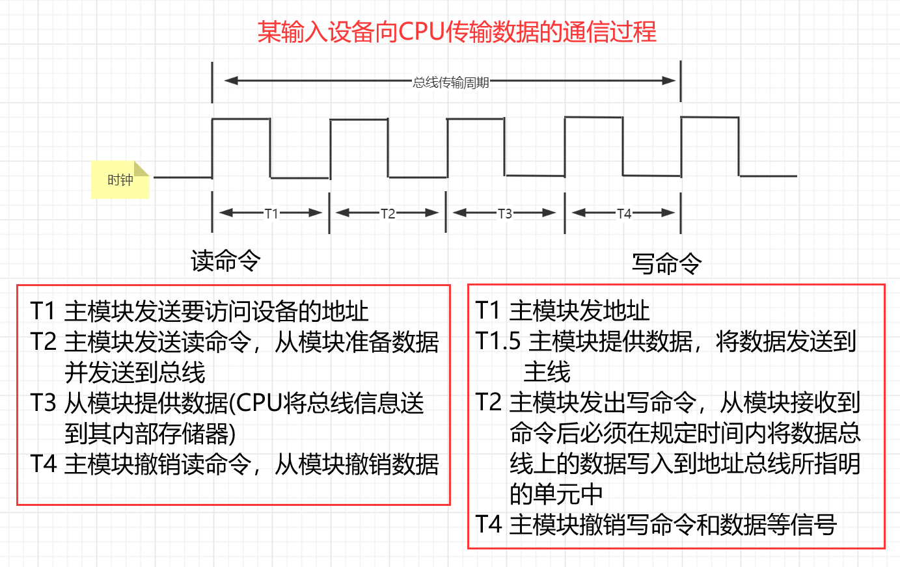
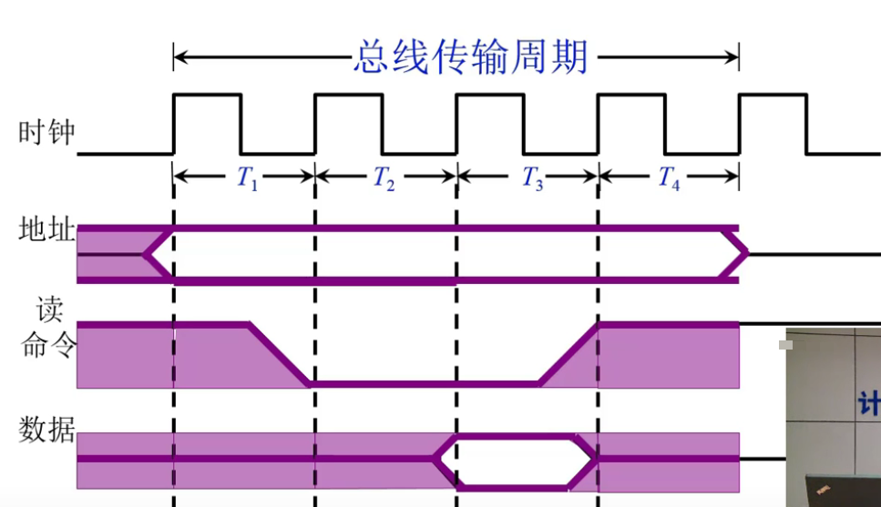
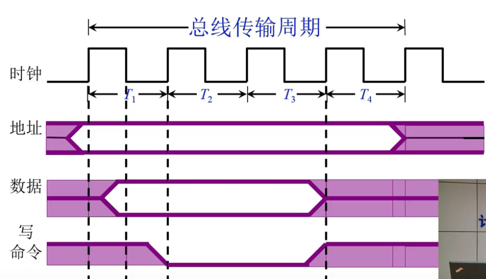
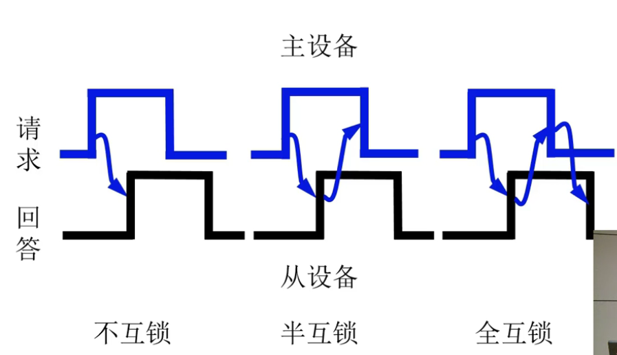
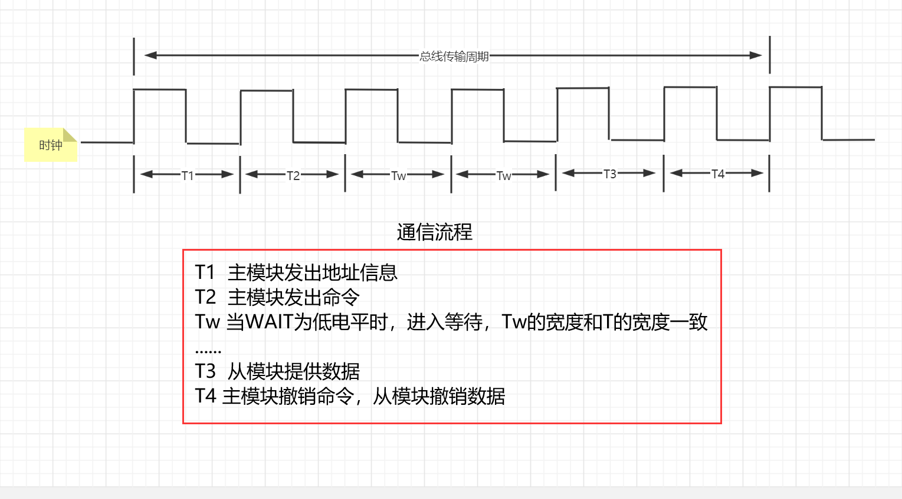
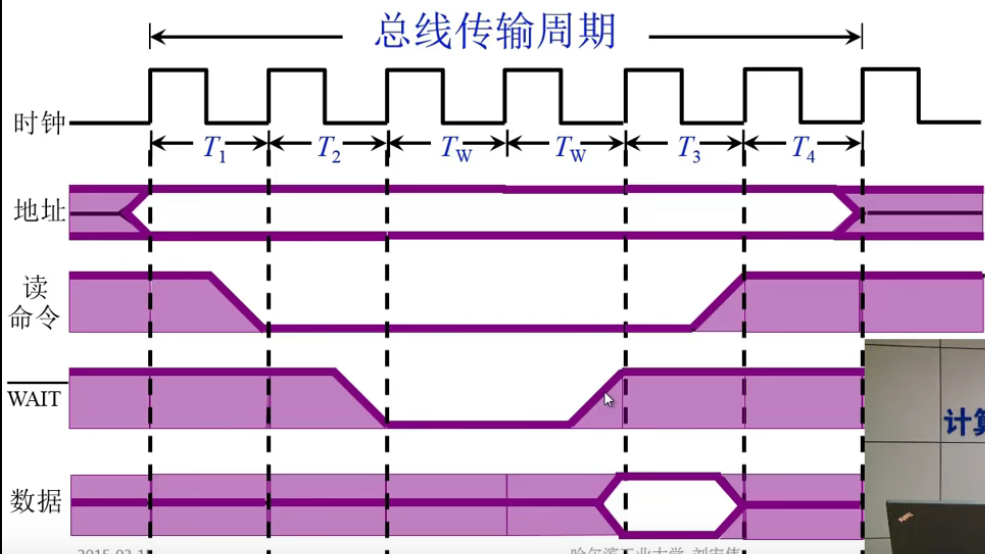

# 系统总线

> 参考：https://blog.csdn.net/SX123q/article/details/124597525

## 总线判优控制

> 基础概念

*   BS信号：总线忙
*   BR信号：总线请求
*   BG信号：总线同意

### 链式查询

> 链式查询的特点

1.  结构简单
2.  速度慢，需要一直向下查询
3.  电路故障特别敏感
4.  离总线控制器越近，优先权越高

> 链式查询通过接口的优先权排队电路实现

这种查询方式的名称来源于BG信号的传输方式，显而易见，当一个I/O接口故障时，其后的I/O接口就无法收到BG信号了。

### 计数器定时查询

> 工作图

> 计数器定时查询特点

1.  优先次序可以改变（计数器的初始值可由程序设置）
2.  增加了控制线数（设备地址线），控制更加复杂
3.  假如接入了n个设备，大致用 $\log_2n$根线
4.  计数器从0开始，各部件优先次序和链式查询法一致
5.  计数器从中止点开始，每个部件的优先级一致

### 独立请求方式

> 工作图

> 特点

1.  响应速度快
2.  优先次序控制灵活（通过程序控制）
3.  控制线数量多，总线控制更复杂
4.  n为最大设备数，独立请求方式需用2n根线

**总结**

可以看出链式查询和计数器定时查询采用的都是轮询方案，只是轮询的算法不同；而独立请求方式不采用轮询方案，各部件进行请求，总线控制部件负责处理各部件的请求信号。

## 总线通信控制

> 通常将完成一次总线操作的时间称为总线周期，分为下列四个阶段

1.  申请分配阶段：主模块提出使用总线的申请，总线仲裁机构决定下一传输周期的总线使用权授予某一申请者
2.  寻址阶段：取得了使用权的主模块通过总线发出本次要访问的从模块的地址及有关命令，启动参与此次传输的从模块
3.  传数阶段：主模块和从模块进行数据交换，数据由源模块发出，经数据总线流入目的模块
4.  结束阶段：主模块相关信息从系统总线上撤除，让出总线使用权

> 总线通信控制主要解决通信双方如何获知传输开始和结束，以及通信双方如何协调如何配合的问题

### 同步通信

通信双方由统一时标控制数据传送称为同步通信。

> 工作图

> 读命令时序图

> 写命令时序图

> 特点

1.  传输效率高，可靠性高
2.  各部件强制性同步，灵活性差
3.  一般用于总线长度较短、各部件存取时间比较一致的场合

### 异步通信

没有公共的时钟标准，采用应答方式，主模块发出请求后，等待从模块反馈回来响应信号，然后开始通信。

> 按照应答方式可以将异步通信分为不互锁、半互锁、全互锁三种类型
>

- 不互锁方式
  1. 主模块发出请求信号后，不等待从模块的应答信号，一段时间后自动撤销信号
  2. 从模块接收到信号后发出回答信号，一段时间后自动撤销应答信号
- 半互锁方式
  1. 主模块发出请求后，必须等待接到从模块应答信号后才能撤销请求信号。存在互锁关系
  2. 从模块接到请求信号后，发出应答信号，一段时间后自动撤销应答信号。不存在互锁关系
- 全互锁方式
  1. 主模块发出请求后，必须等待接到从模块应答信号后才能撤销请求信号。存在互锁关系
  2. 从模块发出应答信号后，必须等待获知主模块撤销请求信号后，才能撤销应答信号。存在互锁关系

> 异步通信特点

1.  没有公共时钟标准
2.  允许各模块速度不一致，灵活性高
3.  半互锁方式可能导致请求信号一直高电平

### 半同步通信

半同步通信既保留了同步通信的基本特点，又允许不同速度的模块一起和谐工作。主要的解决方案是采用增设一条等待 $\overline{\text{WAIT}}$ 响应信号线，插入时钟周期（等待）的措施来协调通信双方的配合问题。

> 工作图

> 读命令时序图

> 特点

1.  控制方式比异步通信简单
2.  可靠性较高，同步结构比较方便
3.  适用于系统工作速度不高但又包含了由许多工作速度差异较大的各类设备组成的简单系统
4.  对系统时钟频率要求不能太高，因此从整体来看，系统的工作速度还不是很高

### 分离式通信

> 分离式通信的引入过程

首先，对前三种通信的共同特征进行总结：

1.  从主模块发出地址和读写命令开始，直到数据传输结束
2.  整个传输周期中，系统总线的使用权完全由占有使用权的主模块和它选中的从模块占据

进一步分析读命令传输周期，发现除了申请总线这一阶段外，其余时间主要花费在一下三个方面：

1.  主模块通过传输总线向从模块发送地址和命令
2.  从模块按照命令进行读数据的必要准备
3.  从模块经过数据总线向主模块提供数据

注意：对于第二步，从模块内部读数据过程并无实质性的信息传输，总线处于空闲状态。

为了充分挖掘系统总线每瞬间的潜力，提出了分离式通信方式。

> 工作原理

注意：A模块一旦发送完信息立即放弃总线使用权。

> 特点

1.  各模块欲使用总线都必须提出申请
2.  得到总线使用权后，主模块在限定时间内向对方传送信息，采用同步式方式传送，不再等待对方的回答信号
3.  各模块在准备数据时不占用总线，总线可供其他模块使用
4.  总线被占用时都在做有效工作
5.  控制方式比较复杂，一般在普通微型计算机很少采用