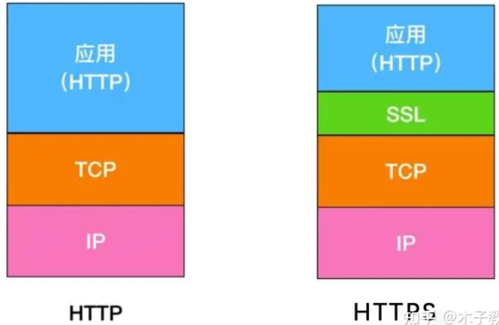

# 应用层

## HTTP

超文本传输协议（hypertext transfer protocol，HTTP），应用与Web，基于TCP，80端口。

HTTP is “stateless”：server maintains no information about past client requests

-   Nonpersistent HTTP：At most one object is sent over a TCP connection.
-   Persistent HTTP：Multiple objects can be sent over single TCP connection between client and server.

往返时间（Round-Trip Time，RTT）: time for a small packet to travel from client to server and back.

total = 2RTT+transmit time

two types of HTTP messages: request, response

小甜饼（Cookie）。保存User-server state在用户本地。

简述一下 Cookie 和 Session 的区别

- cookie 数据存放在客户的浏览器上，session 数据放在服务器上。
- cookie 不是很安全，别人可以分析存放在本地的 COOKIE 并进行 COOKIE 欺骗,考虑到安全应当使用session。
- session 会在一定时间内保存在服务器上。当访问增多，会比较占用你服务器的性能,考虑到减轻服务器性能方面，应当使用 cookie。
- 单个 cookie 保存的数据不能超过 4K，很多浏览器都限制一个站点最多保存 20 个cookie，而session则存储与服务端，浏览器对其没有限制
- session 会话机制：session 会话机制是一种服务器端机制，它使用类似于哈希表（可能还有哈希表）的结构来保存信息。 
- cookies 会话机制：cookie 是服务器存储在本地计算机上的小块文本，并随每个请求发送到同一服务器。Web服务器使用 HTTP 标头将 cookie 发送到客户端。在客户端终端，浏览器解析 cookie 并将其保存为本地文件，该文件自动将来自同一服务器的任何请求绑定到这些 cookie。

Web caches (proxy server)：Goal: satisfy client request without involving origin server

> 在访问某些网站时会被重定向，原因是请求头被自动修改，请求头是HTTP协议中的一部分。如要防止，简单来说就是阻止请求头被修改。
>
> 可以使用浏览器插件[Header Editor](https://he.firefoxcn.net/)，对于 bing.com ，之后在插件设置页添加新规则：
>
> | 标签     | 值                               |
> | -------- | -------------------------------- |
> | 名称     | （随便起一个名称，或者就叫Bing） |
> | 规则类型 | 修改请求头                       |
> | 匹配类型 | 正则表达式                       |
> | 匹配规则 | http(s?)://www\.bing\.com/(.*)   |
> | 执行类型 | 常规                             |
> | 头名称   | x-forwarded-for                  |
> | 头内容   | 8.8.8.8                          |

http是明文传输，https是加密的安全传输。比如用wireshark抓你自己网卡的数据包，http的请求是能看到明文数据的，https的请求看到的是乱码。这就避免了http传输过程中被窃听截取，或者冒充篡改。

http+ssl=https，https并不是新的应用层协议，只是http不再直接跟tcp进行通信了，先跟ssl通信，再由ssl和tcp通信。

http在url中以http://开始，默认使用的是80端口；https在url中以https://开始，默认使用的是443端口。当然也有奇葩的，比如http使用了8080端口，https使用了8443端口。

https注重安全性，自然要付出时间，性能，金钱的代价，所以比http页面加载时间慢，对服务器资源消耗大，ssl证书费用高。

## FTP

文件传输协议（file transfer protocol，FTP），基于TCP实现。

-   控制连接（control connection）基于TCP端口21。是最初建立的连接，用于认证与传达命令。
-   数据连接（data connection）基于TCP端口20。在服务器的控制连接收到文件传输命令后建立，并在文件传输完成后关闭。

## SMTP

email has Three major components: 

-   user agents ：composing, editing, reading mail messagese.
-   mail servers ：mailbox contains incoming messages for user，have message queue of outgoing (to be sent) mail messages
-   simple mail transfer protocol: SMTP：protocol between mail servers to send email messages，client: sending mail server，“server”: receiving mail server

SMTP protocol uses TCP , port 25

SMTP: delivery/storage to receiver’s server

Mail access protocol: retrieval from server

-   第三版邮局协议（Post Office Protocol3，POP3）： . “Download-and-keep”: copies of messages on different clients. POP3 is stateless across sessions
-   因特网邮件访问协议（Internet Mail Access Protocol，IMAP）：  manipulation of stored msgs on server . keeps user state across sessions:
-   HTTP: gmail, Hotmail, Yahoo! Mail, etc.

## DNS

域名系统（Domain Name System，DNS）hostname to IP address translation

**Distributed, Hierarchical Database**

-   根DNS服务器
-   顶级域（Top-level domain ，TLD）DNS服务器：responsible for com, org, net, edu, etc, and all top-level country domains uk, fr, ca, jp.
-   权威DNS服务器：organization’s DNS servers, providing authoritative hostname to IP mappings for organization’s servers 

**DNS name resolution process**

**DNS records**

resource records format: (name, value, type, ttl)

-   Type=A：name is hostname，value is IP address。如我们添加一条A记录将www的某个主机指向IP192.168.1.1，那么当你访问www主机时就会解析到192.168.1.1这个IP上。
-   Type=NS：name is domain (e.g. foo.com)，value is hostname of authoritative name server for this domain 用来指定该域名由哪个DNS服务器来进行解析。例如，假设我们有一个域名example.com，想要将其解析的权威域名服务器设置为ns1.exampledns.com，那么对应的NS记录将如下所示：`example.com.     IN    NS     ns1.exampledns.com.`
-   Type=CNAME：name is 别名 ，value is 规范主机名（example：name=`www.ibm.com`，value=`servereast.backup2.ibm.com`）
-   Type=MX：value is name of mailserver associated with name

## P2P

点对点（Peer-to-Peer ，P2P）

All nodes are both clients and servers，No centralized data source

Popular file sharing P2P Systems：Napster, Gnutella, Kazaa, Freenet

比特流（Bit Torrent）协议是架构于TCP/IP协议之上的一个P2P文件传输协议。

-   文件发布者会根据要发布的文件生成提供一个.torrent文件，即种子文件，也简称为“种子”。　　
-   BT种子，是一种电脑文件，大小在1-500KB左右，种子文件就是记载最终要下载的东西的存放位置、大小、下载服务器的地址、发布者的地址等数据的一个索引文件。
-   Tracker：收集下载者信息的服务器，并将此信息提供给其他下载者，使下载者们相互连接起来，传输数据。tracks peers participating in torrent
-   torrent: group of peers exchanging  chunks of a file
-   做种：发布者提供下载任务的全部内容的行为；下载者下载完成后继续提供给他人下载的行为。

Rarest First：Determine the pieces that are most rare among your peers, and download those first

Searching for Information in a P2P Community P2P社区上的搜索

-   Centralized Index 集中式管理
-   Query Flooding 查询洪水
-   Hierarchical Overlay 层次重叠

## SNMP

简单网络管理协议（Simple Network Management Protocol，SNMP），用于管理服务器和代表管理服务器执行的代理之间传递网络管理控制和信息报文。

## 补充案例

*CDN* (内容分发网络) 指的是一组分布在各个地区的服务器。这些服务器存储着数据的副本，因此服务器可以根据哪些服务器与用户距离最近，来满足数据的请求。

> [Stack Overflow](https://stackoverflow.com/)是国外一个与程序相关的IT技术问答网站，类似于国内的[segmentfault](https://segmentfault.com/)。然而打开Stack Overflow速度非常慢，如何解决？
>
> Stack Overflow为了加快网站的速度，都使用了 Google 的 CDN。 但是在国内，由于某些原因，导致全球最快的 CDN 变成了全球最慢的。将 Google 的 CDN 替换成国内的，就可以解决。例如在浏览器中安装[ReplaceGoogleCDN](https://github.com/justjavac/ReplaceGoogleCDN)插件