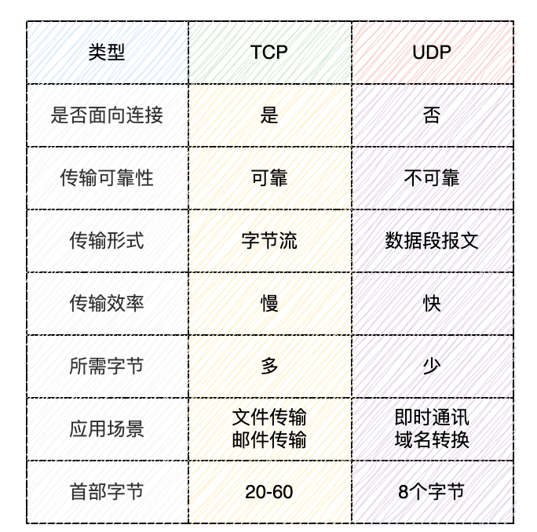
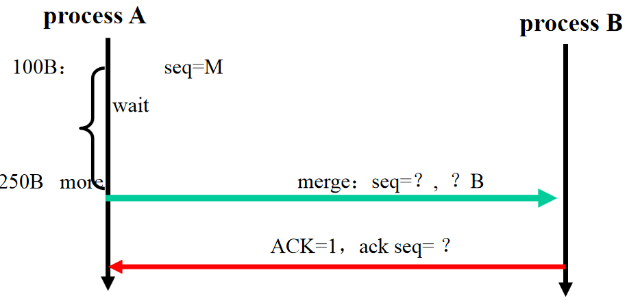

# 传输层

多路复用Multiplexing at send host:gathering data from multiple sockets, enveloping data with header (later used for demultiplexing)

多路分解Demultiplexing at rcv host:delivering received segments to correct socket

## UDP协议

尽力而为，无连接，不可靠，简单，首部开销小，支持广播和组播。

**检验和（checksum）**

1.   对于数据D，发送方计算所有数据16比特字的和，如果溢出则回卷（指加到最后一位）。
2.   求这个和的反码（就是将结果的0换成1，1换成0）。
3.   将数据与检验和发送给接收方。
4.   接收方将数据和检验和的所有16比特字加到一起，如果结果全为1，则正确，反之出错。

## 可靠传输原理（重要）

**可靠传输组件**

-   ACK（acknowledgements ）与NAK（negative acknowledgements）：向发送方反馈信息，某个分组是否被正确接收。
-   校验和（checksums）：检测分组比特差错。
-   序列号（sequence numbers）：检测数据包顺序差错与冗余数据包。
-   定时器（timers）：检测丢包问题。
-   窗口，流水线：允许发送方发送多个分组而不需等待确认。

**特殊情况处理**

-   累积确认（cumulative acknowledgement）。`ACK(n)`指接收方已经正确接收序号小于等于`n`的分组。如果发送方收到`ACK(120)`但没有收到`ACK(100)`，也认为序号100以及之前的数据被正确接收。
-   当超时事件发生后，超时间隔被设置为原来的两倍。
-   快速重传（fast retransmit）。当发送方接收到对相同数据的三个冗余ACK（duplicate ACK），在定时器过期之前立即重传之后的报文段。

>   对快速重传的解释：三个冗余ACK大概率是由于某个报文段丢失导致的，在之后的（乱序）报文段到达接收方之后，接收方会发出大量的冗余ACK。
>
>   为什么是三个而不是两个：两个冗余ACK也可能仅仅因为乱序导致，而不是丢失。必须说明对于冗余ACK原因的猜测是基于经验给出的，而不绝对。

## 停等协议与流水线协议

自动重传请求（Automatic Retransmission reQuest，ARQ）指在接收站接收到一个包含出错数据的信息（帧）时,自动发出一个重传错帧的请求。是OSI模型中数据链路层和传输层的错误纠正协议之一。它包括停止等待ARQ协议和连续ARQ协议。

stop and wait：Sender sends one packet, then waits for receiver response

流水线协议包括回退N步（Go-Back-N，GBN）协议和选择重传（Selective Repeat，SR），共同特点是允许发送方发送多个分组而不需等待确认，这是停等协议做不到的。

**时间使用率计算**

在一条数据传输速率为 1 Gbps的链路上，对于长度为 8000 bit分组，单向传播时延为 15 ms，计算停等协议与流水线协议（一次发三个包）的时间使用率。
$$
d_{trans}=\frac{L}{R}=\frac{8000 bit}{10^9 bps}=0.008ms
$$
停等协议：
$$
U_{sender}=\frac{L/R}{\text{RTT}+L/R}=\frac{0.008ms}{2\times15ms+0.008ms}=0.027\%
$$
流水线协议（一次发三个包）：
$$
U_{sender}=\frac{3\times L/R}{\text{RTT}+L/R}=\frac{0.024ms}{2\times15ms+0.008ms}=0.08\%
$$

**GBN协议**

-   接收方流水线中未确认的分组不能超过N个。
-   ACK采用累积确认（cumulative acknowledgement），`ACK(n)`指接收方已经正确接收序号小于等于`n`的分组。
-   对于超时，失序和出错，发送方需要重传所有“已发送，未确认”的分组。
-   窗口长度必须小于序号空间大小。

**SR协议**

-   只需要重传丢失和出错的包。不需要重传失序的包，失序的包将在接收方缓存。
-   因此`ACK(n)`仅指代接收方已经正确接收序号等于`n`的分组。
-   窗口长度必须小于等于序号空间大小的一半。（比如序号为0，1，2，3，窗口长度必须小于等于2）

问：卫星信道上数据传输速率为1Mb/s，数据帧长为1000bit，卫星信道的传播时延为270ms，而帧的控制信息、确认帧长及帧处理时间均可忽略不计。当采用下列三种协议时，试计算可能达到的信道利用率是多少？ A. stop-and-wait   B. Go-Back-N, WT(发送窗口大小) =6, WB=1; C. Select Repeat, WT =5 ,WB =5

答：
$$
信道利用率 = \frac{数据发送时间}  {数据发送时间 + 传播时延}
$$

$$
A信道利用率 =\frac{ 1000bit \div 1Mb/s}{ 1000bit \div 1Mb /s+270ms\times 2}=0.184842\%
$$

$$
B信道利用率 =\frac{ 1000bit \div 1Mb/s \times 6}{ 1000bit \div 1Mb/s +270ms\times 2}=1.109057\%
$$

$$
C信道利用率 =\frac{ 1000bit \div 1Mb/s \times 5}{ 1000bit \div 1Mb/s +270ms\times 2}=0.924214\%
$$

## TCP协议（重要）

传输控制协议（Transmission Control Protocol，TCP），基于连接的，提供可靠数据传输服务，流量控制（flow control），拥塞控制。

### 报文格式

### 三次握手

三次握手（Three way handshake），指建立TCP连接时客户端与服务器需要进行三次通信。

1.   客户端发送一个特殊的TCP报文，无数据，SYN字段置1，给出客户端初始seq序号。
2.   服务器发送一个特殊的TCP ACK报文，无数据，SYN字段置1，ACK字段置1，给出服务器初始seq序号。
3.   客户端发送普通的TCP ACK报文。

### 四次挥手

四次挥手，指关闭TCP连接时客户端与服务器需要进行两次通信。（双向关闭）

1.   如果客户端想要关闭与服务器的TCP连接，客户端发送一个特殊的TCP报文，无数据，FIN字段置1。
2.   服务器发送普通的TCP ACK报文。
3.   如果服务器想要关闭与客户端的TCP连接，服务器发送一个特殊的TCP报文，无数据，FIN字段置1，ACK字段置1。
4.   客户端发送普通的TCP ACK报文。并开启定时器。
5.   客户端定时器结束后什么也不做。

>   如果是单方向的关闭：
>
>   1.   如果客户端想要关闭与服务器的TCP连接，客户端发送一个特殊的TCP报文，无数据，FIN字段置1。
>   2.   服务器发送普通的TCP ACK报文。并开启定时器。
>   3.   服务器定时器结束后什么也不做。
>
>   补充：
>
>   -   定时器的作用是：如果ACK报文丢失了，定时器结束前客户端会再发一次关闭请求，服务器再发一次ACK。如果定时器正常结束，则可以推断出一切正常。
>   -   这是单方向的关闭，即客户端不再向服务器发送数据（但是ACK还能发）。服务器端还得再来两次挥手才能双向关闭。
>
>   

### seq与ACK序号计算

>   答案：M+100，M+100，M+350

>   答案：M+100，N+500

>   答案：5096

>   答案：90100，90000，90100，90000

>   答案：M，350，M+350

>   答案：M+100，M+550

>   答案：M，M+1000，M+2000，M+3000，M+2000，M+4000

**综合**

>   ACK回答一般不占seq序列号，带有SYN=1与FIN=1的ACK回答例外。

### 估计RTT

$$
\text{EstimatedRTT} = (1- \alpha )\times \text{EstimatedRTT} + \alpha \times \text{SampleRTT}
$$
使用了指数加权平均（exponential weighted moving average，EWMA）。

### 流量控制

流量控制（flow control）将发送方的发送速率与接收方应用程序的读取速率向匹配，来防止接收方缓存溢出。

接收方可以将缓存余量放入报文段中发给发送方，发送方保证发送的数据量不会使缓存溢出。

当缓存余量为0时，发送方发送只有一个字节数据的报文段（而不是什么都不做！），来让接收方返回更新后的缓存余量。

### 拥塞控制

拥塞控制（congestion control）在网络拥塞时调整发送方的发送速率来避免拥塞。以下图为例，包含几个部分：

-   慢启动（slow-start）。cwnd从一个MSS开始，如果没有丢包，cwnd在到达ssthresh前每过一个RTT翻倍。
-   拥塞避免（congestion avoidance）。cwnd在到达以及超过ssthresh后，每过一个RTT，cwnd增加一个MSS。
-   超时后将ssthresh设置为当前cwnd的一半，然后将cwnd设置为1，开始慢启动阶段。
-   上图中蓝色的线，即TCP早期版本 Tahoe，在收到三个冗余ACK后使用快速重传，再将ssthresh设置为当前cwnd的一半，然后将cwnd设置为1，再次开始慢启动阶段。
-   快速恢复（fast recovery）。上图中黑色的线，即TCP较新版本 Reno，在收到三个冗余ACK后使用快速重传，再将ssthresh设置为当前cwnd的一半，然后将cwnd设置为ssthresh，直接开始拥塞避免阶段。

其中的术语速查：

-   cwnd：拥塞窗口（congestion window，cwnd）。
-   MSS：最大报文段长度（Maximum Segment Size，MSS），一般为最大链路层帧长度。
-   ssthresh：慢启动阀值（slow-start threshold）。
-   RTT：往返时间（Round-Trip Time，RTT），指一个**短**分组从客户到服务器再返回客户的时间。

additive increase: increase  CongWin (congestion window) by 1 MSS (Maximum Segment Size )every RTT until loss detected MSS=MTU-IP-TCP 

multiplicative decrease: cut CongWin in half after loss 

>   问：有一个TCP连接,当它的拥塞窗口大小为64个分组大小时超时，假设该线路往返时间RTT是固定的即为3s，不考虑其他开销，即分组不丢失，该TCP连接在超时后处于慢开始阶段的时间是多少秒? 
>
>   答：当超时的时候,ssthresh变为cwnd大小的一半，即$ssthresh=64 \div 2=32$，此后cwnd重置为1，再次开始慢启动算法｡经过5个RTT，拥塞窗口大小变为$2^5=32$达到ssthresh。此后便改用拥塞避免算法。因此，该TCP连接在超时后重新处于慢开始阶段的时间是$5\times RTT=15s$｡

## Socket

Socket是一种在计算机网络中用于通信的抽象概念。它实际上是一个应用程序接口（API），允许不同的计算机进程在网络上进行通信。Socket允许在网络中的两个节点之间建立连接，并通过该连接发送和接收数据。

在网络编程中，Socket通常表示为IP地址和端口号的组合，用于标识网络中的特定通信节点。它可以基于不同的传输协议，如TCP（传输控制协议）或UDP（用户数据报协议），来进行数据的可靠或不可靠传输。

创建socket（指定TCP还是UDP、IP地址和端口号），然后通过它收发数据。