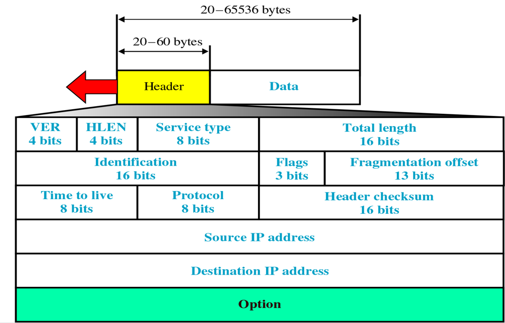

# 网络层（数据平面）

## 路由器

**功能**

-   run routing algorithms/protocol (RIP, OSPF, BGP)
-   forwarding datagrams from incoming to outgoing link

**组件**

-   输入端口：线路端接；数据链路处理；查找转发排队。
-   交换结构：经过内存，总线，或者交互网络（crossbar）交换
-   输出端口：（同输入端口）
-   路由选择处理器

**分组调度（Packet Scheduling）**

-   FCFS（first come, first served）: packets transmitted in order of arrival to output port，also known as: First-in-first-out (FIFO) 
-   priority：send packet from highest priority queue that has buffered packets，FCFS within priority class
-   循环排队（round robin）：server cyclically, repeatedly  scans class queues, sending one complete packet from each class (if available) in turn
-   加权公平排队（Weighted Fair Queuing ，WFQ）：each class, i, has weight, wi, and gets weighted amount of service in each cycle:$\frac{w_i}{\sum w_j}$

>   线路前部阻塞（Head-of-the-Line ，HOL）blocking: queued datagram at front of queue prevents others in queue from moving forward

>   网关（Gateway）又称网间连接器、协议转换器。在传输层上以实现网络互连，常用来连接两种不同的网络，在不同网络协议间充当翻译角色。

## 五类网络（重要）

-   A类网络，0.0.0.0 至 127.255.255.255。网络号（Netid）前8位，主机号（Hostid）后24位。以`0`开头。
-   B类网络，128.0.0.0 至 191.255.255.255。网络号前16位，主机号后16位。以`10`开头。
-   C类网络，192.0.0.0 至 223.255.255.255。网络号前24位，主机号后8位。以`110`开头。
-   D类网络，224.0.0.0 至 239.255.255.255。不分网络号和主机号。以`1110`开头。用于组播与IGMP协议。
-   E类网络，240.0.0.0 至 255.255.255.255。不分网络号和主机号。以`1111`开头。保留。

>   补充：
>
>   **回环（loopback）地址**，127.0.0.0 至 127.255.255.255。
>
>   127.0.0.1是保留地址之一，经常被使用，来检验本机TCP/IP协议栈工作是否正常。如果可以ping通的话，就说明本机的网卡和IP协议安装都没有问题。（跟当前主机有没有联网没有关系）
>
>   **私有（private）IP地址**，用于本地局域网，通过NAT协议转换：
>
>   -   10.0.0.0  至 10.255.255.255
>   -   172.16.0.0 至 172.31.255.255
>   -   192.168.0.0 至192.168.255.255

**分配子网**

如果一个主机的IP为202.112.41.241，掩码为255.255.255.224，给出其网络号和主机号，并计算最多分配多少子网。

掩码共27位，网络号为202.112.41.241的前27位，即202.112.41.224，主机号为后面5位，即0.0.0.17。202.112.41.241在C类网络中，本来的掩码是24位，多出来的3位掩码可以分配子网，共8个：202.112.41.0； 202.112.41.32； 202.112.41.64；   202.112.41.96； 202.112.41.128； 202.112.41.160；   202.112.41.192； 202.112.41.224；

**CIDR/VLSM**

域内无分类编址（Classless InterDomain Routing，CIDR）

-   subnet portion of address of arbitrary length: 可变长子网掩码（Variable Length Subnet Masking ，VLSM）
-   address format: a.b.c.d/x, where x is # bits in subnet portion of address

**空间利用率**

一个网段上需要连接最多8740台计算机设备，若对其分配IP地址,问A、B、C哪一类地址最合适（1分），并写出对应的子网掩码（1分）? 如果采用无分类域间编码，写出子网掩码（1分）。这两种情况下，地址空间利用率分别为多大（2分）？

$2^{13}<8740<2^{14}$，主机位必须大于等于14位，掩码长必须小于等于18位，B类地址最合适，子网掩码为255.255.0.0。采用无分类域间编码，子网掩码为255.255.192.0。

若采用B类地址，$利用率=\frac{8740}{2^{16}-2}=13.33\%$
若采用无分类域间编码，$利用率=\frac{8740}{2^{14}-2}=53.35\%$

## IPv4（重要）

**IPv4格式**



具体看图，几个注意点如下：

-   头长度为20字节至60字节。因为首部信息的前20字节必须存在，选项（Option）部分是可选的，0字节至40字节。在考试大题中，如果没有说明，默认头长度为20字节。
-   头长度（head len）用4个比特标识。4个比特可以表示的范围是0~15，在乘4得到头长度字节数。如果4个比特为`1111`，$头长度=15\times 4=60字节$。如果4个比特为`0101`，$头长度=5\times 4=20字节$。
-   总长度（Total length）包括头长度与数据，以字节计，因为该字段长16比特，所以IP数据报的理论最大长度为65535字节。（虽然IP数据报长度很少超过1500字节）

**IPv4分片**

一个链路层帧能承载的最大数据量叫**最大传送单元（Maximum Transmission Unit，MTU）**。IPv4分片（fragmentation）将过大的IP数据报中的数据分割为几个较小的片（fragment）供链路层传输。

这些片头信息中，源地址，目的地址，标识号都应该是相同的。需要改变长度（length），标志比特（fragflag）与偏移量（offset）。

-   长度（length）：包含头在内的总长度。
-   标志比特（fragflag）：最后一个片的标志比特设置为0，其他片设置为1。
-   偏移量（offset）：指定该片应该放在原始IP数据报的数据中哪个位置。

IPv6不允许分片，丢弃太大的数据报并且向发送方发回一个“分组太大”的ICMP报文。

例子：对于一个4000字节的数据报，要在一条MTU为1500字节的链路上传播，如何分片？


解释：

-   如果没有明确给出，头长度为20比特。
-   偏移量需要除以8，因为每个分片的长度一定是8字节的整数倍。如果MTU减去头长度不能被8整除，下取整。

## DHCP

动态主机配置协议（Dynamic Host Configuration Protocol，DHCP）allow host to dynamically obtain its IP address from network server when it joins network

1.   DHCP discover：host broadcasts “DHCP discover” msg
2.   DHCP offer：DHCP server responds with “DHCP offer” msg
3.   DHCP request：host requests IP address: “DHCP request” msg
4.   DHCP ACK：DHCP server sends address: “DHCP ack” msg.DHCP返回的不仅仅是IP地址，还包括了：（1）客户的第一跳路由器（可能是网关）的地址。（2）DNS服务器的IP地址和域名。（3）网络掩码（用于指示网络的网络号部分和主机号部分）。


>   Q: How does an ISP get block of addresses?
>
>   A: 互联网名称与数字地址分配机构（Internet Corporation for Assigned Names and Numbers，ICANN） allocates addressesmanages DNSassigns domain names, resolves disputes

## NAT

网络地址转换（Network Address Translation，NAT）把内部私有IP地址翻译成合法外部网络IP地址的技术。

-   NAT是作为一种解决IPv4地址短缺以避免保留IP地址困难的方案而流行起来的。
-   local network uses just one IP address as far as outside world is concerned
-   devices inside local net not explicitly addressable, visible by outside world (a security plus)


NAT traversal穿透   various methods employed to set up and maintain a TCP/IP network or UDP connections that cross NAT gateways. 

## IPv6（重要）

**IPv6格式**


**IPv6与IPv4区别**

-   IPv4地址长32比特，使用点分十进制，IPv6地址长128比特，使用8组，每组4个十六进制数来表示，即冒号十六进制记法（colon hexadecimal notation）
-   IPv6地址可以使用零压缩（zero compression）简化表示，即一连串连续的零可以为一对冒号所取代。
-   IPv4头长度可变（20字节至60字节），IPv6头长度固定40字节。
-   IPv6基本首部不支持分片，首部信息也没有检验和与选项字段。
-   IPv6增强了对进一步扩展，安全，任播，服务质量（Quality of Service，QoS）的支持。
-   IPv6 把原来 IPv4 首部中选项的功能都放在扩展首部中，并将扩展首部留给路径两端的源站和目的站的主机来处理。数据报途中经过的路由器都不处理这些扩展首部（只有一个首部例外，即逐跳选项扩展首部）。这样就大大提高了路由器的处理效率。
-   六种扩展首部： 逐跳选项，路由选择，分片，鉴别，封装安全有效载荷，目的站选项。 


## ICMP

因特网控制报文协议（Internet Control Message Protocol，ICMP），used by hosts & routers to communicate network-level information。

ping程序，traceroute程序的基础。

从封装来说，ICMP封装在IP中，属于传输层。从功能来说，为网络层服务。考试时答网络层。

```
Type  Code  description
0        0         echo reply (ping)
3        0         dest. network unreachable
3        1         dest host unreachable
3        2         dest protocol unreachable
3        3         dest port unreachable
4        0         source quench (congestion control - not used)
8        0         echo request (ping)
9        0         route advertisement
10      0         router discovery
11      0         TTL expired
12      0         bad IP header
```