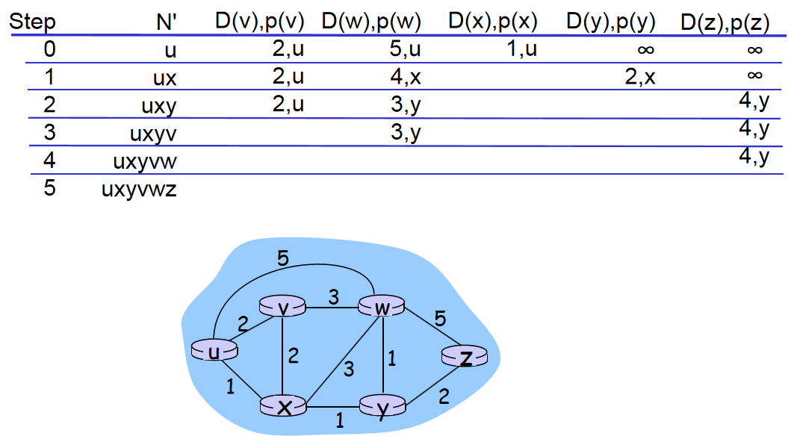
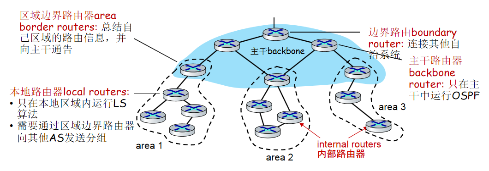

# 网络层（控制平面）

## 路由表（重要）

一个简化的路由表包含以下五个属性：

1.   目标网络IP地址（destination）
2.   目标网络子网掩码（mask）
3.   下一站IP地址（next hop），直连用C表示
4.   离出接口名（interface）
5.   代价（cost），不同协议的代价定义是不同的

上面两张路由表的cost直连为0，准确来说是经过中转路由器的个数。（考试中直连默认为零，如果没明确给出的话）

**掩码处理方法**

对于如下路由表项：

| destination   | mask            | next    |
| ------------- | --------------- | ------- |
| 128.30.33.128 | 255.255.255.128 | inter 1 |

对于一个到达路由器的数据报（datagram），它的目的主机IP为128.30.33.138。

首先将目的主机IP与掩码做**与运算**。
$$
\begin{align}
&128.030.033.138 \\
&255.255.255.128 \\
&——————— \\
&128.030.033.128
\end{align}
$$
与destination中的表项符合，匹配成功，向下一站转发。

**最长匹配原则**

最长匹配原则指对于多个前缀匹配项，路由器选择前缀最长的匹配项，并向对应接口转发分组。

在具体实现上，在路由器构建路由表时，将掩码较长的项放在前面，所以在分组到来时，从上向下寻找，找到一个就向对应接口转发，不遍历整张表。

## 路由选择算法分类

-   集中式路由选择算法（centralized routing algorithm）。路由器知道全局的，完整的网络知识，来计算源与目的地之间的最低开销路径。对应链路状态（link state，LS）算法，对应最短路径优先路由协议OSPF（Open Shortest Path First）。
-   分散式路由选择算法（decentralized routing algorithm）。每个节点只知道与其直连的链路开销知识，通过迭代计算过程以及和相邻节点交换信息计算最低开销路径。对应距离向量（distance vector, DV）算法，对应路由信息协议RIP ( Routing Information Protocol)。
-   静态路由选择算法（static routing algorithm）。需要人工进行配置路由。
-   动态路由选择算法（dynamic routing algorithm）。周期性运行或直接响应链路开销变化自动配置路由。

>   以上是书上内容，ppt上还补充了：
>
>   1.   静态vs动态。静态路由优先级最高，高于动态路由。
>   2.   单路径vs多路径。多路径指到达同一目的地的同时走多条路径，可以实现数据流量的多路复用。路径路由算法可以提供更大的数据吞吐量，同时增强了网络的可靠性。
>   3.   单层结构vs分层结构。在单层次的路由系统中，所有的路由器都是对等的；在分层路由系统中，存在主干路由器，任何两台非主干路由器通信必须通过主干路由器传递。
>   4.   域间vs域内。有些路由算法只能在单独的域中使用；另外一些路由算法则既可以在域间也可以在域内使用，缓解随着网络规模增长带来路由表增大的问题。
>   5.   链路状态vs距离向量。

## 静态路由

静态路由固定了路径的转发，网络发送变化时需要人工进行配置修改。其特点包括：

1.   静态路由固定了路径的转发，因此对路由器的路由选择进行控制，节省了网络带宽，减少了额外开支。
2.   静态路由是单向的，它只设定了从此路由设备转发到目标出去的路径。
3.   静态路由缺乏灵活性，网络发送变化时需要人工进行配置修改。

## 链路状态算法（重要）

链路状态（link state，LS）算法，本质上是用Dijkstra算法找到最短路径，会画表就行。

LS算法可能出现的问题：震荡。指在某一时刻所有路由都向开销最小的链路发送数据报，报使得该链路开销剧增，下一时刻所有路由都避免向该链路发送数据报，使得该链路开销剧减，以此循环。解决方法之一是随机化每台路由器发送链路通告的时间。

## 距离向量算法

距离向量（distance vector, DV）算法，本质上是用贝尔曼-福特（Bellman-Ford）算法（对于这个算法的详细讨论，证明以及实现，各种[算法书](https://gitee.com/QMMMS/reading-notes/blob/main/%E3%80%8A%E7%AE%97%E6%B3%95%20,4e%E3%80%8B(Java)/qms_59_BellmanFordSP.java)上都有）找到最短路径。这个算法的本质是：
$$
d_x(y) = \text{min}_v\{c(x,v) + d_v(y)\}
$$

-   其中，$d_x(y)$指x到y的最短路径。
-   v是x的邻居。
-   $c(x,v)$是x到v的直连链路开销。

举个例子，还是上面那个图，如果要计算$d_u(z)$：
$$
\begin{align}
d_u(z) &= \min \{ c(u,v) + d_v(z),
                    c(u,x) + d_x(z),
                    c(u,w) + d_w(z) \} \\
        &= \min \{2 + 5,
                    1 + 3,
                    5 + 3\}    \\
        &= 4
\end{align}
$$
如果$v^*$是令$D_x(y)$取得最小值的邻居，则x要向y发送数据报时，先发给$v^*$。

当x的距离向量更新了，则x将更新后的距离向量传给它的邻居，让邻居更新。

DV算法的特点包括：

-   开销减少的好消息传递得很快，指开销减少的路由表更新可以在较少的迭代次数后传递给所有路由器，或者说收敛速度快。
-   开销增大的坏消息传递得很慢，指开销增大的路由表更新需要较多的迭代次数才能完成。这会导致**路由选择环路（routing loop）**，即在路由表更新完成之前，为了到达目的地x，源y先把数据报发给z，z再发给y，来回反复直到路由表更新完成才能找到正确路径。为了解决路由选择环路，可以采用**毒性逆转（Poison Reverse）**和**触发刷新（Triggered Update）**。
    -   毒性逆转（poisoned reverse）。如果z通过y路由到达目的地x，则z通告y，z到x的距离是无穷大。
    -   触发刷新（Triggered Update）。一旦检测到路由崩溃，立即广播路由刷新报文，而不等到下一刷新周期。显然可以加快新路由的有效刷新。

>   补充：**路由算法评价标准**
>
>   -   最优性。指路由算法选择最佳路径的能力
>   -   低开销。最大程度的降低软件和使用开销（比如说报文数量与复杂度Message complexity）
>   -   聚敛速度（Speed of Convergence）。当因为某种原因使路由器出现问题而无法继续正常使用时，路由器会发出路由更新信息传遍整个网络，重新计算最优路径，并最终使所有路由器就新路径达成一致。 
>   -   适应性或健壮性（Robustness）。能够快速准确的适应不同的网络环境。路由算法应当能够通过编程，适应网络带宽，网络时延等参数变量的变化。

## 层次路由

层次路由（Hierarchical Routing）是一种网络路由的结构化方案，将网络划分成若干个层次和区域。这些区域称为自治系统（autonomous systems，AS），每个自治系统内使用统一的路由协议进行路由控制。

自治系统（Autonomous System，AS）是指由一组路由器及其连接的网络组成的单个管理域，这个管理域通常被视为一个独立的单位，有着自己独立的路由策略和自治能力。在自治系统内部，使用统一的路由协议进行路由控制，在自治系统之间，使用BGP（边界网关协议）来实现与其他自治系统之间的路由器通信。

自治系统内部使用的协议，称为内部网关协议（Interior Gateway Protocol，IGP），或者intra-AS routing protocol。包括路由信息协议RIP、最短路径优先路由协议OSPF。

自治系统之间使用的协议，称为外部网关协议（Exterior Gateway Protocol，EGP），或者inter-AS routing protocol。包括边界网关协议BGP。

## RIP协议（重要）

路由信息协议( Routing Information Protocol，RIP )，基于距离向量（distance vector, DV）算法。关于距离度量（distance metric），如果采用hop，直连为0。（考试中直连默认为零，如果没明确给出的话）

每30秒，距离向量通过响应信息（Response Message， 或者 advertisement）在邻居间交换。

从封装来说，RIP封装在UDP端口520中，属于应用层。从功能来说，为网络层服务。考试时答网络层。

下图是报文格式，看看就行。

**路由表更新策略**

1.   如果目的地不存在，则加入路由表。
2.   对于相同目的地x，新旧cost来自不同路由器，$d(x) = \min\{old\_cost,new\_cost+1\}$，因为new_cost是邻居路由器$G_j$的，从本地到达还要加1。
3.   对于相同目的地x，新旧cost来自相同路由器$G_j$。如果目的地不可达，则删除目的地表项；如果有更新的new_cost，$d(x) = new\_cost+1$。

举个例子：

表一为原来的$G_i$路由表：

| Destination | cost | next  |
| ----------- | ---- | ----- |
| 10.0.0.0    | 0    | 直连  |
| 30.0.0.0    | 7    | $G_n$ |
| 40.0.0.0    | 3    | $G_j$ |
| 45.0.0.0    | 4    | $G_L$ |
| 180.0.0.0   | 5    | $G_j$ |
| 190.0.0.0   | 10   | $G_m$ |
| 199.0.0.0   | 6    | $G_j$ |

表二是来自路由器$G_j$的更新：

| Destination | cost |
| ----------- | ---- |
| 10.0.0.0    | 4    |
| 30.0.0.0    | 4    |
| 40.0.0.0    | 2    |
| 41.0.0.0    | 3    |
| 180.0.0.0   | 5    |

现在要给出更新后的$G_i$路由表，如下：

| Destination | cost | next  |
| ----------- | ---- | ----- |
| 10.0.0.0    | 0    | 直连  |
| 30.0.0.0    | 5    | $G_j$ |
| 40.0.0.0    | 3    | $G_j$ |
| 41.0.0.0    | 4    | $G_L$ |
| 45.0.0.0    | 4    | $G_j$ |
| 180.0.0.0   | 6    | $G_j$ |
| 190.0.0.0   | 10   | $G_m$ |

## OSPF协议

OSPF协议，全称开放最短路径优先路由（Open Shortest Path First）协议。基于链路状态（link state，LS）算法。OSPF消息是封装在IP数据报中的，因此从封装来说，OSPF属于传输层。从功能来说，为网络层服务。考试时答网络层。

**OSPF相较与RIP的区别**

-   安全。可以鉴别（authenticated）OSPF报文的真实性。
-   允许存在多条相同开销的路径。
-   对单播与多播的综合支持。
-   支持层次路由结构。

层次OSPF的示意图如下，看看就行。

## BGP协议

BGP协议，全称边界网关协议 (Border Gateway Protocol)。BGP报文被封装在TCP报文段中传输，因此从封装来说，属于应用层。从功能来说，为网络层服务。考试时答网络层。

提供以下功能：

-   从邻居AS获取获得前缀（或者说子网）可达性信息，并且向因特网的其他部分通告它（子网）的存在。
-   基于可达性信息与策略，确定到达某个子网的最佳路由。

跨越两个AS的BGP连接称为外部BGP（External Border Gateway Protocol，eBGP）。在相同AS中的两台路由器之间的会话称为内部BGP（Internal Border Gateway Protocol，iBGP）。示例图如下：

**热土豆路由选择**

BGP允许存在到某个前缀（子网）的多条路径（使用`下一站接口IP；AS路径；前缀`三个信息来标识一条路径）。那么在选择一条具体路径时，可以使用热土豆路由选择（hot potato routing）。它是一种BGP路由选择算法。

热土豆路由选择的思想是：将分组以最低开销送出其AS。

举个例子，在上面这个图中，在AS2中，如果要将分组送往x：

-   对于2a路由器，它会将分组先送往1c。
-   对于2c路由器，它会将分组先送往3a。

>   **不同协议的讨论（补充内容看看就行）**
>
>   有了IGP为什么要有iBGP？有了iBGP为什么要有IGP？
>
>   1.   IGP的能力限制。IGP处理路由的条目有限，BGP的路由控制能力大大强于IGP的路由控制能力。
>   2.   路由环路的问题。BGP是靠路由属性来防止路由环路的，如果没有iBGP协议，那么当所有BGP路由重分发到IGP中后，路由属性必然丢失，这就破坏了BGP的路由环路防止机制，产生了路由环路的隐患。
>   3.   BGP协议本身实际上并不发现路由，BGP将路由发现的工作全部移交给了IGP协议，它本身着重于路由的控制。因此，如果没有IGP，那么BGP也就毫无用处了。
>
>   为什么要有intra-AS（内部网关协议）与Inter-AS routing（外部网关协议）的区别？
>
>   1.   策略。在AS之间，策略起主导作用。
>   2.   性能。在AS内部，策略不起主导作用，我们更关心路由性能。
>   3.   规模。对于一个包含许多AS的庞大网络，我们需要扩展路由选择和实现分层路由来适应它。

>   **IGMP协议（补充内容）**
>
>
>   IGMP协议，全称互联网组管理协议（Internet Group Management Protocol）。是主机跟路由器之间的控制协议。主机通过IGMP协议报告自己想加入的组，路由器通过IGMP协议查询网络上是否还有特定组的成员，组播路由器每个端口都维护一张主机组成员表。
>
>   **IGMP工作流程**：
>
>   1.   IGMPv2 通过查询器选举机制从每个网段中选举出唯一的查询器(组播路由器充当）。
>   2.   对于周期性查询，主机发送报告消息的时间有随机性，当检测到同一网段内有其它成员发送同样的消息时，则抑制自己的响应报文。当一段时间没收到报告报文，则认为该组内没有主机了。
>   3.   如果有新的主机要加入组播组，不必等待查询消息，而是主动发送报告消息。
>   4.   当要离开组播组时，主机发送离开组消息；收到离开组消息后，查询器发送特定组查询消息来确定是否所有组成员都已离开。
>   5.   对于作为组成员的路由器而言，其行为和普通的主机一样，响应其它路由器的查询。

## 反向路径转发RPF

为了避免路由环路，正确地按照组播路由的配置转发报文，可以使用RPF，全称反向路径转发（Reverse path forwarding）。思想为：路由器收到组播数据报文后，只有确认这个数据报文是从自身连接到组播源的接口上收到的，才进行转发，否则丢弃。

## 生成树

为了避免在广播时遇到环路（cycle），洪泛（flooding）与广播风暴（broadcast storm）。可以使用生成树（spanning tree）来保证任何一个节点不会收到重复的包。

1.   选择一个中心节点。
2.   路由器向中心节点发送一个单播的加入消息来加入生成树。
3.   节点沿着生成树向下传递包。

两个例子如下：

