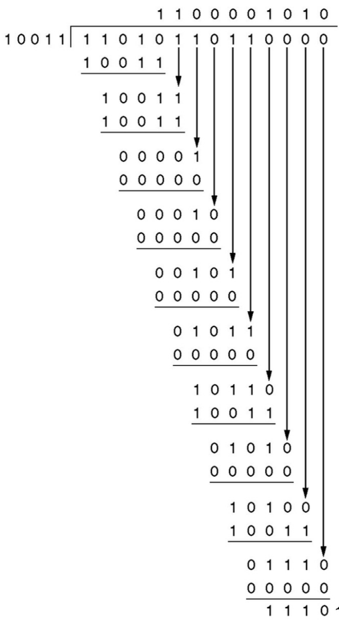
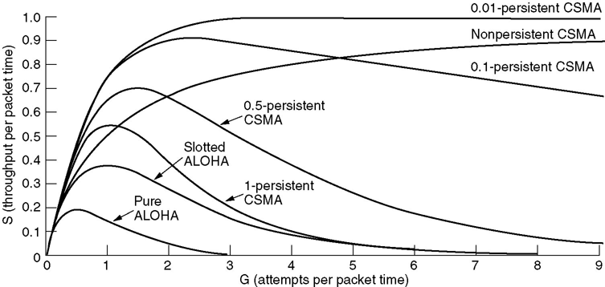
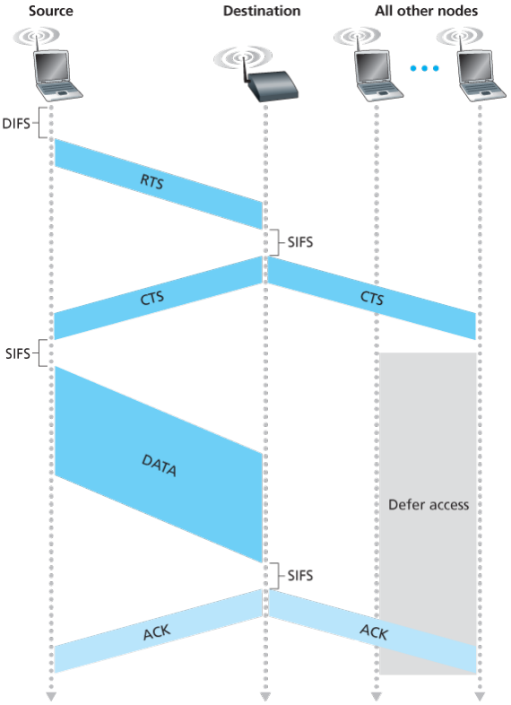

# 链路层

## 基本介绍

运行链路层协议的任何设备（包括主机和路由器）称为**节点（node）**。沿着通信路径连接相邻节点的通信信道称为**链路（link）**。链路层的任务是将数据报沿着端到端路径上的各段链路传输。链路层分组称为**帧（frame）**。链路层主体是在**网络适配器（network adapter）**或者说**网络接口卡（network interface card， NIC）**中实现的。


网卡是工作在链路层的网络组件，是局域网中连接计算机和传输介质的接口，不仅能实现与局域网传输介质之间的物理连接和电信号匹配，还涉及帧的发送与接收、帧的封装与拆封、介质访问控制、数据的编码与解码以及数据缓存的功能等。网卡的其他功能还有监控上传及下载流量，控制网速稳定的作用。

链路层提供的服务包括：

-   成帧（framing）。将网络层数据报用链路层帧封装起来。
-   可靠交付（reliable data transfer）。保证无差错地传递网络层数据报，特别对于误码率较高的无线链路。许多有线的链路层不提供可靠交付服务。
-   流量控制（flow control），差错检测（error detection）和纠正（correction）。

>   **单工通信**：
>
>   - 在单工通信中，数据只能在一个方向上进行传输。这意味着通信双方之间只有一个方向上的数据流动。
>   - 一个典型的例子是广播电台。听众可以接收广播电台传输的信息，但不能向广播电台发送信息。信息只能单向流动，从广播电台到听众。
>
>   **半双工通信**：
>
>   - 在半双工通信中，数据可以在两个方向上进行传输，但不能同时进行。这意味着通信双方可以交替地发送和接收数据，但不能同时进行发送和接收。
>   - 一台对讲机就是一个半双工通信的例子。用户可以按下按钮说话（发送数据），然后松开按钮听对方的回应（接收数据）。在同一时间内，对讲机只能进行发送或接收操作，而不能同时进行。
>
>   **全双工通信**：
>
>   - 在全双工通信中，数据可以在两个方向上同时进行传输。这意味着通信双方可以同时发送和接收数据，而不需要交替进行。
>   - 一个典型的例子是电话通话。通话双方可以同时说话和听对方说话，数据可以双向传输，而不需要等待或交替。

**局域网架构（补充内容）**

在IEEE802参考模型中，链路层被划分为两个子层：逻辑链路控制子层（Logical Link Control Sublayer，LLC）和媒体访问控制子层（Medium Access Control Sublayer，MAC）。


LLC一般只在无线链路中实现，功能包括：流量控制（flow control）和可靠交付（reliable data transfer）。

MAC在有线无线链路中都会实现，功能包括：帧的封装和解封装，地址解析（Address Resolution），差错检测，协调多个节点共享单个广播链路（或者说解决多路访问问题，这是MAC的主要功能）。MAC层的功能在本章重点介绍。

## 差错检测和纠正

**奇偶校验（parity checking）**

1.   如果要发送包含d个比特的数据，发送方加上一个额外的校验比特。如果采用偶校验，则使这（d+1）个比特中1的总数为偶数。
2.   接收方接收（d+1）个比特，如果采用偶校验，但是1的总数为奇数，则检查出错误。但是没有差错纠正能力。

**检验和（checksum）**

1.   对于数据D，发送方计算所有数据16比特字的和，如果溢出则回卷（指加到最后一位）。
2.   求这个和的反码（就是将结果的0换成1，1换成0）。
3.   将数据与检验和发送给接收方。
4.   接收方将数据和检验和的所有16比特字加到一起，如果结果全为1，则正确，反之出错。

**循环冗余检测（Cyclic Redundancy Check，CRC）**

1.   接收方和发送方提前规定一个生成模式G，包含（r+1）个比特。
2.   发送方要发送一个包含 d 比特的数据D，使用公式 $R=(D\times2^r) \mod G$ 来生成R。这里的二进制算式不进位，不借位。R包含 r 个比特。再将 D+R 共（d+r）个比特发给接收方。
3.   接收方计算（D+R）除以 G ，如果余数为0，则正确，反之有错误。
4.   CRC可以检测到连续的 r 比特或者更少的误差。

>   问：对于CRC生成多项式$x^4+x^2+1$，接收方收到`111011001`，是否出错？
>   答：G=10101，r=4，111011001 mod 10101 不等于 0，出错。
>
>   问：data: 1101011011。G:10011。求CRC。
>
>   答：$R=(data\times2^4) \mod G=1110$
>   

## 多路访问链路和协议

媒体访问控制（别名介质访问控制，Medium Access Control Sublayer，MAC）协议，主要功能是协同局域网上所有计算机发送帧的行为，有效避免帧冲突的发生，提高共享信道的利用率。

在一个共享广播信号的链路中，如何协调多个发送和接收节点的访问称为**多路访问（Multiple Access）问题**。因为当多个节点在同一条链路上传输帧时，多个帧发生**碰撞（collide）**，它们的信息都被完全破坏了。**多路访问协议（multiple access protocol）**规范多个节点在共享广播信道上的传输行为。

这些多路访问协议划分为：

-   信道划分协议（Channel Partitioning Protocols）
    -   时分多路复用（time division multiple access，TDMA）
    -   频分多路复用（frequency division multiple access，FDMA）
-   随机接入协议（Random Access Protocols）
    -   时隙ALOHA（slotted ALOHA）
    -   ALOHA
    -   载波监听多路访问（Carrier Sense Multiple Access，CSMA）
    -   具有碰撞检测的载波监听多路访问（Carrier Sense Multiple Access with Collision Detection，CSMA/CD）
    -    具有碰撞避免的载波监听多路访问（Carrier Sense Multiple Access with Collision Avoidance，CSMA/CA）
-   轮流协议（taking-turns protocols）
    -   轮询协议（polling protocol）。主节点以循环的方式轮询（poll）每个节点。
    -   令牌传递协议（token-passing protocol）。传递令牌，有令牌才发送帧。

## 时隙ALOHA

when node obtains fresh frame, transmits in next slot

-   if no collision: node can send new frame in next slot
-   if collision: node retransmits frame in each subsequent slot with prob. p until success

Max efficiency = 1/e = 0.37

## ALOHA

unslotted Aloha: simpler, no synchronization

when frame first arrives，transmit immediately，if collision， node retransmits frame later with prob. p until success

Max efficiency = 1/(2e) = 0.18

## CSMA/CD（重要）

CSMA/CD：Ethernet’s Media Access Control (MAC) policy，**带冲突检测的载波侦听多路访问协议**

IEEE 802.3标准：以CSMA/CD技术为基础的局域网标准。

**运行过程**

1.   帧已经准备好，随时可以发送。
2.   如果监听到信道空闲，则开始传输帧。否则等待直到信道空闲。
3.   在传输过程中，监听是否有其他的帧信号。
4.   如果在传输过程中没有其他的帧信号，顺利传输结束。
5.   如果有碰撞，立即停止传输，在等待一个随机时间量后回到步骤2。


>   -   Nonpersistent CSMA：非持续式： 经侦听，如果介质空闲，开始发送，如果介质忙，则等待一个随机分布的时间，然后重复步骤 1 
>       优点：等待一个随机时间可以减少再次碰撞冲突的可能性 
>       缺点：如果在这个随机时间内介质上没有数据传送，则会发生浪费 
>   -   1-persistent CSMA：1-持续式： 经侦听，如介质空闲，开始发送 如介质忙，持续侦听，一旦空闲立即发送 如果发生冲突，等待一个随机分布的时间再重复步骤 1 
>       优点：持续式的延迟时间要少于非持续式 
>       缺点：如果两个以上的站等待发送，一旦介质空闲就一定会发生冲突
>   -   P-persistent CSMA：经侦听，如介质空闲，那么以 p 的概率发送，以(1–p)的概率延迟一个时间单元发送如介质忙，持续侦听，一旦空闲重复步骤 1 如果发送已推迟一个时间单元，再重复步骤 1
>
>   
>
>   IEEE 802.3 uses 1-persistent
>
>   To ensure backoff maintains stability, IEEE 802.3 and Ethernet use binary exponential backoff

**二进制指数后退**

After aborting, NIC enters exponential backoff: after mth collision, NIC chooses K at random from {0,1,2,…,2m-1}. NIC waits K·512 bit times, returns to Step 2（waits until channel idle, then transmits）

Bit time: .1 microsec for 10 Mbps Ethernet ;for K=1023, wait time is about 50 msec

Delay time is selected using binary exponential backoff

1.   1st time: choose K from {0,1} then delay = K * 51.2us
2.   2nd time: choose K from {0,1,2,3} then delay = K * 51.2us
3.   nth time: delay = K x 51.2us, for K=0..2n – 1Note max value for k = 1023
4.   give up after several tries (usually 16)Report transmit error to host

**最小帧长**

竞争时间片（contention slot）的长度为信道最大传输延迟T的2倍。因为一个站点发送数据后，最多需经2T的时间才能检测到冲突。竞争时间片也叫冲突检测时间。

对于MAC最短帧，发送时间必须大于冲突检测时间，才能检测到是否冲突。因此：
$$
最短帧长=最大传输延迟\times 2 \times 数据传输速率
$$
或者：
$$
最短帧长=2 \times 数据传输速率(单位为bps) \times \frac{距离}{信号传播速度(单位为m/s)}
$$
如果在2.5公里长的信道上，2T为51.2µs，数据传输速率为10Mbps，最小帧长=51.2µs x10Mbps=512 bit=64 Byte

如果在某网络上，数据传输速率为1Gbps，电缆长6km，信号在电缆中的速度为200,000km/s，$最小帧长=2\times \frac{6km}{2000000km/s} \times 1Gbps = 7500 Byte$

## ARP协议（重要） 

地址解析协议（Address Resolution Protocol，ARP）将网络层IP地址与链路层MAC地址做转换。

>   MAC地址（Media Access Control Address），直译为媒体访问控制地址，也称为局域网地址、MAC地址、以太网地址或物理地址（明明是链路层却习惯说是物理地址）。
>
>   -   负责链路层寻址。
>   -   一共48位，分为6部分，每部分用2个十六进制数表示，比如：`1A-2F-BB-76-09-AD`，以及广播地址`FF-FF-FF-FF-FF-FF`。
>   -   在网络接口卡NIC中保存，一般认为是全世界独一无二的，出厂后不可更改的，永久的。
>
>   与IP形成对比的是，IP地址是通过DHCP协议动态获取的，也是可变的。路由器与主机的每一个接口对应一个IP地址，网络接口卡，MAC地址。而链路层的交换机没有对应的IP地址，网络接口卡，MAC地址。

每个主机和路由器在内存中都有一张**ARP表（ARP table）**，记录了IP地址与MAC地址的映射关系，格式为`IP address; MAC address; TTL（Time To Live）`，比如：

```
  Internet Address      Physical Address      TTL
  210.30.97.1           00-01-f4-72-e1-67     13:45:00
  210.30.97.26          00-11-09-3d-78-01     13:52:00
  210.30.97.36          00-11-09-3d-79-05     13:59:00
```

如果正在寻找`210.30.97.1`的MAC地址，那么可以根据ARP表直接查出是`00-01-f4-72-e1-67`，如果要寻找的IP地址不在ARP表中，遵循以下步骤：

1.   发送方发送一个ARP查询分组，包含要查询的目标IP地址。MAC地址部分使用广播地址`FF-FF-FF-FF-FF-FF`向所有节点广播帧。
2.   收到查询分组的适配器检查自己的IP是否与目标IP匹配，若不匹配则丢弃分组。若匹配则在一个标准帧中向发送方返回ARP响应分组。
3.   发送方收到ARP响应分组，将`IP address; MAC address; TTL（Time To Live）`记录在ARP表中。

ARP分组（ARP packet）封装在链路层帧中，因此从封装来说，ARP属于网络层。从功能来说，为链路层服务。考试时答链路层。

>   补充：如果要将数据发送到子网以外的接收方，发送方的目标IP肯定是接收方IP，但目标MAC地址是什么？
>
>   如果目标MAC地址是接收方MAC地址，则这个子网内的所有主机和路由器都不会转发这个分组，因为在解封装到链路层时，发现接收方MAC地址与自身MAC地址不匹配后丢弃，这个分组哪也去不了。
>
>   因此目标MAC地址应当是路由器（网关）的MAC地址，这样路由器才会处理这个分组，并且向正确的接口转发。当然转发前会修改目标MAC地址为下一跳的路由器MAC地址。
>
>   在到达接收方漫长的网络旅途中，**目标IP恒定不变，而目标MAC地址不断改变**。

## 以太网帧格式

之前我们讨论的差错检测，多路访问协议，ARP协议都是附属链路层的“工具”，现在我们来看链路层报文的具体实现方式——以太网帧（或者称为MAC帧）。


-   前同步码，格式固定，64位。
-   地址都是MAC地址，所以48位，如果接收方检测到目的MAC地址与自身MAC地址不匹配，丢弃该帧。
-   数据长度可变，46到1500字节。
-   不算前同步码的话，以太网帧长度64到1518字节。


**以太网技术与标准**

以太网技术是一种有线局域网技术，使用二进制指数后退的CSMA/CD多路访问协议，为网络层提供无连接，无确认，不可靠的服务。严谨来说，以太网技术同时涉及链路层和物理层，考试答链路层。

在相同的MAC协议以及帧格式控制下，物理层有多种技术规格：

-   10Base2：10 Mbps 基带同轴电缆（coax cable）
-   10Base5：10 Mbps 基带粗同轴电缆
-   10Base-T：10 Mbps 双绞线（Twisted Pair，T ）
-   100Base-TX：100 Mbps 五类双绞线
-   100Base-FX：100 Mbps 光纤（Fiber Optics，F）
-   1000Base-FX：1Gbps 光纤

>   -   **基带（Baseband）**：信息源（发终端）发出的没有经过调制（频谱搬移和变换）的原始电信号所固有的频带（频率带宽），称为基本频带，简称基带。**可以理解为数字信号**。
>   -   **宽带（Broadband）**：**可以理解为模拟信号**。

## 交换机原理

交换机是链路层设备，端口没有对应的IP和MAC地址，对于主机是透明的（transparent），是即插拔（plug-and-play），自学习的（self-learning）。

each switch has a switch table, each entry:`MAC address of host, interface to reach host, time stamp`

switch learns which hosts can be reached through which interfaces，when frame received, switch “learns”  location of sender

-   frame destination unknown：flood
-   destination A location known：selective send

switches can be connected together

switch installation breaks subnet into LAN segments，segments become separate collision  domains


## CSMA/CA

IEEE 802.11标准是无线局域网标准，可以简单理解为Wi-Fi（Wireless Fidelity，直译“无线保真”）。使用CSMA/CA。

基本服务集（Basic Service Set，BSS）

接入点（Access Point，AP）

802.11b: 2.4GHz-2.485GHz频谱划分为11个不同频率的信道

 每个AP选择一个频率(信道)

 存在干扰可能: 相邻的AP可能选择相同的信道！

主机: 必须与某个AP关联(associate)

 扫描信道，监听包含AP名称(服务集标识符-SSID )和MAC地址的信标(beacon)帧

 选择一个AP进行关联

 可能需要进行身份认证

 典型情形：运行DHCP获取IP地址等信息

802.11没有使用CSMA/CD，几个原因：

-   为了检测碰撞需要监听信号，但是在无线信道上，接收信号的强度很小，硬件代价较大。
-   因为在无线信道上存在隐藏终端，信号衰落问题，无法检测到所有碰撞。

因此，使用CSMA/CA的目标转为尽全力**避免碰撞**，一旦帧开始发送，就算发生碰撞也不会中断，会一直发送完。

当发送较短的帧时，过程如下：

1.   当监听到信道持续空闲了**分布式帧间隔（Distributed Inter-frame Spacing，DIFS）**时间后，发送帧。
2.   否则（监听到信道忙），开始二进制指数后退倒计时，注意只在信道空闲时计时器倒计时，当计时器超时时，发送帧。（因为只在信道空闲时计时器倒计时，所以超时即空闲）
3.   接收方收到帧后，等待**短帧间间隔（Short interframe space，SIFS）**时间后发送ACK确认帧。
4.   如果发送方收到确认帧，则确认发送完成。
5.   否则（发送方没有收到确认帧），增加二进制指数后退时间，重复第二步。


>   问：为什么要等待**帧间间隔（interframe space，IFS）**？
>
>   答：为了尽量避免碰撞，802.11规定，所有的站在完成发送后，必须再等待一段很短的时间（继续监听）才能发送下一帧。这段时间的通称是帧间间隔IFS。帧间间隔的长短取决于该站要发送的帧的类型。高优先级的帧需要等待的时间较短，因此可以优先获得发送权。
>
>   帧间间隔的时间从小到大列出如下：
>
>   1.   SIFS：短帧间间隔。SIFS是最短的时间区段，用来间隔需要立即响应的帧，如控制帧（RTS/CTS/ACK）等。在帧交换顺序地两次传输之间使用最短间隔，可以防止其它正在等待介质的站点试图使用介质。
>   2.   PIFS：集中协调功能帧间间隔，只能够由工作于PCF模式的站点来使用。
>   3.   DIFS：分布协调功能帧间间隔，只能够由工作于DCF模式的站点来使用。
>   4.   EIFS: 在前一帧出错的情况下，发送节点 不得不延迟 EIFS 而不是DIFS时间段，再发送下一帧。

由于帧开始发送后就算发生碰撞也不会中断，碰撞的代价很大，当传输较大的帧时，引入RTS和CTS机制，过程如下：

1.   当监听到信道持续空闲了DIFS时间后，发送方向AP发送一个短**发送请求（request to send，RTS）**帧，表示想要预约信道。
2.   AP收到帧后，等待SIFS时间后，广播一个短**允许发送（clear to send，CTS）**帧作为对RTS的响应。由于广播，CTS帧可以被所有结点接收，对于选中的发送方，可以发送数据帧，其他结点推迟发送。
3.   发送方等待SIFS时间后，开始发送数据帧，其他节点暂停计时器并等待。
4.   接收方收到数据帧后，等待SIFS时间后，发送ACK确认帧。

补充：RTS和CTS机制可以解决隐藏中断的问题。



下图是802.11帧格式，看看就行

