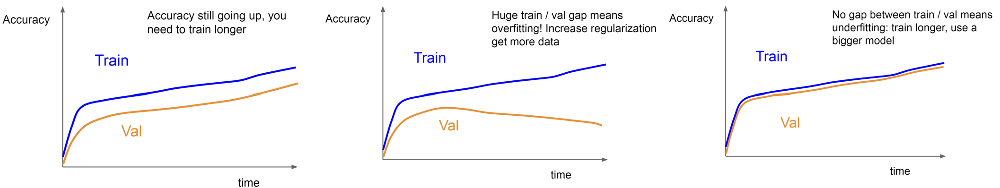

# 超参数调整

## 1、检查初始损失

关闭权重衰减，并检查损失是否计算正确。

> 例如：C 类的 softmax 初始化时的 log(C)

## 2、过拟合小样本

尝试在少量训练数据样本（5-10 个小批量）上训练到 100% 的训练准确率，尝试不同的架构、学习率、权重初始化。

- 损失不下降？学习率（LR）太低，初始化错误 
- Loss 爆炸到 Inf 或 NaN？LR过高，初始化不良

## 3、找到使损失下降的 LR

使用上一步的架构，使用所有训练数据，打开小权重衰减，找到一个学习率，使损失在 ~100 次迭代内显著下降

> 良好的学习率：1e-1、1e-2、1e-3、1e-4

## 4、使用粗网格训练 ~1-5 个周期

围绕步骤 3 中的工作选择几个学习率和权重衰减值，训练一些 ~1-5 个周期的模型。

> 良好的权重衰减：1e-4、1e-5、0

## 5、优化网格，训练更长时间

从步骤 4 中选择最佳模型，训练它们更长时间（~10-20 个周期），不要使用学习率衰减

## 6、查看损失和准确率曲线

之后，可以回到第5步