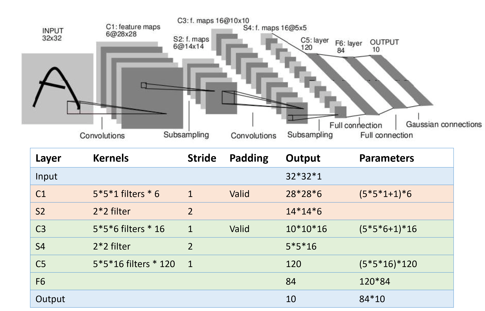
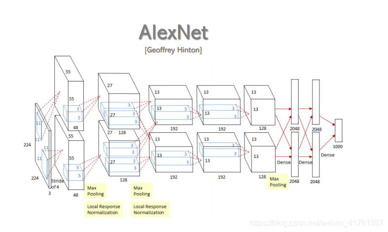
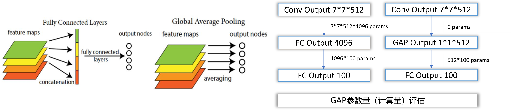

[TOC]

# 深度卷积网络：实例探究

上个笔记讲了比如卷积层、池化层以及全连接层这些组件。事实上，过去几年计算机视觉研究中的大量研究都集中在如何把这些基本构件组合起来，形成有效的卷积神经网络。实际上在计算机视觉任务中表现良好的神经网络框架往往也适用于其它任务，也许你的任务也不例外，完全可以借鉴别人的神经网络框架来解决自己的问题。这些建议包括：

-   研究别人的构建有效组件的案例。
-   通过Github下载一些神经网络开源的实现，不仅把代码下载下来，也把权重下载下来。
-   通过使用其他人预训练的权重，很可能得到很好的性能。
-   如果只有一个小的训练集，则只需要训练**softmax**层的权重，把前面这些层的权重都冻结。
-   如果有一个更大的训练集，应该冻结更少的层，然后训练后面的层。
-   如果有大量数据，应该做的就是用开源的网络和它的权重当作初始化，然后训练整个网络。
-   考虑使用数据增强。

## 经典网络

------

这节介绍**LeNet-5**、**AlexNet**和**VGGNet**这三个经典网络。

这是**LeNet-5**，这个神经网络中还有一种模式至今仍然经常用到，就是一个或多个卷积层后面跟着一个池化层，然后又是若干个卷积层再接一个池化层，然后是全连接层，最后是输出，这种排列方式很常用。

第二种神经网络是**AlexNet**，实际上，这种神经网络与**LeNet**有很多相似之处，不过**AlexNet**要大得多。正如前面讲到的**LeNet**或**LeNet-5**大约有6万个参数，而**AlexNet**包含约6000万个参数。当用于训练图像和数据集时，**AlexNet**能够处理非常相似的基本构造模块，这些模块往往包含着大量的隐藏单元或数据，这一点**AlexNet**表现出色。**AlexNet**比**LeNet**表现更为出色的另一个原因是它使用了**ReLu**激活函数。

需要注意的是，一些常见的AlexNet示意图常常分为两层，这是由于历史上AlexNet由于不能塞进单独一个GPU的显存，不得不放在两个GPU上进行训练。如下图：

最后一个范例是**VGG**，也叫作**VGG-16**网络。数字16指在这个网络中包含16个卷积层和全连接层。这确实是个很大的网络，总共包含约1.38亿个参数，但**VGG-16**的结构并不复杂，这点非常吸引人，而且这种网络结构很规整，都是几个卷积层后面跟着可以压缩图像大小的池化层，池化层缩小图像的高度和宽度。同时，卷积层的过滤器数量变化存在一定的规律，在每一组卷积层进行过滤器翻倍操作，正是设计此种网络结构的另一个简单原则。这种相对一致的网络结构对研究者很有吸引力，而它的主要缺点是需要训练的特征数量非常巨大。

VGG使用的技巧之一是使用更小的卷积核，为了与大卷积核一致，需要变得更深，但总体来看，参数变少了。

例如，3层3x3的卷积核可以替代1层7x7的卷积核

## 残差网络

------

非常非常深的神经网络是很难训练的，因为存在梯度消失和梯度爆炸问题。这节课我们学习跳跃连接（**Skip connection**），它可以从某一层网络层获取激活，然后迅速反馈给另外一层，甚至是神经网络的更深层。利用跳跃连接构建能够训练深度网络的**残差网络（ResNet）**，有时深度能够超过100层。

>   回忆一下$a^{[l]}$到$a^{[l+2]}$的计算过程：
>   $$
>   \begin{eqnarray}
>   		\left\{
>   		\begin{aligned}
>   			z^{\left\lbrack l + 1 \right\rbrack} = W^{\left\lbrack l + 1 \right\rbrack}a^{[l]} + b^{\left\lbrack l + 1 \right\rbrack} \\
>   			a^{\left\lbrack l + 1 \right\rbrack} =g(z^{\left\lbrack l + 1 \right\rbrack})\\
>   			z^{\left\lbrack l + 2 \right\rbrack} = W^{\left\lbrack l+2 \right\rbrack}a^{\left\lbrack l + 1 \right\rbrack} + b^{\left\lbrack l + 2 \right\rbrack}\\
>   			a^{\left\lbrack l + 2 \right\rbrack} = g(z^{\left\lbrack l + 2   \right\rbrack})
>   		\end{aligned}
>   		\right.
>   	\end{eqnarray}
>   $$

在残差网络中有一点变化，在$a^{[l]}$到$a^{[l+2]}$的计算过程更改如下：
$$
\begin{eqnarray}
		\left\{
		\begin{aligned}
			z^{\left\lbrack l + 1 \right\rbrack} = W^{\left\lbrack l + 1 \right\rbrack}a^{[l]} + b^{\left\lbrack l + 1 \right\rbrack} \\
			a^{\left\lbrack l + 1 \right\rbrack} =g(z^{\left\lbrack l + 1 \right\rbrack})\\
			z^{\left\lbrack l + 2 \right\rbrack} = W^{\left\lbrack l+2 \right\rbrack}a^{\left\lbrack l + 1 \right\rbrack} + b^{\left\lbrack l + 2 \right\rbrack}\\
			\ a^{\left\lbrack l + 2 \right\rbrack} = g\left(z^{\left\lbrack l + 2 \right\rbrack} + a^{[l]}\right)
		\end{aligned}
		\right.
	\end{eqnarray}
$$
把一个普通网络（**Plain network**）变成**ResNet**的方法是加上跳跃连接，如同下面这张图，每两层增加一个捷径，构成一个残差块，5个残差块连接在一起构成一个残差网络。

如果我们使用标准优化算法训练一个普通网络，比如说梯度下降法，没有加上残差，凭经验会发现随着网络深度的加深，训练错误会先减少，然后增多。（尽管理论上，随着网络深度的加深，应该训练得越来越好才对）

**ResNets**确实在训练深度网络方面非常有效，它确实有助于解决梯度消失和梯度爆炸问题，让我们在训练更深网络的同时，又能保证良好的性能。

>   一个图片识别的**ResNet**例子：
>
>   

## Inception 网络

------

Google提出的神经网络，一共有V1-V4共4个不同的模型

- 使用了Inception模块
  - 可以并行执行多个具有不同尺度的卷积运算或池化操作
  - 将多个卷积核卷积的结果拼接成一个非常深的特征图
- 使用了大量的trick提高网络性能
  - Bottleneck（瓶颈）: 1*1的卷积核，借鉴NIN
  - 使用全局平均池化GAP代替全连接
  - 在v2中，采用Batch Normalization（批归一化）
  - 在v3中，采用非对称卷积降低运算量
  - 在v4中，结合了ResNet中的思想，发现Residual Connections貌似只能加快网络收敛速度，是更大的网络规模提高了精度

### Inception模块

构建卷积层时，要决定过滤器的大小究竟是1×1，3×3还是5×5，或者要不要添加池化层。而**Inception**网络保留所有的过滤器和池化层输出，并把输出堆叠到一起。一个典型的**Inception**模块如下图。

一个**Inception模组**例子：

### 瓶颈层

**Inception**层有一个问题，就是计算成本，保留所有输出增加了通道数，可以使用1×1卷积构建**瓶颈层**减少通道数，从而大大降低计算成本。

如上图，输入是一张6×6×32的图片，1×1卷积所实现的功能是遍历这36（6×6）个单元格，计算左图中32个数字和过滤器中32个数字的元素积之和（然后应用**ReLU**非线性函数）。

一般来说，如果过滤器会是多个，输出结果是6×6×过滤器数量。

使用较少的过滤器数量，使用1×1卷积可以把输入通道减少，降低了计算成本。有时候这被称为瓶颈层。只要合理构建瓶颈层，既可以显著缩小表示层规模，又不会降低网络性能，从而节省了计算。

举个计算的例子，对于卷积层的参数计算：

不使用Bottleneck参数量：$256*3*3*256 = 589,824 $

使用Bottleneck参数量：$256*1*1*32+32*3*3*256=81,920$

### 全局平均池化

因为全连接层参数量巨大，特别是与最后一个卷积层相连接的全连接层。所以使用全局平均池化 Global Average Pooling 代替全连接。

复杂度比较：

> - top1acc：预测的label取最后概率向量里面最大的那一个作为预测结果，如果你的预测结果中概率最大的那个分类正确，则预测正确。否则预测错误。
> - top5acc：最后概率向量最大的前五名中，只要出现了正确概率即为预测正确。否则预测错误。

## DenseNet

更激进的密集连接机制每个层都会接受其前面所有层作为其额外的输入

- ResNet：元素级相加
- DenseNet：channel级连接

神经网络损失函数可视化曲面：从VGG到DenseNet越来越光滑，算法更容易找到更好的（局部）最优点

## ResNeXt

**引入了基数的概念**：基数指变换的数量，即将网络划分成多少个子网络。将输入划分成多个低维嵌入（分组卷积），然后对每个低维嵌入使用相同的拓扑结构进行变换，最后将变换后的结果聚合在一起。

增加基数比增加网络的深度或宽度更有效！可能解释：分组卷积中，每个分组学的内容各不相同，有利于增加网络多样性。

ResNeXt每个Block中拓扑结构完全相同，GoogLeNet每个Block中的拓扑结构不同，因此GoogLeNet每个Block中的卷积核大小、数量等需要人为设置，对于新问题来说调参困难。

## SE-Net

引入了注意力机制：显式的建模特征通道之间的相互依赖关系。通过学习的方式获取每个通道的权重（重要程度）。根据权重去提升有用的特征，并抑制对当前任务用处不大的特征，从而提升网络的表示能力

- Squeeze用于编码全局信息，它使用全局平均池化来压缩特征图，输出一个C维向量，来表示特征通道响应的全局分布
- Excitation用于为每个通道生成权重，从而建模特征通道之间的相关性
- 将输入的权重和原始特征图相乘，完成在通道维度对原始特征的重标定！

## SK-Net

受皮质神经元根据不同的刺激可动态调节其自身的感受野启发！引入了**动态选择**机制：使得每一个神经元可以根据多尺度的输入信息来动态的调整其感受野的大小。

 即使用不同大小的卷积核提取特征，再对多个分支的信息进行融合。

- Split操作构建多路子分支，每个分支对应的卷积核大小不同，对应不同尺度的感受野
- Fuse操作用于合并各路分支的信息，生成全局的互补信息表示
- Select操作根据特征表示预测出注意力权重，并使用这个权重来聚合不同尺度的特征图

## ResNeSt

借鉴了ResNeXt和SK-Net的思想将网络划分成多个相同的拓扑分支，同时将输入划分成多份，将每一份并行输入到网络中，再经过Split Attention操作融合特征 

Split-Attention操作首先将输入划分成多份。然后对输入进行全局平均池化操作，获得对每个通道编码后的全局上下文信息。再对每一份输入的全局上下文信息单独进行处理，获取每个通道的注意力权重。最后使用注意力权重和输入相乘，获得提升后的特征表示。

## 高效网络

ResNet 之后，由于CNN已经优于人类指标，重点转移到高效网络，这对许多移动设备友好。

MobileNets：面向移动应用的高效卷积神经网络

思想：将标准卷积分解为深度卷积和 1x1 卷积，效率更高，精度损失小。

## 自动化架构设计

MobileNet、ShuffleNet 神经架构搜索现在可以自动化架构设计

- Neural Architecture Search with Reinforcement Learning (NAS)：除了网络本身外，还存在一个“控制器”网络，学习设计良好网络架构，输出与网络设计相对应的字符串。
- Learning Transferable Architectures for Scalable Image Recognition：将神经架构搜索 （NAS） 应用于像 ImageNet 这样的大型数据集成本高昂，可以设计一个可以灵活堆叠的积木（“单元格”）的搜索空间，使用 NAS 在较小的 CIFAR-10 数据集上找到最佳单元结构，然后将架构传输到 ImageNet
- EfficientNet: Smart Compound Scaling：过扩展宽度、深度和分辨率来增加网络容量，同时平衡准确性和效率。在给定计算预算（目标内存和浮点数）的情况下，搜索一组最佳的复合缩放因子。使用智能启发式规则进行纵向扩展。

智能启发式搜索图例：

