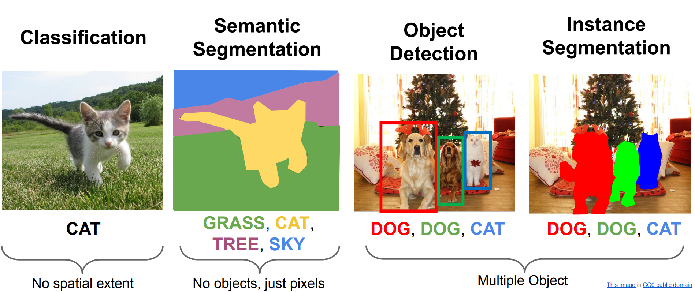
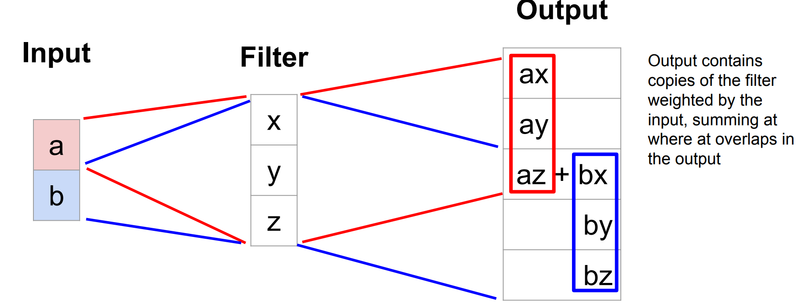

# 目标检测

## 任务介绍

------

在对象检测问题中，图片可以含有多个不同分类的对象，要识别这些对象并且用红框标记它们。

对于确定图片中物体的位置，我们可以让神经网络再多输出4个数字，标记为$b_{x}$,$b_{y}$,$b_{h}$和$b_{w}$，这四个数字是被检测对象的边界框的参数化表示。

图片左上角的坐标为$(0,0)$，右下角标记为$(1,1)$。要确定边界框的具体位置，需要指定红色方框的中心点，这个点表示为($b_{x}$,$b_{y}$)，边界框的高度为$b_{h}$，宽度为$b_{w}$。因此训练集不仅包含神经网络要预测的对象分类标签，还要包含表示边界框的这四个数字。

### 例子1：汽车自动驾驶系统

举个例子，如果正在构建汽车自动驾驶系统，那么对象可能包括以下几类：行人、汽车、摩托车和背景，这有四个分类，目标标签$y$的定义如下：
$$
y= \ \begin{bmatrix} p_{c} \\ b_{x} \\ b_{y} \\ b_{h} \\ b_{w} \\ c_{1} \\ c_{2}\\ c_{3} \\\end{bmatrix}
$$

-   $p_{c}$表示是否含有对象，如果对象属于前三类（行人、汽车、摩托车），则$p_{c}= 1$。如果是背景，则图片中没有要检测的对象，则$p_{c} =0$，$y$的其它参数无意义
-   $b_{x}$,$b_{y}$,$b_{h}$和$b_{w}$上面解释过
-   如果存在某个对象，$p_{c}=1$，输出$c_{1}$、$c_{2}$和$c_{3}$，表示该对象属于1-3类中的哪一类，是行人，汽车还是摩托车

这个例子的神经网络的损失函数，其参数为类别$y$和网络输出$\hat{y}$，如果采用平方误差策略，则：
$$
L\left(\hat{y},y \right) =
\left\{
\begin{array}{rcl}
\left( \hat{y_1} - y_{1} \right)^{2} + \left(\hat{y_2} - y_{2}\right)^{2} + \ldots\left( \hat{y_8} - y_{8}\right)^{2}     &      & y_{1} = p_c = 1\\
\left(\hat{y_1} - y_{1}\right)^{2}     &      & y_{1} = p_c = 0\\

\end{array} 
\right.
$$
当$y_{1} = 0$，也就是$p_{c} = 0$，损失值是$\left(\hat{y_1} - y_{1}\right)^{2}$，因为对于这种情况，我们不用考虑其它元素，只需要关注神经网络输出$p_{c}$的准确度。

实际应用中，可以不对$c_{1}$、$c_{2}$、$c_{3}$和**softmax**激活函数应用对数损失函数，并输出其中一个元素值，通常做法是对边界框坐标应用平方差或类似方法，对$p_{c}$应用逻辑回归函数，甚至采用平方预测误差也是可以的。

### 例子2：人脸识别应用

假设正在构建一个人脸识别应用，并且希望算法可以给出眼角的具体位置。眼角坐标为$(x,y)$，可以让神经网络的最后一层多输出两个数字$l_{x}$和$l_{y}$，作为眼角的坐标值。如果需要多个特征点，则对神经网络稍做些修改，输出第一个特征点（$l_{1x}$，$l_{1y}$），第二个特征点（$l_{2x}$，$l_{2y}$），依此类推。

要明确一点，特征点1的特性在所有图片中必须保持一致。就好比特征点1始终是右眼的外眼角，特征点2是右眼的内眼角，特征点3是左眼内眼角，特征点4是左眼外眼角等等。所以标签在所有图片中必须保持一致。

## 通过滑动窗口检测目标

------

对于一张测试图片，首先选定一个特定大小的窗口，将这个红色小方块输入卷积神经网络，不断移动这个窗口并裁减，再判断红色方框内有没有汽车。

之后选择一个不同大小的窗口，重复上述操作，我们希望不论汽车在图片的什么位置，总有一个窗口可以检测到它。

这种算法叫作滑动窗口目标检测，因为我们以某个步幅滑动这些方框窗口遍历整张图片，对这些方形区域进行分类，判断里面有没有汽车。滑动窗口目标检测算法也有很明显的缺点，就是计算成本，因为在图片中剪切出太多小方块，卷积网络要一个个地处理。

## YOLO算法

------

比如输入图像是100×100的，在图像上放一个3×3网格。对于每一个小块都指定一个标签$y$。

**YOLO**算法做的就是，取对象的中点，然后将这个对象分配给包含对象中点的格子。

所以对于这里9个格子中任何一个都会得到一个k维输出向量，目标输出尺寸是3×3×k。

注意，这是一个卷积实现，并没有在3×3网格上跑9次算法，一次得到所有信息。

## 交并比

------

在对象检测任务中，希所以如果实际边界框是红色的，算法给出这个紫色的边界框，那么这个结果是好还是坏？交并比（**loU**）函数做的是计算两个边界框交集和并集之比。两个边界框的并集是绿色阴影表示区域，而交集是橙色阴影表示区域。

一般约定，在计算机检测任务中，如果$loU≥0.5$，就说检测正确，结果是可以接受的。如果预测器和实际边界框完美重叠，**loU**就是1。

## 非极大值抑制

-----

假设需要在这张图片里检测行人和汽车，在上面放个19×19网格，理论上这辆车只有一个中点，所以它应该只被分配到一个格子里，只有一个格子做出有车的预测。

但是汽车所在的位置跨越了多个格子，多个格子都会做出这个格子有汽车的预测，这样算法可能对同一个对象做出多次检测。

非极大值抑制（Non-max suppression）可以确保算法对每个对象只检测一次，流程如下：

1.   抛弃所有概率比较低的输出边界框，比如$p_{c}≤0.6$的边界框去掉。
2.   接下来剩下的边界框，选择一个概率$p_{c}$最高的边界框并保留。
3.   剩下的边界框，如果和上一步输出边界框有很高交并比（**IoU**）的边界框全部抛弃。
4.   如果还有剩下的边界框，回到步骤2.

## Anchor Boxes

------

到目前为止，对象检测中存在的一个问题是每个格子只能检测出一个对象，使用**anchor box**这个概念可以让一个格子检测出多个对象。

对于这个例子，我们继续使用3×3网格，注意行人的中点和汽车的中点都落入到同一个格子中。对于那个格子， $y$ 向量中$p_{c}$只能挑选一个表示。

**anchor box**的思路是预先定义多个不同形状的**anchor box**，把预测结果和这些个**anchor box**关联起来。一般来说，你可能会用5个甚至更多的**anchor box**，而这里用两个**anchor box**（上图中有两个紫色框表示的box）。

重新定义$y$ 向量：
$$
y=  \begin{bmatrix} p_{c} & b_{x} & b_{y} &b_{h} & b_{w} & c_{1} & c_{2} & c_{3} & p_{c} & b_{x} & b_{y} & b_{h} & b_{w} &c_{1} & c_{2} & c_{3} \\\end{bmatrix}^{T}
$$
前面的8个参数和**anchor box 1**关联，后面的8个参数和**anchor box 2**相关联。行人的形状更类似于**anchor box 1**的形状，车子的边界框更像**anchor box 2**的形状，把这两个部分分开表示，实现每个格子检测出多个对象。

最后，该怎么选择**anchor box**呢？人们一般手工指定**anchor box**形状，可以选择5到10个**anchor box**形状，覆盖到多种不同的形状，可以涵盖你想要检测的对象的各种形状。还有一个更高级的版本，后期**YOLO**论文中有更好的做法，就是所谓的**k-平均算法**，可以将两类对象形状聚类，如果我们用它来选择一组**anchor box**，选择最具有代表性的一组**anchor box**，可以代表试图检测的十几个对象类别，但这其实是自动选择**anchor box**的高级方法。

## 基于R-CNN的模型

朴素的想法是，可以使用非深度学习的算法（proposal method），在CPU上先预测好可能出现物体的框，再使用目标检测模型。

缺点是非常慢，非深度学习的算法可能会给出2000个框，需要在2000个框上都运行一遍目标检测模型。于是我们不在原图片上标框，而是在特征上标框，如下图：

我们可以将非深度学习的标框算法替换为基于深度学习的模型，这是一个两阶段模型。

当然，两阶段也不是必须的，例如我们之前提到的YOLO

# 语义分割

即下图中左数第二个任务

朴素的想法是设计一个只有卷积层而没有下采样操作的网络，得到一个与原图像相同高宽的特征，深度是分类数，再在每一个像素位置上使用 argmax，但这十分昂贵。

可以先下采样再上采样，参数高效。但是如何上采样？

## 上采样

下面举了几种上采样方式：

一个比较好的方法是transposed convolution，使用了卷积核，我们先看一个一维的例子：

然后是二维例子：

