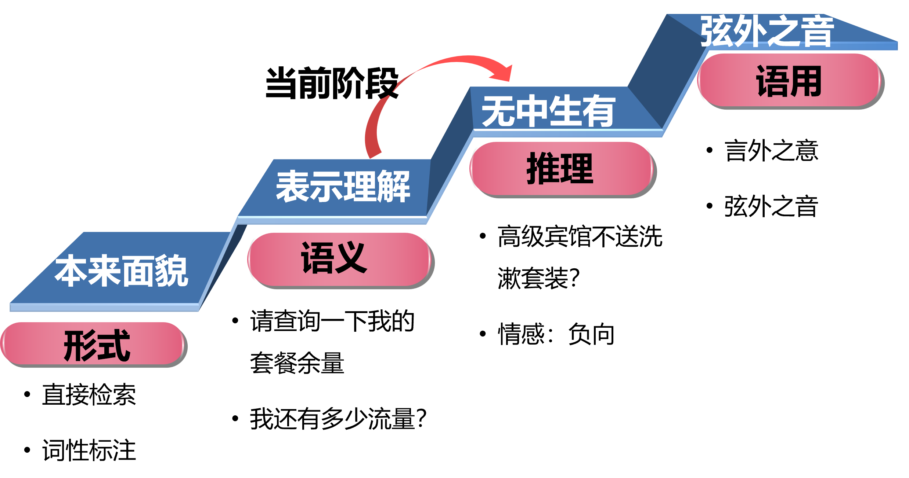

# 自然语言处理

自然语言处理研究实现人与计算机之间用自然语言进行有效通信的各种理论和方法。自然语言处理技术发展经历了**基于规则的方法**、**基于统计学习的方法**和**基于深度学习的方法**三个阶段。自然语言处理由浅入深的四个层面分别是**形式、语义、推理**和**语用**，当前正处于由语义向推理的发展阶段。

## 词汇表征与词嵌入

------

词嵌入（**word embeddings**）是语言表示的一种方式，可以让算法自动的理解一些类似的词，比如男人对女人，比如国王对王后。词嵌入可以帮助构建**NLP**应用，特别是对于一些相对较小的模型标记训练集。

>   举个例子，假如你的学习算法已经学到了“**I want a glass of orange juice**”这样一个很可能的句子，如果看到“**I want a glass of apple __**”，如果算法知道**apple**和**orange**的关系很接近，那么就能更容易预测到下一个单词为**“juice”**

换一种表示方式会更好，如果我们不用**one-hot**表示，而是用特征化的表示来表示词典里的任何一个单词，我们学习这些词的特征或者数值。

举个例子，对于这些词，比如我们想知道这些词与**Gender**（**性别**）的关系。假定男性的性别为-1，女性的性别为+1，那么**man**的性别值可能就是-1，而**woman**就是-1。最终根据经验**king**就是-0.95，**queen**是+0.97，**apple**和**orange**没有性别可言。

有很多的其他特征，从**Size**（**尺寸大小**），**Cost**（**花费多少**），这个东西是不是**alive**（**活的**），是不是一个**Action**（**动作**），或者是不是**Noun**（**名词**）或者是不是**Verb**（**动词**），还是其他的等等。我们假设有300个不同的特征，这样就组成了一个300维的向量来表示**man**这个词，或者说这个词是300维空间的一个点。

然而我们很难想象300维空间，常用的可视化算法是**t-SNE算法**，把300维的数据嵌入到一个二维空间里，类似的词相距较近。

词嵌入能够达到理解词的关系，其中一个原因是学习词嵌入的算法会考察非常大的文本集，可以是1亿个单词，甚至达到100亿也都是合理的，大量的无标签的文本的训练集。通过考察大量的无标签文本，你可以发现**orange**（**橙子**）和**durian**（**榴莲**）相近，**farmer**（**农民**）和**cultivator**（**培育家**）相近。因此学习这种嵌入表达，把它们都聚集在一块。

> 在深度学习的词嵌入中，对齐通常指的是将来自不同语言或不同领域的词嵌入空间映射到一个共享的、统一的空间中，以便实现跨语言或跨领域的语义对齐，从而使得相似意义的词在这个统一的空间中具有相近的表示。
>
> 一个例子是多语言词嵌入对齐。通过将不同语言的词嵌入空间对齐到一个共享的空间，可以实现跨语言之间的词语之间的语义相似性。比如，将英语中的 "cat" 和法语中的 "chat" 在对齐后的空间中具有接近的表示，这样就实现了跨语言的词语对齐，使得模型可以更好地处理多语言任务。

## 特性与应用

------

接下来你可以把这个词嵌入应用到你的命名实体识别任务当中，尽管你只有一个很小的训练集，你可以使用迁移学习，把你从互联网上免费获得的大量的无标签文本中学习到的知识，能够分辨**orange**（**橙子**）、**apple**（**苹果**）和**durian**（**榴莲**）都是水果的知识，然后把这些知识迁移到一个任务中。

词嵌入还有一个迷人的特性就是它还能帮助实现类比推理。假如我提出一个问题，**man**如果对应**woman**，那么**king**应该对应什么？应该都能猜到**king**应该对应**queen**。我们寻求一种算法来自动推导出这种关系。

我们用一个四维向量$e_{\text{man}}$来表示**man**，对**woman**，**king**和**queen**也是用一样的表示方法。这些向量有一个有趣的特性，就是假如你有向量$e_{\text{man}}$和$e_{\text{woman}}$，将它们进行减法运算，即:

$$
e_{\text{man}} - e_{\text{woman}} = \begin{bmatrix}
 - 1 \\
     0.01 \\
       0.03 \\
       0.09 \\
       \end{bmatrix} - \begin{bmatrix}
       1 \\
       0.02 \\
       0.02 \\
       0.01 \\
       \end{bmatrix} = \begin{bmatrix}
 - 2 \\
 - 0.01 \\
     0.01 \\
       0.08 \\
       \end{bmatrix} \approx \begin{bmatrix}
 - 2 \\
     0 \\
       0 \\
       0 \\
       \end{bmatrix}
$$

类似的，假如你用$e_{\text{king}}$减去$e_{\text{queen}}$，最后也会得到一样的结果，即：

$$
e_{\text{king}} - e_{\text{queen}} = \begin{bmatrix}
 - 0.95 \\
     0.93 \\
       0.70 \\
       0.02 \\
       \end{bmatrix} - \begin{bmatrix}
       0.97 \\
       0.95 \\
       0.69 \\
       0.01 \\
       \end{bmatrix} = \begin{bmatrix}
 - 1.92 \\
 - 0.02 \\
     0.01 \\
       0.01 \\
       \end{bmatrix} \approx \begin{bmatrix}
 - 2 \\
     0 \\
       0 \\
       0 \\
       \end{bmatrix}
$$

所以得出这种类比推理的结论的方法就是，当算法被问及**man**对**woman**相当于**king**对什么时，算法所做的就是找出一个向量，使得：
$$
e_{\text{man}}-e_{\text{woman}}\approx\ e_{\text{king}}- e_{?}
$$
具体说，找到一个单词**w**来最大化$e_{w}$与$e_{\text{king}} -  e_{\text{man}} + e_{\text{woman}}$的相似度，即：
$$
Find\ word\ w:argmax \ Sim(e_{w},e_{\text{king}} - e_{\text{man}} + e_{\text{woman}})
$$
最常用的相似度函数叫做余弦相似度，其实是$u$和$v$的夹角的余弦值，公式为：
$$
\text{sim}\left( u,v \right) = \frac{u^{T}v}{\left| \left| u \right| \right|_{2}\left| \left| v \right| \right|_{2}}
$$

## 学习词嵌入

------

当应用算法来学习词嵌入时，实际上是学习一个嵌入矩阵。假设我们的词汇表含有10,000个单词，300个特征，我们要做的就是学习一个嵌入矩阵$E$，它将是一个300×10,000的矩阵。

我们用符号$O_{6527}$表示**one-hot**向量，这个向量除了第6527个位置上是1，其余各处都为0，是一个10,000维的列向量；用符号$e_{6527}$表示特征的嵌入向量，在这个例子中是一个300维的列向量。我们有：
$$
E \cdot O_{6527}= e_{6527}
$$
并且这个式子可以推广到一般。

现在，我们的目标是随机地初始化矩阵$E$，然后使用梯度下降法来学习这个300×10,000的矩阵中的各个参数。

实践证明，建立一个语言模型是学习词嵌入的好方法。假如你在构建一个语言模型，神经网络能够做到输入：“**I want a glass of orange __.**”，然后预测这句话的下一个词。

如图，我们将$E$与**one-hot**向量$O$相乘得到嵌入向量$e$，把它们全部放进神经网络中，经过神经网络以后再通过**softmax**层，然后**softmax**分类器会在10,000个可能的输出中预测结尾这个单词。

实际上更常见的是有一个固定的历史窗口，比如只看前4个单词，用一个固定的历史窗口就意味着你可以处理任意长度的句子，因为输入的维度总是固定的。或者把目标词左右各4个词作为上下文，来预测中间的目标词。这用的是一种**Skip-Gram**模型的思想。

### CBOW模型

CBOW模型的输入是某一个特征词的上下文相关的词对应的词向量，而输出是这个特定词的词向量。CBOW之所以叫连续词袋模型，是因为在每个窗口内它也不考虑词序信息，因为它是直接把上下文的词向量相加了，自然就损失了词序信息。**CBOW抛弃了词序信息，指的就是在每个窗口内部上下文直接相加而没有考虑词序。**

计算过程如下：

1. 输入特征词上下文相关词的one-hot编码，维度为1\*V，其中V是词空间的大小。
2. 这些词的词向量和共享矩阵W相乘。W的维度为V\*N，其中N是自己定义的维度，也是最终word embedding的维度。每个上下文词都会计算得到一个1\*N向量。
3. 将这些向量相加取平均，得到维度为1\*N的隐藏层向量。
4. 将该向量与$W'_{N×V}$相乘，得到输出层的维度为1\*V。
5. 将输出层的向量经过softmax归一化处理得到新的1*V向量，取概率最大的值对应的位置为预测结果。
6. 将预测的中心词和真实结果计算误差，一般使用交叉熵函数计算误差。
7. 根据误差进行反向传播。不断更新W和$W'_{N×V}$的值。
8. 最终得到W矩阵，任何一个单词的one-hot编码乘这个矩阵都将得到自己的词向量。

### Skip-Gram模型

-----

CBOW通过上下文来预测当前词（下图左边），Skip-gram通过当前词预测上下文（下图右边）：

- 输入特定词的one-hot编码，维度为1\*V，其中V是词空间的大小。
- 特定词的词向量和共享矩阵W相乘。W的维度为V\*N，其中N是自己定义的维度，也是最终word embedding的维度。得到一个1\*N的隐藏层向量。
- 隐藏层向量和维度为N\*V的矩阵相乘，得到1\*V的输出向量。
- 将该输出向量经过softmax，选取概率最大的位置为预测结果。
- Skip-gram通过反向传播算法和梯度下降来学习权重，训练数据的输入一般是一个词$W_I$，上下文窗口为C，它的输出是$W_I$的上下文$W_O$，损失函数是输出词的条件概率：$E=-\log p(W_{O,1},W_{O,2},W_{O,3}...W_{O,C}|W_I)$
- 训练完成后，得到权重矩阵W。

CBOW/skip-gram模型的输出层使用的softmax函数，时间复杂度为O(|*D*|)，计算代价很大，对大规模的训练语料来说，训练非常耗时。每次计算概率需要对你词汇表中的所有（例如10,000个）词做求和计算，一些解决方案包括分级（**hierarchical**）的**softmax**分类器和**负采样**（**Negative Sampling**）。

### 分级的softmax分类器

------

类似于二分查找的思想，顶层分类器告诉你目标词是在词汇表的前5000个中还是在词汇表的后5000个词中，然后下一层的分类器会告诉你这个词在词汇表的前2500个词中，或者在词汇表的第二组2500个词中，诸如此类。实际上用这样的分类树，计算成本与词汇表大小的对数成正比。

在实践中分级**softmax**分类器不会使用一棵完美平衡的分类树或者对称树。实际上，常用词大多在顶部，不常用的词会在树的更深处，类似哈夫曼编码的思想。

补充一点，当对上下文$c$进行采样时，那么目标词$t$就会在上下文$c$的正负10个词距内进行采样。但是要如何选择上下文$c$？一种选择是对语料库均匀且随机地采样，如果那么做，一些词像**the**、**of**、**a**、**and**、**to**诸如此类是出现得相当频繁的，但它们没什么意义，你想要的是花时间来更新像**durian**这些更少出现的词的嵌入。实际上词$p(c)$的分布并不是单纯的在训练集语料库上均匀且随机的采样得到的，而是采用了不同的分级来平衡更常见的词和不那么常见的词。

###  负采样

------

**负采样**与的**Skip-Gram**模型相似的事情，但是用了一个更加有效的学习算法。在这个算法中要做的是构造一个新的监督学习问题：给定一对单词，比如**orange**和**juice**，我们要去预测这是否是一对上下文词-目标词（**context-target**）。

在这个例子中**orange**和**juice**就是个正样本，我们把它标为1；**orange**和**king**无关，就是个负样本，我们把它标为0。我们要做的是对于一个上下文$c$，找到一个正样本，再进行$K$次从词典中任意选取的词，并标记0，这些就会成为$K$个负样本。优化目标改为：最大化正样本的概率，同时最小化负样本的概率。如下图。

重述一下，我们使用记号$c$表示上下文词，记号$t$表示可能的目标词，$y$有两个值0和1，表示是否是一对上下文-目标词。我们要做的就是定义一个逻辑回归模型，给定输入的$c$，$t$对的条件下，$y=1$的概率，即：
$$
P\left( y = 1 \middle| c,t \right) = \sigma(\theta_{t}^{T}e_{c})
$$
我们有一个正样本和$K$个负样本，正负样本比例为$\frac{1}{K}$，即每一个正样本你都有$K$个对应的负样本来训练一个类似逻辑回归的模型。小数据集的话，$K$从5到20比较好；对于更大的数据集$K$从2到5比较好。

一个重要的细节就是如何选取负样本，对于给定上下文，词*w*就是一个正样本，其他词就是负样本。但是负例样本太多了，解决方法是：在语料库中，各个词出现的频率是不一样的，我们采样的时候要求高频词选中的概率较大，而低频词选中的概率较小。这就是一个带权采样的问题。，采用以下方式进行采样：
$$
P\left( w_{i} \right) = \frac{f\left( w_{i} \right)^{\frac{3}{4}}}{\sum_{j = 1}^{10,000}{f\left( w_{j} \right)^{\frac{3}{4}}}}
$$
其中$P\left( w_{i} \right)$是选取某个词的概率。$f(w_{i})$是语料库中的某个英文词的词频。

###  GloVe 词向量

------

**GloVe**代表用词表示的全局变量（**global vectors for word representation**）也是一个计算词嵌入的算法。

假定$X_{{ij}}$是单词$i$在单词$j$上下文中出现的次数，那么这里$i$和$j$就和$t$和$c$的功能一样，所以你可以认为$X_{{ij}}$等同于$X_{{tc}}$。之后遍历训练集，数出单词$i$在不同单词$j$上下文中出现的个数。所以$X_{{ij}}$就是一个能够获取单词$i$和单词$j$出现位置相近时或是彼此接近的频率的计数器。

想要知道的是两个单词之间有多少联系，$t$和$c$（$i$和$j$）之间有多紧密，也就是它们同时出现的频率是多少，这由$X_{{ij}}$影响。

**GloVe**模型做的就是进行优化，我们将单词之间的差距进行最小化处理：
$$
\text{mini}\text{mize}\sum_{i = 1}^{10,000}{\sum_{j = 1}^{10,000}{f\left( X_{{ij}} \right)\left( \theta_{i}^{T}e_{j} + b_{i} + b_{j}^{'} - logX_{{ij}} \right)^{2}}}
$$
然后，我们要做的是解决参数$\theta$和$e$的问题，用梯度下降来最小化上面的公式，这样输出能够对这两个单词同时出现的频率进行良好的预测。

其中，$f\left(X_{{ij}}\right)$是额外的加权项，作用一是当$X_{{ij}}$是等于0时，$log0$是未定义的，我们会用一个约定即$0log0= 0$。如果$X_{{ij}} =0$，先不要进行求和，所以$log0$就是不相关项。$f\left(X_{{ij}}\right)$的另一个作用是不给不常用词（**durion**）太小的权值，也不给频繁的词（**this**，**is**，**of**，**a**）过分的权重。

## 情感分类

------

有了词嵌入的帮助，即使只有中等大小的标记的训练集，也能构建一个不错的情感分类器。

上图是一个情感分类问题的一个例子，输入$x$是一段文本，而输出$y$是要预测的情感，在这个例子中是一个餐馆评价的星级。情感分类器要训练一个从$x$到$y$的映射。

对于一个简单的情感分类的模型，假设有一个句子"**dessert is excellent**"，我们取这些词，对于每一个单词，找到相应的**one-hot**向量$o$，乘以嵌入矩阵$E$，得到$e$。其中$E$是**别人**在**很大**的训练集上**提前**训练好的，对所有的$e$求和或者平均，再把这个特征向量送进**softmax**分类器，然后输出$\hat y$，包含5个可能结果的概率值，从一星到五星。

上面这个算法有一个问题就是没考虑词序，我们搭建一个更加复杂的模型，用一个**RNN**来做情感分类。我们取这些词，对于每一个单词，找到相应的**one-hot**向量$o$，乘以嵌入矩阵$E$，得到$e$，然后把它们送进**RNN**里，**RNN**的工作就是在最后一步计算一个特征表示，用来预测$\hat y$。

## 词嵌入除偏

------

机器在学习时以人为学习目标，在自然语言处理中以人类创造的文本作为样本，当人类社会存在**偏见**时，机器，特别是词嵌入，也会有可能学习到这种偏见，包括性别，种族等偏见。

举个例子，一个已经完成学习的词嵌入可能会输出**Man**：**Computer Programmer**，和**Woman**：**Homemaker**，这个结果包含性别歧视。如果算法输出的是**Man**：**Computer Programmer**，同时**Woman**：**Computer Programmer**这样子会更合理。

我们尝试减少词嵌入中的偏见问题。这节具体处理性别歧视。

1.   我们首先确认性别趋势。找到一些带有性别色彩的词，比如$e_{\text{he}}-e_{\text{she}}$和$e_{\text{male}}-e_{\text{female}}$，然后将这些值取平均，这个趋势是性别趋势，或说是我们关注的偏见趋势。在这种情况下，偏见趋势可以将它看做**1D**子空间，所以无偏见趋势是剩下的**299D**子空间。

2.   中和步骤。对于那些定义不确切的词可以将其处理一下，避免偏见。对于像**doctor**和**babysitter**这种单词我们就可以将它们在偏见趋势轴上进行处理，来减少或是消除他们的性别歧视趋势的成分，也就是减少他们在距离偏见趋势轴水平方向上的距离。

3.   均衡步。对于像**grandmother**和**grandfather**，或者是**girl**和**boy**这些词嵌入，只希望性别是其区别。主要做的就是将**grandmother**和**grandfather**这样的词对移至与偏见趋势轴线等距的一对点上。

## 句子嵌入表示模型

### Bag-of-words

仅仅求和，得到的句子向量是定长的，句子向量的长度等于词向量的长度。但是丢失了词汇之间的顺序信息。

### Pooling

句子向量长度是词向量的3倍，除了最大、最小和平均，当然也可以追加其他操作继续进行扩展。这里+的符号意思是拼接

### CNN

卷积神经网络的思想，分别卷积了大小为2和3的窗口，使用最大池化，是一个有监督学习模型，可以学习到词序信息

### Variations

层级CNN，在输入端引入了字符向量。在文本分析的很多任务中，都证明引入字符向量可以提高分析性能

## 文档嵌入表示模型

