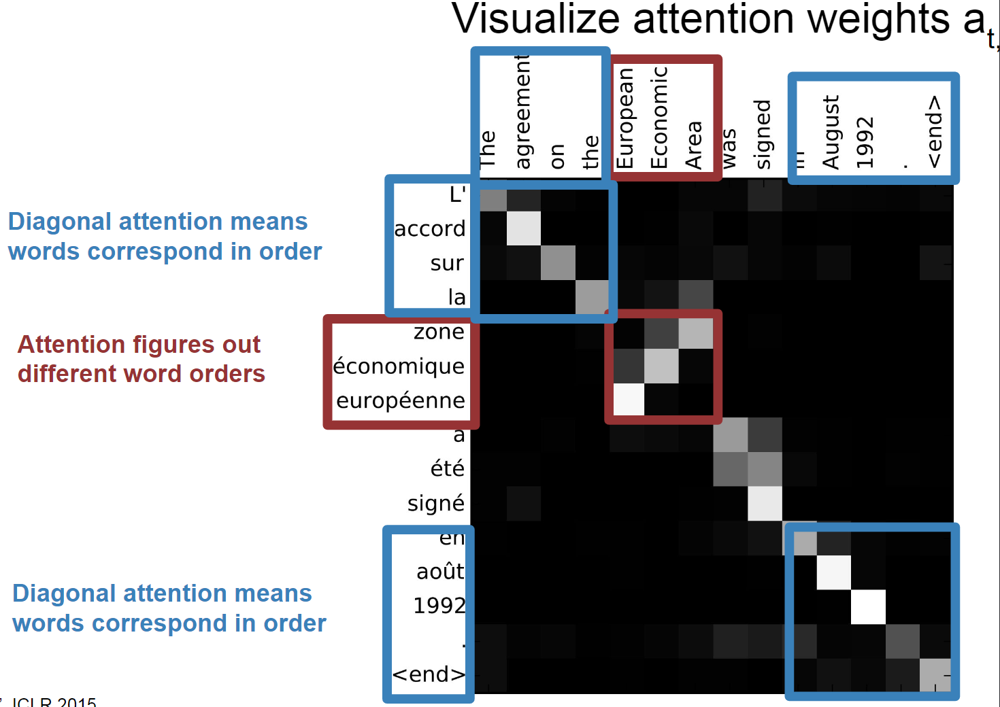
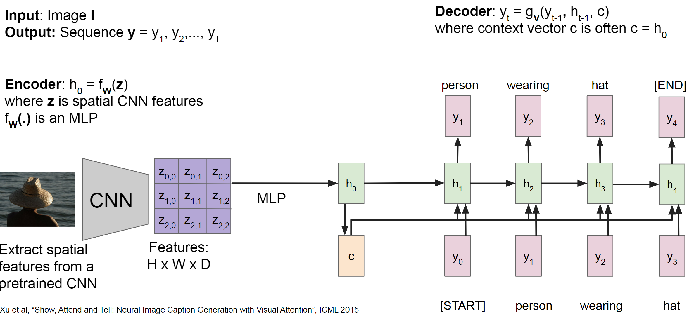
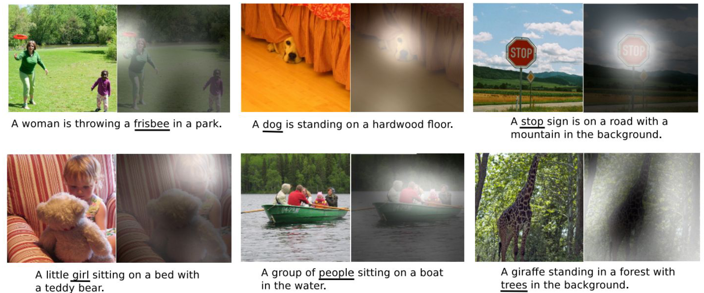

[TOC]

# 机器翻译

## 基础模型

------

我们尝试搭建一个**翻译**应用，将法语句子翻译成英语句子。和之前一样，我们用$x^{<1>}$ 一直到$x^{< 5>}$来表示输入的句子的单词，然后我们用$y^{<1>}$到$y^{<6>}$来表示输出的句子的单词，那么，如何训练出一个新的网络来输入序列$x$和输出序列$y$呢

我们之前其实提到过。我们先建立一个网络，这个网络叫做编码网络（**encoder network**），它是一个**RNN**的结构，每次只向该网络中输入一个法语单词，将输入序列接收完毕后，这个**RNN**网络会输出一个向量来代表这个输入序列。之后你可以建立一个解码网络，它以编码网络的输出作为输入，被训练为每次输出一个翻译后的单词，一直到它输出序列的结尾或者句子结尾标记，这个解码网络的工作就结束了。这是基本的**seq2seq**模型。

使用类似的结构，我们可以完成**图像描述**任务，即给出一张图片，自动地输出该图片的描述。方法如下，我们将图片输入到卷积神经网络中，让其学习图片的编码，这个预训练的结构会给出一个4096维的特征向量，表示的就是这只猫的图片。接着可以把这个向量输入到**RNN**中，RNN要做的就是生成图像的描述，每次生成一个单词，一直到它输出序列的结尾或者句子结尾标记。这是基本的**image to sequence**模型。

## 集束搜索

------

现在我们来改进用来翻译的**seq2seq**模型。这个模型的作用可以理解为，对于输入的法语句子，模型输出各种英文翻译所对应的可能性。显然我们不想让它随机地进行输出英文句子并判断可能性，我们也不能穷举所有的句子，我们应该有条理地**搜索**， 或者说使用**集束搜索（Beam Search）**，步骤如下：

1.   首先让法语句子经过编码网络生成向量，集束搜索算法与这部分无关。
2.   现在来评估第一个单词的概率值，我们在英文字典中找到最可能的三个选项并记录它们。如果英文字典包含10,000个词，这一步我们计算了10,000个概率$P(y^{<1>}|x)$并找出三个最大值。
3.   现在来评估第二个单词的概率值，对于上一步的三个选项，分别对英文字典的所有词计算概率，这一步我们有$3 \times 10000 = 30000$个概率$P(y^{<1>},y^{<2>}|x)$，找出三个最大值并记录它们。
4.   如上继续计算，直到输出序列的结尾或者句子结尾标记。

其中，我们总是“找三个最可能的选项”。这里“三”是一个参数，叫做集束宽（**beam width**），用**B**表示。当**B**为1时，就是传统的**贪心算法**，当我们取一个大一点的**B**时，贪心的本质不变，但会以更大的时间空间代价尝试找到更好的结果。（贪心算法找不到最好的结果）

### 归一化优化

以上就是集束搜索的基本方式，现在我们尝试优化这个搜索算法。

集束搜索的本质是尝试最大化一个概率$\prod_{i=1}^{T_y}P(y^{<t>} | x,y^{<1>} \cdots y^{<t-1>} )$，也可以表示为：
$$
P(y^{<1>}|X) \times P(y^{< 2 >}|X,y^{< 1 >}) \times P(y^{< 3 >}|X,y^{< 1 >},y^{< 2>}) \cdots P(y^{< T_{y} >}|X,y^{<1 >},y^{<2 >}\ldots y^{< T_{y} - 1 >})
$$
因为概率值都是小于1的，很多小于1的数乘起来，会造成数值下溢。因此在实践中,我们不会最大化这个乘积，而是取$log$值，我们总是记录概率的对数和：
$$
\sum_{t=1}^{T_y} log P(y^{<t>} | x,y^{<1>} \cdots y^{<t-1>})
$$
因为要考虑长度不同的句子，我们可以把它归一化，减少对输出长的结果的惩罚：
$$
\frac{1}{{T_y}^\alpha}\sum_{t=1}^{T_y} log P(y^{<t>} | x,y^{<1>} \cdots y^{<t-1>})
$$
我们有时会在$T_{y}$上加上指数$\alpha$，它是另外一个超参数，可以等于0.7。如果$\alpha$等于1，就相当于完全用长度来归一化，如果$\alpha$等于0，就相当于完全没有归一化，我们在完全归一化和没有归一化之间调整大小来得到最好的结果。

### 误差分析

我们之前分析过集束搜索的贪心核心只是**尽量**找到更好的结果，没有保证找到最好的结果。同时**RNN**网络模型出了问题也会造成结果变差，我们尝试区分这两种误差，以便更有针对性地解决问题。

我们用这个例子说明，法语输入为： “**Jane visite l'Afrique en septembre**”。人工翻译输出$y^*$为 **Jane visits Africa in September**。翻译模型输出为$\hat y$：**Jane visited Africa last September**。

注意到翻译模型的输出实际上改变了句子的原意，因此这不是个好翻译。所以理论上$P(\hat y|x)$ 小于  $P(y^*|x)$

第一种情况，**RNN**模型的输出结果$P(\hat y|x)$ 小于  $P(y^*|x)$，并且集束搜索算法选择了$\hat y$ ，这种情况下是集束搜索算法不够好。

第二种情况，**RNN**模型的输出结果$P(\hat y|x)$ 大于等于  $P(y^*|x)$，在这种情况下，是**RNN**模型出了问题，需要在**RNN**模型上花更多时间。

### Bleu 得分

在翻译中，当有多个同样好的答案时，怎样评估一个机器翻译系统呢？**BLEU （bilingual evaluation understudy） (双语评估替补)得分做的就是，给定一个机器生成的翻译，它能够自动地计算一个分数来衡量机器翻译的好坏。**

我们用一个例子解释：

法语句子：**Le chat est sur le tapis**

人工翻译1：**The cat is on the mat**

人工翻译2：**There is a cat on the mat**

当机器翻译 (**MT**)的输出是：**the the the the the the the**。衡量机器翻译输出质量的方法之一是观察输出结果的每一个词看其是否出现在参考中，这被称做是机器翻译的精确度。在参考1中，单词**the**出现了两次，在参考2中，单词**the**只出现了一次，所以单词**the**的得分上限为2。这个输出句子的得分为2/7。

上面我们只是关注单独的单词或者说一元词组（**unigrams**），在**BLEU**得分中，也要考虑成对的单词。二元词组（**bigrams**）表示相邻的两个单词，三元词组（**trigrams**）表示是三个挨在一起的词。

我们假定机器翻译输出了稍微好一点的翻译:**The cat the cat on the mat**，可能的二元词组有：

-   **the cat**出现了两次 
-   **cat the**出现了一次
-   **cat on**出现了一次
-   **on the**出现了一次
-   **the mat**出现了一次

之后我们定义截取计数**Count_clip**（**the clipped count**）。上限值为二元词组出现在参考1或2中的最大次数。

-   **the cat**在每个参考中最多出现一次，所以我将截取它的计数为1

-   **cat the**并没有出现在参考1和参考2中，所以我将它截取为0

-   **cat on** 记1分

-   **on the**记1分

-   **the mat**记1分

最后，修改后的二元词组的精确度就是**count_clip**之和。因此是4/6为二元词组改良后的精确度。

现在我们将它公式化，$n$元词组精确度$P_n$为：
$$
P_n=\frac{\sum_{ngram \in \hat{y}}Countclip(ngram)}{\sum_{ngram \in \hat{y}}Count(ngram)}
$$
如果你计算了$P_1$，$P_2$， $P_3$，$P_4$，按照惯例**BLEU**得分被定义为：
$$
exp (\frac{1}{4}\sum\limits_{n=1}^{4}{{{P}_{n}}})
$$

# 注意力模型

### 句子翻译

我要对机器翻译做一些改进，称为注意力模型（**the Attention Model**）。人工翻译并不会记住整个法语句子再开始翻译，而是看一部分，翻译一部分，一点一点地翻译，因为记忆整个的长句子是非常困难的。**注意力模型如何让一个神经网络只注意到一部分的输入句子。当它在生成句子的时候，更像人类翻译**。以下为计算流程：

1.   我们使用一个**RNN**计算输入的法语，这一步没有输出，我们计算好每一个时间步$t$的状态 $h_t$

2.   我们定义 $e_{ij}$为翻译到第i个英文词时，与第j个法语词的关联有多大，这个生成e的函数可以用一个小神经网络来完成

3.   经过softmax，得到 $e_{ij}$的概率解释 $a_{ij}$

4.   现在我们来生成第i个英文词$y_i$，这是第二个RNN，每个时间步输入是上下文$C_i$

$$
C_i=\sum_{j=1}^T a_{ij} h_i
$$

例如，e可以如下图计算：

然后，我们计算上下文C

换一种图示看看能不能看懂！展示了英语转西班牙语的句子翻译中生成第一个词的例子：

注意力机制运用在机器翻译中，<源语言词，目标语言词>的注意力权重基本与两个词互为翻译的情况一致。下图展示了注意力矩阵，抓住了不同语言中的词序。

> 注意力机制运用在机器阅读中，给文章中每句话一个attention权重，根据问题选出最有可能包含答案的句子

### 图像描述

在朴素的图像描述网络架构中，模型需要在 c (即上下文) 中对它图片所有内容进行编码，如果我们想生成非常长的描述，比如100多字，这个c限制了网络的发挥。

思路：每个时间步都有新的上下文向量。每个上下文向量将处理不同的图像区域。类似于上面的注意力思想，下图为生成第一个词的图例：

图像中的注意力例子：

### 自注意力

在上面图像描述的例子中，h可以看作 query，这和自注意力已经有点像了，事实上，我们稍加改造就可以得到自注意力。

按照这样的思路，我们可以把图像描述模型中的注意力换成 [Transformer](https://qmmms.github.io/posts/Attention-Is-All-You-Need/) block，这样的另一个好处是：它不再是一个序列模型，转而一次计算完成。

为什么不把CNN丢掉？这样我们得到了类似Vision Transformer的模型：

# 语音识别

## 基础模型

**seq2seq**模型也可以应用于音频数据，比如输入音频片段$x$生成文本$y$。这节用**CTC**（**Connectionist Temporal Classification**）损失函数来做语音识别。

假设语音片段内容是某人说："**the quick brown fox**"，我们使用一个简单的单向**RNN**结构（实际中可以更复杂），输入$x$和输出$y$的数量是一样。

对于输入，举个例子，比如有一段10秒的音频，并且是100赫兹的，所以有1000个输入，但输出没有1000个字符，这时要怎么办呢？

**CTC**损失函数允许**RNN**生成空白符，这里用下划线表示，这句话开头的音可表示为**th_eee\_ \_ \_**（空格）**\_ \_ \_ qqq \_ \_**。其中**空白符**和**空格**是不一样的。CTC损失函数的一个基本规则是将空白符之间的重复的字符折叠起来。这段输出对应的是"**the q**"。这样一来神经网络因为有很多这种重复的字符，所以最后我们得到的文本会短很多。

## 触发字检测

随着语音识别的发展，越来越多的设备可以通过你的声音来唤醒，这有时被叫做触发字检测系统（**rigger word detection systems**）。

介绍一个基础的算法，模型使用**RNN**结构。计算出一个音频片段的声谱图特征，得到特征向量$x^{<1>}$, $x^{<2>}$, $x^{<3>}$..，放到**RNN**中，之后定义目标标签$y$。假如音频片段中的这一点是某人刚刚说完一个触发字，比如"**Alexa**"，或者"小度你好" ，那么在这一点之前，在训练集中把目标标签都设为0，然后在这个点之后的固定一段时间内输出多个1，来提高1与0的比例。

