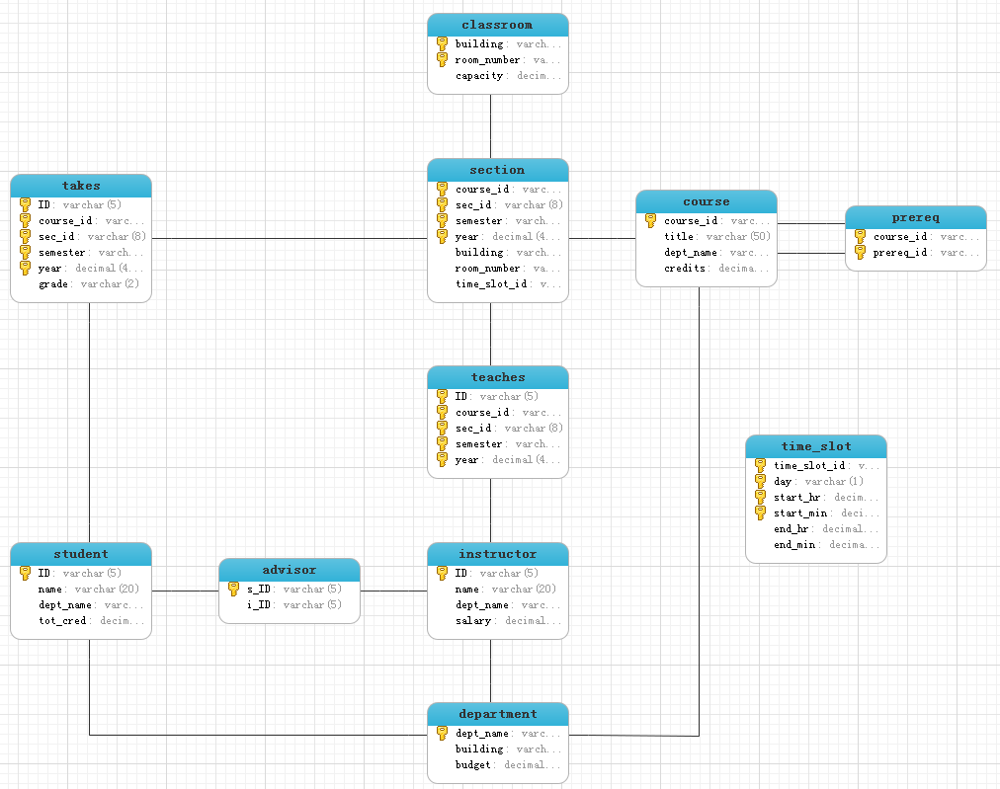

# SQL实战

结构化查询语言（Structured Query Language）简称SQL

SQL语言共分为四大类：

- DQL：数据查询语言，关键字包括select, from where等等
- DML：数据操纵语言，INSERT、UPDATE、DELETE
- DDL：数据定义语言，CREATE TABLE/VIEW/INDEX/SYN/CLUSTER、ALTER、DROP
- DCL：数据控制语言，GRANT、ROLLBACK、COMMIT

## DDL-导入数据

在MySQL中导入`DDL.sql`，`DDL.sql`具体内容如下：

```sql
create table classroom
	(
        building		varchar(15),
        room_number		varchar(7),
        capacity		numeric(4,0), -- 精度，小数
        primary key (building, room_number)
	);

create table department
	(
        dept_name		varchar(20), 
        building		varchar(15), 
        budget		     numeric(12,2) check (budget > 0),
        primary key (dept_name)
    );

create table course
	(
        course_id		varchar(8), 
        title			varchar(50), 
        dept_name		varchar(20),
        credits		numeric(2,0) check (credits > 0),
        primary key (course_id),
        foreign key (dept_name) references department (dept_name)
        on delete set null
	);

create table instructor
	(
        ID			varchar(5), 
        name			varchar(20) not null, 
        dept_name		varchar(20), 
        salary			numeric(8,2) check (salary > 29000),
        primary key (ID),
        foreign key (dept_name) references department (dept_name)
        on delete set null
	);

create table section
	(
        course_id		varchar(8), 
        sec_id			varchar(8),
        semester		varchar(6)
        check (semester in ('Fall', 'Winter', 'Spring', 'Summer')), 
        year			numeric(4,0) check (year > 1701 and year < 2100), 
        building		varchar(15),
        room_number		varchar(7),
        time_slot_id		varchar(4),
        primary key (course_id, sec_id, semester, year),
        foreign key (course_id) references course (course_id)
        on delete cascade,
        foreign key (building, room_number) references classroom (building, room_number)
        on delete set null
	);

create table teaches
	(
        ID			varchar(5), 
        course_id		varchar(8),
        sec_id			varchar(8), 
        semester		varchar(6),
        year			numeric(4,0),
        primary key (ID, course_id, sec_id, semester, year),
        foreign key (course_id, sec_id, semester, year) references section (course_id, sec_id, semester, year)
        on delete cascade,
        foreign key (ID) references instructor (ID)
        on delete cascade
	);

create table student
	(
        ID			varchar(5), 
        name			varchar(20) not null, 
        dept_name		varchar(20), 
        tot_cred		numeric(3,0) check (tot_cred >= 0),
        primary key (ID),
        foreign key (dept_name) references department (dept_name)
        on delete set null
	);

create table takes
	(
        ID			varchar(5), 
        course_id		varchar(8),
        sec_id			varchar(8), 
        semester		varchar(6),
        year			numeric(4,0),
        grade		        varchar(2),
        primary key (ID, course_id, sec_id, semester, year),
        foreign key (course_id, sec_id, semester, year) references section (course_id, sec_id, semester, year)
        on delete cascade,
        foreign key (ID) references student (ID)
        on delete cascade
	);

create table advisor
	(
        s_ID			varchar(5),
        i_ID			varchar(5),
        primary key (s_ID),
        foreign key (i_ID) references instructor (ID)
        on delete set null,
        foreign key (s_ID) references student (ID)
        on delete cascade
	);

create table time_slot
	(
        time_slot_id		varchar(4),
        day			varchar(1),
        start_hr		numeric(2) check (start_hr >= 0 and start_hr < 24),
        start_min		numeric(2) check (start_min >= 0 and start_min < 60),
        end_hr			numeric(2) check (end_hr >= 0 and end_hr < 24),
        end_min		numeric(2) check (end_min >= 0 and end_min < 60),
        primary key (time_slot_id, day, start_hr, start_min)
	);

create table prereq
	(
        course_id		varchar(8), 
        prereq_id		varchar(8),
        primary key (course_id, prereq_id),
        foreign key (course_id) references course (course_id)
        on delete cascade,
        foreign key (prereq_id) references course (course_id)
	);
```



其他DDL语句包括

- drop: 
  - `drop table r`
- alter:
  - `alter table r add [字段名] [类型]`
  - `alter table r drop [字段名]`
  - `alter table r modify [字段名] [类型]`
  - `Alter Table 表名 Add Constraint 约束名 约束类型 具体的约束类型 `
  - `Alter Table 表名 Drop Constraint 约束名` 
- `create view <视图名> as <DQL语句> [with check option]`

> Most SQL implementations allow updates only on simple views 
>
> - The from clause has only one database relation. 
> - The select clause contains only attribute names of the relation, and does not have any expressions, aggregates, or distinct specification. 
> - Any attribute not listed in the select clause can be set to null 
> - The query does not have a group by or having clause.

## DQL执行顺序

1. from
2. where
3. group by
4. having
5. select
6. order by

## The select Clause

Find the department names of all instructors, and remove duplicates

```sql
select distinct dept_name
from instructor;
```

> 在没有聚集函数的情况下，distinct 对于`select`的字段集合去重
>
> ```
> mysql> select distinct id, course_id from takes;
> +-------+-----------+
> | id    | course_id |
> +-------+-----------+
> | 00128 | CS-101    |
> | 00128 | CS-347    |
> | 12345 | CS-101    |
> | 12345 | CS-190    |
> | 12345 | CS-315    |
> | 12345 | CS-347    |
> | 19991 | HIS-351   |
> | 23121 | FIN-201   |
> | 44553 | PHY-101   |
> | 45678 | CS-101    |
> | 45678 | CS-319    |
> | 54321 | CS-101    |
> | 54321 | CS-190    |
> | 55739 | MU-199    |
> | 76543 | CS-101    |
> | 76543 | CS-319    |
> | 76653 | EE-181    |
> | 98765 | CS-101    |
> | 98765 | CS-315    |
> | 98988 | BIO-101   |
> | 98988 | BIO-301   |
> +-------+-----------+
> 21 rows in set (0.00 sec)
> 
> mysql> select id, course_id from takes order by id;
> +-------+-----------+
> | id    | course_id |
> +-------+-----------+
> | 00128 | CS-101    |
> | 00128 | CS-347    |
> | 12345 | CS-101    |
> | 12345 | CS-190    |
> | 12345 | CS-315    |
> | 12345 | CS-347    |
> | 19991 | HIS-351   |
> | 23121 | FIN-201   |
> | 44553 | PHY-101   |
> | 45678 | CS-101    |
> | 45678 | CS-101    |
> | 45678 | CS-319    |
> | 54321 | CS-101    |
> | 54321 | CS-190    |
> | 55739 | MU-199    |
> | 76543 | CS-101    |
> | 76543 | CS-319    |
> | 76653 | EE-181    |
> | 98765 | CS-101    |
> | 98765 | CS-315    |
> | 98988 | BIO-101   |
> | 98988 | BIO-301   |
> +-------+-----------+
> 22 rows in set (0.00 sec)
> ```

## The where Clause

To find all instructors' names in Comp. Sci. dept with salary > 80000

```sql
select name
from instructor
where dept_name = 'Comp. Sci.' and salary > 80000;
```

## The from Clause

Find the names of all instructors who have taught some course and the course_id

```sql
select name, course_id
from instructor, teaches
where instructor.ID = teaches.ID;
```

### Join

join原理的伪代码实现：

```sql
select *
from r1, r2, r3 .......;
```

```c++
for(tuple t1 : r1)
    for(tuple t2 : r2)
        for(tuple t3 : r3)
            ......
            tuple t = t1 拼接 t2 拼接 t3 ......
            r.push_back(t);
```

join的一个实例：

```sql
select *
from instructor;
```

```
+-------+------------+------------+----------+
| ID    | name       | dept_name  | salary   |
+-------+------------+------------+----------+
| 10101 | Srinivasan | Comp. Sci. | 65000.00 |
| 12121 | Wu         | Finance    | 90000.00 |
| 15151 | Mozart     | Music      | 40000.00 |
| 22222 | Einstein   | Physics    | 95000.00 |
| 32343 | El Said    | History    | 60000.00 |
| 33456 | Gold       | Physics    | 87000.00 |
| 45565 | Katz       | Comp. Sci. | 75000.00 |
| 58583 | Califieri  | History    | 62000.00 |
| 76543 | Singh      | Finance    | 80000.00 |
| 76766 | Crick      | Biology    | 72000.00 |
| 83821 | Brandt     | Comp. Sci. | 92000.00 |
| 98345 | Kim        | Elec. Eng. | 80000.00 |
+-------+------------+------------+----------+
```

```sql
select *
from department;
```

```
+------------+----------+-----------+
| dept_name  | building | budget    |
+------------+----------+-----------+
| Biology    | Watson   |  90000.00 |
| Comp. Sci. | Taylor   | 100000.00 |
| Elec. Eng. | Taylor   |  85000.00 |
| Finance    | Painter  | 120000.00 |
| History    | Painter  |  50000.00 |
| Music      | Packard  |  80000.00 |
| Physics    | Watson   |  70000.00 |
+------------+----------+-----------+
```

```sql
select *
from instructor,department;
```

```
+-------+------------+------------+----------+------------+----------+-----------+
| ID    | name       | dept_name  | salary   | dept_name  | building | budget    |
+-------+------------+------------+----------+------------+----------+-----------+
| 10101 | Srinivasan | Comp. Sci. | 65000.00 | Physics    | Watson   |  70000.00 |
| 10101 | Srinivasan | Comp. Sci. | 65000.00 | Music      | Packard  |  80000.00 |
| 10101 | Srinivasan | Comp. Sci. | 65000.00 | History    | Painter  |  50000.00 |
| 10101 | Srinivasan | Comp. Sci. | 65000.00 | Finance    | Painter  | 120000.00 |
| 10101 | Srinivasan | Comp. Sci. | 65000.00 | Elec. Eng. | Taylor   |  85000.00 |
| 10101 | Srinivasan | Comp. Sci. | 65000.00 | Comp. Sci. | Taylor   | 100000.00 |
| 10101 | Srinivasan | Comp. Sci. | 65000.00 | Biology    | Watson   |  90000.00 |
| 12121 | Wu         | Finance    | 90000.00 | Physics    | Watson   |  70000.00 |
| 12121 | Wu         | Finance    | 90000.00 | Music      | Packard  |  80000.00 |
| 12121 | Wu         | Finance    | 90000.00 | History    | Painter  |  50000.00 |
| 12121 | Wu         | Finance    | 90000.00 | Finance    | Painter  | 120000.00 |
| 12121 | Wu         | Finance    | 90000.00 | Elec. Eng. | Taylor   |  85000.00 |
| 12121 | Wu         | Finance    | 90000.00 | Comp. Sci. | Taylor   | 100000.00 |
| 12121 | Wu         | Finance    | 90000.00 | Biology    | Watson   |  90000.00 |
| 15151 | Mozart     | Music      | 40000.00 | Physics    | Watson   |  70000.00 |
| 15151 | Mozart     | Music      | 40000.00 | Music      | Packard  |  80000.00 |
| 15151 | Mozart     | Music      | 40000.00 | History    | Painter  |  50000.00 |
| 15151 | Mozart     | Music      | 40000.00 | Finance    | Painter  | 120000.00 |
| 15151 | Mozart     | Music      | 40000.00 | Elec. Eng. | Taylor   |  85000.00 |
| 15151 | Mozart     | Music      | 40000.00 | Comp. Sci. | Taylor   | 100000.00 |
| 15151 | Mozart     | Music      | 40000.00 | Biology    | Watson   |  90000.00 |
| 22222 | Einstein   | Physics    | 95000.00 | Physics    | Watson   |  70000.00 |
| 22222 | Einstein   | Physics    | 95000.00 | Music      | Packard  |  80000.00 |
| 22222 | Einstein   | Physics    | 95000.00 | History    | Painter  |  50000.00 |
| 22222 | Einstein   | Physics    | 95000.00 | Finance    | Painter  | 120000.00 |
| 22222 | Einstein   | Physics    | 95000.00 | Elec. Eng. | Taylor   |  85000.00 |
| 22222 | Einstein   | Physics    | 95000.00 | Comp. Sci. | Taylor   | 100000.00 |
| 22222 | Einstein   | Physics    | 95000.00 | Biology    | Watson   |  90000.00 |
| 32343 | El Said    | History    | 60000.00 | Physics    | Watson   |  70000.00 |
| 32343 | El Said    | History    | 60000.00 | Music      | Packard  |  80000.00 |
| 32343 | El Said    | History    | 60000.00 | History    | Painter  |  50000.00 |
| 32343 | El Said    | History    | 60000.00 | Finance    | Painter  | 120000.00 |
| 32343 | El Said    | History    | 60000.00 | Elec. Eng. | Taylor   |  85000.00 |
| 32343 | El Said    | History    | 60000.00 | Comp. Sci. | Taylor   | 100000.00 |
| 32343 | El Said    | History    | 60000.00 | Biology    | Watson   |  90000.00 |
| 33456 | Gold       | Physics    | 87000.00 | Physics    | Watson   |  70000.00 |
| 33456 | Gold       | Physics    | 87000.00 | Music      | Packard  |  80000.00 |
| 33456 | Gold       | Physics    | 87000.00 | History    | Painter  |  50000.00 |
| 33456 | Gold       | Physics    | 87000.00 | Finance    | Painter  | 120000.00 |
| 33456 | Gold       | Physics    | 87000.00 | Elec. Eng. | Taylor   |  85000.00 |
| 33456 | Gold       | Physics    | 87000.00 | Comp. Sci. | Taylor   | 100000.00 |
| 33456 | Gold       | Physics    | 87000.00 | Biology    | Watson   |  90000.00 |
| 45565 | Katz       | Comp. Sci. | 75000.00 | Physics    | Watson   |  70000.00 |
| 45565 | Katz       | Comp. Sci. | 75000.00 | Music      | Packard  |  80000.00 |
| 45565 | Katz       | Comp. Sci. | 75000.00 | History    | Painter  |  50000.00 |
| 45565 | Katz       | Comp. Sci. | 75000.00 | Finance    | Painter  | 120000.00 |
| 45565 | Katz       | Comp. Sci. | 75000.00 | Elec. Eng. | Taylor   |  85000.00 |
| 45565 | Katz       | Comp. Sci. | 75000.00 | Comp. Sci. | Taylor   | 100000.00 |
| 45565 | Katz       | Comp. Sci. | 75000.00 | Biology    | Watson   |  90000.00 |
| 58583 | Califieri  | History    | 62000.00 | Physics    | Watson   |  70000.00 |
| 58583 | Califieri  | History    | 62000.00 | Music      | Packard  |  80000.00 |
| 58583 | Califieri  | History    | 62000.00 | History    | Painter  |  50000.00 |
| 58583 | Califieri  | History    | 62000.00 | Finance    | Painter  | 120000.00 |
| 58583 | Califieri  | History    | 62000.00 | Elec. Eng. | Taylor   |  85000.00 |
| 58583 | Califieri  | History    | 62000.00 | Comp. Sci. | Taylor   | 100000.00 |
| 58583 | Califieri  | History    | 62000.00 | Biology    | Watson   |  90000.00 |
| 76543 | Singh      | Finance    | 80000.00 | Physics    | Watson   |  70000.00 |
| 76543 | Singh      | Finance    | 80000.00 | Music      | Packard  |  80000.00 |
| 76543 | Singh      | Finance    | 80000.00 | History    | Painter  |  50000.00 |
| 76543 | Singh      | Finance    | 80000.00 | Finance    | Painter  | 120000.00 |
| 76543 | Singh      | Finance    | 80000.00 | Elec. Eng. | Taylor   |  85000.00 |
| 76543 | Singh      | Finance    | 80000.00 | Comp. Sci. | Taylor   | 100000.00 |
| 76543 | Singh      | Finance    | 80000.00 | Biology    | Watson   |  90000.00 |
| 76766 | Crick      | Biology    | 72000.00 | Physics    | Watson   |  70000.00 |
| 76766 | Crick      | Biology    | 72000.00 | Music      | Packard  |  80000.00 |
| 76766 | Crick      | Biology    | 72000.00 | History    | Painter  |  50000.00 |
| 76766 | Crick      | Biology    | 72000.00 | Finance    | Painter  | 120000.00 |
| 76766 | Crick      | Biology    | 72000.00 | Elec. Eng. | Taylor   |  85000.00 |
| 76766 | Crick      | Biology    | 72000.00 | Comp. Sci. | Taylor   | 100000.00 |
| 76766 | Crick      | Biology    | 72000.00 | Biology    | Watson   |  90000.00 |
| 83821 | Brandt     | Comp. Sci. | 92000.00 | Physics    | Watson   |  70000.00 |
| 83821 | Brandt     | Comp. Sci. | 92000.00 | Music      | Packard  |  80000.00 |
| 83821 | Brandt     | Comp. Sci. | 92000.00 | History    | Painter  |  50000.00 |
| 83821 | Brandt     | Comp. Sci. | 92000.00 | Finance    | Painter  | 120000.00 |
| 83821 | Brandt     | Comp. Sci. | 92000.00 | Elec. Eng. | Taylor   |  85000.00 |
| 83821 | Brandt     | Comp. Sci. | 92000.00 | Comp. Sci. | Taylor   | 100000.00 |
| 83821 | Brandt     | Comp. Sci. | 92000.00 | Biology    | Watson   |  90000.00 |
| 98345 | Kim        | Elec. Eng. | 80000.00 | Physics    | Watson   |  70000.00 |
| 98345 | Kim        | Elec. Eng. | 80000.00 | Music      | Packard  |  80000.00 |
| 98345 | Kim        | Elec. Eng. | 80000.00 | History    | Painter  |  50000.00 |
| 98345 | Kim        | Elec. Eng. | 80000.00 | Finance    | Painter  | 120000.00 |
| 98345 | Kim        | Elec. Eng. | 80000.00 | Elec. Eng. | Taylor   |  85000.00 |
| 98345 | Kim        | Elec. Eng. | 80000.00 | Comp. Sci. | Taylor   | 100000.00 |
| 98345 | Kim        | Elec. Eng. | 80000.00 | Biology    | Watson   |  90000.00 |
+-------+------------+------------+----------+------------+----------+-----------+
```

简单验证一下：

-   `select count(*) from instructor;`得`12`
-   `select count(*) from department;`得`7`
-   `select count(*) from instructor , department;`得`84`

$84 = 12 \times 7$，符合笛卡尔乘积。

现在我们加上限制：

```sql
select name, i.dept_name, building
from instructor i , department d
where i.dept_name = d.dept_name;
```

```
+------------+------------+----------+
| name       | dept_name  | building |
+------------+------------+----------+
| Crick      | Biology    | Watson   |
| Srinivasan | Comp. Sci. | Taylor   |
| Katz       | Comp. Sci. | Taylor   |
| Brandt     | Comp. Sci. | Taylor   |
| Kim        | Elec. Eng. | Taylor   |
| Wu         | Finance    | Painter  |
| Singh      | Finance    | Painter  |
| El Said    | History    | Painter  |
| Califieri  | History    | Painter  |
| Mozart     | Music      | Packard  |
| Einstein   | Physics    | Watson   |
| Gold       | Physics    | Watson   |
+------------+------------+----------+
```

### Inner join 与 Outer join

Outer Join：An extension of the join operation that avoids loss of information. Computes the join and then adds tuples form one relation that does not match tuples in the other relation to the result of the join.

对比如下：

```sql
select *
from course inner join prereq on course.course_id = prereq.course_id;
```

```
+-----------+---------------------------+------------+---------+-----------+-----------+
| course_id | title                     | dept_name  | credits | course_id | prereq_id |
+-----------+---------------------------+------------+---------+-----------+-----------+
| BIO-301   | Genetics                  | Biology    |       4 | BIO-301   | BIO-101   |
| BIO-399   | Computational Biology     | Biology    |       3 | BIO-399   | BIO-101   |
| CS-190    | Game Design               | Comp. Sci. |       4 | CS-190    | CS-101    |
| CS-315    | Robotics                  | Comp. Sci. |       3 | CS-315    | CS-101    |
| CS-319    | Image Processing          | Comp. Sci. |       3 | CS-319    | CS-101    |
| CS-347    | Database System Concepts  | Comp. Sci. |       3 | CS-347    | CS-101    |
| EE-181    | Intro. to Digital Systems | Elec. Eng. |       3 | EE-181    | PHY-101   |
+-----------+---------------------------+------------+---------+-----------+-----------+
```

```sql
select *
from course left outer join prereq on course.course_id = prereq.course_id;
```

```
+-----------+----------------------------+------------+---------+-----------+-----------+
| course_id | title                      | dept_name  | credits | course_id | prereq_id |
+-----------+----------------------------+------------+---------+-----------+-----------+
| BIO-101   | Intro. to Biology          | Biology    |       4 | NULL      | NULL      |
| BIO-301   | Genetics                   | Biology    |       4 | BIO-301   | BIO-101   |
| BIO-399   | Computational Biology      | Biology    |       3 | BIO-399   | BIO-101   |
| CS-101    | Intro. to Computer Science | Comp. Sci. |       4 | NULL      | NULL      |
| CS-190    | Game Design                | Comp. Sci. |       4 | CS-190    | CS-101    |
| CS-315    | Robotics                   | Comp. Sci. |       3 | CS-315    | CS-101    |
| CS-319    | Image Processing           | Comp. Sci. |       3 | CS-319    | CS-101    |
| CS-347    | Database System Concepts   | Comp. Sci. |       3 | CS-347    | CS-101    |
| EE-181    | Intro. to Digital Systems  | Elec. Eng. |       3 | EE-181    | PHY-101   |
| FIN-201   | Investment Banking         | Finance    |       3 | NULL      | NULL      |
| HIS-351   | World History              | History    |       3 | NULL      | NULL      |
| MU-199    | Music Video Production     | Music      |       3 | NULL      | NULL      |
| PHY-101   | Physical Principles        | Physics    |       4 | NULL      | NULL      |
+-----------+----------------------------+------------+---------+-----------+-----------+
```

>   外连接一定需要`on`后面的语句

### Natural Join

等值连接在进行多表联合查询时通过**“=”**等号来连接多张表之间相字段对应的值，其产生的结果会出现重复列。

自然连接(Naturaljoin)是一种特殊的等值连接，它要求两个关系中进行比较的分量必须是相同的属性组，并且在结果中把重复的属性列去掉。而等值连接并不去掉重复的属性列。

>   column used in NATURAL join cannot have qualifier

## The Rename Operation

Find the names of all instructors who have a higher salary than some instructor in 'Comp. Sci'.

```sql
select distinct T.name
from instructor as T, instructor as S
where T.salary > S.salary and S.dept_name = 'Comp. Sci.';
```

> oracle 不允许出现 `as`

## String Operations

Find the names of all instructors whose name includes the substring “dar”.

```sql
select name
from instructor
where name like '%dar%';
```

Pattern matching examples:

-   'Intro%' matches any string beginning with “Intro”.
-   '%Comp%' matches any string containing “Comp” as a substring. 
-   '\_ \_ \_' matches any string of exactly three characters.
-   '\_ \_ \_ %' matches any string of at least three characters.

## Ordering the Display of  Tuples

List in reverse alphabetic order the names of all instructors 

```sql
select distinct name
from instructor
order by name desc;
```

>   `order by`默认升序排序（ASC），不能放在子查询中

### Rank

多出一列作为排序编号，用于在分组内部进行排序。需要注意的是:

-   **RANK()是跳跃排序**，即：如果有两个第1名，则接下来就是第3，忽略第2的情况。
-   使用RANK()的时候，空值是最大的，如果排序字段为null，可能造成null字段排在最前面，影响排序结果。

```sql
SELECT ID, grade, RANK() OVER (ORDER BY grade) rk
FROM takes;
```

```
+-------+-------+----+
| ID    | grade | rk |
+-------+-------+----+
| 98988 | NULL  |  1 |
| 00128 | A     |  2 |
| 12345 | A     |  2 |
| 12345 | A     |  2 |
| 12345 | A     |  2 |
| 76543 | A     |  2 |
| 76543 | A     |  2 |
| 98988 | A     |  2 |
| 00128 | A-    |  9 |
| 54321 | A-    |  9 |
| 55739 | A-    |  9 |
| 19991 | B     | 12 |
| 45678 | B     | 12 |
| 98765 | B     | 12 |
| 44553 | B-    | 15 |
| 45678 | B+    | 16 |
| 54321 | B+    | 16 |
| 12345 | C     | 18 |
| 76653 | C     | 18 |
| 98765 | C-    | 20 |
| 23121 | C+    | 21 |
| 45678 | F     | 22 |
+-------+-------+----+
```

### Partition by

用于给结果集分组，如果没有指定，则是对整个结果集作为一个分组。

```sql
SELECT ID, course_id, grade, RANK() OVER (PARTITION BY course_id ORDER BY grade ASC) rk
FROM takes;
```

```
+-------+-----------+-------+----+
| ID    | course_id | grade | rk |
+-------+-----------+-------+----+
| 98988 | BIO-101   | A     |  1 |
| 98988 | BIO-301   | NULL  |  1 |
| 00128 | CS-101    | A     |  1 |
| 76543 | CS-101    | A     |  1 |
| 54321 | CS-101    | A-    |  3 |
| 45678 | CS-101    | B+    |  4 |
| 12345 | CS-101    | C     |  5 |
| 98765 | CS-101    | C-    |  6 |
| 45678 | CS-101    | F     |  7 |
| 12345 | CS-190    | A     |  1 |
| 54321 | CS-190    | B+    |  2 |
| 12345 | CS-315    | A     |  1 |
| 98765 | CS-315    | B     |  2 |
| 76543 | CS-319    | A     |  1 |
| 45678 | CS-319    | B     |  2 |
| 12345 | CS-347    | A     |  1 |
| 00128 | CS-347    | A-    |  2 |
| 76653 | EE-181    | C     |  1 |
| 23121 | FIN-201   | C+    |  1 |
| 19991 | HIS-351   | B     |  1 |
| 55739 | MU-199    | A-    |  1 |
| 44553 | PHY-101   | B-    |  1 |
+-------+-----------+-------+----+
```

### Dense Rank

RANK()是跳跃式排序，如果不需要跳跃式排序，可以使用DENSE_RANK()。当排序编号并列以后，下一个不空出所占的编号。注意与上面RANK比较

```sql
SELECT ID, grade, DENSE_RANK() OVER (ORDER BY grade) rk
FROM takes;
```

```
+-------+-------+----+
| ID    | grade | rk |
+-------+-------+----+
| 98988 | NULL  |  1 |
| 00128 | A     |  2 |
| 12345 | A     |  2 |
| 12345 | A     |  2 |
| 12345 | A     |  2 |
| 76543 | A     |  2 |
| 76543 | A     |  2 |
| 98988 | A     |  2 |
| 00128 | A-    |  3 |
| 54321 | A-    |  3 |
| 55739 | A-    |  3 |
| 19991 | B     |  4 |
| 45678 | B     |  4 |
| 98765 | B     |  4 |
| 44553 | B-    |  5 |
| 45678 | B+    |  6 |
| 54321 | B+    |  6 |
| 12345 | C     |  7 |
| 76653 | C     |  7 |
| 98765 | C-    |  8 |
| 23121 | C+    |  9 |
| 45678 | F     | 10 |
+-------+-------+----+
```

### Row Number

ROW_NUMBER()不需要考虑是否并列，哪怕根据条件查询出来的数值相同也会进行连续排名。

```sql
SELECT ID, grade, ROW_NUMBER() OVER (ORDER BY grade) rk
FROM takes;
```

```
+-------+-------+----+
| ID    | grade | rk |
+-------+-------+----+
| 98988 | NULL  |  1 |
| 00128 | A     |  2 |
| 12345 | A     |  3 |
| 12345 | A     |  4 |
| 12345 | A     |  5 |
| 76543 | A     |  6 |
| 76543 | A     |  7 |
| 98988 | A     |  8 |
| 00128 | A-    |  9 |
| 54321 | A-    | 10 |
| 55739 | A-    | 11 |
| 19991 | B     | 12 |
| 45678 | B     | 13 |
| 98765 | B     | 14 |
| 44553 | B-    | 15 |
| 45678 | B+    | 16 |
| 54321 | B+    | 17 |
| 12345 | C     | 18 |
| 76653 | C     | 19 |
| 98765 | C-    | 20 |
| 23121 | C+    | 21 |
| 45678 | F     | 22 |
+-------+-------+----+
```

### Ntail

NTILE(n)将数据集合平均分配到指定的数量的n个桶中,将桶号分配给每一行。

例如5行数据，分成2组，就会前面3个，后面2个，默认把多余的行分给前面；分成3组，第一组就会2个，第二组就会2个，第三组就会1个。

```sql
SELECT ID, grade, NTILE(3) OVER (ORDER BY grade) rk
FROM takes;
```

```
+-------+-------+----+
| ID    | grade | rk |
+-------+-------+----+
| 98988 | NULL  |  1 |
| 00128 | A     |  1 |
| 12345 | A     |  1 |
| 12345 | A     |  1 |
| 12345 | A     |  1 |
| 76543 | A     |  1 |
| 76543 | A     |  1 |
| 98988 | A     |  1 |
| 00128 | A-    |  2 |
| 54321 | A-    |  2 |
| 55739 | A-    |  2 |
| 19991 | B     |  2 |
| 45678 | B     |  2 |
| 98765 | B     |  2 |
| 44553 | B-    |  2 |
| 45678 | B+    |  3 |
| 54321 | B+    |  3 |
| 12345 | C     |  3 |
| 76653 | C     |  3 |
| 98765 | C-    |  3 |
| 23121 | C+    |  3 |
| 45678 | F     |  3 |
+-------+-------+----+
```

## Where Clause Predicates

Find the names of all instructors with salary between \$90,000 and \$100,000 (that is, ≥ \$90,000 and ≤ \$100,000)

```sql
select name
from instructor
where salary between 90000 and 100000;
```

## Set Operations

注意属性数量和属性数据结构**兼容**

-   `union`
-   `intersect`或者`minus`
-   `except`

- union: 对两个结果集进行并集操作, **不包括重复行**,相当于distinct, 同时进行默认规则的排序
- union all: 对两个结果集进行并集操作, 包括重复行, 即所有的结果全部显示, 不管是不是重复

Find courses that ran in Fall 2017 but not in Spring 2018

```sql
(select course_id from section where semester = 'Fall' and year = 2017)
except
(select course_id from section where semester = 'Spring' and year = 2018);
```

有些数据库不支持关键字`except`，改成`minus`

```sql
(select course_id from section where semester = 'Fall' and year = 2017)
minus
(select course_id from section where semester = 'Spring' and year = 2018);
```

## some,any,all

some与any同义，some基于或运算，all基于与运算

可以使用

- < some(相当于< max)
- <= some(相当于<= max)
- \> some(相当于> min)
- \>= some(相当于>= min)
- = some(相当于in)
- <> some(**不同于** not in，<>some本质是`!=a || !=b ...`，not in 本质是`!=a && !=b ...`)
- < all(相当于< min)
- <= all(相当于< min)
- \> all(相当于> max)
- \>= all(相当于>= max)
- = all(**不同于**in，应该说除了标量子查询其他恒为假)
- <> all(相当于 not in)

## Null Values

-   The result of any arithmetic expression involving **null** is **null**，（Example: 5 + **null** returns **null**）
-   SQL treats as **unknown** the result of any comparison involving a null value （Example*: 5 <* **null** or **null** *<>* **null** or **null** *=* **null**）
-   instead, use predicates **is null** and **is not null**

 Find all instructors whose salary is null

```sql
select name
from instructor
where salary is null;
```

TRUE > UNKNOWN > FALSE：

-   *(true* **and** *unknown) = unknown* 
-   *(false* **and** *unknown) = false*
-   *(unknown* **and** *unknown) = unknown*

-   (*unknown* **or** *true*) = *true*
-   (*unknown* **or** *false*) = *unknown*
-   (*unknown* **or** *unknown) = unknown*

## Aggregate Functions

Find the total number of instructors who teach a course in the Spring 2018 semester

```sql
select count(distinct ID)
from teaches
where semester = 'Spring' and year = 2018;
```

Find the average salary of instructors in each department

```sql
select dept_name, avg(salary) asavg_salary
from instructor
group by dept_name;
```

Find the names and average salaries of all departments whose average salary is greater than 42000

```sql
select dept_name, avg (salary) as avg_salary
from instructor
group by dept_name
having avg (salary) > 42000;
```

聚集函数忽略NULL值，包括count(字段名)，唯一不忽略空值的是count(*)

```
mysql> select count(*) from takes;
+----------+
| count(*) |
+----------+
|       22 |
+----------+

mysql> select count(grade) from takes;
+--------------+
| count(grade) |
+--------------+
|           21 |
+--------------+
```

加不加distinct差别很大

```
mysql> select count(sec_id) from takes;
+---------------+
| count(sec_id) |
+---------------+
|            22 |
+---------------+

mysql> select count(distinct sec_id) from takes;
+------------------------+
| count(distinct sec_id) |
+------------------------+
|                      2 |
+------------------------+
```

group by 之后可以加多个字段

```
mysql> select id, name, count(*) from student group by id, name;
+-------+----------+----------+
| id    | name     | count(*) |
+-------+----------+----------+
| 00128 | Zhang    |        1 |
| 12345 | Shankar  |        1 |
| 19991 | Brandt   |        1 |
| 23121 | Chavez   |        1 |
| 44553 | Peltier  |        1 |
| 45678 | Levy     |        1 |
| 54321 | Williams |        1 |
| 55739 | Sanchez  |        1 |
| 70557 | Snow     |        1 |
| 76543 | Brown    |        1 |
| 76653 | Aoi      |        1 |
| 98765 | Bourikas |        1 |
| 98988 | Tanaka   |        1 |
+-------+----------+----------+
```

## Nested Subqueries嵌套子查询

### Set Membership

Name all instructors whose name is neither “Mozart” nor Einstein”

```sql
select distinct name
from instructor
where name not in ('Mozart', 'Einstein');
```

Find courses offered in Fall 2017 and in Spring 2018

```sql
select distinct course_id
from section
where semester = 'Fall' and year= 2017 and
course_id in (	
    select course_id
    from section
    where semester = 'Spring' and year= 2018
);
```

或者

```sql
select course_id
from section as S
where semester = 'Fall' and year = 2017 and
exists (
    select *
    from section as T
    where semester = 'Spring' and year = 2018
    and S.course_id = T.course_id
);
```

### Set Comparison

Find names of instructors with salary greater than that of some (at least one) instructor in the Biology department.

```sql
select distinct T.name
from instructor as T, instructor as S
where T.salary > S.salary and S.dept_name = 'Biology';
```

或者：

```sql
select name
from instructor
where salary > some (
    select salary
    from instructor
    where dept_name = 'Biology'
);
```

Find the names of all instructors whose salary is greater than the salary of all instructors in the Biology department.

```sql
select name
from instructor
where salary > all (
    select salary
    from instructor
    where dept_name = 'Biology'
);
```

### Test for Empty Relations

Find all students who have taken all courses offered in the Biology department.

```sql
select distinct S.ID, S.name
from student as S
where not exists ( 
    (select course_id
     from course
     where dept_name = 'Biology')
    except
    (select T.course_id
     from takes as T
     where S.ID = T.ID)
);
```

>   $$
>   X-Y= \varnothing \Leftrightarrow X \subseteq Y
>   $$

### 相关子查询

-   相关子查询：内部子查询不独立，比如借用到外层的表。
-   不相关子查询：内部子查询独立。

不相关子查询可以理解为先执行内部独立的子查询，再和外部查询。

相关子查询举一个例子：

```sql
SELECT *
FROM section a
WHERE sec_id = 1 AND EXISTS(
	SELECT *
	FROM section b
	WHERE sec_id = 2 and a.course_id = b.course_id
);
```

我们知道`WHERE`是以行为单位进行保留或去除，比如在处理`section`表的第一行时：

```
+-----------+--------+----------+------+----------+-------------+--------------+
| course_id | sec_id | semester | year | building | room_number | time_slot_id |
+-----------+--------+----------+------+----------+-------------+--------------+
| BIO-101   | 1      | Summer   | 2017 | Painter  | 514         | B            |
+-----------+--------+----------+------+----------+-------------+--------------+
```

子查询“退化”为：

```sql
SELECT *
FROM section b
WHERE sec_id = 2 and 'BIO-101' = b.course_id;
```

查询结果为：

```
Empty set (0.00 sec)
```

为空，`EXISTS`返回`FALSE`，这一行被去除。

以此类推，在处理每一行时都要进行一次子查询，效率较低。

### Subqueries in the From Clause

Find the average instructors’ salaries of those departments where the average salary is greater than $42,000.

```sql
select dept_name, avg (salary) as avg_salary
from instructor
group by dept_name
having avg (salary) > 42000;
```

或者：

```sql
select dept_name, avg_salary
from ( 
    select dept_name, avg (salary) as avg_salary
    from instructor
    group by dept_name
) tmp
where avg_salary > 42000;
```

### With Clause

Find all departments with the maximum budget 

```sql
with max_budget as
(
    select max(budget) value
    from department
)
select department.dept_name
from department, max_budget
where department.budget = max_budget.value;
```

Find all departments where the total salary is greater than the average of the total salary at all departments

```sql
with dept_total as
(
    select dept_name, sum(salary) value
    from instructor
    group by dept_name
),
dept_total_avg as
(
    select avg(value) value
    from dept_total
)
select dept_name
from dept_total, dept_total_avg
where dept_total.value > dept_total_avg.value;
```

### Scalar Subquery

List all departments along with the number of instructors in each department

```sql
select dept_name, count(*) as num_instructors
from instructor
group by dept_name;
```

或者：

```sql
select dept_name,
( 
    select count(*)
    from instructor
    where department.dept_name = instructor.dept_name
) as num_instructors
from department;
```

## 特殊例子

```sql
select '437' as FOO;
```

```
+-----+
| FOO |
+-----+
| 437 |
+-----+
```

```sql
select 'A'
from instructor;
```

```
+---+
| A |
+---+
| A |
| A |
| A |
| A |
| A |
| A |
| A |
| A |
| A |
| A |
| A |
| A |
+---+
```

## DML

### Deletion

Delete all instructors

```sql
delete from instructor;
```

Delete all instructors from the Finance department

```sql
delete from instructor
where dept_name= 'Finance';
```

### Insertion

Add a new tuple to course

```sql
insert into course (course_id, title, dept_name, credits)
values ('CS-437', 'Database Systems', 'Comp. Sci.', 4);
```

Make each student in the Music department who has earned more than 144 credit hours an instructor in the Music department with a salary of $18,000.

```sql
insert into instructor
select ID, name, dept_name, 18000
from student
where dept_name = 'Music' and total_cred > 144;
```

### Updates

Give a 5% salary raise to instructors whose salary is less than average

```sql
update instructor
set salary = salary * 1.05
where salary < (
    select avg (salary)
    from instructor
);
```

update instructor set salary = salary * 1.05 where salary < (select avg (salary) from instructor);

```sql
update instructor
set salary = 
    case
        when salary <= 100000 then salary * 1.05
        else salary * 1.03
    end;
```

## 函数补充

- `nvl(exper1, exper2)`：如果exper1为NULL，用exper2代替
- `length(exper)`：对于字符串字段求其长度
- `round(exper, n)`：对于小数字段exper，保留位小数
- `concat(exper1, exper2)`：字符串拼接，拼接多个就嵌套。

## 综合练习

Find the students who have registered some course at least 2 times.
For each student as such, following information should be listed:

* Name of the student
* Title of the course
* Count of registered record of the student for the course

```sql
WITH sdi_cid_c AS
(
	SELECT ID, course_id, count(*) cnt 
	FROM takes
	GROUP BY ID, course_id
	HAVING count(*)>=2
)
SELECT name, title, cnt
FROM sdi_cid_c 
	JOIN student ON sdi_cid_c.ID = student.ID
	JOIN course ON sdi_cid_c.course_id = course.course_id;
```

Find the students who have never registered any course.
For each student as such, following information should be listed:

* ID of the student
* Name of the student

```sql
WITH target AS
(
		(
            SELECT ID
            FROM student
		)
	except
		(
            SELECT ID
            FROM takes
		) 
)
SELECT s.ID, name
FROM student s
WHERE s.ID in 
(
    SELECT ID
    FROM target
);
```

Find the sections which have register records having unknown grade information.
For each section as such, following information should be listed:

* Title of the course corresponding to the section
* Id of the section
* Year of the section
* Semester of the section

```sql
WITH target AS
(
 SELECT s.course_id cid, s.sec_id sid, s.year year, s.semester semester
 FROM section s JOIN takes t ON s.course_id = t.course_id AND s.sec_id = t.sec_id AND s.semester = t.semester AND s.year = t.year
 WHERE grade is NULL
)
SELECT title, sid, year, semester
FROM target JOIN course ON target.cid = course.course_id;
```

Find the students who enroll to the department having 4 instructors at least. 
For each student as such, following information should be listed:

* Id of the student
* Name of the student
*  Name of the department the student enrolled to

```sql
WITH depts AS
(
	SELECT dept_name
	FROM instructor
	GROUP BY dept_name
	HAVING count(*)>=4
)
SELECT ID, name, s.dept_name
FROM student s
WHERE s.dept_name IN
(
    SELECT dept_name
    FROM depts
);
```

Find the department which hired instructors whose name contain ‘世’.
For each department as such, following information should be listed:

* Name of the department
* Building of the department
* Instructor count of the department

```sql
WITH depts AS
(
	SELECT dept_name
	FROM instructor
	WHERE name LIKE '%世%'
),
d_cnt AS
(
	SELECT dept_name, count(*) cnt
	FROM instructor
	GROUP BY dept_name
)
SELECT d.dept_name, building, cnt
FROM department d JOIN d_cnt ON d.dept_name=d_cnt.dept_name
WHERE d.dept_name IN
(
	SELECT dept_name
	FROM depts
);
```

Find the courses which have no ‘F’ grade record ever. 
Note: the courses which have never be registered should be included.
For each course as such, following information should be listed:

-   Course_id the course
-   Title of the course
-   Count of section corresponding to the course

```sql
WITH cid_cnt AS
(
    select course_id, count(*) cnt
    from section
    GROUP BY course_id
),
cid_g AS
(
	SELECT course_id, grade 
	FROM takes
)
SELECT c.course_id, title, nvl(cnt,0)
FROM course c LEFT OUTER JOIN cid_cnt ON c.course_id = cid_cnt.course_id
WHERE c.course_id not IN
(
    SELECT course_id
    FROM cid_g
    WHERE grade = 'F'
);
```

Get the grade distribution of all the sections having records in table `takes`
Note: there’s some grade like ‘A-’.
For each section grade distribution as such, following information should be listed: 

- Course_id of the section
- Year of the section
- Semester of the section
- ID number of the section
- Count of grade A records
- Count of grade B records
- Count of grade C records
- Count of grade D records
- Count of grade F records
- Count of records without grade information

```sql
WITH grade_info AS
(
    SELECT course_id, sec_id, semester, year, 
        CASE 
            WHEN grade LIKE 'A%' THEN 1
            ELSE 0
        END A_,
        CASE 
            WHEN grade LIKE 'B%' THEN 1
            ELSE 0
        END B_,
        CASE 
            WHEN grade LIKE 'C%' THEN 1
            ELSE 0
        END C_,
        CASE 
            WHEN grade LIKE 'D%' THEN 1
            ELSE 0
        END D_,
        CASE 
            WHEN grade LIKE 'E%' THEN 1
            ELSE 0
        END E_,
        CASE 
            WHEN grade LIKE 'F%' THEN 1
            ELSE 0
        END F_,
        CASE 
            WHEN grade IS NULL THEN 1
            ELSE 0
        END nv
	from takes
)
SELECT g.course_id, g.year, g.semester, g.sec_id, SUM(A_) A_s, SUM(B_) B_s, SUM(C_) C_s, SUM(D_) D_s, SUM(F_) F_s, SUM(nv) nvs
FROM grade_info g JOIN section s ON g.course_id = s.course_id AND g.sec_id = s.sec_id AND g.semester = s.semester AND g.year=s.year
GROUP BY g.course_id, g.sec_id, g.semester, g.year;
```

```
+-----------+------+----------+--------+------+------+------+------+------+------+
| course_id | year | semester | sec_id | A_s  | B_s  | C_s  | D_s  | F_s  | nvs  |
+-----------+------+----------+--------+------+------+------+------+------+------+
| CS-101    | 2017 | Fall     | 1      |    3 |    0 |    2 |    0 |    1 |    0 |
| CS-347    | 2017 | Fall     | 1      |    2 |    0 |    0 |    0 |    0 |    0 |
| CS-190    | 2017 | Spring   | 2      |    1 |    1 |    0 |    0 |    0 |    0 |
| CS-315    | 2018 | Spring   | 1      |    1 |    1 |    0 |    0 |    0 |    0 |
| HIS-351   | 2018 | Spring   | 1      |    0 |    1 |    0 |    0 |    0 |    0 |
| FIN-201   | 2018 | Spring   | 1      |    0 |    0 |    1 |    0 |    0 |    0 |
| PHY-101   | 2017 | Fall     | 1      |    0 |    1 |    0 |    0 |    0 |    0 |
| CS-101    | 2018 | Spring   | 1      |    0 |    1 |    0 |    0 |    0 |    0 |
| CS-319    | 2018 | Spring   | 1      |    0 |    1 |    0 |    0 |    0 |    0 |
| MU-199    | 2018 | Spring   | 1      |    1 |    0 |    0 |    0 |    0 |    0 |
| CS-319    | 2018 | Spring   | 2      |    1 |    0 |    0 |    0 |    0 |    0 |
| EE-181    | 2017 | Spring   | 1      |    0 |    0 |    1 |    0 |    0 |    0 |
| BIO-101   | 2017 | Summer   | 1      |    1 |    0 |    0 |    0 |    0 |    0 |
| BIO-301   | 2018 | Summer   | 1      |    0 |    0 |    0 |    0 |    0 |    1 |
+-----------+------+----------+--------+------+------+------+------+------+------+
```

另外一种写法，本质一样：

```sql
WITH grade_info AS
(
SELECT course_id, sec_id, semester, year, 
	CASE WHEN grade LIKE 'A%' THEN 1 END A_,
	CASE WHEN grade LIKE 'B%' THEN 1 END B_,
	CASE WHEN grade LIKE 'C%' THEN 1 END C_,
	CASE WHEN grade LIKE 'D%' THEN 1 END D_,
	CASE WHEN grade LIKE 'E%' THEN 1 END E_,
	CASE WHEN grade LIKE 'F%' THEN 1 END F_,
	CASE WHEN grade is NULL THEN 1 END nv
from takes
)
SELECT course_id, year, semester, sec_id, 
	nvl(SUM(A_),0) A_s,
	nvl(SUM(B_),0) B_s,
	nvl(SUM(C_),0) C_s,
	nvl(SUM(D_),0) D_s,
	nvl(SUM(F_),0) F_s,
	nvl(SUM(nv),0) nvs
FROM grade_info NATURAL JOIN section
GROUP BY course_id, sec_id, semester, year;
```

>   提醒：column used in NATURAL join cannot have qualifier
>
>   不能写成：
>
>   ```sql
>   SELECT g.course_id, g.year, g.semester, g.sec_id, 
>   	nvl(SUM(A_),0) A_s,
>   	nvl(SUM(B_),0) B_s,
>   	nvl(SUM(C_),0) C_s,
>   	nvl(SUM(D_),0) D_s,
>   	nvl(SUM(F_),0) F_s,
>   	nvl(SUM(nv),0) nvs
>   FROM grade_info g NATURAL JOIN section s
>   GROUP BY g.course_id, g.sec_id, g.semester, g.year
>   ```

Get the total credit hours in a week for every course which has has corresponding sections in every semester.
For each course as such , following information should be listed:

* ID of the course
* Year of the course ’s sections
* Semester of the course ’s sections
* Count of the Count of the course ’s sections in the corresponding year and semester
* Total Credit hours in a week. Note: 1 credit hour = 50 minutes

```sql
SELECT section.course_id, section.year, section.semester, 
    COUNT(distinct time_slot.time_slot_id) cnt,
    SUM((end_hr-start_hr)*60+(end_min-start_min))/50 credit_hour
FROM section JOIN time_slot ON section.time_slot_id=time_slot.time_slot_id
GROUP BY section.course_id, section.year, section.semester
```

Find the pairs of student and instructor which the student registered the section that taught by the instructor and the student ’s advisor is the instructor. 
For each pair as such , following information should be listed:

* Name of the student
* Name of the Instructor

```sql
WITH pairs AS
(
    (
        SELECT takes.ID s_ID, teaches.ID i_ID
        FROM takes JOIN teaches ON takes.course_id = teaches.course_id AND takes.sec_id = teaches.sec_id AND takes.semester = teaches.semester AND takes.year = teaches.year
    )
    INTERSECT
    (
        SELECT *
        FROM advisor
    )
)
SELECT student.name, instructor.name
FROM pairs 
	JOIN student ON pairs.s_ID = student.ID 
	JOIN instructor ON pairs.i_ID = instructor.ID;
```

Find the students who have passed exams of all the courses opened by the department the students are enrolled in. 
For each student as such , following information should be listed:

* name of the student
* name of the department which student is enrolled in

```sql
WITH require AS 
(
    SELECT id, course_id 
    FROM student JOIN course ON student.dept_name=course.dept_name
),
pass AS
(
    SELECT require.id id, require.course_id course_id
    FROM require JOIN takes ON require.course_id=takes.course_id AND takes.id=require.id 
    WHERE takes.grade NOT LIKE 'F%' AND takes.grade IS NOT NULL
),
fail AS
(
    (
        SELECT *
        FROM require
    )
    except
    (
        SELECT *
        FROM pass
    )
)
SELECT name, dept_name
FROM student
WHERE id NOT IN
(
    SELECT id 
    FROM fail 
    WHERE fail.id=student.id
);
```

Get information of 6th to 10th students according to the sorting rule that order students by students’ id ascending. 
For each student as such , following information should be listed:

* id of the student
* name of the student

```sql
WITH rk_student AS
(
	SELECT ROW_NUMBER() OVER (ORDER BY ID ASC) rk, ID, name
	FROM student
)
SELECT ID, name
FROM rk_student
WHERE rk >= 6 AND rk <= 10
```

Find students that has failed exam records that have no corresponding pass ones. 
For each student as such, following information should be listed: 

* id of the student
*  Name of the student
*  Count of courses that still have failed exam records un-overwrited.

```sql
WITH fail AS
(
    SELECT *
    FROM takes
    WHERE grade = 'F'
),
unoverwite AS 
(
	SELECT ID, count(DISTINCT course_id) cnt
	FROM fail
	WHERE NOT EXISTS
	(
		SELECT *
		FROM takes
		WHERE takes.ID=fail.ID AND takes.course_id=fail.course_id AND takes.grade!='F'
	)
	GROUP BY ID
)
SELECT unoverwite.ID, student.name, unoverwite.cnt
FROM unoverwite JOIN student ON unoverwite.ID=student.ID;
```

Find students that has taked some courses more than one time. 
For each student as such, following information should be listed: 

* id of the student
* Name of the student
* ID of the course
* The times of the student taking the course
* Count of the failed exam records of the student on the course.

```sql
WITH course_cnt AS
(
    SELECT ID, course_id, count(*) cnt
    FROM takes
    GROUP BY ID, course_id
    HAVING count(*)>=2
),
fail_cnt AS
(
    SELECT ID, course_id, count(*) fail_cnt
    FROM takes
    WHERE grade='F'
    GROUP BY ID, course_id
)
SELECT course_cnt.ID, name, course_cnt.course_id, cnt, fail_cnt
FROM course_cnt 
	JOIN fail_cnt ON course_cnt.ID=fail_cnt.ID AND course_cnt.course_id=fail_cnt.course_id
	JOIN student ON student.ID=course_cnt.ID;
```

