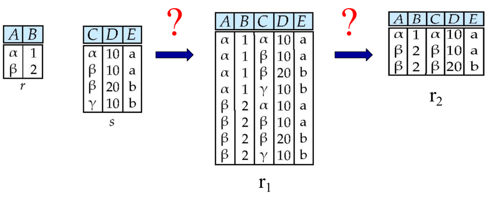
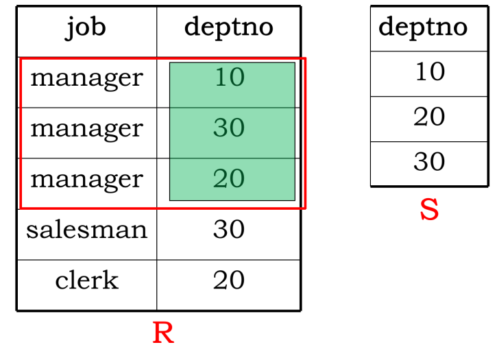
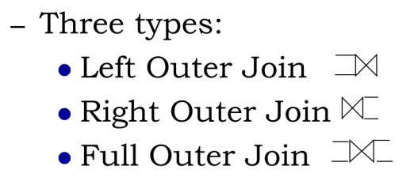

# 关系代数

**关系代数（Relational Algebra）**与SQL查询语言类似，不过多用于理论，SQL查询语言用于现实的数据库查询。

Three types of operations/operators on relations：

-   fundamental operations：基本运算
-   additive operations：由基本运算组合而成的附加运算
-   extended operations：扩展运算

> Fundamental operations 部分

## Select Operation

相当于SQL查询语言中的`where`

Select operation is defined as:
$$
\Large \sigma_p(r)=\{t|t \in r \land p(t) \}
$$
$p$ is called the selection predicate, connected by : $\land$ (and), $\lor$ (or), $\neg$ (not) , op is one of: $=$, $\ne$, $>$, $<$, $\le$, $\ge$ 

## Project Operation

相当于SQL查询语言中的`select`

Notation:
$$
\Large \Pi_{A_1,A_2,\dots,A_k}(r)
$$
where $A_i$ are attribute names and $r$ is a relation name  

**例子1：**
$$
\Large \Pi_{ID,name,salary}(instructor)
$$

```sql
SELECT distinct ID, name, salary
FROM instructor;
```

**例子2：**
$$
\Large \Pi_{name}(\sigma_{dept\_name='Physics'}(instructor))
$$

```sql
SELECT distinct name
FROM instructor
WHERE dept_name='Physics';
```

## Positional Notation（位置标记）

Use \$1， \$2, . . . refer to the first attribute, the second attribute, and so on.  

**例子：**

如果表结构为`instructor(ID, name, dept_name, salary)`，那么：
$$
\Large \Pi_{\$4} (\sigma_{\$4 < \$8} (instructor \times instructor ))
$$

```sql
SELECT distinct i1.salary
FROM instructor i1 JOIN instructor i2
WHERE i1.salary < i2.salary;
```

即选出所有不是最高工资的工资。

## Union Operation

Union operation on relation r and s is defined as:
$$
\Large r \cup s=\{t|t \in r \lor t \in s \}
$$

-   r, s must have the same arity (same number of attributes)  
-   The attribute domains must be compatible（兼容的）

**例子：**

Based on “emp-dept” schema, find all employees working as 'CLERK' or having salary higher than 2000, or fulfill both conditions.  
$$
\Large \Pi_{name}(\sigma_{job='CLERK'}(emp)) \cup \Pi_{name}(\sigma_{salary>2000}(emp))
$$

## Set-Difference Operation

Set difference operation on relation r and s is defined as:
$$
\Large r - s=\{t|t \in r \land t \notin s \}
$$

-   r, s must have the same arity
-   The attribute domains must be compatible

**例子：**

Based on “emp-dept” schema, find all employees working as 'CLERK' ，but not having salary higher than 2000.  
$$
\Large \Pi_{name}(\sigma_{job='CLERK'}(emp)) - \Pi_{name}(\sigma_{salary>2000}(emp))
$$

## Cartesian-product operation

Cartesian-product operation on relation r and s is defined as:  
$$
\Large r \times s=\{t|t=t_1t_2  \land t_1 \in r \land t_2 \in s \}
$$
**例子1：**

Give the relational algebra expression for the operations shown:


$$
\Large \Pi_{A,B,C,D,E}(\sigma_{A=C}(r \times s))
$$
**例子2:**

Based on “emp-dept” schema， find all employees’ name and their departments' name .  
$$
\Large \Pi_{emp.name, dept.name}(\sigma_{emp.deptno=dept.deptno}(emp \times dept))
$$

## Rename Operation

returns the result of expression E under the name x:
$$
\Large \rho_{\text{x}}(E)
$$
If a relational-algebra expression E has arity n then:
$$
\Large \rho_{\text{x}(A_1,A_2,\dots,A_n)}(E)
$$

> Additive operations 部分 

We define additional operations that do not add any power to the relational algebra, but that simplify common queries. An additional operation can be replaced/re-represented by basic operations. 

## Set-Intersection Operation 

For relation r and s, set-intersection operation on r and s is defined as:
$$
\Large r \cap s=\{t|t \in r \land t \in s \}=r-(r-s)
$$
**例子：**

Based on “emp-dept” schema, find all employees working as 'CLERK' and having salary higher than 2000.  
$$
\Large \Pi_{name}(\sigma_{job='CLERK'}(emp)) \cap \Pi_{name}(\sigma_{salary>2000}(emp))
$$

## Natural-Join Operation

Let r and s be relations on schemas R and S respectively, and assuming $R\cap S = {A_1， A_2， \dots， A_n }$, natural-join operation is defined as:
$$
\Large r \bowtie s = \sigma_{r.A_1=s.A_1 \land \dots \land r.A_n=s.A_n}(r \times s)
$$

-   Natural join is associative(结合律)
    $$
    \Large (A \bowtie B) \bowtie C = A \bowtie (B \bowtie C)
    $$

-   Natural join is commutative (交换律)  
    $$
    \Large A \bowtie B = B \bowtie A
    $$

## Theta Join

The theta join operation is defined as:
$$
\Large r \bowtie_\theta s = \sigma_\theta(r \times s)
$$
where $\theta$ is a predicate on attributes in $R \cup S$

## Division

记不住公式没问题，看例子理解。
$$
\Large R \div S = \Pi_{R-S}(r) - \Pi_{R-S}((\Pi_{R-S}(r) \times S) - \Pi_{R-S,S}(r))
$$

  

**例子1：**

Find all students who have taken all courses offered in the Biology department.
$$
\Large
\begin{align}

&\Pi_{name,course\_id}(\rho_{S}(student) \bowtie_{S.ID=T.ID}  \rho_{T}(takes)) \\ \div &\Pi_{course\_id}(\sigma_{dept\_name = 'Biology'}(course))

\end{align}
$$

```sql
select distinct S.name
from student as S
where not exists (
    (
        select course_id
        from course
        where dept_name = 'Biology'
	)
    except
    (
        select T.course_id
        from takes as T
        where S.ID = T.ID
    ) 
);
```

**例子2：**

Based on “emp-dept” schema, find the jobs provided by all the departments having employees.  

首先，确定目标的是job，条件是deptno
$$
\Large \Pi_{job,deptno}(emp) \div \Pi_{deptno}(dept)
$$


**例子3：**

找到提供了工资在3000到4000之间所有职位的部门，给出部门名称。

首先确定目标是deptno，条件是job
$$
\Large \Pi_{dname}(dept \bowtie \Pi_{deptno,job}(emp)\div\Pi_{job}(\sigma_{sal\ge 3000 \and sal <4000}(emp)))
$$

## Assignment Operation

The assignment operation ($\leftarrow$) provides a convenient way to express complex queries.  相当于`with ... as...`

## Outer Join

Outer join is an extension of the join operation that avoids loss of information.  



left outer join operation is defined as:
$$
\Large (r \bowtie s) \cup (r- \Pi_R(r \bowtie s) \times \{ (\text{null},\dots, \text{null})\})
$$

> Extended operations部分

## Generalized Projection

Generalized project（广义投影） extends the projection operation by allowing arithmetic functions to be used in the projection list.
$$
\Large \Pi_{F_1,F_2,\dots,F_n}(E)
$$
each of $F_1,F_2,\dots,F_n$ are arithmetic expressions involving constants and attributes in the schema of E  

## Aggregation functions

Aggregate operation（聚集运算） in relational algebra is defined as:  
$$
\Large _{G_1,G_2,\dots,G_n} \mathcal{G}_{F_1(A_1),F_2(A_2),\dots,F_n(A_n)}(E)
$$

-   $E$ is any relational-algebra expression
-   $G_1,G_2,\dots,G_n$is a list of attributes on which to group (can be empty) 
-   Each $F_i$ is an aggregate function 
-   Each $A_i$ is an attribute name

**例子1：**

Based on “emp-dept” schema,Find the average salary in each department  
$$
\Large _{deptno} \mathcal{G}_{avg(sal)}(emp)
$$
**例子2：**

获得工资比所在部门平均工资高的员工姓名、工资以及所在部门的平均工资。
$$
\Large \Pi_{ename,sal,avgsal}(\sigma_{sal>avgsal}(emp \bowtie(_{deptno} \mathcal{G}_{avg(sal) \, as\, avgsal}(emp))))
$$
