# 数据库设计

设计阶段：

1.   Characterize the data needs（刻画数据库用户需求）  
2.   Conceptual-design（概念设计）Entity-Relation model
     1.   确定实体集。
     2.   选择合适的属性。
     3.   在实体集之间确立联系集。
     4.   移除实体集与联系集的冗余属性。
3.   Logical design（逻辑设计）Relational model
     -   在已有的E-R模型上处理复合和多值属性。
     -   处理弱实体集。
     -   处理联系集。
     -   合并冗余模式。
4.   Physical design（物理设计）Access path
     -   select access methods of relational scheme, like Index(索引) and cluster(聚簇)
     -   determine the storage structure of the database

## Conceptual Design

### E-R模型基本概念

**data model** : a collection of conceptual tools for describing

-   data
-   data relationships （数据联系）  
-   data semantics （数据语义）
-   consistency constraints （一致性约束）  

**entity-relationship (E-R) data mode**: developed to facilitate database design byallowing specification of an enterprise schema that represents the overall logical structure of a database.  

**Entity (实体)** ： a “thing” or “object” in the real world that is distinguishable from all objects.比如学生

**Entity set (实体集)**：a set of entities of the same type that share the same attributes. 比如学生表。实体集一般用矩形表示，示例图在下方。

**Attribute (属性)**: descriptive properties possesed by an entity. And each entity has a value for each of its attributes.  比如学生表中的`name`

**Domain （域）** or **value set (值集)**： a set of permitted values for each attribute  

**Composite attributes (复合属性)**:   Composite attributes can be divided into subparts while simple attributes can’t.  在E-R模型设计中允许出现复合属性，用大括号包含。

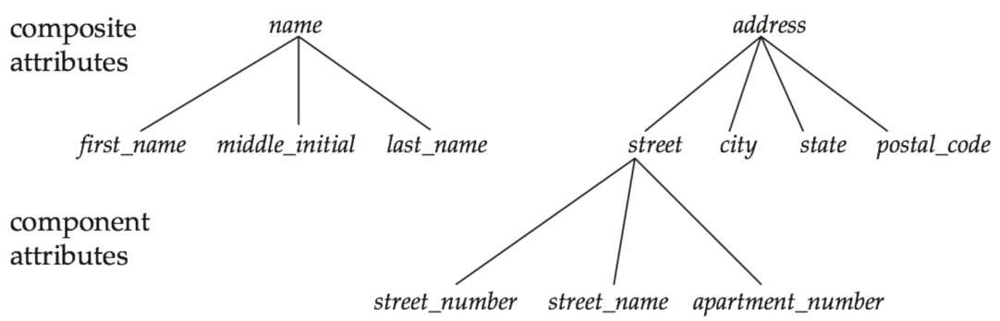

**Multivalued attributes (多值属性)** : Have a set of values for a specific attribute. 例如老师可能有多个电话。 在E-R模型设计中允许出现多值属性。

**Derived attribute (派生属性)** : The value can be derived from the values of other related attributes or entities. 例如年龄，可以通过出生日期计算得到，数据库中一般不保存派生属性，需要时计算得到。

**Relationship(联系)**: an association among several entities. 例如导师是老师与学生之间的联系。

**Relationship set (联系集) **： a set of relationships of the same type.  例如`instructor`表是`student`与`teacher`的联系集。联系集一般用菱形表示，示例图见下。

A relationship may also have attributes called **descriptive attributes (描述性属性).** 例如老师与学生之间，在某个时间点有了导师关系。这个时间是描述性属性。一般用虚线连在联系集上。如果需要，描述性属性可以变成联系集主码的一部分来确定一个联系。

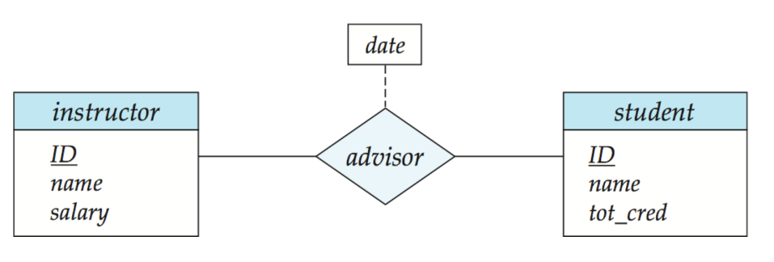

The association between entity sets is referred to as **participation(参与)**，例如`student`与`teacher`参与了`instructor`联系集。

The function that an entity plays in a relationship is called that entity’s **role (角色) **. 特别是同一个实体集参与两次的联系集，需要明确标出角色，比如联系集先修课程中，需要明确课程id和先修课程id。

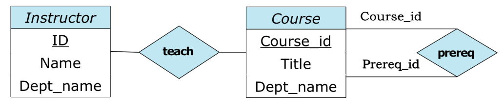

### Constraints

**Mapping cardinalities (映射基数)**： express the number of entities to which another entities can be associated via a relationship set.  

-   One-to-One。例如夫妻关系集，是一对一的。
-   One-to-Many。例如一个系可以有多个老师，一个老师最多只能属于一个系。
-   Many-to-Many。例如学生选课。一个学生可以选多门课，一门课可以被多个学生选。

下图是示例，"一"用箭头表示，"多"没有箭头。（注意下图中一对一的例子并不准确，一个老师可以教多个学生，两条杠的线之后再讲）

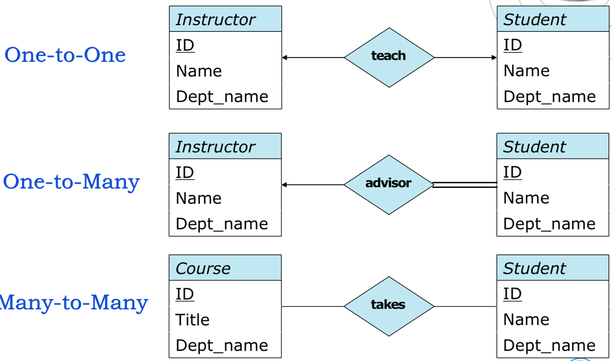

**Participation**：The participation of an entity set E in a relationship set R is said to be **total(全部)** if every entity in E participates in at least one relationship in R. 全部参与用两条线表示（如果是箭头，默认都用一条线）

If only some entities in E participate in relationships in R, the participation of entity set E in relationship R is said to be **partial(部分)**.  部分参与用一条线。

举个例子：

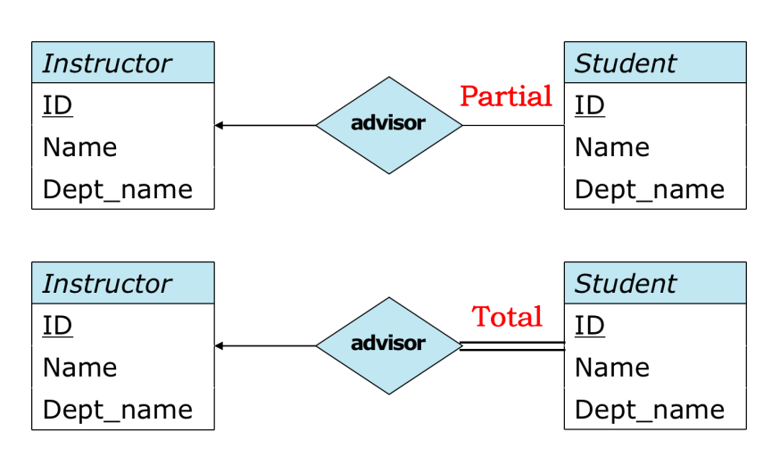

**Keys** :A **key(码)** for an entity set is a set of attributes that suffice to distinguish entities from each other of the set. Keys also help to identify relationships uniquely.

主码，超码的概念与数据库基本概念一致。

对于联系集的主码选择：

-   One-to-One。主码选择其中一个表的主码就行。
-   One-to-Many。主码选择"Many"一方的主码。
-   Many-to-Many。主码是两个表主码的并。

### 移除实体集与联系集的冗余属性

例子1：

-   Instructor (ID, name, dept_name, salary), 主码ID
-   Department (dept_name, building, budget), 主码dept_name
-   Inst_dept (ID, dept_name), 主码ID

其中，`Instructor`与`Inst_dept`中的`dept_name`冗余，删去`Instructor`中的`dept_name`：

-   Instructor (ID, name, salary), 主码ID
-   Department (dept_name, building, budget), 主码dept_name
-   Inst_dept (ID, dept_name), 主码ID

例子2：

-   Section (course_id, sec_id, semester, year), 主码(course_id, sec_id, semester, year)
-   Course (course_id, title, credits),主码course_id
-   Sec_course: (course_id, sec_id, semester, year),主码(course_id, sec_id, semester, year)

其中，`Section`与`Sec_course`中的`course_id`冗余，删去`Section`中的`course_id`：

-   Section (sec_id, semester, year), 主码(sec_id, semester, year)
-   Course (course_id, title, credits),主码course_id
-   Sec_course: (course_id, sec_id, semester, year),主码(course_id, sec_id, semester, year)

注意，更改后的`Section`称为了弱实体集（Weak entity set），弱实体集的主码用虚线标出，弱实体集参与的联系集用双菱形标识。

**Weak entity set (弱实体集)**： An entity set that does not have sufficient attributes to form a primary key, in comparison to **Strong entity set (强实体集)**. 弱实体集本身不能唯一标识实体，需要对应强实体集唯一标识实体。

**Identifying (标识)** or **owner entity set (属主实体集)**： another entity set that the weak entity set be associated with to be meaningful. 即对应的强实体集。

**Discriminator (分辨符)**： a set of attributes that distinguishes among all those entities in the weak entity set. 指弱实体集中用于标识实体的属性。

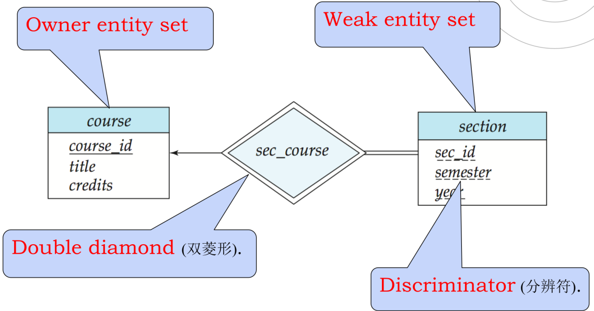

### E-R模型实例：大学数据库

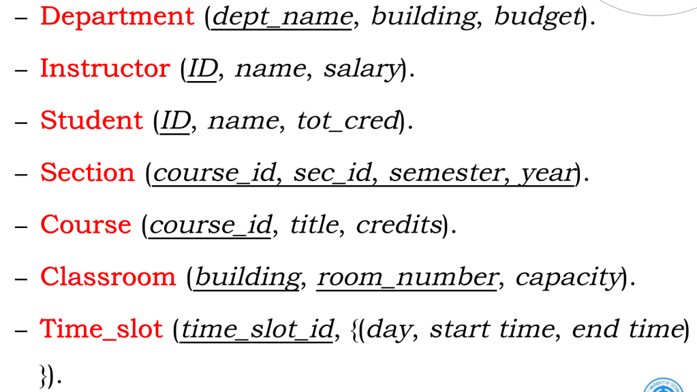

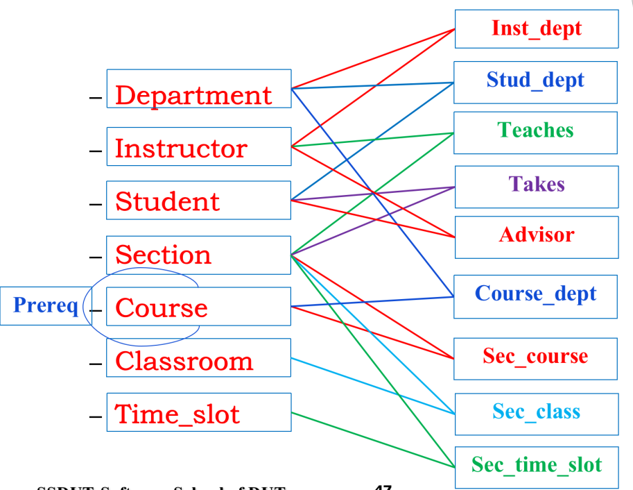

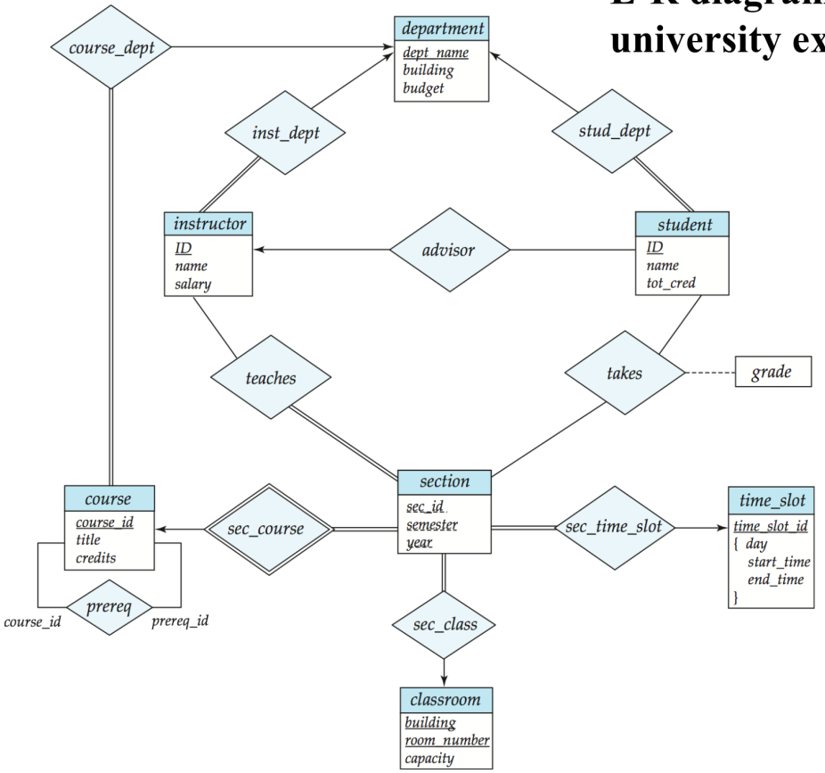

## Logical design

### 处理复合属性 

将复合属性中的每一个原子属性单独拿出来成为一个单独属性，例如：

```
instructor:
- ID(主码)
- name
  {
	- first_name
	- middle_initial
	- last_name
  }
```

处理为：

```
instructor:
- ID(主码)
- first_name
- middle_initial
- last_name
```

### 处理多值属性

将原来实体集的主码与多值属性成立一个新的实体集。

**例子1：**

```
instructor:
- ID(主码)
- {phone_number}
- 其他属性
```

处理为：

```
instructor:
- ID(主码)
- 其他属性
```

```
phone:
- ID(外码)
- phone_number
```

**例子2：**

```
time_slot:
- time_slot_id(主码)
- {
	- day
	- start_time
	- end_time
  }
```

处理为：

```
time_slot:
- time_slot_id(主码)
```

```
time_slot:
- time_slot_id(主码)
- day(主码)
- start_time(主码)
- end_time
```

出现了冗余？现在不删，之后有机会删。

### 处理弱实体集

如果A是一个弱实体集，B为属主实体集，那么将A转换为对应的关系模式：
$$
R_A=A \cup \text{PK}(B)
$$
例如：

```
Section (sec_id, semester, year), 主码(sec_id, semester, year)
Course (course_id, title, credits),主码course_id
```

将`Section`转化为：

```
Section (course_id, sec_id, semester, year), 主码(course_id, sec_id, semester, year)
```

### 处理联系集

对于一个联系集，其属性是所有参与实体集的主码加上描述属性。联系集对应关系模式的主码是：

-   一对一：选择其中一个实体集的主码。
-   一对多：选择"多"的实体集的主码。
-   多对多：两个实体集主码的并。

例子：

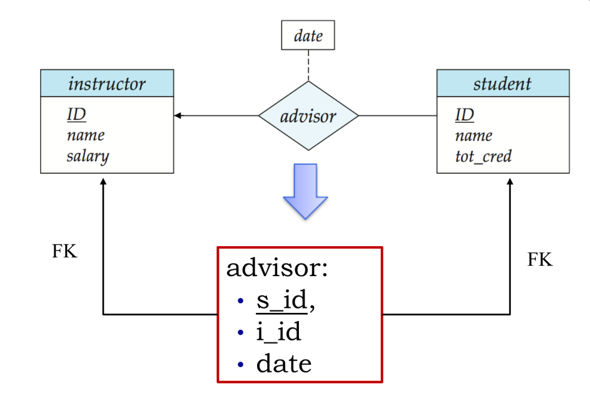

### 合并冗余模式

特别是对于一对一或者一对多的联系集转成的关系模式，其主码与某一个实体集重复，可以合并为一个关系模式，例如：

```
course:
- course_id(主码)
- name
- credits
```

```
course_dept:
- course_id(主码)
- dept_name
```

合并为：

```
course:
- course_id(主码)
- name
- credits
- dept_name
```

此外，一些模式会冗余，比如上面提到的：

```
time_slot:
- time_slot_id(主码)
```

```
time_slot:
- time_slot_id(主码)
- day(主码)
- start_time(主码)
- end_time
```

删去属性少的就行了。

### 关系模型实例：大学数据库

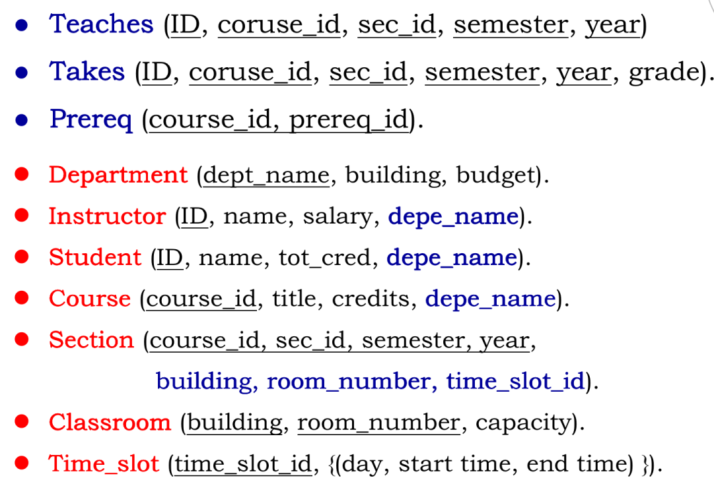

## Physical Design

Physical design is the process of choosing a physical structure that best fits the application requirements for a given logical data model.

The goal of the physical design is that the various transactions running on the database have: 

-   Small response time (响应时间)
-   High storage space utilization (存储空间利用率)
-   High transaction throughput (事务吞吐量)

the process include:

-   select access methods of relational scheme, like **Index(索引)** and **cluster(聚簇)**
-   determine the storage structure of the database

### Index

An Index for a file in a database system works in much the same way as the index in this textbook.  

two basic kinds of indices: 

-   Ordered indices. Based on a sorted ordering of the values. B+ tree is most commonly used.  
-   Hash indices. Based on a uniform distribution of values across a range of buckets. The bucket to which a value is assigned is determined by a function, called a hash function.

**Ordered indices**：An ordered index stores the values of the search keys (attributes) in sorted order, and associates with each search key the records that contain it.  

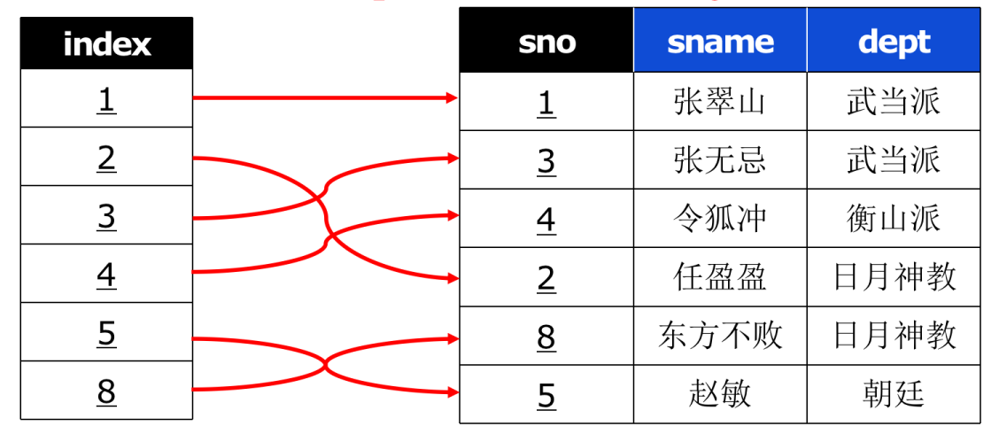

choose an attribute often appears in the query condition, or often used as an argument of aggregate functions such as Max, Min, or often appears in the join condition as the ordered index.

**Hash indices**: let K denote the set of all search-key values， and let B denote the set of all bucket addresses:
$$
h(K_i) \to B_i
$$
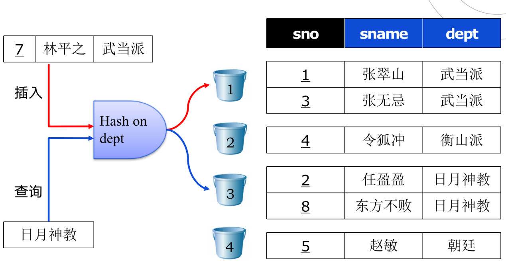

When we choose hash index?  

The attributes often appear in the equivalent join (等值连接) or in the equivalent comparison (等值比较) and meets one of the following conditions:  

-   The size of the relationship is static
-   The DBMS provides a dynamic HASH access method  

### Cluster 

Clustering tuples with the same value on an attribute (or set of attributes) into continuous physical blocks into a cluster (聚簇). Where the attribute (set of attributes) denotes as cluster key (聚簇码).  将重复出现的属性聚集起来。

When we choose cluster index? 

When an attribute (or set of attributes) should appears repeatedly (重复出现） in a relation.  

-   For single relation, the attributes often appear in the equivalent comparison (等值比较). 
-   For multiple relations, equivalent join (等值连接）operation are commonly conducted   

### Determine the storage structure

In order to improve the system performance

-   volatile (易变的) vs. stable (稳定的) 

-   high access frequency vs. low access frequency


should be stored separately. Where the data includes relation, index, cluster, log and backup. Try to find a balance between Access Efficiency and Maintenance Cost.  

