# 规范化

即对**关系模式（Relation schemes）**进行分析，找出其**函数依赖（Functional Dependencies）**，如果不满足**范式（Normal Forms）**，进行**分解（Decomposition）**。

## Functional Dependencies

如果存在$$\alpha$$到$$\beta$$的函数依赖，表示方法为：
$$
\alpha \to \beta
$$
例如，当我们知道学号，我们就能找到唯一对应的学生姓名，存在学号到学生姓名的函数依赖。

严谨的函数依赖证明方法为：
$$
t_i[\alpha]=t_j[\alpha] \to t_i[\beta]=t_j[\beta]
$$
其中，t指代关系模型r(R)中的元组，$$\alpha$$与$$\beta$$是属性。例如，当两条记录中学号一样，则我们能推出两条记录中的学生姓名是一样的。

一个推论，如果：
$$
t_i[K]=t_j[K] \to t_i=t_j
$$
则K是超码。

**三种函数依赖类型：**

- Trivial(平凡的)函数依赖：$$\alpha \to \beta$$ is trivial if $$\beta \subseteq \alpha$$ 。例子：$$（学号，课程）\to 课程$$
- Partial(部分) Functional Dependencies：$$\alpha \to \beta$$ is Partial if $$\gamma \subseteq \alpha$$ and $$\gamma \to \beta$$，表示方法为$$\alpha \xrightarrow{P} \beta$$。例如：$$（学号，课程）\to 学生姓名$$
- Transitive(传递)Functional Dependencies：$$\alpha \to \gamma$$ is Transitive if  $$\alpha \to \beta \and \beta \to \gamma \and \beta \nsubseteq \alpha \and \beta \nrightarrow \alpha$$ 。例如：$$学号\to 对应院长$$，因为$$学号\to 院系 \and 院系\to 院长 \and 院系 \nsubseteq 学号 \and 院系 \nrightarrow 学号$$ 

## Normal form

Normal form (范式， NF) is a collection of relation schemas that meet certain level. A relation schema R is the nth normal form denoted by $$R \in nNF$$

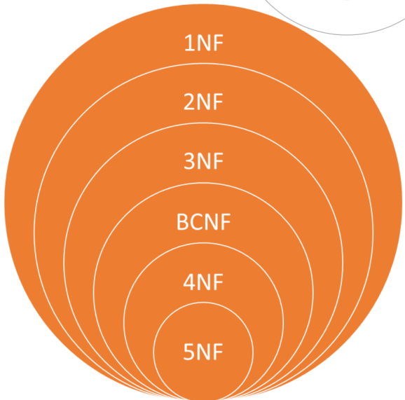

### 1NF 

A relation schema R is in first normal form ( 1NF) if the domains of all attributes of R are atomic.  属性都是原子的。

### 2NF 

If the relation schema $$R \in 1NF$$ and no any non-prime attribute（非主属性）is partially dependent on the candidate key, then $$R \in 2NF$$。要求数据库表中的每一列都和主键直接相关，而不能只与主键的某一部分相关

**例子：**

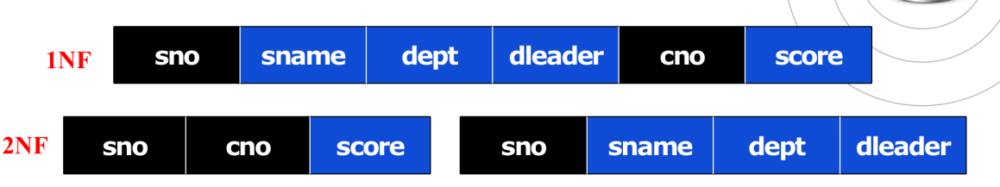

未拆分的版本中，候选码为(sno, cno)，存在函数依赖$$sno \to sname$$，因此不满足2NF，拆分后满足。

现在我们画出拆分后版本的函数依赖图，注意，虽然拆分后存在$$sno \to dept \to dleader$$这样不和谐的函数依赖，根据定义它依然满足2NF的要求：

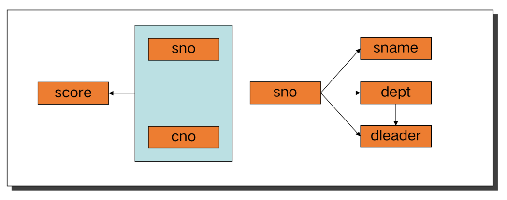

### 3NF

If the relation schema $$R \in 1NF$$ and no candidate key X, attribute set Y and non-prime attribute Z($$Z \nsubseteq Y$$ ), so that $$X \to Y \and Y \nrightarrow X \and Y \to Z$$, then $$R \in 3NF$$.不能存在传递函数依赖

上例中进一步拆分的结果为：

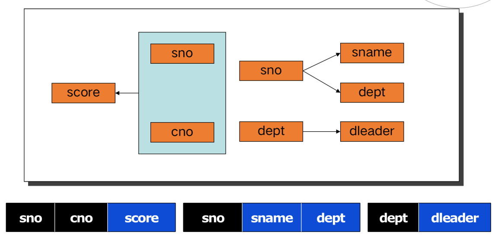

一定牢记全部限制，例如$$R=\{A,B,C\},F=A\to B,B\to C, C\to A$$，那么它满足3NF

### BCNF

BCNF(Boyce Codd Normal Function): If the relation schema $$R \in 1NF$$ and for each non-trivial functional dependency $$X \to Y$$, X contains a candidate key,then $$R \in BCNF$$. 所有函数依赖的左侧都包含候选码。

**例子：**

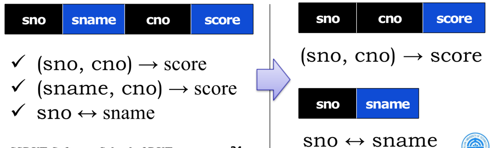

巴斯-科德范式（BCNF）也被称为3.5NF，至于为何不称为第四范式，这主要是由于它是第三范式的补充版，第三范式的要求是：任何**非主键字段不能与其他非主键字段间存在依赖关系**，也就是要求每个非主键字段之间要具备独立性。而巴斯-科德范式在第三范式的基础上，进一步要求：**任何主属性不能对其他主键子集存在依赖**。

### 4NF

要求把同一表内的多对多关系删除。

假设每个供应商(SNO)可以生产多个零件(PNO)，可以供应给多个工程(ENO)，一个工程(ENO)需要多个零件(PNO)，但同一个工程(ENO)的同一个零件(PNO)必须来自同一个供应商。关系SPE(SNO,PNO,ENO)对应的表数据可能是如下：

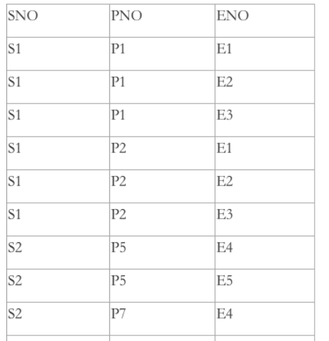

此时表SPE存在如下的函数依赖：(PNO,ENO)→SNO

根据BCNF的定义，此时表SPE属于BCNF。但是这样的关系模式仍具有不好的地方：数据冗余度太大。假如供应商S3生产了n个零件，每个零件供应给m个工程，那么显然S3要在表中重复m*n次。

4NF通俗地说，对于有三个属性的表，给定属性A一个值，剩余两个列之间不存在多对多的关系。例如，在SPE表中，给定SNO=S1，PNO和ENO之间很明显存在多对多的关系，故上表是不属于4NF的。

分解表（不同SNO的PNO不再共用）：

- 表1（SNO，PNO）
- 表2（PNO，ENO）

## Functional-Dependency Theory

### 基础概念

我们将关系模式r(R)的R定义为R(U,F)，U是属性名，F是函数依赖。

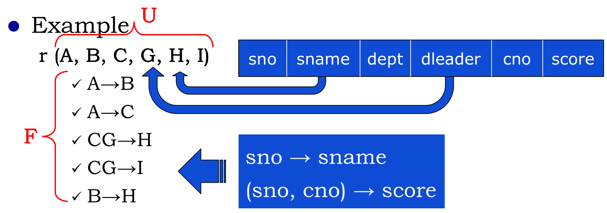

如果从现有F可以推出新的函数依赖（例如$$A\to H$$）那么说F**逻辑蕴含（logically imply）**$$A\to H$$

F的**闭包（closure）**$$F^+$$定义为所有原来的和可推出的函数依赖。

### Armstrong axioms

阿姆斯特朗公理（Armstrong axioms）：

1. 自反律。若Y⊆X⊆U，则X→Y为F所蕴含。
2. 增广律。若X→Y为F所蕴含，且Z⊆U，则XZ→YZ为F所蕴含。
3. 传递律。若X→Y及Y→Z为F所蕴含，则X→Z为F 所蕴含。

还可以推出：

- Union rule (合并律)：if $$\alpha \to \beta$$ holds and $$\alpha \to \gamma$$ holds, then $$\alpha \to \beta \gamma$$ holds.
- Decomposition rule (分解律)：if $$\alpha \to \beta \gamma$$ holds, then $$\alpha \to \beta$$ holds and  $$\alpha \to \gamma$$ holds.
- Pseudo-transitivity rule (伪传递律)：if $$\alpha \to \beta$$ holds and $$\gamma \beta \to \sigma$$ holds, then $$\alpha \gamma \to \sigma$$.

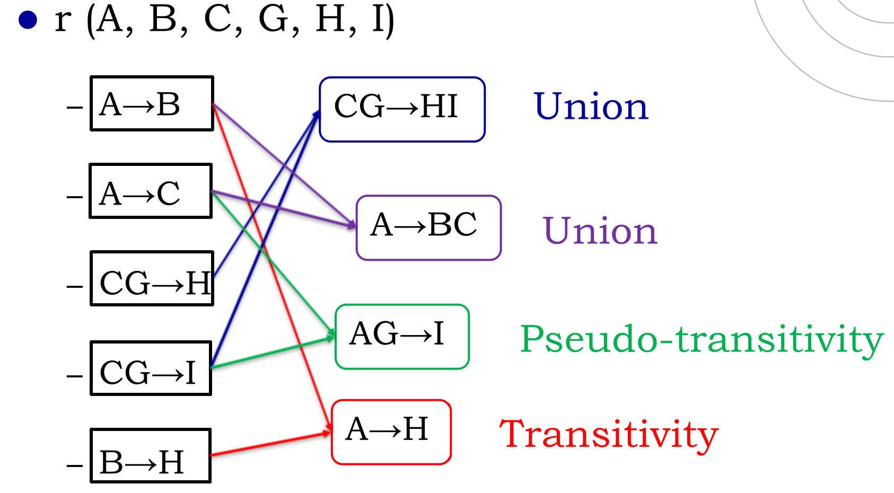

### Closure of Attribute Sets

if $$\alpha \to \beta$$，那么我们说attribute $$\beta$$ is **functionally determined(函数确定)**by a

Let $$\alpha$$ be a set of attributes in r(R) with functional dependencies F. We call the set of all attributes functionally determined by $$\alpha$$ under F the closure of $$\alpha$$ under F denoted as $$\alpha^+$$ (属性集闭包）

可以推出，如果$$\alpha^+$$包含所有属性，那么$$\alpha$$为超码。

> 设有关系模式R，U= {A,B,C}为R的属性集， F为R上的函数依赖集
>
> - 只在F右部出现的属性，不属于候选码
> - **只在F左部出现的属性，一定存在于某候选码当中**
> - 两边都没有出现的属性，一定存在于候选码中
> - 其他属性逐个与②③的属性结合得X，求属性闭包 ，直至X的闭包等于U。若等于U，则X为超码，如果验证发现子集无超码则为候选码

**算法：**

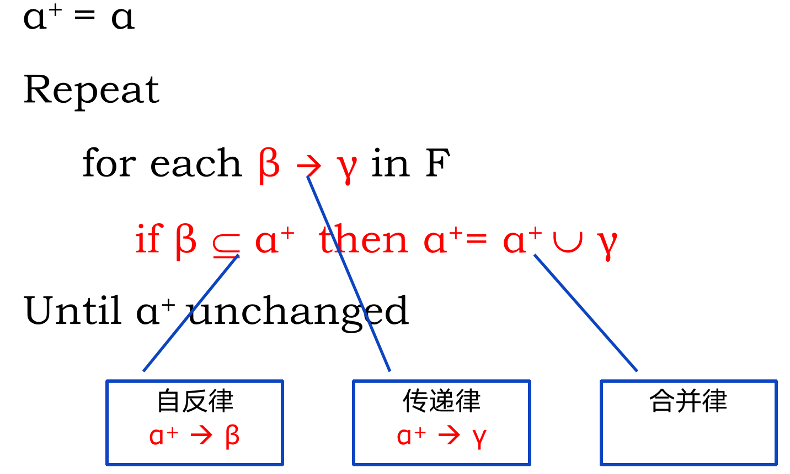

**例子（注意闭包加上大括号！！！！！）：**

对于r(A,B,C,G,H,I)，存在$$A\to B$$,$$A \to C$$, $$CG\to H$$,$$CG\to I$$,$$B\to H$$，求$$(AG)^+$$

初始化$$(AG)^+=AG$$

对于$$A\to B$$，因为$$A\subseteq AG$$，所以$$(AG)^+=ABG$$

对于$$A\to C$$，因为$$A\subseteq ABG$$，所以$$(AG)^+=ABCG$$

对于$$CG\to H$$，因为$$CG\subseteq ABCG$$，所以$$(AG)^+=ABCGH$$

对于$$CG\to I$$，因为$$CG\subseteq ABCGH$$，所以$$(AG)^+=ABCGHI$$

所以$$(AG)^+=ABCGHI$$

### BCNF Decomposition Algorithm

两条要求：

- Dependency preservation(保持函数依赖，尽量保持)分解之后不能丢失函数依赖
- Lossless decomposition(无损分解，必须无损)

无损分解要求：there is no loss of information by replacing r(R) with two relation schemas $$r_1(R_1)$$ and $$r_2(R_2)$$即：

```
select *
from r
```

=

```
select *
from (select R1 from r)
natural join
(select R2 from r)
```

一个辅助判断标准是$$(B \cap C)$$should be the key of B or C.

例子1不满足无损分解：

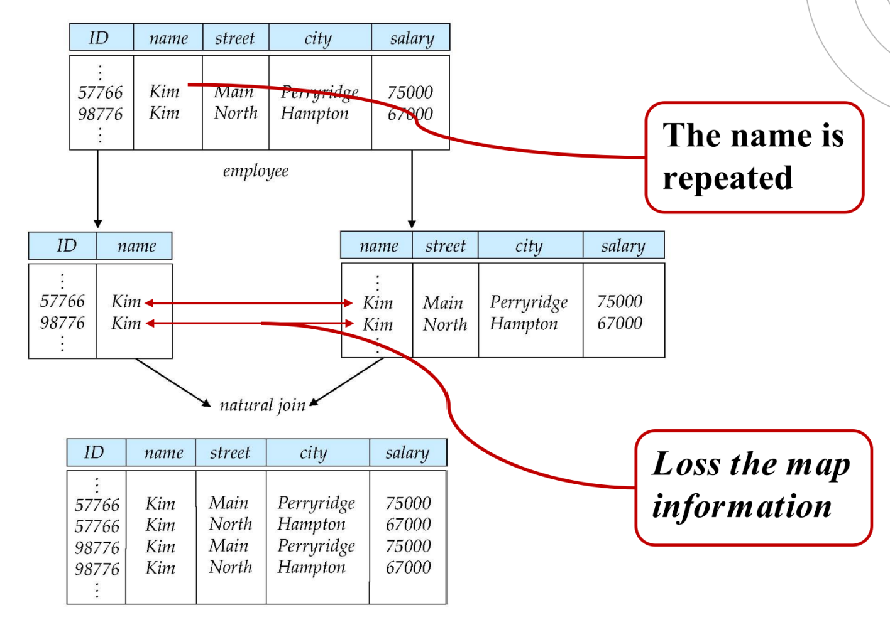

例子2满足无损分解：

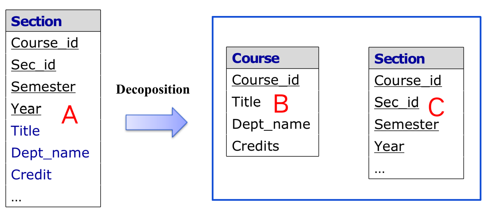

**算法**：即找到一个左侧不包含候选码的函数依赖$$\alpha \to \beta$$，将$$R_i$$分解为$$(R_i-\beta)$$和$$(\alpha, \beta)$$。依照分解顺序不同，分解结果不是唯一的。最后检查是否满足无损分解。

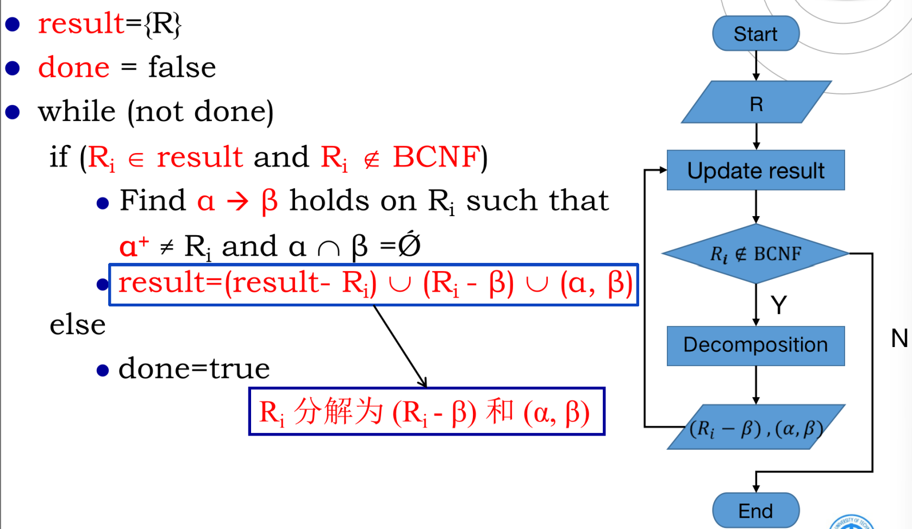

**例子1：**


在左侧，存在左侧不包含候选码的函数依赖$$sno \to sname$$，将原模式分解为$$(sno, sname, cno, score) - sname = (sno, cno, score)$$和$$(sno, sname)$$

**例子2：**

对于关系R，有五个属性ABCDE，存在函数依赖$$A\to B,BC\to E,C\to D$$

显然R不满足BC范式，分解过程为：

- 对于$$A\to B$$，$$(A)^+ \neq R$$，分解为$$R_1(AB),R_2(ACDE)$$
- 对于$$C\to D$$，$$(C)^+ \neq ACDE$$，分解为$$R_3(CD),R_4(ACE)$$

分解为$$R_1(AB),R_3(CD),R_4(ACE)$$

**例子3：**

对于关系R，有五个属性ABCD，存在函数依赖$$A\to C,C\to A,B\to AC$$

显然R不满足BC范式，候选码为BD，分解过程为：

- 对于$$A\to C$$，$$(A)^+ \neq R$$，分解为$$R_1(AC),R_2(ABD)$$
- 对于$$B\to A$$，$$(B)^+ \neq ABD$$，分解为$$R_3(AB),R_4(BD)$$

分解为$$R_1(AC),R_3(AB),R_4(BD)$$

或者：

- 对于$$A\to C$$，$$(A)^+ \neq R$$，分解为$$R_1(AC),R_2(ABD)$$
- 对于$$B\to C$$，$$(B)^+ \neq ABD$$，分解为$$R_3(BC),R_4(BD)$$

分解为$$R_1(AC),R_3(BC),R_4(BD)$$
