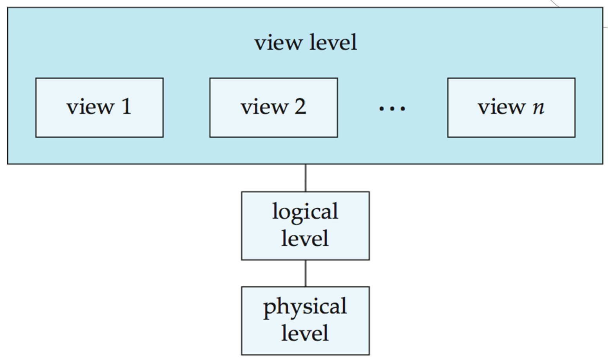
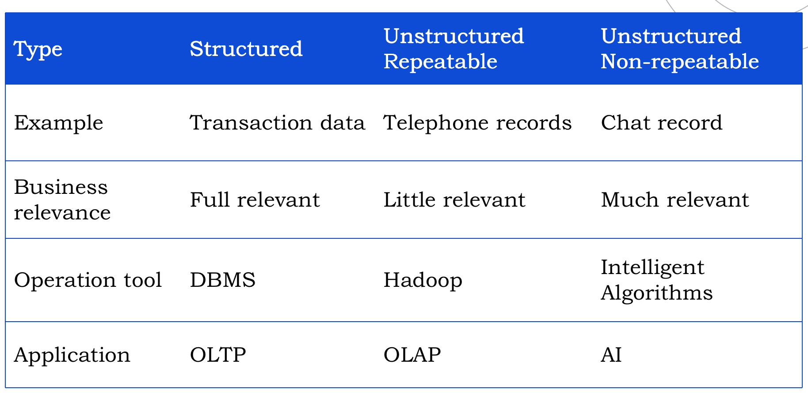
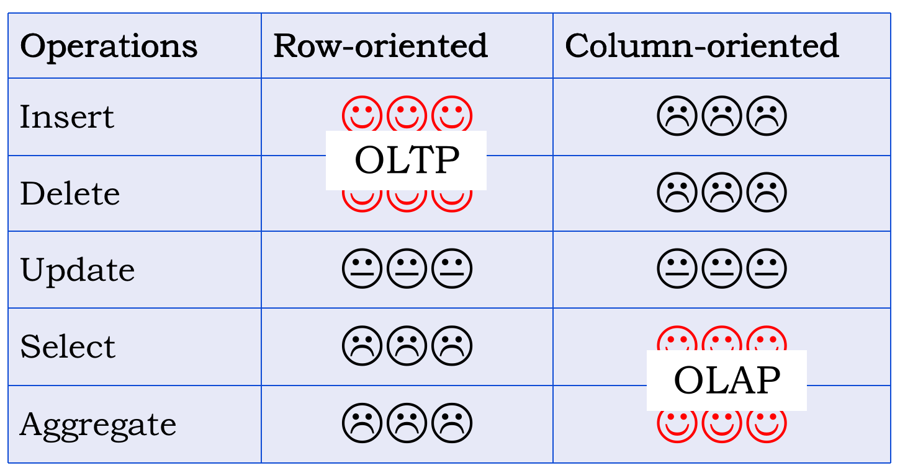

# 数据库基本概念

- Data：Values of qualitative or quantitative variables, belonging to a set of items

> 8848.64 is generally considered as data
>
> “The summit altitude of Mt. Everest is 8848.64” may be considered as information
>
> “8848.64 is the hightest altitude in the world. To arrive the peak，you should first... then ... such information is knowledge.

- Database (DB):An organized collection of interrelated data
- Database Management System (DBMS):DB and a set of programs to access those data. An environment that is both convenient and efficient to use
- Database System (DBS)：DBMS and 数据库应用 and DBA（数据库管理员）

## 目标

- Data redundancy and inconsistency (数据冗余和不一致） 
- Difficulty in accessing data (访问困难）
- Data isolation (数据孤立） 
- Integrity problems (完整性问题） 
- Atomicity of updates (更新操作的原子性） 
- Concurrent access (多用户并发访问） 
- Security problems (安全性问题）

## Schema

Schema(模式) refers to the organization of data blueprint of how the database is constructed

- Physical schema (物理模式，内模式)：database design at the physical level 
- Logical schema (逻辑模式)：database design at the logical level 
- Subschema (子模式，外模式，视图模式，用户模式)：database design at the view level

## Architecture of DBMS

- Physical level (物理层）：describes how data is stored are actually stored in files
- Logical level (逻辑层）：describes data stored in database, and the relationships among the data.
- View level (视图层）：describes data from different view of data

## Instance

Instance：A database instance is a state of operational database with data at any given time. It contains a snapshot of the database , Analogous to the value of a variable

## Data Independence

Physical Data Independence(物理数据独立性):The ability to modify the physical schema without changing the logical schema。提供物理数据独立性的是逻辑层和物理层之间的映射

> 采用逻辑方式来表示的数据，是物理上存储在文件当中的。但是，在文件当中到底是使用平衡树方式来存储的呢，还是使用链表的方式来存储的呢，再或者是用简单的线性表方式来存储呢？实际上，采用什么物理方式存储，对于上面的应用程序而言，都是可以不用关心的。因为应用程序只用逻辑表示方式来看数据。这时候，在底层物理存储的时候，到底采用什么样的数据结构，完全不用考虑“上面”有什么应用程序使用数据，而只要提供使用各种数据结构进行数据物理存储的方法就行了。到底对于一个数据的逻辑表示要采取什么对应的数据结构能够满足数据存取的效率要求，让数据库管理员来选择就好了，对于一份数据，如果在使用过程中从效率角度出发，物理存储方式有所调整，那么数据库管理员就可以调整对应于同一个数据逻辑表示的物理存储实现方式，但是应用程序看到的数据形式可以没有任何变化，唯一能感受到的变化可能就是数据读取速度变快了。也就是说，物理存储的实现方式对于数据逻辑表示的使用者而言是透明的。我们说，这就是物理层面的数据存储相对于数据的逻辑表示是独立的，也就是物理数据独立性。

Logical Data Independence(逻辑数据独立性）:The ability to modify the logical schema without changing the subschema。提供逻辑数据独立性的是逻辑层和视图层之间的映射

## Data model

数据模型是数据库系统的核心和基础，通常由数据结构、数据操作和一致性约束三部分组成。

> ppt上的版本：
>
> Definition of data model: a collection of conceptual tools for describing
>
> - data 
> - data relationships (数据联系） 
> - data semantics (数据语义） 
> - consistency constraints (一致性约束）

Data models can be classified as

-  Conceptual Data Model 
  -  Entity-Relationship Model (实体-联系模型) 
-  Logical Data Model 
   - hierarchical data model (层次模型）：通过从属关系结构表示数据间的联系,是有向树结构。
   - network data model  (网状模型）：网状模型是层次模型的扩展,表示多个从属关系的层次结构,呈现一种交叉关系的网络结构,是有向图结构。
   - Relational data model (关系模型）：具有相关性而非从属性的按照某种平行序列排列的数据集合,关系模型用二维表表示事物间的联系。
   - Object-based data model (基于对象的数据模型) 
   - Semistructured data model (半结构化数据模型) 
-  Physical Data Model 
   - B* tree model..

> 数据模型是严格定义的一组概念的集合，对现实世界数据特征的抽象，是针对具体场景构建最终数据存储方案（数据模式）的方法。
>
> 做个比喻的话，关系数据模型可以类比成面向对象模型，数据模型是一种概念级别的。就像基于面向对象模型，可以具体开发出Java语言和C++语言。基于关系数据模型可以开发出Oracle、Mysql等关系数据库管理系统。
>
> 一个关系数据库管理系统可以管理多个数据库，就好像使用Java语言定义多个变量，即一个变量就可以类比成一个关系数据库，变量的数据类型和符号描述就可以类比为数据模式，变量的具体的取值就是数据实例。
>
> 不太严谨的直白类比关系：
>
> - 面向过程思想 ~ 网状数据模型（Data model）
> - 面向对象思想 ~ 关系数据模型
> - Java语言 ~ Oracle（DBMS）
> - C++ 语言 ~ Mysql（DBMS）
> - class（或者说变量的数据类型定义声明） ~ 数据模式（schema)
> - 变量取值 ~ 数据实例(Instance)

## Data Architecture

对于结构化、半结构化、非结构化数据，它们之间的主要区分是，存储一条数据的时候，该数据的结构是否是明确的。

- 结构化：如果非常明确就是结构化的。最典型的结构化数据是指可以使用关系型数据库表示和存储。每一条数据所包含的属性都是预先定义好的，即每一条数据的结构是相同的。明确的结构对查询和修改等操作很有帮助。
- 半结构化：如果不是非常明确的就是半结构化的。半结构化数据是结构化数据的一种形式，作为字描述性结构，通过相关标记来分隔语义元素以及对记录和字段进行分层。与结构化数据不同，半结构化数据中对于同一类型的实体没有预先定义好的结构，因此，同一类实体可以有**不同的属性**，即使他们被组合在一起，这些属性的顺序并不重要。
- 非结构化：如果没有任何结构可言，就是非结构化的。各种文档、图片、视频、音频等都属于非结构化数据。对于这类数据，我们一般直接整体进行存储，而且一般存储为二进制的数据格式。非结构化数据库是指其字段长度可变，并且每个字段的记录又可以由**可重复**或不可重复的子字段构成的数据库，用它不仅可以处理结构化数据而且更适合处理非结构化数据。

OLTP（On-Line Transaction Processing联机事务处理）和OLAP（Online analytical processing联机分析处理）主要区别：

1. 基本含义不同：OLTP是传统的关系型数据库的主要应用，主要是基本的、日常的事务处理，记录即时的增、删、改、查，比如在银行存取一笔款，就是一个事务交易。OLAP即联机分析处理，是数据仓库的核心部心，支持复杂的分析操作，侧重决策支持，并且提供直观易懂的查询结果。典型的应用就是复杂的动态报表系统。
2. 实时性要求不同：OLTP实时性要求高，OLTP 数据库旨在使事务应用程序仅写入所需的数据，以便尽快处理单个事务。OLAP的实时性要求不是很高，很多应用顶多是每天更新一下数据。
3. 数据量不同：OLTP数据量不是很大，一般只读/写数十条记录，处理简单的事务。OLAP数据量大，因为OLAP支持的是动态查询，所以9也许要通过将很多数据的统计后才能得到想要知道的信息，例如时间序列分析等等，所以处理的数据量很大。
4. 用户和系统的面向性不同：OLTP是面向顾客的,用于事务和查询处理。OLAP是面向市场的,用于数据分析。

## 新型数据库

- Column-oriented storage structure，like C-Store (Open source), MonetDB (Open source), InfiniDB,Teradata, Sybase IQ ,BigTable, HBase
- Key-Value Database, like Google-BigTable, Amazon-Dynamo, Stanford-RAMCloud, VMWare-Redis
- Document Database, document like XML and JSON, DB like eXistdb, MongoDB
- Graph Database, like Neo4j

## Relational Data Model

术语：

- Relation：元组的集合
- Relation Schema: a list of attributes and their corresponding domains
- Relation Instance
- Database schema: logical design of the database，include many Schemas of Relations
- Database instance: a snapshot of the data in the database at a given instant in time.
- Attribute
- Tuple
- Domain（域）
- Atomic Domain
- Cartesian Product (笛卡尔积）

> 关系数据模型中的Relation与现实数据库表的区别：
>
> - 无限和有限
> - 独一无二和可重复
> - 无序和有序

## 一致性约束

A superkey (超码）is a set of one or more attributes that, taken collectively, can be used to identify uniquely a tuple in the relation.

candidate keys(候选码)  are superkeys for which no proper subset is a superkey.

Primary key (主码）denotes a candidate key that is chosen by the database designer as the principal means of identifying tuples within a relation.

The constituent attributes of any candidate key are called prime attributes(主属性).

an attribute that does not occur in ANY candidate key is called a non-prime attribute(非主属性).

外码和referential integrity constraint (参照完整性），外码不一定是所参照主码的已有取值，可以为NULL

其他约束包括：Not null、Check (age < 150 and age>=0)、unique

## 完整性约束

- 实体完整性，参照完整性和用户自定义完整性约束。实体完整性规定表的每一行在表中是唯一的实体。 
- 参照完整性指两个表的主关键字和外关键字的数据一致，保证表之间的数据一致性，防止数据丢失或无意义的数据在数据库中扩散。 
- 用户自定义完整性是不同数据库根据应用环境不同，用户定义的一些特殊约束条件。

## 存储过程

存储过程（Stored Procedure）是在大型数据库系统中，**一组为了完成特定功能的SQL语句集**，它存储在数据库中，一次编译后永久有效，用户通过指定存储过程的名字并给出参数（如果该存储过程带有参数）来执行它。存储过程是数据库中的一个重要对象。在数据量特别庞大的情况下利用存储过程能达到倍速的效率提升。

存储过程处理比较复杂的业务时比较实用。 比如说，一个复杂的数据操作。如果你在前台处理的话。可能会涉及到多次数据库连接。但如果你用存储过程的话。就只有一次。从响应时间上来说有优势。 也就是说存储过程可以给我们带来运行效率提高的好处。另外，程序容易出现BUG不稳定，而存储过程，只要数据库不出现问题，基本上是不会出现什么问题的。也就是说从安全上讲，使用了存储过程的系统更加稳定。

- 存储过程只在创造时进行编译，以后每次执行存储过程都不需再重新编译，而一般SQL语句每执行一次就编译一次,所以使用存储过程可提高数据库执行速度。
- 当对数据库进行复杂操作时(如对多个表进行 Update,Insert,Query,Delete 时），可将此复杂操作用存储过程封装起来与数据库提供的事务处理结合一起使用。这些操作，如果用程序来完成，就变成了一条条的SQL 语句，可能要多次连接数据库。而换成存储，只需要连接一次数据库就可以了。
- 存储过程可以重复使用,可减少数据库开发人员的工作量
- 安全性高,可设定只有某此用户才具有对指定存储过程的使用权

## 触发器

触发器（trigger）是 SQL server 提供给程序员和数据分析员来保证数据完整性的一种方法，它是与表事件相关的特殊的存储过程，它的执行不是由程序调用，也不是手工启动，而是由事件来触发，比如当对一个表进行操作（ insert，delete， update）时就会激活它执行。触发器经常用于加强数据的完整性约束和业务规则等。
