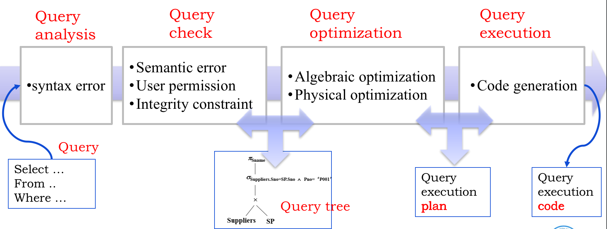

# 查询原理

## 流程

- Query analysis (查询分析)
  - Lexical analysis (词法分析）: Identify language symbols
  - Syntax analysis (句法分析): Check the syntax
- Query check (查询检查)
  - check semantic (语义）,permission (权限）and the integrity constraints (完整性约束).
  - Convert SQL query statements to equivalent relational algebra
- Query optimization (查询优化）
  - Algebra optimization (代数优化)：choose the most effective relational algebra expression
  - Physical optimization (物理优化)：select a detailed strategy for the relational algebra expression, including available algorithms, available indexes, etc.
- Query execution (查询执行）
  - Generate the query execution code
  - A security check is also carried out to ensure appropriate access permission.
  - For database update operations, integrity constraints are checked

## 代数优化

相较于CPU和内存，I/O明显耗时更多，查询优化主要以I/O次数作为评价依据，越少越好。一些公式如下：

- 交换律：$$E_1 \times E_2 \equiv E_2 \times E_1$$
- 结合率：$$(E_1 \times E_2) \times E_3 \equiv E_1 \times (E_2 \times E_3)$$
- 等等其他公式

我们举一个实例：

Find the name of students who register the course C1.

- 1,000 records in Student table
- 10,000 records in the SC table
- 50 C1 related records in SC table
- The system contains 6 idle RAM blocks
- Each RAM block can load 10 students records or load 100 SC records.

我们有三个等价的关系代数语句：

- $$Q_1=\Pi_{sname}(\sigma_{student.sno=sc.sno\and sc.cno='C1'}(student\times sc))$$
- $$Q_2=\Pi_{sname}(\sigma_{sc.cno='C1'}(student \bowtie sc))$$
- $$Q_3=\Pi_{sname}(student \bowtie \sigma_{sc.cno='C1'}(sc))$$

**第一个关系代数语句查询过程**

1. 从磁盘读一条学生记录，再读所有的SC记录做笛卡尔乘积。
2. 将所有的笛卡尔乘积写入磁盘。
3. 从磁盘读所有笛卡尔乘积，完成选择（select）操作。

在第一步中，如果我们将一个内存块分给学生记录，五个内存块分给SC记录，那么第一步需要的块数是：（第一部分是读学生记录的块，第二部分是再读所有的SC记录的块）
$$
\frac{1000}{10}+\frac{1000}{10 \times 1}\times \frac{10000}{100}=10100
$$
如果我们将五个内存块分给学生记录，一个内存块分给SC记录，那么第一步需要的块数是：（从此我们发现一个规律，尽量将更多的块分给笛卡尔乘积前方的记录，减少后方的记录的读取次数）
$$
\frac{1000}{10}+\frac{1000}{10 \times 5}\times \frac{10000}{100}=2100
$$
第二步，一条笛卡尔乘积记录的大头是学生记录部分，我们假设一个块可以放10个笛卡尔乘积记录：
$$
\frac{1000 \times 10000}{10}=10^6
$$
第三步与第二步需要的块数一样，所以第一个关系代数语句需要的总块数是：
$$
2100+10^6+10^6
$$
**第二个关系代数语句查询过程**

1. 从磁盘读一条学生记录，再读所有的SC记录做自然连接。这一步已经隐含去除了一些笛卡尔乘积记录，由于SC10000条，笛卡尔乘积记录只有10000条。
2. 将所有的笛卡尔乘积写入磁盘。
3. 从磁盘读所有笛卡尔乘积，完成选择（select）操作。

第二个关系代数语句需要的总块数是：
$$
2100+\frac{10000}{10}+\frac{10000}{10}
$$
**第三个关系代数语句查询过程**

1. 从磁盘读所有SC记录，进行选择，剩50条SC记录。
2. 从磁盘读一条学生记录，再与50条SC记录做自然连接。

第三个关系代数语句需要的总块数是：
$$
\frac{10000}{100}+\frac{1000}{10}+0=200
$$

- 第一项是读所有SC记录的块。
- 第二项是读所有学生记录。
- 50条记录很小所以不写回磁盘。

## 物理优化

Physical optimization methods includes

1. Rule-based heuristic optimization (基于规则的启发式优化）
2. Cost estimates based optimization (基于代价估算的优化）
3. Hybrid Optimization method (两者结合的优化）

In the end, choose the execution plan whose cost is the minimum