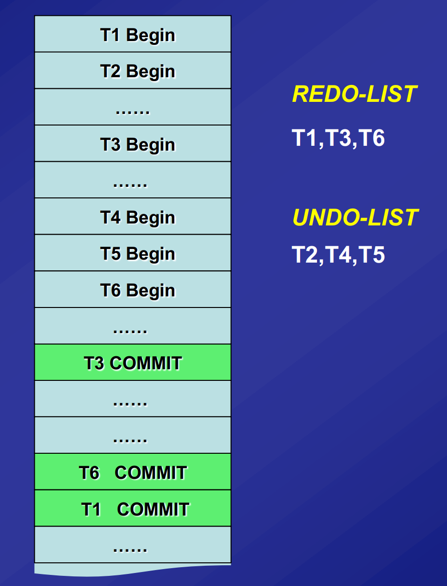
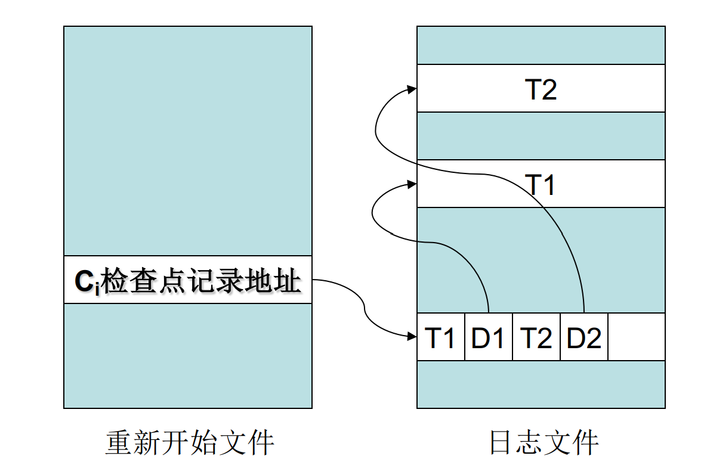
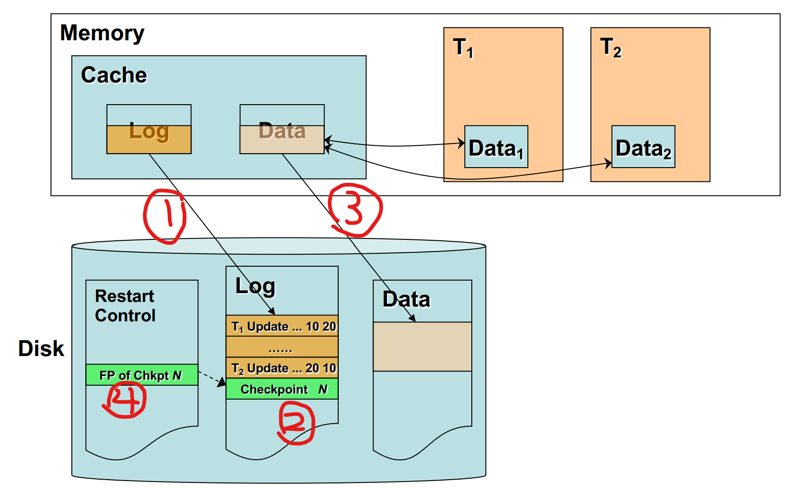
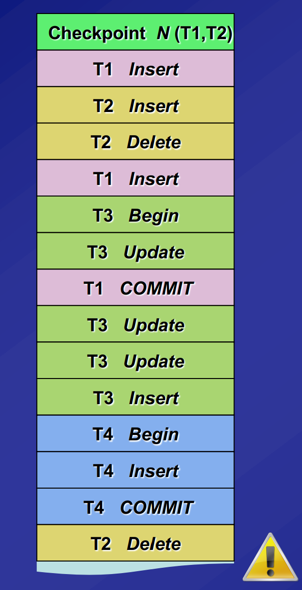
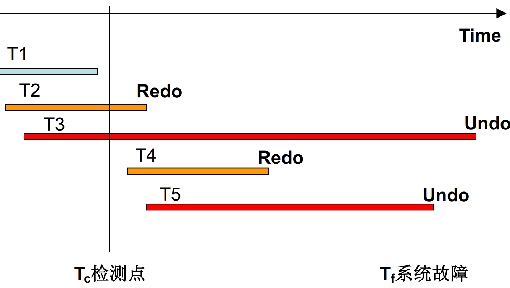
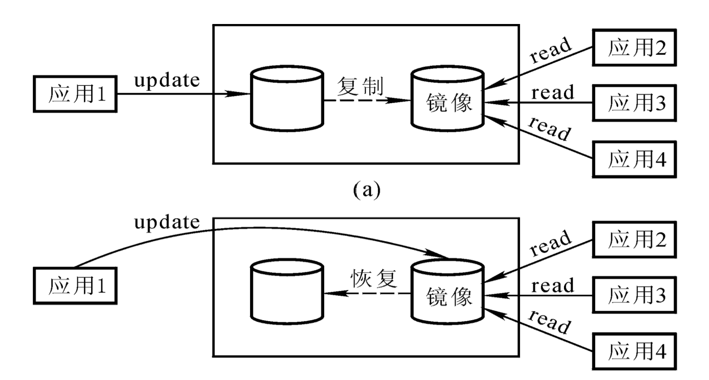

# 数据库恢复技术

[TOC]

## 事务

事务(Transaction)是用户定义的一个数据库操作序列，这些操作要么全做，要么全不做，是 一个不可分割的工作单位。事务是恢复和并发控制的基本单位。一个事务可以是一条SQL语句， 一组SQL语句或整个程序。

事务结束语句：

- COMMIT：事务正常结束。
- ROLLBACK：事务运行的过程中发生了故障，不能继续执行，回滚事务的所有更新操作，回到开始时的状态。

事务的ACID特性：

- 原子性（Atomicity）：事务中包括的操作要么都做，要么都不做。由数据恢复子系统负责。
- 一致性（Consistency）：数据库中包含失败事务的结果为不一致状态。
- 隔离性（Isolation）：并发执行的各个事务之间不能互相干扰。
-  持续性（Durability）：一个事务一旦提交，它对数据库中数据的改变就应该是永久性的。

破坏事务ACID特性的因素：

- 多个事务并行运行时，不同事务的操作交叉执行（没有隔离）
- 事务在运行过程中被强行停止（不原子，不一致）

## 故障

- 事务故障：某个事务在运行过程中由于种种原因未运行至正常终止点就夭折了。可以撤消事务（UNDO）或者强行回滚（ROLLBACK）该事务。
- 系统故障：整个系统的正常运行突然被破坏。系统重新启动时，恢复程序要强行撤消（UNDO） 所有未完成事务，重做（REDO）所有已提交的事务。
- 介质故障：外存中的数据部分丢失或全部丢失。装入数据库发生介质故障前某个时刻的数据副本，重做自此时始的所有成功事务，将这些事务已提交的结果重新记入数据库。

## 恢复

### 转储

转储是指DBA（数据库管理员，Database Administrator）将整个数据库复制到磁带或另一 个磁盘上保存起来的过程。这些备用的数据文 本称为后备副本或后援副本。

- 静态转储：在系统中无运行事务时进行转储，转储开始时数据库处于一致性状态，转储期间 不允许对数据库的任何存取、修改活动。
- 动态转储：转储操作与用户事务并发进行，转储期间允许对数据库进行存取或修改。
- 海量转储: 每次转储全部数据库。
- 增量转储: 只转储上次转储后更新过的数据。

> 对于动态转储的数据库副本，要恢复时还须同时装入转储时刻的日志文件副本，利用与恢复系统故障相同的方法（即 REDO+UNDO，下面讲），才能将数据库恢复到一致性状态。

### 日志文件

日志文件(log)是用来记录事务对数据库的更新操作的文件

每条日志记录的内容：

- 事务标识
- 操作类型（插入、删除或修改）
- 操作对象（记录ID、Block NO.）
- 更新前数据的旧值（对插入操作而言，此项为空值）
- 更新后数据的新值（对删除操作而言, 此项为空值）

登记日志文件的原则：

- 登记的次序严格按并行事务执行的时间次序。
- 必须先写日志文件，后写数据库。

如果先写日志，但没有修改数据库时故障发生，按日志文件恢复时只不过是多执行一次不必要的UNDO操作，并不会影响数据库的正确性。

**事务故障的恢复：**

利用日志文件撤消（UNDO） 此事务已对数据库进行的修改

1. 从最后向前扫描日志文件，查找该事务的更新操作。
2. 对该事务的更新操作执行逆操作。
3. 继续反向扫描日志文件，查找该事务的其他更新操作，并做同样处理。
4. 直至读到此事务的开始标记，完成。

**系统故障的恢复：**

- 一些未完成事务对数据库的更新已写入数据库，Undo 故障发生时未完成的事务
- 一些已提交事务对数据库的更新还留在缓冲区没来 得及写入数据库，Redo 已完成的事务

1. 从头扫描日志文件，记录Redo队列（在故障发生前已经提交的事务 T1, T3, T6…..）和Undo队列（故障发生时尚未完成的事务 T2, T4, T5…...）
2. 对每个UNDO事务的更新操作执行逆操作（T2, T4, T5……）
3. 对每个REDO事务重新执行登记的操作（ T1, T3, T6…..）

介质故障的恢复：

1. 装入最新的后备数据库副本，使数据库恢复到最近一次转储时的一致性状态。
2. 装入有关的日志文件副本，重做已完成的事务。

### 检查点

之前技术的两个问题：

- 搜索整个日志将耗费大量的时间
- REDO处理：重新执行，浪费了大量时间

检查点记录的内容：

- 建立检查点时刻所有正在执行的事务清单
- 这些事务最近一个日志记录的地址

重新开始文件的内容：

- 记录各个检查点记录在日志文件中的地址

创建检查点方法：

1. 将当前日志缓冲区中的所有日志记录写入磁盘的日志文件上。
2. 在日志文件中写入一个检查点记录。
3. 将当前数据缓冲区的所有数据记录写入磁盘的数据库中。
4. 把检查点记录在日志文件中的地址写入一个 重新开始文件。

如果在第四步前系统崩溃，那么这个检查点失效，但仍可以从上一个检测点恢复。

利用检查点的恢复步骤：

1. 从重新开始文件中找到最后一个检查点记录在日志文件中的地址
2. 由该地址在日志文件中找到最后一个检查点记录
3. 由该检查点记录得到检查点建立时所有正在执行的事务清单 ACTIVE-LIST，再建立两个事务队列UNDO-LIST和REDO-LIST，把ACTIVE-LIST暂时放入UNDO-LIST队列，REDO队列暂为空。
4. 从检查点开始正向扫描日志文件，直到日志文件结束。如有新开始的事务Ti，把Ti暂时放入UNDO-LIST队列。如有提交的事务Tj，把Tj从UNDO-LIST队列移到REDO-LIST队列。
5. 对UNDO-LIST中的每个事务执行UNDO操作, 对REDO-LIST中的每个事务执行REDO操作。

**例子1：**

这个例子中，最后UNDO-LIST是T2,T3。REDO-LIST为T1,T4。

**例子2：**

### 数据库镜像

