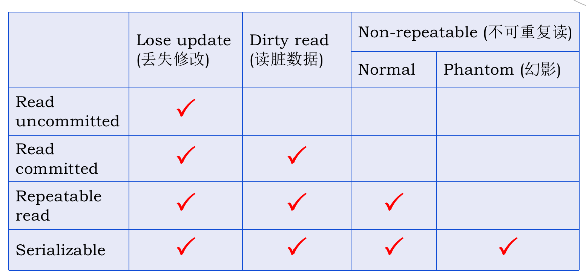
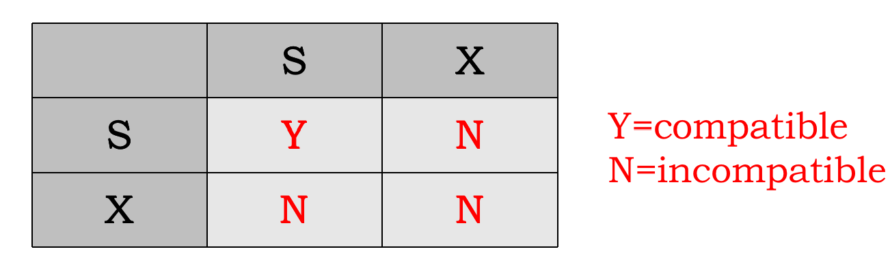
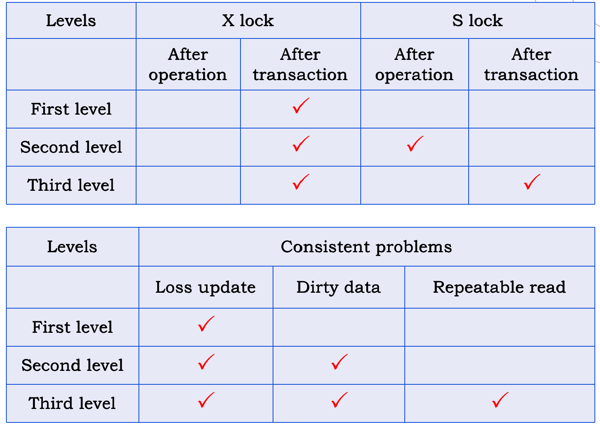
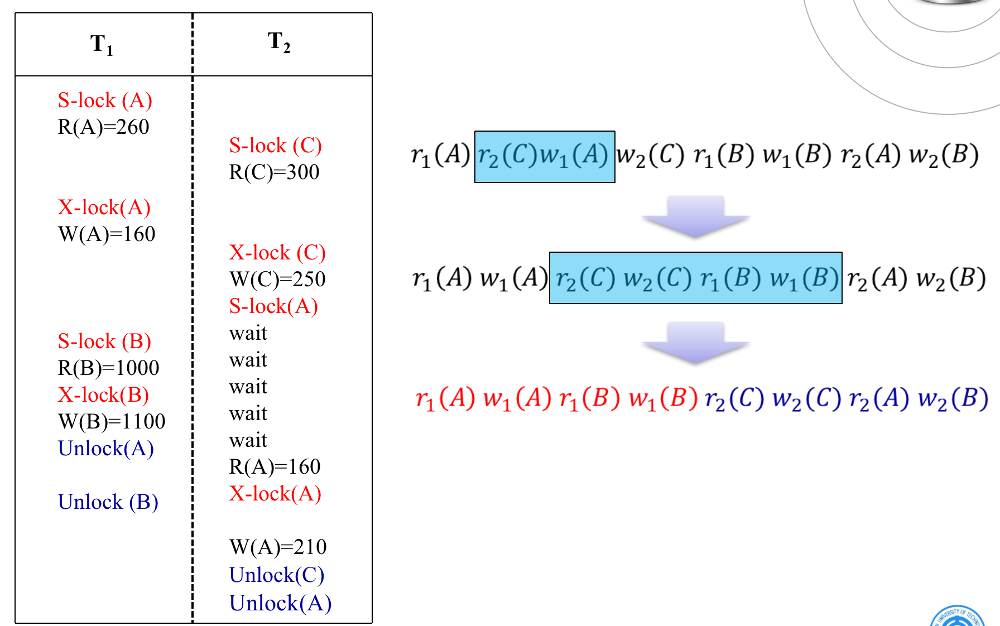
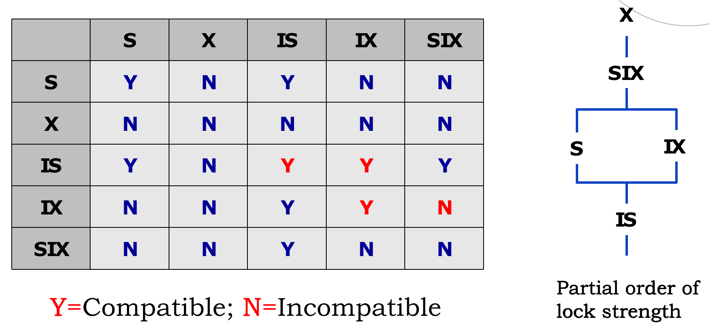

# 并发控制

[TOC]

事务并发执行可能会存取和存储不正确的数据，破坏事务的隔离 性和数据库的一致性。

## 挑战

并发操作的潜在不一致性：

- 丢失修改（lost update）：事务1与事务2从数据库中读入同 一数据并修改，事务2的提交结果破坏了事务1 提交的结果，导致事务1的修改被丢失。
- 读“脏”数据（dirty read）：事务1修改某一数据，并将其写回磁盘。事务2读取同 一数据后，事务1由于某种原因被撤消，这时事务1已 修改过的数据恢复原值，事务2读到的数据就与数据 库中的数据不一致，是不正确的数据，又称为“脏” 数据。
- 不可重复读（non-repeatable read）：事务1读取数据后，事务2执行更新操作并提交，使事务1无法再现前一次读取结果。包括三种如下，后两种不可重复读有时也称为幻影现象（phantom row）或者Phantom read (幻影读）：
  - 事务2对其做了修改，当事务1再次读该数据时，得到与前一次不同的值。
  - 事务2删除了部分记录，当事务1再次读取数据时， 发现某些记录神秘地消失了。
  - 事务2插入了一些记录，当事务1再次读取数据时，发现多了一些记录。

## 事务隔离级别

The levels from low to high are:

- Read uncommitted (未提交读）：可以读其他事务未提交但已经修改的数据，存在读“脏”数据问题等问题。
- Read committed (己提交读） ：可以读其他事务已经提交的数据，存在不可重复读问题。
- Repeatable read (可重复读）：某事务读取的数据不允许被其他事务修改。存在幻影读问题。
- Serializable (序列化)：就像串行执行事务。

四个层级都不允许多个事务同时修改数据，所以丢失修改问题在这四个层级都不会出现。

## 锁

锁类型：

- **S**hared lock (共享锁)，或者读锁。
- e**X**clusive lock (排它锁)，或者写锁。

协议类型：

- First level lock protocol (一级封锁协议)：没有读锁，写锁在修改数据前加，事务结束后释放。存在读“脏”数据问题等问题。
- Second level lock protocol (二级封锁协议）：读锁在读数据前加，读完释放。写锁在修改数据前加，事务结束后释放。存在不可重复读问题。
- Third level lock protocol (三级封锁协议）：读锁在读数据前加，事务结束后释放。写锁在修改数据前加，事务结束后释放。

数据库管理系统通常使用two-phase locking（两段锁）protocol，即一个事务可以看成两个阶段，第一个阶段只请求锁，第二个阶段只释放锁。

一次性封锁（下一部分提到）是两段锁协议的子集。

## 死锁

- Livelock(活锁）：数据库课程的活锁和操作系统的活锁不太一样，这里指的是优先级低导致的饥饿问题。可以通过**老化**解决。
- Deadlock (死锁）

处理死锁方法：

- deadlock prevention (死锁预防）：One-time block (一次性封锁）和Ordering block (顺序封锁）。
- deadlock detection and deadlock recovery scheme (死锁诊断与解除)：数据库的常用方法，如果等待图有环则出现死锁，选择回滚一个或多个事务来解除死锁。

## 并发调度

Serializability (可串行性) 是并发调度的唯一评价标准。即，两个并发的事务，如果并发结果与串行结果一样（T1T2，或者T2T1），则具有可串行性。

具体来说，对于事务i和j，如果通过等价转换能让i的所有操作移到一边，j在另一边，则说这个调度是conflict serializable schedule (冲突可串行化调度），那它一定也是有可串行性的。

等价转换的原则是，不能交换Conflict operations (冲突操作），例如：

- 对于同一个数据x，$R_i(x)$ and $W_j ( x )$ are conflict operations
- 对于同一个数据x，$W_i(x)$ and $W_j ( x )$ are conflict operations
- 对于不同数据的操作不冲突。

例子：

## 粒度

有时加锁时不必要对整个数据库加锁，只对行加锁就足够，这种程度的区别叫做粒度（granularity）。

Multiple granularity tree (多粒度树)表示这种粒度的差别：

扩展的锁类型：

- Intention-Shared (IS) Lock (意向共享锁）
- Intention-Exclusive (IX) Lock (意向排他锁）
- Shared and Intention-Exclusive (SIX) Lock (共享意向排他锁，S+IX）

这种**意向**指只有部分更细粒度的对象会被加显示锁（S和X）

如上图，左侧时兼容表，右侧是锁的严格等级。

几个例子：

- IS对IS，都是读，没事。
- IS对IX，读的部分和写的部分可能不重叠，没事。
- IX对IX，写的部分可能不重叠，没事。
- SIX对SIX，两者都要读所有部分，即使部分修改也一定会冲突，不兼容。

在加锁时：

- Ti must lock the root of the tree first in any mode
- Ti can lock a node in S or IS mode only if Ti currently has the parent of Q locked in IS mode.
- Ti can lock a node Q in X, SIX, or IX mode only if Ti currently has the parent of Q locked in either IX or SIX mode.

在释放锁时：

- Ti can lock a node only if Ti has not previously unlocked any node (that is, two phase locking).
- Ti can unlock a node Q only if Ti currently has none of the children of Q locked (that is , bottom-up order).
