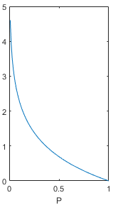
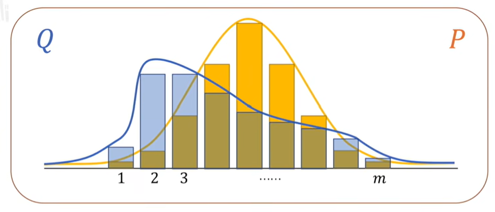
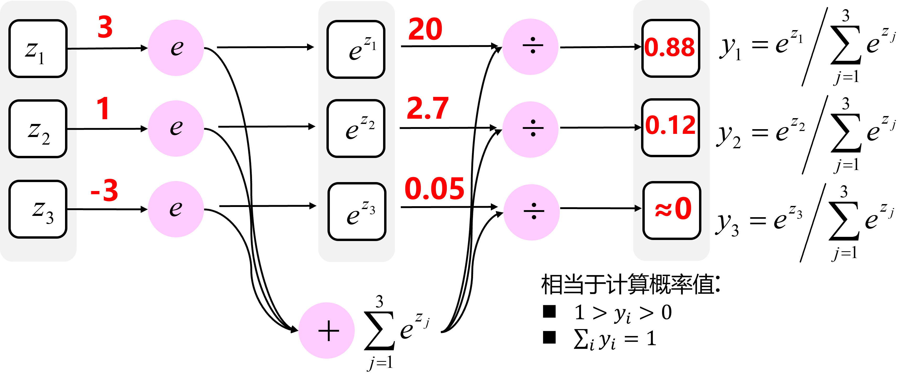

# 逻辑回归与损失函数

## 介绍

逻辑回归是一个用于二分类(**binary classification**)的算法。

> 这里有一个二分类问题的例子，假如你有一张图片作为输入，比如猫，如果识别这张图片为猫，则输出标签1作为结果；如果识别出不是猫，那么输出标签0作为结果。

**符号定义 ：**

- $$x$$ ：表示一个 $$n_x$$ 维数据，为输入数据，维度为 $$( n_x , 1 )$$ 的列向量
- $$y$$ ：表示输出结果，取值为 $$( 0 , 1 )$$
- $$\hat{y}$$ ：算法预测值，有时会用 $$a$$ 表示
- $$m$$ ：表示样本数目
- $$(x^{(i)},y^{(i)})$$ ：表示第 $$i$$ 组数据，可能是训练数据，也可能是测试数据，此处默认为训练数据
- $$X=[x^{(1)},x^{(2)},\dots,x^{(m)}]$$：表示所有的训练数据集的输入值，放在一个 $$n_x * m$$ 的矩阵中
- $$Y=[y^{(1)},y^{(2)},\dots,y^{(m)}]$$：对应表示所有训练数据集的输出值，维度为 $$1*m$$

## 目标

基本想法是让 $$\hat{y}=w^Tx+b$$ （参数 $$w$$ 为列向量），但是这对于二元分类问题来讲不是一个非常好的算法，对于概率来说 $$\hat{y} $$  应该在0到1之间，但是 $$w^Tx+b$$ 可能比1要大得多，或者甚至为一个负值。因此在逻辑回归中，$$\hat{y}$$ 应该是等于由上面得到的线性函数式子作为自变量的sigmoid函数中，公式如下面所示，将线性函数转换为非线性函数。
$$
\sigma(z)=\frac 1{1+e^{-z}}
$$

$$
z=w^Tx+b
$$

$$
\hat{y}=\sigma(z)=\sigma(w^Tx+b)
$$

此时，参数 $$w$$ 和参数 $$b$$ 是未知的，需要找到一种方法来找到参数 $$w$$ 和参数 $$b$$ 

## 损失函数

损失函数又叫做误差函数，用来衡量预测输出值和实际值有多接近。平方差就是一个不错的损失函数，但是在逻辑回归模型中会定义另外一个损失函数：
$$
L(\hat{y},y)=-y\log(\hat{y})-(1-y)\log(1-\hat{y})
$$

可以从极大似然估计理解，不过公式是拼凑出来的，不是自然的过程。自然的推导过程可以看一看最后补充的从交叉熵理解损失函数。

- 已知分布，求一件事发生的可能性，叫求概率
- 已知一系列结果，求一个分布让这些结果发生的可能性，叫求似然

> 假设一个袋子符合两种分布中的一种：十个苹果和一个梨；或者十个梨和一个苹果。已知三次取出又放回的实验结果都是苹果，那么十个苹果和一个梨的分布更合理。

## 代价函数

为了训练逻辑回归模型的参数 $$w$$ 和参数 $$b$$，我们需要一个代价函数，通过训练代价函数来得到参数 $$w$$ 和参数 $$b$$。**损失函数只适用于单个训练样本，而代价函数是参数的总代价**。
$$
J(w,b)=\frac1m\sum_{i=1}^mL(\hat{y}^{(i)},y^{(i)})
$$
所以在训练逻辑回归模型时候，目标是需要找到合适的参数 $$w$$ 和参数 $$b$$ ，来让代价函数 $$J(w,b)$$ 的总代价降到最低。

## 梯度下降法

之前使用特殊的损失函数$$L(\hat{y},y)$$，是为了让代价函数 $$J(w,b)$$ 成为凸函数。整个梯度下降法的迭代过程就是不断地得到参数 $$w$$ 和参数 $$b$$ ，不断地向最小值点方向走。

> 凸函数的形状？一个碗。
> 
> 梯度下降法就像在碗的边缘，找到一个最大下降的方向降到碗底。

随机梯度下降（Stochastic Gradient Descent，简称SGD）是基于梯度的一种优化算法，用于寻找损失函数最小化的参数配置。SGD通过计算每个样本的梯度来更新参数，并在每次更新中随机选择一个或一批样本。通过随机选择样本来计算梯度，**这使得它具有一定的随机性，有助于避免陷入局部极小值。**

具体对参数 $$w$$ 和参数 $$b$$ 更新的公式如下，其中 $$:=$$ 代表更新，$$\alpha$$ 代表学习率，$$\partial$$ 代表求偏导。
$$
w := w- \alpha \frac{\partial J(w,b)}{\partial w}
$$

$$
b := b - \alpha \frac{\partial J(w,b)}{\partial b}
$$

## 从交叉熵理解损失函数

### 信息论基础

交叉熵是信息论中的概念，想要理解交叉熵，首先需要了解一些与之相关的信息论基础。

**信息量**

信息量的基本想法是：一个不太可能发生的事件居然发生了，我们收到的信息要多于一个非常可能发生的事件发生。

用一个例子来理解一下，假设我们收到了以下两条消息：

A：今天早上太阳升起
B：今天早上有日食

我们认为消息A的信息量是如此之少，甚至于没有必要发送，而消息B的信息量就很丰富。利用这个例子，我们来细化一下信息量的基本想法：

1. 非常可能发生的事件信息量要比较少，在极端情况下，确保能够发生的事件应该没有信息量；
2. 不太可能发生的事件要具有更高的信息量。事件包含的**信息量应与其发生的概率负相关**。

假设$$X$$是一个离散型随机变量，它的取值集合为$$\left \{ x_{1}, x_{2},\cdots , x_{n} \right \}$$，定义事件$$X=x_i$$的信息量为：

$$
I(x_{i})=-\log P(X=x_{i})
$$

- 其中，log表示自然对数，如果底数为2，计算出来的单位就是比特。
- $$P$$为变量$$X$$取值为$$x_i$$的概率，这个概率值应该落在0到1之间。

画出上面函数在P为0-1时的取值，图像如下。在概率值P趋向于0时，信息量趋向于正无穷，在概率值趋向P于1时，信息量趋向于0，这个函数能够满足信息量的基本想法，可以用来描述信息量。

**熵**

上面给出的信息量公式只能处理随机变量的取指定值时的信息量，我们可以用香农熵（简称熵）来对整个概率分布的平均信息量进行描述。具体方法为求上述**信息量函数关于概率分布P的期望**，这个期望值（即熵)为：

$$
H(X)=-\sum_{i=1}^{n}P(X=x_{i})\log P(X=x_{i})
$$

让我们计算几个例题来对熵有个更深的了解。

例题①：求随机变量X的熵，这个随机变量有8种可能的取值$$\left \{ x_{1}, x_{2},...,x_{8} \right \}$$，且每种取值发生的概率都是相等的，即：$$P(X=x_{1})=P(X=x_{2})=...=P(X=x_{8})=\frac{1}{8}$$

解：

$$
H(X)=-8\times \frac{1}{8}\log \frac{1}{8}=3
$$

例题②：还是例题①中的随机变量X，还是8种可能的取值，但是每种取值发生的概率并不是都相等，而是分别为：$$\{ \frac{1}{2}, \frac{1}{4}, \frac{1}{8}, \frac{1}{16}, \frac{1}{64}, \frac{1}{64},\frac{1}{64},\frac{1}{64} \}$$

解：

$$
H(X)=-\frac{1}{2}\log \frac{1}{2}-\frac{1}{4}\log \frac{1}{4}-\frac{1}{8}\log \frac{1}{8}-\frac{1}{16}\log \frac{1}{16}-\frac{1}{64}\log \frac{1}{64}-\frac{1}{64}\log \frac{1}{64}-\frac{1}{64}\log \frac{1}{64}-\frac{1}{64}\log \frac{1}{64}=2
$$

由例题①和例题②可以佐证《深度学习花书》中的一句结论：那些接近确定性的分布（输出几乎可以确定）具有较低的熵，那些**接近均匀分布的概率分布具有较高的熵**（因为输出不确定）。

> 熵可以简单理解为系统的混乱程度，越混乱（每个事件都等可能），熵越大

**KL散度（相对熵）**

假设随机变量$$X$$的真实概率分布为$$P(X)$$，而我们在处理实际问题时使用了一个近似的分布$$Q(X)$$来进行建模。

如何考虑P与Q分布的差异？可以使用**相对熵**，或者叫**KL散度**（Kullback-Leibler Divergence)来计算。注意下面的公式中P在前，代表以P为基准，考虑P与Q分布的差异：
$$
\begin{aligned}
D_{KL}\left ( P\left | \right | Q\right ) &= \sum p_i \cdot (I_Q(x_i)-I_P(x_i))\\
&= \sum p_i \cdot((-\log q_i)-(-\log p_i)) \\
&= \sum p_i \cdot \log \frac{p_i}{q_i}
\end{aligned}
$$

- 其中，令$$I_Q(x_i)$$定义事件$$X=x_i$$在Q系统中的信息量
- 令$$I_P(x_i)$$定义事件$$X=x_i$$在P系统中的信息量
- $$p_i$$代表事件$$X=x_i$$在P系统中发生的概率
- $$q_i$$代表事件$$X=x_i$$在Q系统中发生的概率

介绍KL散度的两个性质：

- KL散度不是一个对称量，$$D_{KL}(P\left | \right |Q)\neq D_{KL}(Q\left | \right |P)$$
- KL散度的值始终$$\geqslant 0$$ （吉布斯不等式证明），当且仅当$$P(X)=Q(X)$$时等号成立，我们希望它接近于0，**KL散度本身就可以作为损失函数**

### 交叉熵

如果继续探究KL散度的式子代表什么：
$$
\begin{aligned}
D_{KL}\left ( P\left | \right | Q\right ) &= \sum p_i \cdot \log \frac{p_i}{q_i} \\
&= \sum p_i(-\log q_i) -\sum p_i(-\log p_i) \\
&= H(P,Q)-H(P)
\end{aligned}
$$
KL散度公式的左半部分就是交叉熵，右半是分布P的熵。

细心的小伙伴可能发现了，如果把P看作随机变量的真实分布的话，KL散度中P的熵其实是一个固定值，KL散度的大小变化其实是由交叉熵来决定的。

> 我们可以把近似分布$$Q$$看作网络或模型的实时输出，把KL散度或者交叉熵看做真实标签与网络预测结果的差异，所以神经网络的目的就是通过训练使近似分布$$Q$$逼近真实分布$$P$$。

从理论上讲，优化KL散度与优化交叉熵的效果应该是一样的。在深度学习中选择优化交叉熵而非KL散度的原因可能是为了减少一些计算量，交叉熵毕竟比KL散度少一项。

### 交叉熵损失函数

二分类任务，对于判断一张图片是不是猫，在人的眼中有1和0两种可能，记为y，令真实的概率分布为P，模型学习到的概率分布为Q，由于模型输出的意思为**是猫的概率为多少**，而我们计算时需要两个东西：**是猫的置信度**和**不是猫的置信度**，因此需要两项，$$p_i$$ 和 $$1-p_i$$
$$
H(P,Q)=-\sum(y_i \cdot \log p_i + (1-y_i) \cdot \log (1-p_i))
$$
这个式子我们很熟悉，交叉熵和极大似然估计法得出来的式子是一样的。可以作为损失函数。

但是，如果想要识别猫，狗和小鸡，把猫叫做类1，狗为类2，小鸡是类3，如果不属于以上任何一类，分到类0。怎么办？**多分类**的情况实际上就是对二分类的扩展，**主要记住这个公式**：

$$
L=-\sum_i^N \sum_{j}^M y_{ij} \log (f(x_{ij}))
$$

- 其中，N对应于样本数量，M为类别的数量
- y 取0 或 1 ，如果样本 i 的真实类别等于 j， 取 1 ，否则取 0。对于单分类任务，只有一个分类的标签非零
- $$f(x_{ij})$$ 表示的是样本i预测为j分类的概率

loss的大小完全取决于分类为正确标签那一类的概率，当所有的样本都分类正确时，loss=0，否则大于0。

## Softmax

softmax可以看作将MLP输出的数值（在代码中常被称为logits），转换为归一化的分类概率，更加直观，并且从概率上可以解释。
$$
q_i = \frac{\exp(z_i)}{\sum_{j = 1}^{K} \exp(z_j)}
$$

> 注意从技术上说“softmax损失（softmax loss）”是没有意义的，因为softmax只是一个压缩数值的函数。但是在这个说法常常被用来做简称。

“softmax”这个名字是怎么回事？此操作的“硬”版本称为 argmax，只需找到 最大值，将其设置为 1.0，并将 0.0 分配给所有其他值。相比之下，softmax 操作是它的“软”版本。由于 softmax 中涉及的幂，因此 强调最大值并将其推向 1.0，同时仍保持概率分布 在所有输入值上。这允许更细致入微的表示，不仅捕获最 可能的选择，以及其他选择的相对可能性。

在得到概率后，然后计算交叉熵损失函数：

$$
\begin{align*}
\text{Loss}&=-\sum_{i = 1}^{K} p_i \log q_i\\
p_i&=\begin{cases}
1, & \text{if } (i = y)\\
0, & \text{if } (i \neq y)
\end{cases}
\end{align*}
$$

训练神经网络时，最小化预测概率和标签真实概率之间的交叉熵，从而得到最优的预测概率分布。最优的预测概率分布是：

$$
Z_i=\begin{cases}
+\infty, & \text{if }(i = y)\\
0, & \text{if }(i\neq y)
\end{cases}
$$

