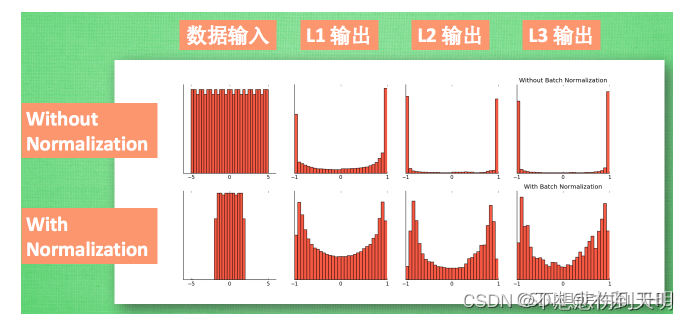
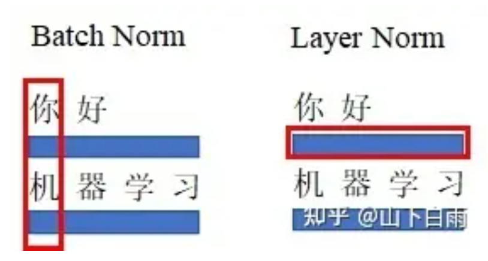
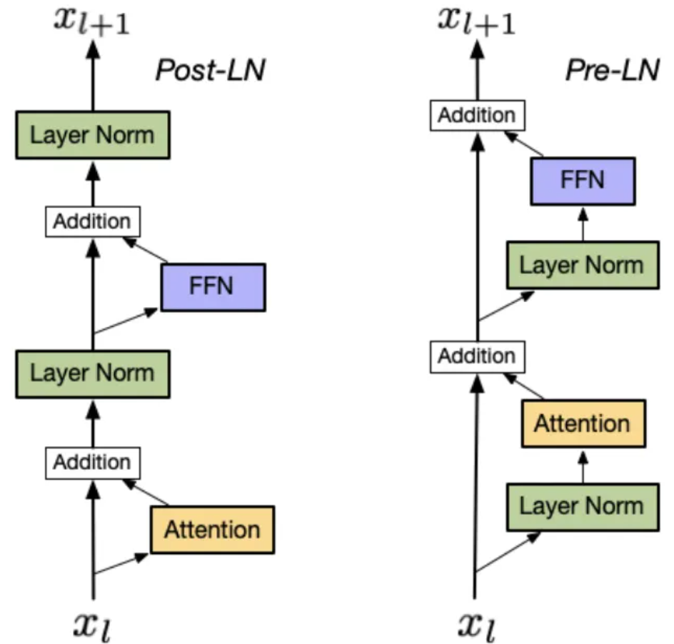
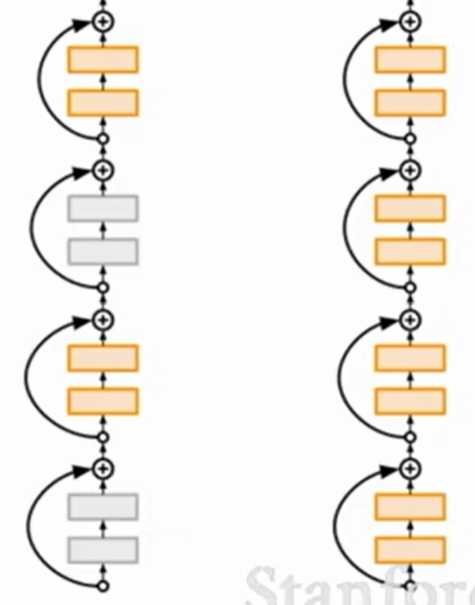
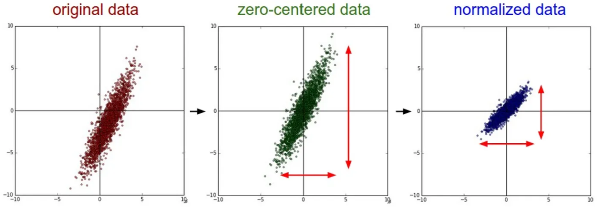
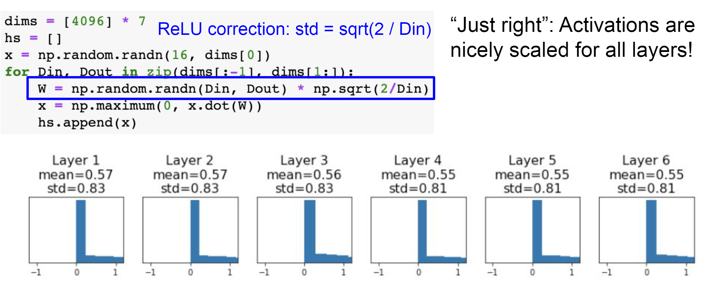
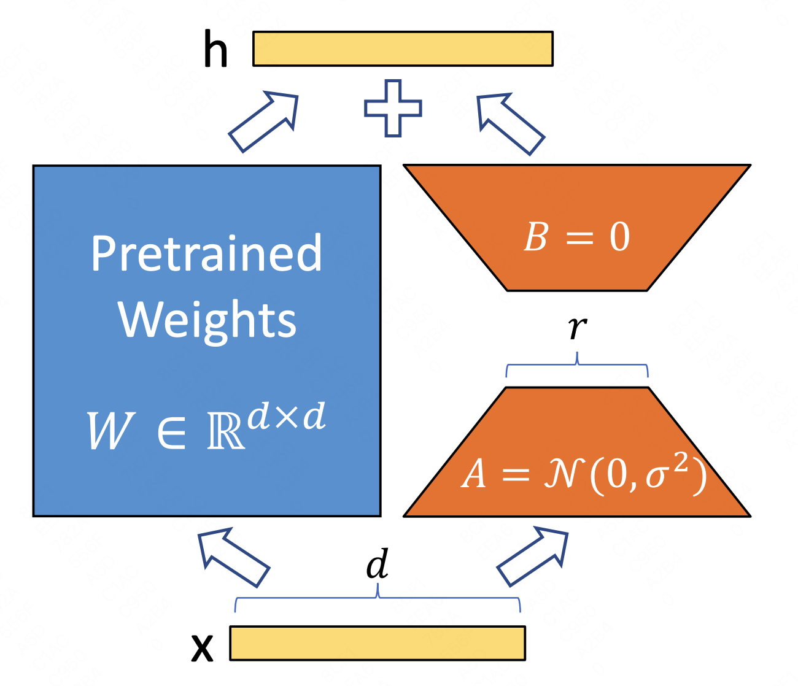

# 正则化、预处理、权重初始化

## 偏差与方差


-   对应最左边一幅图，如果给这个数据集拟合一条直线，但它并不能很好地拟合该数据，这是高偏差（**high bias**）的情况，称为“欠拟合”（**underfitting**）。特点是训练集误差与验证集误差都较大，且误差率相似。
-   对应最右边一幅图，如果拟合一个非常复杂的分类器，可能非常适用于**这个**数据集，但是也不是一种很好的拟合方式，分类器方差较高（**high variance**），数据过度拟合（**overfitting**）。特点是训练集误差较小，验证集误差较大。
-   对应中间一幅图，复杂程度适中，数据拟合适度的分类器，这个数据拟合看起来更加合理，我们称之为“适度拟合”（**just right**），是介于过度拟合和欠拟合中间的一类。特点是训练集误差与验证集误差都较小，且误差率相似。

##  正则化

深度学习可能存在过拟合问题——高方差，解决方法有：

1.   准备更多的数据。包括新数据和经过处理的旧数据（比如翻转，裁剪，扭曲的图片）。

     

2.   正则化（Regularization）。当获取更多数据变得困难时，正则化通常有助于避免过拟合或减少你的网络误差。

3.   实时记录代价函数$$J$$，在适当的时候提前结束训练。

     

### 权重衰减-$$L2$$正则化

在深度学习中，权重衰减（Weight Decay）是一种常用的正则化技术，旨在减少模型的过拟合现象。权重衰减通过向损失函数添加一个正则化项，以惩罚模型中较大的权重值：

$$
J(w,b)=\frac1m\sum_{i=1}^mL(\hat{y}^{(i)},y^{(i)})+\frac{\lambda }{2m}\sum_{l=1}^{L}{||W^{\left[l\right]}||}^{2}_{F}
$$
其中，$$W^{[l]}$$ 是第 $$l$$ 层的的参数，维度为 $$(n^{[l]},n^{[l-1]})$$ 。

$${||W^{[l]}||}^{2}_{F}$$ 被称作“弗罗贝尼乌斯范数”，用下标 $$F$$ 标注，定义为矩阵中所有元素的平方求和。

$$\lambda$$ 是正则化参数，通常使用验证集或交叉验证集来配置这个参数，尝试各种各样的数据，寻找最好的参数，要考虑训练集之间的权衡，把参数设置为较小值，这样可以避免过拟合，所以 $$\lambda$$ 是另外一个需要调整的超级参数。

>   Q：为什么只正则化参数$$w$$？为什么不再加上参数 $$b$$ 呢？
>
>   A：当然可以正则化参数$$b$$。因为参数$$w$$包含了绝大部分参数，所以只正则化参数$$w$$的效果就足够了，正则化参数$$b$$的效果不大。

**实现梯度下降**

>   复习一下，不加入正则化之前，$$d{{W}^{[l]}}$$ 的公式为：
>   $$
>   d{{W}^{[l]}}=\frac{1}{m}\text{}d{{Z}^{[l]}}\cdot {{A}^{\left[ l-1 \right]T}}
>   $$


加入正则化后，修改公式为：
$$
d{{W}^{[l]}}=\frac{1}{m}\text{}d{{Z}^{[l]}}\cdot {{A}^{\left[ l-1 \right]T}}+\frac{\lambda }{m}{W}^{[l]}
$$

$$
{W}^{[l]}:={W}^{[l]}-\alpha \cdot d{{W}^{[l]}}
$$

不论$$W^{[l]}$$是什么，我们都试图让它变得更小，因此$$L2$$正则化也被称为“权重衰减”。

>   Q：为什么正则化有利于预防过拟合呢？
>
>   A：如果正则化$$\lambda$$设置得足够大，权重矩阵$$W$$会变小到接近于0的值，直观理解就是把多隐藏单元的权重设为0，于是基本上消除了这些隐藏单元。换句话说，神经网络被大大简化了，小到如同一个逻辑回归单元，它会使这个网络从过度拟合的状态变为高偏差状态。再适当设置$$\lambda$$，使其“适度拟合”。
>
>   正则化可以提升其泛化能力，原因也在于没有哪个维度能够独自对于整体分值有过大的影响，鼓励分类器最终将所有维度上的特征都用起来。
>
>   举个例子，假设输入向量x=[1,1,1,1]，两个权重向量w1=[1,0,0,0]，w2=[0.25,0.25,0.25,0.25]。两个权重向量都得到同样的内积，但是w1的L2惩罚（平方相加）是1.0，而w2的L2惩罚是0.25。因此，根据L2惩罚来看，w2更好，因为它的正则化损失更小。

### 反向随机失活正则化

**思想：**


是对于全部样本的每一次训练，每次随机删除一些节点（将激活值置0），保留小网络进行训练。

**实现：**

用一个三层（$$l=3$$）网络来举例说明。实现在某一层中实施随机失活（**dropout**）。

1.   定义向量$$d$$，$$d^{[3]}$$表示网络第三层的随机失活向量。定义一个保留值**keep-prob**，它是一个具体数字，表示保留某个隐藏单元的概率。代码为：`d3 = np.random.rand(a3.shape[0],a3.shape[1]) < keep-prob`
2.   从第三层中获取激活值$$a^{[3]}$$，令$$a^{[3]}$$乘以$$d^{[3]}$$，代码为`a3 = np.multiply(a3,d3)`
3.   最后，向外扩展$$a^{[3]}$$，用它除以keep-prob参数，代码为`a3 /= keep-prob`

> 如果不实现第三步，为了保持训练集和测试集一致，在**predict**函数中不进行随机失活，但是对于隐层的输出要乘以`keep-prob`，调整其数值范围。

**解释：**

-   $$d^{[3]}$$则是一个布尔型数组，部分为 1，部分为 0，概率取决于定义的保留值keep-prob。
-   $$a^{[3]}$$乘以$$d^{[3]}$$之后，其中的部分激活值置零，或者说**失活。**
-   $$a^{[3]}$$的部分激活值置零，为了不影响期望值，需要等比例扩大剩余的值，所以除以keep-prob参数。
-   每层保留值keep-prob可以不同，如果某层 $$W^{[l]}$$ 参数集较大，为了预防矩阵的过拟合，它的keep-prob值应该相对较低。其他层的keep-prob可以接近于1。
-   除非算法过拟合，不然不要使用随机失活正则化。

>   Q：为什么随机失活会起作用呢？
>
>   A：因为单元的每个输入都可能随时被清除，所以结果不能依赖于任何一个特征，不能给任何一个输入加上太多权重。

> Dropout会使得Batch Normalization要用的统计量产生误差，因此Dropout直接在BN前面用会有问题

### Batch Normalization

思想是让激活数据在训练开始前通过一个网络，网络处理数据使其服从标准高斯分布。因为归一化是一个简单可求导的操作，所以上述思路是可行的。在实现层面，应用这个技巧通常意味着全连接层（或者是卷积层）与激活函数之间添加一个Batch Norm层。

```python
 self.head = nn.Sequential(
     nn.Linear(ebd_dim, fc_dim),
     nn.BatchNorm1d(fc_dim),
     nn.ReLU(),
     nn.Linear(fc_dim, args.embedding_dim),
 )
```

可以参考下面图片理解．使用了Normalization之后，它可以一直保持数据分布基本不变。Batch normalization就是对每个batch做处理。



> 举个例子：比如一个彩色Image的大小是32*32大小，我们一个batch有8个Images, channel是３(即RGB三个通道)，tensor 的shape 就是:(8,3,32,32). 对这样的tensor数据进行normalization。
>
> 其实就是分别对image的R通道,G通道,B通道分别做normalization


### LLM常用的 Normalization

目前流行的主要有两种：**LayerNorm** 和 **RMSNorm**。如果硬要再细分的话，可以根据 Norm 的位置分为 Pre-LayerNorm, Post-LayerNorm, Pre-RMSNorm, Post-RMSNorm.

我们知道 Transformer 中使用的是 layer norm。为什么？时序数据中 样本长度可能不一样。BatchNorm需要补0，LayerNorm不需要， LayerNorm 更稳定，不管样本长还是短，均值和方差是在每个样本内计算。



**研究人员从 LayerNorm 开始，为了提升训练效率也是拼了，一步一步简化成了 RMSNorm 的模样**。

具体来说，Norm的通用公式如下：
$$
\text{Norm}(x)=\frac{x-\mu}{\sigma} \cdot \gamma +\beta
$$
Batch Norm 和 LayerNorm 都可以表示成上面的样子，只不过计算的维度不同。

RMSNorm 的作者认为，让数据和梯度变成0是否是必要的？作者把 LayerNorm 中的 $$\mu$$ 和 $$\beta$$ 去掉(也可以认为是这两个值变为0)，就得到了 RMSNorm.
$$
\text{RMSNorm}(x)=\frac{x}{\text{rms}(x)} \cdot \gamma
$$

$$
\text{rms}(x)=\sqrt{\frac{1}{N}\sum_{i=1}^N x_i^2 +\epsilon}
$$

然后通过实验证明了这样做效果不仅没有下降，计算效率还提升了不少。还能再优化么？优化的方向其实也比较明确：

1. 计算更快
2. 能让梯度的方差变小。

### Pre Norm 和 Post Norm

**在原始的 Transformers 论文中，使用的是 Post Norm**。每一层的输入先与 Attention 相加，然后才计算 Layer Norm。早期的很多模型都用的是 Post Norm，比如著名的 Bert。

Post Norm 之所以这么设计，是把 Normalization 放在一个模块的最后，这样下一个模块接收到的总是归一化后的结果。这比较符合 Normalization 的初衷，就是为了降低梯度的方差。

如果层数较低还好，如果像是现在的大模型一样堆叠32层，我们熟悉的 ResNet 结构 $$output=X+g(X)$$ 的第一项就可以忽略不计了。具体证明见[网页](https://mp.weixin.qq.com/s?__biz=MzUyOTA5OTcwMg==&mid=2247485966&idx=1&sn=ad8dd077c7cf981f8979df0adf4434f6&chksm=fb5eee6928c9850ea5e4fb054aa7bd2c7efb4de79dc189f8e2fac64e04256bd12accf5242c68&scene=126&sessionid=1723260425&subscene=7&clicktime=1723276677&enterid=1723276677&key=daf9bdc5abc4e8d0d1fb98ad920060fc73d85b34b5a1791aac21c967813bdc41605973d12371fdea4adb73ccf5ec2b3c6e0536528dd08e96a71191401457f5cadb6f4a8d8c996580f6e005e0f1a589a9a3c1b04acd5cc9a3fd547a4ac3fbf83c11c73eac9bb31caaaa97e21ddf207a4bb6de4e1690398a5c5e6bb1b8a3338722&ascene=0&uin=NjIzODI5NjE1&devicetype=Windows+11+x64&version=63090b19&lang=zh_CN&countrycode=CN&exportkey=n_ChQIAhIQhUUVMTwhcnHSMwmEY3fkqBLmAQIE97dBBAEAAAAAAOPONRA2%2FnAAAAAOpnltbLcz9gKNyK89dVj0UZ5GnzKr8B9Bej5FXcOXl2xcEXD9pxQbT5HhQ5xukGSRiRiZ6pjdjmmt1EJ9BalHqmJWVVTRe6vbWn8%2F11OLg8pul8%2FzaDnK8VtRXH4jw82XrlRvpAaFS8qNBHGOxwqB0avRWcN4ATqDyYaeIK45pQ4JBP4BrPWptr6HdnDh%2BoG8b%2F%2Bs6aDN3Cp8eCn98X%2B7TqQWiFyHj9y2dZRNebJo80G9paK8KRCXMfJxGlHqVA%2FIWuzu9lKG0SDZ4G4SWjMz&acctmode=0&pass_ticket=VH%2B%2FPrjzPRs37gIIbYuV8ypU%2B%2BX6ROcjd5ukB3A8E1pk%2BXmUfP4DufPxCmxX1sIN&wx_header=1)

没了 ResNet 的架构，就导致 Transforemrs 在训练的时候，需要小心翼翼。都要加一个 learning rate warm up 的过程，先让模型在小学习率上适应一段时间，然后再正常训练。**warm up 的过程虽然在 Transformers 的论文里就提了一嘴，但是真正训练的时候会发现真的很重要。**

如果将 Layer Norm 的位置改了一下，变成了 Pre Norm。从实验结果发现，Pre Norm 基本上可以不用 warm up。




总结来看，Pre Norm 的训练更快，且更加稳定，所以之后的模型架构大多都是 Pre Norm 了，比如 GPT，MPT，Falcon，llama 等。

### 其他不常用但启发思考的做法

随机最大池化：


随机深度：



## 数据预处理

### 归一化

训练神经网络，其中一个加速训练的方法就是归一化输入，它的思想是统一每个输入特征的平均值和方差。

**实现：**

用一个具有两个输入特征的例子来说明，因为两个输入特征可以画到平面图上。



一开始的分布如最左边的图，两个输入特征的均值都不为0，并且方差不统一。

第一步是零均值化，公式为：
$$
\mu = \frac{1}{m}\sum_{i =1}^{m}x^{(i)}
$$

$$
x^{(i)}:=x^{(i)}-\mu
$$

这样，每个输入特征的平均值都为0，如中间那幅图。

第二步是归一化方差，公式为：
$$
\sigma^{2}= \frac{1}{m}\sum_{i =1}^{m}{({x^{(i)})}^{2}}
$$

$$
x^{(i)}:=x^{(i)}/\sigma^{2}
$$

这样，每个输入特征的方差都为1，如最右边那幅图。

>   Q：我们为什么要归一化输入特征呢？
>
>   A：
>
>   如图，在归一化输入特征之前，代价函数是非常细长狭窄的，按照梯度下降是曲折困难的，如果归一化特征，代价函数更对称，不论从哪个位置开始，梯度下降法都能够更直接地找到最小值。

```python
np_list = np.array([2,4,6,8])
processed_list = (np_list - np.mean(np_list)) / np.std(np_list)
print(processed_list)  # [-1.34164079 -0.4472136   0.4472136   1.34164079]
```

这段代码是对一个列表进行了标准化处理，即减去均值然后除以标准差。这是一种常见的数据预处理方法，可以使得数据的均值为0，标准差为1。

然而，**这并不意味着处理后的数据一定会落在-1到1之间。**标准化处理后的数据会落在一个范围内，这个范围取决于原始数据的分布。如果原始数据是正态分布，那么大约68%的数据会落在-1到1之间，95%的数据会落在-2到2之间，99.7%的数据会落在-3到3之间。这是因为在正态分布中，大约68%的数据在均值的一个标准差范围内，95%的数据在均值的两个标准差范围内，99.7%的数据在均值的三个标准差范围内。

### PCA

```python
# 假设输入数据矩阵X的尺寸为[N x D]
X -= np.mean(X, axis = 0) # 对数据进行零中心化(重要)
cov = np.dot(X.T, X) / X.shape[0] # 得到数据的协方差矩阵
```

数据协方差矩阵的第(i, j)个元素是数据第i个和第j个维度的协方差。具体来说，该矩阵的对角线上的元素是方差。还有，协方差矩阵是对称和半正定的。我们可以对数据协方差矩阵进行SVD（奇异值分解）运算。

```python
U,S,V = np.linalg.svd(cov)
```

U的列是特征向量，S是装有奇异值的1维数组（因为cov是对称且半正定的，所以S中元素是特征值的平方）。为了去除数据相关性，将已经零中心化处理过的原始数据投影到特征基准上：

```python
Xrot = np.dot(X,U) # 对数据去相关性
```

注意U的列是标准正交向量的集合（范式为1，列之间标准正交），所以可以把它们看做标准正交基向量。因此，投影对应x中的数据的一个旋转，旋转产生的结果就是新的特征向量。如果计算Xrot的协方差矩阵，将会看到它是对角对称的。np.linalg.svd的一个良好性质是在它的返回值U中，特征向量是按照特征值的大小排列的。

我们可以利用这个性质来对数据降维，只要使用前面的小部分特征向量，丢弃掉那些包含的数据没有方差的维度。 这个操作也被称为**主成分分析（ Principal Component Analysis 简称PCA）降维**：

```python
Xrot_reduced = np.dot(X, U[:,:100]) # Xrot_reduced 变成 [N x 100]
```

经过上面的操作，将原始的数据集的大小由[N x D]降到了[N x 100]，留下了数据中包含最大方差的100个维度。通常使用PCA降维过的数据训练线性分类器和神经网络会达到非常好的性能效果，同时还能节省时间和存储器空间。

### 白化

白化操作的输入是特征基准上的数据，然后对每个维度除以其**特征值**来对数值范围进行归一化。该变换的几何解释是：如果数据服从多变量的高斯分布，那么经过白化后，数据的分布将会是一个均值为零，且协方差相等的矩阵。该操作的代码如下：

```python
# 除以特征值 
Xwhite = Xrot / np.sqrt(S + 1e-5)
```

> 注意分母中添加了1e-5（或一个更小的常量）来防止分母为0。该变换的一个缺陷是在变换的过程中可能会夸大数据中的噪声，这是因为它将所有维度都拉伸到相同的数值范围，这些维度中也包含了那些只有极少差异性(方差小)而大多是噪声的维度。在实际操作中，这个问题可以用更强的平滑来解决（例如：采用比1e-5更大的值）。


**左边**是二维的原始数据。**中间**：经过PCA操作的数据。可以看出数据首先是零中心的，然后变换到了数据协方差矩阵的基准轴上。这样就对数据进行了解相关（协方差矩阵变成对角阵）。**右边**：每个维度都被特征值调整数值范围，将数据协方差矩阵变为单位矩阵。从几何上看，就是对数据在各个方向上拉伸压缩，使之变成服从高斯分布的一个数据点分布。

## 梯度消失/梯度爆炸

------

梯度消失/梯度爆炸（Vanishing / Exploding gradients），也就是训练神经网络的时候，导数或坡度有时会变得非常大，或者非常小，甚至于以指数方式变大变小，这加大了训练的难度。

**原因**

假设你正在训练这样一个极深的神经网络，$$\hat{y}$$ 正比于 $$ W^{[l]}W^{[L -1]}W^{[L - 2]}\ldots W^{[3]}W^{[2]}W^{[1]}x$$。

假设每个权重矩阵$$W^{[l]} = \begin{bmatrix} 1.5 & 0 \\0 & 1.5 \\\end{bmatrix}$$，那么 $$\hat{y}$$ 的值也会非常大，实际上它呈指数级增长的，它增长的比率是$${1.5}^{L}$$，因此对于一个深度神经网络，$$\hat{y}$$ 的值将爆炸式增长。

相反的，如果权重是0.5，$$W^{[l]} = \begin{bmatrix} 0.5& 0 \\ 0 & 0.5 \\ \end{bmatrix}$$，激活函数的值将以指数级下降。

**解决方法**

**合理初始化权重**有助于训练出一个权重或梯度不会增长或消失过快的深度网络。虽然不能彻底解决问题，却很有用。

使用一个神经元来说明。$$z = w_{1}x_{1} + w_{2}x_{2} + \ldots +w_{n}x_{n}$$，当$$n$$越大，为了控制$$z$$，希望$$w_{i}$$越小。初始化权重的公式不是唯一的，比较常见的实现有：
$$
W^{[l]} = np.random.randn( \text{shape})*\text{np.}\text{sqrt}(\frac{1}{n^{[l-1]}})
$$

$$
W^{[l]} = np.random.randn( \text{shape})*\text{np.}\text{sqrt}(\frac{2}{n^{[l-1]}})
$$

$$
W^{[l]} = np.random.randn( \text{shape})*\text{np.}\text{sqrt}(\frac{2}{n^{[l-1]} + n^{\left[l\right]}})
$$

其中， $$n^{[l - 1]}$$ 是第$$l-1$$层神经元数量。第一个公式更适用于**tanh**激活函数。第二个公式更适用于**Relu**激活函数。

最后一个公式也叫Xavier初始化

## 梯度检验

**思想**

梯度检验是一个 debug 方法，可以使用这个方法来检验反向传播是否得以正确实施，具体来讲，验证导数是否正确。

**实现**

定义向量$$\theta$$，它是所有参数转换成的一个巨大的向量数据，具体来说是把所有参数 $$W$$ 和 $$b$$ 转换成向量之后，做连接运算得到的。

类似定义$$d\theta$$，它是所有参数$${dW}^{[l]}$$和$${db}^{[l]}$$转换成的新向量，维度与 $$\theta$$ 相同。

计算 $$d\theta\left[i \right]$$ 与估计值 $$d\theta_{\text{approx}}\left[i \right]$$，根据导数的定义，可得：
$$
d\theta_{\text{approx}}\left[i \right] = \frac{J\left( \theta_{1},\theta_{2},\ldots\theta_{i} + \varepsilon,\ldots \right) - J\left( \theta_{1},\theta_{2},\ldots\theta_{i} - \varepsilon,\ldots \right)}{2\varepsilon}
$$

$$
d\theta\left[i \right]=\frac{\partial J}{\partial\theta_{i}}
$$

$$d\theta\left[i \right]$$ 与估计值 $$d\theta_{\text{approx}}\left[i \right]$$ 应该相近，如何定义两个向量是否真的接近彼此？具体来说做下列运算：
$$
difference=\frac{{||d\theta_{\text{approx}} -d\theta||}_{2}}{||d\theta_{\text{approx}}||_{2}+||d\theta||_{2}}
$$
其中，$$||\dots||_2$$ 表示欧几里得范数，或者向量长度。

-   如果值为$$10^{-7}$$或更小，这就很好，这就意味着导数逼近很有可能是正确的，它的值非常小。
-   如果值在$$10^{-5}$$范围内，小心，也许这个值没问题，建议再次检查这个向量的所有项，确保没有一项误差过大，可能这里有bug。
-   如果结果是$$10^{-3}$$或更大，应该仔细检查所有$$\theta$$项，追踪一些求导计算是否正确。

**实用技巧和注意事项**

-   不要在训练中使用梯度检验，它只用于调试，因为它会使算法变慢。
-   如果算法的梯度检验失败，要检查所有项，检查每一项，并试着找出bug。
-   在实施梯度检验时，如果使用正则化，请注意不要漏掉正则项。
-   梯度检验不能与随机失活同时使用，因为其中的部分激活值会被置零。
-   在$$w$$和$$b$$接近0时，梯度下降的实施不容易发现错误，但是当$$W$$和$$b$$变大时，它会变得越来越不准确。如果随机初始化值比较小，反复训练网络之后，再重新运行梯度检验。

## 权重初始化

**错误：全零初始化。**把这些权重的初始值都设为0这个做法错误的！因为如果网络中的每个神经元都计算出同样的输出，然后它们就会在反向传播中计算出同样的梯度，从而进行同样的参数更新。换句话说，如果权重被初始化为同样的值，所有神经元就会做相同的事，神经元之间就失去了不对称性的源头。

**小随机数初始化。**因此，权重初始值要非常接近0又不能等于0。解决方法就是将权重初始化为很小的数值，以此来*打破对称性*。其思路是：如果神经元刚开始的时候是随机且不相等的，那么它们将计算出不同的更新，并将自身变成整个网络的不同部分。

```python
W = 0.01 * np.random.randn(D,H)
```

> 并不是小数值一定会得到好的结果。例如，一个神经网络的层中的权重值很小，那么在反向传播的时候就会计算出非常小的梯度（因为梯度与权重值是成比例的）。这就会很大程度上减小反向传播中的“梯度信号”，在深度网络中，就会出现问题。

然而，在一个朴素的网络中，随着层数变深，激活值会逐渐变为0，不再学习。6层激活值（假设用tanh激活函数）分布如下：


如果我们放大初始化参数：

```python
W = 0.05 * np.random.randn(D,H)
```

所有的激活值都会饱和（假设用tanh激活函数），不再学习：


**使用1/sqrt(n)校准方差**。上面做法存在一个问题，随着输入数据量的增长，随机初始化的神经元的输出数据的分布中的方差也在增大。我们可以除以输入数据量的平方根来调整其数值范围，这样神经元输出的方差就归一化到1了。也就是说，建议将神经元的权重向量初始化为：其中**n**是输入数据的数量。这样就保证了网络中所有神经元起始时有近似同样的输出分布。实践经验证明，这样做可以提高收敛的速度。

```python
w = np.random.randn(n) / sqrt(n)
```

以及，梯度消失/梯度爆炸一节提到的其他两个公式。我们希望初始化后，激活值分布如下：


如果我们用ReLU激活函数呢？激活值又大多变0了：


换一种初始化方式： Kaiming / MSRA Initialization



LoRA初始化权重方法：如图，B全为0，A为正态分布


