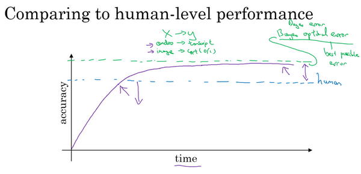
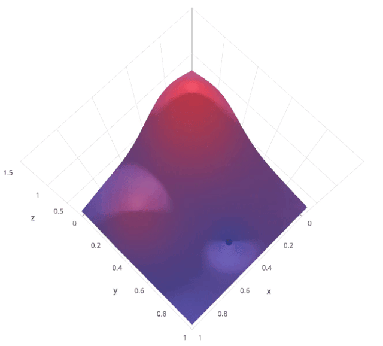
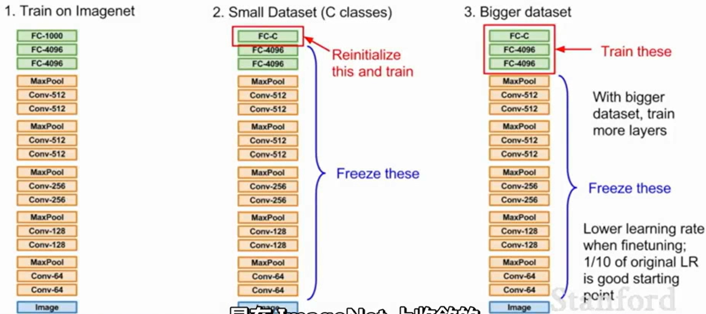
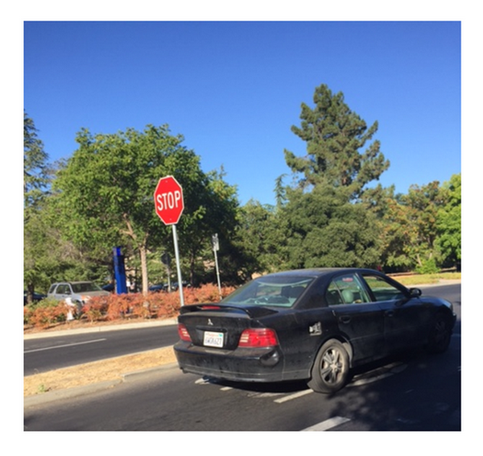

# 机器学习策略

在尝试优化一个深度学习系统时，通常可以有很多想法可以去试，问题在于，如果做出了错误的选择，完全有可能白费6个月的时间，往错误的方向前进，在6个月之后才意识到这方法根本不管用。

机器学习策略，是搭建和部署大量深度学习产品时学到的经验和教训，一些分析机器学习问题的方法，可以指引朝着最有希望的方向前进。

## 训练，验证，测试集的比例

通常会将数据划分成几部分：

-   一部分作为训练集（train set），用于训练模型
-   一部分作为简单交叉验证集，有时也称之为验证集（dev set），用于评估这些模型
-   最后一部分则作为测试集（test sets），主要目的是正确评估（多种）分类器的性能

先用一个不恰当的比喻来说明3种数据集之间的关系：

- 训练集相当于上课学知识
- 验证集相当于课后的的练习题，用来纠正和强化学到的知识
- 测试集相当于期末考试，用来最终评估学习效果

**训练集（Training Dataset）是用来训练模型使用的。**

当我们的模型训练好之后，我们并不知道他的表现如何。这个时候就可以使用验证集（Validation Dataset）来看看模型在新数据（验证集和测试集是不同的数据）上的表现如何。**同时通过调整超参数，让模型处于最好的状态**。

验证集有2个主要的作用：

1. 评估模型效果，为了调整超参数而服务
2. 调整超参数，使得模型在验证集上的效果最好

当我们调好超参数后，就要开始「最终考试」了。**我们通过测试集（Test Dataset）来做最终的评估。**通过测试集的评估，我们会得到一些最终的评估指标，例如：准确率、精确率、召回率、F1等。

不可以用测试集来调参！

**如果有10000条数据**

- 常见做法是70%训练集，30%测试集。
- 如果明确设置了验证集，也可以按照60%训练集，20%验证集和20%测试集来划分。

**如果有100万条数据**

- 测试集的主要目的是正确评估分类器的性能，所以，如果拥有百万数据，我们只需要1000条数据，便足以评估单个分类器，并且准确评估该分类器的性能。
- 假设我们有100万条数据，其中1万条作为验证集，1万条作为测试集，即：训练集占98%，验证集和测试集各占1%。
- 对于数据量过百万的应用，训练集可以占到99.5%，验证和测试集各占0.25%，或者验证集占0.4%，测试集占0.1%。

**补充**

-   建议确保验证集和测试集的数据来自同一分布（数据格式与质量相似）。
-   就算没有测试集也不要紧，测试集的目的是对最终所选定的神经网络系统做出无偏估计，如果不需要无偏估计，也可以不设置测试集。

## 正交化

搭建建立机器学习系统的挑战之一是，可以尝试和改变的东西太多了，而我们希望改变一个细节带来的影响是单一的。这就是正交化的思想。

>   比如，我们不希望改善测试集准确率的同时会降低训练集的准确率。

具体说，如果算法在成本函数上不能很好地拟合训练集，需要一个**旋钮**，这样用来确保可以调整算法，让它很好地拟合训练集，所以这个旋钮是你可能可以训练更大的网络，或者可以切换到更好的优化算法，比如**Adam**优化算法，等等。之后讨论。

相比之下，如果发现算法对开发集的拟合很差，那么应该有另外的独立的旋钮去调试。比如说，算法在训练集上做得很好，但开发集不行，有一组正则化的旋钮可以调节，尝试让系统满足第二个条件。增大训练集可以是另一个可用的旋钮，它可以帮助你的学习算法更好地归纳开发集的规律。

>   复习一下：机器学习中的工作流程是，尝试很多思路，用训练集训练不同的模型，然后使用开发集来评估不同的思路，然后选择一个，然后不断迭代去改善开发集的性能，直到最后可以得到一个满意的成本，然后再用测试集去评估，再做成应用产品。

如果系统在开发集上做的很好，但测试集上做得不好呢？如果是这样，那么需要调的旋钮，可能是更大的开发集。因为如果它在开发集上做的不错，但测试集不行，这可能意味着对开发集过拟合了，需要往回退一步，使用更大的开发集。

最后，如果它在测试集上做得很好，但无法给猫图片应用用户提供良好的体验，这意味着需要回去，改变开发集或成本函数。因为如果根据某个成本函数，系统在测试集上做的很好，但它无法反映你的算法在现实世界中的表现，这意味着要么开发集分布设置不正确，要么成本函数测量的指标不对。

## 利用人的表现

在很多机器学习任务中，当算法开始往人类水平努力时，进展是很快的。但是过了一段时间，进展和精确度的提升就变得更慢了。然而我们都希望能达到理论最佳性能水平。

先介绍一个概念，**贝叶斯最优错误率**一般认为是理论上可能达到的最优错误率，就是说没有任何办法设计出一个$$x$$到$$y$$的函数，让它能够超过一定的准确度。从定义上讲，贝叶斯最优错误率肯定比最优秀的人（一群人）的错误率更低。

事实证明，机器学习的进展往往相当快，直到算法超越人类的表现之前一直很快，当算法超越人类的表现时，有时进展会变慢，有两个原因：

1.   人类水平在很多任务中离贝叶斯最优错误率已经不远了，人们非常擅长看图像，分辨里面有没有猫或者听写音频。所以，当超越人类的表现之后也许没有太多的空间继续改善了。
2.   只要算法的表现比人类的表现更差，那么实际上可以使用某些工具来提高性能。一旦超越了人类的表现，这些工具就没那么好用了。

在算法超越人类的表现之前，可以利用人类的表现指导学习。如果人类错误率（近似贝叶斯最优错误率）与训练集错误率相差大，训练集错误率与开发集错误率相差小，在这种情况下，把重点应该放在减少偏差上。比如说：

-   比如使用规模更大的模型。
-   训练更久。
-   使用更好的优化算法，比如说加入**momentum**，**RMSprop**，**Adam**。
-   可以试试寻找更好的新神经网络架构，如循环神经网络和卷积神经网络。
-   改变激活函数，改变层数或者隐藏单位数。
-   可以试试寻找更好的超参数。

如果人类错误率（近似贝叶斯最优错误率）与训练集错误率相差小，训练集错误率与开发集错误率相差大，在这种情况下，应该专注减少方差，比如说：

-   收集更多数据，因为收集更多数据去训练可以帮你更好地推广到系统看不到的开发集数据。
-   可以尝试正则化，包括$$L2$$正则化，**dropout**正则化或者之前课程中提到的数据增强。
-   同时也可以试用不同的神经网络架构，超参数搜索。

## 错误分析

错误分析通过统计不同错误标记类型占总数的百分比，可以帮助发现哪些问题需要优先解决，或者为构思新优化方向的灵感。一般的流程如下：

1.   找一组错误样本。
2.   统计属于不同错误类型的错误数量。
3.   在这个过程中，可能会得到启发，归纳出新的错误类型。
4.   确定错误占比最多的类别，专注它进行优化。

>   假设正在调试猫分类器，在错误例子中，会有狗的照片、狮子，豹，猎豹的照片，模糊图像，或者**Instagram**滤镜或**Snapchat**滤镜图片。其中模糊图像问题最严重，那么应该先解决模糊图像处理的问题。

## 清除标注错误的数据

监督学习问题的数据由输入$$x$$和输出标签 $$y$$ 构成，如果发现有些输出标签 $$y$$ 是错的是否值得花时间去修正这些标签呢？

深度学习算法对随机误差很健壮，但对系统性的错误就没那么健壮了。所以比如说，如果做标记的人一直把白色的狗标记成猫，那就成问题了。因为分类器学习之后，会把所有白色的狗都分类为猫。但随机错误或近似随机错误，对于大多数深度学习算法来说不成问题。

建议是，如果这些标记错误严重影响了开发集上评估算法的能力，那么就应该去花时间修正错误的标签。但是，如果它们没有严重影响到开发集评估成本偏差的能力，那么可能就不应该花宝贵的时间去处理。类似上面提到的误差分析，统计错误占比最多的原因，优先对其优化。

现在如果决定要去修正开发集数据，手动重新检查标签，并尝试修正一些标签，这里还有一些额外的方针、原则和建议需要考虑：

-   修正手段要同时作用到开发集和测试集上，保持相同的分布。
-   要同时考虑检验算法判断正确和判断错误的样本。
-   修正训练集中的标签其实相对没那么重要，可能决定只修正开发集和测试集中的标签，这样其实是可以的。
-   在构造实际系统时，通常需要更多的人工错误分析，更多的人类见解来架构这些系统。
-   花时间亲自检查数据非常值得。（坐下来看100或几百个样本来统计错误数量）

## 快速搭建第一个系统，并进行迭代

一般来说，对于几乎所有的机器学习程序可能会有50个不同的方向可以前进，并且每个方向都是相对合理的可以改善系统。但挑战在于，如何选择一个方向集中精力处理。

所以建议，如果想搭建全新的机器学习程序，就是快速搭好第一个系统，然后开始迭代。

建立这个初始系统的所有意义在于，它可以是一个快速和粗糙的实现。初始系统的全部意义在于，有一个训练过的系统，确定偏差方差的范围，就可以知道下一步应该优先做什么，让能够进行错误分析，可以观察一些错误，然后想出所有能走的方向，哪些是实际上最有希望的方向。主要目标是弄出能用的系统，而不是发明全新的机器学习算法。

## 使用不同分布的数据进行训练和测试

在深度学习时代，越来越多的团队都用来自和开发集、测试集分布不同的数据来训练，让训练的数据量更大，里面有一些细节。

举个例子，假设你在开发一个手机应用，你想识别用户从应用中上传的图片是不是猫。你只收集到10,000张用户上传的照片，这些照片一般更业余，取景不太好，有些甚至很模糊。你从互联网上下载了超过20万张猫图，它们取景专业、高分辨率、拍摄专业。要用这些互联网图片吗？

显然这些互联网图片与用户上传的照片来自不同分布，互联网图片不是最好的选择。但是如果不用互联网图片，10,000张用户上传的照片太少了。

建议这样处理，训练集是来自网页下载的200,000张图片，如果需要的话，再加上5000张来自手机上传的图片。开发集就是2500张来自应用的图片，测试集也是2500张来自应用的图片。这样将数据分成训练集、开发集和测试集的好处在于，现在瞄准的目标就是想要处理的目标，开发集包含的数据全部来自手机上传，这是真正关心的图片分布。

## 数据分布不匹配时，偏差与方差的分析

>   复习一下，之前学习过：
>
>   -   当贝叶斯最优错误率与训练集错误率相差大，训练集错误率与开发集错误率相差小，在这种情况下，把重点应该放在减少偏差上。
>   -   当贝叶斯最优错误率与训练集错误率相差小，训练集错误率与开发集错误率相差大，在这种情况下，应该专注减少方差。

但如果训练数据和开发数据来自不同的分布，上面第二个结论不是完全正确的。

>   比如，也许算法在开发集上做得不错，可能因为训练集很容易识别，因为训练集都是高分辨率图片，很清晰的图像，但开发集要难以识别得多。所以也许软件没有方差问题，这只不过反映了开发集包含更难准确分类的图片。

为了弄清楚方差和数据分布不匹配哪个因素影响更大，需要定义一组新的数据，称之为训练-开发集。我们已经设立过这样的训练集、开发集和测试集，并且开发集和测试集来自相同的分布，但训练集来自不同的分布。我们随机打散训练集，然后分出一部分训练集作为训练-开发集，它只是为了进行误差分析，不要在它上面做训练。

-   假设训练误差为1%，训练-开发误差为1.5%，开发集错误率上升到10%。这是数据不匹配的问题。
-   假设训练误差是10%，训练-开发误差是11%，开发误差为12%，贝叶斯错误率的估计大概是0%，存在偏差问题。
-   假设训练误差是1%，训练-开发集上的误差是9%，开发集误差是10%，存在方差问题。
-   假设贝叶斯错误率是4%，训练错误率是7%，训练-开发错误率是10%。很意外，算法在开发集上做的更好，是6%。可能训练数据其实比开发集和测试集难识别得多。

## 处理数据不匹配问题

如果训练集来自和开发测试集不同的分布，而且错误分析显示有一个数据不匹配的问题，该怎么办？这个问题没有完全系统的解决方案，但我们可以看看一些可以尝试的事情。

-   亲自做错误分析，尝试了解训练集和开发测试集的具体差异。
-   当认识到具体差异时，可以模拟开发集，人工合成数据添加到训练集。

举个例子，如果你正在开发一个语音激活的后视镜应用，你可能要听一下来自开发集的样本，尝试弄清楚开发集和训练集到底有什么不同。你可能会发现很多开发集样本噪音很多，有很多汽车噪音，这是你的开发集和训练集差异之一。

那么可以模拟车辆噪声数据，假设你录制了大量清晰的不带噪音的音频，你也可以收集一段汽车噪音，如果你把两个音频片段放到一起，你就可以合成出车背景噪音中的效果。通过人工数据合成，你可以快速制造更多的训练数据。

然而人工数据合成有一个潜在问题。比如说，你在安静的背景里录得10,000小时音频数据，然后，你只录了一小时车辆背景噪音，将这1小时汽车噪音回放10,000次，并叠加到在安静的背景下录得的10,000小时数据。有一个风险，有可能你的学习算法对这1小时汽车噪音过拟合。建议是要模拟全部数据空间，保证数据全面，与真实环境相似。

## 超参数调优方法

在传统的调参过程中，我们通过训练算法**手动检查随机超参数集**，并选择符合我们目标的最佳参数集。**缺点**：没办法确保得到最佳的参数组合。这是一个不断试错的过程，所以，非常的耗时。

**网格搜索**是一种基本的超参数调优技术。它类似于手动调优，为网格中指定的所有给定超参数值的每个排列构建模型，评估并选择最佳模型。**缺点**： 由于它尝试了超参数的每一个组合，并根据交叉验证得分选择了最佳组合，这非常慢。

使用**随机搜索**代替网格搜索的动机是，在许多情况下，所有的超参数可能不是同等重要的。随机搜索从超参数空间中随机选择参数组合，参数由n_iter给定的固定迭代次数的情况下选择。实验证明，随机搜索的结果优于网格搜索。

**贝叶斯优化**属于一类优化算法，称为基于序列模型的优化(SMBO)算法。这些算法使用先前对损失**f**的观察结果，以确定下一个(最优)点来抽样**f**。该算法大致可以概括如下。

1. 使用先前评估的点X1*:n*，计算损失f的后验期望
2. 在新的点X的抽样损失f，从而最大化f的期望的某些方法。该方法指定f域的哪些区域最适于抽样
3. 重复这些步骤，直到满足某些收敛准则

## 解决显存不够的方法

1. 降低批量大小（Batch Size）减少每次训练过程中传递给模型的数据量。直接减少了每次迭代所需的显存。但是较小的批量可能影响模型的收敛速度和稳定性。
2. 模型剪枝（Model Pruning）去除模型中不重要的权重或神经元以减少模型的大小。
3. 混合精度训练（Mixed Precision Training）结合使用32位（float32）和16位（float16）精度的数据，减少显存使用并加速计算。
4. 分布式训练（Distributed Training）使用多个GPU或机器并行训练模型。更多参考查看大模型笔记

## 迁移学习

有的时候，神经网络可以从一个任务中习得知识，并将这些知识应用到另一个独立的任务中，这就是所谓的迁移学习。

>    例如，也许你已经训练好一个识别猫的神经网络，然后使用那些知识去训练阅读x射线扫描图的神经网络。

具体来说，要实现迁移学习，就是在之前训练好的基础上，把数据集换成新的$$(x,y)$$对，初始化最后一层的权重，称之为$$w^{[L]}$$和$$b^{[L]}$$随机初始化。

经验规则是，如果你有一个小数据集，就只训练输出层前的最后一层，或者最后一两层。但是如果有很多数据，那么可以重新训练网络中的所有参数。如果重新训练神经网络中的所有参数，那么这个在图像识别数据的初期训练阶段，有时称为预训练（**pre-training**）。然后，如果以后更新所有权重，这个过程叫微调（**fine tuning**）。

>   Q：为什么迁移学习有效果呢？
>
>   A：还是上面把识别猫的神经网络训练阅读x射线扫描图的例子。从非常大的图像识别数据库中习得这些能力（边缘检测、曲线检测）可能有助于学习算法在放射科诊断中做得更好，算法学到了很多结构信息，图像形状的信息，这些知识有可能帮助放射科诊断网络学习更快一些，或者需要更少的学习数据。

迁移学习什么时候是有意义的呢？这里是使用迁移学习的典型场景：

-   迁移来源问题（旧问题）中你有很多数据，但迁移目标问题（新问题）你没有那么多数据。
-   迁移来源问题和迁移目标问题有相同的输入。
-   迁移来源问题和迁移目标问题要解决的底层特征细节相同。

## 多任务学习

在迁移学习中，步骤是串行的（从任务$$A$$里学习然后迁移到任务$$B$$）。在多任务学习中，是同时开始学习的，试图让单个神经网络同时做几件事情，然后希望这里每个任务都能帮到其他所有任务。

举个例子，假设你在研发无人驾驶车辆，那么任务需要同时检测不同的物体，比如检测行人、车辆、停车标志，还有交通灯这四个物体。

如果这是输入图像$$x^{(i)}$$，那么这里不再是一个标签 $$y^{(i)}$$，而是有4个标签，在这个例子中$$y^{(i)}$$是个4×1向量，$$Y = \begin{bmatrix}
| & | & | & \ldots & | \\
y^{(1)} & y^{(2)} & y^{(3)} & \ldots & y^{(m)} \\
| & | & | & \ldots & | \\
\end{bmatrix}$$，要训练这个神经网络，需要改变最后的输出层结构，损失函数也要改变，公式为：
$$
J =\frac{1}{m}\sum_{i = 1}^{m}{\sum_{j = 1}^{4}{L(\hat y_{j}^{(i)},y_{j}^{(i)})}}
$$

$$
L(\hat y_{j}^{(i)},y_{j}^{(i)}) = - y_{j}^{(i)}\log\hat y_{j}^{(i)} - (1 - y_{j}^{(i)})log(1 - \hat y_{j}^{(i)})
$$

注意几个细节：

-   当然也可以训练四个不同的神经网络，而不是训练一个网络做四件事情。但神经网络一些早期特征，在识别不同物体时都会用到，然后你发现，训练一个神经网络做四件事情会比训练四个完全独立的神经网络分别做四件事性能要更好，这就是多任务学习的力量。
-   多任务学习也可以处理图像只有部分物体被标记的情况，标签不仅有0和1，还有问号表示未标记，也可以在上面训练算法，当有问号的时候，就在求和时忽略那个项。
-   在实践中，多任务学习的使用频率要低于迁移学习。但两者都可以成为强力工具。

多任务学习什么时候是有意义的呢？这里是使用多任务学习的典型场景：

-   训练的一组任务可以共用低层次特征。
-   其他任务加起来必须要有比单个任务大得多的数据量。
-   多任务学习会降低性能的唯一情况（和训练单个神经网络相比性能更低）就是神经网络还不够大。

## 端到端的深度学习

简而言之，以前有一些数据处理系统或者学习系统，它们需要多个阶段的处理。那么端到端深度学习就是忽略所有这些不同的阶段，用单个神经网络代替它。

>   以语音识别为例，传统上，语音识别需要很多阶段的处理：首先提取一些特征，一些手工设计的音频特征，找到音位，串在一起构成独立的词，然后将词串起来构成听写文本。
>
>   端到端深度学习做的是，训练一个巨大的神经网络，输入就是一段音频，直接输出听写文本。

事实证明，端到端深度学习的挑战之一是可能需要大量数据才能让系统表现良好，并且它排除了可能有用的手工设计组件。当数据集较小的时候，传统流水线方法其实效果也不错，通常做得更好。