# 注意力

## 句子翻译

我要对机器翻译做一些改进，称为注意力模型（**the Attention Model**）。人工翻译并不会记住整个法语句子再开始翻译，而是看一部分，翻译一部分，一点一点地翻译，因为记忆整个的长句子是非常困难的。**注意力模型如何让一个神经网络只注意到一部分的输入句子。当它在生成句子的时候，更像人类翻译**。以下为计算流程：

1.   我们使用一个**RNN**计算输入的法语，这一步没有输出，我们计算好每一个时间步$t$的状态 $h_t$

2.   我们定义 $e_{ij}$为翻译到第i个英文词时，与第j个法语词的关联有多大，这个生成e的函数可以用一个小神经网络来完成

3.   经过softmax，得到 $e_{ij}$的概率解释 $a_{ij}$

4.   现在我们来生成第i个英文词$y_i$，这是第二个RNN，每个时间步输入是上下文$C_i$

$$
C_i=\sum_{j=1}^T a_{ij} h_i
$$

例如，e可以如下图计算：

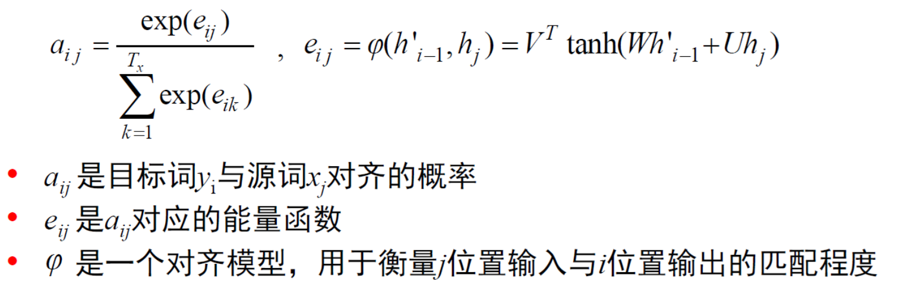

然后，我们计算上下文C

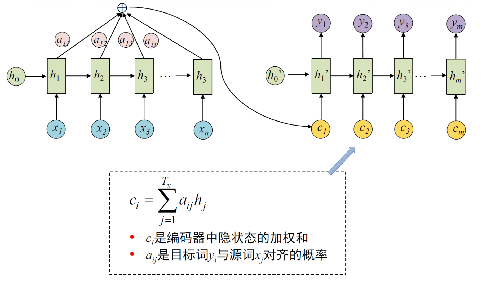

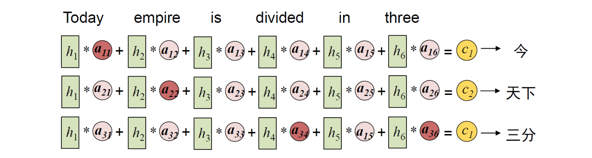

换一种图示看看能不能看懂！展示了英语转西班牙语的句子翻译中生成第一个词的例子：

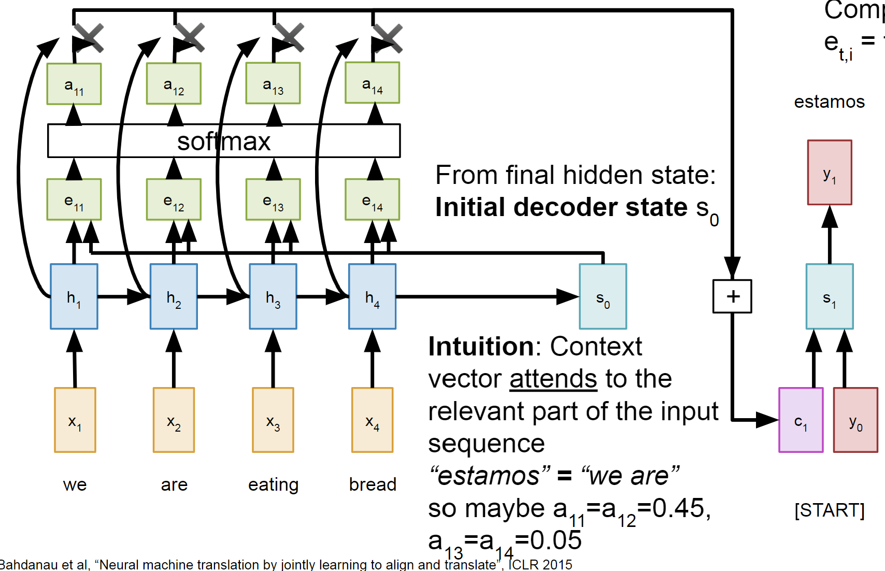

注意力机制运用在机器翻译中，<源语言词，目标语言词>的注意力权重基本与两个词互为翻译的情况一致。下图展示了注意力矩阵，抓住了不同语言中的词序。

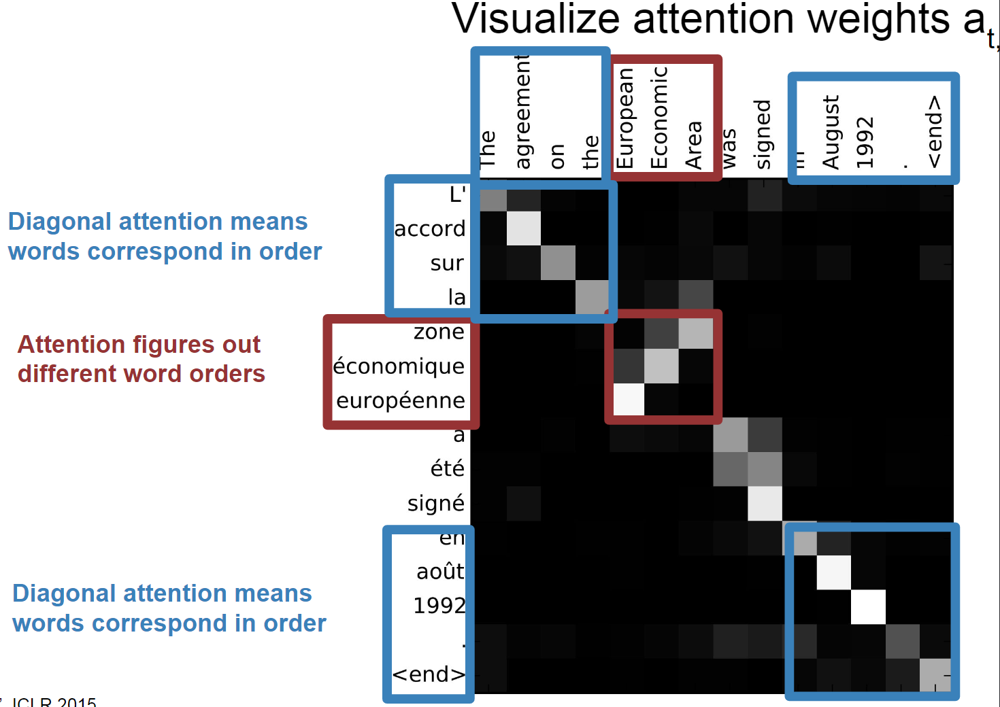

> 注意力机制运用在机器阅读中，给文章中每句话一个attention权重，根据问题选出最有可能包含答案的句子

## 直观理解

注意力函数将 query 和 key-value 对映射成输出 output 。具体来说，output 是 value 的一个加权和，权重等价于 query 和对应的 key 的相似度 ，输出的维度与 value 的维度相同。

即使 key-value 并没有变，但是随着 query 的改变，因为权重的分配不一样，导致输出会有不一样，这就是注意力机制。

> Transfomer 首先将 token 映射成向量，这种多维向量本身带有信息，但还没有综合上下文信息。注意力机制可以看作让每个 token 都能够关注到其他 token 的信息，从而综合上下文。例如*假期*和*假货*的**假**代表不同的意义，但这种区别只有通过上下文才能体现出来。

例如，在一句句子中，一个名词的 query 可能代表：有没有修饰我的形容词？某个形容词的 key 可能代表：我在这！我们希望这两个向量相似度大（在高维空间中指向同一个方向），这样放在他们上面的注意力权重就会大，这个名词就会被修饰。换句话说，上下文被考虑到了。

value 可以看作，如果 query 和 key 相似度高，那么这个形容词是修饰名词的，那么名词的向量应该偏移多少来表示这个形容词的影响。例如“塔”这个字，如果出现了“埃菲尔铁塔”作为修饰，那么这个“塔”的名词对应的向量应该偏移以代表更高更大的东西，如果又出现了“埃菲尔铁塔玩具”，那么这个“塔”的名词对应的向量应该再次偏移以代表更小的东西。

自注意力和交叉注意力：

- 自注意力的 Q和K 都来自同一个句子（Transformer编码器）

- 交叉注意力的 Q 和 K 来自不同的地方，例如一个英语句子和一个法语句子，这种情况下交叉注意力可以代表英语句子中的一个词对应法语句子中的一个词。

留意一下，在Transformer解码器中，查询q是通过解码器前一层的输出进行投影的，而键k和值v是使用编码器的输出进行 投影的。根据解码器的输入的不一样，会根据当前的 query 向量，去在编码器的输出里面去挑query感兴趣的东西。

> 举个例子 在翻译Hello World 到 你好世界 的过程中，计算 “好” 的时候，“好”作为 query ，会跟 “hello” 向量更相近一点，给 “hello” 向量一个比较大的权重。但是 “world” 跟后面的词相关， “world” 跟 当前的query （“好” ）相关度没那么高。
>
> 在算 query “世” 的时候，会给第二个 “world” 向量，一个比较大的权重。

## 图像描述

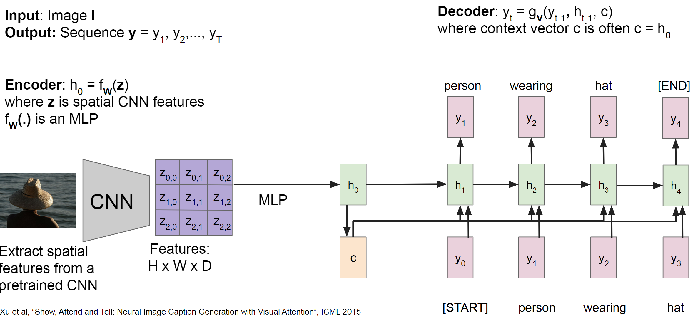

在朴素的图像描述网络架构中，模型需要在 c (即上下文) 中对它图片所有内容进行编码，如果我们想生成非常长的描述，比如100多字，这个c限制了网络的发挥。

思路：每个时间步都有新的上下文向量。每个上下文向量将处理不同的图像区域。类似于上面的注意力思想，下图为生成第一个词的图例：

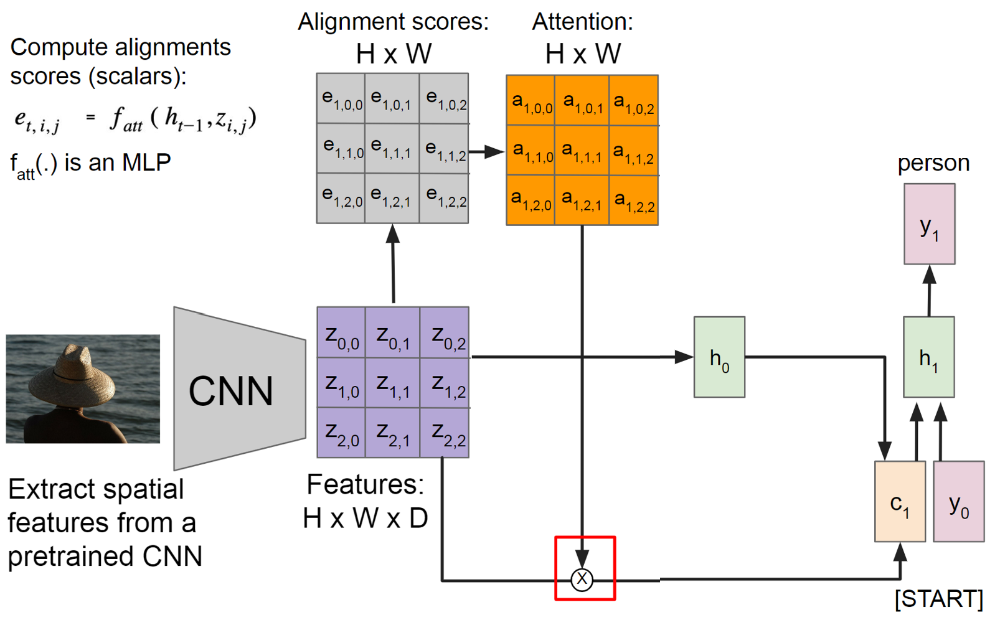

图像中的注意力例子：

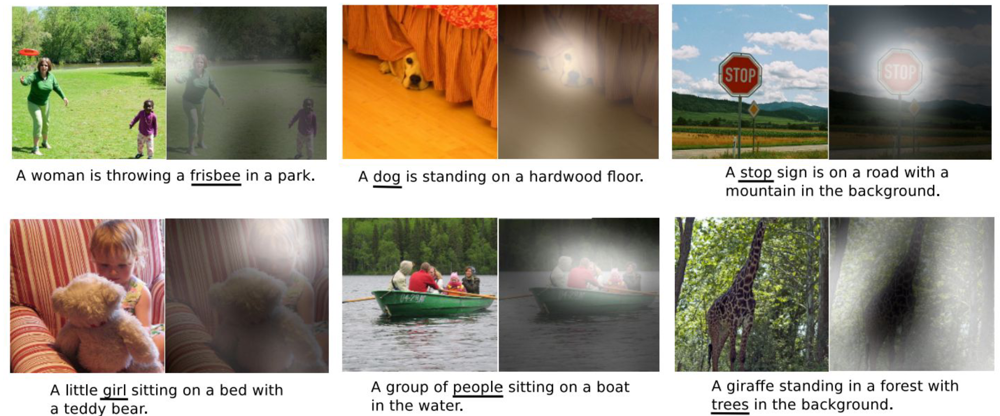

## 自注意力

在上面图像描述的例子中，h可以看作 query，这和自注意力已经有点像了，事实上，我们稍加改造就可以得到自注意力。

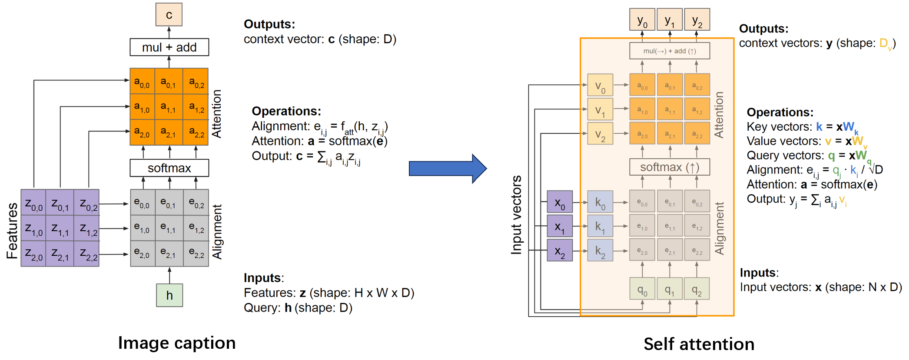

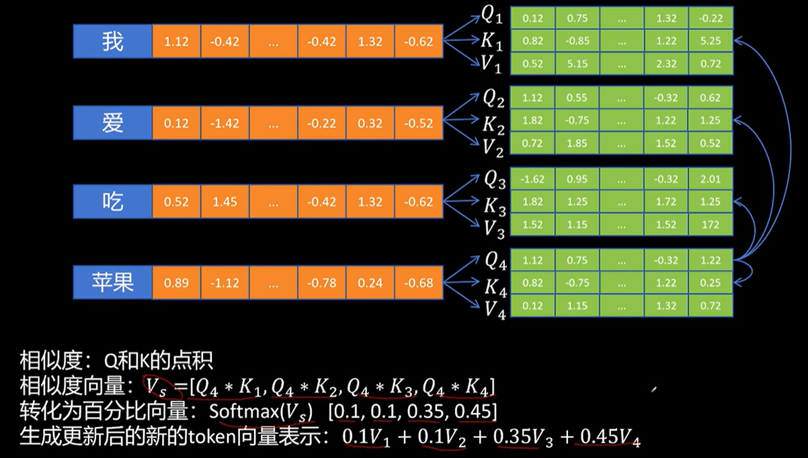

按照这样的思路，我们可以把图像描述模型中的注意力换成 [Transformer](https://qmmms.github.io/posts/Attention-Is-All-You-Need/) block，这样的另一个好处是：它不再是一个序列模型，转而一次计算完成。

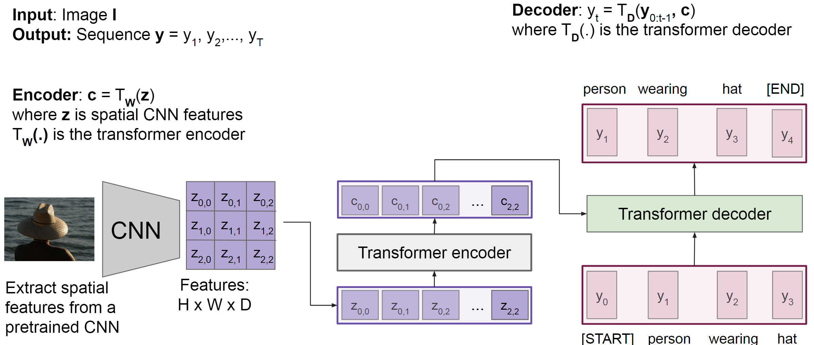

为什么不把CNN丢掉？这样我们得到了类似Vision Transformer的模型：

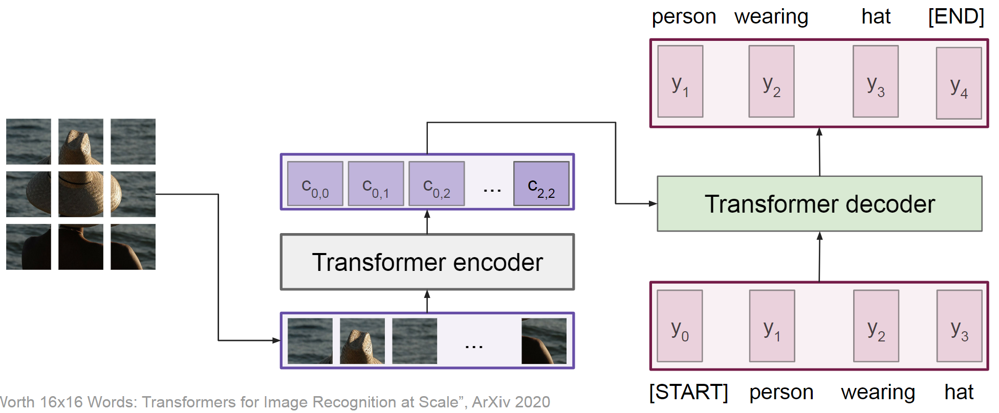

## 公式

公式和对应图示如下，图示中 softmax 为按行计算

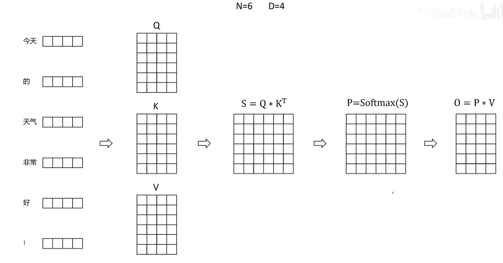
$$
Attention(Q,K,V) = Softmax(\frac{QK^T}{\sqrt{d_k}}) \times V
$$

$$d_k$$ 是向量的长度。为什么要除以$\sqrt{d_k}$？

1. 是为了防止softmax函数的梯度消失。 可以证明$$QK^T$$的方差为$$d_k$$ ，因此$$d_k$$ 比较大时 （2 个向量的长度比较长的时候），点积方差大，即相对的差距会变大，导致最大值 softmax会更加靠近于1，剩下那些值就会更加靠近于0（退化为argmax）。算梯度的时候（雅可比矩阵），梯度比较小（全0矩阵）。在 trasformer 里面一般用的 $d_k$ 比较大 (本文 512) ，除以$\sqrt{d_k}$是不错的选择。
2. 原始的 Q 和 K 均值都为0，方差都为1，而 $$QK^T$$ 的方差为$$d_k$$，为了保持方差仍为1，则手动除以了 $$\sqrt{d_k}$$

类似思想，在 Transformer 的大模型应用中有温度 T 这个参数，体现在 softmax 的公式中：
$$
Softmax(x_i)=\frac{e^{x_i/T}}{\sum_{j}e^{x_j/T}}
$$

温度 T 越大，分布越平滑，越容易取到原先小概率的东西，在GPT的应用中，T 越大，越容易取到低概率的词，输出会更加多样化。

实际计算中，会把多个 query 写成 一个矩阵，**并行**化运算。 

- $$Q维度:(n,d_k)$$
- $$K维度:  (m, d_k)$$
- $$QK^T维度：(n, d_k) \times (m, d_k)^T = (n, m) $$

具体举个例子：

第一步计算输入（序列长度为2，两个节点）通过Input Embedding也就是图中的f(x)得到a，然后通过权重W得到QKV

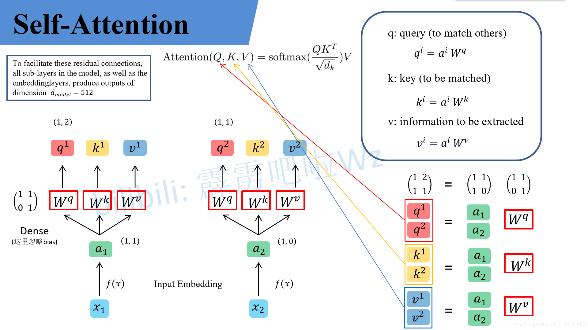

第二步根据公式计算注意力

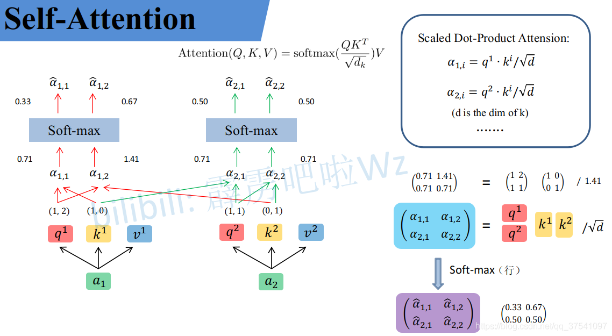

接着进行加权得到最终结果

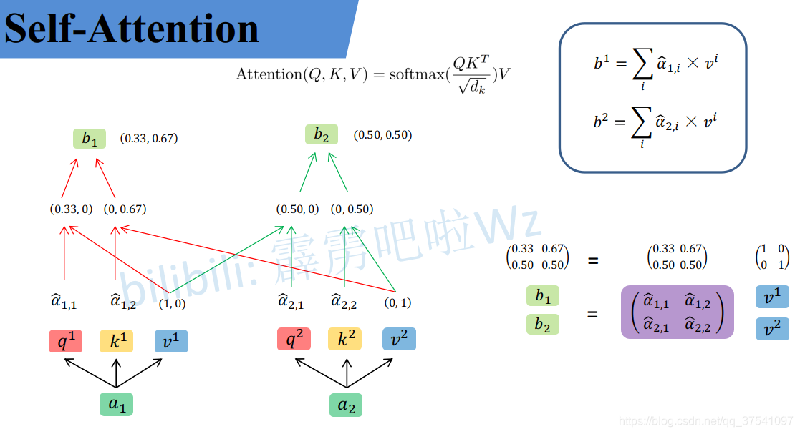

## Multi-head attention

为什么要做多头注意力机制呢？一个点乘的注意力里面，没有什么可以学的参数。为了识别不一样的模式，希望有不一样的计算相似度的办法。 

先投影到低维，投影的 W 是可以学习的。 multi-head attention 给 h 次机会去学习 不一样的投影的方法，使得在投影进去的度量空间里面能够去匹配不同模式需要的一些相似函数，然后把 h 个 heads 拼接起来，最后再做一次投影。

$$
head_i=Attention(QW_i^Q,KW_i^K,VW_i^V)
$$

$$
MutiHead(Q,K,V) = Concat(head_1 ,...,head_h)W^O
$$

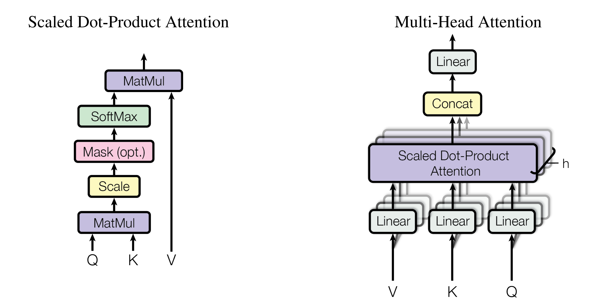

后续为了**权重共享**，有两种改进。Multi-Query Attention（MQA）是一种共享机制的Attention，相比Multi-Head Attention，其Query部分没有区别，Key和Value可以只用一个Head。计算时，对Key和Value进行expand或者repeat操作，使它们填充到与Query一样的维度，后续计算就与Multi-Head Attention没区别。

GQA 觉得这样是不是有点太暴力，于是选择了 MQA(共享一个) 和 MHA（完全不共享） 的一个中间形态，按组来共享。如下图所示：

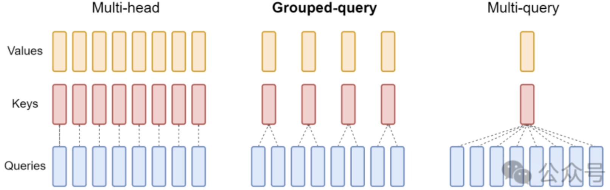

目前使用 GQA 的越来越多了，比如 Llama2，deepseek，yi等。

## 并行化

> 参考：https://mp.weixin.qq.com/s/Nv9iS96J7pVZRvH7U8fWsA

MultiHead 的机制很适合并行计算，这里就不展开了。Attention 的并行计算主要解决两个问题：

1. 矩阵的并行计算。
2. Softmax 的并行计算。

矩阵的并行算法已经比较成熟，GPU 上也有 TensorCore 来加速计算，这里不再展开。但是这里面有个 Softmax 的操作，这个操作让并行计算有些棘手。

softmax 有个问题，那就是很容易溢出。比如采用半精度，由于float16的最大值为65504，所以只要 $$x\geq11$$ , 那么softmax就溢出了。即使是float32，x也不能超过88。

好在 exp 有这么一个性质，那就是 $$e^{x-y}=\frac{e^x}{e^y}$$ 根据这个性质，可以在softmax公式中分子分母上同时除以一个数，这样 $$e^x$$ 不容易溢出。这个算法可以分成三次迭代来执行：

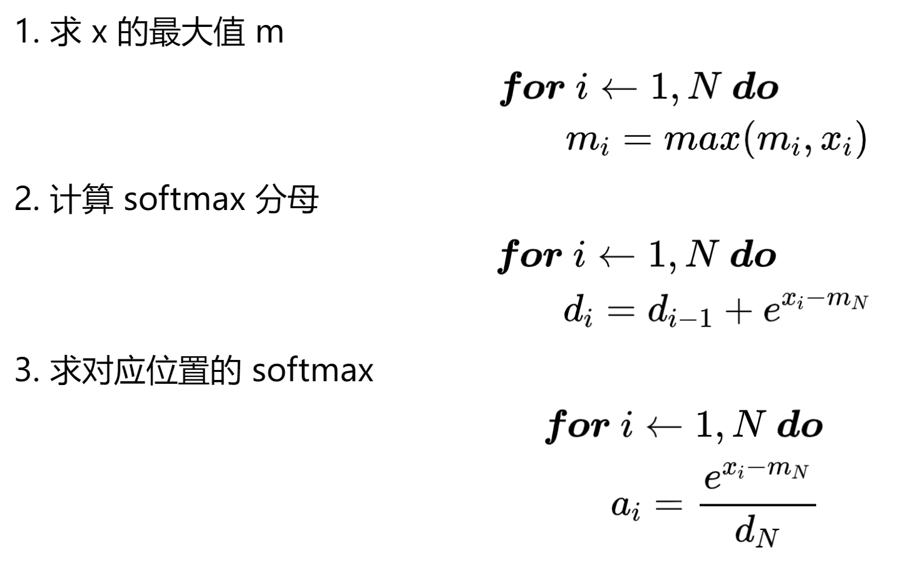

从上面的式子可以注意到，所有的操作都变成了累加操作。**加法的结合律决定了可以很方便的执行并行计算。** 因为先加或者后加，分组加还是累计加，都不影响最终的结果。

但是第3步的计算依赖第2步的结果，所以不能合在一起。但巧合的是，Attention 中的 softmax 求完之后，softmax 每一项的值会与 V 中向量相乘，然后累加。如下图所示：

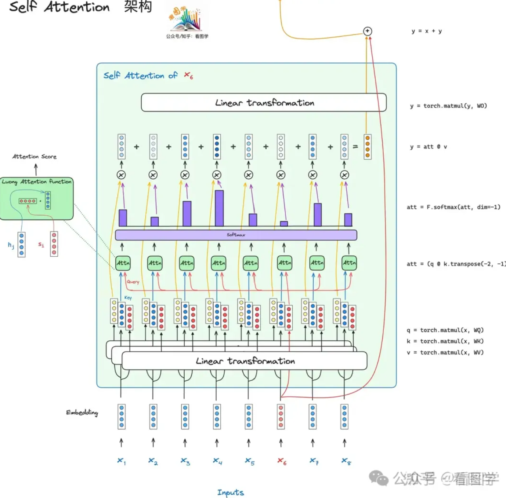

如果没有这个累加，比如单纯的计算 softmax，反而没有办法并行。这里的累加非常关键，有了这个累加的操作，所有的计算又符合结合律了，这就是 FlashAttention 并行加速的的理论根基。就可以将 Attention 所有的操作，都放到一个for 循环里（一个 Kernel 就可以实现）

具体实现可以参考[代码](https://github.com/tspeterkim/flash-attention-minimal/blob/main/flash.cu)