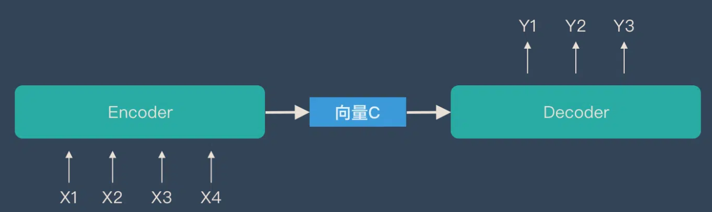

# Transformers 家族

面试官：分别讲讲 encoder-only, decoder-only, encoder-decoder 几种大模型的代表作。

## Transformer


- encoder 将 $$(x_1, x_2, ... , x_n)$$（原始输入） 映射成 $$(z_1, z_2, ... , z_n)$$（机器学习可以理解的向量）i.e., 一个句子有 n 个词，$$x_t$$ 是第 t 个词，$$z_t$$ 是第 t 个词的向量表示。
- decoder 拿到 encoder 的输出，会生成一个长为 m 的序列 $$(y_1, y_2, ... , y_m)$$。n 和 m 可以一样长、可以不一样长。 

encoder 和 decoder 的区别：

- encoder 一次性可以看全整个句子。i.e., 翻译的时候，看到整句英语：Hello World。decoder 在解码的时候，输出词只能一个一个的生成。过去时刻的输出会作为你当前时刻的输入，自回归 auto-regressive。
- decoder在做预测的时候 是没有输入的。Shifted right 指的是 decoder 在之前时刻的一些输出，作为此时的输入。一个一个往右移。

解码器端同时接收来自编码器端的输出以及当前 Transformer 块的前一个掩码注意力层的输出。**查询q是通过解码器前一层的输出进行投影的**，**而键k和值v是使用编码器的输出进行投影的**。它的作用是在翻译的过程当中，为了生成合理的目标语言序列需要观测待翻译的源语言 序列是什么。

**在做预测时，步骤如下：**

1. 给 decoder 输入 encoder 对整个句子 embedding 的结果 和一个特殊的开始符号 </s>。decoder 将产生预测，在我们的例子中应该是 ”你”。
2. 给 decoder 输入 encoder 的 embedding 结果和 “</s>你”，在这一步 decoder 应该产生预测 “好”。
3. 给 decoder 输入 encoder 的 embedding 结果和 “</s>你好”，在这一步 decoder 应该输出 ”</eos>”。结束

注意力与位置编码已经介绍过，这里不再赘述，[位置编码介绍点这里](https://qmmms.gitbook.io/note/llm/qms03-you-jian-du-wei-tiao-gai-shu#positional-encoding)，[Transformer的代码参考点这里](https://qmmms.github.io/posts/Attention-Is-All-You-Need/)

### Tokenization

无论是机器学习还是深度学习的模型，其输入都是数字而不是原始的文本。所以需要把文本转换为数字，一般是用词典的编号来表示。

Tokenization 是将文本切分成词典中的词，从而得到用词典的 index 表示的数字序列。Tokenization 的发展大概经历了三个阶段：词粒度、字粒度和 Subword 粒度。

> 切分的例子：
>
> - 南京市/长江/大桥
> - 南京/市长/江大桥

**词粒度 Word-based Tokenization**：每一个 token 是词典中的一个词。对于拉丁语系很简单，按照空格和标点符号分割即可。对于中文日文，则需要专门进行分词，比如中文分词一般都用 jieba（结巴分词），哈工大的 LTP等。中文的分词可以抽象为一个序列标注问题，所以这些分词方法会使用词典索引，或者 HMM，双向 GRU 等模型来进行分词。虽然 BERT 甚至大模型也能很好的完成这个任务，但是由于分词是一个非常频繁的操作，效率也很重要，所以一般不会使用太复杂的模型来做。

**字粒度 Character-based Tokenization**：把文本按照最小粒度来拆分，对于英文来说就是 26 个字母加上一些标点符号。中文来说就是字。

但是对于英文来说，单个字母几乎没有含义。难以学习到词汇的真正含义。由于中文的一个字还是有一定的含义，所以在中文勉强可以使用，但是英文几乎没法使用。会让输入变得很长，训练和推理更慢。

**子词粒度 Subword Tokenization**：可以认为是上面两种方法的一个中间态。其设计理念为：

1. 词典中的每一个token都有语义。
2. 常用的词汇尽量不要分割
3. 不常用的词汇可以拆分成常用的、有意义的字词(Subword) 。例如：enjoy-able

对英文支持很好，但是对中文来说没有起到类似英文的 Subword 效果。因为中文也可以进一步拆分，比如“钅” 一般都跟金属有关，“犭”一般都跟动物有关。目前的中文的处理粒度还没有这么细致。

子词粒度的一个经典方法是**Byte-Pair Encoding (BPE)**，BPE 的方法采用了 Huffuman 编码类似的思想，方法如下：

1. 首先按字粒度分词，注意每个词的末尾添加一个特殊字符来区分，比如</w>
2. 找到2-gram 最多的组合，变为一个新 token。
3. 将新 token 添加到词表，并且删除被新 token 完全覆盖的 token
4. 重复2和3，可以设置到达一定的词表数量停止迭代，或者要求 token 的词频必须满足一定的数量，否则就停止迭代。

> 例子：
>
> ```
> - {'l o w </w>': 5, 'l o w e r </w>': 2, 'n e w e s t </w>': 6, 'w i d e s t </w>': 3}
> - 最多的组合为 es, 出现了9次，
> - 添加token: es, 需要注意的是 s 从词表中删除了
> - 下一次迭代。。。
> ```

下一个问题，Transformers/大模型的 token vocabulary 应该选多大？

1. **数据量够大的情况下**，vocabulary 越大，压缩率越高（代表了相同数量的token能够表达更多的信息，相同的信息 token 越短则训练效率更高），**压缩率更高代表着能看到更多的上下文**，就能 attention 到更多的信息。
2. 更多的词汇能够减少 OOV (Out of Vocabulary)的影响, 训练的信息不会丢失，推理的时候泛化能力也更强。同时更多的词汇可以减少词汇分解后的歧义，从而更好地理解和生成文本。
3. 太大的 vocabulary 需要做一些训练和推理的优化，所以要**平衡计算和效果。**
4. 要考虑内存对齐。vocabulary 的**大小设置要是 8 的倍数，在 A100 上则是 64 的倍数。**（不同的GPU可能不一样）

### Masked Attention

虽然在预测时只能一个一个token输出，但是在训练时我们可以通过Masked Attention一次训练完毕，目的是为了使得decoder模拟不能看见未来的信息。具体指在计算权重的时候，t 时刻只用了 $$v_1, ..., v_{t-1}$$ 的结果，不要用到 t 时刻以后的内容。

> 如果我们把注意力看作上下文信息的交流，由于在输出时看不到未来的信息，这些注意力权重应当为0

Mask 非常简单，首先生成一个下三角全 0，上三角全为负无穷的矩阵（ t 时刻以后 $$Q_t$$ 和 $$K_t$$ 的值换成一个很大的负数），然后将其与 Scaled Scores 相加即可：


之后再做 softmax，就能将 - inf 变为 0，得到的这个矩阵即为每个字之间的权重。


### FFN

Transformers 中 FFN 的参数占比是多少？答案是 2/3

Position-wise Feed-Forward Networks，说白了是作用在最后一个维度的 MLP 。Point-wise指把一个 MLP 对每一个词 （position）作用一次。

虽然 Transformers 论文的名字叫《Attention is All your Need》，但是实际上， FFN and ResNet are also your need.**Attention, FFN, ResNet 可以认为是 Transformers 架构的三驾马车，缺一不可** 。

>  Attention 的功能是做信息的提取和聚合，Resnet 提供信息带宽，而真正学到的知识或者信息都存储在 FFN 中
>
> 在图像领域中，也有一种说法，那就是 Attention 其实是 token mixer, FNN 其实是 channel mixer.

FFN 设计的初衷，其实就是为模型引入非线性变换。 attention 确实是非线性的，但是“**非线形纯度**”不够。这就是 FFN 必须要存在的原因，或者说更本质的原因是因为 FFN 提供了最简单的非线性变换。

一些 FFN 比较公认的研究成果：

- **FFN是 Transformers 的必备模块**，没有 FFN 的 Transformers 学不到什么东西（上面的结论同样适用于 Transformers 中的 skip connect）
- **FFN 承担了记忆功能**。FFN 是一个 Key-Value 记忆网络，第一层线性变换是 Key Memory，第二层线性变换是 Value Memory。FFN 学到的记忆有一定的可解释性，比如低层的 Key 记住了一些通用 pattern (比如以某某结尾)，而高层的 Key 则记住了一些语义上的 Pattern （比如句子的分类）。Value Memory 根据 Key Memory 记住的 Pattern，来预测输出词的分布。
- **FFN 是一种混合专家模型**。其实一直以来，神经网络就存在稀疏激活的现象，也就是在推理的时候，其实只有极小一部分参数参与了计算。这篇论文则通过 MoE 的思想来将 FFN 层拆分成了多个专家，并且新增了一个路由模块来确定推理的时候来挂哪个专家的门诊。这么做完之后，在提升推理速度的同时，效果依然能保持原来的95%以上。

### weight tying

Transformers 的输入会从一个词向量矩阵中获取对应 token 的词向量，这个**词向量矩阵**的大小为 (vocab_size, hidden_size)。

在预测一个词的输出概率时，transformer 有个**预测头**(prediction head), 这个预测头是 Transformers 的最后一层，大小为 (hidden_size, vocab_size)

如果预测头没有bias的话，这两个矩阵的大小是一样的，如果这两个矩阵使用同一个矩阵，就被称作 weight typing。即**嵌入层和输出层权重共享**

《Using the Output Embedding to Improve Language Models》认为，词向量最终应该满足这样一个条件，那就是相似词的词向量应该也相似（在向量空间中的距离应该更近）。而预测头需要参与 softmax 去预测某一个词，我们期望两个同义词互相交换位置后，得分应该也差不多，这也就要求**相似的词在预测头中对应的向量也应该相似**。基于这一点的考虑，作者认为词向量和预测头可以共享权重。

- **最明显的好处就是降低了模型参数**。在词表不大的时候并没有什么感觉，但是词表越大，词向量占参数的比例就越大。
- **收敛更快**。如果没有 weight tying， 词向量矩阵只会更新自己见过的 token。但是当使用 weight tying 后，**所有的 token 的词向量都会更新，即使没见到的 token，模型也会分配合适的概率。**
- 这个问题在 BERT 之类的 Encoder-only 的模型中更为显著，因为每个样本只会预测15%左右的词汇，而不是像 Decoder 那样所有的 token 都会更新。**所以 Encoder-only 的模型更喜欢使用 Weight Tying**
- 但从根本上说，预测头和词向量所肩负的任务是完全不一样的，强扭的瓜不一定甜。使用 weight tying 会导致各向异性问题。

等等，各向异性（Anisotropic）是啥？**各向异性在向量空间上的含义就是分布与方向有关系，而各向同性就是各个方向都一样**，比如二维的空间，各向异性和各向同性对比如下(左图为各向异性，右图为各向同性)：


学者们(Gao et al. 2019 和 Wang et al. (2020))发现Transformer学到的词向量在空间的分布是是各向异性的。Ethayarajh, 2019 发现类似的情况在BERT，GPT-2中同样存在。

各向异性就有个问题，那就是最后学到的向量都挤在一起，彼此之间计算余弦相似度都很高，并不是一个很好的表示。一个好的向量表示应该同时满足Alignment 和 uniformity，前者表示相似的向量距离应该相近，后者就表示向量在空间上应该尽量均匀，最好是各向同性的。


如何消除各向异性？

- 映射为各向同性：BERT-flow的工作就是将原来的分布校准为高斯分布。标准的高斯分布就是各向同性的。
- 类似的还有**whitening**（白化）操作。大概流程就是根据SVD分解的结果，旋转缩放后得到一个标准正态分布。
- 消除主成分、正则化等等。

> 在学习完之后，推荐参考[llm可视化](https://bbycroft.net/llm)的例子看看是否真正了解了每一步的计算过程。
>
> 

## 家族概述

Transformer派生的主流预训练框架主要有三种：


- **auto encoding自编码模型（AE模型）**：代表作BERT。它不会进行精确的估计，但却具有从被mask的输入中，重建原始数据的能力，即**fill in the blanks**（填空），并且是**双向**的。正因为这个**无监督**的**填空预训练**，所以叫自编码，编码就是常规理解，对输入做映射。编码器会产出适用于NLU任务的上下文表示，但无法直接用于文本生成。

  

- **encoder-decoder（Seq2seq模型）**：同时使用编码器和解码器。它将每个task视作序列到序列的转换/生成（比如，文本到文本，文本到图像或者图像到文本的多模态任务）。对于文本分类任务来说，编码器将文本作为输入，解码器生成文本标签。代表作T5。采用双向注意力机制。Encoder-decoder模型通常用于需要内容理解和生成的任务，比如文本摘要、机器翻译等。

  

- **auto regressive自回归模型（AR模型）**：代表作GPT。本质上是一个从左往右学习的模型的语言模型。自回归使用自身以前的信息来预测当下时间的信息，即用自己预测自己，称之为自回归。通常用于生成式任务，在长文本生成方面取得了巨大的成功，比如自然语言生成（NLG）领域的任务：摘要、翻译或抽象问答。当扩展到十亿级别参数时，表现出了少样本学习能力。缺点是**单向**注意力机制，在NLU任务中，无法完全捕捉上下文的依赖关系。

  

## GPT

GPT的本质是把transformer的解码器拿出来，然后在没有标号的大量文本数据训练一个语言模型，来获得一个预训练模型，然后再用它在子任务上作微调。

### 历史


- 在transformer出现后，GPT 把transformer的解码器拿出来成为了GPT这个模型。
- 之后BERT把transformer的编码器拿出来做成了BERT这个模型，BERT的基础模型对标的是GPT，在可学习参数规模基本一样的情况下，效果比GPT更好。BERT的large模型甚至比它的基础模型更好。
- 在之后又出现了GPT2和GPT3，技术路线基本不变（具体指依旧使用transformer的解码器），可学习参数和样本规模越变越大，效果也越来越好。
- GPT2的特点是适合做zero-shot，指的是模型在没有进行显式训练的情况下，能够对之前从未见过的类别或任务进行推理和泛化。传统上，模型只能在训练数据中出现过的类别上进行准确预测，而zero-shot学习推动了模型在未见示例的情况下进行预测的能力。
- GPT3的特点是是在后续子任务的训练上权重是不会改变的。主要原因是因为GPT3的可学习参数规模达到了千亿级别，在这个规模上，做微调改变参数是很困难的一件事情。

“先预训练再微调”的思想在很久之前就已经在计算机视觉领域流行，但是在自然语言处理界一直没有流行起来，主要原因是缺少像 ImageNet 那样大规模已经标好的数据。 ImageNet 的数据量是一百万张图片，但如果要在自然语言处理中达到同样的效果，数据量还要再翻十倍，因为一张图片的信息远比一个句子多，要学习到同样的东西，文本的规模必须更大。

使用未标好的数据进行训练时主要会遇到两个困难：

1. 目标函数的选择。自然语言处理的子任务很多，可能会有一些目标函数对于某一个子任务上效果很好，但是没有找到一个适合于所有子任务的目标函数。
2. 如何把学习到的文本表示传递（迁移）给下游的子任务。

### 预训练

对于预训练，假设文本为$$\mathcal{U}=\{u_1, ... u_n\}$$，第一个目标函数是最大化下列似然函数，本质是最大化第i个词出现的概率，使用这个词之前的k个词做预测：
$$
L_1(\mathcal{U})=\sum_i \log P(u_i|u_{i-k},...u_{i-1};\Theta)
$$

- 其中$$\Theta$$为参数
- k是窗口大小

使用最大似然函数，本质上就是要求模型输出跟原来文本长得最像的文章。


### 预测

在具体做预测时，假设要预测u这个词出现的概率，我们首先需要知道前k个词，假设为$$U=\{u_{i-k},...u_{i-1}\}$$，公式为：
$$
h_0=UW_e+W_p
$$

$$
h_l=\text{TransfomerBlock}(h_{l-1}) \forall i \in [1,n]
$$

$$
P(u)=\text{softmax}(h_nW_e^T)
$$

简单来说，就是把前面的所有词先做投影，加上位置编码，再经过n层transformer解码器块，然后再做投影，经过softmax得到概率。

作微调时我们使用已经标好的数据集$$\mathcal{C}$$，假设文本为$$x_1,...x_m$$，标签为$$y$$，具体预测方法是：

$$
P(y|x_1,...x_m)=\text{softmax}(h_l^mW_y)
$$

简单来说，就是把文本放到已经预训练好的transformer块，拿到最后一个词的最后一层输出，做投影（经过输出层），经过softmax得到概率。

接着做最大似然：

$$
L_2(\mathcal{C})=\sum_{(x,y)} \log P(y|x_1,...x_m)
$$
两个放一块训练效果最佳：

$$
L_3(\mathcal{C})=L_2(\mathcal{C})+\lambda L_1(\mathcal{C})
$$

**把NLP不同的子任务表示为统一的形式**：


## BERT

BERT模型会比GPT模型效果优秀原因之一，是因为BERT模型拿出的是transformer的编码器，编码器是可以从两个方向看文本，可以类比为做完形填空。GPR拿出的是transformer的解码器，它只能从左往右去看文本。

虽然从两个方向看文本可以得到的效果更好，但是所付出的代价是它只能做有限的工作。对于一些生成式的工作或者语言翻译，是不可能两个方向同时去做的。所以说GPT因为只从左往右去看文本，所以说能做的工作会更多。

BERT 包括两步：预训练 + 微调。


### Transformer encoder

BERT 中间是一个多层双向 Transformer 的解码器，模型调了 3 个参数：

- L: transform blocks的个数
- H: hidden size 隐藏层大小
- A: 自注意力机制 multi-head 中 head 头的个数

BERT_BASE模型1亿参数（和 GPT 差不多），L=12，H=768，A=12。BERT_LARGE模型3.4亿参数，L=24，H=1024，A=16。

在这里，我们简单估计一下参数个数，主要是嵌入层和Transformer 块


- 嵌入层： 输入是词的字典大小 30k，输出是 H。嵌入层的输出会进入 transformer 块。
- transformer blocks 的 self-attention mechanism 本身无可学习参数; multi-head self-attention mechanism 要对 Q、K、V 做投影，一共$$H^2 \times 4$$
- MLP 的 2个全连接层：第一个全连接层输入是 H，输出是 4 * H；第二个全连接层输入是 4 * H，输出是 H。一共$$H^2 \times 8$$

一共$$30k \times H + L \times H^2 \times 12$$

### 句子表示

下游任务有处理一个句子或者处理 2 个句子，BERT 需要能处理不同句子数量的下游任务。

a single sentence: 一段连续的文字，不一定是真正上的语义上的一段句子，它是我的输入叫做一个序列 sequence。A “sequence” 序列可以是一个句子，也可以是两个句子。

存在一个问题，如果数据量大的时候，词典会特别大，到百万级别。可学习的参数基本都在嵌入层了。因此使用**WordPiece**， 把一个出现概率低的词切开，只保留一个词出现频率高的子序列，30k token 经常出现的词（子序列）的字典。 例如`reckless = reck + ##less`

序列开始使用: [ CLS ] 标记。

区分两个合在一起的句子 的方法：每个句子后 + [ SEP ] 表示 seperate。例子是：`[ CLS ] [Token1] …… [Token n] [SEP] [Token1'] …… [Token m]`

每一个 token 进入 BERT 得到 这个 token 的embedding 表示。对于 BERT，输入一个序列，输出一个序列。最后一个 transformer 块的输出，表示 这个词源 token 的 BERT 的表示。在后面再添加额外的输出层，来得到想要的结果。

### 嵌入层

一个词源的序列 –> 一个向量的序列 –> 进入 transformer 块

- Token embeddings: 词源的embedding层，整成的embedding层， 每一个 token 有对应的词向量。
- Segement embeddings: 这个 token 属于第一句话 A还是第二句话 B。对于句子对，第一个句子的特征值是0，第二个句子的特征值是1。
- Position embeddings: 输入是 token 词源在这个序列 sequence 中的位置信息。从0开始 1 2 3 4 –> 1024


BERT 的 segment embedding （属于哪个句子）和 position embedding （位置在哪里）是学习得来的，transformer 的 position embedding 是给定的。

### 预训练

预训练要做的一个任务是**遮盖部分输入的词**，**预测这些词**。即Masked LM

由 WordPiece 生成的词源序列中的词源，它有 15% 的概率会随机替换成一个掩码。但是对于特殊的词源（ 例如[ CLS ] 和 [SEP]）不做替换。该模型尝试根据序列中其他非掩码单词提供的上下文来预测掩码单词的原始值。具体来讲，输出词的预测需要：

1. 在编码器输出之上添加一个分类层。
2. 将输出向量乘以嵌入矩阵，将它们转换为词汇维度。
3. 用 softmax 计算词汇表中每个单词的概率。


MLM 带来的问题：预训练和微调看到的数据不一样。预训练的输入序列有 15% [MASK]，微调时的数据没有 [MASK].

15% 计划被 masked 的词: 80% 的概率被替换为 [MASK], 10% 换成 random token,10% 不改变原 token。但还是被用来做预测。另外文章指出每次只预测15%的单词，因此模型收敛的比较慢。

> 这么做的原因是如果句子中的某个Token100%都会被mask掉，那么在fine-tuning的时候模型就会有一些没有见过的单词。加入随机Token的原因是因为Transformer要保持对每个输入token的分布式表征，否则模型就会记住这个[mask]是token ’hairy‘。至于单词带来的负面影响，因为一个单词被随机替换掉的概率只有15%*10% =1.5%，这个负面影响其实是可以忽略不计的。

例子：

- 80% of the time: my dog is hairy → my dog is [MASK]
- 10% of the time: my dog is hairy → my dog is apple
- 10% of the time: my dog is hairy → my dog is hairy.

第二个预训练任务是**判断两个句子是否处于同一篇文章**，具体来说是否是前后关系。

输入序列有 2 个句子 A 和 B，50% 正例，50%反例。50% B 在 A 之后，50% 是 a random sentence 随机采样的。

为了预测第二个句子是否确实与第一个句子相关，执行以下步骤：

1. 整个输入序列通过 Transformer 模型。
2. 使用简单的分类层（权重和偏差的学习矩阵）将 [CLS] 标记的输出转换为 2×1 形状的向量。
3. 用 softmax 计算 IsNextSequence 的概率。

**在训练 BERT 模型时，Masked LM 和 Next Sentence Prediction 一起训练，目标是最小化这两种策略的组合损失函数。**

例子：

- Input = [CLS] the man went to [MASK] store [SEP] he bought a gallon [MASK] milk [SEP] Label = IsNext
- Input = [CLS] the man [MASK] to the store [SEP] penguin [MASK] are flight ##less birds [SEP] Label = NotNext

### 微调

每一个下游任务会创建一个 新的 BERT 模型，（由预训练参数初始化），但每一个下游任务会根据自己任务的 labeled data 来微调自己的 BERT 模型。


BERT 可用于多种语言任务，仅需在核心模型中添加一小层：

1. 情感分析等分类任务与 Next Sentence 分类类似，方法是在 [CLS] 令牌的 Transformer 输出之上添加一个分类层。$$log(\text{softmax}(CW^T)$$ 其中 C 是BERT输出中的`[CLS]`符号， W 是可学习的权值矩阵。
2. 在问答任务（例如 SQuAD v1.1）中，给一段文字，问一个问题，问题的答案就在给的文字里面。本质的任务就是摘录答案，即对每个词源 token，判断是不是答案的开始or结尾。具体学 2 个向量 S 和 E，分别对应这个词源 token 是答案开始词的概率 和 是答案结尾词的概率。
3. 在命名实体识别 (NER) 中，接收文本序列并需要标记文本中出现的各种类型的实体（人、组织、日期等）。使用 BERT，可以通过将每个标记的输出向量输入到预测 NER 标签的分类层来训练 NER 模型。

在微调训练中，大多数超参数与 BERT 训练中保持一致，论文对需要调优的超参数给出了具体指导。

要点：

- *模型大小很重要。*BERT_large 拥有 3.45 亿个参数，是同类模型中最大的。它在小规模任务上明显优于 BERT_base，BERT_base 使用相同的架构，“只有”1.1 亿个参数。
- *足够的训练数据，更多的训练步骤 == 更高的准确度。*例如，在 MNLI 任务上，与具有相同批量大小的 500K 步训练相比，在 1M 步（128,000 字批量大小）上训练时，BERT_base 准确度提高了 1.0%。
- *BERT 的双向方法 (MLM) 的收敛速度比从左到右的方法要慢*（因为每批中仅预测 15% 的单词），但经过少量预训练步骤后，双向训练的性能仍然优于从左到右的训练。


微调的任务包括

（a）基于句子对的分类任务：

- MNLI：给定一个前提 (Premise) ，根据这个前提去推断假设 (Hypothesis) 与前提的关系。该任务的关系分为三种，蕴含关系 (Entailment)、矛盾关系 (Contradiction) 以及中立关系 (Neutral)。所以这个问题本质上是一个分类问题，我们需要做的是去发掘前提和假设这两个句子对之间的交互信息。
- QQP：基于Quora，判断 Quora 上的两个问题句是否表示的是一样的意思。
- QNLI：用于判断文本是否包含问题的答案，类似于我们做阅读理解定位问题所在的段落。
- STS-B：预测两个句子的相似性，包括5个级别。
- MRPC：也是判断两个句子是否是等价的。
- RTE：类似于MNLI，但是只是对蕴含关系的二分类判断，而且数据集更小。
- SWAG：从四个句子中选择为可能为前句下文的那个。

（b）基于单个句子的分类任务

- SST-2：电影评价的情感分析。
- CoLA：句子语义判断，是否是可接受的（Acceptable）。

## T5

T5(Text-to-Text Transfer Transformer)模型将翻译、分类、回归、摘要生成等任务都统一转成**Text-to-Text**任务，从而使得这些任务在训练(pre-train和fine-tune)时能够使用相同的目标函数，在测试时也能使用相同的解码过程。 

**T5模型和原始的Transformer结构基本一致**（所以模型图就省略了），除了做了如下几点改动：

- remove the Layer Norm bias
- place the Layer Normalization outside the residual path
- 相对位置嵌入。在 T5中，位置编码依赖于自注意的扩展来对成对关系进行比较。

具体来说，baseline模型结构的encoder部分和BERT-base模型(12层)的大小一样，而decoder部分和encoder大小相似，因此baseline模型的参数量基本是BERT-base模型的2倍

我们来看**如何将各种下游NLP任务都统一转化成Text-to-Text格式**。在下游任务上fine-tune模型时，为了告诉模型当前要做何种任务，T5团队想到一个简单的解决方法：为输入序列增加前缀。这种前缀不仅仅是一个标签或像[CLS]这种用于分类的指示器。T5前缀包含Transformer需要解决的任务的本质。如下面的例子所示，前缀表达的意思包括：

- `translate English to German: + [sequence]`：翻译任务
- `cola sentence: + [sequence]`： CoLA语料库，微调BERT模型。
- `stsb sentence 1:+[sequence]`：语义文本相似基准。自然语言推理和蕴涵是类似的问题。
- `summarize + [sequence]`：文本摘要问题。

统一的输入格式让一个Transformer模型产生一个结果序列，无论它是什么问题。许多 NLP 任务的输入和输出是统一的。


甚至回归任务对应的浮点数会被转成字符串看待，从而可以token by token的预测出来。虽然感觉奇怪，but anyway, it works。


## GLM

三种预训练框架各有利弊，没有一种框架在以下三种领域的表现最佳：自然语言理解（NLU）、无条件生成以及条件生成。T5曾经尝试使用MTL的方式统一上述框架，然而自编码和自回归目标天然存在差异，简单的融合自然无法继承各个框架的优点。 在这个天下三分的僵持局面下，GLM诞生了。

**GLM模型**（General Language Model）基于auto regressive blank infilling(**自回归空白填充**)方法，结合了上述三种预训练模型的思想：

1. 自编码思想：在输入文本中，随机删除连续的tokens。
2. 自回归思想：顺序重建连续tokens。在使用自回归方式预测缺失tokens时，模型既可以访问corrupted文本，又可以访问之前已经被预测的spans。
3. span shuffling + 二维位置编码技术。
4. 通过改变缺失spans的数量和长度，自回归空格填充目标可以为条件生成以及无条件生成任务预训练语言模型。

### 自回归空白填充

我们可以把自回归空白填充理解为BERT的掩码语言模型，但是GLM掩码的不是一个单词或是一个实体，而是一个句子片段。这个句子片段的具体内容通过自回归的方式来预测。如下图所示。其中绿色的部分是被掩码的内容，它通过自回归的方式来预测被掩码的文本片段。


简单来说，这么做有几个好处：进行生成任务时，GLM可以看到上文的信息；GLM预测的Span的长度是不固定的；GLM是高效的。

在具体实现上，给定一个输入文本，从中采样多个长度不定的文本片段，每个文本片段由一组连续的单词组成。不同于BERT等模型每个[MASK]表示一个token，GLM的每个[MASK]表示的是每个文本片段，经过掩码的文本表示为 xcorrupt 。

为了充分捕捉不同片段之间的相互依赖关系，GLM使用了XLNet中提出的排列语言模型（Permutation Language Model，PLM）。PLM是将自回归语言模型和自编码语言模型融合的一个技巧，例如对于一个 1→2→3→4 的序列来说，假设我们要预测的序列是 3 ，我们需要同时看到 1，2，4 ，这样才能解决自回归语言模型的不能同时看到上下文的问题。所以PLM本质上是一个**先进行打乱，再从左向右依次预测的自回归语言模型**。

假设 $$Z_m$$ 是 m 个文本片段的所有可能的排列组合，我们得到GLM的预训练目标函数：

$$
\max _\theta \mathbb{E}_{z \sim Z_m}\left[\sum_{i=1}^m \log p_\theta\left(\boldsymbol{s}_{z_i} \mid \boldsymbol{x}_{\text {corrupt }}, \boldsymbol{s}_{z _{< i}}\right)\right]
$$

> 即在所有可能的排列组合中采样，已知之前的内容和当前片段掩码后的文本，要填空生成当前片段。优化参数 $$\theta$$，使概率最大（符合真实的正确的分布）。换句话说，就是在**最大化对数似然期望**。

其中$$\boldsymbol{s}_{z _{< i}} = [\boldsymbol s_{z_1}, \cdots, \boldsymbol s_{z_{i-1}}] $$表示的是所有掩码片段 s 中第 i 个片段之前的内容。在GLM中，我们从左到右一次预测一个掩码片段的内容，因此片段 s 中第 j 个token $$s_j$$ 的计算方式表示如下：

$$
\begin{aligned} & p_\theta\left(\boldsymbol{s}_i \mid \boldsymbol{x}_{\mathrm{corrupt}}, \boldsymbol{s}_{z_{<i}}\right) \\ = & \prod_{j=1}^{l_i} p\left(s_{i, j} \mid \boldsymbol{x}_{\text {corrupt }}, \boldsymbol{s}_{z_{<i}}, \boldsymbol{s}_{i,<j}\right)\end{aligned} 
$$

在实现自回归空白填充时，输入 x 被分成两部分，如下图(b)，其中Part A是被破坏的文本 $$x_{\text{corrupt}}$$  ，Part B是被掩码的文本片段。如下图(d)的自注意力掩码所示，Part A可以看到它本身的所有内容，但它看不到Part B中的任何内容。Part B可以看到Part A的所有内容，以及当前时间片之前的内容，但它不能看到当前时间片之后的内容。为了能够对文本片段进行自回归的生成，GLM在文本片段的首尾分别添加了[START]和[END]标志，分别用于输入和输出。在进行采样时，跨度的长度服从 $$\lambda=3$$ 的泊松分布，我们持续采样文本片段，直到10%的文本标志被掩码掉。


1. 对于一个文本序列 x=[x1,⋯,x6] ，我们对其进行mask，假设mask掉的token是 [x3] 和 [x5,x6] ；
2. 将 [x3] 和 [x5,x6] 替换为[M]标志，并且打乱Part B的顺序；
3. 将Part A和打乱后的Part B拼接到一起，自回归的生成Part A和Part B，其中Part B中的每个文本片段加上起始标志[S]和终止标志[E]，并且使用二维位置编码表示文本的位置关系；
4. 使用自注意力掩码控制预测当前时间片时能看到的上下文。

### 二维位置编码

如上图(c)所示，GLM将Part A和Part B拼接到了一起。对于Part B中的一个token，他有两个位置信息，一个是它在原始文本中的位置，另外一个是它在文本片段中的位置。为了表示这个信息，GLM提出了二维位置编码。这个二维位置编码有片段间位置编码（intra-position encoding）和片段内位置编码（inner-position encoding）组成。

其中片段间位置编码表示的是替换该文本片段的[M]在Part A中的位置信息，与它在片段内的位置无关。因此 x3 的片段间位置编码的值是3，而 x5 和 x6 的片段间位置编码的值都是5。片段内位置编码指的是当前预测的标志在这个片段内的位置关系。因此[S]， x5 和 x6 的片段内位置编码依次是1，2，3。而对于Part A中的token，它们的片段内位置编码的值都是0。

GLM这么做的原因是让模型在预测每个文本片段时，都可以不限制预测文本的长度，直到遇到[END]标志符或者到达最大预测长度才会停止。而在预测的过程中，之前的每个预测token都会有位置编码。

### 模型结构

GLM使用了decoder-only的架构，首先将Part A输入模型并编码成特征向量，然后再依次预测Part B中每个片段的每个token。对比其他模型，GLM也对模型结构进行了调整，包括：

1. 重新排列了LN和残差连接的顺序，具体来讲就是将Post-LN改成Pre-LN。
2. 使用一个线性层来预测输出词；
3. 将ReLU激活函数替换为GeLU激活函数。