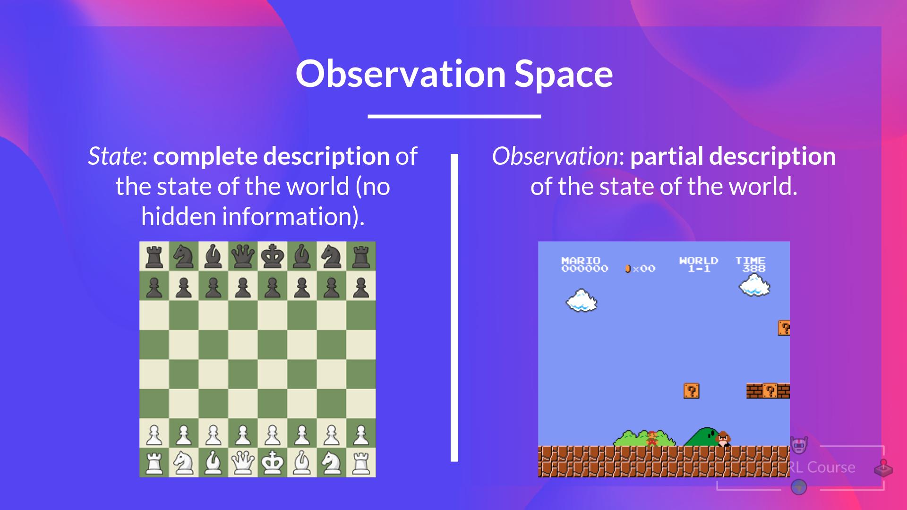
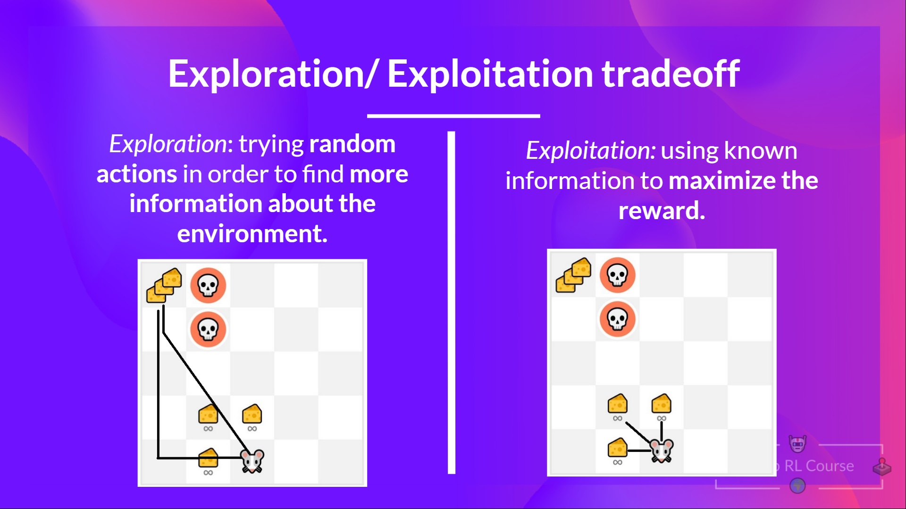
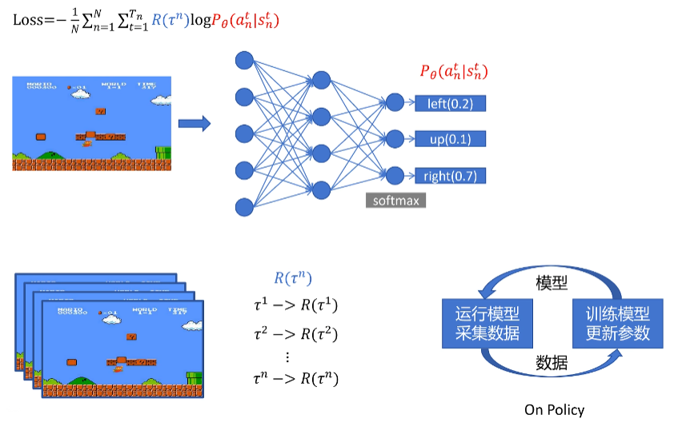
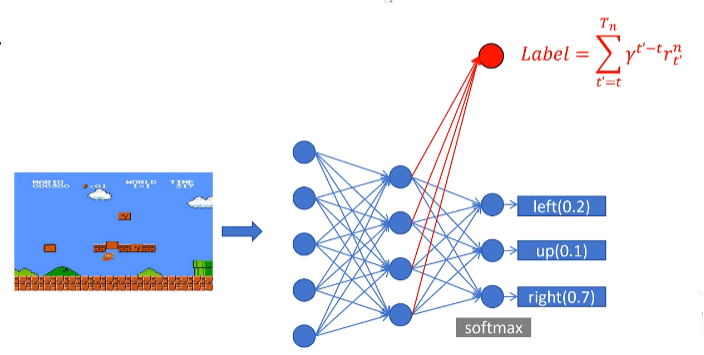

# 强化学习概述

> 来自 **HuggingFace 🤗 强化学习课程** 与 《大规模语言模型 从理论到实践》和 [B站视频](https://www.bilibili.com/video/BV1iz421h7gb)

强化学习（Reinforcement Learning，RL）研究的问题是智能体（Agent）与环境（Environment） 交互的问题，其目标是使智能体在复杂且不确定的环境中最大化奖励（Reward）。

强化学习基本框 架如图所示，主要由两部分组成：智能体和环境。在强化学习过程中，智能体与环境不断交互。 智能体在环境中获取某个状态后，会根据该状态输出一个动作（Action），也称为决策（Decision）。 动作会在环境中执行，环境会根据智能体采取的动作，给出下一个状态以及当前动作所带来的奖 励。智能体的目标就是尽可能多地从环境中获取奖励。

## 定义与概念

通过机器狗学习抓飞盘的例子，可以引出一些强化学习中基本概念：

1. **智能体与环境**：在机器狗学习抓飞盘的场景中，机器人狗就是一个智能体（Agent），它做出 决策并执行动作。而它所在的场景，包括飞盘的飞行轨迹和速度，以及其他可能的因素，则 构成了环境（Environment）。环境会根据智能体的行为给予反馈，通常以奖励的形式。
2. **状态、行为与奖励**：每次机器狗尝试抓飞盘，它都在评估当前的状态（State），这可能包括 飞盘的位置、速度等。基于这些信息，它会采取某种动作（Action），如跳跃、奔跑或待在原 地。根据机器狗所执行的动作，环境随后会给出一个奖励（Reward），这可以是正面的（成 功抓住飞盘）或负面的（错过了飞盘）。回报（Return）就是从当前时间点到游戏结束的奖励累积和，智能体应追求回报最大化
3. **策略与价值**: 机器狗在尝试各种行为的过程中，其实是在学习一个策略（Policy）。策略可以 视为一套指导其如何在特定状态下行动的规则。与此同时，智能体还试图估计价值（Value） 函数，也就是预测在未来采取某一行为所能带来的奖励。

智能体与环境的不断交互过程中，会获得很多观测 oi。针对每一个观测，智能体会采取一个 动作 ai，也会得到一个奖励 ri。可以定义**历史** Ht 是观测、动作、奖励的序列：
$$
H_t=o_1,a_1,r_1, \cdots , o_t,a_t,r_t
$$
轨迹（Trajectory）一般用 $$\tau$$ 表示，是一连串的状态和动作序列，也叫 episode 或 rollout，状态转移有的确定 $$s_{t+1}=f(s_t,a_t)$$，有的不确定 $$s_{t+1}=P(\cdot|s_t,a_t)$$
$$
\tau=\{s_0,a_0,s_1.......\}
$$

### 观察和状态

*观察*和*状态*之间需要区分：

- *状态 s*：是对**世界状态的完整描述**（没有隐藏信息）。在充分观察的环境中。在国际象棋游戏中，我们可以访问整个棋盘信息，因此我们从环境中接收状态。换句话说，环境是完全观察的。
- *观察 o*：是对**状态的部分描述。** 在部分观察到的环境中。在《超级马里奥兄弟》中，我们只能看到关卡中靠近玩家的部分，因此我们收到了观察结果。

智能体在采取当前动作的时候会依赖于它之前得到的历史，因此可以把**环境整体状态** St 看做关于 历史的函数：
$$
S_t=f(H_t)
$$
智能体能够观察到环境的所有状态时，称环境是完全可观测的（Fully Observed），这时观测 ot 等 于 St。当智能体只能看到部分的观测，称这个环境是部分可观测的（Partially Observed），这时观 测对状态的部分描述。整个的状态空间使用 S 进行表示。

### 动作空间

在给定的环境中，有效动作的集合经常被称为**动作空间**（Action Space），使用 A 进行表示：

- 围棋（Go）这样的环境具有离散动作空间（Discrete Action Space），智能体的动作数量在这个空 间中是有限的。智能体在围棋中的动作空间只有 361 个交叉点。
- 物理世界中则通常是连续动作 空间（Continuous Action Space）。在连续动作空间中，动作通常是实值的向量。例如，在平面中， 机器人可以向任意角度进行移动。

### 策略

**策略**是智能体的动作模型，决定了智能体的动作。策略也可以用函数进行表示，该函数将输入 的状态变成动作。策略可分为两种：随机性策略和确定性策略

- 随机性策略（Stochastic Policy）用 π 函数表示，即 $π(a|s) = p(a_t = a|s_t = s)$，输入一个状态 s，输出一个概率，表示智能体所有动作的 概率。利用这个概率分布进行采样，就可以得到智能体将采取的动作。
- 确定性策略（Deterministic Policy）是智能体直接采取最有可能的动作，即 $a^∗ = \mathop{\arg \max}\limits_{a} π(a|s) $

强化学习的目标是训练一个策略神经网络 π，使所有状态S下（或者说在所有轨迹 $$\tau$$ 中）Return回报期望最大

### 智能体归类

根据**智能体**所学习的组件的不同，可以把智能体归类为：基于价值的智能体、基于策略的智 能体和演员-评论员智能体。

- 基于价值的智能体（Value-based Agent）显式地学习价值函数，隐式地 学习策略。其策略是从所学到的价值函数推算得到的。
- 基于策略的智能体（Policy-based Agent）则 是直接学习策略函数。策略函数的输入为一个状态，输出为对应动作的概率。基于策略的智能体 并不学习价值函数，价值函数隐式的表达在策略函数中。
- 演员-评论员智能体（Actor-critic Agent）则 是把基于价值的智能体和基于策略的智能体结合起来，既学习策略函数又学习价值函数都，通过 两者的交互得到最佳的动作。

### 任务类型

**偶发**任务：有一个起点和一个终点**（一个终端状态）。这将创建一个情节**：状态、行动、奖励和新状态的列表。例如，想想《超级马里奥兄弟》：一集从新的马里奥关卡开始，到**你被杀或到达关卡结束时结束。**

**持续**任务：永远持续（**无最终状态**）的任务。在这种情况下，代理必须**学习如何选择最佳操作并同时与环境交互。**例如，进行自动股票交易的代理。对于此任务，没有起点和最终状态。**代理将一直运行，直到我们决定停止它。**

### 探索-利用权衡

探索-利用权衡（exploration-exploitation trade-off）

- 探索是通过尝试随机操作来探索**环境，以找到有关环境的更多信息。**
- 利用是**利用已知信息来最大化回报。**

RL智能体的目标是最大化预期的累积奖励。然而，**可能会陷入一个常见的陷阱**：在游戏中，我们的老鼠可以拥有**无限数量的小奶酪**（每个+1）。但是在迷宫的顶部，有一大块奶酪（+1000）。

如果我们只专注于利用，我们的智能体将永远无法达到巨大的奶酪金额。相反，它只会利用**最近的奖励来源，**即使这个来源很小（利用）。但是，如果我们的代理做一点探索，它就可以**发现巨大的奖励**（一堆大奶酪）。

因此，我们需要平衡我们对**环境的探索**程度和我们对**环境的了解**。我们必须**定义一个有助于处理这种权衡的规则**。

### 强化学习与有监督学习的区别

可以用旅行方式进行更直观的对比，有 监督学习和强化学习可以看做两种不同旅行方式。

旅行前的准备：数据来源

- 监督学习: 这如同旅行者们拿着一本旅行指南书，其中明确标注了各个景点、餐厅和交通方 式。在这里，数据来源就好比这本书，提供了清晰的问题和答案对。
- 强化学习: 旅行者们进入了一个陌生的城市，手上没有地图，没有指南。所知道的只是他们 的初衷，比如找到城市中的一家餐厅或博物馆。这座未知的城市，正是强化学习中的数据来 源，充满了探索的机会。

路途中的指引：反馈机制 

- 监督学习: 在这座城市里，每当旅行者们迷路或犹豫时，都会有人告诉他们是否走对了路。这 就好比每次旅行者提供一个答案，监督学习都会告诉他们是否正确。 
- 强化学习: 但在另一座城市，没有人会直接告诉旅行者们如何走。只会告诉他们结果是好还 是坏。比如，走进了一家餐厅，吃完后才知道这家餐厅是否合适。需要通过多次尝试，逐渐 学习和调整策略。 

旅行的终点：目的地 

- 监督学习: 在这座城市的旅行目的非常明确：掌握所有的答案，就像参观完旅行指南上提及 的所有景点。 
- 强化学习: 在未知的城市，目标是学习如何在其中有效地行动，寻找最佳的路径，无论是寻 找食物、住宿还是娱乐。

### 深度强化学习

深度强化学习引入了**深度神经网络来解决强化学习问题**，因此得名“深度”。

- Q-Learning（经典强化学习）：**使用传统算法**来创建一个 Q 表，帮助我们找到对每个状态要采取的操作。
- 深度 Q-Learning：**使用神经网络**近似 Q 值。

## 定义训练目标

> 复习一下期望：可以约等于从 p 中采样 n 次（趋于无穷大），取平均值
> $$
> \mathbb{E}(x)_{x \sim p(x)}=\sum_{x} x * p(x) \approx \frac{1}{n} \sum_{i=1}^{n} x \quad x \sim p(x)
> $$

Return回报期望的公式为，$$\theta$$ 为神经网络中要训练的参数，$$\tau$$ 是由神经网络决定的，希望 $$\tau$$ 的总回报 Return 尽可能大
$$
\mathbb{E}(R(\tau)_{\tau \sim P_{\theta}(\tau)})=\sum_{\tau} R(\tau)P_{\theta}(\tau)
$$
如何让这个期望尽可能大呢？可以使用梯度上升的方法，经过一系列推导如下
$$
\begin{align}
\nabla \mathbb{E}(R(\tau)_{\tau \sim P_{\theta}(\tau)}) 

&\approx  \frac{1}{N} \sum_{n = 1}^{N} R(\tau^{n})\nabla\log P_{\theta}(\tau^{n}) \quad \tau\sim P_{\theta}(\tau) \\

&= \frac{1}{N}\sum_{n = 1}^{N}\sum_{t = 1}^{T_{n}} R(\tau^{n})\nabla\log P_{\theta}(a_{n}^{t}|s_{n}^{t})

\end{align}
$$
其中，有 $$N$$ 个轨迹，第 n 个轨迹有 $$T_n$$ 个step，第 n 个轨迹得到的回报为 $$R(\tau^{n})$$，在第 n 个轨迹，第 t 个状态 s 下，当前策略执行 a 的概率为 $$P_{\theta}(a_{n}^{t}|s_{n}^{t})$$ 。得到策略梯度（Policy Gradient）算法，其表达式直观意义为：若轨迹 $$\tau$$ 回报大于零，增大该轨迹中所有状态下采取当前动作的概率；若小于零，则减小概率。

训练策略网络时：

1. 定义损失函数
2. 用卷积神经网络处理游戏画面（状态 s），输出动作概率 $$P_{\theta}(a_{n}^{t}|s_{n}^{t})$$
3. 让神经网络玩 n 场游戏，获取 n 个轨迹和回报值 $$R(\tau^{n})$$，这里 n 代表第一场、第二场等等，不代表指数
4. 我们得到了 loss 函数里面的所有值，可以进行训练

此为在线策略（On - Policy）更新，即我们采集数据用的 policy 和训练的 ploicy 是同一个，但存在训练慢的问题，因为大部分时间都在采集数据，这也是 PPO 算法要解决的问题

## 策略梯度算法的改进

**改进回报计算**：

- 对于一个动作，不应依据整个轨迹的累积奖励，而应考虑从当前步到轨迹结束的奖励，因为一个动作只影响它后面的reward，没影响它之前的
- 一个动作带来的影响会慢慢减弱，可以引入衰减因子 γ，使后续奖励受当前动作影响呈指数衰减，修改后的回报用 $$R_t^n$$ 表示。

$$
R(\tau^{n}) \to \sum_{t' = t}^{T_{n}} \gamma^{t' - t}r_{t'}^{n}=R_{t}^{n}
$$

**引入基线（Baseline）**：

我们之前的想法中，如果几种动作都会带来正回报，那就都提升它们的概率。我们可以更进一步，选择几种动作中相对**更好**的轨迹（或者几种差动作中不那么差的动作），重点提升其概率。就是给动作奖励减去基线
$$
\nabla \mathbb{E}(R(\tau)_{\tau \sim P_{\theta}(\tau)}) \approx \frac{1}{N}\sum_{n = 1}^{N}\sum_{t = 1}^{T_{n}} (R_{t}^{n}-B(s_{n}^{t}))\nabla\log P_{\theta}(a_{n}^{t}|s_{n}^{t})
$$
Baseline B 需要由另外一个神经网络估算。这可以看作演员 - 评论家（Actor - Critic）算法实现，其中 Actor 网络负责动作，Critic 网络评估动作好坏。

**动作价值函数（Action Value Function）**：

我们的 $$R_{t}^{n}$$ 每次都是随机一次采样，方差很大（除非采样无数次），训练不稳定。我们需要一个函数估计 action 得到的 return 的期望，即 $$Q_\theta(s,a)$$，反映了一个动作的价值，类似的：

- **状态价值函数（State Value Function）**：表示在某状态下无论做何动作的回报期望值，用 $$V_θ(s)$$ 表示
- **优势函数（Advantage Function）**：表示在某状态下做出某动作相对其他动作的优势，$$A_{\theta}(s,a)=Q_\theta(s,a)-V_θ(s)$$

于是公式变为，训练更加稳定
$$
\nabla \mathbb{E}(R(\tau)_{\tau \sim P_{\theta}(\tau)})\approx \frac{1}{N}\sum_{n = 1}^{N}\sum_{t = 1}^{T_{n}} A_{\theta}(s_{n}^{t},a_{n}^{t})\nabla\log P_{\theta}(a_{n}^{t}|s_{n}^{t})
$$

## GAE

我们如何得到 $$A_{\theta}(s,a)$$ 呢？动作价值函数即这一步的reward加上下一个状态的价值函数，别忘了衰减系数
$$
Q_{\theta}(s_{t},a) = r_{t}+\gamma * V_{\theta}(s_{t + 1})
$$
于是优势函数如下，我们只需要训练得到**状态价值函数**的神经网络
$$
A_{\theta}(s_{t},a) = r_{t}+\gamma * V_{\theta}(s_{t + 1})-V_{\theta}(s_{t})
$$
当我们走完所有步数全部采样（采样步数越多，偏差越小，方差越大）：
$$
\begin{align}
V_{\theta}(s_{t + 1}) &\approx r_{t+1} + \gamma * V_{\theta}(s_{t}) \\

A_{\theta}^{T}(s_{t},a) &= r_{t}+\gamma * r_{t + 1}+\gamma^{2} * r_{t + 2}+\cdots+\gamma^{T} * r_{T} -V_{\theta}(s_{t})

\end{align}
$$
我们简化一下公式，$$\delta_{t}^{V}$$ 代表第 t 步执行特定动作带来的优势（采样一次）
$$
\begin{align}
A_{\theta}^{1}(s_{t},a) &= r_{t}+\gamma * V_{\theta}(s_{t + 1})-V_{\theta}(s_{t})= \delta_{t}^{V}\\
A_{\theta}^{2}(s_{t},a) &= \delta_{t}^{V}+\gamma\delta_{t + 1}^{V}\\
A_{\theta}^{3}(s_{t},a) &= \delta_{t}^{V}+\gamma\delta_{t + 1}^{V}+\gamma^{2}\delta_{t + 2}^{V}\\
&......

\end{align}
$$
那么需要采样几步才足够呢？**广义优势估计（Generalized Advantage Estimation，GAE）**对优势函数进行**全部采样**，通过给不同采样分配权重平衡方差和偏差，得到 GAE 优势函数表达式
$$
A_{\theta}^{GAE}(s_{t},a)=(1 - \lambda)(A_{\theta}^{1}+\lambda * A_{\theta}^{2}+\lambda^{2}A_{\theta}^{3}+\cdots)=\sum_{b = 0}^{\infty}(\gamma\lambda)^{b}\delta_{t + b}^{V}
$$

$$
\nabla \mathbb{E}(R(\tau)_{\tau \sim P_{\theta}(\tau)})\approx \frac{1}{N}\sum_{n = 1}^{N}\sum_{t = 1}^{T_{n}} A_{\theta}^{GAE}(s_{n}^{t},a_{n}^{t})\nabla\log P_{\theta}(a_{n}^{t}|s_{n}^{t})
$$

最后，我们如何得到状态价值函数？用神经网络拟合，而且可以和策略函数共用，多一个头用数值表示状态价值就可以，在训练时，统计当前步到轨迹结束所有reward衰减加和作为label训练

## PPO

之前提到过在线策略（On-Policy）训练模式，在此模式下，采集数据所采用的策略与训练时的策略是同一个。这种模式存在一个问题，即采集到的数据仅能使用一次，之后就需丢弃，重新采集数据再进行训练，导致训练速度极为缓慢。

与之相对，如果训练的模型和采集数据的模型不是同一个，并且采集的数据能够被多次用于训练，那么训练速度将大幅提高。

> 以老师教育学生为例，老师针对小明的表现进行表扬或批评，小明根据老师的反馈调整自己的行为，这就是 On-Policy 的训练过程，因为老师的反馈以及小明的调整都围绕小明自己的言行策略。
>
> 而其他同学参考老师对小明的评价来调整自己的言行策略，这便是离线策略（Off-Policy）
>
> - 比如老师批评小明上课玩手机，若你上课玩手机的概率比小明高，那你调整该行为的幅度应比小明更大
> - 若你的概率比小明低，调整幅度则更小

> 复习一下期望的另一个性质：
> $$
> \mathbb{E}(f(x))_{x \sim p(x)}=\mathbb{E}(f(x)\frac{p(x)}{q(x)})_{x\sim q(x)}\approx\frac{1}{N}\sum_{n = 1}^{N}f(x)\frac{p(x)}{q(x)}_{x\sim q(x)}
> $$

利用期望的性质，我们将上文提到的 GAE 的 On-Policy 训练改写为 Off-Policy 训练
$$
\begin{align*}
&\frac{1}{N}\sum_{n = 1}^{N}\sum_{t = 1}^{T_{n}}A_{\theta}^{GAE}(s_{n}^{t},a_{n}^{t})\nabla\log P_{\theta}(a_{n}^{t}|s_{n}^{t})\\
=&\frac{1}{N}\sum_{n = 1}^{N}\sum_{t = 1}^{T_{n}}A_{\theta'}^{GAE}(s_{n}^{t},a_{n}^{t})\frac{P_{\theta}(a_{n}^{t}|s_{n}^{t})}{P_{\theta'}(a_{n}^{t}|s_{n}^{t})}\nabla\log P_{\theta}(a_{n}^{t}|s_{n}^{t})
\end{align*}
$$
在这个公式中，我们用参考策略 $$\theta'$$ 的优势函数来更新我们的训练策略 $$\theta$$，只需乘上系数 $$\frac{P_{\theta}(a_{n}^{t}|s_{n}^{t})}{P_{\theta'}(a_{n}^{t}|s_{n}^{t})}$$

> 系数的作用很直观。以老师教育学生的例子来说明，  $$\theta'$$ 如同小明的策略，$$\theta$$ 是你的策略，   $$\theta'$$ 的优势函数就是老师对小明的批评或表扬，你不能直接依据老师对小明的评价来更新自己的言行准则，比如小明上课玩手机概率为 10%，你为 20%，那么你更新自己玩手机行为的强度应是小明的两倍。

进一步简化得
$$
\frac{1}{N}\sum_{n = 1}^{N}\sum_{t = 1}^{T_{n}}A_{\theta'}^{GAE}(s_{n}^{t},a_{n}^{t})\frac{\nabla P_{\theta}(a_{n}^{t}|s_{n}^{t})}{P_{\theta'}(a_{n}^{t}|s_{n}^{t})}
$$

$$
Loss = - \frac{1}{N}\sum_{n = 1}^{N}\sum_{t = 1}^{T_{n}}A_{\theta'}^{GAE}(s_{n}^{t},a_{n}^{t})\frac{ P_{\theta}(a_{n}^{t}|s_{n}^{t})}{P_{\theta'}(a_{n}^{t}|s_{n}^{t})}
$$

如此一来，就可以用参考策略采样数据，且这些数据能多次用于训练策略网络，解决了 On-Policy 训练效率低的问题。不过，这里存在一个限制条件，即参考策略和训练策略在同一情况下给出的各种动作概率分布的差别不能太大。

> 还是以老师教育学生为例，老师对与你情况相近的学生的评价对你最具价值，若你是优秀学生，老师对表现较差学生的批评或表扬对你参考意义不大，比如差学生考试交白卷被老师批评，而你考试交白卷的概率为零，就无需据此调整。

为给 Loss 函数增加 “训练策略和参考策略分布不能相差太大” 的约束，可引入 KL 散度约束。KL 散度是描述两个概率分布相似程度的量化指标，两个概率密度分布完全一致时，KL 散度为零，分布差异越大，KL 散度值越大
$$
Loss_{ppo}=-\frac{1}{N}\sum_{n = 1}^{N}\sum_{t = 1}^{T_{n}}A_{\theta'}^{GAE}(s_{n}^{t},a_{n}^{t})\frac{P_{\theta}(a_{n}^{t}|s_{n}^{t})}{P_{\theta'}(a_{n}^{t}|s_{n}^{t})}+\beta KL(P_{\theta},P_{\theta'})\\
$$
此外，PPO 算法还有一种实现方式，即通过截断函数替代 KL 散度，以防止训练策略和参考策略偏差过大。
$$
Loss_{ppo2}=-\frac{1}{N}\sum_{n = 1}^{N}\sum_{t = 1}^{T_{n}}\min\left(A_{\theta'}^{GAE}(s_{n}^{t},a_{n}^{t})\frac{P_{\theta}(a_{n}^{t}|s_{n}^{t})}{P_{\theta'}(a_{n}^{t}|s_{n}^{t})},\mathrm{clip}\left(\frac{P_{\theta}(a_{n}^{t}|s_{n}^{t})}{P_{\theta'}(a_{n}^{t}|s_{n}^{t})},1 - \varepsilon,1 + \varepsilon\right)A_{\theta'}^{GAE}(s_{n}^{t},a_{n}^{t})\right)
$$
