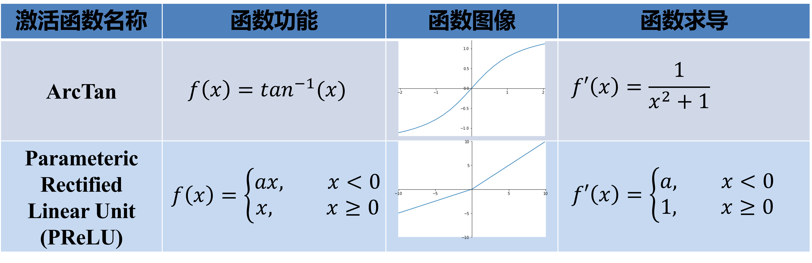
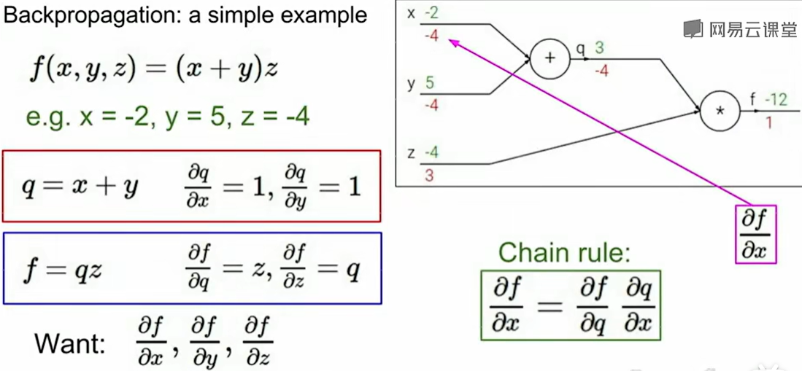
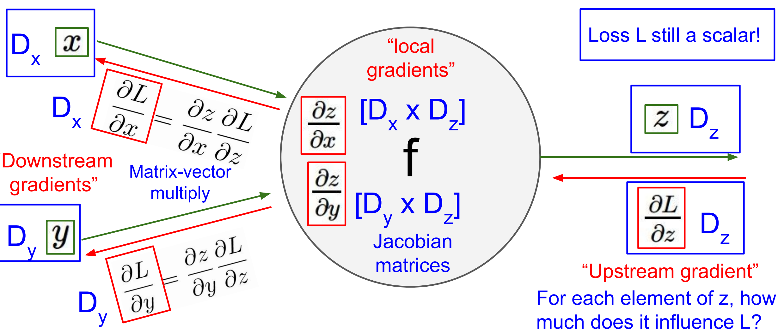
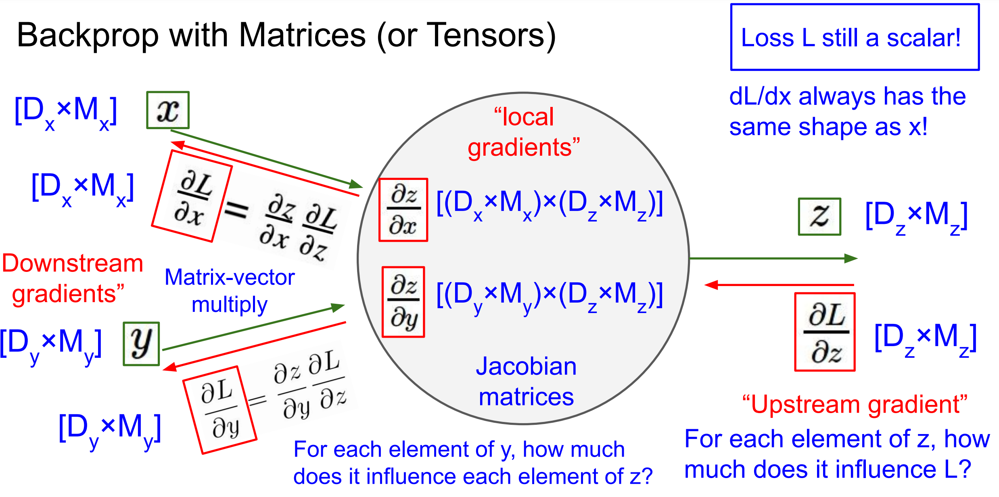

# 神经网络

> 这里推荐一个网站：playground.tensorflow.org，这里可以可视化的看到不同的神经网络到底在什么，以及神经网络是如何做一些非线性的决策边界的。

## 结构

许多sigmoid单元堆叠起来形成一个神经网络。

1. 输入特征$$x_1$$、$$x_2$$、$$x_3$$，它们被竖直地堆叠起来，这叫做神经网络的**输入层**。它包含了神经网络的输入
2. 另外一层我们称之为**隐藏层**（中间四个结点）。这些中间结点的准确值我们是不知道到的
3. 最后一层只由一个结点构成，而这个只有一个结点的层被称为**输出层**，它负责产生预测值

类似的，我们可以多加一点隐藏层

## 激活函数

------

到目前为止，只用过**sigmoid**激活函数，但是，有时其他的激活函数效果会更好。这里介绍并比较4种

> Q : 为什么需要非线性的激活函数？换句话说是否可以去掉激活函数这一步？
>
> A : 如果没有激活函数，那么神经网络就是简单的线性变换，无法解决一些非线性的问题，比如最简单的 xor （异或）。自从有了激活函数之后，可以将数据从线性空间映射到非线性空间，这使得神经网络可以分离一些原始输入中无法线性分割的数据。而且不止如此，**多层的神经网络函数可以以任意的精度去拟合任意的连续函数**。

### sigmoid函数

除了输出层是一个二分类问题（$$\hat{y}$$ 的数值介于0和1之间）基本不会用它，性能比较差。
$$
a=g(z)=\frac{1}{1 + e^{-z}}
$$

$$
\frac{d}{dz}g(z) = {\frac{1}{1 + e^{-z}} (1-\frac{1}{1 + e^{-z}})}=g(z)(1-g(z))
$$

- sigmoid神经元的激活在接近0或1处时会饱和：在这些区域，梯度几乎为0，导致梯度消失。为了防止饱和，必须对于权重矩阵初始化特别留意。比如，如果初始化权重过大，那么大多数神经元将会饱和，导致网络就几乎不学习了。
- *Sigmoid函数的输出不是零中心的*。这一情况将影响梯度下降的运作，因为如果输入神经元的数据总是正数，那么关于w的梯度在反向传播的过程中，将会要么全部是正数，要么全部是负数，这将会导致梯度下降权重更新时出现z字型的下降。

### tanh函数

$$
g(z)= tanh(z) = \frac{e^{z} - e^{- z}}{e^{z} + e^{- z}}
$$

$$
\frac{d}{{d}z}g(z) = 1 - (tanh(z))^{2}
$$

事实上，**tanh**函数是**sigmoid**的向下平移和伸缩后的结果。**tanh**函数在所有场合都优于**sigmoid**函数，因为其输出的平均值接近于零，因此它可以更好地将数据集中到下一层。

**sigmoid**函数和**tanh**函数两者共同的缺点是，在 $$z$$ 特别大或者特别小的情况下，导数的梯度或者函数的斜率会变得特别小，最后就会接近于0，导致降低梯度下降的速度。

### Relu函数

**Relu**是最常用的激活函数，如果不确定用哪个激活函数，就使用**ReLu**。
$$
g(x) =max( 0,z)
$$

$$
g(z)^{'}=
  \begin{cases}
  0&	\text{if z < 0}\\
  1&	\text{if z > 0}\\
undefined&	\text{if z = 0}
\end{cases}
$$

只要$$z$$是正值的情况下，导数恒等于1，当$$z$$是负值的时候，导数恒等于0。

- 相较于sigmoid和tanh函数，ReLU对于随机梯度下降的收敛有巨大的加速作用（ [Krizhevsky ](https://link.zhihu.com/?target=http%3A//www.cs.toronto.edu/~fritz/absps/imagenet.pdf)等的论文指出有6倍之多）。据称这是由它的线性，非饱和的公式导致的。
- sigmoid和tanh神经元含有指数运算等耗费计算资源的操作，而ReLU可以简单地通过对一个矩阵进行阈值计算得到。
- **缺点**：在训练的时候，当一个很大的梯度流过ReLU的神经元的时候，可能会导致梯度更新到一种特别的状态，在这种状态下神经元将无法被其他任何数据点再次激活。如果这种情况发生，那么从此所以流过这个神经元的梯度将都变成0。也就是说，这个ReLU单元在训练中将不可逆转的*死亡*，因为这导致了数据多样化的丢失。

### Leaky ReLu函数

Leaky ReLU是为解决“ReLU死亡”问题的尝试。
$$
a = max( 0.01z,z)
$$

$$
g(z)^{'}=
\begin{cases}
0.01& 	\text{if z < 0}\\
1&	\text{if z > 0}\\
undefined&	\text{if z = 0}
\end{cases}
$$

常数不一定是0.01，可以为学习算法选择不同的参数。

最后需要注意一点：在同一个网络中混合使用不同类型的神经元是非常少见的，虽然没有什么根本性问题来禁止这样做。

## 神经网络计算流程

------

1. 初始化参数 $$W^{[1]}, W^{[2]},b^{[1]},b^{[2]}$$
2. 对所有样本，由参数 $$W^{[1]}, W^{[2]},b^{[1]},b^{[2]}$$ 计算预测值 $$\hat{y}$$
3. 计算损失 $$J(W^{[1]},b^{[1]},W^{[2]},b^{[2]}) = {\frac{1}{m}}\sum_{i=1}^mL(\hat{y}, y)$$
4. 计算导数 $$dW^{[1]}, dW^{[2]},db^{[1]},db^{[2]}$$ ，并更新参数
5. 回到步骤 2 进行下一轮计算，直到模型可被接受

> Q1：为什么在初始化时要将参数设置为随机数？不能全为0吗？
>
> A1：如果全设置为 0 ，同一层的各个节点参数就是一样的，并且在之后的训练中，同一层的各个节点参数仍然保持一致，这是我们不愿意看到的情况。对于笔记开始的那个神经网络来讲，可以这么写：
> $$
> W^{[1]} = np.random.randn(2,2)\;*\;0.01\;,\;b^{[1]} = np.zeros((2,1))
> $$
>
> $$
> W^{[2]} = np.random.randn(2,2)\;*\;0.01\;,\;b^{[2]} = 0
> $$
>
> Q2：为什么要乘 0.01？
>
> A2：对于sigmoid函数和tanh函数，如果参数 $$W$$ 过大，激活函数的输入也非常大，从而导致梯度接近于零，换句话说就是“学得慢”。所以我们希望参数 $$W$$ 能接近 0

## 反向传播与计算图

利用计算图和链式法则，我们可以一步一步计算复杂函数的导数。

- **加法门单元**把输出的梯度相等地分发给它所有的输入
- **取最大值门单元**对梯度做路由。和加法门不同，取最大值门将梯度转给其中一个输入，这个输入是在前向传播中值最大的那个输入。
- **乘法门单元**相互交换梯度

例子2：对于如下式子
$$
f(w,x)=\frac{1}{1+e^{-(w_0x_0+w_1x_1+w_2)}}
$$

从最右边开始，假设误差为1.00

对于 $$f(x)=\frac{1}{x}$$，$$\frac{df}{dx}=-\frac{1}{x^2}$$，传递的误差为$$-\frac{1}{1.37^2} \times 1.00=-0.53$$

对于 $$f(x)=c+x$$，$$\frac{df}{dx}=1$$，传递的误差为$$1 \times -0.53=-0.53$$

对于 $$f(x)=e^x$$，$$\frac{df}{dx}=e^x$$，传递的误差为$$e^{-1.00} \times -0.53=-0.20$$

对于 $$f(x)=-x$$，$$\frac{df}{dx}=-1$$，传递的误差为$$-1 \times -0.20=0.20$$

对于 $$f(x)=x+x'$$，$$\frac{df}{dx}=1$$，传递的误差为$$1 \times 0.20=0.20$$

对于 $$f(x)=x\cdot x'$$，$$\frac{\partial f}{\partial x}=x'$$，对于$$w_0$$，传递的误差为$$-1.00 \times 0.20=-0.20$$，对于$$x_0$$，传递的误差为$$2.00 \times 0.20=0.40$$，对于$$w_1$$，传递的误差为$$-2.00 \times 0.20=-0.40$$，对于$$x_1$$，传递的误差为$$-3.00 \times 0.20=-0.60$$

例子3：

$$
\begin{align}
&In_{h_1}=w_1*x_1+w_3*x_2 \\
&h1 = Out_{h_1}=Sigmoid(In_{h_1}) \\
&In_{h_2}=w_2*x_1+w_4*x_2 \\
&h2 = Out_{h_2}=Sigmoid(In_{h_2}) \\
&In_{o_1}=w_5*h_1+w_7*h_2\\
&o_1=Out_{o_1}=Sigmoid(In_{o_1})\\
&In_{o_2}=w_6*h_1+w_8*h_2\\
&o_2=Out_{o_2}=Sigmoid(In_{o_2})\\
&Error=\frac{1}{2}\sum_{i=1}^2(o_i-y_i)^2
\end{align}
$$
如果要计算w5的梯度：
$$
\begin{align}
\delta_5= \frac{\partial Error}{\partial o_1} *\frac{\partial o_1}{\partial In_{o_1}} * \frac{\partial In_{o_1}}{\partial w_5} \\
\frac{\partial Error}{\partial o_1} = o_1-y_1 \\
\frac{\partial o_1}{\partial In_{o_1}}= o_1 *(1-o_1)\\
\frac{\partial In_{o_1}}{\partial w_5} = h_1
\end{align}
$$
如果要计算w1的梯度：
$$
\begin{align}
\delta_5= &\frac{\partial Error}{\partial o_1} *\frac{\partial o_1}{\partial In_{o_1}} * \frac{\partial In_{o_1}}{\partial h_1} *\frac{\partial h_1}{\partial In_{h_1}}*\frac{\partial In_{h_1}}{\partial w_1}+\\
&\frac{\partial Error}{\partial o_2} *\frac{\partial o_2}{\partial In_{o_2}} * \frac{\partial In_{o_2}}{\partial h_1} *\frac{\partial h_1}{\partial In_{h_1}}*\frac{\partial In_{h_1}}{\partial w_1}

\end{align}
$$
更新参数公式：
$$
w_i'=w_i-\eta * \delta_i
$$

## 向量与矩阵求导

当我们想要向量化公式，在求导时，注意向量对向量求导得到的是雅可比矩阵。

当我们使用向量代表x,y,z时，注意各个偏导的维数。

当我们使用矩阵代表x,y,z时

## 一些思考

理解具有全连接层的神经网络的一个方式是：可以认为它们定义了一个由一系列函数组成的函数族，网络的权重就是每个函数的参数。如此产生的问题是：该函数族的表达能力如何？存在不能被神经网络表达的函数吗？

现在看来，拥有至少一个隐层的神经网络是一个*通用的近似器*。换句话说，神经网络可以近似任何连续函数。

既然一个隐层就能近似任何函数，那为什么还要构建更多层来**将网络做得更深**？答案是：虽然一个2层网络在数学理论上能完美地近似所有连续函数，但在实际操作中效果相对较差。

另外，在实践中3层的神经网络会比2层的表现好，然而**继续加深（做到4，5，6层）很少有太大帮助**。卷积神经网络的情况却不同，在卷积神经网络中，对于一个良好的识别系统来说，深度是一个极端重要的因素（比如数十(以10为量级)个可学习的层）。对于该现象的一种解释观点是：因为图像拥有层次化结构（比如脸是由眼睛等组成，眼睛又是由边缘组成），所以多层处理对于这种数据就有直观意义。

看起来如果数据不是足够复杂，则似乎小一点的网络更好，因为可以防止过拟合。然而并非如此，防止神经网络的过拟合有很多方法（L2正则化，dropout和输入噪音等），后面会详细讨论。在实践中，使用这些方法来控制过拟合比减少网络神经元数目要好得多。

不要减少网络神经元数目的主要原因在于小网络更难使用梯度下降等局部方法来进行训练：虽然小型网络的损失函数的局部极小值更少，也比较容易收敛到这些局部极小值，但是这些最小值一般都很差，损失值很高。相反，大网络拥有更多的局部极小值，但就实际损失值来看，这些局部极小值表现更好，损失更小。因为神经网络是非凸的，就很难从数学上研究这些特性。

在实际中，你将发现如果训练的是一个小网络，那么最终的损失值将展现出多变性：某些情况下运气好会收敛到一个好的地方，某些情况下就收敛到一个不好的极值。从另一方面来说，如果你训练一个大的网络，你将发现许多不同的解决方法，但是最终损失值的差异将会小很多。这就是说，所有的解决办法都差不多，而且对于随机初始化参数好坏的依赖也会小很多。

需要记住的是：**不应该因为害怕出现过拟合而使用小网络。相反，应该进尽可能使用大网络，然后使用正则化技巧来控制过拟合。**

## Softmax 回归

复习一下：之前学习的**logistic**回归只有两种可能的标记，0或1，表示这是一只猫或者不是一只猫。

但是，如果想要识别猫，狗和小鸡，把猫叫做类1，狗为类2，小鸡是类3，如果不属于以上任何一类，分到类0。怎么办

**logistic**回归的一般形式，**Softmax**分类器可以理解为逻辑回归分类器面对多个分类的一般化归纳。Softmax的输出（归一化的分类概率）更加直观，并且从概率上可以解释。

> softmax可以看作将MLP输出的数值（在代码中常被称为logits），转换为有意义的概率

总结一下从$$z^{[l]}$$到$$a^{[l]}$$的公式：
$$
t=e^{z^{[l]}}
$$

$$
a_{i}^{[l]} = \frac{t_{i}}{\sum_{j =1}^{4}t_{i}}
$$

-   其中，$$t$$ 只是一个中间变量。
-   $$z^{[l]}$$，$$a^{[l]}$$ 和 $$t$$ 都是向量，维度为（$$n^{[l]}$$，1）

损失函数为**交叉熵损失**（**cross-entropy loss）**：
$$
L(\hat y,y ) = - \sum_{j = 1}^{n^{[l]}}{y_{j}log\hat y_{j}}
$$

$$
J( w^{[1]},b^{[1]},\ldots\ldots) = \frac{1}{m}\sum_{i = 1}^{m}{L( \hat y^{(i)},y^{(i)})}
$$

> “softmax”这个名字是怎么回事？此操作的“硬”版本称为 argmax，只需找到 最大值，将其设置为 1.0，并将 0.0 分配给所有其他值。相比之下，softmax 操作是它的“软”版本。由于 softmax 中涉及的幂，因此 强调最大值并将其推向 1.0，同时仍保持概率分布 在所有输入值上。这允许更细致入微的表示，不仅捕获最 可能的选择，以及其他选择的相对可能性。
>
> Softmax分类器的命名是从*softmax函数*那里得来的，softmax函数将原始分类评分变成正的归一化数值，所有数值和为1，这样处理后交叉熵损失才能应用。注意从技术上说“softmax损失（softmax loss）”是没有意义的，因为softmax只是一个压缩数值的函数。但是在这个说法常常被用来做简称。
