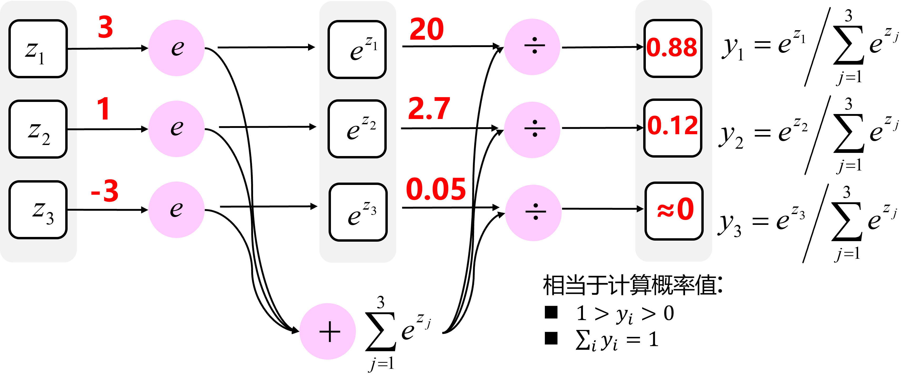

# 深层神经网络

## 符号补充

- $L$ 表示层数，上图 $L=4$
- 对于每层都用 ${a}^{[l]}$ 来记作 $l$ 层激活后结果，$g^{[l]}$ 表示选择的激活函数
- 输入的特征记作 $x$， $x$ 同样也是0层的激活函数，所以 $x={a}^{[0]}$
- 最后一层的激活函数，所以 ${a}^{[L]}$ 等于这个神经网络所预测的输出结果
- $n^{[l]}$ 表示第 $l$ 层的结点数

## 神经网络计算流程和公式

------

> 复习一下：
>
> 1. 初始化每层参数 $W^{[l]},b^{[l]}$
> 2. 对所有样本，由参数 $W^{[l]},b^{[l]}$ 计算预测值 $\hat{y}$ （前向传播）
> 3. 计算损失 $J(W^{[l]},b^{[l]}) = {\frac{1}{m}}\sum_{i=1}^mL(\hat{y}, y)$
> 4. 计算导数 $dW^{[l]}, db^{[l]}$ ，并更新参数（反向传播）
> 5. 回到步骤 2 进行下一轮计算，直到模型可被接受

### 前向传播

前向传播的公式为（一层结点，单一样本）：
$$
\underbrace{{z}^{[l]}}_{(n^{[l]},1)}=\underbrace{{W}^{[l]}}_{(n^{[l]},n^{[l-1]})}\cdot\underbrace{{a}^{[l-1]}}_{(n^{[l-1]},1)}+\underbrace{{b}^{[l]}}_{(n^{[l]},1)}
$$

$$
\underbrace{{a}^{[l]}}_{(n^{[l]},1)}={{g}^{[l]}} (\underbrace{{z}^{[l]}}_{(n^{[l]},1)})
$$

> 复习一下：$W^{[l]}$ 是由每个结点的参数 $w^{[i]}$ 堆叠起来的
> $$
> W^{[l]}=
> \left[
> 		\begin{array}{c}
> 		...w^{[l]T}_{1}...\\
> 		...w^{[l]T}_{2}...\\
> 		...w^{[l]T}_{3}...\\
> 		..........\\
> 		...w^{[l]T}_{n^{[l]}}...
> 		\end{array}
> \right]
> $$

前向传播的向量化公式（一层结点，所有样本）：
$$
\underbrace{{Z}^{[l]}}_{(n^{[l]},m)}=\underbrace{{W}^{[l]}}_{(n^{[l]},n^{[l-1]})}\cdot \underbrace{{A}^{[l-1]}}_{(n^{[l-1]},m)}+\underbrace{{b}^{[l]}}_{(n^{[l]},1)}
$$

$$
\underbrace{{A}^{[l]}}_{(n^{[l-1]},m)}={g}^{[l]}(\underbrace{{Z}^{[l]}}_{(n^{[l]},m)})
$$

> 复习一下：
>
> $Z^{[l]}$ 是由所有样本的 $z^{[l]}$ 组合起来的
> $$
> Z^{[l]} =
> 	\left[
> 		\begin{array}{c}
> 		\vdots & \vdots & \vdots & \vdots\\
> 		z^{[l](1)} & z^{[l](2)} & \cdots & z^{[l](m)}\\
> 		\vdots & \vdots & \vdots & \vdots\\
> 		\end{array}
> 	\right]
> $$
> ${b}^{[l]}$ 的维度本应是 $(n^{[l]},m)$， 因为对于每个样本 ${b}^{[l]}$ 都是一样的，所以可以用 numpy 的广播技术自动填充

### 反向传播

直接给出向量化的结论：
$$
d{{Z}^{[l]}}=d{{A}^{[l]}}*{{g}^{\left[ l \right]}}'\left({{Z}^{[l]}} \right)
$$

$$
d{{W}^{[l]}}=\frac{1}{m}\text{}d{{Z}^{[l]}}\cdot {{A}^{\left[ l-1 \right]T}}
$$

$$
d{{b}^{[l]}}=\frac{1}{m}\sum_{i=1}^{m} d{{z}^{[l]}}
$$

$$
d{{A}^{[l-1]}}={{W}^{\left[ l \right]T}}.d{{Z}^{[l]}}
$$

注意维度，维度上面已经给出不再给了，导数的维度与原维度相同

## 一些思考

理解具有全连接层的神经网络的一个方式是：可以认为它们定义了一个由一系列函数组成的函数族，网络的权重就是每个函数的参数。如此产生的问题是：该函数族的表达能力如何？存在不能被神经网络表达的函数吗？

现在看来，拥有至少一个隐层的神经网络是一个*通用的近似器*。换句话说，神经网络可以近似任何连续函数。

既然一个隐层就能近似任何函数，那为什么还要构建更多层来**将网络做得更深**？答案是：虽然一个2层网络在数学理论上能完美地近似所有连续函数，但在实际操作中效果相对较差。

另外，在实践中3层的神经网络会比2层的表现好，然而**继续加深（做到4，5，6层）很少有太大帮助**。卷积神经网络的情况却不同，在卷积神经网络中，对于一个良好的识别系统来说，深度是一个极端重要的因素（比如数十(以10为量级)个可学习的层）。对于该现象的一种解释观点是：因为图像拥有层次化结构（比如脸是由眼睛等组成，眼睛又是由边缘组成），所以多层处理对于这种数据就有直观意义。

看起来如果数据不是足够复杂，则似乎小一点的网络更好，因为可以防止过拟合。然而并非如此，防止神经网络的过拟合有很多方法（L2正则化，dropout和输入噪音等），后面会详细讨论。在实践中，使用这些方法来控制过拟合比减少网络神经元数目要好得多。

不要减少网络神经元数目的主要原因在于小网络更难使用梯度下降等局部方法来进行训练：虽然小型网络的损失函数的局部极小值更少，也比较容易收敛到这些局部极小值，但是这些最小值一般都很差，损失值很高。相反，大网络拥有更多的局部极小值，但就实际损失值来看，这些局部极小值表现更好，损失更小。因为神经网络是非凸的，就很难从数学上研究这些特性。

在实际中，你将发现如果训练的是一个小网络，那么最终的损失值将展现出多变性：某些情况下运气好会收敛到一个好的地方，某些情况下就收敛到一个不好的极值。从另一方面来说，如果你训练一个大的网络，你将发现许多不同的解决方法，但是最终损失值的差异将会小很多。这就是说，所有的解决办法都差不多，而且对于随机初始化参数好坏的依赖也会小很多。

需要记住的是：**不应该因为害怕出现过拟合而使用小网络。相反，应该进尽可能使用大网络，然后使用正则化技巧来控制过拟合。**

## Softmax 回归

------

复习一下：之前学习的**logistic**回归只有两种可能的标记，0或1，表示这是一只猫或者不是一只猫。

但是，如果想要识别猫，狗和小鸡，把猫叫做类1，狗为类2，小鸡是类3，如果不属于以上任何一类，分到类0。怎么办

**logistic**回归的一般形式，**Softmax**分类器可以理解为逻辑回归分类器面对多个分类的一般化归纳。Softmax的输出（归一化的分类概率）更加直观，并且从概率上可以解释。

> softmax可以看作将MLP输出的数值（在代码中常被称为logits），转换为有意义的概率

总结一下从$z^{[l]}$到$a^{[l]}$的公式：
$$
t=e^{z^{[l]}}
$$

$$
a_{i}^{[l]} = \frac{t_{i}}{\sum_{j =1}^{4}t_{i}}
$$

-   其中，$t$ 只是一个中间变量。
-   $z^{[l]}$，$a^{[l]}$ 和 $t$ 都是向量，维度为（$n^{[l]}$，1）

损失函数为**交叉熵损失**（**cross-entropy loss）**：
$$
L(\hat y,y ) = - \sum_{j = 1}^{n^{[l]}}{y_{j}log\hat y_{j}}
$$

$$
J( w^{[1]},b^{[1]},\ldots\ldots) = \frac{1}{m}\sum_{i = 1}^{m}{L( \hat y^{(i)},y^{(i)})}
$$

> “softmax”这个名字是怎么回事？此操作的“硬”版本称为 argmax，只需找到 最大值，将其设置为 1.0，并将 0.0 分配给所有其他值。相比之下，softmax 操作是它的“软”版本。由于 softmax 中涉及的幂，因此 强调最大值并将其推向 1.0，同时仍保持概率分布 在所有输入值上。这允许更细致入微的表示，不仅捕获最 可能的选择，以及其他选择的相对可能性。
>
> Softmax分类器的命名是从*softmax函数*那里得来的，softmax函数将原始分类评分变成正的归一化数值，所有数值和为1，这样处理后交叉熵损失才能应用。注意从技术上说“softmax损失（softmax loss）”是没有意义的，因为softmax只是一个压缩数值的函数。但是在这个说法常常被用来做简称。
