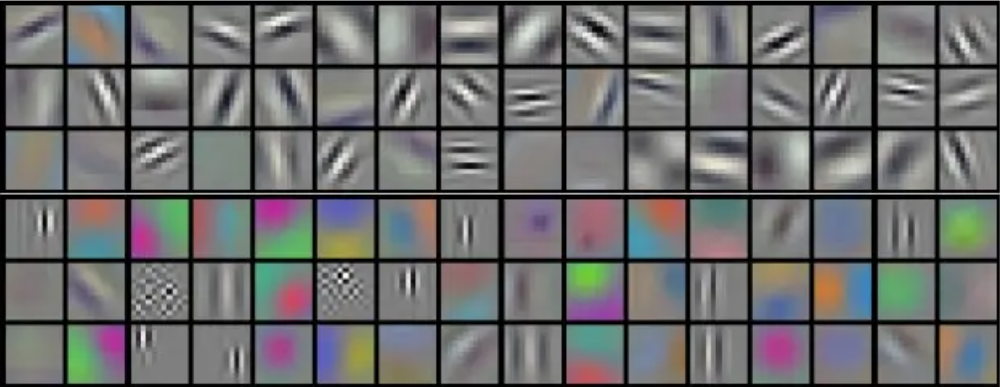
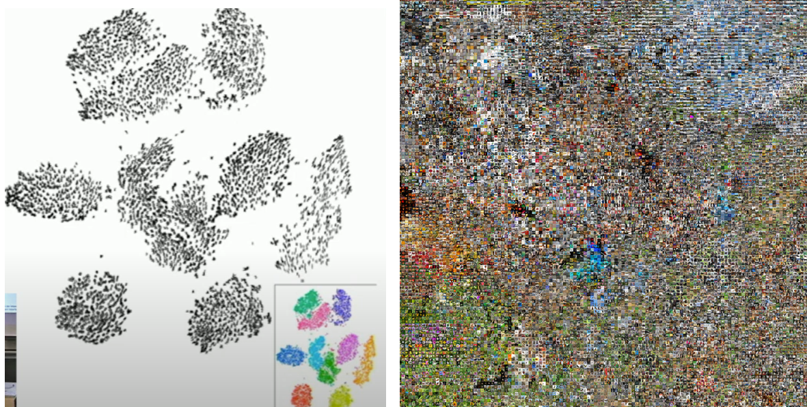
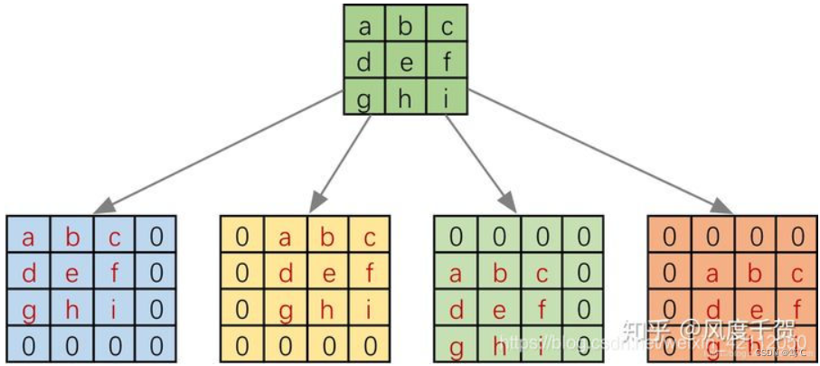

# 卷积神经网络

## 边缘检测示例

卷积运算是卷积神经网络最基本的组成部分，这一小节使用边缘检测作为入门样例。


-   如上图，左边是一个6×6的灰度图像。（因为是灰度图像，没有RGB三通道，所以它是6×6×1的矩阵，而不是6×6×3的）
-   为了检测图像中的垂直边缘，构造中间的一个3×3矩阵，被称为过滤器（在论文它有时候会被称为核）。
-   对这个6×6的图像进行卷积运算，卷积运算用“$$*$$”来表示，用3×3的过滤器对其进行卷积。
-   这个卷积运算的输出将会是一个4×4的矩阵，可以将它看成一个4×4的图像。

>   过滤器先和对应灰度图像矩阵进行元素乘法（**element-wise products**）运算，再求和得到输出值。对于输出的左上角值 $$-5$$ 来说，计算过程如下：
>   $$
>   \begin{bmatrix} 3 \times 1 & 0 \times 0 & 1 \times \left(1 \right) \\ 1 \times 1 & 5 \times 0 & 8 \times \left( - 1 \right) \\ 2 \times1 & 7 \times 0 & 2 \times \left( - 1 \right) \\ \end{bmatrix} = \begin{bmatrix}3 & 0 & - 1 \\ 1 & 0 & - 8 \\ 2 & 0 & - 2 \\\end{bmatrix}
>   $$
>
>   $$
>   3+1+2+0+0 +0+(-1)+(-8) +(-2)=-5
>   $$

为什么这样可以做垂直边缘检测呢？这是另外一个例子。把输出看做图像，它能很好地体现图片边缘，而不是每一个像素点的灰度。


在这个例子中，好像检测到的边缘太粗了，是因为在这个例子中图片太小了。如果用一个1000×1000的图像，而不是6×6的图片，会发现其会很好地检测出图像中的垂直边缘。


> 卷积具有平移不变性，比方说目标是在图像的左上角，经过卷积之后，目标的特征也会在特征图的左上角；目标在图像的左下角，经过相同的卷积核卷积之后，目标的特征也会在特征图的左下角。
>
> 类似的，最大池化也可以看作具有平移不变性

## 更多过滤器选择

当然，过滤器不止这一种，来看看更多过滤器例子：


通过使用不同的过滤器，可以找出垂直的或是水平的边缘。

**Sobel**过滤器：$$\begin{bmatrix}1 & 0 & - 1 \\ 2 & 0 & - 2 \\ 1 & 0 & - 1 \\\end{bmatrix}$$，它的优点在于增加了中间一行元素的权重，这使得结果的鲁棒性会更高一些。

**Scharr**过滤器：$$\begin{bmatrix} 3& 0 & - 3 \\ 10 & 0 & - 10 \\ 3 & 0 & - 3 \\\end{bmatrix}$$，实际上也是一种垂直边缘检测，如果你将其翻转90度，你就能得到对应水平边缘检测。


如上图，甚至不一定要去使用那些研究者们所选择的这九个数字，可以把这矩阵中的9个数字当成9个参数，并且在之后可以学习使用反向传播算法，其目标就是去理解这9个参数。

一些卷积核（kernel）的例子，尺寸都是[11x11]：



当图片某些部分与卷积核模式一致时，卷积核会给出强烈的响应，可以看作卷积核在积极寻找和匹配某种模式。

## Padding

为了构建深度神经网络，一个基本的卷积操作就是**padding**。

如果按照之前的方式运算，用一个3×3的过滤器卷积一个6×6的图像，最后会得到一个4×4的输出矩阵。那是因为3×3过滤器在6×6矩阵中，只可能有4×4种可能的位置。

>    这背后的数学解释是，对于$$n×n$$的图像，用$$f×f$$的过滤器做卷积，那么输出的维度就是$$(n-f+1)×(n-f+1)$$。

这样的话会有两个缺点：

1.   每次做卷积操作，图像就会缩小，从6×6缩小到4×4，可能做了几次之后，图像就会变得很小了，甚至可能会缩小到只有1×1的大小。
2.   那些在角落或者边缘区域的像素点，相比更靠中间的像素点，在输出中采用较少，意味着丢掉了图像边缘位置的许多信息。

为了解决这些问题，可以在卷积操作之前填充这幅图像。在这个案例中，可以沿着图像边缘再填充一层像素（习惯上，可以用0去填充）。如果6×6的图像被填充成了一个8×8的图像。再用3×3的过滤器做卷积，就会得到6×6的与原来大小相同的图像。


- **Valid**卷积方法不填充图像，将会给你一个$$(n-f+1)×(n-f+1)$$维的输出。
- **Same**卷积方法填充图像并得到和输入大小一样的输出，具体来说，填充$$p=(f-1)/2$$个像素点。
- **full**卷积方法从filter和image刚相交开始做卷积


习惯上，计算机视觉中，$$f$$通常是奇数。因为只有$$f$$是奇数的情况下，**Same**卷积才会有自然的填充，并且奇数维过滤器有一个中心点，在计算机视觉里，如果有一个中心像素点会更方便，便于指出过滤器的位置。

## 卷积步长

这里引入卷积步长的概念，之前例子中卷积步长为1，意思是每次移动一格，向右或向下。


我们可以设置卷积步长为其他值，比如上图这个例子卷积步长为2，在计算完最左上角的$$3*3$$个元素（左上角为2）之后，计算左上角为7的$$3*3$$个元素。

当移动到下一行的时候，也是使用步长2，所以蓝色框移动到这里：


如果跳到某一位置时蓝色框（过滤器）不能覆盖原矩阵，则不进行计算。

总结一下维度情况，如果有一个$$n×n$$的矩阵或者$$n×n$$的图像，与一个$$f×f$$的矩阵卷积，或者说$$f×f$$的过滤器。**Padding**是$$p$$，步幅为$$s$$，输出尺寸为：
$$
\lfloor{\frac{n + 2p - f}{s}}+1\rfloor \times \lfloor{\frac{n + 2p - f}{s}}+1\rfloor
$$


## 多通道卷积

假如不仅想检测灰度图像的特征，也想检测**RGB**彩色图像的特征。彩色图像如果是6×6×3，这里的3指的是三个颜色通道，你可以把它想象成三个6×6图像的堆叠。为了检测图像的边缘或者其他的特征，需要跟一个三维的过滤器做卷积，它的维度是3×3×3，这样这个过滤器也有三层，对应红绿、蓝三个通道。


一个6×6×3的输入图像卷积上一个3×3×3的过滤器，步长为1，不使用Padding，得到一个4×4的二维输出。


当然可以使用多个过滤器，再把输出堆叠得到三维输出。一个6×6×3的输入图像卷积上两个3×3×3的过滤器，步长为1，不使用Padding，得到一个4×4×2的三维输出。

总结一下维度，如果有一个$$n \times n \times n_{c}$$的输入图像，这里的$$n_{c}$$就是通道数目，然后卷积上一个$$f×f×n_{c}$$的过滤器，按照惯例，前一个$$n_{c}$$和后一个$$n_{c}$$必须数值相同，步长为1，不使用Padding，然后得到$$(n-f+1)×(n-f+1)×n_{c^{'}}$$的输出，这里$$n_{c^{'}}$$其实就是下一层的通道数，它就是用的过滤器的个数。


> 注：2D卷积并考虑通道数，与3D卷积但不考虑通道数一样，都是想象为立方体。
>
> - 1D 卷积（不考虑多通道）：卷积核是一个向量
> - 2D 卷积（不考虑多通道）：卷积核是一个矩阵
> - 3D 卷积（不考虑多通道）：卷积核是一个立方体

##  单层卷积网络

现在考虑将这些卷积操作对应到神经网络中。

复习一下，在从输入$$a^{\left\lbrack 0\right\rbrack}$$（也就是$$x$$）前向传播到$$a^{[1]}$$时，我们做的计算是：
$$
z^{[1]} = W^{[1]}a^{[0]} + b^{[1]}
$$

$$
a^{[1]} = g(z^{[1]})
$$

我们使用之前的例子，有一个6×6×3的输入图像卷积上两个3×3×3的过滤器，步长为1，不使用Padding。现在我们做对应：


-   6×6×3的输入图像为$$a^{\left\lbrack 0\right\rbrack}$$（也就是$$x$$）
-   两个3×3×3的过滤器为$$W^{[1]}$$
-   两个4×4的输出为$$W^{[1]}a^{[0]}$$
-   再加上偏差$$b^{[1]}$$，然后应用激活函数$$g$$，演化为一个4×4×2维度的$$a^{[1]}$$

最后总结一下用于描述卷积神经网络中的一层（以$$l$$层为例），也就是卷积层的各种标记：

-   $$f^{[l]}$$表示表示$$l$$层中过滤器大小为$$f×f$$
-   $$p^{[l]}$$来标记**Padding**的数量
-   $$s^{[l]}$$标记步幅
-   某层数据维度表示为$$n_{H}^{[l]} \times n_{W}^{[l]} \times n_{c}^{[l]}$$，分别为高，宽，颜色通道数
-   这一层的输入会是$$n_{H}^{\left\lbrack l - 1 \right\rbrack} \times n_{W}^{\left\lbrack l - 1 \right\rbrack} \times n_{c}^{\left\lbrack l - 1\right\rbrack}$$，因为它是上一层的激活值
-   这一层的输出$$n_{H}^{[l]} = \lfloor\frac{n_{H}^{\left\lbrack l - 1 \right\rbrack} +2p^{[l]} - f^{[l]}}{s^{[l]}} +1\rfloor$$
-   这一层的输出$$n_{W}^{[l]} = \lfloor\frac{n_{W}^{\left\lbrack l - 1 \right\rbrack} +2p^{[l]} - f^{[l]}}{s^{[l]}} +1\rfloor$$
-   这一层的输出$$n_{c}^{[l]}$$等于该层中过滤器的数量
-   复习一下，过滤器中通道的数量必须与输入中通道的数量一致，所以所有过滤器维度等于$$f^{[l]} \times f^{[l]} \times n_{c}^{\left\lbrack l - 1 \right\rbrack}$$
-   如果有$$m$$个例子，就是有$$m$$个激活值的集合，那么输出$$A^{[l]} = m \times n_{H}^{[l]} \times n_{W}^{[l]} \times n_{c}^{[l]}$$


在多层卷积处理完成后，可以将输出平滑或展开成多个单元。平滑处理后可以输出一个向量，再做后续处理。

一个典型的卷积神经网络通常有三层：

-   一个是卷积层，我们常常用**Conv**来标注。
-   一个是池化层，我们称之为**POOL**。
-   最后一个是全连接层，用**FC**表示。

虽然仅用卷积层也有可能构建出很好的神经网络，但大部分神经网络架构师依然会添加池化层和全连接层。幸运的是，池化层和全连接层比卷积层更容易设计。后两节会快速讲解这两个概念。

## 池化层

除了卷积层，卷积网络也经常使用池化层来缩减模型的大小，提高计算速度，同时提高所提取特征的鲁棒性。


先举一个池化层的例子，输入是一个4×4矩阵，用到的池化类型是最大池化（**max pooling**）。执行最大池化的树池是一个2×2矩阵。把4×4的输入拆分成不同的色块。对于2×2的输出，输出的每个元素都是其对应色块中的最大元素值。

这就像是应用了一个规模为2的过滤器（只是像，没有使用过滤器），因为我们选用的是2×2区域，步幅是2，这些就是最大池化的超参数。即$$f=2$$，$$s=2$$。

之前计算卷积层输出大小的公式同样适用于最大池化，即$$\lfloor\frac{n + 2p - f}{s} + 1\rfloor$$，而$$n_c$$保持不变（对$$n_c$$个通道分别做池化）。

大部分情况下，最大池化很少用**Padding**。初始设置好之后池化过程中没有需要学习的参数。

最大化运算的实际作用就是，如果在过滤器中提取到某个特征，那么保留其最大值（类似神经元中激发程度超过阈值，超过阈值的那个数是最重要的）。尽管刚刚描述的直观理解经常被引用，但人们使用最大池化的主要原因是此方法在很多实验中效果都很好。

另外还有一种类型的池化，平均池化，这种运算顾名思义，选取的是每个区域的平均值。目前来说，最大池化比平均池化更常用。

## 卷积神经网络示例

这节加入全连接层并给出一个简单卷积神经网络示例。

有一张大小为32×32×3的输入图片，这是一张**RGB**模式的图片，如果想识别这张图片有从0-9这10个数字中的哪一个，可以构建一个神经网络来实现这个功能。


结构为：输入->卷积层1->池化层1->卷积层2->池化层2->全连接层1->全连接层2->softmax得到输出。

它有很多超参数，关于如何选定这些参数，之后会提供更多建议。常规做法是，尽量不要自己设置超参数，而是查看文献中别人采用了哪些超参数，选一个在别人任务中效果很好的架构，那么它也有可能适用于你自己的应用程序。

一个普遍的规律是，随着层数增加，高度$$n_{H}$$和宽度$$n_{W}$$都会减小，而通道数量$$n_{c}$$会增加，激活值尺寸会逐渐变小。

>    **Q：为什么使用卷积？**
>
>   A：假设有一张32×32×3维度的图片，用了6个大小为5×5的过滤器，输出维度为28×28×6。
>
>   不使用卷积，两层中的每个神经元彼此相连，然后计算权重矩阵，它等于4074×3072≈1400万，所以要训练的参数很多。
>
>   使用卷积，计算卷积层的参数数量，每个过滤器都是5×5，再加上偏差参数，每个过滤器就有26个参数，一共有6个过滤器，所以参数共计156个，参数数量很少。并且当图片变大时，参数数量不会变多因为它与输入无关。
>
>   简单来说，参数很少，代价很小，但依然有效。

## 直观理解

在一个多层的卷积神经网络中，可以把前面的卷积层看作提取简单的视觉信息，例如线，后面的卷积层提取高级的图像模式，这与人类视觉细胞有相似之处。


在提取高级的图像模式后，全连接层将其转化为特征向量，这些特征向量有聚类效应：同类图片的特征向量会比较相似。



CNN 的每层都给出了 C x H x W 的特征张量，我们将这个特征张量转为一个矩阵G，称为Gram matrix，通过让一张噪声图片的G和已有图像的G通过损失函数不断训练接近，我们可以从噪声图片慢慢得到原图像的纹理：


换一种思路，如果我们不断优化图片，使得某一层的神经元被最大激活（梯度上升），那么我们能看到CNN网络是如何看待分类任务的：


## 逆卷积

转置卷积又称反卷积，逆卷积。在主流的深度学习框架之中，如Tensorflow，Pytorch,Kreas中的函数名都是conv_transpose。

举个例子，将一个4X4的输入通过3X3的卷积核核进行普通卷积后（无padding,stride=1）,将得到2X2的输出。而转置卷积将一个2X2的输入通过同样的3X3的卷积核，将得到一个4X4的输出。这看起来像是普通卷积的逆过程。事实上，这两者没有任何关系，操作过程也是不可逆的。

在实际卷积计算中，并不是通过卷积核在输入上进行滑动计算，**效率太低**，而是将卷积核转换为等效矩阵，将输入转化为向量，通过输入向量核卷积核矩阵的相乘获得输出向量。输出的向量经过整形便可得到我们的二维输出特征。

具体操作如下图所示，由于一个3X3的卷积核要在输入上不同位置卷积卷积4次，所以通过补0的方式，将卷积核分别置于一个4X4矩阵的四个角落，这样我们的输入可以直接和这四个4X4的矩阵进行卷积，而舍去了滑动操作。



进一步我们将输入拉成长向量，四个4X4的卷积核也进行拼接，如下图：


于是可以得到如下的结果，其实本身就是点积：


**我们将一个1X16的行向量乘以一个16X4的矩阵，得到一个1X4的行向量。那么反过来一个1X4的向量乘以一个4X16的矩阵不就是能得到一个1X16的行向量，这就是转置卷积的思想**

这里需要注意的是，这两个操作并不是可逆的，对于用一个卷积核，经过转置卷积操作后并不能恢复到原始的数值，只是保留了原始的形状。

转置卷积将一个2X2的输入通过同样的3X3的卷积核，将得到一个4X4的输出，具体操作如下：


## 空洞卷积

ilated/Atrous Convolution(中文叫做空洞卷积或者膨胀卷积) 或者是 Convolution with holes ，是在标准的 convolution map 里注入空洞，以此来增加 reception field。


相比原来的正常convolution，dilated convolution 多了一个 hyper-parameter 称之为 dilation rate，指的是kernel的间隔数量(e.g. 正常的 convolution 是 dilatation rate 1)。 

池化可以扩大感受野，可以降低数据维度，可以减少计算量，但是会损失信息，而对于语义分割来说，这造成了发展瓶颈。而空洞卷积可以在扩大感受野的情况下不损失信息

## 计算量

- FLOPS 注意全部大写 是floating point of per second的缩写，意指每秒浮点运算次数。可以理解为计算速度，用来衡量硬件的性能。
- FLOPs 是floating point of operations的缩写，是浮点运算次数，理解为计算量，可以用来衡量算法/模型复杂度。

同一硬件，它的最大FLOPS（每秒运算浮点数代表着硬件性能，区分FLOPs）是相同的，不同网络，处理每张图片所需的FLOPs(浮点操作数)是不同的，所以同一硬件处理相同图片所需的FLOPs越小，相同时间内，就能处理更多的图片，速度也就越快。

处理每张图片所需的FLOPs与许多因素有关，比如你的网络层数，参数量，选用的激活函数等等，这里仅谈一下网络的参数量对其的影响，一般来说参数量越低的网络，FLOPs会越小，保存模型所需的内存小，对硬件内存要求比较低，因此比较对嵌入式端较友好。

**对CNN而言，每个卷积层的参数量计算如下：**
$$
params=C_o \times (k^2 \times C_i + 1) 
$$

- C 代表输入和输出通道数
- k 代表卷积核宽与高
- 使用Batch Normalization时不需要bias，此时计算式中的+1项去除

**对CNN而言，每个卷积层的运算量计算如下：**
$$
FLOPs=(C_i \times k^2 + C_i \times k^2 - 1 + 1) \times C_o \times H \times W
$$

- 括号内的值表示卷积操作计算出feature map中一个点所需要的运算量（乘法和加法）
- $$C_i\times k^2$$ 表示一次卷积操作中的乘法运算量
- $$C_i\times k^2 - 1$$ 表示一次卷积操作中的加法运算量
- \+ 1 表示bias，W和H分别表示feature map的长和宽
- 建议看多通道卷积一节的动态图理解
- 在计算机视觉论文中，常常将一个’乘-加’组合视为一次浮点运算，英文表述为’Multi-Add’，运算量正好是上面的算法减半，此时的运算量为：$$C_i \times k^2  \times C_o \times H \times W$$

**对全连接层而言，其参数量非常容易计算：**
$$
params=(I+1)\times O
$$
每一个输出神经元连接着所有输入神经元，所以有 I 个权重，每个输出神经元还要加一个bias。

**对全连接层而言，其运算量计算如下：**
$$
FLOPs=(I+I-1+1)\times O = 2I\times O
$$
第一个 I 表示乘法运算量，I-1 表示加法运算量，+1表示bias，×O 表示计算O个神经元的值。

计算代码--以PyTorch框架为例：

```python
# 计算
from torchvision.models import resnet50
from thop import profile
model = resnet50()
dummy_input = torch.randn(1, 3, 224, 224)
macs, params = profile(model, inputs=(dummy_input, ))
#输出
from thop import clever_format
macs, params = clever_format([macs, params], "%.3f")
```

