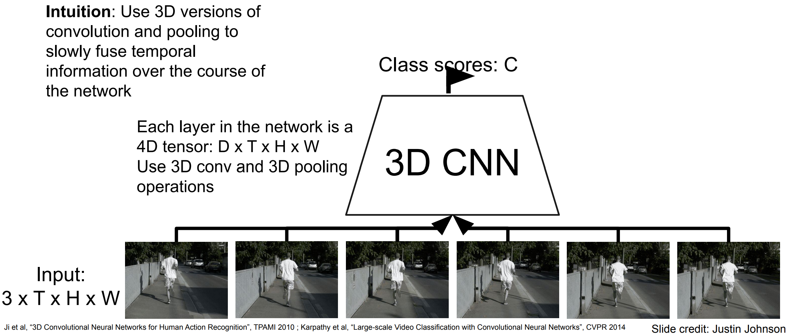
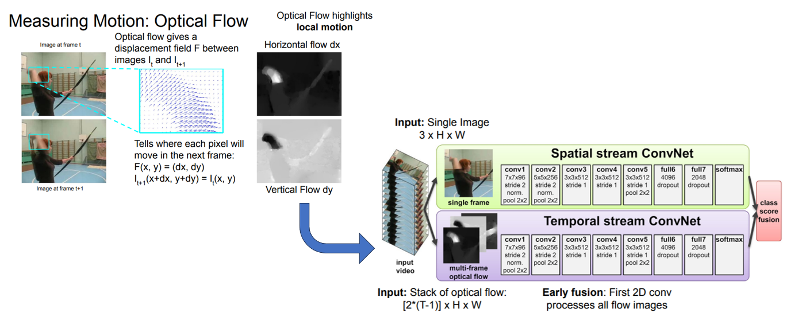
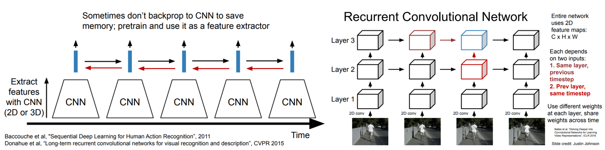
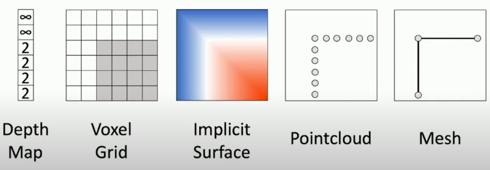
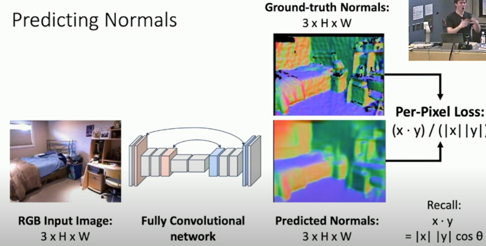
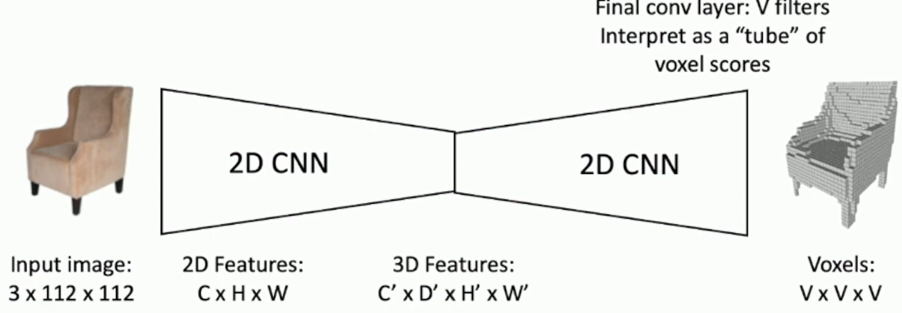
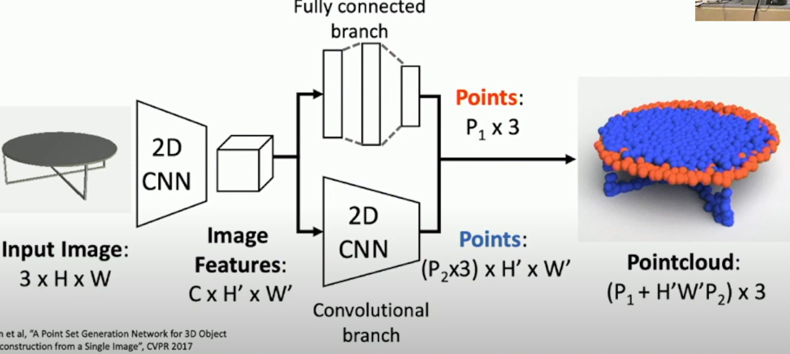

# 计算机视觉任务

## 目标检测

在对象检测问题中，图片可以含有多个不同分类的对象，要识别这些对象并且用红框标记它们。

对于确定图片中物体的位置，我们可以让神经网络再多输出4个数字，标记为$b_{x}$,$b_{y}$,$b_{h}$和$b_{w}$，这四个数字是被检测对象的边界框的参数化表示。

图片左上角的坐标为$(0,0)$，右下角标记为$(1,1)$。要确定边界框的具体位置，需要指定红色方框的中心点，这个点表示为($b_{x}$,$b_{y}$)，边界框的高度为$b_{h}$，宽度为$b_{w}$。因此训练集不仅包含神经网络要预测的对象分类标签，还要包含表示边界框的这四个数字。

举个例子，如果正在构建汽车自动驾驶系统，那么对象可能包括以下几类：行人、汽车、摩托车和背景，这有四个分类，目标标签$y$的定义如下：
$$
y= \ \begin{bmatrix} p_{c} \\ b_{x} \\ b_{y} \\ b_{h} \\ b_{w} \\ c_{1} \\ c_{2}\\ c_{3} \\\end{bmatrix}
$$

-   $p_{c}$表示是否含有对象，如果对象属于前三类（行人、汽车、摩托车），则$p_{c}= 1$。如果是背景，则图片中没有要检测的对象，则$p_{c} =0$，$y$的其它参数无意义
-   $b_{x}$,$b_{y}$,$b_{h}$和$b_{w}$上面解释过
-   如果存在某个对象，$p_{c}=1$，输出$c_{1}$、$c_{2}$和$c_{3}$，表示该对象属于1-3类中的哪一类，是行人，汽车还是摩托车

这个例子的神经网络的损失函数，其参数为类别$y$和网络输出$\hat{y}$，如果采用平方误差策略，则：
$$
L\left(\hat{y},y \right) =
\left\{
\begin{array}{rcl}
\left( \hat{y_1} - y_{1} \right)^{2} + \left(\hat{y_2} - y_{2}\right)^{2} + \ldots\left( \hat{y_8} - y_{8}\right)^{2}     &      & y_{1} = p_c = 1\\
\left(\hat{y_1} - y_{1}\right)^{2}     &      & y_{1} = p_c = 0\\

\end{array} 
\right.
$$
当$y_{1} = 0$，也就是$p_{c} = 0$，损失值是$\left(\hat{y_1} - y_{1}\right)^{2}$，因为对于这种情况，我们不用考虑其它元素，只需要关注神经网络输出$p_{c}$的准确度。

实际应用中，可以不对$c_{1}$、$c_{2}$、$c_{3}$和**softmax**激活函数应用对数损失函数，并输出其中一个元素值，通常做法是对边界框坐标应用平方差或类似方法，对$p_{c}$应用逻辑回归函数，甚至采用平方预测误差也是可以的。

假设正在构建一个人脸识别应用，并且希望算法可以给出眼角的具体位置。眼角坐标为$(x,y)$，可以让神经网络的最后一层多输出两个数字$l_{x}$和$l_{y}$，作为眼角的坐标值。如果需要多个特征点，则对神经网络稍做些修改，输出第一个特征点（$l_{1x}$，$l_{1y}$），第二个特征点（$l_{2x}$，$l_{2y}$），依此类推。

要明确一点，特征点1的特性在所有图片中必须保持一致。就好比特征点1始终是右眼的外眼角，特征点2是右眼的内眼角，特征点3是左眼内眼角，特征点4是左眼外眼角等等。所以标签在所有图片中必须保持一致。

### 通过滑动窗口检测目标

对于一张测试图片，首先选定一个特定大小的窗口，将这个红色小方块输入卷积神经网络，不断移动这个窗口并裁减，再判断红色方框内有没有汽车。

之后选择一个不同大小的窗口，重复上述操作，我们希望不论汽车在图片的什么位置，总有一个窗口可以检测到它。

这种算法叫作滑动窗口目标检测，因为我们以某个步幅滑动这些方框窗口遍历整张图片，对这些方形区域进行分类，判断里面有没有汽车。滑动窗口目标检测算法也有很明显的缺点，就是计算成本，因为在图片中剪切出太多小方块，卷积网络要一个个地处理。

### YOLO算法

比如输入图像是100×100的，在图像上放一个3×3网格。对于每一个小块都指定一个标签$y$。

**YOLO**算法做的就是，取对象的中点，然后将这个对象分配给包含对象中点的格子。

所以对于这里9个格子中任何一个都会得到一个k维输出向量，目标输出尺寸是3×3×k。

注意，这是一个卷积实现，并没有在3×3网格上跑9次算法，一次得到所有信息。

### 交并比

在对象检测任务中，希所以如果实际边界框是红色的，算法给出这个紫色的边界框，那么这个结果是好还是坏？交并比（**loU**）函数做的是计算两个边界框交集和并集之比。两个边界框的并集是绿色阴影表示区域，而交集是橙色阴影表示区域。

一般约定，在计算机检测任务中，如果$loU≥0.5$，就说检测正确，结果是可以接受的。如果预测器和实际边界框完美重叠，**loU**就是1。

### 非极大值抑制

假设需要在这张图片里检测行人和汽车，在上面放个19×19网格，理论上这辆车只有一个中点，所以它应该只被分配到一个格子里，只有一个格子做出有车的预测。

但是汽车所在的位置跨越了多个格子，多个格子都会做出这个格子有汽车的预测，这样算法可能对同一个对象做出多次检测。

非极大值抑制（Non-max suppression）可以确保算法对每个对象只检测一次，流程如下：

1.   抛弃所有概率比较低的输出边界框，比如$p_{c}≤0.6$的边界框去掉。
2.   接下来剩下的边界框，选择一个概率$p_{c}$最高的边界框并保留。
3.   剩下的边界框，如果和上一步输出边界框有很高交并比（**IoU**）的边界框全部抛弃。
4.   如果还有剩下的边界框，回到步骤2.

### Anchor Boxes

到目前为止，对象检测中存在的一个问题是每个格子只能检测出一个对象，使用**anchor box**这个概念可以让一个格子检测出多个对象。

对于这个例子，我们继续使用3×3网格，注意行人的中点和汽车的中点都落入到同一个格子中。对于那个格子， $y$ 向量中$p_{c}$只能挑选一个表示。

**anchor box**的思路是预先定义多个不同形状的**anchor box**，把预测结果和这些个**anchor box**关联起来。一般来说，你可能会用5个甚至更多的**anchor box**，而这里用两个**anchor box**（上图中有两个紫色框表示的box）。

重新定义$y$ 向量：
$$
y=  \begin{bmatrix} p_{c} & b_{x} & b_{y} &b_{h} & b_{w} & c_{1} & c_{2} & c_{3} & p_{c} & b_{x} & b_{y} & b_{h} & b_{w} &c_{1} & c_{2} & c_{3} \\\end{bmatrix}^{T}
$$
前面的8个参数和**anchor box 1**关联，后面的8个参数和**anchor box 2**相关联。行人的形状更类似于**anchor box 1**的形状，车子的边界框更像**anchor box 2**的形状，把这两个部分分开表示，实现每个格子检测出多个对象。

最后，该怎么选择**anchor box**呢？人们一般手工指定**anchor box**形状，可以选择5到10个**anchor box**形状，覆盖到多种不同的形状，可以涵盖你想要检测的对象的各种形状。还有一个更高级的版本，后期**YOLO**论文中有更好的做法，就是所谓的**k-平均算法**，可以将两类对象形状聚类，如果我们用它来选择一组**anchor box**，选择最具有代表性的一组**anchor box**，可以代表试图检测的十几个对象类别，但这其实是自动选择**anchor box**的高级方法。

### 基于R-CNN的模型

朴素的想法是，可以使用非深度学习的算法（proposal method），在CPU上先预测好可能出现物体的框，再使用目标检测模型。

缺点是非常慢，非深度学习的算法可能会给出2000个框，需要在2000个框上都运行一遍目标检测模型。于是我们不在原图片上标框，而是在特征上标框，如下图：

我们可以将非深度学习的标框算法替换为基于深度学习的模型，这是一个两阶段模型。

当然，两阶段也不是必须的，例如我们之前提到的YOLO

## 语义分割

即下图中左数第二个任务

朴素的想法是设计一个只有卷积层而没有下采样操作的网络，得到一个与原图像相同高宽的特征，深度是分类数，再在每一个像素位置上使用 argmax，但这十分昂贵。

可以先下采样再上采样，参数高效。但是如何上采样？

### 上采样

下面举了几种上采样方式：

一个比较好的方法是transposed convolution，使用了卷积核，我们先看一个一维的例子：

然后是二维例子：

## 人脸验证

在人脸识别的相关文献中，人们经常提到人脸验证（**face verification**）和人脸识别（**face recognition**）。

-   人脸验证问题的任务是，有一张输入图片，以及某人的**ID**或者是名字，这个系统要做的是，验证输入图片是否是这个人。即回答“是不是这个人？”
-   而人脸识别问题比人脸验证问题难很多，它要回答“这个人是谁？“

这个章节主要讲构造一个人脸验证作为基本模块，如果准确率够高，你也许以把它用在识别系统上。

### Similarity函数

我们之前使用**softmax**来输出标签，每个人代表一个类别，但是在人脸识别任务中，我们回答“是不是这个人？”这个问题，我们对最后一层做改变，定义Similarity函数，它是一个用$d$表示的函数：
$$
d(img1,img2) = \text{degree of difference between images}
$$
它以两张图片作为输入，然后输出这两张图片的差异值。

-   如果放进同一个人的两张照片，希望它能输出一个很小的值。
-   如果放进两个长相差别很大的人的照片，它就输出一个很大的值。
-   如果这两张图片的差异值小于某个阈值$\tau$（一个超参数），那么这时就能预测这两张图片是同一个人。

### Siamese 网络

如上图，对于一个一般的卷积网络，输入图片$x^{(1)}$，然后通过一些列卷积，池化和全连接层，最终得到特征向量（这里没有**softmax**单元来做分类）。定义$f(x^{(1)})$是输入图像$x^{(1)}$的编码，类似的，$f(x^{(2)})$是输入图像$x^{(2)}$的编码。

编码很好地代表了这两个图片，要做的就是定义$d$函数，将$x^{(1)}$和$x^{(2)}$的距离定义为这两幅图片的编码之差的范数：
$$
d( x^{( 1)},x^{( 2)}) =|| f( x^{( 1)}) - f( x^{( 2)})||_{2}^{2}
$$

### Triplet 损失

为了应用梯度下降，需要损失函数，这里使用三元组损失（Triplet 损失）函数。

用三元组损失的术语来说，一次需要准备三张图片：

-   一个 **Anchor** 图片，简写成$A$。
-   一个**Positive**图片，**Positive**意味着与**Anchor**是同一个人，简写为$P$。
-   一个**Negative**图片，**Negative**意味着与**Anchor**不是同一个人，简写为$N$。

我们希望对于$f$，**Anchor** 图片与**Positive**图片距离更近，即：
$$
|| f(A) - f(P)||^{2} -||f(A) - f(N)||^{2} +\alpha \leq0
$$
其中$\alpha$是一个正的超参数，也叫做间隔(**margin**)。

然后我们定义损失函数：
$$
L( A,P,N) = max(|| f( A) - f( P)||^{2} -|| f( A) - f( N)||^{2} + a,0)
$$
这个$max$函数的作用就是，只要这个$|| f( A) - f( P)||^{2} -|| f( A) - f( N)||^{2} + a\leq0$，那么损失函数就是0。网络不会关心它负值有多大。

### 转化为二分类问题

处理人脸验证的另外一种思路是使用之前的二分类，因为对于问题“是不是这个人？”，我们的回答分为“是”或“不是”两种。目标标签是1表示一对图片是一个人，目标标签是0表示图片中是不同的人。

如上图，我们同时看两张照片，得到$f(x^{(1)})$，$f(x^{(2)})$，逻辑回归单元处理的公式为：
$$
\hat y = \sigma(\sum_{k = 1}^{128}{w_{i}| f( x^{( i)})_{k} - f( x^{( j)})_{k}| + b})
$$
其中，下标$k$代表选择这个向量中的第$k$个元素。

还有其他不同的形式来公式，比如$\chi^{2}$公式，也被称为$\chi$平方相似度：
$$
\hat y = \sigma(\sum_{k = 1}^{128}{w_{i}\frac{(f( x^{( i)})_{k} - f(x^{( j)})_{k})^{2}}{f(x^{( i)})_{k} + f( x^{( j)})_{k}} + b})
$$

## 神经风格迁移

什么是神经风格迁移？让我们来看几个例子，比如下图，左边的照片是在斯坦福大学的照片，右边的是梵高的星空，神经风格迁移可以帮你利用右边照片的风格来重新生成下面这张照片。

-   其中，$C$来表示内容图像。
-   $S$表示风格图像。
-   $G$表示生成图像。

让我们为生成的图像定义一个代价函数，通过最小化代价函数，可以生成想要的任何图像，这个代价函数定义为两个部分：

1.   第一部分被称作内容代价函数，这是一个关于内容图片和生成图片的函数，它是用来度量生成图片$G$的内容与内容图片$C$的内容有多相似。表示为$J_{\text{content}}(C,G)$
2.   第二部分是风格代价函数，也就是关于$S$和$G$的函数，用来度量图片$G$的风格和图片$S$的风格的相似度。表示为$J_{\text{style}}(S,G)$

最后用两个超参数$a$和$\beta$来来确定内容代价和风格代价：
$$
J( G) = a J_{\text{content}}( C,G) + \beta J_{\text{style}}(S,G)
$$
算法的运行流程为：

1.   随机初始化生成图像$G$。（它可能像一堆雪花马赛克）
2.   然后使用代价函数$J(G)$，使用梯度下降的方法将其最小化，更新$G:= G - \frac{\partial}{\partial G}J(G)$

那么，如何定义内容代价$J_{\text{content}}(C,G)$？令$a^{[l][C]}$和$a^{[l][G]}$代表这两个图片$C$和$G$的$l$层的激活函数值。如果这两个**激活值相似**，那么就意味着两个图片的内容相似，所以：
$$
J_{\text{content}}( C,G) = \frac{1}{2}|| a^{[l][C]} - a^{[l][G]}||^{2}
$$

那么，如何定义风格代价$J_{\text{style}}(S,G)$？什么又是**风格**？我们要做的就是将图片的**风格**定义为$l$层中激活项$\alpha$的各个**通道之间相关系数**。

对于$l$层的激活项$\alpha^{[l]}$，维度为$ n_{H} \times n_{W} \times n_{C}$，所以我们令$a_{i,\ j,\ k}^{[l]}$为隐藏层l中$(i,j,k)$位置的激活项，$i$，$j$，$k$分别代表该位置的高度、宽度以及对应的通道数。

对于$k$通道和$k'$通道之间的相关系数，公式为：
$$
G_{kk^{'}}^{[l]( S)} = \sum_{i = 1}^{n_{H}^{[l]}}{\sum_{j = 1}^{n_{W}^{[l]}}{a_{i,\ j,\ k}^{[l](S)}a_{i,\ j,\ k^{'}}^{[l](S)}}}
$$

$$
G_{kk^{'}}^{[l]( G)} = \sum_{i = 1}^{n_{H}^{[l]}}{\sum_{j = 1}^{n_{W}^{[l]}}{a_{i,\ j,\ k}^{[l](G)}a_{i,\ j,\ k^{'}}^{[l](G)}}}
$$

其中，上标$S$和$G$代表分别对**风格图像**和**生成图像**做计算。如果两个通道中的激活项数值都很大，那么$G_{{kk}^{'}}^{[l]}$也会变得很大，对应地，如果它们不相关那么$G_{{kk}^{'}}^{[l]}$就会很小。$G_{{kk}^{'}}^{[l]}$是一个数，它组成的$G^{[l]}$矩阵是个$n_{c} \times n_{c}$的矩阵，被称为**Gram**矩阵或风格矩阵。

最后组成风格代价函数：
$$
J_{\text{style}}^{[l]}(S,G)=\frac{1}{(2n_{H}^{[l]}n_{W}^{[l]}n_{C}^{[l]})^2}\Vert G^{[l]( S)}- G^{[l]( G)}\Vert_F^2
$$

$$
J_{\text{style}}(S,G)=\sum_l \lambda^{[l]}J_{\text{style}}^{[l]}(S,G)
$$

>   复习一下，下标$F$代表**Frobenius**范数，具体来说：
>   $$
>   \Vert G^{[l]( S)}- G^{[l]( G)}\Vert_F^2=\sum_k\sum_{k'}(G_{kk^{'}}^{[l]( S)}-G_{kk^{'}}^{[l]( G)})^2
>   $$

之后用梯度下降法，或者更复杂的优化算法来找到一个合适的图像$G$，并计算$J(G)$的最小值，最后能够得到非常漂亮的结果。

## 理解视频

问题：视频占用空间大。视频为每秒 ~30 帧 （fps）未压缩视频的大小（每像素 3 个字节），那么SD 视频（640 x 480）：每分钟 ~1.5 GB，HD 视频（1920 x 1080）：每分钟 ~10 GB。

解决方法：裁剪片段（Clip）来训练

### BaseLine

朴素的想法：在每帧上使用2D CNN，然后表决，通常效果已经比较好了。

### 后期融合

思想与BaseLine类似，不同是将表决过程使用后期融合囊括在模型中。

问题：这些**后期融合**太晚了，很难注意到视频帧中的细节（例如人的脚的移动）

### 早期融合

与后期融合对应的是早期融合，我们可以使用我们熟悉的 2D CNN来完成，问题是只使用一层来融合可能太快了。

### 慢速融合

- 之前的模型可以理解为在空间上慢速融合，但是在时间上只用了一步来立即完成。
- 相较之下，3D CNN 可以理解为在空间和时间上都慢速融合。

另外一个考虑是，使用3D卷积核，我们有一个美丽的特性：**时间平移不变性**。这是2D卷积无法做到的。我们可以像播放视频一样播放学习到的3D卷积核：

如果我们使用梯度上升的方法找到最大激发神经元的片段，是这样的：

### 2D CNN 到 3D CNN

C3D即 3D CNN 版本的 VGG，使用了 3x3x3 conv 和2x2x2 pooling。缺点：计算开销大。

类似，我们可以转换Inception Block：

### 加入动作信息

如何给视频中的任务动作建模？Optical Flow：给出了前后两帧中像素点的移动。

这样，在模型中可以同时利用视觉信息和动作信息。

### 处理长视频

到目前为止，我们所有的时间CNN只对2-5秒的极短剪辑中的帧之间的局部运动进行建模。长期结构怎么办？可以使用RNN。

但是它也遗传了 RNN 的缺点：慢，我们可以换用 transformer

## 3D Vision

3D世界有不同表示方法，输入是一张RGB图片，输出可以是：

- 深度
- 小立方体
- 概率：每个点在3维空间中，是物体内部还是物体外部？二分类问题。可以拟合一个函数来采样。
- 点云
- 网格

### 深度

预测深度是假的3D，可以用2D CNN来解决。

一种变体是预测每个像素在3D世界中的朝向，每个像素的朝向需要用3个值表示：

### 小立方体

朴素的想法是使用2D+3D的CNN，但是由于3D CNN计算开销大，希望使用2D CNN替换它。

这是自然的，因为带channel的2D CNN 和不带channel的 3D CNN 差不多。但是代价呢？丢掉了3D 卷积中优美的**空间平移不变性**特性。这种用2D CNN替换3D CNN 说到底只是输入输出的维度可以匹配，2D世界最终无法理解3D世界。

### 点云

需要注意的是，点云中的点是没有大小的，需要其他方法（例如另外一个深度学习模型）来将点云转化为3D模型。

### 网格

游戏引擎的常用网格渲染3D模型。需要提供一个原始的mesh给模型，提供不断变形来拟合3D形状。

但是，如果原始mesh和目标mesh的拓扑结构不一样，变形是无法变成目标mesh的。（例如无法将一个球变形成甜甜圈）。需要一些前置方法得到拓扑一致的原始mesh：

