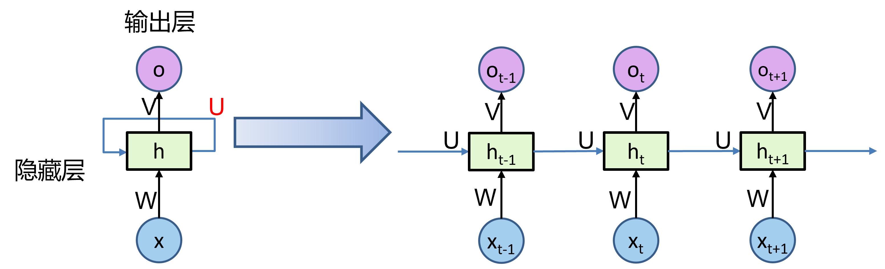
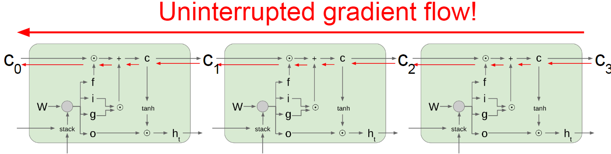
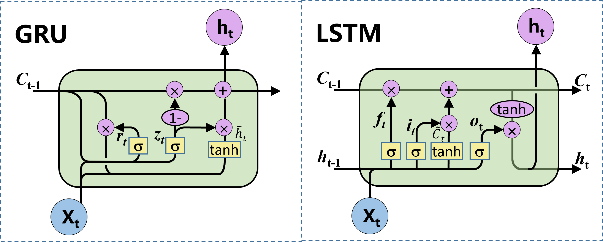

# 循环神经网络

循环神经网络（**RNN**）在语音识别、自然语言处理和其他领域中引起变革。我们使用它处理序列模型，一些典型的任务如下：

-   语音识别：给定了一个输入音频片段 $X$，并要求输出对应的文字记录 $Y$。
-   音乐生成：输入的 $X$可以是空的或者数字（这个数可能指代音乐风格，也可能是曲子的头几个音符），然后输出音乐 $Y$。
-   情感分类：输入电影评论 $X$，输出评论人给出的星数 $Y$。
-   机器翻译：输入法语句子 $X$，输出对应的英文 $Y$。
-   命名实体识别：给定一个句子$X$，识别出句中的人名$Y$。

## 数学符号

我们首先定义我们会使用到的符号，以命名实体识别举例子，我们给定一个句子$x$，希望识别出句中的人名$y$。比如在这句句子中`Harry Potter and Herminoe Granger invented a new spell.`人名包括`Harry Potter`和`Herminoe Granger`。

-   句子中包含9个单词，我们用$x^{<1>}$、$x^{<2>}$、$x^{<3>}$一直到$x^{<9>}$来索引不同的位置。
-   输出数据也是一样，我们用$y^{<1>}$、$y^{<2>}$、$y^{<3>}$等等一直到$y^{<9>}$来表示输出数据。如果是对应的$x^{<t>}$是人名，那么$y^{<t>}$为1，否则为0。
-   $T_{x}$来表示输入序列的长度，这个例子中输入是9个单词，所以$T_{x}= 9$。
-   用$T_{y}$来表示输出序列的长度。$T_{y}= 9$。

那么如何表示$x^{<t>}$？如果我们有10k词大小的词典，包含英语里最常用的10k个单词，**Harry**这个单词在这个词典里的位置为4075，则$x^{<1>}$就是一个第4075行是1，其余值都是0的向量，维度为(10k, 1)。

如果遇到了一个不在词表中的单词，可以创建一个新的标记，是一个叫做**Unknow Word**的伪造单词，用\<**UNK**\>作为标记，来表示不在词表中的单词。

## 模型

$$
h_t=f(Uh_{t-1}  + Wx_t+ b)
$$

$$
y_t=\text{softmax}(Vh_t)
$$

- *f* 是非线性函数，通常为 *sigmod*函数或 *tanh* 函数
- ht是在时刻t的隐藏状态，是网络的memory
- yt是在时刻t的输出
- RNN在所有步中采用共同的参数(U,V,W)，表示在每一步执行相同的任务，仅仅是输入不同而已

RNN模型有以下三个特点：

- 时序性、递归性：一般输入来自两个方面，一个是之前状态 ht-1，和当前状态的输入xt 。
- 参数共享：每一步的参数矩阵都是共享的，主要的参数矩阵也是上述的两个方面，W 和 U 。
- cell的设计：为了解决RNN更新时指数式的梯度弥散，梯度爆炸的问题和控制 cell 保留信息比例的问题，设计了GRU，LSTM cell，具体见后面。

## 不同类型的循环神经网络

上节内容中，简单模型的特点是输入序列的长度和输出序列的长度是一样的，这节内容介绍更多类型的循环神经网络，输入序列的长度和输出序列的长度不一定一致。

-   “**一对一**”结构，当去掉$a^{<0>}$时它就是一种标准类型的神经网络。
-   “**一对多**”结构，例子是音乐生成、图像生成文字，只在初始输入$x$，之后都只使用上一层的计算结果进行计算。
-   “**多对一**”结构，例子是情感分类，只在最后输出预测值。
-   “**多对多**”结构，当输入序列长度与输出序列长度不一致时（比如机器翻译），可以选择在前面几层只输入，在后面层只输出。输入输出一致时，可用于序列标注。

## 语言模型

在自然语言处理中，构建语言模型是最基础的也是最重要的工作之一，所以什么是语言模型呢？比如你在做一个语音识别系统，听到一个句子，“**the apple and pear（pair） salad was delicious.**”，所以我究竟说了什么？我说的是 “**the apple and pair salad**”，还是“**the apple and pear salad**”？

语言模型所做的就是，它会告诉你某个特定的句子它出现的概率是多少。一个语音识别模型可能算出第一句话的概率是$$P( \text{The apple  and  pair  salad}) = 3.2 \times 10^{-13}$$，而第二句话的概率是$$P\left(\text{The apple  and  pear salad} \right) = 5.7 \times 10^{-10}$$，比较这两个概率值，显然我说的话更像是第二种，因为第二句话的概率比第一句高出1000倍以上，这就是为什么语音识别系统能够在这两句话中作出选择。

### 处理步骤

那么如何建立一个语言模型呢？为了使用**RNN**建立出这样的模型，首先需要一个训练集，包含一个很大的英文文本语料库（**corpus**）或者其它的语言。其中语料库是自然语言处理的一个专有名词，意思就是很长的或者说数量众多的英文句子组成的文本。

对于一句话，比如之前提到的`Harry Potter and Herminoe Granger invented a new spell.`，为每个单词转换成对应的向量，在句子的结尾加上**EOS**标记，对于未知词加上**UNK**标记。

处理好数据后之后正式开始训练：

1.   $a^{<0>}$按照惯例设为0向量，$x^{<1>}$也设为0向量
2.   得到$a^{<1>}$后，将它通过**softmax**进行预测来计算出第一个词可能会是什么，其结果就是$\hat y^{<1>}$（这一步其实就是通过一个**softmax**层来预测字典中的任意单词会是第一个词的概率）
3.   在下一时间步中，仍然使用激活项$a^{<1>}$，在这步要做的是已知第一个单词，要计算出第二个词会是什么，所以我们传给它正确的第一个词$\hat y^{<1>}$，或者说令$x^{<2>} = y^{<1>}$
4.   以此类推直到预测出**EOS**句子结尾标志

其中的损失函数为：
$$
L^{< t >}\left( \hat y^{<t>},y^{<t>}\right) = - \sum_{i}^{}{y_{i}^{<t>}\log\hat y_{i}^{<t>}}
$$

$$
L = \sum_{t}^{}{L^{< t >}\left( \hat y^{< t >},y^{< t >} \right)}
$$

如果用很大的训练集来训练这个**RNN**，就可以通过开头一系列单词来预测之后单词的概率。对于一个包含三个单词的句子，它是$y^{<1>}$，$y^{<2>}$，$y^{<3>}$，要计算出整个句子中各个单词的概率，再把这三个概率相乘，得到这个含3个词的整个句子的概率。

### 对新序列采样

在训练一个序列模型之后，要想了解到这个模型学到了什么，一种非正式的方法就是进行一次新序列采样。一个序列模型模拟了任意特定单词序列的概率，我们要做的就是对这些概率分布进行采样来生成一个新的单词序列，过程如下：

-   第一步要做的就是对想要模型生成的第一个词进行采样，于是输入$x^{<1>} =0$，$a^{<0>} =0$，类似上一节的处理过程，然后对这个向量使用例如**numpy**命令，`np.random.choice`（上图编号3所示），来根据向量中这些概率的分布进行采样，这样就能对第一个词进行采样了。
-   然后继续下一个时间步，$\hat y^{<1>}$作为输入，最后得到的结果就是$\hat y^{<2>}$，然后再次用这个采样函数来对$\hat y^{<2>}$进行采样。
-   以此类推直到预测出**EOS**句子结尾标志。

这就是如何从**RNN**语言模型中生成一个随机选择的句子的步骤。

## 处理梯度消失问题

对于很深的网络会梯度消失的问题，最后输出的$\hat y$得到的梯度很难传播回去，很难影响靠前层的权重。随着层数的增加，导数有可能指数型的下降或者指数型的增加，我们可能会遇到梯度消失或者梯度爆炸的问题。**梯度爆炸基本上用梯度修剪就可以应对**，但梯度消失比较棘手。我们尝试处理这些问题。

### LSTM

长短时记忆神经网络（Long Short-Term Memory Neural Network，LSTM）是循环神经网络的一个变体，可以有效地解决长期依赖问题/梯度消失问题。

细胞的状态在整条链上运行，只有一些小的线性操作作用其上，信息很容易保持不变的流过整条链。例如反向传播：

**门**(Gate)是一种可选地让信息通过的方式，由一个Sigmoid神经网络层和一个点乘法运算组成。Sigmoid神经网络层输出0和1之间的数字，这个数字描述每个组件有多少信息可以通过， 0表示不通过任何信息，1表示全部通过	

- **遗忘门**决定我们要从细胞状态中丢弃什么信息。它查看ht-1(前一个隐藏状态)和xt(当前输入)，并为状态Ct-1(上一个状态)中的每个数字输出0和1之间的数字，1代表完全保留，而0代表彻底删除
- **输入门**决定要在细胞状态中存储什么信息。首先，输入门的Sigmoid层决定了我们将更新哪些值。然后，一个tanh层创建候选向量C ̃_t,该向量将会被加到细胞的状态中。最后，结合这两个向量来创建更新值。
- **更新记忆**：将上一个状态值$C_{t-1}$乘以f_t，以此表达期待忘记的部分。之后将得到的值加上 i_t∗C ̃_t。这个得到的是新的状态值
- **输出门**决定我们要输出什么， 此输出将基于当前的细胞状态。首先，通过一个sigmoid层，决定了我们要输出细胞状态的哪些部分。然后，将细胞状态通过tanh（将值规范化到-1和1之间），并将其乘以Sigmoid门的输出，至此完成了输出门决定的那些部分信息的输出。

图示前向传播过程

### GRU

门控循环单元**GRU**单元（Gated Recurrent Unit）是一种比 LSTM 更加简化的版本。在 LSTM 中，输入门和遗忘门是互补关系，因为同时用两个门比较冗余。GRU 将输入门与和遗忘门合并成一个门：更新门（Update Gate），同时还合并了记忆单元和隐藏神经元。GRU没有单独的细胞状态。

> 那么，我们什么时候应该用**GRU**？什么时候用**LSTM**？
>
> **GRU**的优点是这是个更加简单的模型，所以更容易创建一个更大的网络，而且它只有两个门，在计算性上也运行得更快，然后它可以扩大模型的规模。
>
> 但是**LSTM**更加强大和灵活，因为它有三个门而不是两个。所以如果必须选一个，今天大部分的人还是会把**LSTM**作为默认的选择来尝试。

## 双向循环神经网络

在之前命名实体识别中使用的神经网络有一个问题，它从左到右处理单词，所以在处理单词时，只能获取前面的语境，而不能获取后面的语境信息。双向循环神经网络不仅从前到后处理，也从后到前处理，之后再计算出预测值，具体步骤如下：

1.   给定一个输入序列，例如$x^{<1>}$到$x^{<4>}$
2.   首先计算前向的${\overrightarrow{a}}^{<1>}$，然后计算前向的${\overrightarrow{a}}^{<2>}$，接着${\overrightarrow{a}}^{<3>}$，${\overrightarrow{a}}^{<4>}$
3.   反向序列从计算${\overleftarrow{a}}^{<4>}$开始，反向进行，直到${\overleftarrow{a}}^{<1>}$
4.   为了预测结果，$\hat y^{<t>} =g(W_{g}\left\lbrack {\overrightarrow{a}}^{< t >},{\overleftarrow{a}}^{< t >} \right\rbrack +b_{y})$

其中，这些单元可以是标准的**RNN**块，也可以是**GRU**单元或者是**LSTM**单元。

## 深层循环神经网络

这节学习如何构建更深的**RNN**。

首先确定符号，我们现在用$a^{\lbrack l\rbrack <t>}$来表示第$l$层，第$t$个时间点的激活值。

如果要计算$a^{\lbrack 2\rbrack <3>}$，有两个输入，一个是从下面过来的输入，还有一个是从左边过来的输入，$a^{\lbrack 2\rbrack < 3 >} = g(W_{a}^{\left\lbrack 2 \right\rbrack}\left\lbrack a^{\left\lbrack 2 \right\rbrack < 2 >},a^{\left\lbrack 1 \right\rbrack < 3 >} \right\rbrack + b_{a}^{\left\lbrack 2 \right\rbrack})$，这就是这个激活值的计算方法。参数$W_{a}^{\left\lbrack 2 \right\rbrack}$和$b_{a}^{\left\lbrack 2 \right\rbrack}$在这一层的计算里都一样，相对应地第一层也有自己的参数$W_{a}^{\left\lbrack 1 \right\rbrack}$和$b_{a}^{\left\lbrack 1 \right\rbrack}$。

对于**RNN**来说，有三层就已经不少了。由于时间的维度，**RNN**网络会变得相当大。但有一种更复杂的实现，就是在每一个上面堆叠循环层，这些层并不水平连接，只是一个深层的网络，然后用来预测$y^{<1>}$。

通常这些单元没必要非是标准的**RNN**，也可以是**GRU**单元或者**LSTM**单元，并且也可以构建深层的双向**RNN**网络。

### BiLSTM

首先看2层的 LSTM 是如何运转的

再看1层的 BiLSTM （双向LSTM）是如何运转的

用一个文本情感分析的例子来说明：单层的BiLSTM其实就是2个LSTM，一个正向去处理序列，一个反向去处理序列，处理完后，**两个LSTM的输出会拼接起来**。

特别注意：在这个案例中，所有时间步计算完后，才算是BiLSTM的结果，正向LSTM经过6个时间步得到一个结果向量，反向LSTM同样经过6个时间步后，得到另一个结果，然后这两个结果向量拼接起来，作为BiLSTM的最终输出。

再看看2层的 BiLSTM 是如何运转的

