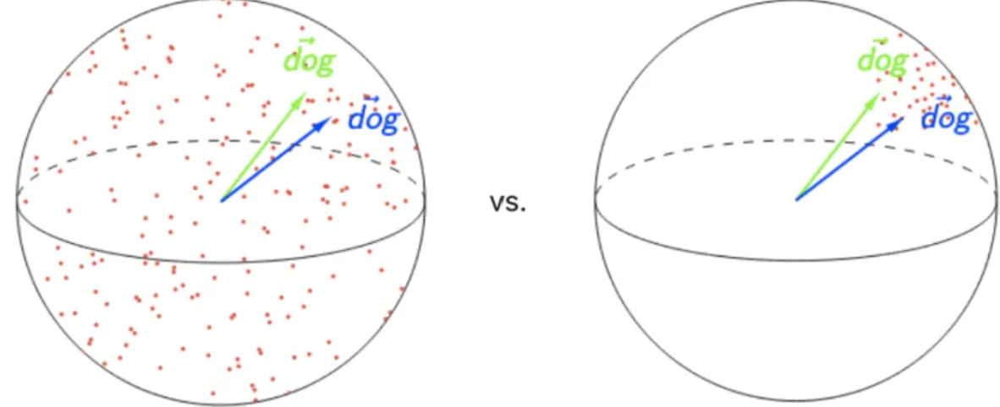
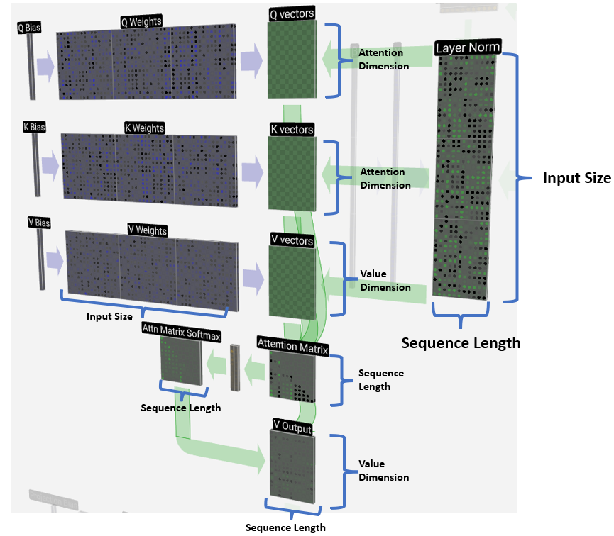

# Transformers 家族

## Transformer


- encoder 将 $(x_1, x_2, ... , x_n)$（原始输入） 映射成 $(z_1, z_2, ... , z_n)$（机器学习可以理解的向量）i.e., 一个句子有 n 个词，$x_t$ 是第 t 个词，$z_t$ 是第 t 个词的向量表示。
- decoder 拿到 encoder 的输出，会生成一个长为 m 的序列 $(y_1, y_2, ... , y_m)$。n 和 m 可以一样长、可以不一样长。 

encoder 和 decoder 的区别：

- encoder 一次性可以看全整个句子。i.e., 翻译的时候，看到整句英语：Hello World。decoder 在解码的时候，输出词只能一个一个的生成。过去时刻的输出会作为你当前时刻的输入，自回归 auto-regressive。
- decoder在做预测的时候 是没有输入的。Shifted right 指的是 decoder 在之前时刻的一些输出，作为此时的输入。一个一个往右移。

解码器端同时接收来自编码器端的输出以及当前 Transformer 块的前一个掩码注意力层的输出。查询q是通过解码器前一层的输出进行投影的，而键k和值v是使用编码器的输出进行 投影的。它的作用是在翻译的过程当中，为了生成合理的目标语言序列需要观测待翻译的源语言 序列是什么。

**在做预测时，步骤如下：**

1. 给 decoder 输入 encoder 对整个句子 embedding 的结果 和一个特殊的开始符号 </s>。decoder 将产生预测，在我们的例子中应该是 ”你”。
2. 给 decoder 输入 encoder 的 embedding 结果和 “</s>你”，在这一步 decoder 应该产生预测 “好”。
3. 给 decoder 输入 encoder 的 embedding 结果和 “</s>你好”，在这一步 decoder 应该输出 ”</eos>”。结束

注意力与位置编码已经介绍过，这里不再赘述，[位置编码介绍点这里](https://qmmms.gitbook.io/note/llm/qms03-you-jian-du-wei-tiao-gai-shu#positional-encoding)，[Transformer的代码参考点这里](https://qmmms.github.io/posts/Attention-Is-All-You-Need/)

### Tokenization

无论是机器学习还是深度学习的模型，其输入都是数字而不是原始的文本。所以需要把文本转换为数字，一般是用词典的编号来表示。

Tokenization 是将文本切分成词典中的词，从而得到用词典的 index 表示的数字序列。Tokenization 的发展大概经历了三个阶段：词粒度、字粒度和 Subword 粒度。

> 切分的例子：
>
> - 南京市/长江/大桥
> - 南京/市长/江大桥

**词粒度 Word-based Tokenization**：每一个 token 是词典中的一个词。对于拉丁语系很简单，按照空格和标点符号分割即可。对于中文日文，则需要专门进行分词，比如中文分词一般都用 jieba（结巴分词），哈工大的 LTP等。中文的分词可以抽象为一个序列标注问题，所以这些分词方法会使用词典索引，或者 HMM，双向 GRU 等模型来进行分词。虽然 BERT 甚至大模型也能很好的完成这个任务，但是由于分词是一个非常频繁的操作，效率也很重要，所以一般不会使用太复杂的模型来做。

**字粒度 Character-based Tokenization**：把文本按照最小粒度来拆分，对于英文来说就是 26 个字母加上一些标点符号。中文来说就是字。

但是对于英文来说，单个字母几乎没有含义。难以学习到词汇的真正含义。由于中文的一个字还是有一定的含义，所以在中文勉强可以使用，但是英文几乎没法使用。会让输入变得很长，训练和推理更慢。

**子词粒度 Subword Tokenization**：可以认为是上面两种方法的一个中间态。其设计理念为：

1. 词典中的每一个token都有语义。
2. 常用的词汇尽量不要分割
3. 不常用的词汇可以拆分成常用的、有意义的字词(Subword) 。例如：enjoy-able

对英文支持很好，但是对中文来说没有起到类似英文的 Subword 效果。因为中文也可以进一步拆分，比如“钅” 一般都跟金属有关，“犭”一般都跟动物有关。目前的中文的处理粒度还没有这么细致。

子词粒度的一个经典方法是**Byte-Pair Encoding (BPE)**，BPE 的方法采用了 Huffuman 编码类似的思想，方法如下：

1. 首先按字粒度分词，注意每个词的末尾添加一个特殊字符来区分，比如</w>
2. 找到2-gram 最多的组合，变为一个新 token。
3. 将新 token 添加到词表，并且删除被新 token 完全覆盖的 token
4. 重复2和3，可以设置到达一定的词表数量停止迭代，或者要求 token 的词频必须满足一定的数量，否则就停止迭代。

> 例子：
>
> ```
> - {'l o w </w>': 5, 'l o w e r </w>': 2, 'n e w e s t </w>': 6, 'w i d e s t </w>': 3}
> - 最多的组合为 es, 出现了9次，
> - 添加token: es, 需要注意的是 s 从词表中删除了
> - 下一次迭代。。。
> ```

下一个问题，Transformers/大模型的 token vocabulary 应该选多大？

1. **数据量够大的情况下**，vocabulary 越大，压缩率越高（代表了相同数量的token能够表达更多的信息，相同的信息 token 越短则训练效率更高），**压缩率更高代表着能看到更多的上下文**，就能 attention 到更多的信息。
2. 更多的词汇能够减少 OOV (Out of Vocabulary)的影响, 训练的信息不会丢失，推理的时候泛化能力也更强。同时更多的词汇可以减少词汇分解后的歧义，从而更好地理解和生成文本。
3. 太大的 vocabulary 需要做一些训练和推理的优化，所以要**平衡计算和效果。**
4. 要考虑内存对齐。vocabulary 的**大小设置要是 8 的倍数，在 A100 上则是 64 的倍数。**（不同的GPU可能不一样）

### Masked Attention

Mask只在Decoder端进行,目的是为了使得decoder不能看见未来的信息。具体指在计算权重的时候，t 时刻只用了 $$v_1, ..., v_{t-1}$$ 的结果，不要用到 t 时刻以后的内容。

> 如果我们把注意力看作上下文信息的交流，由于在输出时看不到未来的信息，这些注意力权重应当为0

Mask 非常简单，首先生成一个下三角全 0，上三角全为负无穷的矩阵（ t 时刻以后 $$Q_t$$ 和 $$K_t$$ 的值换成一个很大的负数），然后将其与 Scaled Scores 相加即可：


之后再做 softmax，就能将 - inf 变为 0，得到的这个矩阵即为每个字之间的权重。


### FFN

Transformers 中 FFN 的参数占比是多少？答案是 2/3

Position-wise Feed-Forward Networks，说白了是作用在最后一个维度的 MLP 。Point-wise指把一个 MLP 对每一个词 （position）作用一次。

虽然 Transformers 论文的名字叫《Attention is All your Need》，但是实际上， FFN and ResNet are also your need.**Attention, FFN, ResNet 可以认为是 Transformers 架构的三驾马车，缺一不可** 。

>  Attention 的功能是做信息的提取和聚合，Resnet 提供信息带宽，而真正学到的知识或者信息都存储在 FFN 中
>
> 在图像领域中，也有一种说法，那就是 Attention 其实是 token mixer, FNN 其实是 channel mixer.

FFN 设计的初衷，其实就是为模型引入非线性变换。 attention 确实是非线性的，但是“**非线形纯度**”不够。这就是 FFN 必须要存在的原因，或者说更本质的原因是因为 FFN 提供了最简单的非线性变换。

一些 FFN 比较公认的研究成果：

- **FFN是 Transformers 的必备模块**，没有 FFN 的 Transformers 学不到什么东西（上面的结论同样适用于 Transformers 中的 skip connect）
- **FFN 承担了记忆功能**。FFN 是一个 Key-Value 记忆网络，第一层线性变换是 Key Memory，第二层线性变换是 Value Memory。FFN 学到的记忆有一定的可解释性，比如低层的 Key 记住了一些通用 pattern (比如以某某结尾)，而高层的 Key 则记住了一些语义上的 Pattern （比如句子的分类）。Value Memory 根据 Key Memory 记住的 Pattern，来预测输出词的分布。
- **FFN 是一种混合专家模型**。其实一直以来，神经网络就存在稀疏激活的现象，也就是在推理的时候，其实只有极小一部分参数参与了计算。这篇论文则通过 MoE 的思想来将 FFN 层拆分成了多个专家，并且新增了一个路由模块来确定推理的时候来挂哪个专家的门诊。这么做完之后，在提升推理速度的同时，效果依然能保持原来的95%以上。

### weight tying

Transformers 的输入会从一个词向量矩阵中获取对应 token 的词向量，这个**词向量矩阵**的大小为 (vocab_size, hidden_size)。

在预测一个词的输出概率时，transformer 有个**预测头**(prediction head), 这个预测头是 Transformers 的最后一层，大小为 (hidden_size, vocab_size)

如果预测头没有bias的话，这两个矩阵的大小是一样的，如果这两个矩阵使用同一个矩阵，就被称作 weight typing。即**嵌入层和输出层权重共享**

《Using the Output Embedding to Improve Language Models》认为，词向量最终应该满足这样一个条件，那就是相似词的词向量应该也相似（在向量空间中的距离应该更近）。而预测头需要参与 softmax 去预测某一个词，我们期望两个同义词互相交换位置后，得分应该也差不多，这也就要求**相似的词在预测头中对应的向量也应该相似**。基于这一点的考虑，作者认为词向量和预测头可以共享权重。

- **最明显的好处就是降低了模型参数**。在词表不大的时候并没有什么感觉，但是词表越大，词向量占参数的比例就越大。
- **收敛更快**。如果没有 weight tying， 词向量矩阵只会更新自己见过的 token。但是当使用 weight tying 后，**所有的 token 的词向量都会更新，即使没见到的 token，模型也会分配合适的概率。**
- 这个问题在 BERT 之类的 Encoder-only 的模型中更为显著，因为每个样本只会预测15%左右的词汇，而不是像 Decoder 那样所有的 token 都会更新。**所以 Encoder-only 的模型更喜欢使用 Weight Tying**
- 但从根本上说，预测头和词向量所肩负的任务是完全不一样的，强扭的瓜不一定甜。使用 weight tying 会导致各向异性问题。

等等，各向异性（Anisotropic）是啥？**各向异性在向量空间上的含义就是分布与方向有关系，而各向同性就是各个方向都一样**，比如二维的空间，各向异性和各向同性对比如下(左图为各向异性，右图为各向同性)：


学者们(Gao et al. 2019 和 Wang et al. (2020))发现Transformer学到的词向量在空间的分布是是各向异性的。Ethayarajh, 2019 发现类似的情况在BERT，GPT-2中同样存在。

各向异性就有个问题，那就是最后学到的向量都挤在一起，彼此之间计算余弦相似度都很高，并不是一个很好的表示。一个好的向量表示应该同时满足Alignment 和 uniformity，前者表示相似的向量距离应该相近，后者就表示向量在空间上应该尽量均匀，最好是各向同性的。



如何消除各向异性？

- 映射为各向同性：BERT-flow的工作就是将原来的分布校准为高斯分布。标准的高斯分布就是各向同性的。
- 类似的还有**whitening**（白化）操作。大概流程就是根据SVD分解的结果，旋转缩放后得到一个标准正态分布。
- 消除主成分、正则化等等。

> 在学习完之后，推荐参考[llm可视化](https://bbycroft.net/llm)的例子看看是否真正了解了每一步的计算过程。
>
> 

