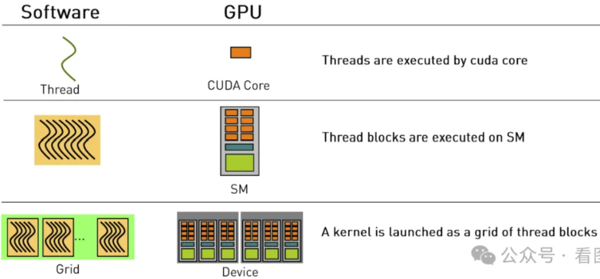
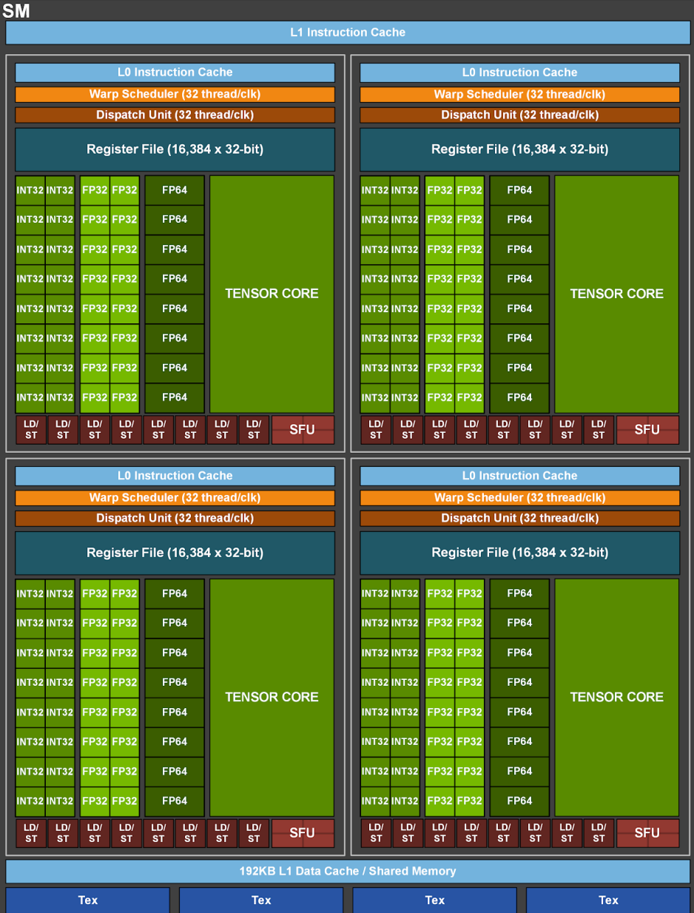
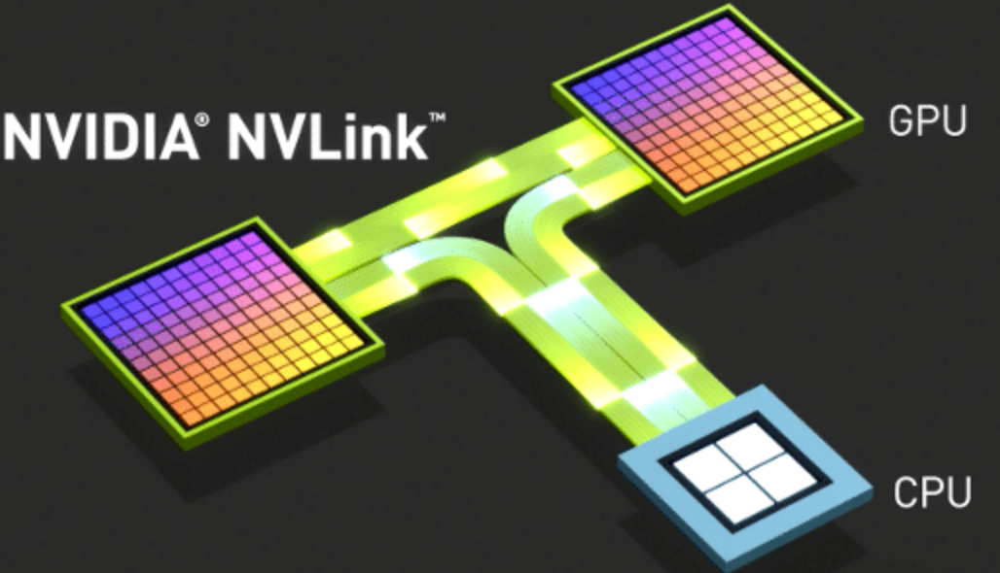

# 显卡扫盲

我上小学的时候，学校在偏远山区。学校也没钱请保洁，所以每次开学第一件事情，就是去操场上捡垃圾。

校长就类似 CPU，把“捡垃圾”的函数(kernel) 发送给教务处。教务处就类似 GPU，教务处把10个班级（Blocks）叫过来，打包成一个 Grid，取名为“拾酷跑团”。班级(Blocks) 里的每个学生(Thread) 都被叫到操场上站成一排，能把操场的一个边占满。

当校长喊：“目标是操场另一边，开始！”后，每个学生(Thread) 一边往前走，一边捡起操场上的垃圾。等每个学生(Thread) 都走到操场对面时，整个操场的每一寸土地都被我们小学生征服过，整个校园焕然一新。

我们校长简直就是使用 GPU 的高手！

捡垃圾的过程中，班级(Block)内会有一些协作，比如某个同学手里实在是拿不过来了，让班里其他同学帮忙拿一拿，你让其他班级（Blocks）帮你拿，人家才不理你（除非你长的好看）。

## GPU 的简易工作原理

CPU 的设计是全能型的，非常擅长处理复杂的任务，所以设计上有非常复杂的逻辑控制，昂贵的缓存，还有分支预测、乱序执行等高级天赋，还要负责整个系统的通信。

GPU 则主打一个偏科，没有那么多高级天赋，设计极其简单，高级天赋一个不点，就把计算和通信这两个天赋点加到了极致。 比如现在比较新 i9 CPU，售价5000左右，一共24个核。而3090显卡售价1万多，一共有 10496 个核。

> 举一个简单的例子，两个向量a和b相加。假设向量的长度为 8192。
>
> CPU 能算么？当然也能算，但是 CPU 的一个核的话那就要顺序执行 8192 次加法。
>
> ```cpp
> for(int i = 0; i < 8192; ++i)
>     c[i] = a[i] + b[i];
> ```
>
> GPU 怎么计算呢？因为有1万多个核，我第一个核执行 c[0] = a[0] + b[0], 第 k 个核执行 c[k] = a[k] + b[k]。由于是并行执行的，假设并行度是8192，那么 GPU 可以在一次加法的时间把所有计算完成。

GPU 运行大概的流程是这样的：

1. CPU 把数据扔给 GPU。这里会有一次内存搬运的工作，将数据从主机(host) 内存拷贝到显卡(device) 的显存里.
2. CPU 把运行的指令扔给 GPU。
3. GPU 根据指令对数据进行处理。
4. CPU 把 GPU 运行的结果搬回主机(host). 这是第二次内存搬运。

CPU 和 GPU 的通信，还有 GPU 之间的通信，很容易成为整个系统的瓶颈，所以 **GPU 的吞吐量也是衡量 GPU 很重要的指标**。

## CUDA 简介

CUDA 全称为 Compute Unified Device Architecture，它为开发人员提供了 GPU 的开发环境，隐藏了很多硬件实现和驱动的细节。

我们要写一个在 GPU 上运行的函数，这个函数叫做 Kernel。

然后 CUDA 提供了三个层次结构来并行的运行这些函数 (Kernels) ，分别是 Threads、Blocks 和 Grid。

- **Threads**逻辑上 GPU 运行的最小单元，Kernels 会并行的在 Threads 中运行。比如向量相加的任务中，每个 Threads 只负责一个下标的运算。
- **Blocks**由一组 Threads 构成，Blocks 内的 Threads 可以通过共享内存进行通信，这样可以更加灵活地处理一些 Threads 协作的情况。Blocks 内的共享内存访问速度要比访问全局内存快得多。
- **Grid**多个 Blocks 组成一个 Grid。一个 Kernel 只有 1个 Grid。


下面举一个简单的向量相加的例子。大多数算法的同学可能都是通过 pytorch 来实现的，然而 pytorch 底层则最终会以 C/C++ 来编写。

所以下图中同时给出了 pytorch 和 Cuda 的代码。但是这两段代码只是功能性一样，实际 pytorch 的实现要比这复杂的多。


## 硬件层面概念

CUDA 和 GPU 硬件在层次上的关系大致如下:



从 GPU 的结构来看，也可以大致分成三层结构，依次为 Device / SM / Cuda Core.

这里的 SM 指的是 streaming multiprocessor，它包含一些 CPU 类似的功能，比如有warp scheduler，register，shared memory 等。

比如一张 3090 (Device) 有 82 个 SM，每个 SM 管理 128 个 Cuda Core。所以一共有10496 个 core。

在开发者眼里，可能觉得GPU 运行的最小单元是 threads，我开1个thread 就只跑一个thread。**但是SM 在设计的时候，把 32 个 Threads 放到一起执行，称作 warp**。32 这个数字是 Nvidia 这么设计的，人家设计成这样我们也只能这样用。

所以对于 GPU 来说，warp 才是运行和调度的基本单元，也就是说一个 warp(32个Threads) 每次都要一起运行。铁索连环了。

为什么要有 warp scheduler 呢？是因为有时候 kernel 执行了一半暂时不计算了，比如在加载数据，这个时候就把计算资源腾出来给别的 wrap 用。**所以宏观上开发人员可以按照 Gird/Blocks/Threads 这么编写程序，但是微观上， SM 也是以分时系统在运行的。**

warp 的这种设计，有时候就会有问题。比如向量相加的时候，向量有65个。这65个可以分成3个warp，最后一个只处理1个元素，剩余31个threads 就浪费了。所以为什么模型设计的size 通常都是 32 的倍数。

然后还有因为kernel的分支导致的 Warp divergence 问题等，这些都是在 GPU 编程时要考虑的问题。

## 图形处理单元


最核心的部件，就是中间的 GPU 模块，**Graphics Processing Unit (GPU) 图形处理单元**，中间金闪闪的就是 GPU Core。如果有能力拆开的话，可以看到下面的架构。


仔细看的话，可以发现 A100 一共有 8 个 GPC (Graphics Processing Cluster)， 每个 GPC 包含 8 个 TPC (Texture Processing Cluster)，而每个 TPC 又包含 2个 SM (Streaming Multiprocessor)。

所以 A100 一共有 128 个 SM。至于 GPC 和 TPC 暂时可以先不管，会有一些图像处理的能力。

> 注意，这只是设计的时候有 128 个 SM，但是实际上在芯片这个东西是有良品率的，有时候光刻的时候刻坏了1个 SM，那难道把整个板子扔了？所以最终卖向市场的时候统一锁20个 SM，这样的话即使 SM 刻坏了几个，也能**通过短路的方法保证108个 SM 可用。所以市场上 A100 都是 108 个 SM**。

如果拿着放大镜，再看看 SM 的结构，是下面这个样子：



可以看出一个 SM 除了上面的 L1 Instruction Cache（一级指令缓存）和下面的 L1 Data Cache/Share Memory（一级数据缓存）、Tex（纹理缓存，Texture cache），有4个相同的部分。

每一个部分由如下几部分组成：

- Scheduler 调度（Warp Scheduler 和 Dispatch Unit）
- 寄存器（Register File）
- 数据加载、存储队列（LD/ST）
- 指令缓存（L0 Instruction Cache）
- 特殊函数单元SFU（Special Function Unit）
- Cuda Core (INT32,FP32,FP64,TENSOR CORE)

## CUDA Core

我们经常说 GPU 有多少个 core，其实就是这上面绿色的小方块，这些就是计算的基本单元。**由于衡量 GPU 的性能通常用的是浮点数计算，所以一般说的 Cuda Core，指的就是有多少个 FP32 计算单元。**

数一数就知道，一个 SM 有 64个 FP32 计算单元，A100 有 108 个 SM，所以一般就说 A100 有 108 * 64 个 Cuda Core.

早期的 GPU 只有 INT32 和 FP32，也就是32 位的整数和浮点数运算。打游戏足够了，最多再加上 SFU 来计算一些 sin/cos/log/exp 等运算。比如你打 CS，视角旋转了一下，实际上是整个场景要做一个旋转矩阵的运算。

对于一些高精度的计算比如 64 浮点数可以用算法拆分成 FP32 的多步计算，但是后来有一段时间 Nvidia 猛攻高精度计算，所以直接加上了 FP64 计算单元。再往后神经网络来了，天天矩阵运算算不过来，所以 Volta 架构加上了 Tensor Core。专门对矩阵运算做了很多优化，计算速度激增。

## Warp Scheduler

这个负责 Cuda Core 的调度。在 GPU 里，所有的 Threads 都会被分割成 32 个一组的 Warp，可以看到这里有4个 Warp Scheduler， 然后会根据 每个 Warp 执行的指令和状态分配到对应的 Cuda Core 上。

比如需要 LD/ST，或者需要进入 SFU 进行计算，或者送到 Tensor Core 矩阵运算，或者就是单纯的 INT32 或者 FP32 计算。

**计算的时候也是分时计算的**，比如只有 16 个 Cuda Core 可用，那一个 Warp 的指令需要2个周期来完成。如果只有2个 Cuda Core 可用（比如 FP64），那就需要16个周期来完成这个 Warp 的指令。

## 视频内存

Video Memory (VRAM) 视频内存，也就是大家经常说的显存。比如 A100 有 80G 和 40G 两款。A100 80G 的GPU 和 显存的通信带宽可以达到 2T/s，40G 的版本可以达到1.5T。而3090 的显存带宽为 936GB/s。

## 互连接口

Interconnection interface 互连接口。现在大模型训练基本都是需要多机多卡，比如一个模型的参数可能拆分到多个 GPU 上，各种梯度和中间的结果进行 reduce 和 gather 就需要通信，如果都借助 CPU 的 PCI 进行通信，那也太慢了，最高也就是PCIe Gen4: 64GB/s。

所以 Nvidia 开发了 NVLink 和 NVSwitch，两个 A100 GPU 之间可以达到 600G/s. 而 NVSwitch 则可以连接8张卡让他们之间的通信速度达到 600G/s。而 H100 则更快，达到了900G/s。



现在上万张卡怎么通信呢？那就只能借助高性能网络通信了。比如 llama2和3 里面提到他们有两个集群。分别为：

- InfiniBand: 用于高性能计算集群的高速网络通信协议，提供低延迟和高带宽的通信，适合跨节点的大规模 GPU 集群。常见的 InfiniBand 版本包括 HDR（200 Gbps）和 NDR（400 Gbps）。
- RoCE (RDMA over Converged Ethernet): 另一种高性能网络技术，允许在以太网上实现远程直接内存访问（RDMA），提供低延迟、高带宽的通信。

总结一下：

- 业务中整形运算比较多，就选 INT32 core 多的
- 如果是浮点数计算多，就选 FP32 core 多的
- 如果是科学计算，就选 FP64 多的
- 如果是矩阵运算，就选 Tensor Core 多且功能多的
- 如果打游戏就选择有 RT Core（光线追踪）的。
- 如果需要搭建集群，还要关注每个环节的通信吞吐量。