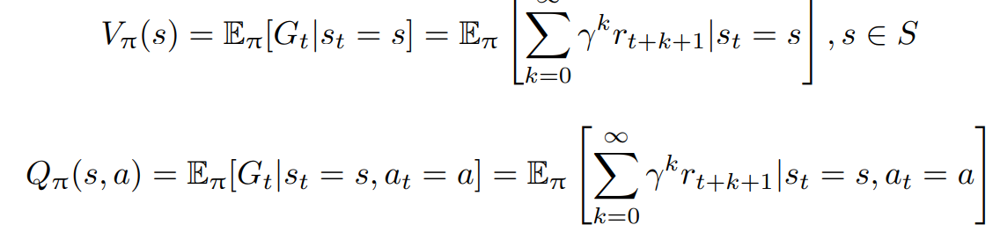

# 强化学习概述

> 来自 **HuggingFace 🤗 强化学习课程** 与 《大规模语言模型 从理论到实践》

强化学习（Reinforcement Learning，RL）研究的问题是智能体（Agent）与环境（Environment） 交互的问题，其目标是使智能体在复杂且不确定的环境中最大化奖励（Reward）。

强化学习基本框 架如图所示，主要由两部分组成：智能体和环境。在强化学习过程中，智能体与环境不断交互。 智能体在环境中获取某个状态后，会根据该状态输出一个动作（Action），也称为决策（Decision）。 动作会在环境中执行，环境会根据智能体采取的动作，给出下一个状态以及当前动作所带来的奖 励。智能体的目标就是尽可能多地从环境中获取奖励。

## 定义与概念

通过机器狗学习抓飞盘的例子，可以引出一些强化学习中基本概念：

1. **智能体与环境**：在机器狗学习抓飞盘的场景中，机器人狗就是一个智能体（Agent），它做出 决策并执行动作。而它所在的场景，包括飞盘的飞行轨迹和速度，以及其他可能的因素，则 构成了环境（Environment）。环境会根据智能体的行为给予反馈，通常以奖励的形式。
2. **状态、行为与奖励**：每次机器狗尝试抓飞盘，它都在评估当前的状态（State），这可能包括 飞盘的位置、速度等。基于这些信息，它会采取某种动作（Action），如跳跃、奔跑或待在原 地。根据机器狗所执行的动作，环境随后会给出一个奖励（Reward），这可以是正面的（成 功抓住飞盘）或负面的（错过了飞盘）。
3. **策略与价值**: 机器狗在尝试各种行为的过程中，其实是在学习一个策略（Policy）。策略可以 视为一套指导其如何在特定状态下行动的规则。与此同时，智能体还试图估计价值（Value） 函数，也就是预测在未来采取某一行为所能带来的奖励。

智能体与环境的不断交互过程中，会获得很多观测 oi。针对每一个观测，智能体会采取一个 动作 ai，也会得到一个奖励 ri。可以定义**历史** Ht 是观测、动作、奖励的序列：
$$
H_t=o_1,a_1,r_1, \cdots , o_t,a_t,r_t
$$
## 观察和状态

*观察*和*状态*之间需要区分：

- *状态 s*：是对**世界状态的完整描述**（没有隐藏信息）。在充分观察的环境中。在国际象棋游戏中，我们可以访问整个棋盘信息，因此我们从环境中接收状态。换句话说，环境是完全观察的。
- *观察 o*：是对**状态的部分描述。** 在部分观察到的环境中。在《超级马里奥兄弟》中，我们只能看到关卡中靠近玩家的部分，因此我们收到了观察结果。

智能体在采取当前动作的时候会依赖于它之前得到的历史，因此可以把**环境整体状态** St 看做关于 历史的函数：
$$
S_t=f(H_t)
$$
智能体能够观察到环境的所有状态时，称环境是完全可观测的（Fully Observed），这时观测 ot 等 于 St。当智能体只能看到部分的观测，称这个环境是部分可观测的（Partially Observed），这时观 测对状态的部分描述。整个的状态空间使用 S 进行表示。

## 动作空间

在给定的环境中，有效动作的集合经常被称为**动作空间**（Action Space），使用 A 进行表示：

- 围棋（Go）这样的环境具有离散动作空间（Discrete Action Space），智能体的动作数量在这个空 间中是有限的。智能体在围棋中的动作空间只有 361 个交叉点。
- 物理世界中则通常是连续动作 空间（Continuous Action Space）。在连续动作空间中，动作通常是实值的向量。例如，在平面中， 机器人可以向任意角度进行移动。

## 策略

**策略**是智能体的动作模型，决定了智能体的动作。策略也可以用函数进行表示，该函数将输入 的状态变成动作。策略可分为两种：随机性策略和确定性策。

- 随机性策略（Stochastic Policy）用 π 函数表示，即 $π(a|s) = p(a_t = a|s_t = s)$，输入一个状态 s，输出一个概率，表示智能体所有动作的 概率。利用这个概率分布进行采样，就可以得到智能体将采取的动作。
- 确定性策略（Deterministic Policy）是智能体直接采取最有可能的动作，即 $a^∗ = \mathop{\arg \max}\limits_{a} π(a|s) $

## 价值函数的理解

**价值**函数的值是对未来奖励的预测，可以用它来评估状态的好坏。价值函数可以只根据当前的 状态 s 决定，使用 $V_π(s)$ 表示。也可以根据当前状态 s 以及动作 a 表示，使用 $Q_π(s, a)$ 表示。

其中，γ 为折扣因子（Discount Factor），针对短期奖励和远期奖励进行折中；期望 E 的下标为 π 函数，其值反映在使用策略 π 时所能获得的奖励值。

可以这么理解：每个时间步长t的累计奖励等于序列中所有奖励的总和：
$$
R(\tau)=\sum_{k=1}^{\infty} r_{t+k+1}
$$
但是，在现实中，**我们不能像那样添加它们。** 较早到来的奖励（在游戏开始时）**更有可能发生**，因为它们比长期的未来奖励更具可预测性。

为了打折奖励，我们定义了一个称为 $\gamma$ 的贴现率。 **它必须介于 0 和 1 之间。** 大多数时候在 **0.95 到 0.99** 之间。伽玛越大，折扣越小。这意味着我们的代理商更关心**长期回报**。
$$
R(\tau)=\sum_{k=1}^{\infty} \gamma^k r_{t+k+1}
$$

## 智能体归类

根据**智能体**所学习的组件的不同，可以把智能体归类为：基于价值的智能体、基于策略的智 能体和演员-评论员智能体。

- 基于价值的智能体（Value-based Agent）显式地学习价值函数，隐式地 学习策略。其策略是从所学到的价值函数推算得到的。
- 基于策略的智能体（Policy-based Agent）则 是直接学习策略函数。策略函数的输入为一个状态，输出为对应动作的概率。基于策略的智能体 并不学习价值函数，价值函数隐式的表达在策略函数中。
- 演员-评论员智能体（Actor-critic Agent）则 是把基于价值的智能体和基于策略的智能体结合起来，既学习策略函数又学习价值函数都，通过 两者的交互得到最佳的动作。

## 任务类型

**偶发**任务：有一个起点和一个终点**（一个终端状态）。这将创建一个情节**：状态、行动、奖励和新状态的列表。例如，想想《超级马里奥兄弟》：一集从新的马里奥关卡开始，到**你被杀或到达关卡结束时结束。**

**持续**任务：永远持续（**无最终状态**）的任务。在这种情况下，代理必须**学习如何选择最佳操作并同时与环境交互。**例如，进行自动股票交易的代理。对于此任务，没有起点和最终状态。**代理将一直运行，直到我们决定停止它。**

## 探索-利用权衡

探索-利用权衡（exploration-exploitation trade-off）

- 探索是通过尝试随机操作来探索**环境，以找到有关环境的更多信息。**
- 利用是**利用已知信息来最大化回报。**

RL智能体的目标是最大化预期的累积奖励。然而，**可能会陷入一个常见的陷阱**：在游戏中，我们的老鼠可以拥有**无限数量的小奶酪**（每个+1）。但是在迷宫的顶部，有一大块奶酪（+1000）。

如果我们只专注于剥削，我们的智能体将永远无法达到巨大的奶酪金额。相反，它只会利用**最近的奖励来源，**即使这个来源很小（利用）。但是，如果我们的代理做一点探索，它就可以**发现巨大的奖励**（一堆大奶酪）。

因此，我们需要平衡我们对**环境的探索**程度和我们对**环境的了解**。我们必须**定义一个有助于处理这种权衡的规则**。

## 强化学习与有监督学习的区别

可以用旅行方式进行更直观的对比，有 监督学习和强化学习可以看做两种不同旅行方式。

旅行前的准备：数据来源

- 监督学习: 这如同旅行者们拿着一本旅行指南书，其中明确标注了各个景点、餐厅和交通方 式。在这里，数据来源就好比这本书，提供了清晰的问题和答案对。
- 强化学习: 旅行者们进入了一个陌生的城市，手上没有地图，没有指南。所知道的只是他们 的初衷，比如找到城市中的一家餐厅或博物馆。这座未知的城市，正是强化学习中的数据来 源，充满了探索的机会。

路途中的指引：反馈机制 

- 监督学习: 在这座城市里，每当旅行者们迷路或犹豫时，都会有人告诉他们是否走对了路。这 就好比每次旅行者提供一个答案，监督学习都会告诉他们是否正确。 
- 强化学习: 但在另一座城市，没有人会直接告诉旅行者们如何走。只会告诉他们结果是好还 是坏。比如，走进了一家餐厅，吃完后才知道这家餐厅是否合适。需要通过多次尝试，逐渐 学习和调整策略。 

旅行的终点：目的地 
- 监督学习: 在这座城市的旅行目的非常明确：掌握所有的答案，就像参观完旅行指南上提及 的所有景点。 
- 强化学习: 在未知的城市，目标是学习如何在其中有效地行动，寻找最佳的路径，无论是寻 找食物、住宿还是娱乐。

## 深度强化学习

深度强化学习引入了**深度神经网络来解决强化学习问题**，因此得名“深度”。

- Q-Learning（经典强化学习）：**使用传统算法**来创建一个 Q 表，帮助我们找到对每个状态要采取的操作。
- 深度 Q-Learning：**使用神经网络**近似 Q 值。

