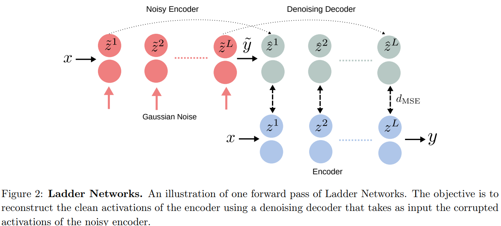
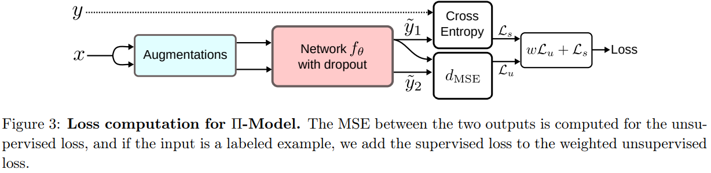
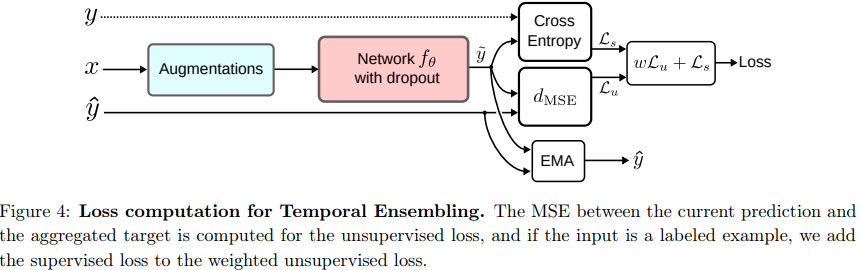
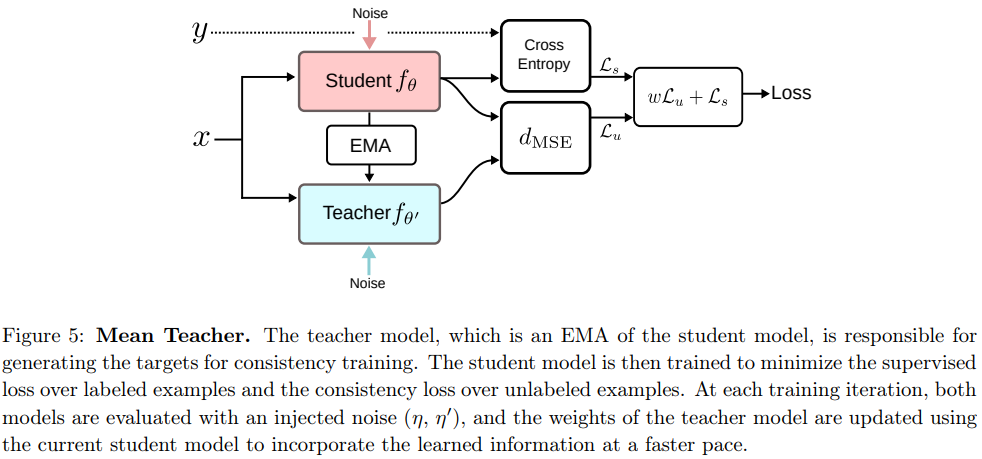
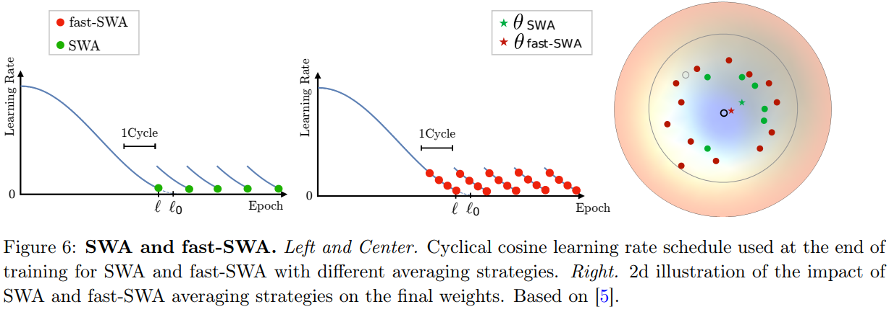
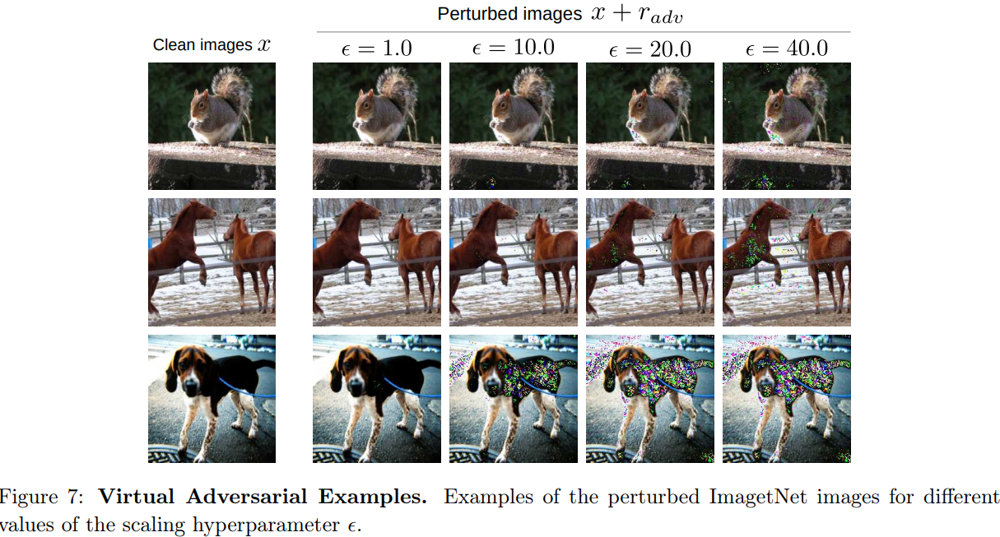
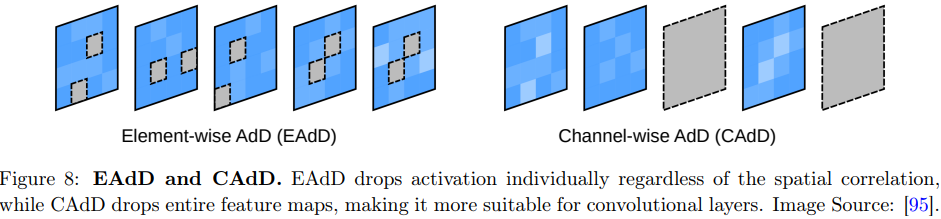
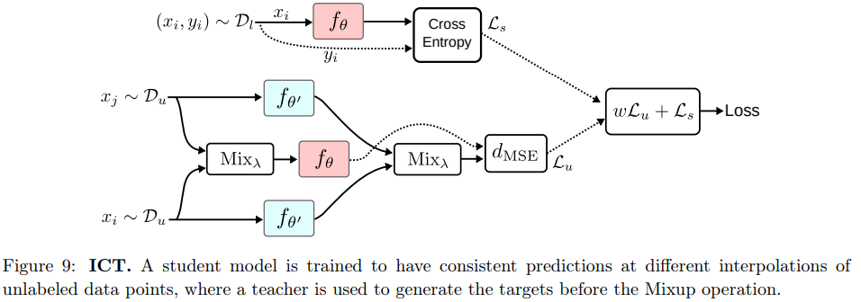
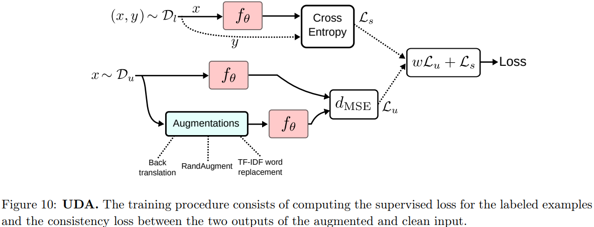

# Consistency Regularization

半监督学习的假设之一是，学习的决策边界必须位于低密度区域。换句话说，如果将扰动用于未标记的样本，则预测不应发生大变化

正式地说，通过**一致性正则化** Consistency Regularization，我们倾向于选择对相似数据点给出一致预测的函数 $$f_{\theta}$$

> 正则化模型不是在输入空间的零维数据点上最小化分类成本，而是在每个数据点周围的流形上最小化成本，将决策边界推离未标记的数据点，并平滑数据所在的流形

具体来说，给定一个未标记的数据点 $$x \in \mathcal{D}_u$$及其扰动版本 $$\hat{x}_u$$，目标是最小化两个输出和之间的距离 $$d(f_{\theta}(x),f_{\theta}(\hat{x}))$$。常用的距离度量除了MSE，还有其他的距离，比如Kullback-Leiber divergence和JenSen-Shannon divergence
$$
\begin{align*}
d_{\text{MSE}}(f_{\theta}(x), f_{\theta}(\hat{x}))&=\frac{1}{C}\sum_{k = 1}^{C}(f_{\theta}(x)_k - f_{\theta}(\hat{x})_k)^2\\
d_{\text{KL}}(f_{\theta}(x), f_{\theta}(\hat{x}))&=\frac{1}{C}\sum_{k = 1}^{C}f_{\theta}(x)_k \log \frac{f_{\theta}(x)_k}{f_{\theta}(\hat{x})_k}\\
d_{\text{JS}}(f_{\theta}(x), f_{\theta}(\hat{x}))&=\frac{1}{2}d_{\text{KL}}(f_{\theta}(x), m) + \frac{1}{2}d_{\text{KL}}(f_{\theta}(\hat{x}), m)
\end{align*}
$$
其中，一共 C 种类别，$$m=\frac{1}{2}(f_{\theta}(x)+f_{\theta}(\hat{x}))$$

## Ladder Networks

如果需要网络对噪声不敏感，那不如训练的时候就直接加上噪声！然后把噪声项放到损失函数里面去

如图，假设神经网络是一个编码层，那么Ladder Networks就加入了解码层，编码层分成两部分：

- 一部分是干净的编码层，x 输入后直接输出 y
- 另一部分是 x 输入后，在批次归一化时中加入噪声，然后输出被污染后的输出 $$\tilde{y}$$，然后 $$\tilde{y}$$ 再进入解码层，还原出 x 在编码层中的每一个输出，能还原的越好，就说明网络编码的越好，损失也就越低

损失函数如下，$$\mathcal{L}_u$$ 为无监督学习损失，在所有层上计算两种激活值的MSE，$$\lambda_t$$ 代表权重。$$\mathcal{L}_s$$ 代表监督损失，例如交叉熵 $$\mathrm{H}(\tilde{y}, t)$$，t 代表真实标签
$$
\begin{align*}
\mathcal{L}&=\mathcal{L}_u+\mathcal{L}_s\\&=\frac{1}{|\mathcal{D}|}\sum_{x\in\mathcal{D}}\sum_{l = 0}^{L}\lambda_t d_{\text{MSE}}(z^{(l)}, \hat{z}^{(l)})+\frac{1}{|\mathcal{D}_l|}\sum_{x,t\in\mathcal{D}_l}\mathrm{H}(\tilde{y}, t)
\end{align*}
$$

> 这种编码结构可以在卷积神经网络中很好的应用，通常在卷积神经网络的最后一层是全连接层，正好可以通过这种方式来代替，而前面的特征提取部分则不用改动。

然而，**梯形网络** Ladder Networks 的计算量相当大，大约是一次训练迭代所需的计算量的三倍。为了缓解这种情况，作者提出了一种称为 Γ 模型的梯形网络变体。当 $$l<L$$ 时 $$\lambda_t=0$$。在这种情况下，省略解码器，$$\mathcal{L}_u$$ 为 y 和 $$\tilde{y}$$ 之间的 MSE

## Pi-Model

dropout是一个正则化的好方法，同时，对数据进行增强（对于图像数据而言，可以有仿射变换或者裁剪）也是一个好方法。pi-model是这两个方法的一个应用

$$
\mathcal{L} = w\frac{1}{|\mathcal{D}_u|}\sum_{x\in\mathcal{D}_u}d_{\text{MSE}}(\tilde{y}_1, \tilde{y}_2) + \frac{1}{|\mathcal{D}_l|}\sum_{x,y\in\mathcal{D}_l}\mathrm{H}(y, f(x))
$$
其中 w 是一个加权函数，在给定的 epoch 数（例如，训练时间的 20%）后从 0 开始增加到固定权重 λ。因为在刚开始训练时监督学习更可靠。注意在无监督训练损失中，需要计算两次，由于增强和dropout两次输出会有轻微不同，为了让模型更鲁棒，使其一致性正则化

## Temporal Ensembling

如图，**时间集成** Temporal Ensembling 中，目标 $$y_{\text{ema}}$$ 是所有先前预测的聚合：
$$
y_{\text{ema}} = \alpha y_{\text{ema}} + (1 - \alpha)\tilde{y}
$$
在训练开始时，$$y_{\text{ema}}=0$$，需要使用类似于 Adam 优化器中使用的偏差校正技巧，校正目标 $$\tilde{y}$$ 
$$
y_{\text{ema}} = (\alpha y_{\text{ema}} + (1 - \alpha)\tilde{y})/(1 - \alpha^t)
$$
> 关于 $$\alpha$$ ，假设值设的很大，那么新的新学到的信息需要完全被模型考虑到，需要经过很长的时间。而值设的很小，之前的信息又不会被考虑的那么充分

时间集成中的损失计算与 Pi-Model 保持一致
$$
\mathcal{L} = w\frac{1}{|\mathcal{D}_u|}\sum_{x\in\mathcal{D}_u}d_{\text{MSE}}(\tilde{y}, \hat{y}) + \frac{1}{|\mathcal{D}_l|}\sum_{x,y\in\mathcal{D}_l}\mathrm{H}(y, f(x))
$$
总结一下，相比Pi-Model有两个重要优势：

- 训练速度更快，因为我们只需要通过网络进行一次前向传播即可获得，从而将训练时间加快约 2 倍
- Pi-Model在无监督训练损失中计算了两次，然后通过 MSE 一致性正则化，这样有些“随意”并且不稳定。时间集成使用所有先前预测的聚合，在训练过程中目标更加稳定，从而产生更好的结果

时间集成的缺点是需要大量内存来保存所有训练样本的预测聚合，对于大型数据集和密集任务（例如，语义分割），这可能会非常占用内存。

## Mean teachers

Pi-model和时间集成模型在每一次训练中，都是“自己教自己”，如果分类错误，而且无监督的损失的权重超过了有监督的损失，那模型就会被阻止学习新的正确的信息。解决方法包括

1. 仔细的选择噪声，而不是仅仅选择加性或乘性噪声。
2. 仔细的选择导师模型，这个导师模型要对生成的学习目标负责，而不是简单的用学生模型来“自己教自己”。即 平均值教师 Mean teachers的思路

本质是，教师模型的权重 $$\theta'$$ 也做一次指数加权平均（Exponential Moving Average，EMA）
$$
\begin{align*}
\theta_t'&=\alpha\theta_{t - 1}'+(1 - \alpha)\theta_t\\
\mathcal{L}&=w\frac{1}{|\mathcal{D}_u|}\sum_{x\in\mathcal{D}_u}d_{\text{MSE}}(f_{\theta}(x), f_{\theta'}(x))+\frac{1}{|\mathcal{D}_l|}\sum_{x,y\in\mathcal{D}_l}\mathrm{H}(y, f_{\theta}(x))
\end{align*}
$$

## Dual Students

Mean Teacher 的主要缺点之一是，在大量训练迭代下，教师模型的权重将收敛到学生模型的权重，并且任何有偏差和不稳定的预测都会转移到学生身上

双元制学生 Dual Students 方法中，同时训练两个具有不同初始化的学生模型，在给定的迭代中，其中一个模型为另一个模型提供目标。那么谁是老师呢？需要满足以下两个条件

- 对于干净的x和扰动版本 $$\tilde{x}$$，做老师的那个学生需要 $$f(x)=f(\tilde{x})$$
- 对于干净的x和扰动版本 $$\tilde{x}$$，做老师的那个学生对于预测都很自信，$$f(x)$$ 和 $$f(\tilde{x})$$ 都大于阈值 $$\epsilon$$

两个学生的损失如下：
$$
\mathcal{L}=\mathcal{L}_s+\lambda_1\mathcal{L}_u=\frac{1}{|\mathcal{D}_l|}\sum_{x,y\in\mathcal{D}_l}\mathrm{H}(y, f_{\theta_i}(x))+\lambda_1\frac{1}{|\mathcal{D}_u|}\sum_{x\in\mathcal{D}_u}d_{\text{MSE}}(f_{\theta_i}(x), f_{\theta_i}(\tilde{x}))
$$
此外，还需要额外更新不稳定的学生，即 $$\mathcal{E}^i = \left\lVert f_i(x) - f_i(\tilde{x}) \right\rVert^2$$ 最大的学生：
$$
\lambda_2\sum_{x\in\mathcal{D}_u}d_{\text{MSE}}(f_{\theta_i}(x), f_{\theta_j}(x))
$$

## Fast-SWA

前面的几种方法，其实都是在网络的权重空间上做文章，最后尝试走到一个最好的地方。但是各种方法通过SGD随机梯度下降到最后，参数的改变往往都会非常小，也就是走到了一个所谓的“平坦”的区域。任何一种训练方法其实都是在不断的逼近局部最优点，由于之前一致性正则化的要求，就算有很多个网络共同参与训练，那么他们最后也会收敛至一个局部最优。

虽然每一个函数都没有到达局部最优，但是他们的参数都是一个局部最优的估计量。根据大数定律，假设网络的个数足够多，并且都已经在之前的一致性正则化算法比较趋近于最优点，那么他们参数的平均值就是最优点的无偏估计量，这就是Stochastic Weight Averaging 的 SWA算法。

SWA基于在训练结束时以循环学习率对 SGD 遍历的权重进行平均。在给定的 epoch 数后，学习率变为**循环学习率**（类似退火），训练重复几个周期，每个周期 Cycle 结束时对应于学习率最小值的权重被存储，并平均在一起得到一个平均权重为 $$f_{\theta_{\text{SWA}}}$$ 的模型，然后用于进行预测

> 与退火的思想比较：学习率在网络开始训练的时候学习率一般比较大，收敛的比较快。到网络训练的后期，学习率应该逐渐减小，不然就会产生振荡的过程。而在第一次训练逐渐收敛到一个值的时候，原本学习率也很小了，训练接近结束。
>
> 但是我们可以忽然把学习率设为一个比较高的值（就实现了退火）。这时候再进行训练，网络的损失函数要是处于一个比较sharp的区域，会有很大的可能就跳出了这个局部最小，转而去寻找其他的局部最小，这样就实现了退火功能。

由于 SWA 每个周期只收集一次权重，这意味着需要许多额外的训练 epoch 才能收集足够的权重进行平均。fast-SWA 是 SWA 的修改版，它对同一周期内对应于许多点的网络进行平均，从而产生更好的最终模型和更快的集成过程。

## Virtual Adversarial Training

以前的方法侧重于对每个输入应用随机扰动以生成人工输入点。事实上，我们可以找到模型的弱点，用最具针对性的扰动来优化，而不是随机生成扰动

> 有时在一张图上改变一个像素点，网络的预测就会发生巨大的变化。而VAT就是通过生成一些攻击样本，来找出网络的弱点

对于给定数据点 x ，我们需要计算能够最大程度改变模型预测的对抗扰动 $$r_{adv}$$

1. 从高斯分布中采样与输入 x 同维度的噪声 $$r \sim \mathcal{N}(0, \frac{\xi}{\sqrt{\text{dim}(x)}}I)$$
2. 计算噪声 r 在加或不加噪声模型预测loss上的梯度 $$\text{grad}_r = \nabla_r d_{\text{KL}}(f_{\theta}(x), f_{\theta}(x + r))$$
3. 对梯度进行归一化（确定方向）并按超参数 ϵ 缩放（确定大小）$$r_{adv} = \epsilon \frac{\text{grad}_r}{\lVert \text{grad}_r \rVert}$$

> 若需更精确估计，可将当前 $$r_{adv}$$ 作为新的初始噪声 r，重复步骤2-3进行迭代。但计算成本较高

梯度 $$\text{grad}_r$$ 指向使 KL 散度（即预测差异）增加最快的方向。沿着此方向施加扰动，能最大程度改变模型的预测结果，加上扰动的例子如下：

无监督训练 Loss 改为
$$
\mathcal{L}_u = w\frac{1}{|\mathcal{D}_u|}\sum_{x\in\mathcal{D}_u}d_{\text{MSE}}(f_{\theta}(x), f_{\theta}(x + r_{adv}))
$$
为了实现更稳定的训练，可以通过 Mean teachers 将 $$f_{\theta}(x)$$ 替换为 $$f_{\theta'}(x)$$

## Adversarial Dropout

除了在数据上加对抗性噪声之外，对于模型也可以加上对抗性 Dropout，诱导了稀疏的神经网络结构，对噪声更鲁棒

与 VAT 类似，我们从随机 dropout 掩码开始，计算输出有和没有 dropout之间的 KL 散度损失，并给定损失相对于 dropout 层之前的激活的梯度，以对抗方式更新 dropout 掩码。换句话说，增大模型输出分布差异。

预测函数 $$f_{\theta}(x)$$ 分为两部分 $$f_{\theta}(x,\epsilon)=f_{\theta_2}(f_{\theta_1}(x)\odot\epsilon)$$ ，符号 ⊙ 表示元素逐位相乘，dropout掩码会根据其值随机地将一些输出值置0，然后计算雅可比矩阵的近似值如下：
$$
J(x,\epsilon)\approx f_{\theta_1}(x)\odot\nabla_{f_{\theta_1}(x)}d_{\text{KL}}(f_{\theta}(x), f_{\theta}(x,\epsilon))
$$

> 复习一下雅可比矩阵，对于多元向量值函数 $$\mathbf{f}: \mathbb{R}^{n} \rightarrow \mathbb{R}^{m}$$
> $$
> \begin{align*}
> J_{\mathbf{f}}&=\left[\begin{array}{ccc}
> \frac{\partial \mathbf{f}}{\partial x_1}&\cdots&\frac{\partial \mathbf{f}}{\partial x_n}
> \end{array}\right]\\
> &=\left[\begin{array}{cccc}
> \frac{\partial f_1}{\partial x_1}&\frac{\partial f_1}{\partial x_2}&\cdots&\frac{\partial f_1}{\partial x_n}\\
> \vdots&\ddots&\vdots\\
> \frac{\partial f_m}{\partial x_1}&\frac{\partial f_m}{\partial x_2}&\cdots&\frac{\partial f_m}{\partial x_n}
> \end{array}\right]
> \end{align*}
> $$
> $$\nabla_{f_{\theta_1}(x)}$$ 是对 $$f_{\theta_1}(x)$$ 的梯度计算，当它在某一位置为正，说明在该位置上，$$f_{\theta_1}(x)$$ 有一个微小的正向变化时，会导致 $$d_{\text{KL}}(f_{\theta}(x), f_{\theta}(x,\epsilon))$$ 增大。也就是有 dropout 和无 dropout 时模型输出分布之间的差异会增大
>
> 再通过⊙按照元素乘 $$f_{\theta_1}(x)$$，得到雅可比矩阵，它表示了输入 x 和 dropout 掩码 ϵ 对模型输出的影响

然后我们需要调整随机 $$\epsilon$$ 在给定位置 i 的值，得到 $$\epsilon^{adv}$$

- 如果 $$\epsilon(i)=0$$ （当前该特征被屏蔽） 且 $$J(x,\epsilon)(i) > 0$$，则反转 $$\epsilon$$ 该位置的值。因为这个特征是比较敏感的（能增大KL散度），于是激活它，使得该特征能够参与计算，进一步增大模型输出分布差异。
- 如果 $$\epsilon(i)=1$$ 且 $$J(x,\epsilon)(i) <0$$，则反转 $$\epsilon$$ 该位置的值
- 其他情况不变

然后计算损失：
$$
\mathcal{L}_u = w\frac{1}{|\mathcal{D}_u|}\sum_{x\in\mathcal{D}_u}d_{\text{MSE}}(f_{\theta}(x), f_{\theta}(x,\epsilon^{\text{adv}}))
$$
以上方法为element-wise adversarial dropout (EAdD)，元素级别，仅限于全连接网络。为了将这种方法扩展到更多网络结构（例如卷积），可以使用 channel-wise AdD (CAdD) ，如图：

此外，在更新 $$\epsilon^{adv}$$ 的时候，不能让它丢弃全部的激活值（因为最简单的对抗就是把激活值全部丢掉），我们需要加上限制，以下是 EAdD 和 CAdD 的限制
$$
\left\lVert \epsilon^{adv} - \epsilon \right\rVert_2 \leq \delta H \\
\frac{1}{HW} \sum_{i = 1}^{C} \lVert \epsilon^{adv}(i) - \epsilon(i) \rVert \leq \delta C
$$

## Interpolation Consistency Training

VAT和AdD模型要求的计算量都十分大。插值一致性训练 ICT 作为替代方法被提出，我们不再苛求于找一个“最好”的优化方向，而是找一个“相对好”的优化方向

随机找两个数据点 $$x_i,x_j$$ 很可能位于不同的集群中并属于不同的类。我们可以将决策边界向其**插值**处移动，扰动为 $$x_i+\delta=\text{Mix}_{\lambda}(x_i, x_j)$$

如图，使用 MixUp 插值公式 $$\text{Mix}_{\lambda}(a, b) = \lambda \cdot a + (1 - \lambda) \cdot b$$ ，ICT 训练预测函数 $$f_{\theta}(x)$$ ，在未标记数据点 $$x_i$$ 和 $$x_j$$ 的不同插值处提供一致的预测，目标是使用教师模型 $$f_{\theta'}(x)$$ 生成的，该模型是 $$f_{\theta}(x)$$ 的 EMA
$$
f_{\theta}(\text{Mix}_{\lambda}(x_i, x_j)) \approx \text{Mix}_{\lambda}(f_{\theta'}(x_i), f_{\theta'}(x_j))
$$
无监督目标是在给定两个未标记数据点的混合输入的情况下，学生模型的预测与教师模型的混合输出之间具有相似的值。
$$
\mathcal{L}_u = w\frac{1}{|\mathcal{D}_u|} \sum_{x_i, x_j \in \mathcal{D}_u} d_{\text{MSE}}(f_{\theta}(\text{Mix}_{\lambda}(x_i, x_j)), \text{Mix}_{\lambda}(f_{\theta'}(x_i), f_{\theta'}(x_j)))
$$

## Unsupervised Data Augmentation

无监督的数据增强有如下好处：

- 生成真实的增强示例，可以安全地鼓励对原始示例和增强示例的预测之间的一致性
- 可以生成相当多与不同种类的样本，增加采样效率
- 可以防止对于不同任务的归纳偏置（inductive biasas）

> 归纳偏置和贝叶斯分布的“先验条件”比较相似。就是说，我们在建立模型开始训练的时候，可能就认为的给模型增加了一些先验的条件，这些条件导致模型的训练有些偏差。按照我们的理解，增加一些先验的条件，常常是好的（比如让模型学球的识别时候，让他先知道是个圆），但是有时候也会造成一些误判

常见方法有：

- AutoAugment：创建一个数据增强策略的搜索空间，直接在感兴趣的数据集上评估特定策略的质量，这样在每一次数据增强时就可以自动选取最佳的增强策略进行训练。
- RandAugment：就是简单的对图像随机使用仿射变换。
- Back-translation：通常用于文本翻译任务，比如要把A先翻译成另外一个语言B，然后再让其翻译回A，来实现增强。

