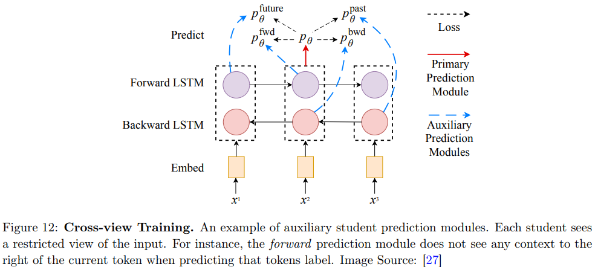

# Proxy-label Methods

代理标签方法 Proxy-label Methods 是一类半监督学习算法，它在无标签数据上生成 proxy-label，提供额外的训练信息。分为两类：

1. 自训练(self-training)：每一个数据的 proxy-label 由网络自己提供。
2. 多视角学习（Multi-view learning）:proxy-label 由对数据的不同观测训练出的模型提供。

## Self-training

在自训练中 Self-training，少量的标记数据 $$\mathcal{D}_l$$ 首先用于训练预测函数 $$f_{\theta}$$。然后，训练后的模型被用于为未标记数据点 $$x \in \mathcal{D}_u$$ 分配伪标签（概率分布形式给出），如果分配给其最可能类别的概率高于预定阈值 $$\tau$$ ，则将 $$(x,\arg \max f_{\theta}(x))$$ 添加到标记集。重复进行，直到模型无法产生有信心的预测。

此类方法的主要缺点是模型无法纠正其自身的错误，以及任何有偏见和错误的分类都可能被迅速放大，从而导致未标记数据点上出现置信度高但错误的伪标签。

> 可以考虑分开student和teacher，教师模型先在标记数据上训练，并为未标记数据生成软代理标签；学生模型则在标记数据和代理标签上进行训练，并通过主动注入噪声来增强鲁棒性。在后续迭代中，学生模型升级为教师模型，并采用更大规模的EfficientNet作为学生模型，循环该过程直至最大模型。

### Meta Pseudo Labels

元学习，简单的来说，就是“让机器学习去学习”，例如自己设定学习率，超参数，甚至网络的架构

Meta Pseudo label 方法中，存在一个teacher和一个student。teacher生成代理标签给student学习，然后teacher根据student学习的反馈更新自己的参数，然后在下一次生成一批更好的标签给student继续学习。具体来说包括下面两步：

1. student从teacher学习，首先给定一个样本集 $$x\in{D_{l}}$$ ，teacher 生成目标 $$(x_i,f_{\theta'}(x))$$ 用交叉熵训练学生 $$f_{\theta}$$
2. teacher收集到学生的验证损失（通俗的来说，就是答卷），以及额外的标记数据点进行训练，更新参数得到$$\theta ' (t+1)$$ 

也就是说，老师可以通过学生的表现进行调整，就是师生相互学习，共同进步。

## Multi-view training

在实际应用中，可以通过不同的测量方法（例如，图像的颜色信息和纹理信息）收集不同的视图 view。**多视图学习** Multi-view training (MVL) 对数据点 x 的给定视图 $$v_i(x)$$ 进行建模得到 $$f_{\theta_i}$$，并联合优化所有函数以提高泛化性能。理想情况下，视图相互补充协作以提高彼此的性能

### Co-training

每一个数据 $$x$$ 有两个视角 $$v_1(x), v_2(x)$$ 并且每一个视角收集到的数据都足够多，都能来训练一个函数。在两个预测函数 $$f_{\theta _1},f_{\theta _2}$$   训练成功之后，接下来进入循环：如果模型A对一个数据点有足够自信的预测（超过某个阈值），那么这个数据点就被用来作为另一个模型的训练集对模型B进行训练。简单的来说，就是一个模型能给另外一个模型提供该模型不确定的数据。 

但是多数情况下，x 只有一个视角，那么我们就可以使用不同的学习算法，或者不同的参数设定来训练两个分类器，然后执行相同的迭代过程。我们还可以对视角 $$v(x)$$ 加入噪声或者通过不同的增强方法来生成不同的视角。

Democratic Co-training 是一种延伸方法，将输入数据的不同视图替换为具有不同架构和学习算法的许多模型，这些模型首先在标记样本上进行训练。如果大多数模型自信地同意其标签，则使用经过训练的模型来标记给定的示例 x。

### Tri-Training

Tri-training 试图克服多视图数据的缺乏。首先，使用标记后的数据 $$\mathcal{D}_l$$ 训练三个预测函数 $$f_{\theta _1},f_{\theta _2},f_{\theta _3}$$ 。对于一个给定的未标记数据 $$x\in \mathcal{D}_u$$  和 $$f_{\theta_i}$$ ，如果其他两个模型对他们的分类都是一致的，那么这个数据就加入$$f_{\theta_i}$$监督学习数据集。直到没有数据被放入任何模型的监督学习训练集中，训练结束。 

Tri-Training 既不需要存在多个视图，也不需要唯一的学习算法，使其更普遍适用。将 Tri-training 与神经网络一起使用可能非常昂贵，需要对所有未标记的数据对三个模型中的每一个进行预测。

Multi-task tri-training 是一种延伸方法，用于减少时间和样本复杂性，三个模型各自的分类层共享相同的特征提取器。在这种方法中，每一个模型在训练时，都需要增加一个正则化损失项来保证自己和另外两个模型是正交的。以防止模型出现相似性，最后以至于走向了自训练的路。

Cross-View Training 是一种延伸方法。首先，所有的模型共享编码层，分类层是各自的。这些模块被分成学生预测模块和主要的教师模块。

- 每个学生预测模块的输入是模型中间表示的一个子集，对应于输入的受限视图（例如仅向其中一个学生提供来自给定双向 LSTM 层的前向 LSTM，因此它在进行预测时看不到当前位置右侧的任何标记）
- 主要教师模块仅在有标签的示例上进行训练，并负责生成伪标签，以无标签输入的完整视图作为输入，

学生被训练为与教师模块具有一致的预测。给定编码器 e、教师模块 t 和 K 个学生模块 $$s_i$$ (输入受限视图)，训练目标如下所示：
$$
\mathcal{L}=\mathcal{L}_u+\mathcal{L}_s=\frac{1}{|\mathcal{D}_u|}\sum_{x\in\mathcal{D}_u}\sum_{i = 1}^{K}d_{\text{MSE}}(t(e(x)), s_i(e(x)))+\frac{1}{|\mathcal{D}_l|}\sum_{x,y\in\mathcal{D}_l}\mathrm{H}(t(e(x)), y)
$$
学生预测模块可以从教师模块的预测中学习，因为这个主要模块对输入有更好、不受限制的视图。由于学生模块在对输入的视图受限的情况下学会做出准确的预测，所以它们提高了共享的编码器产生的表示的质量。这反过来又改进了教师

