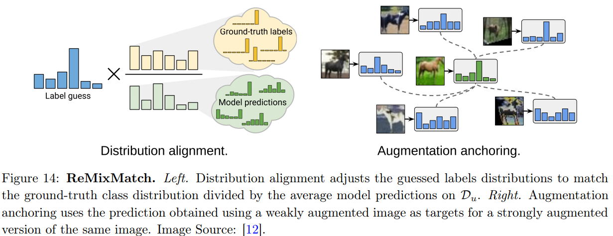
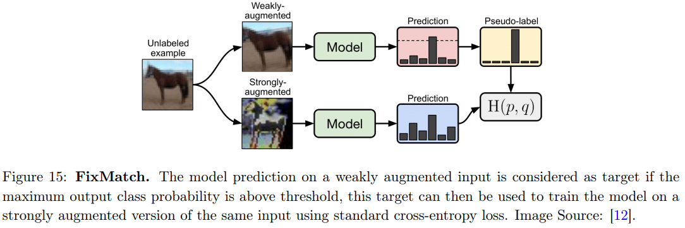

# Holistic Methods

整体方法 Holistic Methods 旨在从整体角度对数据和模型进行处理与优化，而不是孤立地看待有标签数据或无标签数据。它们通常会综合考虑所有可用数据（有标签的和无标签的）来构建模型，挖掘数据间的全局结构和潜在关系，以提升模型性能。

## MixMatch

MixMatch 综合利用了增强标记的示例和带有代理标签的增强未标记示例，方法如下

1. 数据增强。通过给定的一个变换（比如pytorch中的transform库，可以对图像进行随机裁剪、仿射变换。抑或是加入噪声干扰等等）。对于每个有标签的数据，只进行一次变换增强，对于每个无标签的数据，增强函数会重复使用K次，生成K个被增强的无标记样本 $$\tilde{x}_1,...,\tilde{x}_K $$
2. 猜测标签。这一步对无标签数据生成代理标签。对 K 个增强数据生成标签然后平均，即$$\hat{y}=\frac{1}{K}\sum_{k=1}^K \hat{y}_k$$，得到 $$(\tilde{x}_1,\hat y),…,(\tilde{x}_K,\hat{y})$$
3. 锐化。为了让模型有更加自信的预测，使用较小的 T 计算 softmax $$(\hat{y})_k = (\hat{y})_k^{\frac{1}{T}} / \sum_{k = 1}^{C}(\hat{y})_k^{\frac{1}{T}}$$
4. Mixup。现在我们有两个增强数据集，有真实标签的 $$\mathcal{L}$$，和带伪标签的 $$\mathcal{U}$$ （$$\mathcal{U}$$ 的大小是原始批次的 K 倍，因为增强了 K 次）我们将这两个批次混合：
   1. 创建 $$\mathcal{W}=\text{Shuffle}(\text{Concat}(\mathcal{L},\mathcal{U}))$$
   2. 将 $$\mathcal{W}$$ 分为两个批次：与 $$\mathcal{L}$$ 大小相同的 $$\mathcal{W}_1$$ 和与 $$\mathcal{U}$$ 大小相同的 $$\mathcal{W}_2$$
   3. MixUp，$$\mathcal{L}'=\text{MixUp}(\mathcal{L}, \mathcal{W}_1)$$
   4. MixUp，$$\mathcal{U}'=\text{MixUp}(\mathcal{U}, \mathcal{W}_2)$$
5. 计算损失，训练 $$\mathcal{L}=\mathcal{L}_s + w\mathcal{L}_u=\frac{1}{|\mathcal{L}'|}\sum_{x,y\in\mathcal{L}'}\mathrm{H}(y, f_{\theta}(x)) + w\frac{1}{|\mathcal{U}'|}\sum_{x,\hat{y}\in\mathcal{U}'}d_{\text{MSE}}(\hat{y}, f_{\theta}(x))$$

## ReMixMatch

有两种技术来改进 MixMatch：分布对齐和增强锚定。

- 分布对齐鼓励未标记数据上预测的边际分布接近真实标签的边际分布。
- 增强锚定将的多个强增强版本输入到模型中，鼓励每个输出接近对应弱增强版本的预测。

### Distribution alignment

给定 unlabeled 示例 $$x$$ 上的预测 $$f_{\theta}(x)$$，我们想让它对齐 ground-truth 分布。于是乘以一个因子，即基于labeled 样本统计的分布 $$p(y)$$，除以基于 unlabeled 数据的模型预测的运行平均值 $$\tilde{y}$$。然后Normalize归一化成概率
$$
f_{\theta}(x)=\text{Normalize}(f_{\theta}(x)\times p(y)/\tilde{y})
$$

### Augmentation Anchoring

MixMatch仅仅是用了反转和裁剪作为增强策略。而ReMixMatch用强增强方法中的AutoAugment替代了Mixmatch策略。AutoAugment，简单的来说就是在一些代理任务上训练一些模型，然后对于每一个给定的图像，都可以自动选择增强的算法。

于是，我们得到了弱增强样本，和强增强样本。弱增强样本的伪标签，可以用来作为强增强样本的预测目标
$$
\mathcal{L}=\mathcal{L}_s + w\mathcal{L}_u=\frac{1}{|\mathcal{L}'|}\sum_{x,y\in\mathcal{L}'}\mathrm{H}(y, f_{\theta}(x)) + w\frac{1}{|\mathcal{U}'|}\sum_{x,\hat{y}\in\mathcal{U}'}\mathrm{H}(\hat{y}, f_{\theta}(x))
$$
除了这些损失之外，还可以添加自监督损失。首先，通过以角度 $$r \sim \{0,90,180,270\}$$ 旋转所有示例来创建一个新的未标记批次 $$\hat{\mathcal{U}}'$$ 。模型的分类层除了交叉熵，还预测旋转角度：
$$
\mathcal{L}_{SL}=w'\frac{1}{|\hat{\mathcal{U}}'|}\sum_{x,\hat{y}\in\hat{\mathcal{U}}'}\mathrm{H}(\hat{y}, f_{\theta}(x))+\lambda\frac{1}{|\hat{\mathcal{U}}'|}\sum_{x\in\hat{\mathcal{U}}'}\mathrm{H}(r, f_{\theta}(x))
$$

## FixMatch

FixMatch 提出了一种结合了一致性正则化和伪标记的 SSL 算法

1. 对于无标签数据，就通过一个增强函数 $$A_w$$ 来求其经过弱增强的样本
2. 预测，如果最高类概率大于阈值 $$\tau$$  ，则 label 被视为伪标签
3. 使用强增强函数 $$A_s$$ 生成 K 个强增强示例，将上面得到的伪标签分给这些强增强样本

$$
\mathcal{L}_u = w\frac{1}{K|\mathcal{D}_u|}\sum_{x\in\mathcal{D}_u}\sum_{i = 1}^{K}\mathbb{1}(\max(f_{\theta}(A_w(x)))\geq \tau)\mathrm{H}(f_{\theta}(A_w(x)), f_{\theta}(A_s(x)))
$$

弱增强包括翻转和移位。所有数据集上的图像都有 50% 的概率水平翻转，此外还会随机将图像在垂直和水平方向上平移最多 12.5%。

强增强使用 RandAugment 和 CTAugment，其中为每个样本随机选择给定的转换（例如，颜色反转、翻译、对比度调整等），并且转换的幅度是在训练期间优化的超参数