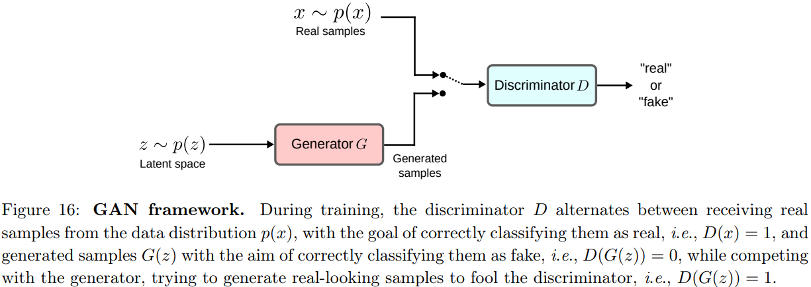

# Generative Models

在无监督学习中，目标是预测 $$p(x)$$，其中样本 x 是从 $$p(x)$$ 中独立同分布抽取的

在有监督学习中，目标是估计联合分布$$p(x,y)$$

> 分类可以被视为估计$$p(x,y)$$的一种特殊情况，我们只对条件分布$$p(y|x)$$感兴趣。并且，无需估计输入分布 $$p(x)$$，因为在预测时 $$x$$ 总是已知的

具有生成模型的半监督学习可以被视为有监督学习的扩展，即除了分类之外，还有由 $$\mathcal{D}_{u}$$ 提供的关于 $$p(x)$$ 的信息；也可以被视为无监督学习的扩展，即除了聚类之外还有由 $$\mathcal{D}_{l}$$ 提供的带标签样本

## VAE for SSL

复习一下，变分自编码器（Variational Autoencoders，VAEs）作为自编码器的一种，用输入与其重建版本的MSE进行训练。此外，还学习遵循高斯分布的潜在空间，这个目标被实现为潜在空间与标准高斯分布之间的 KL 散度。

对于输入 $$x$$，由编码器建模的条件分布 $$q_{\phi}(z|x)$$、标准高斯分布 $$p(z)$$，以及使用解码器$$p_{\theta}(x|z)$$ 生成的重建输入$$\hat{x}$$。参数 ϕ 和 θ 被训练以最小化以下目标：
$$
\mathcal{L}=d_{\text{MSE}}(x,\hat{x})+d_{\text{KL}}(q_{\phi}(z|x),p(z))
$$

### VAE

Standard VAEs for SSL (M1 Model) 包括一个无监督预训练阶段，在此阶段，使用有标签和无标签的样本训练 VAE。使用训练好的 VAE 将有标签数据 $$x\in \mathcal{D}_{l}$$ 转换到由 $$z$$ 定义的潜在空间，然后可以使用 $$(z,y)$$ 来解决监督任务。

通过这种方法，分类可以在低维空间中进行，因为潜在变量 z 的维度更小，低维嵌入也更容易分离，因为潜在空间是由独立的高斯后验分布形成的。

不过，在 M1 模型中，在训练变分自编码器时忽略了 $$\mathcal{D}_l$$ 的标签。对于 Extending VAEs for SSL (M2 Model) ，在训练期间也会使用标签，网络包含三个组件：

- 由分类网络建模的 $$q_\phi(y|x)$$，在测试时用于对未见过的数据进行预测
- 由编码器建模的 $$q_\phi(z|y,x)$$ 
- 由解码器建模的 $$p_\theta(x|y,z)$$

前面的两个模型可以连接起来形成一个联合模型 Stacked VAEs (M1+M2 Model)。

1. 首先训练模型 M1 以获得潜在变量 $$z_1$$，用于降维和特征抽象。M1 模型通过无监督学习捕捉数据分布（利用所有数据）
2. 然后模型 M2 将来自模型 M1 的潜在变量 $$z_1$$ 用作数据的新表示，而不是原始输入 $$x$$，训练时通过有标签数据学习标签与潜在空间的关联。在解码器中，结合标签 y 和顶层潜在变量 z2 生成 z1
3. 无标签数据通过 z1 的中间表示间接参与 M2 的训练，提升分类性能。
4. 模型可以描述为：

$$
p_{\theta}(x,y,z_1,z_2)=p(y)p(z_2)p_{\theta}(z_1|y,z_2)p_{\theta}(x|z_1)
$$

- $$p(y)$$：标签 y 的先验分布，通常假设为均匀分布或基于数据集标签频率的分布
- $$p(z_2)$$：顶层潜在变量 z2 的先验分布，通常为标准正态分布
- $$p_{\theta}(z_1|y,z_2)$$：在给定标签 y 和顶层潜在变量 z2 的条件下，生成中间潜在变量 z1 的条件分布。这部分对应 M2 模型的解码器
- $$p_{\theta}(x|z_1)$$：在给定中间潜在变量 z1的条件下，生成观测数据 x 的条件分布。这部分对应 M1 模型的解码器

### Variational Auxiliary Autoencoder

变分辅助自动编码器 Variational Auxiliary Autoencoder 用辅助变量 a 扩展了变分分布：$$q(a,z|x)=q(z|a,x)q(a|x)$$，使得边缘分布 $$q(z|x)$$ 可以拟合更复杂的后验分布 $$p(z|x)$$

为了使生成模型 $$p(x|z)$$ 保持不变，要求联合模式 $$p(x,z,a)$$ 在对 a 进行边缘化时返回原始的 $$p(x,z)$$，因此 $$p(x,z,a)=p(a|x,z)p(x,z)$$，其中 $$p(a|x,z)\neq p(a)$$，以避免退回到原始的 VAE 模型。

在 SSL 中，为了纳入类别信息，引入了一个额外的潜在变量 y。生成模型变为
$$
p(y)p(z)p(a|z,y,x)p(x|y,z)
$$
在这种情况下，辅助单元 a 为推理模型引入了一个潜在特征提取器，从而在 x 和 y 之间建立了更丰富的映射。最终的模型由 5 个神经网络参数化，这些模型同时在生成任务和判别任务上进行训练。

1. 辅助推理模型$q(a|x)$
2. 潜在推理模型$q(z|a,y,x)$
3. 分类模型$q(y|a,x)$
4. 生成模型$p(a|.)$
5. 生成模型$p(x|.)$

### Infinite Variational Autoencoder

VAE 用于自监督学习的另一种变体是 Infinite Variational Autoencoder 无限变分自编码器，旨在克服传统 VAE 中潜在空间维度固定，以及生成模型参数数量预先固定，这两个局限。

在传统 VAE 中，模型的容量必须根据对训练数据特征的某些先验知识预先选择。无限变分自编码器通过生成无限混合的自编码器来解决这个问题，这些自编码器能够随着数据的复杂性增长，以最好地捕捉数据的内在结构。

在使用未标记数据训练生成模型后，该模型可以与可用的标记数据结合，以训练一个判别模型，该判别模型也是专家的混合体，用于分类。对于给定的测试样本 x，每个判别专家产生一个初步输出，然后由生成模型进行加权。这样，每个判别专家可以从生成模型的知识上获益，效果更好

##  GAN for SSL

复习一下，生成对抗网络（Generative Adversarial Network，GAN）由生成器网络 G 和判别器网络 D 组成。如图，损失如下， $$p(z)$$通常被选为标准正态分布
$$
\begin{align*}
\mathcal{L}_D&=\max_D \mathbb{E}_{x\sim p(x)}[\log D(x)]+\mathbb{E}_{z\sim p(z)}[1 - \log D(G(z))]\\
\mathcal{L}_G&=\min_G -\mathbb{E}_{z\sim p(z)}[\log D(G(z))]
\end{align*}
$$

### CatGAN

Categorical generative adversarial network 分类生成对抗网络（CatGAN）在训练过程中结合生成和判别两种视角。

判别器 D 扮演分类器的角色，将 x 分类到 C 个未知类别。

在传统 GAN 中，CatGAN 的判别器需将所有样本分配到 C 个类别之一（而非判断样本是否属于真实分布 $$p(x)$$），同时对生成器 G 生成的样本类别分配保持不确定性。当训练完成后，判别器发现的 C 个类别将与目标分类问题一致，此时判别器可直接作为分类器使用

判别器要求：

1. 对真实分布样本 $$x \sim p(x)$$ 的类别分配 $$D(x)=p(y|x,D)$$ 高度确定，可直接作为分类器使用，即类别分布的熵 $$H(D(x))$$ 必须较低，最小化这个熵
2. 对生成样本 $$G(z)$$ 的类别分配 $$D(G(z))=p(y|G(z),D)$$ 高度不确定，体现对抗，即 $$H(D(G(z)))$$ 熵必须较高，最大化这个熵
3. 假设类别先验分布 $$p(y)$$ 是均匀的，所有类别需被均等使用，需要最大化对 D 和 G 经验测量的边际类别分布的熵：

$$
\begin{aligned}H_{\mathcal{D}}&=H\left(\frac{1}{N}\sum_{i=1}^{N}D\left(x_{i}\right)\right)\\H_{G}&\approx H\left(\frac{1}{M}\sum_{i=1}^{M}D\left(G\left(z_{i}\right)\right)\right)\end{aligned}
$$

生成器要求：

1. 生成样本的类别分配应高度确定
2. 与判别器一致，生成的样本需均匀分布于所有类别

结合这些要求，CatGAN 中判别器和生成器的目标是： 
$$
\begin{align*}
\mathcal{L}_D&=\max_D -\mathbb{E}_{x\sim p(x)}[\mathrm{H}(D(x))]+\mathbb{E}_{z\sim p(z)}[\mathrm{H}(D(G(z)))]+\mathrm{H}_D\\
\mathcal{L}_G&=\min_G \mathbb{E}_{z\sim p(z)}[\mathrm{H}(D(G(z)))]-\mathrm{H}_G
\end{align*}
$$
在 SSL 中，如果输入 x 来自带有标签 y 的有标签数据集 $$D_{l}$$，且标签 y 为独热向量形式，那么除了 $$\mathcal{L}_{D}$$ 之外，判别器 D 还使用交叉熵损失进行训练，即 
$$
\mathcal{L}_{D}+\lambda \mathbb{E}_{(x, y) \sim p(x)_{l}}[-y \log G(x)]
$$

### DCGAN

另一种 GAN 用于 SSL 的方法是利用未标记的样本学习中间表示，然后可将其用于各种有监督学习任务。

> 例如基于小标记集 $\mathcal{D}_{l}$ 的图像分类，可以通过训练 GANs 来构建良好的图像表示，然后将生成器和判别器网络的部分重新用作有监督任务的特征提取器。

深度卷积生成对抗网络 Deep Convolutional GANs（DCGAN）在卷积 GANs 上做了些约束，例如在判别器中用步长卷积代替池化层，在生成器中使用分数步长卷积，在生成器和判别器中都使用批量归一化，以及在更深的架构中去除全连接层。

在训练用于图像生成的 DCGANs 之后，可以将 DCGANs 学习到的表示用于下游任务。可以通过在判别器特征上进行微调，并在其顶部添加一个额外的分类层，然后在 $$\mathcal{D}_{l}$$上进行训练；或者通过展平并连接学习到的特征，并在其顶部训练一个线性分类器。

### SGAN

DCGAN 展示了学习到的表征在  SSL 中的效用，但它有几个不理想的特性。

- 在事后使用判别器学习到的表征不允许同时训练分类器和生成器，效率低
- 理想情况下，改进判别器 -> 改进分类器 -> 改进判别器 ->改进生成器

半监督生成对抗网络 Semi-Supervised GAN（SGAN）利用了这个反馈循环，允许同时学习生成模型和分类器，显著提高了分类性能、生成样本的质量，并减少了训练时间。

与判别器网络输出输入图像来自数据分布的估计概率不同。对于 C 个类别，SGAN 由具有 C+1 个输出的判别器组成，除了 fake 类别输出外，还有每个类别的输出。训练 SGAN 与训练 GAN 类似；唯一的区别是如果输入 x 是从有标签的集合 $$\mathcal{D}_{l}$$ 中抽取的，则使用标签来训练判别器。判别器被训练为相对于给定标签最小化负对数似然，而生成器被训练为最大化它。

### Feature Matching GAN

训练 GAN 包括找到一个两人非合作博弈的纳什均衡，每个玩家都试图最小化其成本函数，对每个玩家的成本应用梯度下降，但这种训练过程不能保证收敛。

特征匹配 Feature Matching 被提出以促进收敛，为生成器指定一个新的目标来解决 GAN 的不稳定性，该目标可防止在当前判别器上过度训练。

新目标不是直接最大化判别器的输出，而是要求生成器生成的数据与判别器的隐藏表示相匹配，对于给定中间层的一些激活函数 $$h(x)$$，新的目标定义为：
$$
\left\| \mathbb{E}_{x \sim p(x)}[h(x)]-\mathbb{E}_{z \sim p(z)}[h(G(z))]\right\| ^{2}
$$

> 生成器模式坍缩的问题依然存在，即它总是生成相同的点，即使使用特征匹配也依然如此，因为判别器独立处理每个样本，所以其梯度之间没有协调性，也就没有机制让生成器的输出彼此之间更加不同。为了避免这种情况，除了特征匹配之外，一种名为小批量判别（minibatch discrimination）的新技术也被整合到训练过程中，以允许判别器同时查看多个数据样本。在这种情况下，判别器仍然将单个样本分类为真实数据或生成数据，但现在它能够将小批量中的其他样本用作辅助信息。

对于 SSL，与 SGAN 类似，特征匹配生成对抗网络中的判别器采用 $$(C + 1)$$ 类目标而不是二分类，其中真实样本被分类为前 C 个类别，生成的样本被分类为第 $$(C + 1)$$ 个 fake 类别，x 为假的概率是 $$p(y = C + 1 | G(z), D)$$，对应于原始生成对抗网络框架中的 $$1 - D(x)$$，损失如下：
$$
\begin{align*}
\mathcal{L} &= \mathcal{L}_s+\mathcal{L}_u \\
\mathcal{L}_s&=-\mathbb{E}_{x,y\sim p(x)_l}[\log p(y|x,y < K + 1,D)]\\
\mathcal{L}_u&=-\mathbb{E}_{x\sim p(x)_u}\log[1 - p(y = K + 1|x,D)]-\mathbb{E}_{z\sim p(z)}\log[p(y = K + 1|G(z),D)]
\end{align*}
$$
上述目标与原始 GAN 公式类似，唯一的区别是真样本的概率被分为 c 个子类。主要缺点是特征匹配在分类中效果良好，但无法生成难以区分的样本，而小批次判别擅长真实图像生成，但不能准确预测标签。

### Bad GAN

为了克服特征匹配生成对抗网络的缺点，需要一个与真实数据分布不匹配的 “差” 生成器，该生成器仅起到补充生成器的作用，帮助判别器在特征空间的高密度区域获得正确的决策边界。G 的目标改为：
$$
\min_G -\mathrm{H}(p_G)+\mathbb{E}_{x\sim p_G}\log p(x)\mathbb{I}[p(x)>\epsilon]+\left\|\mathbb{E}_{x\sim p_G}h(x)-\mathbb{E}_{x\sim p(x)}h(x)\right\|^2
$$

- 第一项最大化生成器的熵以避免坍缩问题（低熵）
  - 模式崩溃表现为生成样本多样性低，例如生成相似或重复的样本
- 第二项强制生成器产生位于真实数据分布低密度区域 $$p(x)$$ 的样本
  - 该模型在训练集上进行预训练，并在半监督训练期间固定
  -  $$p_{G}$$ 是由生成器 G 诱导的分布
  - 指示函数 $$\mathbb{I}[p(x)>\epsilon]$$ 仅在真实数据密度高于阈值 ϵ 时生效，惩罚生成器在高密度区域生成样本，从而推动生成样本向低密度区域移动
  - 即 Bad GAN 中半监督学习需要生成器作为“补充生成器”（complement generator），其分布不与真实分布重叠，而是帮助判别器在特征空间的高密度区建立正确的分类边界
- 最后一项是 Feature Matching GAN 的目标，生成样本与真实样本在判别器中间层特征 h(x) 的统计量（如一阶矩）尽可能接近

### Triple-GAN

正如在 Bad GAN 中所讨论的，生成器和判别器（即分类器）可能不会同时处于最优状态，因为对于一个最优生成器，即 $$p(x)=p_{g}(x)$$，一个最优判别器应该将 x 识别为假。然而，作为一个分类器，判别器应该自信地预测 x 的正确类别，因为 $$x\sim p(x)$$，这表明判别器和生成器可能不会同时处于最优状态。

与其学习一个独立的分类辅助生成器，Triple-GAN 需要实现两个目标：一方面生成在类别标签条件下具有真实感的样本，另一方面生成一个具有尽可能小的预测误差的优秀分类器。包括三个组件

1. **一个分类器 C**，描述条件分布 $$p_c(y|x) \approx p(y|x)$$
2. **一个类别条件生成器 G**，描述条件分布 $$p_g(x|y) \approx p(x|y)$$
3. **一个判别器 D**，判断一对数据 (x,y) 是否来自真实分布 $$p(x,y)$$

理想的平衡点是分类器和生成器所定义的联合分布都能收敛到真实数据分布

对于 $$p(x)$$，它被假设为输入 x 在 $$\mathcal{D}$$ 中的经验分布，并且 $$p(y)$$ 被假设为与标注数据上的标签分布相同。在这种情况下，分类器 C 基于 x 生成伪标签 $$p_c(y|x)$$，这些伪标签 y 来自联合分布 $$p_c(x, y) = p(x)p_c(y|x)$$

类似地，生成器生成 $$x = G(y, z)$$，其中 $$z \sim p(z)$$ 是隐变量，生成的样本 x 和标签 y 来自联合分布 $$p_g(x, y) = p(y)p_g(x|y)$$

这些由 C 和 G 生成的伪输入标签对 (x,y) 会被送到单个判别器 D，目标为
$$
\begin{align*}
\mathcal{L}&=\min_{C,G}\max_D E_{(x,y)\sim p(x,y)}[\log D(x,y)]+\alpha E_{(x,y)\sim p_c(x,y)}[\log(1 - D(x,y))]\\
&+(1 - \alpha)E_{(x,y)\sim p_g(x,y)}[\log(1 - D(G(y,z),y))]
\end{align*}
$$
为了有效利用未标注数据，分类器 C 上会施加额外的正则化，包括最小化分类器 $$p_c(y|x)$$ 的条件熵、$$p(y)$$ 与 $$p_c(y)$$ 之间的交叉熵，以及一致性正则化（如通过dropout作为噪声源实现）。在这样的设置下，分类器能够在仅有少量标注数据的情况下获得高准确率，而生成器则能生成在类别条件下的最先进图像。

> **增强版 Triple-GAN（Enhanced TGAN）** 通过采用基于类别的均值特征匹配来正则化生成器，并使用语义匹配项来确保生成器和分类器之间的语义一致性，从而进一步提高了在半监督学习和无监督学习场景中的最新结果

### BiGAN

传统 GAN 的一个局限性是，无法推断出隐变量表示 z，而这些表示可以作为数据 x 的丰富特征用于更高效的训练。

> 与 VAE不同，后者通过推断网络（即解码器）$$p(\cdot)$$ 学习隐变量的变分后验分布，GAN 的生成器通常是一个有向的隐变量模型，具有隐变量 z 和观测变量 x。因此，GAN 无法为给定的数据点推断隐特征表示。

BiGAN 通过在 GAN 框架中引入编码器 E 来解决这一问题，它将数据 x 映射为隐表示 z

BiGAN 的判别器 D 不仅在数据空间中对 x 和 G(z) 进行判别，还要对 $$(x, E(x))$$ 和$$(G(z), z)$$ 这两对进行区分，隐变量部分是编码器的输出 E(x) 或生成器的输入 z。训练好的 BiGAN 编码器还可以作为下游任务的特征提取器。BiGAN 的训练目标为：
$$
\mathcal{L}=\min_{G,E}\max_D E_{x\sim p(x)}(\log D(x, E(x)))+E_{z\sim p(z)}(1 - \log D(G(z), z))
$$

> 增强型 BiGAN（Augmented-BiGAN），是 BiGAN 的改进版本，专为 SSL 设计。增强型 BiGAN 类似于其他用于 SSL 的 GAN 框架，将生成的样本视为与分类器目标标签相对应的额外类别，并引入了基于雅可比正则化的附加项，以增强分类器对输入流形切线空间局部变化的鲁棒性。在每个训练样本处，BiGAN 训练的编码器被用来计算这些雅可比矩阵，从而高效估计切线空间，避免了在对比自编码器中使用的昂贵 SVD 方法。
