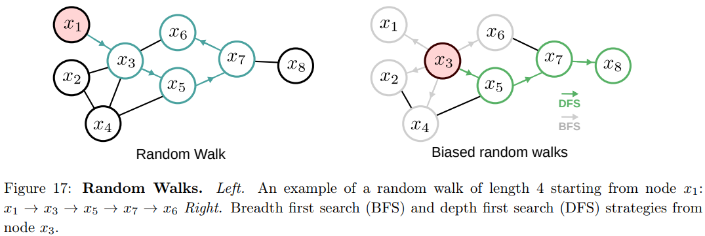
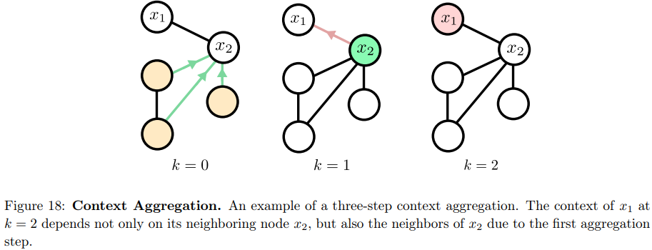
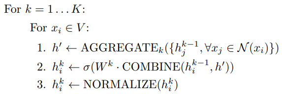

# Graph-Based SSL

图可以对实体和关系进行建模，能从全局和局部理解系统。

- 图 $$G(V,E)$$ 是由 $$V=\{x_{1},\ldots,x_{n}\}$$ 点以及 $$E=\{e_{i j}\}_{i,j = 1}^{n}$$ 边组成的集合
- 每个数据点 $$x_{i}$$，无论是有标签的还是无标签的，都表示为图中的一个节点，连接每对节点的边反映了它们的相似性。
- 图 G 的 $$n×n$$ 邻接矩阵 $$A$$ 描述了图的结构，每个元素是与每条边相关联的非负权重，如果两个节点 $$x_{i}$$ 和 $$x_{j}$$没有相互连接，则 $$A_{i j}=0$$
- 邻接矩阵 A 可以使用数据点之间的相似性度量得出，也可以从外部数据（如知识图谱）中明确得出

基于图的任务可以大致分为四类：节点分类、链接预测、聚类和可视化。

在本节中，我们将讨论节点分类方法，因为半监督学习的目标是为无标签示例分配标签。节点分类方法可以大致分为两类：

- 一类是基于附近节点往往具有相同标签的假设，将标签从有标签节点传播到无标签节点的方法
- 另一类是基于附近节点在向量空间中应该具有相似嵌入的假设，学习节点嵌入，然后在学习到的嵌入上应用分类器的方法

## Graph Construction

如何建图？一个有用的图应该反映我们对领域的先验知识，方法包括

- 全连接图。所有数据对之间都有带权重的边。可以计算图的导数以更新边的权重。计算成本很高
- 稀疏图。每个节点仅与少数相似节点相连。这些图可以使用原始数据或从经过训练的网络中提取的表示来创建，并进行迭代更新

> 稀疏图的例子
>
> - kNN 图，每个节点只与最近邻的 K 个节点连接
> - 获得节点间的边权重 $$A_{ij}$$ 的一种方法是使用高斯核函数 $$W_{ij}=\exp\{-\|x_i - x_j\|^2/2\sigma^2\}$$，其中 σ 是一个超参数
> - 另一种稀疏图是 ϵNN 图，其中如果距离 $$d (i,j)\leq \epsilon$$，则节点 i 和 j 相连

## Label Propagation

标签传播 Label Propagation 的主要假设是，同一流形中的数据点很可能具有相同的语义标签。标签传播根据数据流形结构和节点间的相似性，将有标签数据点的标签传播到无标签数据点。

在标签传播中，标记分数 labeling scores 被定义为使损失函数最小化的最优解。损失函数是：
$$
\mathcal{L}=\frac{1}{2} \sum_{i, j=1}^{n} A_{i j}\left(\hat{y}_{i}-\hat{y}_{j}\right)^{2}=\hat{Y}^{T} L \hat{Y}
$$

-  $$n×C$$ 的矩阵 $$\hat{Y}$$ ，其中每一行 $$\hat{Y}_{i}$$ 是 C 个类别上的概率分布
-  $$n×C$$ 的矩阵 $$Y$$，包含已标记数据点的标签。如果 $$x_{i}$$ 是已标记数据点，则每一行 $$Y_{i}$$ 是一个独热向量，否则是零向量
- $$L = D - A$$是图的拉普拉斯矩阵（Laplacian Matrix），用于测量图的平滑度，$$D=\sum_{j=1}^n A_{ij}$$ 是度矩阵（Degree Matrix） 

> 这个损失函数可以看作是一个图拉普拉斯正则化，当具有较大权重 $$A_{ij}$$ 的相邻节点被预测为不同的标签时，会产生较大的惩罚

通过定义 $$n \times n$$ 的概率转移矩阵 $$P = D^{-1}A$$，其中 $$P_{ij}$$ 表示从节点 i 转移到节点 j 的概率，并将矩阵 P、Y 和 $$\hat{Y}$$ 分解为有标注和无标注的子矩阵：
$$
P = \begin{pmatrix}
P_{ll} & P_{lu} \\
P_{ul} & P_{uu}
\end{pmatrix}
\quad
Y = \begin{pmatrix}
Y_l \\
Y_u
\end{pmatrix}
\quad
\hat{Y} = \begin{pmatrix}
\hat{Y}_l \\
\hat{Y}_u
\end{pmatrix}
$$
上面的损失函数最优解为
$$
\begin{align*}
\hat{Y}_l&=Y_l\\
\hat{Y}_u&=(I - P_{uu})^{-1}P_{ul}Y_l
\end{align*}
$$
之后，标签传播算法的下一步就是利用这些“软标签”来为每个未标注样本确定最终的离散标签。在归一化之后，对于每个未标注样本 $$x_i$$，$$\text{label}(x_i) = \arg\max_{c} \ \hat{Y}_u(i, c)$$ ，标签为概率最高的那一类

标签分数的计算涉及矩阵求逆操作，而对于大型图来说，这种操作计算量较大。作为替代，另一种迭代方法能够收敛到相同的解：

1. 传播 $$\hat{Y} \leftarrow P \hat{Y}$$
2. 保留标注数据：$$\hat{Y}_l = Y_l$$
3. 从第 1 步重复，直到收敛

另一种类似的标签传播算法中，除了节点 i 从其邻居 j 接收到的贡献，还引入了一个小的自反馈贡献，提供了更稳定的传播过程。此时的损失函数为：
$$
\mathcal{L} = \frac{1}{2}\sum_{i,j = 1}^{n} A_{ij}\left\|\frac{\hat{Y}_i}{\sqrt{D_{ii}}} - \frac{\hat{Y}_j}{\sqrt{D_{jj}}}\right\|^2 + (1/\alpha-1)\sum_{i = 1}^{n} \|\hat{Y}_i - Y_i\|^2
$$
损失函数中的第一项和第二项分别对应平滑约束和拟合约束。平滑约束使得相邻点之间的标签变化不会太大，而拟合约束则迫使有标签节点的最终标签与其初始值相似。使损失函数最小化的最优解如下，其中 $$S = D^{-1/2}AD^{-1/2}$$ 
$$
\hat{Y} = (I - \alpha S)^{-1}Y
$$
与第一个算法类似，也有计算成本较低的迭代方法：

1. 传播 $$\hat{Y} \leftarrow \alpha S\hat{Y} + (1 - \alpha)Y$$
2. 重复步骤 1，直至收敛。

尽管迭代方法是标签传播的标准方法，但它输出的结果与最优解并不相同。

## Graph Embedding

> Graph Embedding 图嵌入这一术语在文献中有两种使用方式：一是在向量空间中表示整个图，二是在向量空间中表示每个单独的节点。我们对学习节点嵌入感兴趣，因为这种表示可用于SSL任务，如节点分类

节点嵌入的目标是将节点编码为低维向量，这些向量能反映节点的位置及其局部邻域结构。这些低维嵌入可被视为将节点编码或投影到一个潜在空间中，在这个潜在空间里的几何关系对应于原始图中的边。基于因式分解的方法，如拉普拉斯特征映射和局部线性嵌入（LLE），都是基于此原理的算法示例，但它们对于大型图存在可扩展性问题

因此，人们提出了其他更具可扩展性的嵌入技术，这些技术利用了现实世界网络的稀疏性。例如，LINE 和 HOPE 试图保留高阶邻近性（例如，给定节点的边权重，以及每对节点的边权重的相似性）。直观地说，这些方法的目标仅仅是为每个节点学习嵌入，使得学习到的嵌入向量近似于图邻近性的某种确定性度量

另一类方法是随机游走及其变体。与基于因式分解的方法使用图邻近性的确定性度量不同，这些方法对嵌入进行优化，使得如果节点在图上的短随机游走中倾向于同时出现，那么它们就具有相似的嵌入，这使得它们在只能部分观察图或者图太大而无法整体测量的情况下特别有用。

### Random Walks

随机游走从一个随机采样的节点 $$x_0 \in \text{sample}(V)$$ 开始，然后反复采样一条边以转移到下一个节点 $$x_{i + 1} = \text{sample}(\mathcal{N}(x_i))$$，其中 $$\mathcal{N}(x_i)$$ 是 $$x_i$$ 的邻居节点。得到的随机游走序列 $$x_0 \to x_1 \to x_2 \to \cdots$$ 然后可以传递给 word2vec 算法，目标是将随机游走序列中的每个节点 $$x_i$$ 嵌入到与它的邻居节点在向量空间中接近的位置。

使用大小为 $$T$$ 的上下文窗口，通常定义为 $$T \in \{2, \cdots, 10\}$$，锚节点 $$x_i$$ 的表示会更接近其下一个邻居节点 $\{x_{i - T/2}, \cdots, x_i, \cdots, x_{i + T/2}\}$ 的嵌入，令 $$p_T(x_j|x_i)$$ 是从 $$x_i$$ 出发的长度为 $$T$$ 的随机游走中访问 $$x_j$$ 的概率，随机游走方法学习给定节点 $$x_i$$ 的嵌入 $$z_i$$，使得： 
$$
p_T(x_j|x_i) \approx \frac{e^{z_i^T z_j}}{\sum_{x_k \in V} e^{z_i^T z_k}}
$$

> $${z_i^T z_k}$$ 反映了节点嵌入向量之间的相似性。当两个节点在图结构中具有紧密的联系（例如在随机游走中经常相邻出现）时，我们希望它们的嵌入向量在低维空间中也比较相似，即 $${z_i^T z_k}$$  较大

为了学习这样的嵌入，优化以下损失，其中 $$\mathcal{R}W$$ 是生成的长度为 $$T$$ 的随机游走集合： 
$$
\mathcal{L} = \sum_{(x_i, x_j) \in \mathcal{R}W} -\log \left( \frac{e^{z_i^T z_j}}{\sum_{x_k \in V} e^{z_i^T z_k}} \right)
$$
评估该损失的成本极高，因为计算分母需要对图的所有节点进行计算。因此，不同的方法使用不同的优化方式来近似损失，例如，DeepWalk 使用层次 softmax 来计算分母，而 node2vec 使用类似于 word2vec 的负采样来近似。

不同方法在随机游走的构建上也有所不同，DeepWalk 在图上使用简单的无偏随机游走，而 node2vec 引入了两个随机游走超参数 $$p$$ 和 $$q$$，以便在更类似于广度优先搜索或深度优先搜索的游走之间进行平滑插值，超参数 $$p$$ 控制立即重新访问一个节点的可能性，而 $$q$$ 控制重新访问其邻居的可能性

对于 SSL，学习到的嵌入随后可以用作输入，在有标签节点上训练分类器，然后应用于无标签节点。或者，对于基于随机游走的半监督学习，可以在损失的无监督损失中添加一个交叉熵项，以便在有标签节点的节点嵌入之上联合训练分类器。

> 例如，可以引入一个超参数 $$r$$ 来控制给定训练迭代的采样实例，
>
> - 如果 $$r < \text{random}$$，则从给定随机游走中采样随机对用于无监督损失
> - 如果 $$r \geq \text{random}$$，则采样一对具有相同标签的附近有标签节点用于监督损失
>
> 嵌入是使用监督和无监督损失进行训练的，而分类器仅在监督损失上进行训练

## Graph Neural Networks

随机游走的优点包括：结合了局部和高阶邻域信息，并且训练时无需考虑所有节点对。缺点包括：嵌入仅为训练期间看到的节点生成，对于不断更新的图的大规模图来说，无法完全存在内存中，或者在训练后需要泛化到新图的域

为了解决这些问题，许多方法使用基于深度神经网络的图方法。DNGR和 SDNE 通过使用深度自动编码器，首次提出将深度网络应用于图。

为了压缩节点 $$x_i$$ 的局部邻域信息，首先提取一个高维表示 $$s_i \in \mathbb{R}^{|V|}$$，它描述了节点 $$x_i$$ 与图中所有其他节点的邻近程度。然后通过自编码器降维，使用重构损失对其进行训练。训练后，自编码器的低维表示随后被用作 $$x_i$$ 的嵌入。然而，这些方法与随机游走方法存在类似的局限性，输入大小为 $$|V|$$，对于大型图来说可能极其昂贵，甚至难以处理。 

最近的一些节点嵌入方法，旨在通过设计依赖于节点局部邻域的函数（而不一定是整个图），来解决随机游走和基于自动编码器方法的主要局限性。与之前讨论的方法不同，图神经网络使用节点特征，例如前一个网络甚至简单统计（如节点度或独热向量）来生成嵌入。这些方法通常被称为卷积方法，因为它们将节点表示为其周围邻居的函数，类似于 CNN。

1. 训练过程从初始化第一个隐藏状态 $$h^0_i$$ 开始，使用节点特征 $$x_i$$：$$h^0_i \leftarrow x_i, \forall x_i \in V$$

2. 在 $$K$$ 次训练迭代中，在每一步，隐藏状态通过聚合邻居节点的隐藏状态进行更新，使用聚合函数（AGGREGATE）、组合函数（COMBINE）、非线性函数 $$\sigma$$ 和归一化函数（NORMALIZE），如下所示：

   

3. 最后，节点 $$x_i$$ 的嵌入 $$z_i$$ 是最终的隐藏状态：$$z_i \leftarrow h_i^K$$

聚合函数和可训练参数集 $$W^k, \forall k \in [1, K]$$ 具体说明了如何聚合局部邻域信息。不同的方法，如 GCN 、GraphSAGE 和 GAT 遵循相同的过程，但主要在聚合、组合和归一化的执行方式上有所不同。

然后，使用类似于基于随机游走方法的无监督损失来训练权重。对于 SSL，在节点嵌入（即最终隐藏状态）的基础上训练一个分类器，以预测有标签节点的类别标签，然后该分类器可应用于无标签节点进行节点分类。 