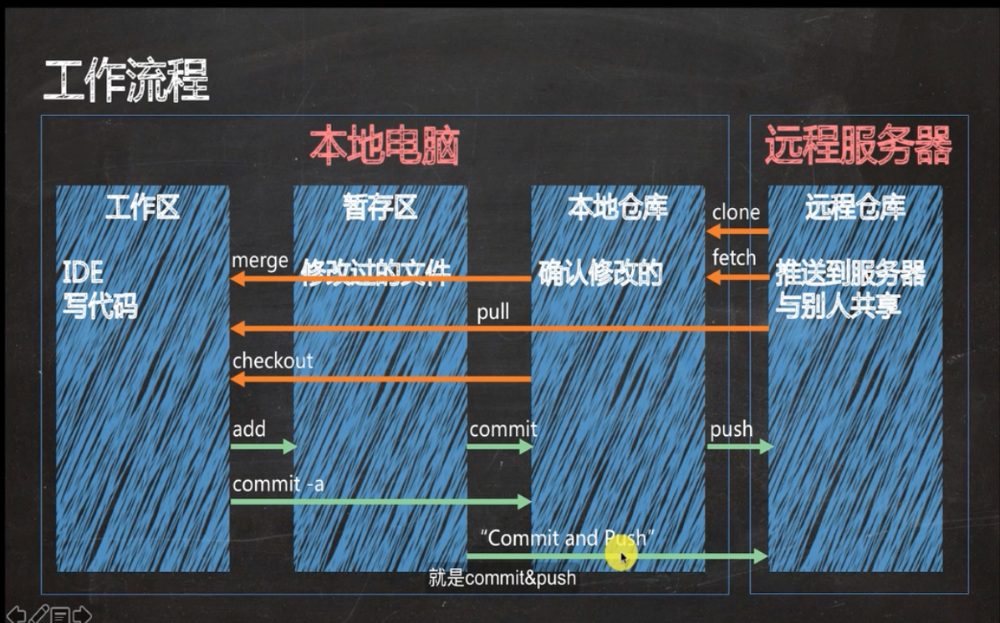
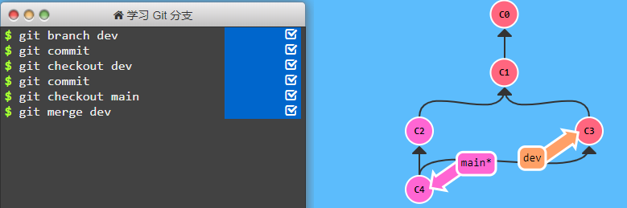
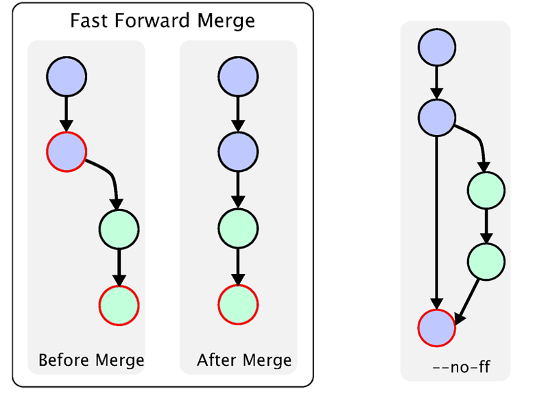
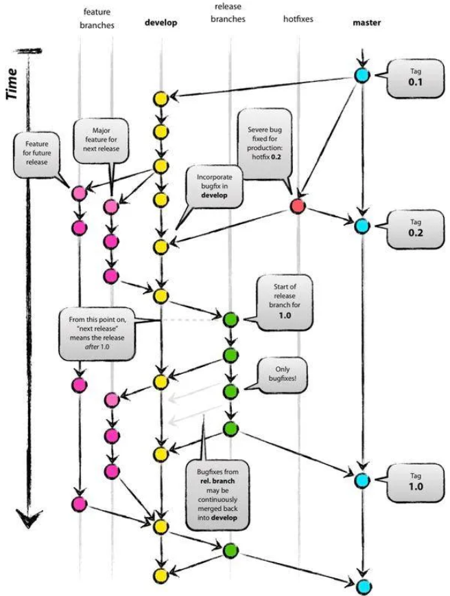
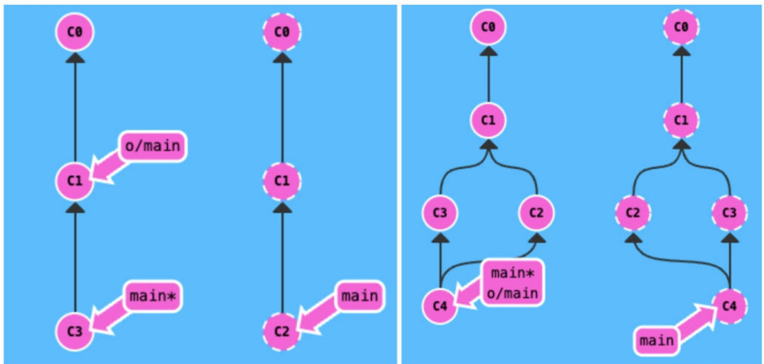
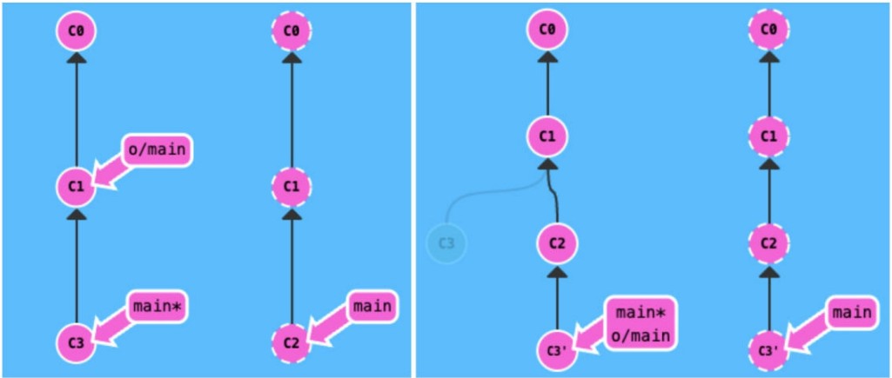

# Git

> 学习git（特别是分支）的互动网站：https://learngitbranching.js.org/

## 版本控制系统

它是软件项目开发过程中用于储存我们所写的代码所有修订版本的软件。对软件开发进程中文件或目录的发展过程提供有效的追踪手段，保证在需要时可回到旧版本，避免文件丢失、修改的丢失和相互覆盖。

不同于SVN（集中式的版本控制，集中式存在单点故障的风险），Git是一款分布式的版本控制工具，每个用户相当于一个备份。


Git使用了一种类似**快照存储**的方式来存储项目的整体状态。大多数版本控制系统只关心内容变化了的文件。若文件没有变化，其他版本系统不会记录，Git 而会对未变化的文件的做一链接。

> **差异存储**：会记录每个文件的更改内容，而不是整个文件的副本。
>
> **快照存储**：它会存储整个文件或项目的副本，而不是仅存储更改的部分。


Git基于DAG（有向非环图）的设计比SVN的线性提交提供更好的合并追踪，避免不必要的冲突，提 高工作效率。Git基于对内容的追踪而非对文件名追踪，所以遇到一方或双方对文件名更改时， Git能够很好进行自动合并或提供工具辅助合并。而SVN遇到同样问题时会产生树冲突，解决起来很麻烦。

## 工作区域与流程

Git 三种状态：

- 已提交（committed），表示数据已经安全的保存在本地数据库中
- 已修改（modified），表示修改了文件，但还没保存到数据库中
- 已暂存（staged），表示对一个已修改文件的当前版本做了标记，使之包含在下次提交的快照中

四个区域：

-   **工作区**：就是你在电脑里能看到的目录
-   **暂存区**： 存放修改过的文件。一般存放在 **.git** 目录下的 index 文件（.git/index）中，英文叫 stage 或 index，所以我们把暂存区有时也叫作索引（index）
-   **本地仓库**： 存放确认修改的文件
-   **远程仓库**：比如Github网站的服务器



1. 在工作目录中修改文件
2. add暂存文件，将文件的快照放入暂存区域
3. commit提交更新，找到暂存区域的文件，将快照永久性存储到 Git 仓库目录
4. push推送到远程

## 数据模型与伪代码

Git 将顶级目录中的文件和文件夹称作集合，并通过一系列**快照**来管理历史记录。在 Git 的术语中，文件被称为 **blob 对象**（数据对象），也就是一组数据。目录则被称为 **tree**（树），目录中可以包含文件和子目录。

- BLOB: 即二进制对象，这就是 Git 存储的文件，Git 不像某些 VCS （如 SVN）那样存储变更 delta 信息，而是存储文件在每一个版本的完全信息。Linus 在设计时，BLOB 中仅记录文件的内容，而不包含文件名、文件属性等元数据信息，这些信息被记录在第二种对象 TREE 里。
- TREE: 目录树对象。在 Linus 的设计里，TREE 对象就是一个时间切片中的目录树信息抽象，包含了文件名、文件属性及 BLOB 对象的 SHA1 值信息，但没有历史信息。这样的设计好处是可以快速比较两个历史记录的 TREE 对象，不能读取内容，而根据 SHA1 值显示一致和差异的文件。
- CHANGESET：即 Commit 对象。一个 CHANGESET 对象中记录了该次提交的 TREE 对象信息（SHA1），以及提交者(committer)、提交备注(commit message)等信息。

```
<root> (tree)
|
+- foo (tree)
|  |
|  + bar.txt (blob, contents = "hello world")
|
+- baz.txt (blob, contents = "git is wonderful")
```

顶层的树（也就是 root） 包含了两个元素，一个名为 foo 的子树（包含了一个 blob 对象“bar.txt”），和一个 blob 对象“baz.txt”。

在 Git 中，**历史记录是一个由快照组成的有向无环图**。这些快照通常被称为“commit”，看起来好像是下面这样：



> 这个互动沙盒来自[网页](https://learngitbranching.js.org/?locale=zh_CN)，这篇笔记不会聚焦于 Git 的具体命令，请在互动沙盒中闯关学习

Git 的数据模型：

```cpp
// 文件是一组数据
type blob = array<byte>

// 一个包含了文件和子目录的目录
type tree = map<string, tree | file>

// 每个 commit 都包含了一个父辈，元数据和顶层树
type commit = struct {
    parent: array<commit> // 父辈
    author: string // 作者
    message: string // 信息
    snapshot: tree // 快照
}
```

Git 中的对象可以是 blob、tree 或者 commit：

```cpp
type object = blob | tree | commit
```

Git 在存储数据的时候，所有的对象都会基于它们的安全散列算法进行寻址。

```python
objects = map<string, object>

def store(object):
    id = sha1(object)  # 散列
    objects[id] = object

def load(id):
    return objects[id]
```

blob、tree 和 commit 一样，都是对象。当它们引用其他对象时，并没有真正在硬盘上保存这些对象，而是仅仅保存了它们的哈希值作为引用。例如：

```
100644 blob 4448adbf7ecd394f42ae135bbeed9676e894af85    baz.txt
040000 tree c68d233a33c5c06e0340e4c224f0afca87c8ce87    foo
```

所有的快照都可以通过它们的哈希值来标记，但 40 位的十六进制字符实在是太难记了，很不方便。针对这个问题，Git 的解决办法是给这些哈希值赋予一个**可读的名字**，也就是**引用**（reference），引用是指向 commit 的指针，与对象不同，它是可变的，可以被更新，指向新的 commit。通常，master 引用通常会指向主分支的最新一次 commit。

```python
references = map<string, string>

def update_reference(name, id):
    references[name] = id

def read_reference(name):
    return references[name]

def load_reference(name_or_id):
    if name_or_id in references:
        return load(references[name_or_id])
    else:
        return load(name_or_id)
```

这样，Git 就可以使用“master”这样容易被记住的名称来表示历史记录中特定的 commit，而不需要再使用一长串的十六进制字符了。

在 Git 中，当前的位置有一个特殊的索引，它就是“HEAD”。

在硬盘上，Git 仅存储**对象和引用**，因为其数据模型仅包含这些东西。所有的 git 命令都对应着对 commit 树的操作。

## 分支策略

代码库应该有一个、且仅有一个主分支。所有提供给用户使用的正式版本，都在这个主分支上发布。Git主分支的名字，默认叫做Master。

主分支只用来发布重大版本，日常开发应该在另一条分支上完成。我们把开发用的分支，叫做Develop。


这个分支可以用来生成代码的最新隔夜版本（nightly）。如果想正式对外发布，就在Master分支上，对Develop分支进行"合并"（merge）。为了保证版本演进的清晰，我们一般加上`--no-ff`参数：



除了常设分支以外，还有一些临时性分支（使用完以后，应该删除，使得代码库的常设分支始终只有Master和Develop），用于应对一些特定目的的版本开发。临时性分支主要有三种：

- 功能（feature）分支：它是为了开发某种特定功能，从Develop分支上面分出来的。开发完成后，要再并入Develop。可以采用feature-*的形式命名
- 预发布（release）分支：发布正式版本之前（即合并到Master分支之前），我们可能需要有一个预发布的版本进行测试。是从Develop分支上面分出来的，预发布结束以后，必须合并进Develop和Master分支。它的命名，可以采用release-*的形式。
- 修补bug（hotfix）分支：软件正式发布以后，难免会出现bug。这时就需要创建一个分支，进行bug修补。是从Master分支上面分出来的。修补结束以后，再合并进Master和Develop分支。它的命名，可以采用hotfix-*的形式。
- test分支：测试环境分支，外部用户无法访问，专门给测试人员使用，版本相对稳定。


## 分支与环境对应关系

- DEV 环境（Development environment）：用于开发者调试使用
- FAT环境（Feature Acceptance Test environment）：功能验收测试环境，用于测试环境下的软件测试者测试使用
- UAT环境 （User Acceptance Test environment）：用户验收测试环境，用于生产环境下的软件测试者测试使用
- PRO 环境（Production environment）：生产环境

对应关系：

| 分支    | 功能                      | 环境 | 可访问 |
| :------ | :------------------------ | :--- | :----- |
| master  | 主分支，稳定版本          | PRO  | 是     |
| develop | 开发分支，最新版本        | DEV  | 是     |
| feature | 开发分支，实现新特性      |      | 否     |
| test    | 测试分支，功能测试        | FAT  | 是     |
| release | 预上线分支，发布新版本    | UAT  | 是     |
| hotfix  | 紧急修复分支，修复线上bug |      | 否     |

开发团队流程示例：

- develop 分支和 hotfix 分支，必须从 master 分支检出
- 由 develop 分支合并到 test 分支
- 功能测试无误后，由 test 分支合并到 release 分支
- UAT测试通过后，由 release 分支合并到 master分支
- 对于工作量小的功能开发（工时小于1天），可以直接在devolop 分支进行开发，否则由 develop 分支检出 feature 分支进行开发，开发完后合并到develop 分支



## Git Commit Message规范

业界应用的比较广泛的是Angular Git Commit Guidelines：

```
<type>(<scope>): <subject>
<BLANK LINE>
<body>
<BLANK LINE>
<footer>
```

- type：提交类型
- scope：可选项，本次 commit 波及的范围
- subject：简明扼要的阐述下本次 commit 的主旨，在`Angular Git Commit Guidelines`中强调了三点。使用祈使句，首字母不要大写，结尾无需添加标点
- body: 同样使用祈使句，在主体内容中我们需要把本次 commit 详细的描述一下，比如此次变更的动机
- footer: 描述下与之关联的 issue 或 break change

项目中实际可以采用简易版规范：

```
<type>(<scope>):<subject>
```

`Angular Git Commit Guidelines`中推荐的type类型如下：

- feat: 新增功能
- fix: 修复bug
- docs: 仅文档更改
- style: 不影响代码含义的更改（空白、格式设置、缺失 分号等）
- refactor: 既不修复bug也不添加特性的代码更改
- perf: 改进性能的代码更改
- test: 添加缺少的测试或更正现有测试
- chore: 对构建过程或辅助工具和库（如文档）的更改

除此之外，还有一些常用的类型：

- delete：删除功能或文件
- modify：修改功能
- build：改变构建流程，新增依赖库、工具等（例如webpack、gulp、npm修改）
- test：测试用例的新增、修改
- ci：自动化流程配置修改
- revert：回滚到上一个版本

单次提交注意事项：

- 提交问题必须为同一类别
- 提交问题不要超过3个
- 提交的commit发现不符合规范，`git commit --amend -m "新的提交信息"`或 `git reset --hard HEAD` 重新提交一次

## LFS大文件存储

在开发比较轻量化的代码时，开发的速度不会受到git上传下载速度的影响，但是随着系统的复杂度增加，代码中关联到的文件越来越多，其中二进制文件发生变化时，git需要存储每次提交的变动，导致本地git仓库越来越大，上传下载速度也受到了很大影响。

Git LFS的出现解决了这一问题，LFS全称Large File Storge，即大文件存储，可以帮助我们管理比较大的文件，其核心是把需要进行版本控制，但是占用很大空间的文件独立于git仓库进行管理，进而加快git速度。

对于二进制文件来说，git lfs对于需要追踪的文件只会保存一个指向该文件的指针，而不是在本地仓库中保存每次提交的版本，这节省了本地磁盘空间，同时也缩小的git的传输时间。当真正需要到这些大文件的时候, 才会从本地或者远端的lfs缓存中下载这些大文件。git lfs拥有本地lfs缓存和远端的lfs存储仓库。


- 当你add一个文件时, git lfs用一个指针替换了其中的内容, 并将文件存储在本地的git lfs缓存中。
- 当你push一个文件时, 除过普通的文件会被正常push, 这些lfs文件也会被从本地lfs缓存传输到远端lfs存储仓库。
- 当你checkout一个包含lfs 指针的提交的时候, 那么指针文件就将被本地lfs缓存中的备份, 或者lfs存储库中的备份替换

常用命令：

- 第一次下载文件：`git lfs clone`
- 已经下载了的拉文件本身：`git lfs pull`
- 显示当前被 lfs 追踪的文件列表：`git lfs ls-files`
- 查看现有的文件追踪模式：`git lfs track`
- 取消 git lfs 对某文件的追踪：`git lfs untrack "\*xx.a" `

> 注意：在写下笔记的时候（24.01.28），gitee 只有付费企业用户才能使用 lfs 功能

## 分支操作

### 创建分支

1.   `git branch -a`命令查看所有的分支，包括远程分支和本地隐藏分支
2.   `git branch [分支名]`：创建新分支。
3.   `git branch`：查看现在在哪个分支中。
4.   `git checkout [分支名]`：切换分支（注意，在创建新分支后，默认还在原来的分支中，需要手动切换到新分支。如果想要用一条命令创建并且切换，使用命令`git checkout -b [分支名]`
5.   正常进行`git add`与`git commit`命令，注意新分支都是本地操作，远程仓库上没有这个分支，在分支图上也不会显示。如果不需要在远程仓库上也创建新分支，请跳过第五步。
6.   如果要在远程仓库上也创建新分支，第一次`git push`需要修改为`git push --set-upstream origin [分支名]`

>   git push 的完整命令应该是：`git push <remote> <branch>`
>
>   - `<remote>`：指的是远程仓库的名字，通常是 `origin`（默认的远程仓库名别名，它是在clone一个远程仓库时，git默认创建的指向这个远程代码库的标签）
>   - `<branch>`：指的是你要推送的本地分支名

### 从远程拉取分支

例如要拉取 `remotes/origin/feature_agent_new_20250124` 分支：

```
PS D:\Data\git\g> git branch -a
* master
  remotes/origin/HEAD -> origin/master
  remotes/origin/dev
  remotes/origin/feature_agent_new_20250124
```

```bash
git checkout -b feature_agent_new_20250124 origin/feature_agent_new_20250124
```

1. 创建一个名为 feature_agent_new_20250124 的本地分支
2. 自动切换到这个新分支
3. 该本地分支会自动跟踪远程的 origin/feature_agent_new_20250124 分支

### 合并分支

1.   切换回主分支：`git checkout master`
2.   合并分支：`git merge [刚刚创建的新分支名]`
3.   第二种合并分支的方法是 `git rebase [分支名]`。与marge功能类似，而Rebase 的优势就是可以创造更线性的提交历史，如果只允许使用 Rebase 的话，代码库的提交历史将会变得异常清晰。移动以后会使得两个分支的功能看起来像是按顺序开发，但实际上它们是并行开发的。

换句话说，以下两种命令等价

```bash
git fetch;git merge origin/main;git push
git pull;git push
```



以下两种命令等价

```bash
git fetch;git rebase origin/main;git push
git pull --rebase;git push
```



## 信息查看

-   `git log`：查看历史提交记录
    -   `--oneline`：查看简洁的版本
    -   `--graph`：开启拓扑图选项，推荐使用 `git log --oneline --graph`
-   `git blame [文件]`：以列表形式查看指定文件的历史修改记录
-   `git branch -av`：查看所有分支

## Pull+Push的代码冲突

假设合作方式为：

1.   源作者向协作者赋予修改仓库代码的权限。
2.   所有权限拥有者都可以使用`git pull`和`git push`命令拉取与推送代码。

冲突来源，协作者A和协作者B都直接修改master分支，使用Pull + Push方式：

1.   A使用`git pull`当前版本，修改代码很长时间。
2.   B使用`git pull`当前版本，很快改好并且使用`git push`命令更新了master分支。
3.   现在A使用的不是最新的版本了，当使用`git push`命令时，失败。
4.   A需要使用`git pull`最新版本，如果代码产生冲突，要手动修改，之后使用`git push`命令更新分支
     - 可选：使用`git pull --rebase`代替
     - 可选：rebase前执行：`git stash; git pull --rebase origin master; git stash pop` 先把本地变更保存一下再pull

## 多人协作流程示例

1. 团队远程仓库中有一个 `master` 分支，每个人都拉取 `master` 到本地
   - 也有可能叫 main 分支，`git branch -av` 查看
2. 每个人基于master创建自己的分支 `git checkout -b <分支A> master`
3. 在个人分支上开发并提交代码：`git commit -m "完成某功能"`
   - 在提交前，或许另一个成员在 master 上合并了代码，`git fetch origin main;git merge origin/master` 更新
4. 推送到远程的个人分支：`git push origin <分支A>`
5. 提交合并申请，即在 github 上开一个 pull request，请求将个人分支的内容合并到 master
6. 代码审查通过后，管理员将其合并到远程的 master 分支

Tips：

- 可以自己做个实验来理解，假设甲和乙在各自分支中修改了同一行代码，并提交pull request，尝试解决
- 使用命令`git log --oneline --graph` 或者通过 git graph 插件来观察
- 如果在 github 上，pull request 合并分支时遇到冲突，冲突方在本地解决后重新 push 就可以
- 可以通过 github 的设置“分支保护-Require a pull request before merging”来防止直接向 master 分支上 push 修改
- 本地已经 commit 了，发现 push 不到 master上？使用命令 `git reset HEAD~1` 回到 add 前的状态

## GitHub 静态检查

> 审查、检查的手段不是为了完美的代码，需要代码质量、性能和开发人员满意度之间取得平衡——[A practical guide for better, faster code reviews](https://github.com/mawrkus/pull-request-review-guide)

Linting 本质上是静态代码分析的一种形式。它根据某些规则分析编写的代码，以查找样式或编程错误。

- 防止推送坏代码
- 建立编码最佳实践
- 标记代码中的语法错误

GitHub 可以通过在仓库中配置 action，在 push 或者 PR 时自动进行静态检查，[action快速入门指南](https://docs.github.com/en/actions/quickstart)

[super-linter](https://github.com/super-linter/super-linter) 则可以帮助快速配置运行一系列 linters ，[参考文章](https://www.freecodecamp.org/news/github-super-linter/)

例如，我想在 python 项目中配置 pylint，可以创建 `.github/workflows/lint-job.yml` 文件并配置

```yaml
---
  name: Auto Code Review
  
  on: [push, pull_request]
  
  permissions: {}
  
  jobs:
    build:
      name: Lint
      runs-on: ubuntu-latest
  
      permissions:
        contents: read
        packages: read
        # To report GitHub Actions status checks
        statuses: write
  
      steps:
        - name: Checkout code
          uses: actions/checkout@v4
          with:
            # super-linter needs the full git history to get the
            # list of files that changed across commits
            fetch-depth: 0
  
        - name: Super-linter
          uses: super-linter/super-linter@v7.2.1 # x-release-please-version
          env:
            VALIDATE_PYTHON_PYLINT: true
            # To report GitHub Actions status checks
            GITHUB_TOKEN: ${{ secrets.GITHUB_TOKEN }}
```

每次 push 或者 PR 都自动检查 python 代码，可以作为通过 PR 的条件之一，如果不通过，检查 action log 就可以得知在哪行违反了哪些规则

同时，可以在 VS Code 或者 PyCharm 中安装 pylint 插件，先自己检查下
