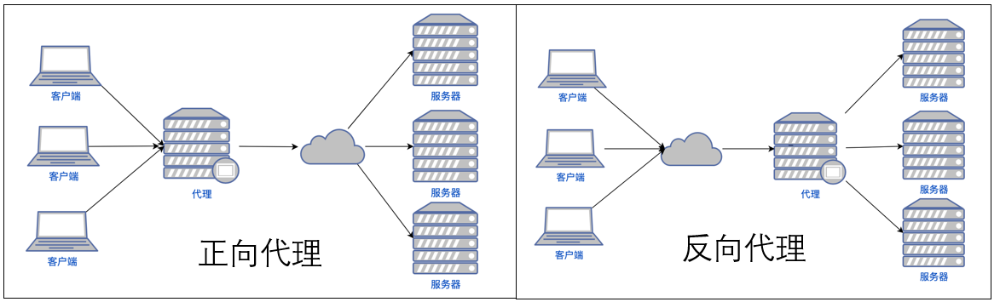

# Nginx

Nginx 是一个高性能的 HTTP 和反向代理 Web 服务器。特点包括：内存占用少、并发能力强（可支持大约 50000 个并发连接）等等

## 反向代理

要想搞明白什么是反向代理，就必须得搞明白什么是正向代理。

举个例子，如果浏览器是无法直接访问谷哥的，但香港的代理服务器是可以访问谷哥的，于是可以先访问香港的代理服务器，也就间接地访问了谷哥。那这台代理服务器也就是**正向代理**。



**正向代理是代理客户端的**，让你能正常访问目的服务器。与之相反，**反向代理是代理服务器的**，让大量的请求均衡地访问到某一台服务器上。

举个例子，10 万个用户同时在访问网站， 如果只有一台服务器的话，很容易就瘫痪了，于是高并发的情况下会有很多台服务器（假如 10 台吧）来接这个活，那怎么让 10 万个用户访问到这 10 台服务器呢？ 

这就需要一个反向代理服务器了，反向代理服务器让 1 万个用户访问服务器 A，1 万个用户访问服务器 B，1 个用户访问服务器 C，这样的话，每台服务器的压力就相应减小了

**Nginx 内置了轮询和加权轮询来达到负载均衡的目的**。可以通过设置权重为每个服务器加不同比例的负载。

## 动静分离

Nginx 还有一个很牛逼的功能是**动静分离**。

在我们的软件开发中，有些请求是需要后台处理的；有些请求是不需要后台处理的，比如说 css、js 这些文件请求，这些不需要经过后台处理的文件就叫静态文件。

我们可以根据一些规则，把动态资源和静态资源分开，然后通过 Nginx 把请求分开，静态资源的请求就不需要经过 Web 服务器处理了，从而提高整体上的资源的响应速度。


## Nginx 的配置

Nginx 的配置结构图：

```text
main        # 全局配置
├── events  # 配置网络连接
├── http    # 配置代理、缓存、日志等
│   ├── upstream # 配置负载均衡
│   ├── server   # 配置虚拟主机，可以有多个 server
│   ├── server
│   │   ├── location  # 用于匹配 URI（URL 是 URI 的一种），可以有多个 location
│   │   ├── location
│   │   └── ...
│   └── ...
└── https
...
```

具体的命令和配置在这里不再展开。可以参考别人写好的配置。

## 与tomcat、apache的区别

Apache HTTP服务器是一个模块化的应用服务器。Apache支持支持模块多，性能稳定，Apache本身是静态解析，适合静态HTML、图片等，但可以通过扩展脚本、模块等支持动态页面等。 

Apche可以支持PHPcgiperl,但是要使用Java的话，需要Tomcat在Apache后台支撑，将Java请求由Apache转发给Tomcat处理。不能将Tomcat和Apache HTTP服务器混淆，Apache HTTP服务器是一个用C语言实现的HTTPWeb服务器；

Tomcat是应用（Java）服务器，它只是一个Servlet(JSP也翻译成Servlet)容器，可以认为是Apache的扩展，但是可以独立于Apache运行。

> *JSP*（全称Java Server Pages）是一种动态网页技术标准。*JSP*部署于网络服务器上，可以响应客户端发送的请求，并根据请求内容动态地生成HTML、XML或其他格式文档的Web网页，然后返回给请求者。
>
> Servlet（Server Applet），全称Java Servlet。是用**Java编写的服务器端程序**。其主要功能在于交互式地浏览和修改数据，生成动态Web内容。狭义的Servlet是指Java语言实现的一个接口，广义的Servlet是指任何实现了这个Servlet接口的类，一般情况下，人们将Servlet理解为后者。

实际使用中Apache与Tomcat常常是整合使用：

- 如果客户端请求的是静态页面，则只需要Apache服务器响应请求。
- 如果客户端请求动态页面，则是Tomcat服务器响应请求。
- 因为JSP是服务器端解释代码的，这样整合就可以减少Tomcat的服务开销。

nginx相对于apache的优点

- 轻量级，采用 C 进行编写，同样的 web 服务，会占用更少的内存及资源
- 抗并发，nginx 处理请求是异步非阻塞的，而apache 则是阻塞型的，在高并发下nginx 能保持低资源低消耗高性能；apache是同步多进程模型，一个连接对应一个进程；nginx是异步的，多个连接（万级别）可以对应一个进程；
- nginx处理静态文件好,耗费内存少

apache 相对于nginx 的优点

- 支持的模块多，基本涵盖所有应用；
- 性能稳定，而nginx相对bug较多。
- 动态请求由apache转发请求到后台交由Tomcat进行处理，nginx只适合静态和反向；

更为通用的方案是，前端 nginx 抗并发，后端 apache 集群，配合起来会更好。