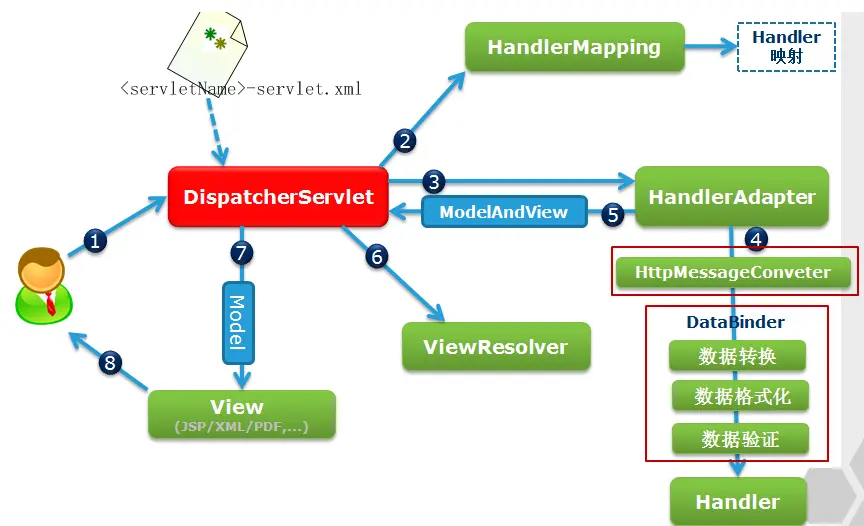

# Spring 基本原理

Spring 是一款主流的 Java EE 轻量级开源框架 。

广义上的 Spring 泛指以 Spring Framework 为核心的 Spring 技术栈。例如 Spring Framework、Spring MVC、SpringBoot、Spring Cloud、 Spring Data、Spring Security 等，其中 Spring Framework 是其他子项目的基础。

Spring 有两个最核心模块，其中 IoC 是Inverse of Control 的简写，译为“控制反转”，指把创建对象过程交给 Spring 进行管理。 

另外一个最核心模块是 AOP，Aspect Oriented Programming 的简写，译为“面向切面编程”。AOP 用来封装多个类的公共行 为，将那些与业务无关，却为业务模块所共同调用的逻辑封装起来，减少系统的重复代码，降低模块间 的耦合度。另外，AOP 还解决一些系统层面上的问题，比如日志、事务、权限等。

Spring Framework特点：

- 非侵入式：使用 Spring Framework 开发应用程序时，Spring 对应用程序本身的结构影响非常小。 对领域模型可以做到零污染；对功能性组件也只需要使用几个简单的注解进行标记，完全不会破坏 原有结构，反而能将组件结构进一步简化。这就使得基于 Spring Framework 开发应用程序时结构 清晰、简洁优雅。 
- 控制反转：IoC，翻转资源获取方向。把自己创建资源、向环境索取资源 变成环境将资源准备好，我们享受资源注入。 
- 面向切面编程：AOP，在不修改源代码的基础上增强代码功能。 
- 容器：Spring IoC 是一个容器，因为它包含并且管理组件对象的生命周期。组件享受到了容器化的 管理，替程序员屏蔽了组件创建过程中的大量细节，极大的降低了使用门槛，大幅度提高了开发效 率。
-  组件化：Spring 实现了使用简单的组件配置组合成一个复杂的应用。在 Spring 中可以使用 XML 和 Java 注解组合这些对象。这使得我们可以基于一个个功能明确、边界清晰的组件有条不紊的搭建超 大型复杂应用系统。 
- 一站式：在 IoC 和 AOP 的基础上可以整合各种企业应用的开源框架和优秀的第三方类库。而且 Spring 旗下的项目已经覆盖了广泛领域，很多方面的功能性需求可以在 Spring Framework 的基础 上全部使用 Spring 来实现。

## 基础使用

假设已经使用Maven注入好依赖，我们有一个类`com.atguigu.spring6.User`


在resources目录创建一个 Spring 配置文件 beans.xml（配置文件名称可随意命名），配置HelloWorld所对应的bean，即将HelloWorld的对象交给Spring的IOC容器管理 通过bean标签配置IOC容器所管理的bean

> 我们将由 IoC 容器管理的 Java 对象称为 Spring Bean，不过它与使用关键字 new 创建的 Java 对象没有任何区别。

```xml
 <bean id="user" class="com.atguigu.spring6.User"></bean>
```

我们不再使用传统的 new 对象，而是：

```java
ApplicationContext ac = new ClassPathXmlApplicationContext("beans.xml");
User user = (User) ac.getBean("user");
```

## 基本分析

上面的示例代码中，调用了无参数构造方法。可以看作是反射的一种实现方式。

> 传统的反射代码：
>
> ```java
> // 通过反射机制调用无参数构造方法创建对象
> Class clazz = Class.forName("com.atguigu.spring6.User");
> //Object obj = clazz.newInstance();
> Object object = clazz.getDeclaredConstructor().newInstance();
> ```

创建好的bean对象最终存储在spring容器中，在spring源码底层就是一个map集合，存储bean的map在**DefaultListableBeanFactory**类中：

```java
private final Map<String, BeanDefinition> beanDefinitionMap = new ConcurrentHashMap<>(256);
```

Spring容器加载到Bean类时 , 会把这个类的描述信息, 以包名加类名的方式存到beanDefinitionMap 中 , 其中 String是Key , 默认是类名首字母小写 , BeanDefinition是类的定义(描述信息) , 我们通常叫BeanDefinition接口为 bean的定义对象。

还有一个问题，上面的代码中，`ApplicationContext`是什么？在创建 bean 之前，首先需要创建IoC 容器。Spring 提供了IoC 容器的两种实现方式：

- BeanFactory：是 IoC 容器的基本实现，是 Spring 内部使用的接口。面向 Spring 本身，不提供给开发人员使用。
- ApplicationContext：BeanFactory 的子接口，提供了更多高级特性。面向 Spring 的使用者，几乎所有场合都使用 ApplicationContext 而不是底层的 BeanFactory。主要实现类包括：

| 类型名                          | 简介                                                         |
| ------------------------------- | ------------------------------------------------------------ |
| ClassPathXmlApplicationContext  | 通过读取类路径下的 XML 格式的配置文件创建 IOC 容器对象       |
| FileSystemXmlApplicationContext | 通过文件系统路径读取 XML 格式的配置文件创建 IOC 容器对象     |
| ConfigurableApplicationContext  | ApplicationContext 的子接口，包含一些扩展方法 refresh() 和 close() ，让 ApplicationContext 具有启动、关闭和刷新上下文的能力。 |
| WebApplicationContext           | 专门为 Web 应用准备，基于 Web 环境创建 IOC 容器对象，并将对象引入存入 ServletContext 域中。 |

## 容器：IoC

IoC 容器是 Spring 框架中最重要的核心组件之一，Spring 通过 IoC 容器来管理所有 Java 对象的实例化和初始化，控制对象与对象之间的依赖关系。

控制反转（IoC）是一种思想。是为了降低程序耦合度，提高程序扩展力。

反转的是什么？

- 将对象的创建权利交出去，交给第三方容器负责。
- 将对象和对象之间关系的维护权交出去，交给第三方容器负责。

IOC 就是一种控制反转的思想， 而 DI（Dependency Injection）依赖注入是对IoC的一种具体实现。

依赖注入指Spring创建对象的过程中，将对象依赖属性通过配置进行注入，依赖注入常见的实现方式包括两种：set注入和构造注入

> 为什么要使用 IoC 呢？
>
> 在平时的 Java 开发中，如果我们要实现某一个功能，可能至少需要两个以上的对象来协助完成，在没有 Spring 之前，每个对象在需要它的合作对象时，需要自己 new 一个，比如说 A 要使用 B，A 就对 B 产生了依赖，也就是 A 和 B 之间存在了一种耦合关系。
>
> 有了 Spring 之后，就不一样了，创建 B 的工作交给了 Spring 来完成，Spring 创建好了 B 对象后就放到容器中，A 告诉 Spring 我需要 B，Spring 就从容器中取出 B 交给 A 来使用。至于 B 是怎么来的，A 就不再关心了，Spring 容器想通过 newnew 创建 B 还是 new 创建 B，无所谓。
>
> 这就是 IoC 的好处，它降低了对象之间的耦合度，使得程序更加灵活，更加易于维护。

## bean生命周期


- bean对象创建（调用无参构造器）

- 给bean对象设置属性（注入）

- bean的前置置处理器（初始化之前）

- bean对象初始化（需在配置bean时指定初始化方法）

- bean的后置处理器（初始化之后）

- bean对象就绪可以使用

- bean对象销毁（需在配置bean时指定销毁方法）

- IOC容器关闭

注意创建对象的时机，配置bean标签的scope属性来指定，各取值含义参加下表：

| 取值              | 含义                                    | 创建对象的时机  |
| ----------------- | --------------------------------------- | --------------- |
| singleton（默认） | 在IOC容器中，这个bean的对象始终为单实例 | IOC容器初始化时 |
| prototype         | 这个bean在IOC容器中有多个实例           | 获取bean时      |

## 自动装配

即根据指定的策略，在IOC容器中匹配某一个bean，自动为指定的bean中所依赖的类类型或接口类型属性赋值

例子展示：一般开发中调用关系如下：


如果不使用spring，那么常规方法就是在 controller 中先 new 一个 service，同理 service 中也要 new 一个 dao，再调用相关方法。


如果使用 spring 呢？例如 controller 代码可以这么写：

```java
package com.atguigu.spring6.autowire.controller
public class UserController {
    private UserService userService;
    public void setUserService(UserService userService) {
        this.userService = userService;
    }
    public void saveUser(){
        userService.saveUser();  // 调用 service 中相关方法
    }
}
```

配置bean的`autowire-xml.xml`如下：

```xml
<bean id="userController" class="com.atguigu.spring6.autowire.controller.UserController" autowire="byType"></bean>

<bean id="userService" class="com.atguigu.spring6.autowire.service.impl.UserServiceImpl" autowire="byType"></bean>

<bean id="userDao" class="com.atguigu.spring6.autowire.dao.impl.UserDaoImpl"></bean>
```

可以实现根据类型自动匹配和赋值：

```java
ApplicationContext ac = new ClassPathXmlApplicationContext("autowire-xml.xml");
UserController userController = ac.getBean(UserController.class);
userController.saveUser();
```

## 基于注解管理Bean

我们可以使用注解来实现自动装配，简化 Spring 的 XML 配置。在开发中更常用。

> 复习一下，注解（Annotation）是代码中的一种特殊标记，可以在编译、类加载和运行时被读取，执行相应的处理。开发人员可以通过注解在不改变原有代码和逻辑的情况下，在源代码中嵌入补充信息。

简单来说，就是直接把注解可以标注在 Java 类上，将它们定义成 Spring Bean。

```java
@Component(value="user")  // 对应 xml 中的 id，默认是类名首字母小写
public class User{
}
```

| 注解        | 说明                                                         |
| ----------- | ------------------------------------------------------------ |
| @Component  | 该注解用于描述 Spring 中的 Bean，它是一个泛化的概念，仅仅表示容器中的一个组件（Bean），并且可以作用在应用的任何层次，例如 Service 层、Dao 层等。  使用时只需将该注解标注在相应类上即可。 |
| @Repository | 该注解用于将数据访问层（Dao 层）的类标识为 Spring 中的 Bean，其功能与 @Component 相同。 |
| @Service    | 该注解通常作用在业务层（Service 层），用于将业务层的类标识为 Spring 中的 Bean，其功能与 @Component 相同。 |
| @Controller | 该注解通常作用在控制层（如SpringMVC 的 Controller），用于将控制层的类标识为 Spring 中的 Bean，其功能与 @Component 相同。 |

那么如何注入？使用 Autowired，类似上面的自动装配一节，根据类型装配：

> 思考一下底层如何实现？当发现一个带有 `@Autowired` 注解的属性时，就使用反射机制为其赋值，赋什么值呢？当然是从 管理所有Bean 的`Map<String, BeanDefinition>`里面找名字或者类型符合的 Bean
>
> 在 Bean 的初始化阶段，会通过 Bean 后置处理器来进行一些前置和后置的处理。实现@Autowired 的功能，也是通过后置处理器来完成的。这个后置处理器就是 AutowiredAnnotationBeanPostProcessor。

```java
@Controller
public class UserController {
    @Autowired
    private UserService userService;

    public void out() {
        userService.out();  // 调用 service 相关方法
    }
}
```

但是这些注解在哪里被处理？我们需要让 Spring 扫描组件！具体来说，我们写一个配置类来代替 xml 配置文件

```java
package com.atguigu.spring6.config;
// import...
@Configuration  // 配置类
@ComponentScan("com.atguigu.spring6")  // 扫描包的路径
public class Spring6Config {
}
```

测试类不再读取 xml 文件，而是配置类：

```java
ApplicationContext context = new AnnotationConfigApplicationContext(Spring6Config.class);
UserController userController = context.getBean("userController", UserController.class);
userController.out();
```

## 面向切面（AOP）实例

假设我们实现了一个四则计算工具（业务代码），想加上日志功能（非业务代码），如何实现？

显然把业务代码和非业务代码混在一起不是一个明智的选择，我们可以使用**代理模式**：


> 二十三种设计模式中的一种，属于结构型模式。它的作用就是通过提供一个代理类，让我们在调用目标方法的时候，不再是直接对目标方法进行调用，而是通过代理类**间接**调用。让不属于目标方法核心逻辑的代码从目标方法中剥离出来——**解耦**。调用目标方法时先调用代理对象的方法，减少对目标方法的调用和打扰，同时让附加功能能够集中在一起也有利于统一维护。

Spring 使用了**动态代理**来实现AOP，还是那我们上面的例子来画图：


```java
// 测试类：
ProxyFactory factory = new ProxyFactory(new CalculatorLogImpl());
Calculator proxy = (Calculator) factory.getProxy();
proxy.div(1,0);

// 代理内部：
System.out.println("[动态代理][日志] "+method.getName()+"，参数："+ Arrays.toString(args));
result = method.invoke(target, args);  // 业务代码
System.out.println("[动态代理][日志] "+method.getName()+"，结果："+ result);
```

## AOP基本概念

AOP（Aspect Oriented Programming）是一种设计思想，是面向对象编程的一种补充和完善，它以通过预编译方式和运行期动态代理方式实现，在不修改源代码的情况下，给程序动态统一添加额外功能的一种技术。利用AOP可以对业务逻辑的各个部分进行隔离，从而使得业务逻辑各部分之间的耦合度降低，提高程序的可重用性，同时提高了开发的效率。

作用：

- 简化代码：把方法中固定位置的重复的代码**抽取**出来，让被抽取的方法更专注于自己的核心功能，提高内聚性。

- 代码增强：把特定的功能封装到切面类中，看哪里有需要，就往上套，被**套用**了切面逻辑的方法就被切面给增强了。

相关术语：

- 横切关注点：分散在每个各个模块中解决同一样的问题，如用户验证、日志管理、事务处理、数据缓存都属于横切关注点。
- 通知（增强）：通俗说，就是你想要增强的功能，比如 安全，事务，日志等。每一个横切关注点上要做的事情都需要写一个方法来实现，这样的方法就叫通知方法。
  - 前置通知 (@Before)：在被代理的目标方法**前**执行
  - 返回通知 (@AfterReturning)：在被代理的目标方法**成功结束**后执行（**寿终正寝**）
  - 异常通知(@AfterThrowing)：在被代理的目标方法**异常结束**后执行（**死于非命**）
  - 后置通知 (@After)：在被代理的目标方法**最终结束**后执行（**盖棺定论**）
  - 环绕通知(@Around)：使用try...catch...finally结构围绕**整个**被代理的目标方法，包括上面四种通知对应的所有位置
- 切面：封装通知方法的类。
- 连接点：把方法排成一排，每一个横切位置看成x轴方向，把方法从上到下执行的顺序看成y轴，x轴和y轴的交叉点就是连接点。**通俗说，就是spring允许你使用通知的地方**
- 切入点：定位连接点的方式。Spring 的 AOP 技术可以通过切入点定位到特定的连接点。通俗说，要实际去增强的方法。


## 基于注解的AOP

在添加好依赖和在 xml 文件中配置后，核心代码为：

```java
@Aspect  // 表示这个类是一个切面类
@Component  //保证这个切面类能够放入IOC容器
public class LogAspect {
    
    // 前置通知
    @Before("execution(public int com.atguigu.aop.annotation.CalculatorImpl.*(..))")
    public void beforeMethod(JoinPoint joinPoint){
        String methodName = joinPoint.getSignature().getName();
        String args = Arrays.toString(joinPoint.getArgs());
        System.out.println("Logger-->前置通知，方法名："+methodName+"，参数："+args);
    }
}
```

其中，切入点表达式语法为：


这样，在完全不用修改 `CalculatorImpl` 类的情况下，就可以通过切入点表达式语法找到连接点，增强功能。

## 事务管理

- **编程式事务管理**：需要在代码中显式调用事务管理的 API 来控制事务的边界，比较灵活，但是代码侵入性较强，不够优雅。
- **声明式事务管理**：这种方式使用 Spring 的 AOP 来声明事务，将事务管理代码从业务代码中分离出来。优点是代码简洁，易于维护。但缺点是不够灵活，只能在预定义的方法上使用事务。

声明式事务是建立在 AOP 之上的。其本质是通过 AOP 功能，对方法前后进行拦截，将事务处理的功能编织到拦截的方法中，也就是在目标方法开始之前启动一个事务，在目标方法执行完之后根据执行情况提交或者回滚事务。

```java
@Transactional
public void transfer(String out, String in, Double money) {
    accountDao.outMoney(out, money);// 转出
    accountDao.inMoney(in, money);// 转入
}
```

> **只有通过 Spring 容器的 AOP 代理调用的公开方法（public method）上的`@Transactional`注解才会生效**。如果在 protected、private 方法上使用`@Transactional`，这些事务注解将不会生效
>
> 原因：Spring 默认使用基于 JDK 的动态代理（当接口存在时）或基于 CGLIB 的代理（当只有类时）来实现事务。这两种代理机制都只能代理公开的方法。

隔离级别：

- ISOLATION_DEFAULT：使用数据库默认的隔离级别，MySQL 默认的是可重复读，Oracle 默认的读已提交。
- ISOLATION_READ_UNCOMMITTED：读未提交，允许事务读取未被其他事务提交的更改。这是隔离级别最低的设置，可能会导致“脏读”问题。
- ISOLATION_READ_COMMITTED：读已提交，确保事务只能读取已经被其他事务提交的更改。这可以防止“脏读”，但仍然可能发生“不可重复读”和“幻读”问题。
- ISOLATION_REPEATABLE_READ：可重复读，确保事务可以多次从一个字段中读取相同的值，即在这个事务内，其他事务无法更改这个字段，从而避免了“不可重复读”，但仍可能发生“幻读”问题。
- ISOLATION_SERIALIZABLE：串行化，这是最高的隔离级别，它完全隔离了事务，确保事务序列化执行，以此来避免“脏读”、“不可重复读”和“幻读”问题，但性能影响也最大。

## 常用注解总结

**web开发**

①、`@Controller`：用于标注控制层组件。

②、`@RestController`：是`@Controller` 和 `@ResponseBody` 的结合体，返回 JSON 数据时使用。

③、`@RequestMapping`：用于映射请求 URL 到具体的方法上，还可以细分为：

- `@GetMapping`：只能用于处理 GET 请求
- `@PostMapping`：只能用于处理 POST 请求
- `@DeleteMapping`：只能用于处理 DELETE 请求

④、`@ResponseBody`：直接将返回的数据放入 HTTP 响应正文中，一般用于返回 JSON 数据。

⑤、`@RequestBody`：表示一个方法参数应该绑定到 Web 请求体。

⑥、`@PathVariable`：用于接收路径参数，比如 `@RequestMapping(“/hello/{name}”)`，这里的 name 就是路径参数。

⑦、`@RequestParam`：用于接收请求参数。比如 `@RequestParam(name = "key") String key`，这里的 key 就是请求参数。

**容器**

- `@Component`：标识一个类为 Spring 组件，使其能够被 Spring 容器自动扫描和管理。
- `@Service`：标识一个业务逻辑组件（服务层）。比如 `@Service("userService")`，这里的 userService 就是 Bean 的名称。
- `@Repository`：标识一个数据访问组件（持久层）。
- `@Autowired`：按类型自动注入依赖。
- `@Configuration`：用于定义配置类，可替换 XML 配置文件。
- `@Value`：用于将 Spring Boot 中 application.properties 配置的属性值赋值给变量。

**切面**

`@Aspect` 用于声明一个切面，可以配合其他注解一起使用，比如：

- `@After`：在方法执行之后执行。
- `@Before`：在方法执行之前执行。
- `@Around`：方法前后均执行。
- `@PointCut`：定义切点，指定需要拦截的方法。

**事务**

主要就是 `@Transactional`，用于声明一个方法需要事务支持。

## Spring MVC

Spring MVC 是基于模型-视图-控制器的 Web 框架，它的工作流程也主要是围绕着 Model、View、Controller 这三个组件展开的。




## SpringBoot

Spring Boot是Spring提供的一个子项目。旨在简化 Spring 应用的配置和部署过程，提供了大量的自动配置选项，以及运行时环境的内嵌 Web 服务器，这样就可以更快速地开发一个 SpringMVC 的 Web 项目。

传统方式构建spring应用程序比较繁琐

- 导入maven依赖繁琐
- 项目xml配置繁琐

SpringBoot特性包括

- 起步依赖：使用一个Maven坐标，整合了完成需要的所有Maven坐标

  ```
  <dependency>    
  	<groupId>org.springframework.boot</groupId>
  	<artifactId>spring-boot-starter-web</artifactId>
  </dependency>
  ```

- 自动配置：遵循约定大约配置的原则，在boot程序启动后，一些bean对象会自动注入到ioc容器，不需要手动声明，简化开发。Spring Boot 的自动装配原理依赖于 Spring 框架的依赖注入和条件注册，通过这种方式，Spring Boot 能够智能地配置 bean，并且只有当这些 bean 实际需要时才会被创建和配置。

- 其他特性：内嵌的Tomcat、Jetty（无需部署WAR文件）；外部化配置；不需要XML配置(properties/yml)

SpringBoot的启动流程：

> SpringBoot启动，其本质就是加载各种配置信息，然后初始化IOC容器，在run方法中会真正的实例化容器，并创建容器中需要的Bean实例，最终返回

在启动类执行SpringApplication.run这行代码的时候，在它的方法内部其实会做两个事情

```java
@SpringBootApplication
public class App {    
    public static void main(String[] args) {        
        ConfigurableApplicationContext context = SpringApplication.run(App.class, args);    
    }
}
```

1. 创建SpringApplication对象；
   - 确认web应用的类型，一般情况下是Servlet类型，这种类型的应用，将来会自动启动一个tomcat。
   - 从spring.factories配置文件中，加载默认的ApplicationContextInitializer和ApplicationListener
   - 记录当前应用的主启动类，将来做包扫描使用
2. 执行run方法。
   - 准备Environment对象，它里面会封装一些当前应用运行环境的参数，比如环境变量等等
   - 实例化容器，这里仅仅是创建ApplicationContext对象
   - 容器创建好了以后，会为容器做一些准备工作，比如为容器设置Environment、BeanFactoryPostProcessor后置处理器，并且加载主类对应的Definition
   - 刷新容器，就是我们常说的referesh，在这里会真正的创建Bean实例

IOC容器的初始化，核心工作是在AbstractApplicationContext.refresh方法中完成的

1. 准备BeanFactory，在这一块需要给BeanFacory设置很多属性，比如类加载器、Environment等
2.  执行BeanFactory后置处理器，这一阶段会扫描要放入到容器中的Bean信息，得到对应的BeanDefinition（注意，这里只扫描，不创建）
3. 是注册BeanPostProcesor，我们自定义的BeanPostProcessor就是在这一个阶段被加载的, 将来Bean对象实例化好后需要用到
4. 启动tomcat
5. 实例化容器中实例化非懒加载的单例Bean, 这里需要说的是，多例Bean和懒加载的Bean不会在这个阶段实例化，将来用到的时候再创建
6. 当容器初始化完毕后，再做一些扫尾工作，比如清除缓存等 
