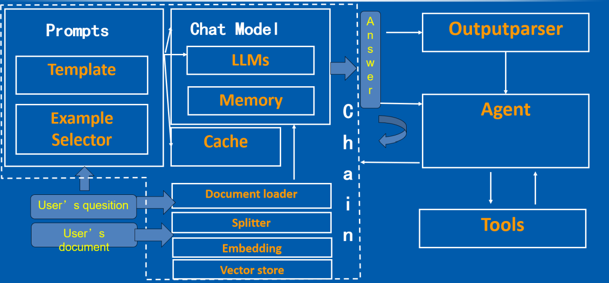
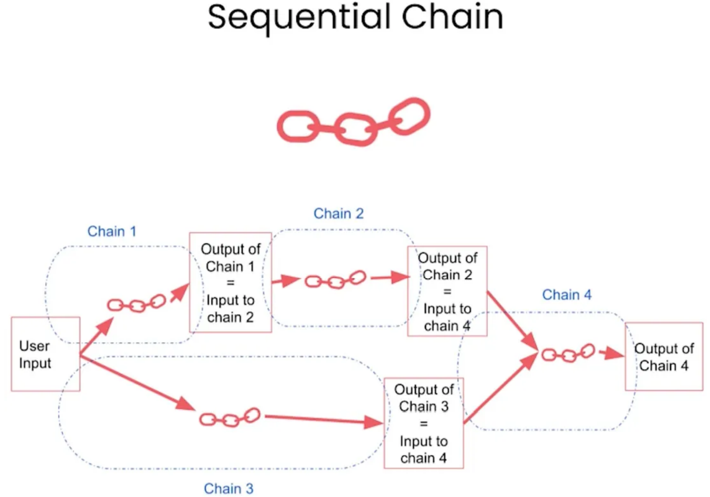
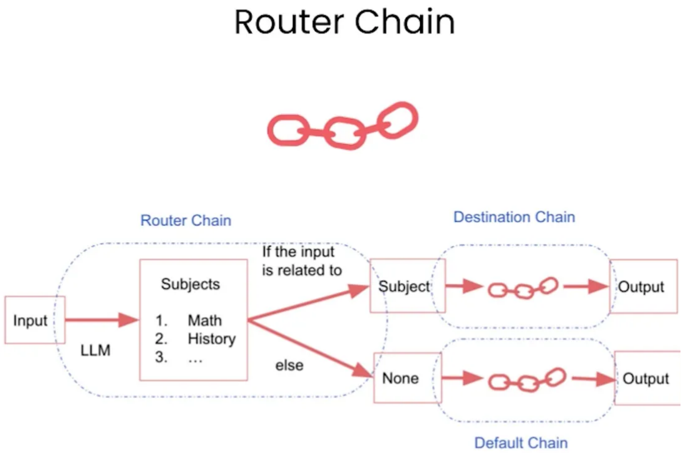

# LangChain

> [ref](https://qmmms.github.io/posts/LangChain%E5%AE%9E%E6%88%98/)

请设想下面这几种场景：你拥有几本电子书，或几十个文本文件，抑或是利用数据 库完成特定任务,我们想要LLMs模型学习用户给定的数据，并且只回答给定数据范围 内的相关问题,如果问题超出范围,一律告知用户问题超出范围无法回答,也就是我们 要限制LLMs模型自由发挥，不能让它随便乱说。如何基于大模型完成上述任务？ LangChain可以帮你实现。点

LangChain共有6个比较核心的模块，分别是： 

- 模型（Models）：使用的不同的语言模型和嵌入模型。 
- 提示（Prompts）：构建模型的输入。 
- 链（Chains）：结合LLMs和其他组件。 
- 索引（Indexes）：访问外部数据。 
- 记忆（Memory）：存储以往的交互信息。 
- 代理（Agents）：调用其他工具。



## 0、准备

在进行实验之前，我们需要设置**代理**和检查环境。


```python
import os

os.environ['HTTP_PROXY'] = 'http://127.0.0.1:xxxxx'
os.environ['HTTPS_PROXY'] = 'http://127.0.0.1:xxxxx'

# 检查代理是否有用
def check_proxy():
    import urllib.request
    url = "https://www.google.com"
    filename = "google.html"
    urllib.request.urlretrieve(url, filename)

check_proxy()  # 如果可以正常保存 google 网页，代理运行正常
```

下面我们继续检查OpenAI API KEY是否可用。


```python
import os
from openai import OpenAI

os.environ["OPENAI_API_KEY"] = "xxxxxxxxxxx"
client = OpenAI()

response = client.completions.create(
    model="davinci-002",
    prompt="Hello, my name is",
    max_tokens=10,
    n=1,
    stop=None,
    temperature=0.5,
)

print(response.choices[0].text)
```

     Dr. Mike. I am a board certified psychiatrist


> 注意，如果提示模型已经弃用，可以在[OpenAI网站](https://platform.openai.com/docs/deprecations)找可以替换的模型。

解释一下代码：
- 调用ChatGPT API，其中的engine是使用的chatgpt的davinci引擎
- 输入提示是prompt
- 生成文本的最大长度限制为10个tokens，一个token可以是一个单词或者一个子词
- n=1是设置的生成文本的数量，即表示生成一条回复
- stop是来指定生成文本结束的条件的，这里设为None，表示不设置停止的条件
- temperature是用来控制文本生成的随机性的，数值越大代表生成的文本越随机，数值越小表示生成的文本很确定和保守
- 返回的内容就是response对象

## 1、Base Model

大语言模型是我们使用LangChain开发程序的基础。目前，许多不同的大型语言模型正在不断涌现。LangChain主要区分三种模型：

- 大型语言模型（LLM）
- 聊天模型（Chat Model）
- 文本嵌入模型（Text Embedding Model）

下面我们将对上面的LLM、Chat Model以及模型的输出解析器进行详细讲解，关于Text
Embedding Model的内容会在后续章节中展开介绍。

### 1.1、LLM

LangChain本身不提供大语言模型，只提供各种接口和方式用以调用访问大语言模型。在LLMs中，提供了统一的接口来访问这些大模型。现在有很多LLM提供商比如OpenAI, Cohere, Hugging Face等。

以下是声明调用LLM的常见方式，模型选择是很多的，具体要使用哪个模型可以访问👉[这里](https://python.langchain.com/docs/integrations/llms/)👈进行浏览和设置。


```python
from langchain_openai import OpenAI

llm = OpenAI(model_name="gpt-3.5-turbo-instruct", max_tokens=1024, temperature=.7)
print(llm.invoke("Tell me a scared story."))
```

    It was a dark and stormy night, and the wind was howling outside.....


LLM最基本的功能就是能够调用它，传递一个字符串并返回一个字符串。其中，

- model_name是我们使用的模型名称，我们选择的模型是 gpt-3.5-turbo-instruct。
- temperature是OpenAI的Completion接口参数，用来控制输出结果的确定性：温度越高，越不确定；温度越低，越确定。默认温度是0.7，一个比较平衡的数值。
- "tell me...story"就是query，传递进模型中调用问答模型给出回答，query的类型是字符串，没有限制它必须是疑问句还是陈述句

### 1.2、Chat Model

这些模型将聊天消息列表作为输入，并返回聊天消息。有关聊天模型的种类也可以点击[此处](https://python.langchain.com/docs/integrations/chat/)访问LangChain官网进行浏览，在此不再一一列举。

聊天模型界面基于消息而不是原始文本。LangChain目前支持的消息类型有AIMessage，
HumanMessage，SystemMessage和ChatMessage。其中，ChatMessage通常接受一个任意
的角色参数。大多数时候，我们只需处理HumanMessage，AIMessage和SystemMessage。
它们对应了OpenAI聊天模型API支持的不同角色user、assistant和system。

```python
from langchain_openai import ChatOpenAI
from langchain import PromptTemplate, LLMChain
from langchain.prompts.chat import (
    ChatPromptTemplate,
    SystemMessagePromptTemplate,
    AIMessagePromptTemplate,
    HumanMessagePromptTemplate,
)
from langchain.schema import (
    AIMessage,
    HumanMessage,
    SystemMessage
)

chat = ChatOpenAI(temperature=0)
# #human给出的信息是一个字符串内容，给到chat之后会返回一个AIMessage信息，其中的内容将是给出的反馈答案
chat.invoke([HumanMessage(content="Translate this sentence from English to Chinese. I love programming.")])
```


    AIMessage(content='我爱编程。')

通常情况下，我们将SystemMessage的内容设定为为AI赋予一个角色，这样OpenAI模型可以更好地在特定领域内提供准确的答案。需要特别注意的是，OpenAI的聊天模型支持同时输入批量信息。您可以使用chat.generate方法来处理多轮对话内容，返回值LLMResult中包含了输入信息。


```python
batch_messages = [
    [
    	SystemMessage(content="You are a helpful assistant that translates English to French."),
    	HumanMessage(content="Translate this sentence from English to French. I love programming.")
    ],
    [
    	SystemMessage(content="You are a helpful assistant that translates English to Chinese."),
    	HumanMessage(content="Translate this sentence from English to Chinese. I love artificial intelligence.")
    ],
]
result = chat.generate(batch_messages)
print(result.generations[0][0].text)
print(result.generations[1][0].text)
```

    J'adore programmer.
    我喜欢人工智能。

当然，结合LLMChain和Prompt、Chat model，可以更方便地开展对话，这一部分的例子
会在后面的内容中详细介绍。

### 1.3、Output Parsers

语言模型（LLM）输出的内容通常是文本格式。然而，在开发人工智能应用程序时，我们通
常需要更加格式化的内容，例如将结果转换为目标对象或数组等，以便程序更好地处理。为
了满足这个需求，LangChain提供了输出解析器（Output parser）来格式化模型返回的内
容。输出解析器的主要作用是将语言模型返回的结果进行格式化。一个输出解析器必须实现以下两个关键方法：

- get_format_instructions: 该方法返回一个字符串，其中包含了指导语言模型应该
返回什么格式内容的提示词。它告诉模型应该如何构建其输出，以确保输出的内容
可以被后续的解析器正确处理。
- parse：这个方法用于将语言模型返回的内容解析成目标格式。它将模型的输出转
化为更结构化的形式，以便后续的处理和使用。

还有一个可选的方法：
- Parse with prompt：这个方法接受一个字符串（假定为语言模型的响应）和一个
提示（假定为生成这个响应的提示），并将其解析成某种结构。提示主要用于在输
出解析器需要重试或修复输出时提供信息，以便根据提示的内容进行相应的操作。


```python
from typing import List
from langchain_openai import OpenAI
from langchain.output_parsers import PydanticOutputParser
from langchain.prompts import PromptTemplate
from langchain.pydantic_v1 import BaseModel, Field, validator


model = OpenAI(model_name='gpt-3.5-turbo-instruct', temperature=0.0)

# 定义您期望的数据结构
class Joke(BaseModel):
    setup: str = Field(description="question to set up a joke")
    punchline: str = Field(description="answer to resolve the joke")

    # 使用 Pydantic 轻松添加自定义验证逻辑
    @validator('setup')
    def question_ends_with_question_mark(cls, field):
        if field[-1] != "?":
            raise ValueError("question should end with a question mark")
        return field
    

# 初始化 PydanticOutputParser 解析器
parser = PydanticOutputParser(pydantic_object=Joke)

# 设置提示模板
prompt = PromptTemplate(
    template="Answer the user query.\n{format_instructions}\n{query}\n",
    input_variables=["query"],
    partial_variables={"format_instructions": parser.get_format_instructions()}
)

# 组合提示模板和语言模型
prompt_and_model = prompt | model

# 提交用户查询并解析响应
output = prompt_and_model.invoke({"query": "Tell me a joke."})
parser.invoke(output)
```


    Joke(setup='Why did the tomato turn red?', punchline='Because it saw the salad dressing!')

我们可以看到 `template="Answer the user query.\n{format_instructions}\n{query}\n"`，其中format_instructions是指导语言模型应该返回什么格式内容的提示词，query是用户的问题。这个模板是用来告诉模型应该如何构建其输出，以确保输出的内容可以被后续的解析器正确处理。

query在我们的代码中即 `"Tell me a joke."`

如果要查看`format_instructions`的内容，可以使用`print(parser.get_format_instructions())`进行打印。


```python
print(parser.get_format_instructions())
```

    The output should be formatted as a JSON instance that conforms to the JSON schema below.
    
    As an example, for the schema {"properties": {"foo": {"title": "Foo", "description": "a list of strings", "type": "array", "items": {"type": "string"}}}, "required": ["foo"]}
    the object {"foo": ["bar", "baz"]} is a well-formatted instance of the schema. The object {"properties": {"foo": ["bar", "baz"]}} is not well-formatted.
    
    Here is the output schema:
    ```
    {"properties": {"setup": {"title": "Setup", "description": "question to set up a joke", "type": "string"}, "punchline": {"title": "Punchline", "description": "answer to resolve the joke", "type": "string"}}, "required": ["setup", "punchline"]}
    ```


## 2、Prompt

Prompt不仅可以发挥LLM的强大能力，还可以将其应用于各种实际场景。通过Prompt，你可以引导模型执行特定任务、回答问题，甚至参与对话。

在这一章节，我们将深入探讨Prompt的概念、如何设计有效的提示工程，以及如何使用
LangChain中的提示模板来简化这一过程。Prompt为我们提供了更多的控制力，使我们能
够更精确地引导模型以满足各种需求。

### 2.1、Prompt Engineering

Prompt Engineering是一种在自然语言处理领域的技术，它通过设计、优化和评估输入提示
（prompt）来引导大规模语言模型（如GPT系列模型）生成期望的输出。简而言之， Prompt Engineering 就是找到最佳方式向模型提问，以获得最有用、最准确的回答。

设计一个通用的prompt框架通常包括以下一些要素：

- 背景介绍：在提示中，通常需要提供任务的上下文或背景信息。这有助于确保模型
理解问题的背景和相关领域。背景介绍部分可以包括问题的历史、相关事件或其他
相关信息。
- 任务指令：任务指令部分包含明确的指导或任务描述。它告诉模型它需要执行的任
务，通常以明确的命令或问题的形式表示。这是为了确保模型理解任务的关键要
点。
- 参考信息：为了帮助模型更好地执行任务，通常提供与任务相关的参考信息或上下
文。这可以是具体的数据、文献引用、或其他支持材料。参考信息有助于模型生成
更准确和有根据的回应。
- 输出约束：在某些情况下，可能需要对模型生成的输出进行约束。这可以包括特定
的格式、答案的长度、或其他生成结果的要求。输出约束有助于确保模型的回应满
足特定标准。
- 列举例子：为了更清楚地说明任务和期望的输出，通常会提供示例。这些示例是任
务的典型示例，帮助模型理解任务的类型和预期的响应。


### 2.2、Prompt Template

LangChain提供了Prompt Template，提示模板允许我们将格式化提示的逻辑与实际的语言
模型调用分离开来。现在我们看一个使用Prompt Templates的简单用例：


```python
from langchain import PromptTemplate
from langchain_openai import OpenAI

def generate_city_names(city_features):
    #具体的模版内容，其中要进行补全的地方用大括号进行变量的放置，不需要其他的操作，类似于字符串中对于某一个变量对其的format格式化
    prompt_template = "I would like to travel to other cities. The main features of cities are:{}。Give me three cities by nameonly."

    #将提示包装成字符串列表
    prompt = [prompt_template.format(city_features)]
    llm = OpenAI()
    response = llm.generate(prompt, max_tokens=100, temperature=0.8)
    city_names = [gen[0].text.strip() for gen in response.generations]
    return city_names

city_features = "Sun, beach, romance."
city_names = generate_city_names(city_features)
print(city_names)
```

    ['1. Miami, Florida\n2. Honolulu, Hawaii\n3. Barcelona, Spain']


从上面的用例中可以看到：通过LangChain的PromptTemplate类，我们可以生成具体的
prompt，PromptTemplate接受多个输入变量，用来格式化生成prompt。


```python
from langchain import PromptTemplate

#input_variables的值可以为空，说明其中没有任何变量
no_input_prompt = PromptTemplate(input_variables=[], template="Tell me a joke.")
no_input_prompt.format()

#一个input_variable的示例，这样模版化之后的提示将把adjective作为参数传入
one_input_prompt = PromptTemplate(input_variables=["adjective"],
template="Tell me a {adjective} joke.")
one_input_prompt.format(adjective="funny")

#多个input_variables的示例，模版后的提示将adjective和content作为参数传入
multiple_input_prompt = PromptTemplate(
    input_variables=["adjective", "content"],
    template="Tell me a {adjective} joke about {content}."
)
multiple_input_prompt.format(adjective="funny", content="chickens")
```


    'Tell me a funny joke about chickens.'

此外，还可以 自定义Prompt Template、 Few-shot Prompt Templates

## 3、Chat Model

聊天模型与大型语言模型之间存在的一个重要差异——聊天模型具有存储聊天记录的功能。这个特性为聊天模型增加了一层智能和上下文感知，让它能够更好地理解和响应用户的问题。通过存储先前的对话内容，聊天模型可以实现更连贯、更智能的对话，不仅回答当前的问题，还考虑到整个对话历史，使得交互更加自然和有趣。

###  3.1、Chat Prompt

聊天模型的提示是基于消息而构建的，而不仅仅是纯文本。

可以采用MessagePromptTemplate来为提示添加模板化的效果。借助一个或多个
MessagePromptTemplates，我们还能构建ChatPromptTemplate。在这之后，使用
ChatPromptTemplate的format_prompt方法即可获得PromptValue，然后根据需要将其转换为字符串或消息对象。这完全取决于我们是希望将这个经过格式化的值用作 LLM还是聊天模型的输入。

为了方便起见，该模板上定义了一个from_template方法如下所示：


```python
from langchain_openai import ChatOpenAI
from langchain.prompts.chat import (
    ChatPromptTemplate,
    SystemMessagePromptTemplate,
    AIMessagePromptTemplate,
    HumanMessagePromptTemplate,
)

chat = ChatOpenAI()

template = "You are a helpful assistant that translates {input_language} to {output_language}."

# 创建一个系统消息模板，用于设定聊天对话中的系统消息
system_message_prompt = SystemMessagePromptTemplate.from_template(template)
# 创建一个人类消息模板，用于定义人类输入的消息
human_template = "{text}"
human_message_prompt = HumanMessagePromptTemplate.from_template(human_template)
# 创建一个 ChatPromptTemplate 实例，使用系统消息和人类消息模板
chat_prompt = ChatPromptTemplate.from_messages([system_message_prompt, human_message_prompt])

# 通过对格式化的消息执行 chat 方法，获取聊天完成
print(chat.invoke(chat_prompt.format_prompt(input_language="English",output_language="French", text="I love programming.").to_messages()))
```

    content="J'adore la programmation."


如果想要更直接地构建MessagePromptTemplate，可以在外部创建一个 PromptTemplate然后将其传入，例如：


```python
prompt=PromptTemplate(
    template="You are a helpful assistant that translates {input_language} to {output_language}.",
    input_variables=["input_language", "output_language"],
)
system_message_prompt = SystemMessagePromptTemplate(prompt=prompt)
```

### 3.2、Memory

Chat Model一个引人注目的特点是它们的聊天记录可以具有记忆存储。这意味着Chat Model可以在对话的不同部分中保持对之前发生的事件和信息的上下文记忆。这种功能使Chat Model更智能、更贴近真实对话，但它也引出了一个有趣的问题：如何在模型之间或在对话的不同阶段共享这种记忆？

LangChain引入了Memory模块，它允许我们更灵活地管理和共享对话的上下文。这个模块
将信息存储在内部记忆中，以便在需要时检索。从Chat Model的聊天记录中抽取并存储信
息，然后将其传递给其他组件或模型，以在整个应用程序中保持一致的上下文，是Memory
模块的一项重要任务。

对话的历史记录作为prompt框架上的参考信息需要一起送给模型回答问题。然而大模型的
调用都是有窗口长度限制的，所以这个历史记录不能无限的长。因此，LangChain引入
Memory，来对历史记录进行管理。不同的Memory的函数，就是不同的形成prompt参考信息的方法。

对话缓冲区内存ConversationBufferMemory可以帮助用户轻松创建对话历史，它会将聊天内容记录在内存中，而不需要每次再手动拼接聊天记录，用法如下:


```python
from langchain.memory import ConversationBufferMemory

memory = ConversationBufferMemory()
memory.chat_memory.add_user_message("hi!")
memory.chat_memory.add_ai_message("whats up?")
#加载对话缓存中存储的变量。该方法接受一个空字典作为参数，表示不需要加载任何变量
memory.load_memory_variables({})
#也可以用列表返回历史消息
memory = ConversationBufferMemory(return_messages=True)
memory.chat_memory.add_user_message("hi!")
memory.chat_memory.add_ai_message("whats up?")
memory.load_memory_variables({})
```


    {'history': [HumanMessage(content='hi!'), AIMessage(content='whats up?')]}

接下来我们通过几个示例看一下具体怎么将其添加到Chain中.


```python
from langchain_openai import OpenAI
from langchain.chains import ConversationChain
from langchain import LLMChain, PromptTemplate

template = """You are a chatbot having a conversation with a human.
{chat_history}
Human: {human_input}
Chatbot:"""

prompt = PromptTemplate(
    input_variables=["chat_history", "human_input"],
    template=template
)

memory = ConversationBufferMemory(memory_key="chat_history")

llm_chain = LLMChain(
    llm=OpenAI(),
    prompt=prompt,
    verbose=True,
    memory=memory,
)

llm_chain.predict(human_input="Hi there!")
```

    ' Hello! How are you doing today?'


```python
llm_chain.predict(human_input="I'm doing well! Just having a conversation with an AI.")
```

    " That's great to hear! I am always happy to have conversations with humans. What would you like to talk about?"


```python
llm_chain.predict(human_input="Tell me about yourself.")
```

    ' I am an AI chatbot designed to interact and communicate with humans....'

### 3.3、Cache

向 openAI 调用接口都是要花钱的，如果用户问同一个问题，对结果进行了缓存，这样就可以减少接口的调用并且也能加快接口返回的速度。

缓存是提高效率的强大工具，特别是在处理大量重复需求时。缓存的选择取决于不同需求，
包括内存缓存、SQLite缓存、Redis缓存、自定义SQLAlchemy缓存等。

下面，我们来看一个使用内存缓存的用例，内存缓存适用于短暂的缓存需求。它的优势在于速度极快，可以在极短时间内访问缓存数据。通常，内存缓存有一定限制，当达到限制时，较早的缓存数据将被删除：


```python
import langchain
from langchain_openai import OpenAI
from langchain.cache import InMemoryCache

langchain.llm_cache = InMemoryCache()
# To make the caching really obvious, lets use a slower model.
llm = OpenAI(model_name="gpt-3.5-turbo-instruct", n=2, best_of=2)
# The first time, it is not yet in cache, so it should take longer
print(llm.invoke("Tell me a joke"))
# The second time it is, so it goes faster
print(llm.invoke("Tell me a joke"))
```


    Why was the math book sad?
    Because it had too many problems.
    
    Why was the math book sad?
    Because it had too many problems.


当需要缓存的数据较大或需要长期持久性时，SQLite是一个更好的选择。它提供了更好的支持，能够有效地管理较大的缓存数据，以下是使用SQLite缓存的一个示例：


```python
import langchain
from langchain_openai import ChatOpenAI
from langchain.cache import SQLiteCache

# 设置语言模型的缓存数据存储的地址
langchain.llm_cache = SQLiteCache(database_path=".langchain.db")
# 加载 llm 模型
llm = ChatOpenAI()
# 第一次向模型提问
result = llm.invoke('tell me a joke')
print(result)
# 第二次向模型提问同样的问题
result2 = llm.invoke('tell me a joke')
print(result2)
```

    content='Why did the scarecrow win an award? Because he was outstanding in his field!'
    content='Why did the scarecrow win an award? Because he was outstanding in his field!'


使用缓存可以显著提高程序的效率，使代码运行更快且更流畅。不同类型的缓存适用于不同
场景，从内存缓存到持久性的SQLite缓存和Redis缓存，再到基于语义和GPT的智能缓存，
都有其独特的用途。 SQLAlchemyCache 则支持任何SQLAlchemy支持的SQL数据库。因
此，缓存在LangChain中是一个强大的工具，用于提高效率和加速代码的运行。

## 4、Chain

通过前面的学习，我们已经了解了如何使用Prompts与模型进行互动。这些概念为我们构建
强大的自然语言处理应用奠定了坚实的基础。

但要真正将这些概念转化为有用的工具和应用，我们需要一种方法来将它们有机地连接在一
起，创造出更复杂的、功能更强大的系统。正是在这里，LangChain的链（Chain）充当了
一个粘合剂，将语言模型、Prompts以及其他组件串联在一起，构建出协同工作的智能系
统。

链允许我们将多个组件组合在一起，创建一个单一的、一致的应用程序。我们可以通过将多
个链组合在一起，或者通过将链与其他组件组合在一起，来构建更复杂的链。例如，我们可
以创建一个链，该链接接受用户输入，使用PromptTemplate对其进行格式化，然后将格式
化后的响应传递给LLM。

### 4.1、LLMChian

LLMChain，它是一个最简单、使用最多的chain，它会接收一个prompt模板，我们使用这
个模板格式化输入信息，然后返回用户的查询得到的响应，也就是我们想要的答案。下面是
使用例子：


```python
from langchain.prompts import PromptTemplate
from langchain_openai import OpenAI


llm = OpenAI(temperature=0.9)
#提示模版格式化变量内容
prompt = PromptTemplate(
    input_variables=["product"],
    template="What is a good name for a company that makes{product}?",
)

from langchain.chains import LLMChain
#实例化chain对象
chain = LLMChain(llm=llm, prompt=prompt)
#用chain的run方法来运行指定输入变量的链
print(chain.invoke("colorful socks"))
```

    {'product': 'colorful socks', 'text': '\n\n"Rainbow Sox Co."'}


在LLMChain中使用chat model去完成聊天机器人的交互过程，以下是一个示例：


```python
from langchain_openai import ChatOpenAI
from langchain.prompts.chat import (
    ChatPromptTemplate,
    HumanMessagePromptTemplate,
)

human_message_prompt = HumanMessagePromptTemplate(
    prompt=PromptTemplate(
        template="What is a good name for a company that makes {product}?",
        input_variables=["product"],
    )
)
chat_prompt_template = ChatPromptTemplate.from_messages([human_message_prompt])
chat = ChatOpenAI(temperature=0.9)
chain = LLMChain(llm=chat, prompt=chat_prompt_template)
print(chain.invoke("colorful socks"))

```

    {'product': 'colorful socks', 'text': 'Rainbow Feet Co.'}

下面这段代码演示了如何使用LangChain创建一个包含OpenAI语言模型和
ConversationBufferMemory记忆的对话链。在这个链中，我们使用ConversationChain类，设置verbose=True以输出详细信息，然后输入"Hi there!"并获取相应的预测结果。


```python
from langchain_openai import OpenAI
from langchain.chains import ConversationChain
from langchain.memory import ConversationBufferMemory

llm = OpenAI(temperature=0)
# 创建一个 ConversationChain 实例，这里包含了 OpenAI 语言模型和ConversationBufferMemory 记忆
conversation = ConversationChain(
    llm=llm,
    verbose=True, # 设置 verbose 为 True 以便输出详细信息
    memory=ConversationBufferMemory() # 使用ConversationBufferMemory 作为记忆
)

conversation.predict(input="Hi there!")

```

    " Hello! It's nice to meet you. I am an AI created by OpenAI. I am constantly learning and improving my abilities through machine learning algorithms. How can I assist you today?"


```python
conversation.predict(input="I'm doing well! Just having a conversation with an AI.")
```

    " That's great to hear! I am always happy to engage in conversations and learn more about human interactions. Is there anything specific you would like to talk about?"


```python
conversation.predict(input="Tell me about yourself.")
```

    ' Of course! As I mentioned, I am an AI created by OpenAI. I am designed to process and analyze large amounts of data, and use that information to perform various tasks and provide helpful responses. I am constantly learning and adapting to new information, which allows me to improve my abilities over time. Is there anything else you would like to know about me?'

### 4.2、SequentialChain



顺序链可以组合多个chain，SequentialChain参数输入chain列表，它会顺序执行每一个
chain，将第一个chain的返回值输入到第二chain，依次类推。下面是使用范例:


```python
from langchain_openai import OpenAI
from langchain.chains import LLMChain
from langchain.prompts import PromptTemplate
from langchain.chains import SimpleSequentialChain

# 定义第一个chain
llm = OpenAI(temperature=.7)
template = """You are a playwright. Given the title of play, it is your job to write a synopsis for that title.
Title: {title}
Playwright: This is a synopsis for the above play:"""
prompt_template = PromptTemplate(input_variables=["title"], template=template)
synopsis_chain = LLMChain(llm=llm, prompt=prompt_template)

# 定义第二个chain
llm = OpenAI(temperature=.7)
template = """You are a play critic from the New York Times. Given the synopsis of play, it is your job to write a review for that play.
Play Synopsis:
{synopsis}
Review from a New York Times play critic of the above play:"""
prompt_template = PromptTemplate(input_variables=["synopsis"], template=template)
review_chain = LLMChain(llm=llm, prompt=prompt_template)

# 通过简单顺序链组合两个LLMChain
overall_chain = SimpleSequentialChain(chains=[synopsis_chain, review_chain], verbose=True)
# 执行顺序链
review = overall_chain.invoke("Tragedy at sunset on the beach")
```

    Tragedy at Sunset on the Beach follows the story of two young lovers, Mia and Jack....


### 4.3、RouterChain



RouterChain是一种示例，用于创建动态选择下一个链，以处理给定的输入。RouterChain
通常由两个组件组成：

- RouterChain本身（负责选择要调用的下一条链）。
- destination_chains: 路由器链可以路由到的链。

下面将展示这些路由链在MultiPromptChain中的应用，创建一个问题回答链条，根据给定
的问题选择最相关的提示，然后使用该提示回答问题。

```python
from langchain.chains.router import MultiPromptChain
from langchain_openai import OpenAI
from langchain.chains import ConversationChain
from langchain.chains.llm import LLMChain
from langchain.prompts import PromptTemplate

physics_template = """You are a very smart physics professor. \
You are great at answering questions about physics in a concise and
easy to understand manner. \
When you don't know the answer to a question you admit that you
don't know.
Here is a question:
{input}"""

math_template = """You are a very good mathematician. You are great
at answering math questions. \
You are so good because you are able to break down hard problems
into their component parts, \
answer the component parts, and then put them together to answer
the broader question.
Here is a question:
{input}"""

prompt_infos = [
    {
        "name": "physics",
        "description": "Good for answering questions about physics",
        "prompt_template": physics_template
    },
    {
        "name": "math",
        "description": "Good for answering math questions",
        "prompt_template": math_template
    }
]

llm = OpenAI()
destination_chains = {}

# 将prompt_infos列表中的每个prompt信息转换为一个ConversationChain实例
for p_info in prompt_infos:
    name = p_info["name"]
    prompt_template = p_info["prompt_template"]
    prompt = PromptTemplate(template=prompt_template, input_variables=["input"])
    chain = LLMChain(llm=llm, prompt=prompt)
    destination_chains[name] = chain

# LLMRouterChain链条使用一个LLM来确定如何进行路由。
from langchain.chains.router.llm_router import LLMRouterChain, RouterOutputParser
from langchain.chains.router.multi_prompt_prompt import MULTI_PROMPT_ROUTER_TEMPLATE

destinations = [f"{p['name']}: {p['description']}" for p in prompt_infos]
destinations_str = "\n".join(destinations)
# physics: Good for answering questions about physics
# math: Good for answering math questions

router_template = MULTI_PROMPT_ROUTER_TEMPLATE.format(
    destinations=destinations_str
)
router_prompt = PromptTemplate(
    template=router_template,
    input_variables=["input"],
    output_parser=RouterOutputParser(),
)

default_chain = ConversationChain(llm=llm, output_key="text")
router_chain = LLMRouterChain.from_llm(llm, router_prompt)
chain = MultiPromptChain(router_chain=router_chain, destination_chains=destination_chains, default_chain=default_chain, verbose=True)
print(chain.invoke("What is black body radiation?"))
```


    physics: {'input': 'What is black body radiation?'}
    
    Black body radiation is the electromagnetic radiation emitted by ...

```python
print(chain.invoke("What is the first prime number greater than 40 such that one plus the prime number is divisible by 3"))
```


    math: {'input': 'What is the first prime number greater than 40 such that one plus the prime number is divisible by 3'}
    
    The first prime number greater than 40 that satisfies this ...

```python
print(chain.invoke("What is the name of the type of cloud that rins"))
```


    None: {'input': 'What is the name of the type of cloud that rins'}
    
    There are various types of clouds in computing, such as public cloud...


### 4.4、其他Chains

LangChain还内置了一些专门用于特定功能的链，根据数据处理的不同形式定义了不同的链
条类型:

- Stuff Documents Chain：这是最直接的文档链。它接收一系列文档，将它们全部
插入到一个提示中，然后将该提示传递给一个LLM（Language Model）。这个链
适合于文档较小且大多数调用只传入少量文档的应用。
- Refine Documents Chain：这个链通过循环处理输入文档并迭代更新其答案来构
建响应。对于每个文档，它将所有非文档输入、当前文档和最新的中间答案传递给
一个LLM链以获取新的答案。这个链适合需要分析比模型上下文可以容纳的更多文
档的任务。
- Map Reduce Documents Chain：这个链首先单独将LLM链应用到每个文档上
（Map步骤），并将链的输出作为新的文档。接下来，它将所有这些新文档传递给
一个独立的combine documents链，以获取一个单一的输出（Reduce步骤）。如
果需要，它还可以在传递到combine documents链之前对映射的文档进行压缩或折
叠，以确保它们适合在这个链中。
- Map Re-rank Documents Chain：Documents Chain这个链首先对每个文档运行一
个初始提示，该提示不仅试图完成任务，还对答案的确定程度进行评分。然后返回
评分最高的响应。
- 此外，也可以自定义Chain。

