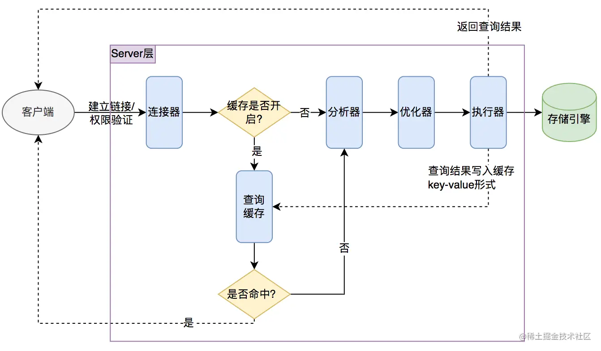
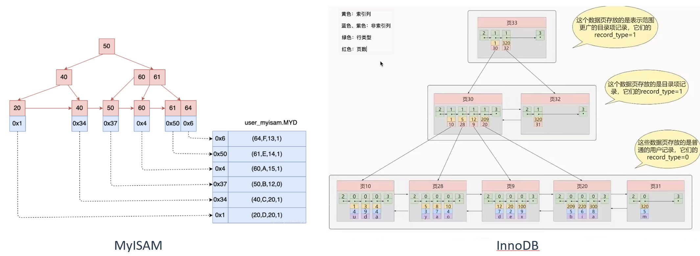
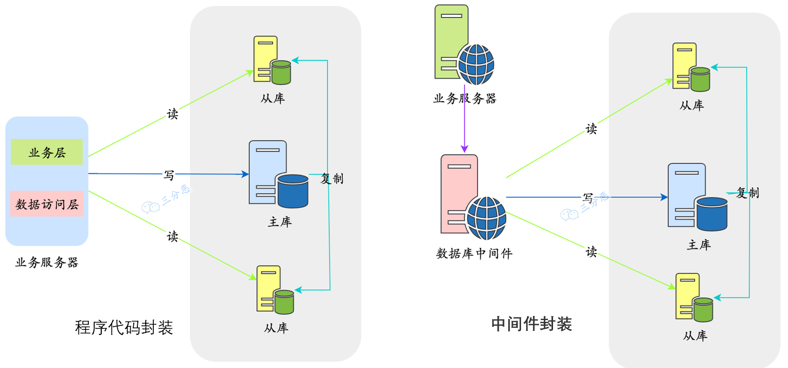

# MySQL 补充

```sql
CREATE DATABASE database_name;
DROP DATABASE database_name;
USE database_name;
CREATE TABLE table_name (
    column1 datatype,
    ...
);
DROP TABLE table_name;
SHOW TABLES;
DESCRIBE table_name;
ALTER TABLE table_name ADD column_name datatype;
INSERT INTO table_name (column1, ...) VALUES (value1, ...);
SELECT column_names FROM table_name WHERE condition;
UPDATE table_name SET column1 = value1 WHERE condition;
DELETE FROM table_name WHERE condition;
CREATE INDEX index_name ON table_name (column_name);
ALTER TABLE table_name ADD PRIMARY KEY (column_name);
ALTER TABLE table_name ADD CONSTRAINT fk_name FOREIGN KEY (column_name) REFERENCES parent_table (parent_column_name);
```

## 数据类型

varchar与char：

**char**：

- char 表示定长字符串，长度是固定的；
- 如果插入数据的长度小于 char 的固定长度时，则用空格填充；
- 因为长度固定，所以存取速度要比 varchar 快很多，甚至能快 50%，但正因为其长度固定，所以会占据多余的空间，是空间换时间的做法；
- 对于 char 来说，最多能存放的字符个数为 255，和编码无关

**varchar**：

- varchar 表示可变长字符串，长度是可变的；
- 插入的数据是多长，就按照多长来存储；
- varchar 在存取方面与 char 相反，它存取慢，因为长度不固定，但正因如此，不占据多余的空间，是时间换空间的做法；
- 对于 varchar 来说，最多能存放的字符个数为 65532

日常的设计，对于长度相对固定的字符串，可以使用 char，对于长度不确定的，使用 varchar 更合适一些。

------

blob 和 text 有什么区别？ blob 用于存储二进制数据，而 text 用于存储大字符串。 blob 没有字符集，text 有一个字符集，并且根据字符集的校对规则对值进行排序和比较

------

DATETIME 和 TIMESTAMP 的异同？ 

相同点： 两个数据类型存储时间的表现格式一致。均为 YYYY-MM-DD HH:MM:SS 两个数据类型都包含「日期」和「时间」部分。 两个数据类型都可以存储微秒的小数秒（秒后 6 位小数秒）

DATETIME 和 TIMESTAMP 的区别

1. **日期范围**：DATETIME 的日期范围是 `1000-01-01 00:00:00.000000` 到 `9999-12-31 23:59:59.999999`；TIMESTAMP 的时间范围是`1970-01-01 00:00:01.000000` UTC 到 `2038-01-09 03:14:07.999999` UTC
2. **存储空间**：DATETIME 的存储空间为 8 字节；TIMESTAMP 的存储空间为 4 字节
3. **时区相关**：DATETIME 存储时间与时区无关；TIMESTAMP 存储时间与时区有关，显示的值也依赖于时区
4. **默认值**：DATETIME 的默认值为 null；TIMESTAMP 的字段默认不为空(not null)，默认值为当前时间(CURRENT_TIMESTAMP)

------

货币用什么字段类型比较好？ 

货币在数据库中 MySQL 常用 Decimal 和 Numric 类型表示，这两种类型被 MySQL 实现为同样的类型。DECIMAL 和 NUMERIC 值作为字符串存储，而不是作为二进制浮点数，以便保存那些值的小数精度。 之所以不使用 float 或者 double 的原因：因为 float 和 double 是以二进制存储的，所以有一定的误差

------

怎么存储 emoji?

 MySQL 的 utf8 字符集仅支持最多 3 个字节的 UTF-8 字符，但是 emoji 表情（😊）是 4 个字节的 UTF-8 字符，所以在 MySQL 中存储 emoji 表情时，需要使用 utf8mb4 字符集。MySQL 8.0 已经默认支持 utf8mb4 字符集

## 查询

in 和 exists 的区别？

MySQL 中的 in 语句是把外表和内表作 hash 连接，而 exists 语句是对外表作 loop 循环，每次 loop 循环再对内表进行查询。我们可能认为 exists 比 in 语句的效率要高，这种说法其实是不准确的，要区分情景：

1. 如果查询的两个表大小相当，那么用 in 和 exists 差别不大。
2. 如果两个表中一个较小，一个是大表，则子查询表大的用 exists，子查询表小的用 in。
3. not in 和 not exists：如果查询语句使用了 not in，那么内外表都进行全表扫描，没有用到索引；而 not extsts 的子查询依然能用到表上的索引。所以无论那个表大，用 not exists 都比 not in 要快。

------

count(1)、count(*) 与 count(列名) 的区别？

- count(*)包括了所有的列，相当于行数，在统计结果的时候，不会忽略列值为 NULL
- count(1)用 1 代表代码行，在统计结果的时候，不会忽略列值为 NULL
- count(列名)只包括列名那一列，在统计结果的时候，会忽略列值为空（这里的空不是只空字符串或者 0，而是表示 null）的计数，即某个字段值为 NULL 时，不统计。

**执行速度**：

- 如果表多个列并且没有主键，则 count（1） 的执行效率优于 count（*）
- 如果有主键，则 select count（主键）的执行效率是最优的
- 如果表只有一个字段，则 select count（*）最优

------

查询执行顺序：


## 基础架构


MySQL 逻辑架构图主要分三层：

- 客户端：最上层的服务并不是 MySQL 所独有的，大多数基于网络的客户端/服务器的工具或者服务都有类似的架构。比如连接处理、授权认证、安全等等。
- Server 层：大多数 MySQL 的核心服务功能都在这一层，包括查询解析、分析、优化、缓存以及所有的内置函数（例如，日期、时间、数学和加密函数），所有跨存储引擎的功能都在这一层实现：存储过程、触发器、视图等。
- 存储引擎层：第三层包含了存储引擎。存储引擎负责 MySQL 中数据的存储和提取。Server 层通过 API 与存储引擎进行通信。这些接口屏蔽了不同存储引擎之间的差异，使得这些差异对上层的查询过程透明

执行查询的顺序：



1. 客户端发送 SQL 查询语句到 MySQL 服务器。
2. MySQL 服务器的连接器开始处理这个请求，跟客户端建立连接、获取权限、管理连接。
3. 解析器开始对 SQL 语句进行解析，检查语句是否符合 SQL 语法规则，确保引用的数据库、表和列都存在，并处理 SQL 语句中的名称解析和权限验证。
4. 优化器负责确定 SQL 语句的执行计划，这包括选择使用哪些索引，以及决定表之间的连接顺序等。优化器会尝试找出最高效的方式来执行查询。
5. 执行器会调用存储引擎的 API 来进行数据的读写。
6. MySQL 的存储引擎是插件式的，不同的存储引擎在细节上面有很大不同。例如，InnoDB 是支持事务的，而 MyISAM 是不支持的。之后，会将执行结果返回给客户端
7. 客户端接收到查询结果，完成这次查询请求。

更新语句执行过程：


1. 执行器先找引擎获取 ID=2 这一行。ID 是主键，存储引擎检索数据，找到这一行。如果 ID=2 这一行所在的数据页本来就在内存中，就直接返回给执行器；否则，需要先从磁盘读入内存，然后再返回。
2. 执行器拿到引擎给的行数据，把这个值加上 1，比如原来是 N，现在就是 N+1，得到新的一行数据，再调用引擎接口写入这行新数据。
3. 引擎将这行新数据更新到内存中，同时将这个更新操作记录到 redo log 里面，此时 redo log 处于 prepare 状态。然后告知执行器执行完成了，随时可以提交事务。
4. 执行器生成这个操作的 binlog，并把 binlog 写入磁盘。
5. 执行器调用引擎的提交事务接口，引擎把刚刚写入的 redo log 改成提交（commit）状态，更新完成。

## 存储引擎

| 功能          | InnoDB | MyISAM | MEMORY |
| ------------- | ------ | ------ | ------ |
| 支持事务      | Yes    | No     | No     |
| 支持全文索引  | Yes    | Yes    | No     |
| 支持 B+树索引 | Yes    | Yes    | Yes    |
| 支持哈希索引  | Yes    | No     | Yes    |
| 支持外键      | Yes    | No     | No     |

- 大多数情况下，使用默认的 InnoDB 就对了，InnoDB 可以提供事务、行级锁等能力。
- MyISAM 适合读更多的场景。
- MEMORY 适合临时表，数据量不大的情况。由于数据都存放在内存，所以速度非常快

InnoDB 和 MyISAM 之间的区别：

- MyISAM：用三种格式的文件来存储，.frm 文件存储表的定义；.MYD 存储数据；.MYI 存储索引。InnoDB：用两种格式的文件来存储，.frm 文件存储表的定义；.ibd 存储数据和索引。
- MyISAM：表级锁，高并发中写操作存在性能瓶颈。InnoDB：行级锁，并发写入性能高。
- MyISAM 为非聚簇索引，索引和数据分开存储，索引保存的是数据文件的指针。InnoDB 为聚簇索引，索引和数据不分开。



## 日志

MySQL 的日志文件主要包括：

- **错误日志**（Error Log）：记录 MySQL 服务器启动、运行或停止时出现的问题。
- **慢查询日志**（Slow Query Log）：记录执行时间超过 long_query_time 值的所有 SQL 语句。这个时间值是可配置的，默认情况下，慢查询日志功能是关闭的。可以用来识别和优化慢 SQL。
- **一般查询日志**（General Query Log）：记录所有 MySQL 服务器的连接信息及所有的 SQL 语句，不论这些语句是否修改了数据。
- **二进制日志**（Binary Log）：记录了所有修改数据库状态的 SQL 语句，以及每个语句的执行时间，如 INSERT、UPDATE、DELETE 等，但不包括 SELECT 和 SHOW 这类的操作。
- **重做日志**（Redo Log）：记录了对于 InnoDB 表的每个写操作，不是 SQL 级别的，而是物理级别的，主要用于崩溃恢复。
- **回滚日志**（Undo Log，或者叫事务日志）：记录数据被修改前的值，用于事务的回滚。

在基础架构一节，我们看到更新语句执行时做了两阶段提交，为什么要两阶段提交呢？直接提交不行吗？

假设我们采用“单阶段”进行提交，即要么先写入 redo log，后写入 binlog；要么先写入 binlog，后写入 redo log。假设在写入第一个日志后崩溃，那么分别用两种日志恢复后的数据库的状态是不一致的。

redo log 的写入不是直接落到磁盘，而是在内存中设置了一片称之为`redo log buffer`的连续内存空间，也就是`redo 日志缓冲区`。在如下的一些情况中，log buffer 的数据会刷入磁盘：

- log buffer 空间不足时
- 事务提交时
- 后台线程输入：有一个后台线程，大约每秒都会刷新一次`log buffer`中的`redo log`到磁盘。
- 正常关闭服务器时
- 触发 checkpoint 规则：重做日志缓存、重做日志文件都是以块（block）的方式进行保存的，称之为重做日志块（redo log block），它的写入方式是从头到尾开始写，写到末尾又回到开头循环写。

## 索引

数据库文件是存储在磁盘上的，磁盘 I/O 是数据库操作中最耗时的部分之一。没有索引时，数据库会进行全表扫描（Sequential Scan），这意味着它必须读取表中的每一行数据来查找匹配的行（时间效率为 O(n)）。当表的数据量非常大时，就会导致大量的磁盘 I/O 操作。

索引就好像书的目录，通过目录去查找对应的章节内容会比一页一页的翻书快很多。有了索引，就可以直接跳到索引指示的数据位置，而不必扫描整张表，从而大大减少了磁盘 I/O 操作的次数。

MySQL 的 InnoDB 存储引擎默认使用 B+ 树来作为索引的数据结构，而 B+ 树的查询效率非常高，时间复杂度为 O(logN)。InnoDB 存储引擎的主键使用的是聚簇索引，MyISAM 存储引擎不管是主键索引，还是二级索引使用的都是非聚簇索引。

数据库是先建立索引还是先插入数据？ 在 InnoDB 中，如果表定义了主键，那么主键索引就是聚簇索引。如果没有明确指定主键，InnoDB 会自动选择一个唯一索引作为聚簇索引。如果表没有任何唯一索引，InnoDB 将自动生成一个隐藏的行 ID 作为聚簇索引。  所以在 InnoDB 中，数据插入和索引创建（更新）是密不可分的。但是从理论上说：

- **先插入数据再创建索引**：在没有索引的情况下插入数据，数据库不需要在每次插入时更新索引，这会减少插入操作的开销。之后一次性创建索引通常比逐条记录更新索引更快。
- **先创建索引再插入数据**：这种情况下，数据库需要在每次插入新记录时维护索引结构，随着数据量的增加，索引的维护可能会导致额外的性能开销。

### 索引分类

- **主键索引**: 表中每行数据唯一标识的索引，强调列值的唯一性和非空性。当创建表的时候，可以直接指定主键索引
- **唯一索引**: 保证数据列中每行数据的唯一性，但允许有空值。
- **普通索引**: 基本的索引类型，用于加速查询。
- **全文索引**：特定于文本数据的索引，用于提高文本搜索的效率。MySQL可以通过建立全文索引，利用查询关键字和查询列内容之间的相关度进行检索，可以利用全文索引来提高匹配的速度。比如实现全匹配模糊查询。 但是实际场景测试mysql的全文索引性能非常不稳定，不建议生产环境使用。需要使用全文检索的地方，还是推荐使用Elasticsearch 
- **空间索引** （Spatial indexes） 空间索引使用R树，R树是用于索引多维数据的专用数据结构。
- **辅助索引**：非主键列作为索引key，但是这里需注意的是辅助索引的叶子节点的data域存放的是该数据记录的主键值而不是数据记录本身，因为使用辅助索引查询的时候需要进行二次查询（第一次查询到数据记录的主键值，第二次根据主索引查询到实际的数据记录） 
- **覆盖索引**：指在辅助索引里面，叶子节点的data域存放的是数据记录本身，不用二次查询
  
- **联合索引/复合索引**：在where查询中出现多个字段判断时加速。联合索引在 B+ 树中是复合的数据结构，按照从左到右的顺序依次建立搜索树的 (例如name 在左边，age 在右边，name 是有序的，age 是无序的。当 name 相等的时候，age 才有序，但如果查询条件没有 name，就不知道应该怎么查了，因为 name 是 B+树中的前置条件，没有 name，索引就派不上用场了)
  
- **B+树索引**：最常见的索引类型，一种将索引值按照一定的算法，存入一个树形的数据结构中（二叉树），每次查询都从树的根节点开始，一次遍历叶子节点，找到对应的值。查询效率是 O(logN)。
- **Hash 索引**：基于哈希表的索引，查询效率可以达到 O(1)，但是**只适合 = 和 in 查询**，不适合范围查询。InnoDB 存储引擎内部使用了一种名为“自适应哈希索引”（Adaptive Hash Index, AHI）的技术。自适应哈希索引并不是由用户显式创建的，而是 InnoDB 根据数据访问的模式自动建立和管理的。当 InnoDB 发现某个索引被频繁访问时，会在内存中创建一个哈希索引，以加速对这个索引的访问。
- **聚簇索引**：将数据存储与索引放到了一块，找到索引也就找到了数据，不需要根据主键或行号去进行回表查询。
- **非聚簇索引**：就是指B+Tree的叶子节点上的data，并不是数据本身，而是数据存放的地址。

### 索引注意点

①、选择合适的列作为索引

- 经常作为查询条件（WHERE 子句）、排序条件（ORDER BY 子句）、分组条件（GROUP BY 子句）的列是建立索引的好候选。
- 区分度低的字段，例如性别，不要建索引
- 频繁更新的字段，不要作为主键或者索引
- 不建议用无序的值(例如身份证、UUID )作为索引，当主键具有不确定性，会造成叶子节点频繁分裂，出现磁盘存储的碎片化

②、避免过多的索引

- 每个索引都需要占用额外的磁盘空间。
- 更新表（INSERT、UPDATE、DELETE 操作）时，所有的索引都需要被更新，会降低更新表的效率
- 维护索引文件需要成本；还会导致页分裂，IO 次数增多。

③、利用前缀索引和索引列的顺序

- 适当使用前缀索引可以降低索引的空间占用，提高索引的查询效率。比如，邮箱的后缀一般都是固定的`@xxx.com`，那么类似这种后面几位为固定值的字段就非常适合定义为前缀索引：`alter table test add index index2(email(6));`
- 在创建复合索引时，应该根据查询条件将最常用作过滤条件的列放在前面。`alter table messages add index index3(sender_id,receiver_id,is_read);`

### 索引失效

- **在索引列上使用函数或表达式**：如果在查询中对索引列使用了函数或表达式，那么索引可能无法使用，因为数据库无法预先计算出函数或表达式的结果。例如：`SELECT * FROM table WHERE YEAR(date_column) = 2021`。
- 使用不等于（`<>`）或者 NOT 操作符：这些操作符通常会使索引失效，因为它们会扫描全表。
- **使用 LIKE 操作符，但是通配符在最前面**：如果 LIKE 的模式串是以“%”或者“_”开头的，那么索引也无法使用。例如：`SELECT * FROM table WHERE column LIKE '%abc'`。
- **OR 操作符**：如果查询条件中使用了 OR，并且 OR 两边的条件分别涉及不同的索引，那么这些索引可能都无法使用。
- 如果 MySQL 估计使用全表扫描比使用索引更快时（通常是小表或者大部分行都满足 WHERE 子句），也不会使用索引。
- 联合索引不满足最左前缀原则时，索引会失效。
- **数据表较小**：当表中的数据量很小，或者查询需要扫描表中大部分数据时，数据库优化器可能会选择全表扫描而不是使用索引。在这种情况下，维护索引的开销可能大于其带来的性能提升。
- **频繁更新的列**：对于经常进行更新、删除或插入操作的列，使用索引可能会导致性能下降。因为每次数据变更时，索引也需要更新，这会增加额外的写操作负担

### 基于B树和B+树的索引

MySQL 的默认存储引擎是 InnoDB，它采用的是 B+树索引，B+树是一种自平衡的多路查找树，和红黑树、二叉平衡树不同，B+树的每个节点可以有 m 个子节点，而红黑树和二叉平衡树都只有 2 个。因为相比二叉平衡树更矮，B+树磁盘IO次数少，执行快。

内存和磁盘在进行 IO 读写的时候，有一个最小的逻辑单元，叫做页（Page），页的大小一般是 4KB。B 树的节点大小通常与页的大小对齐，这样每次从磁盘加载一个节点时，可以正好是一个页的大小。

和 B 树不同，B+树的非叶子节点只存储键值，不存储数据，而叶子节点存储了所有的数据，并且构成了一个有序链表。B+树的叶子节点是通过双向链表连接的，这样可以方便范围查询和反向遍历。

这样做的好处是，非叶子节点上由于没有存储数据，就可以存储更多的键值对，再加上叶子节点构成了一个有序链表，范围查询时就可以直接通过叶子节点间的指针顺序访问整个查询范围内的所有记录，而无需对树进行多次遍历。查询的效率会更高。

在查找单条数据时，B 树的查询效率可能会更高，因为每个节点都存储数据，所以最好情况就是 O(1)。而 B+ 树的叶子节点之间有指针链接，所以适合做范围查询。MySQL 属于关系型数据库，所以范围查询会比较多，所以采用了 B+树；但 MongoDB 属于非关系型数据库，在大多数情况下，只需要查询单条数据，所以 MongoDB 选择了 B 树。

理论上，在 InnoDB 存储引擎中，B+树的高度一般为 2-4 层，就可以满足千万级数据的存储。查找数据的时候，一次页的查找代表一次 IO，当我们通过主键索引查询的时候，最多只需要 2-4 次 IO 就可以了。


> 主键 ID 是 bigint 类型，长度为 8 个字节。指针大小在 InnoDB 源码中设置为 6 字节，这样一共是 14 字节。默认页大小是 16k，所以非叶子节点（一页）可以存储 16384/14=1170 个这样的单元(键值+指针)。
>
> 假设一行数据的大小为 1KB，那么一页的叶子节点就可以存储 16 条数据。对于 3 层的 B+树，第一层叶子节点数*第二层叶子节点数*一页能够存储的数据量 = `1170*1170*16 = 21902400` 条数据。

## SQL优化

影响 SQL 执行效率的因素有：

①、IO 成本

- 数据量：数据量越大，IO 成本越高。所以要避免 `select *`；尽量分页查询。
- 数据从哪读取：尽量通过索引加快查询。

②、CPU 成本

- 尽量避免复杂的查询条件，如有必要，考虑对子查询结果进行过滤。
- 尽量缩减计算成本，比如说为排序字段加上索引，提高排序效率；比如说使用 union all 替代 union，减少去重处理。

定位慢 SQL 主要通过两种手段：

- **慢查询日志**：开启 MySQL 慢查询日志，再通过一些工具比如 mysqldumpslow 去分析对应的慢查询日志，找出问题的根源。

- **服务监控**：可以在业务的基建中加入对慢 SQL 的监控，常见的方案有字节码插桩、连接池扩展、ORM 框架过程，对服务运行中的慢 SQL 进行监控和告警。

- 也可以使用 `show processlist;` 查看当前正在执行的 SQL 语句，找出执行时间较长的 SQL。

找到对应的慢 SQL 后，使用 EXPLAIN 命令查看 MySQL 是如何执行 SQL 语句的，这会帮助我们找到问题的根源。

具体优化方法：

- 比如说尽量避免使用 `select *`，只查询需要的列，减少数据传输量。
- 在分页时，当数据量巨大时，传统的`LIMIT`和`OFFSET`可能会导致性能问题，因为数据库需要扫描`OFFSET + LIMIT`数量的行。
  - 延迟关联：在join之前通过子查询提前进行分页查询，仅获取需要的行的 ID
  - 书签方法通过记住上一次查询返回的最后一行的某个值，然后下一次查询从这个值开始，避免了扫描大量不需要的行。`WHERE id > last_max_id LIMIT 20;` 
- 正确地使用索引可以显著减少 SQL 的查询时间，通常可以从索引覆盖、避免使用 `!=` 或者 `<>` 操作符、适当使用前缀索引、避免列上函数运算、正确使用联合索引等方面进行优化。
- 对于 JOIN 操作，可以通过优化子查询、小表驱动大表、适当增加冗余字段、避免 join 太多表等方式来进行优化。
  - 子查询，特别是在 select 列表和 where 子句中的子查询，往往会导致性能问题，因为它们可能会为每一行外层查询执行一次子查询。使用 JOIN 代替子查询
  - 在执行 JOIN 操作时，应尽量让行数较少的表（小表）驱动行数较多的表（大表），这样可以减少查询过程中需要处理的数据量。
  - 在某些情况下，通过在表中适当增加冗余字段（不完全遵守数据库范式）来避免 JOIN 操作，可以提高查询效率，尤其是在高频查询的场景下。
  - 不要使用 join 关联太多的表，最多不要超过 3 张表。
- MySQL 生成有序结果的方式有两种：一种是对结果集进行排序操作，另外一种是按照索引顺序扫描得出的自然有序结果。如果待排序字段上有索引，那么 MySQL 可以直接利用索引的有序性，避免排序操作
- 条件下推，指将 where、limit 等子句下推到 union 的各个子查询中，以便优化器可以充分利用这些条件进行优化。

## 锁

- 表锁：开销小，加锁快；锁定力度大，发生锁冲突概率高，并发度最低;不会出现死锁。
- 行锁：开销大，加锁慢；会出现死锁；锁定粒度小，发生锁冲突的概率低，并发度高。
- 页锁：开销和加锁速度介于表锁和行锁之间；会出现死锁；锁定粒度介于表锁和行锁之间，并发度一般
- 共享锁（S Lock）,也叫读锁（read lock），相互不阻塞。
- 排他锁（X Lock），也叫写锁（write lock），排它锁是阻塞的，在一定时间内，只有一个请求能执行写入，并阻止其它锁读取正在写入的数据。

### 行锁实现

**记录锁**就是直接锁定某行记录。当我们使用唯一性的索引(包括唯一索引和聚簇索引)进行等值查询且精准匹配到一条记录时，此时就会直接将这条记录锁定。例如`select * from t where id =6 for update;`就会将`id=6`的记录锁定。


**间隙锁**(Gap Locks) 的间隙指的是两个记录之间逻辑上尚未填入数据的部分,是一个**左开右开空间**。间隙锁就是锁定某些间隙区间的。当我们使用用等值查询或者范围查询，并且没有命中任何一个`record`，此时就会将对应的间隙区间锁定。例如`select * from t where id =3 for update;`或者`select * from t where id > 1 and id < 6 for update;`就会将(1,6)区间锁定。


**临键锁**就是记录锁(Record Locks)和间隙锁(Gap Locks)的结合，即除了锁住记录本身，还要再锁住索引之间的间隙。组成的**左开右闭区间**。当我们使用范围查询，并且命中了部分`record`记录，此时锁住的就是临键区间。

mysql 默认行锁类型就是`临键锁(Next-Key Locks)`。当使用唯一性索引，等值查询匹配到一条记录的时候，临键锁(Next-Key Locks)会退化成记录锁；没有匹配到任何记录的时候，退化成间隙锁。

一个事务在插入一条记录时需要判断一下插入位置是不是被别的事务加了意向锁 ，如果有的话，插入操作需要等待，直到拥有 gap 锁 的那个事务提交。但是事务在等待的时候也需要在内存中生成一个 锁结构 ，表明有事务想在某个 间隙 中插入新记录，但是现在在等待。这种类型的锁命名为 Insert Intention Locks ，也就是**插入意向锁** 。

### 意向锁

**意向锁**是一个表级锁，不要和插入意向锁搞混。它解决的是表锁和行锁共存的问题。当我们需要给一个表加表锁的时候，我们需要根据去判断表中有没有数据行被锁定，以确定是否能加成功。

- 假如没有意向锁，那么我们就得遍历表中所有数据行来判断有没有行锁；
- 有了意向锁这个表级锁之后，则我们直接判断一次就知道表中是否有数据行被锁定了。


### 排查死锁

1. 查看死锁日志 show engine innodb status;
2. 找出死锁 sql
3. 分析 sql 加锁情况
4. 模拟死锁案发
5. 分析死锁日志
6. 分析死锁结果

## 事务

- **原子性**：事务的所有操作要么全部提交成功，要么全部失败回滚，对于一个事务中的操作不能只执行其中一部分。
- **一致性**：事务应确保数据库的状态从一个一致状态转变为另一个一致状态。一致性与业务规则有关，比如银行转账，不论事务成功还是失败，转账双方的总金额应该是不变的。
- **隔离性**：多个并发事务之间需要相互隔离，即一个事务的执行不能被其他事务干扰。
- **持久性**：一旦事务提交，则其所做的修改将永久保存到数据库中。即使发生系统崩溃，修改的数据也不会丢失。

MySQL 通过事务、undo log、redo log 来确保 ACID

- **原子性**：当事务开始时，MySQL 会在`undo log`中记录事务开始前的旧值。如果事务执行失败，MySQL 会使用`undo log`中的旧值来回滚事务开始前的状态；如果事务执行成功，MySQL 会在某个时间节点将`undo log`删除
- 如果其他三个特性都得到了保证，那么**一致性**（Consistency）就自然而然得到保证了。
- MySQL 定义了多种隔离级别，通过 MVCC 来确保每个事务都有专属自己的数据版本，从而实现**隔离性**（Isolation）。
- redo log 是一种物理日志，当执行写操作时，MySQL 会先将更改记录到 redo log 中。当 redo log 填满时，MySQL 再将这些更改写入数据文件中。如果 MySQL 在写入数据文件时发生崩溃，可以通过 redo log 来恢复数据文件，从而确保**持久性**（Durability）。

### 并发问题分类

**脏读**指的是一个事务能够读取另一个事务尚未提交的数据。如果读到的数据在之后被回滚了，那么第一个事务读取到的就是无效的数据。

```sql
-- 事务 A
START TRANSACTION;
UPDATE employees SET salary = 5000 WHERE id = 1;

-- 事务 B
START TRANSACTION;
SELECT salary FROM employees WHERE id = 1;  -- 读取到 salary = 5000 (脏读)
ROLLBACK;
```

**不可重复**读指的是在同一事务中执行相同的查询时，返回的结果集不同。这是由于在事务过程中，另一个事务修改了数据并提交。

```sql
-- 事务 A
START TRANSACTION;
SELECT salary FROM employees WHERE id = 1;  -- 读取到 salary = 3000

-- 事务 B
START TRANSACTION;
UPDATE employees SET salary = 5000 WHERE id = 1;
COMMIT;

-- 事务 A 再次读取
SELECT salary FROM employees WHERE id = 1;  -- 读取到 salary = 5000 (不可重复读)
COMMIT;
```

**幻读**指的是在同一事务中执行相同的查询时，返回的结果集中出现了之前没有的数据行。这是因为在事务过程中，另一个事务插入了新的数据并提交。

```sql
-- 事务 A
START TRANSACTION;
SELECT * FROM employees WHERE department = 'HR';  -- 读取到 10 条记录

-- 事务 B
START TRANSACTION;
INSERT INTO employees (id, name, department) VALUES (11, 'John Doe', 'HR');
COMMIT;

-- 事务 A 再次查询
SELECT * FROM employees WHERE department = 'HR';  -- 读取到 11 条记录 (幻读)
COMMIT;
```

### 隔离级别

- **读未提交**：是最低的隔离级别
- **读已提交**：当前事务只能读取已经被其他事务提交的数据，
- **可重复读**：确保在同一事务中多次读取相同记录的结果是一致的，即使其他事务对这条记录进行了修改，也不会影响到当前事务。是MySQL 默认的隔离级别
- **串行化**：最高的隔离级别，通过强制事务串行执行来避免并发问题，但会导致大量的超时和锁竞争问题

| 隔离级别                   | 脏读 | 不可重复读 | 幻读 |
| -------------------------- | ---- | ---------- | ---- |
| Read Uncommited 读取未提交 | 是   | 是         | 是   |
| Read Commited 读取已提交   | 否   | 是         | 是   |
| Repeatable Read 可重复读   | 否   | 否         | 是   |
| Serialzable 可串行化       | 否   | 否         | 否   |

读已提交和可重复读通过 MVCC 机制中的 ReadView 来实现。

- READ COMMITTED：每次读取数据前都生成一个 ReadView，保证每次读操作都是最新的数据。
- REPEATABLE READ：只在第一次读操作时生成一个 ReadView，后续读操作都使用这个 ReadView，保证事务内读取的数据是一致的。

串行化的实现：事务在读操作时，必须先加表级共享锁，直到事务结束才释放；事务在写操作时，必须先加表级排他锁，直到事务结束才释放。

> 例子：当两个事务 A 和 B 并发修改同一个变量时，A 事务读取到的值取决于多个因素，包括事务的隔离级别、事务的开始时间和提交时间等。
>
> - 读未提交：在这个级别下，事务可以看到其他事务尚未提交的更改。如果 B 更改了一个变量但尚未提交，A 可以读到这个更改的值。
> - 读提交：A 只能看到 B 提交后的更改。如果 B 还没提交，A 将看到更改前的值。
> - 可重复读：在事务开始后，A 总是读取到变量的相同值，即使 B 在这期间提交了更改。这是通过 MVCC 机制实现的。
> - 可串行化：A 和 B 的操作是串行执行的，如果 A 先执行，那么 A 读到的值就是 B 提交前的值；如果 B 先执行，那么 A 读到的值就是 B 提交后的值。

### MVCC

MVCC 是多版本并发控制（Multi-Version Concurrency Control）的简称，主要用来解决数据库并发问题。

在传统的锁机制中，如果一个事务正在写数据，那么其他事务必须等待写事务完成才能读数据。

MVCC 允许读操作访问数据的一个旧版本快照，同时写操作创建一个新的版本，这样读写操作就可以并行进行，不必等待对方完成，并且能够无阻塞地执行查询和修改操作，而不会相互干扰。

在 MySQL 中，特别是 InnoDB 存储引擎，MVCC 是通过版本链和 ReadView 机制来实现的

关于**版本链**，在 InnoDB 中，每一行数据都有两个隐藏的列：一个是 DB_TRX_ID，另一个是 DB_ROLL_PTR。当事务更新一行数据时，InnoDB 不会直接覆盖原有数据，而是创建一个新的数据版本，并更新 DB_TRX_ID 和 DB_ROLL_PTR，使得它们指向前一个版本和相关的 undo 日志。这样，老版本的数据不会丢失，可以通过版本链找到。


## 高可用

### 读写分离

**读写分离**：将数据库读写操作分散到不同的节点上。数据库主机负责读写操作，从机只负责读操作。数据库主机通过复制将数据同步到从机，每台数据库服务器都存储了所有的业务数据。

关于读写分离的具体实现：

- **程序代码封装**：指在代码中抽象一个数据访问层（所以有的文章也称这种方式为 "中间层封装" ） ，实现读写操作分离和数据库服务器连接的管理。
- **中间件封装**：指的是独立一套系统出来，实现读写操作分离和数据库服务器连接的管理。中间件对业务服务器提供 SQL 兼容的协议，业务服务器无须自己进行读写分离。对于业务服务器来说，访问中间件和访问数据库没有区别，事实上在业务服务器看来，中间件就是一个数据库服务器。



### 主从复制

**主从复制**（Master-Slave Replication）：一种数据同步机制，用于将数据从一个主数据库（master）复制到一个或多个从数据库（slave）。广泛用于数据备份、灾难恢复和数据分析等场景。


主要步骤有：

- 在主服务器上，所有修改数据的语句（如 INSERT、UPDATE、DELETE）会被记录到二进制日志中。
- 主服务器上的一个线程（二进制日志转储线程）负责读取二进制日志的内容并发送给从服务器。
- 从服务器接收到二进制日志数据后，会将这些数据写入自己的中继日志（Relay Log）。中继日志是从服务器上的一个本地存储。
- 从服务器上有一个 SQL 线程会读取中继日志，并在本地数据库上执行，从而将更改应用到从数据库中，完成同步。

读写分离时主从同步延迟的解决办法：

- 读从机失败后再读一次主机，不足之处在于如果有很多二次读取，将大大增加主机的读操作压力。
- 关键业务读写操作全部指向主机，非关键业务采用读写分离。

### 分库分表

分库分表是为了解决单库单表数据量过大导致数据库性能下降的一种解决方案。业界流传的说法是超过 500 万的数据量就要考虑分表了。

- 垂直分库：按照业务模块将不同的表拆分到不同的库中，例如，用户表、订单表、商品表等分到不同的库中。
- 水平分库：按照一定的策略将一个表中的数据拆分到多个库中，例如，按照用户 id 的 hash 值将用户表拆分到不同的库中。
- 类似的，垂直拆分和水平拆分表


为了实现水平分表，需要设计合适的路由策略来确定数据应该存储在哪个表中：

- **范围路由**是根据某个字段的值范围进行分表。例如0到10000，10000到20000
- **哈希路由**是通过对分片键进行哈希计算，然后取模来确定数据存储的表。
- **配置路由**是通过配置表来确定数据存储的表，适用于分片键不规律的场景。

带来的问题：

- 分库之后单机事务就用不上了，必须使用分布式事务来解决。
- 在一个库中的时候我们还可以利用 JOIN 来连表查询，而跨库了之后就无法使用 JOIN 了。还有跨节点的 count,order by,group by 以及聚合函数问题
- 数据库表被切分后，不能再依赖数据库自身的主键生成机制，所以需要一些手段来保证全局主键唯一。

### 不停机扩容

**第一阶段：在线双写，查询走老库**

1. 建立好新的库表结构，数据写入久库的同时，也写入拆分的新库
2. 数据迁移，使用数据迁移程序，将旧库中的历史数据迁移到新库
3. 使用定时任务，新旧库的数据对比，把差异补齐

**第二阶段：在线双写，查询走新库**

1. 完成了历史数据的同步和校验
2. 把对数据的读切换到新库

**第三阶段**：**旧库下线**

1. 旧库不再写入新的数据
2. 经过一段时间，确定旧库没有请求之后，就可以下线老库

## 其他

百万级别以上的数据如何删除？由于索引需要额外的维护成本，所以我们想要删除百万数据的时候可以先删除索引，删除完成后重新创建索引创建索引

百万千万级大表如何添加字段？**方法一**：创建一个临时的新表，把旧表的结构完全复制过去，添加字段，再把旧表数据复制过去，删除旧表，新表命名为旧表的名称，这种方式可能回丢掉一些数据。**方法二**：如果一张表数据量大且是热表（读写特别频繁），则可以考虑先在从库添加，再进行主从切换，切换后再将其他几个节点上添加字段。

MySQL 数据库 cpu 飙升的话，要怎么处理呢？排查过程：

1. 使用 top 命令观察，确定是 mysqld 导致还是其他原因。
2. 如果是 mysqld 导致的，show processlist，查看 session 情况，确定是不是有消耗资源的 sql 在运行。
3. 找出消耗高的 sql，看看执行计划是否准确， 索引是否缺失，数据量是否太大。进行相应的调整 (比如说加索引、改 sql、改内存参数)
4. 也有可能是每个 sql 消耗资源并不多，但是突然之间，有大量的 session 连进来导致 cpu 飙升，这种情况就需要跟应用一起来分析为何连接数会激增

